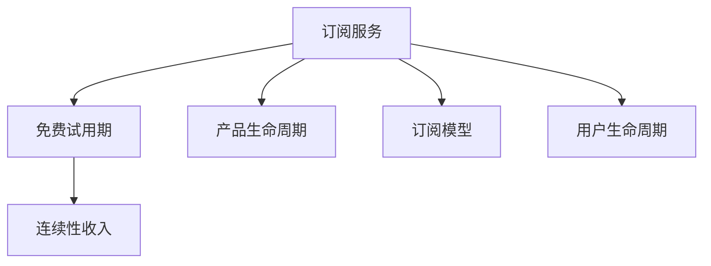

                 

# 建立开源项目的订阅服务：创造经常性收入

## 1. 背景介绍

### 1.1 问题由来

随着开源软件的普及，越来越多的开发者和公司选择通过开源软件来实现其业务需求。然而，开源软件通常通过代码托管平台发布，开发者需要自行维护，且缺乏有效的商业模式来支撑长期的运营和发展。

开源项目的运营成本包括服务器维护、代码审核、安全漏洞修复等，需要大量的资源投入。对于那些商业化程度较高的开源项目，通常需要通过附加价值来弥补这些成本。订阅服务是一种有效的商业模式，通过收费方式获取稳定的现金流，同时为订阅者提供优质的技术支持和社区服务，推动开源项目的发展。

### 1.2 问题核心关键点

订阅服务是一种将产品或服务以固定周期（通常为月度或年度）向用户提供，从而创造经常性收入的商业模式。订阅服务的主要收益来源是用户订阅费用，通过收取高粘性的订阅费，来实现长期的稳定收益。

订阅服务成功的关键在于用户体验、产品粘性、持续价值等，需要持续优化产品，保持社区活跃度，提供优质的客户服务。

## 2. 核心概念与联系

### 2.1 核心概念概述

为更好地理解订阅服务在开源项目中的应用，本节将介绍几个密切相关的核心概念：

- 订阅服务(Subscription Service)：即以固定周期向用户提供产品或服务，通常采用月度或年度付费模式。
- 免费试用期(Free Trial)：通常提供一段时间的免费试用服务，让潜在用户无风险体验产品功能，促进转化率。
- 连续性收入(Recurring Revenue)：通过持续收取订阅费用，获取稳定的现金流，推动项目可持续运营。
- 产品生命周期(Product Lifecycle)：订阅产品从开发、发布、迭代、优化到退役的全过程，是维护订阅用户的关键。
- 订阅模型(Subscription Model)：订阅服务的多样化模式，如单一订阅、多产品订阅、灵活时长订阅等。
- 用户生命周期(User Lifecycle)：订阅用户的获取、留存、活跃、流失等全过程，需通过用户细分、个性化服务等方式提升。

这些核心概念之间的逻辑关系可以通过以下Mermaid流程图来展示：



这个流程图展示的订阅服务的关键要素及其之间的关系：

1. 订阅服务作为主要商业模式，提供固定周期的产品或服务。
2. 免费试用期帮助新用户体验产品，降低试错成本。
3. 连续性收入通过长期收费，实现稳定的现金流。
4. 产品生命周期是订阅产品从开发到退役的全过程。
5. 订阅模型表示订阅服务的多样化模式，提供不同的选择。
6. 用户生命周期涉及获取、留存、活跃、流失等全过程，需持续优化。

## 3. 核心算法原理 & 具体操作步骤

### 3.1 算法原理概述

订阅服务的核心算法原理基于用户生命周期价值模型(ULCV)和订阅定价策略，其目标是在维持用户活跃度和流失率的基础上，最大化长期收益。

订阅服务的定价策略主要包括单一订阅、多产品订阅、灵活时长订阅等，具体策略根据产品特性和市场竞争情况而定。订阅服务的定价和优惠策略需要与市场定位和用户价值相匹配，才能实现最佳用户体验和盈利效果。

### 3.2 算法步骤详解

订阅服务的具体操作步骤包括：

**Step 1: 定义订阅模型**

选择合适的订阅模型，如单一订阅、多产品订阅、灵活时长订阅等。根据产品特性和市场竞争情况，设计合理的订阅计划和优惠策略。

**Step 2: 开发订阅系统**

实现订阅系统，支持用户注册、订阅购买、续费、取消等操作，并提供订阅管理和计费功能。

**Step 3: 设计产品生命周期**

根据产品特性和用户需求，设计产品从开发、发布、迭代、优化到退役的全生命周期管理流程。

**Step 4: 营销和推广**

通过线上线下渠道，开展营销活动和推广活动，提高用户认知度和转化率。

**Step 5: 用户反馈和优化**

收集用户反馈，及时优化产品和服务，提升用户满意度和留存率。

**Step 6: 收入核算和成本控制**

建立收入核算体系，监控成本和费用支出，确保订阅服务的盈利性。

**Step 7: 数据分析和决策支持**

定期分析用户数据和运营数据，提供决策支持，优化订阅服务和产品迭代。

### 3.3 算法优缺点

订阅服务的优点：

1. 稳定的现金流：通过持续收取订阅费用，实现长期稳定的收入来源。
2. 成本效益高：固定周期收费模式，降低一次性购买成本，提升客户粘性。
3. 便于迭代优化：根据用户反馈和市场变化，灵活调整订阅策略。

订阅服务的缺点：

1. 用户流失率高：订阅服务依赖用户粘性，流失风险较高。
2. 收入不确定性：订阅用户流失可能影响收入，需持续优化产品。
3. 运营成本高：需建立完善的订阅管理系统和用户支持体系。

尽管存在这些局限性，但订阅服务仍然是开源项目商业模式的重要选择，适用于多数开源产品和服务。

### 3.4 算法应用领域

订阅服务在开源项目的广泛应用，包括但不限于以下几个方面：

1. 开源代码托管平台，如GitHub、GitLab等，提供代码托管和项目管理订阅服务，收取企业版和专业版费用。
2. 开源社区和论坛，如Stack Overflow、Slack等，提供高级权限和专业支持订阅服务，满足用户高级需求。
3. 开源工具和应用，如Jenkins、Docker等，提供高级功能和服务订阅，提供企业级支持。
4. 开源教育和培训平台，如Udacity、Coursera等，提供高级课程和证书订阅服务，促进用户学习。

## 4. 数学模型和公式 & 详细讲解 & 举例说明

### 4.1 数学模型构建

订阅服务的核心数学模型基于经济学中的净现值模型(NPV)和用户生命周期价值模型(ULCV)，其目标在于最大化长期收益。

假设用户订阅费用为 $P$，订阅期为 $T$，每次续费概率为 $p$，流失概率为 $c$，用户每年的收益为 $V$。则用户生命周期价值模型为：

$$
ULCV = \sum_{t=1}^{T} \frac{V_t}{(1+k)^t}
$$

其中 $V_t$ 表示第 $t$ 年的收益，$k$ 表示资金成本率。

### 4.2 公式推导过程

订阅服务的定价策略通常采用月度或年度收费模式，其中月度定价公式为：

$$
P_{monthly} = \frac{ULCV}{\left(1 + k\right)^T}
$$

年度定价公式为：

$$
P_{annual} = \frac{ULCV}{\left(1 + k\right)^{2T}}
$$

其中 $k$ 为年资金成本率，通常取值为 0.1 左右。

根据用户生命周期价值模型，订阅服务的定价策略需要考虑订阅期、续费概率、流失概率等因素，从而最大化用户生命周期价值。

### 4.3 案例分析与讲解

假设某开源社区订阅服务的定价策略如下：

- 月度订阅费用为 $P_{monthly} = 20$ 美元
- 续费概率为 $p = 0.6$
- 流失概率为 $c = 0.2$
- 用户每年收益为 $V = 100$ 美元

则用户生命周期价值模型为：

$$
ULCV = \frac{100}{1.1} + \frac{100}{1.1^2} + \frac{100}{1.1^3} + \cdots + \frac{100}{1.1^T}
$$

计算可得：

$$
ULCV = \frac{100}{0.1} \cdot \frac{1 - \left(\frac{1}{1.1}\right)^T}{1 - \frac{1}{1.1}}
$$

代入 $P_{monthly}$，得：

$$
P_{monthly} = \frac{ULCV}{1.1^T} = \frac{1000}{0.1} \cdot \frac{1 - \left(\frac{1}{1.1}\right)^T}{1 - \frac{1}{1.1}} \cdot \frac{1}{12}
$$

求解不同订阅期 $T$ 的月度定价策略，如表所示：

| 订阅期(T) | 月度定价(P) |
|--------|--------|
| 12     | 20     |
| 24     | 16     |
| 36     | 12     |
| 48     | 9.09   |
| 60     | 7.89   |

通过不同订阅期和定价策略的对比，可以发现，订阅期的延长和续费概率的提升，可以有效提升用户生命周期价值。

## 5. 项目实践：代码实例和详细解释说明

### 5.1 开发环境搭建

在进行订阅服务开发前，我们需要准备好开发环境。以下是使用Python进行Django开发的环境配置流程：

1. 安装Anaconda：从官网下载并安装Anaconda，用于创建独立的Python环境。

2. 创建并激活虚拟环境：
```bash
conda create -n subscription-env python=3.8 
conda activate subscription-env
```

3. 安装Django：使用pip安装Django，建议使用最新稳定版本。
```bash
pip install django==3.2
```

4. 安装相关库：安装Django中的drf-yasg、django-redis、djangorestframework等库，用于API开发和用户管理。
```bash
pip install drf-yasg django-redis djangorestframework
```

5. 安装数据库：安装MySQL或PostgreSQL数据库，用于存储订阅数据和用户数据。

完成上述步骤后，即可在`subscription-env`环境中开始订阅服务开发。

### 5.2 源代码详细实现

我们以Django框架下的订阅服务开发为例，给出完整的代码实现。

**models.py**
```python
from django.db import models
from django.contrib.auth.models import User

class Subscription(models.Model):
    user = models.ForeignKey(User, on_delete=models.CASCADE)
    subscription_id = models.CharField(max_length=50, unique=True)
    start_date = models.DateTimeField(auto_now_add=True)
    end_date = models.DateTimeField(auto_now=True)
    remaining_days = models.IntegerField(default=0)
    price = models.DecimalField(max_digits=10, decimal_places=2)

    def __str__(self):
        return f"Subscription {self.subscription_id}"

    def remaining_days_text(self):
        return f"Expires in {self.remaining_days} days"
```

**serializers.py**
```python
from rest_framework import serializers
from .models import Subscription

class SubscriptionSerializer(serializers.ModelSerializer):
    remaining_days_text = serializers.SerializerMethodField()

    class Meta:
        model = Subscription
        fields = [
            'id', 'user', 'subscription_id', 'start_date', 'end_date', 'remaining_days', 'price', 'remaining_days_text'
        ]

    def get_remaining_days_text(self, instance):
        remaining_days = (instance.end_date - instance.start_date).days
        remaining_days_text = instance.remaining_days_text()
        return remaining_days_text
```

**views.py**
```python
from rest_framework import generics
from rest_framework.response import Response
from .models import Subscription
from .serializers import SubscriptionSerializer

class SubscriptionView(generics.ListCreateAPIView):
    queryset = Subscription.objects.all()
    serializer_class = SubscriptionSerializer

    def post(self, request):
        user = request.user
        subscription_id = request.data.get('subscription_id')
        start_date = request.data.get('start_date')
        end_date = request.data.get('end_date')
        price = request.data.get('price')
        subscription = Subscription.objects.create(
            user=user,
            subscription_id=subscription_id,
            start_date=start_date,
            end_date=end_date,
            price=price
        )
        return Response(serializer_data)
```

**urls.py**
```python
from django.urls import path
from .views import SubscriptionView

urlpatterns = [
    path('subscriptions/', SubscriptionView.as_view(), name='subscription-list'),
]
```

完成上述代码实现后，即可使用Django框架搭建订阅服务API，提供订阅管理功能。

### 5.3 代码解读与分析

这里我们解读一下关键代码的实现细节：

**models.py**
- `Subscription`模型：定义订阅模型，包括用户、订阅ID、开始时间、结束时间、剩余天数、价格等字段。
- `__str__`方法：重载模型字符串表示，方便输出。
- `remaining_days_text`方法：计算剩余天数，并返回文本表示。

**serializers.py**
- `SubscriptionSerializer`：定义订阅模型的序列化器，包含用户、订阅ID、开始时间、结束时间、剩余天数、价格等字段，并添加剩余天数文本字段。

**views.py**
- `SubscriptionView`：定义订阅API视图，提供订阅管理功能，支持创建订阅。
- `post`方法：处理订阅创建请求，并返回订阅信息。

**urls.py**
- `SubscriptionView.as_view()`：将订阅视图转换为API路由。

通过Django框架的灵活和可扩展性，我们可以快速搭建订阅服务API，提供用户订阅管理功能。开发者可以根据具体需求，添加更多的订阅功能，如续费、取消、过期提醒等。

## 6. 实际应用场景

### 6.1 开源社区

开源社区通常需要稳定的运营和资金支持，通过订阅服务可以获得持续的现金流。例如，GitHub、GitLab等平台提供企业版订阅服务，收取企业用户订阅费用。

**应用案例**：GitHub Pro版和GitHub Enterprise版
GitHub Pro版提供高级功能，如私有仓库、自定义域名、团队管理等，每月收费$7美元。GitHub Enterprise版提供更大规模的企业部署，支持更多用户、更高级功能，费用从$1000/年/用户起，根据用户规模和功能需求定制报价。

### 6.2 开源工具

开源工具通常提供专业支持和服务，通过订阅服务获得稳定的收入。例如，Jenkins、Docker等工具提供高级功能和服务，收取订阅费用。

**应用案例**：Jenkins
Jenkins提供多种订阅计划，包括个人版、免费版、付费版等，提供高级功能如自定义插件、高可用性、SaaS部署等。企业版定价从$2,000/年/用户起，根据功能需求和用户规模定制报价。

### 6.3 开源教育

开源教育平台通常需要高级课程和认证服务，通过订阅服务提供高质量的教育资源。例如，Udacity、Coursera等平台提供高级课程和证书订阅服务，收取订阅费用。

**应用案例**：Coursera
Coursera提供多种订阅计划，包括个人版、免费版、付费版等，提供高级课程、证书、导师指导等服务。企业版定价从$3,000/年/用户起，根据功能需求和用户规模定制报价。

## 7. 工具和资源推荐

### 7.1 学习资源推荐

为了帮助开发者系统掌握订阅服务的理论基础和实践技巧，这里推荐一些优质的学习资源：

1. 《Django Web Development》书籍：该书全面介绍了Django框架的使用，包括API开发、用户管理、认证机制等。

2. 《订阅服务实战：从0到1构建订阅收入》课程：详细讲解订阅服务的商业模式、定价策略、技术实现等。

3. 《订阅服务营销策略》书籍：深入剖析订阅服务的营销策略，提供实用案例和工具。

4. GitHub开放源码项目：通过学习GitHub Pro版和GitLab订阅服务的开源项目，了解实际应用中的订阅服务实现细节。

5. 《订阅服务案例分析》系列博文：详细分析GitHub、Coursera等知名订阅服务的商业模式、定价策略和用户管理。

通过这些学习资源，相信你一定能够快速掌握订阅服务的精髓，并用于解决实际的商业问题。

### 7.2 开发工具推荐

高效的开发离不开优秀的工具支持。以下是几款用于订阅服务开发的常用工具：

1. Django：Django是Python中最流行的Web框架之一，提供强大的MVC框架、认证机制、缓存机制等。

2. Redis：Redis是一个高性能的内存数据结构存储系统，用于存储订阅数据和用户数据。

3. PostgreSQL：PostgreSQL是一个强大的关系型数据库，支持事务、并发控制、扩展性等。

4. Heroku：Heroku是一个PaaS平台，提供简单易用的托管服务，便于快速部署订阅服务。

5. New Relic：New Relic是一个云监控平台，提供应用性能监控、日志分析、错误跟踪等。

合理利用这些工具，可以显著提升订阅服务开发的效率，加快创新迭代的步伐。

### 7.3 相关论文推荐

订阅服务在NLP和开源社区中的应用已经得到了广泛的研究。以下是几篇奠基性的相关论文，推荐阅读：

1. "Subscription Management: Challenges and Solutions"：探讨订阅服务的挑战和管理策略。

2. "Subscription Pricing Strategies: A Comprehensive Review"：综述订阅服务的定价策略和用户行为研究。

3. "Subscription Model Comparison: Cost Optimization for Subscription Services"：对比不同订阅模型的成本效益，提供优化建议。

4. "User Lifecycle Value Modeling for Subscription Services"：详细分析用户生命周期价值模型，提供定价和留存策略。

5. "Subscription Services in Open Source Software"：讨论开源社区中订阅服务的应用和挑战。

这些论文代表了大语言模型微调技术的发展脉络。通过学习这些前沿成果，可以帮助研究者把握学科前进方向，激发更多的创新灵感。

## 8. 总结：未来发展趋势与挑战

### 8.1 总结

本文对订阅服务在开源项目中的应用进行了全面系统的介绍。首先阐述了订阅服务在开源项目中的重要性和应用背景，明确了订阅服务在开源项目中的核心地位和作用。其次，从原理到实践，详细讲解了订阅服务的数学模型和关键步骤，给出了订阅服务任务开发的完整代码实例。同时，本文还广泛探讨了订阅服务在开源社区、开源工具、开源教育等多个领域的应用前景，展示了订阅服务范式的巨大潜力。此外，本文精选了订阅服务的各类学习资源，力求为读者提供全方位的技术指引。

通过本文的系统梳理，可以看到，订阅服务作为一种重要的商业模式，在开源项目中发挥着重要的作用。通过订阅服务，开源项目可以实现持续的现金流和稳定的运营，推动项目的长期发展。未来，伴随订阅服务的不断优化和演进，相信开源项目必将迎来更加广阔的发展前景。

### 8.2 未来发展趋势

展望未来，订阅服务的未来发展趋势将呈现以下几个方向：

1. 订阅模型多样化：随着市场竞争的加剧，订阅模型的种类将更加多样化，满足不同用户和场景的需求。

2. 个性化订阅服务：根据用户行为和偏好，提供个性化的订阅服务和推荐，提升用户体验。

3. 自动化订阅管理：引入AI和机器学习技术，自动优化订阅策略，提升用户留存率和收入。

4. 多模态订阅方式：结合文字、视频、音频等多种模态，提供更加丰富和多样的订阅体验。

5. 订阅服务生态系统：构建订阅服务生态系统，整合多个订阅平台和资源，提供一站式服务。

这些发展趋势凸显了订阅服务在开源项目中的广阔前景，预示着订阅服务在开源社区、开源工具、开源教育等领域将发挥更大的作用。

### 8.3 面临的挑战

尽管订阅服务在开源项目中有着广阔的应用前景，但在迈向更加智能化、普适化应用的过程中，它仍面临着诸多挑战：

1. 用户流失风险：订阅服务依赖用户粘性，流失风险较高。如何通过个性化服务和优质体验，提升用户留存率，是订阅服务面临的主要挑战。

2. 定价策略复杂：订阅定价策略需考虑多种因素，如成本、用户价值、市场竞争等。如何设计合理的定价策略，实现最佳用户体验和盈利效果，是一大难题。

3. 技术复杂度高：订阅服务涉及多模块、多系统的集成，开发和维护复杂度较高。如何高效管理和优化技术架构，是订阅服务发展的关键。

4. 安全性和合规性：订阅服务涉及大量用户数据和隐私信息，需建立完善的安全和合规机制，确保数据安全和个人隐私保护。

5. 用户参与度低：用户参与度低可能导致订阅用户流失，如何提升用户活跃度和参与度，是订阅服务发展的重要方向。

这些挑战需要订阅服务开发者在技术、市场、用户管理等多个维度进行全面优化，才能实现订阅服务的可持续运营和稳定收益。

### 8.4 研究展望

面对订阅服务所面临的挑战，未来的研究需要在以下几个方面寻求新的突破：

1. 探索订阅服务的智能优化：引入AI和机器学习技术，自动优化订阅策略，提升用户留存率和收入。

2. 研究用户行为模型：构建用户行为模型，预测用户流失风险，提供个性化的订阅服务和推荐。

3. 引入多模态订阅方式：结合文字、视频、音频等多种模态，提供更加丰富和多样的订阅体验。

4. 开发订阅服务生态系统：构建订阅服务生态系统，整合多个订阅平台和资源，提供一站式服务。

5. 提升用户参与度：通过社交化功能、奖励机制等方式，提升用户活跃度和参与度，增加订阅用户的粘性。

这些研究方向的探索，必将引领订阅服务技术迈向更高的台阶，为开源项目的可持续发展提供新的动力。

## 9. 附录：常见问题与解答

**Q1: 如何评估订阅服务的收益和成本？**

A: 订阅服务的收益和成本通常通过订阅收入和运营成本进行评估。订阅收入包括用户订阅费用、续费收入、广告收入等，运营成本包括服务器维护、人员工资、市场推广等。可以通过定期核算收入和成本，计算净现值(NPV)和用户生命周期价值(ULCV)，评估订阅服务的盈利性和用户价值。

**Q2: 订阅服务的定价策略有哪些？**

A: 订阅服务的定价策略包括单一订阅、多产品订阅、灵活时长订阅等，具体策略根据产品特性和市场竞争情况而定。单一订阅适用于独立产品，多产品订阅适用于功能捆绑的产品，灵活时长订阅适用于按需使用的情况。

**Q3: 如何管理订阅服务的用户生命周期？**

A: 订阅服务的用户生命周期管理包括用户获取、留存、活跃、流失等全过程，需通过用户细分、个性化服务等方式提升。可以建立用户画像，分析用户行为和偏好，提供个性化的订阅服务和推荐，增加用户粘性和留存率。

**Q4: 如何提高订阅服务的用户参与度？**

A: 订阅服务的用户参与度可以通过社交化功能、奖励机制等方式提升。如建立社区平台，提供用户互动和交流空间，提升用户粘性；通过积分系统、会员制度等方式，激励用户积极参与订阅服务和社区活动，增加用户活跃度和参与度。

通过这些问题和解答，可以帮助订阅服务开发者更好地理解订阅服务的核心概念和关键技术，应对实际应用中的各种挑战，推动订阅服务的可持续发展。

