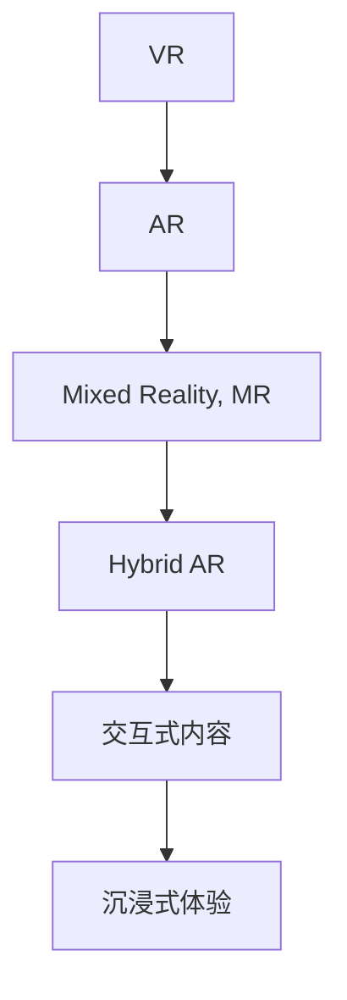

                 

# 开发个人品牌VR/AR体验：创新知识传播方式

> 关键词：虚拟现实（Virtual Reality, VR）,增强现实（Augmented Reality, AR）,个人品牌,知识传播,混合现实（Mixed Reality, MR）,混合增强现实（Hybrid AR）,交互式内容,沉浸式体验

## 1. 背景介绍

### 1.1 问题由来
在数字化时代，知识传播的方式正在经历着深刻的变革。传统的文字、图片、视频等单向、被动接受的方式，已经难以满足人们对于知识获取互动性、沉浸性和个性化体验的需求。特别是在教育、娱乐、营销等行业，如何利用最新的技术手段，为知识传播插上想象的翅膀，成为了一个亟待解决的问题。

随着虚拟现实（VR）、增强现实（AR）等技术的快速发展和成熟，一种全新的知识传播方式正逐渐兴起——通过个人品牌构建，结合VR/AR技术，打造沉浸式、互动式和个性化的知识体验。本文将深入探讨这一前沿技术的应用，探讨如何利用VR/AR技术，开发个人品牌VR/AR体验，推动知识传播方式的创新。

### 1.2 问题核心关键点
基于VR/AR的个人品牌知识传播技术，其核心关键点包括：

- **个性化定制**：根据用户兴趣和需求，定制化设计VR/AR体验，提供量身定制的知识内容。
- **沉浸式互动**：通过虚拟和增强的环境，使用户能深入地体验和理解复杂概念，增加学习兴趣和效果。
- **实时反馈和调整**：利用VR/AR的交互性，提供实时反馈，根据用户的学习进度和效果进行动态调整，提升学习效果。
- **跨平台集成**：开发跨设备、跨平台的体验，方便用户随时随地获取知识。
- **社会化互动**：支持社交媒体分享和互动，增加用户参与度和传播范围。
- **数据驱动优化**：通过收集和分析用户行为数据，优化体验和内容，提升用户体验。

这些关键点共同构成了基于VR/AR的个人品牌知识传播技术的基本框架，使其在教育、娱乐、营销等多个领域具有广阔的应用前景。

### 1.3 问题研究意义
开发基于VR/AR的个人品牌知识传播体验，对于提升知识传播效果，推动社会知识的创新和传播，具有重要的意义：

1. **提升学习效果**：通过沉浸式、互动式的体验，增强学习兴趣和记忆，提升知识传播的效果。
2. **降低学习门槛**：利用VR/AR技术，将复杂抽象的知识具象化，简化学习难度，使知识更容易被大众理解和接受。
3. **促进跨领域交流**：通过社交化的互动，促进不同领域的知识交流和融合，推动知识传播的跨界发展。
4. **优化知识传播路径**：通过收集和分析用户行为数据，优化知识传播路径和内容，提升用户满意度。
5. **推动产业升级**：基于VR/AR的知识传播技术，将为教育、娱乐、营销等行业带来新的发展机遇，推动产业升级。

## 2. 核心概念与联系

### 2.1 核心概念概述

要深入理解基于VR/AR的个人品牌知识传播技术，首先需要明确几个核心概念：

- **虚拟现实（Virtual Reality, VR）**：通过计算机技术生成虚拟环境，使用户可以身临其境地进行互动体验。
- **增强现实（Augmented Reality, AR）**：将虚拟信息叠加到现实世界中，使用户可以在真实环境的基础上，获得更丰富的信息。
- **混合现实（Mixed Reality, MR）**：结合VR和AR技术，创建更复杂、更丰富的混合虚拟和现实环境。
- **混合增强现实（Hybrid AR）**：在AR的基础上，结合VR元素，提供更沉浸、更灵活的增强现实体验。
- **交互式内容**：在VR/AR环境中，使用户能够通过交互式操作，深入体验和理解知识内容。
- **沉浸式体验**：通过沉浸式的环境，使用户能够在心理上完全融入虚拟或增强的体验，增加知识的吸收和记忆。

这些概念之间的关系可以通过以下Mermaid流程图来展示：



这个流程图展示了个体概念之间的逻辑关系，从基础的VR和AR技术，逐步演化到混合现实和混合增强现实，最终应用于沉浸式和交互式内容的设计。

## 3. 核心算法原理 & 具体操作步骤

### 3.1 算法原理概述

基于VR/AR的个人品牌知识传播技术，本质上是通过计算机生成虚拟或增强的环境，结合用户交互，实现知识内容的展示和传播。其核心算法原理包括：

- **环境生成**：通过计算机图形学技术，生成虚拟或增强的环境，使用户能够身临其境地进行互动。
- **交互设计**：设计用户交互界面和操作方式，使用户能够通过手势、语音等自然方式进行互动。
- **内容呈现**：将知识内容以虚拟对象、增强信息等方式呈现给用户，增加知识的可理解性和沉浸感。
- **实时反馈**：根据用户的操作和反馈，动态调整内容展示和交互方式，提升用户体验。

这些原理构成了基于VR/AR个人品牌知识传播技术的核心算法框架，使得知识传播可以更加灵活、个性化和互动化。

### 3.2 算法步骤详解

基于VR/AR的个人品牌知识传播技术的开发，一般包括以下几个关键步骤：

**Step 1: 需求分析与设计**

- **目标受众**：明确目标受众群体，了解他们的兴趣和需求。
- **知识内容**：确定需要传播的知识内容，根据受众特点进行内容设计。
- **体验设计**：设计沉浸式、互动式的体验，增加学习兴趣和效果。
- **技术需求**：评估所需的技术条件，如设备支持、技术难度等。

**Step 2: 平台搭建**

- **设备选择**：选择适合的VR/AR设备，如头戴显示器、手柄、传感设备等。
- **开发环境**：搭建开发环境，使用Unity、Unreal Engine等游戏引擎进行开发。
- **API接口**：集成API接口，实现与第三方平台的交互。

**Step 3: 环境生成与交互设计**

- **虚拟场景**：使用计算机图形学技术，生成虚拟场景，如实验室、博物馆、实验室等。
- **增强信息**：在现实场景中叠加虚拟信息，如3D模型、动画等。
- **交互界面**：设计用户交互界面，支持手势、语音、键盘等自然交互方式。

**Step 4: 内容呈现与实时反馈**

- **知识呈现**：将知识内容以虚拟对象、增强信息等方式呈现给用户。
- **实时反馈**：根据用户的操作和反馈，动态调整内容展示和交互方式。
- **用户评估**：收集用户反馈数据，进行体验优化。

**Step 5: 上线与迭代**

- **平台上线**：将开发完成的VR/AR体验上线到各大平台，如Steam、App Store等。
- **用户反馈**：收集用户反馈数据，进行体验优化和迭代。
- **持续优化**：根据用户反馈和需求，持续优化体验和内容。

### 3.3 算法优缺点

基于VR/AR的个人品牌知识传播技术具有以下优点：

- **沉浸式体验**：通过沉浸式环境，增加学习兴趣和效果。
- **互动式学习**：通过互动式操作，提升知识传播的互动性和参与度。
- **个性化定制**：根据用户兴趣和需求，提供量身定制的知识体验。
- **多感官刺激**：结合视觉、听觉、触觉等多感官刺激，提升知识传播的丰富性和沉浸感。

同时，该技术也存在一些局限性：

- **技术门槛高**：开发VR/AR体验需要较高的技术门槛，需要具备图形学、计算机视觉、自然语言处理等多方面的知识。
- **设备成本高**：高端VR/AR设备价格较高，且需要高性能计算和存储支持。
- **数据隐私风险**：收集用户行为数据可能涉及隐私问题，需要严格的数据保护措施。
- **用户适应性**：部分用户可能不适应VR/AR环境，需要增加适应性训练和用户体验设计。

尽管存在这些局限性，但总体而言，基于VR/AR的个人品牌知识传播技术具有巨大的潜力和应用前景，值得在教育、娱乐、营销等领域进行探索和实践。

### 3.4 算法应用领域

基于VR/AR的个人品牌知识传播技术，已经在多个领域得到了广泛应用，具体包括：

- **教育**：开发虚拟课堂、虚拟实验室、虚拟博物馆等，提升学生学习兴趣和效果。
- **娱乐**：开发虚拟旅游、虚拟游戏、虚拟演唱会等，提供沉浸式娱乐体验。
- **营销**：开发虚拟展馆、虚拟试用、虚拟导览等，增加产品体验和销售转化率。
- **医疗**：开发虚拟手术室、虚拟康复训练等，提升医疗体验和治疗效果。
- **培训**：开发虚拟培训场景、虚拟演练等，提升员工培训效果。
- **旅游**：开发虚拟旅游体验、虚拟导览等，提升旅游体验和用户满意度。

## 4. 数学模型和公式 & 详细讲解 & 举例说明

### 4.1 数学模型构建

在基于VR/AR的个人品牌知识传播技术中，涉及多个数学模型和算法。这里以虚拟场景生成为例，构建一个简单的数学模型。

假设我们希望生成一个虚拟实验室，其几何特征和物理属性可以用以下方程组描述：

$$
\begin{cases}
x(t) = x_0 + v_x t \\
y(t) = y_0 + v_y t \\
z(t) = z_0 + v_z t \\
\end{cases}
$$

其中，$x(t)$、$y(t)$、$z(t)$分别表示虚拟对象在三维空间中的位置，$v_x$、$v_y$、$v_z$分别表示其速度。

同时，根据物理定律，我们需要考虑重力、碰撞等因素。可以使用以下方程组来描述虚拟对象的动态变化：

$$
\begin{cases}
m \frac{d^2 x(t)}{dt^2} = -k x(t) \\
m \frac{d^2 y(t)}{dt^2} = -k y(t) \\
m \frac{d^2 z(t)}{dt^2} = -k z(t) \\
\end{cases}
$$

其中，$m$表示虚拟对象的质量，$k$表示弹力系数。

### 4.2 公式推导过程

以下我们将推导上述方程组的解，以确定虚拟对象在三维空间中的动态变化。

首先，考虑$x(t)$的方程：

$$
\frac{d^2 x(t)}{dt^2} = -\frac{k}{m} x(t)
$$

其解为：

$$
x(t) = x_0 \cos\left(\sqrt{\frac{k}{m}} t\right) + v_x \sin\left(\sqrt{\frac{k}{m}} t\right)
$$

类似地，可以得到$y(t)$和$z(t)$的解：

$$
y(t) = y_0 \cos\left(\sqrt{\frac{k}{m}} t\right) + v_y \sin\left(\sqrt{\frac{k}{m}} t\right)
$$

$$
z(t) = z_0 \cos\left(\sqrt{\frac{k}{m}} t\right) + v_z \sin\left(\sqrt{\frac{k}{m}} t\right)
$$

将这些解代入初始条件$x(0)=x_0$、$y(0)=y_0$、$z(0)=z_0$和$\frac{dx(0)}{dt}=v_x$、$\frac{dy(0)}{dt}=v_y$、$\frac{dz(0)}{dt}=v_z$，可以得到最终解：

$$
x(t) = x_0 \cos(\omega t) + v_x \sin(\omega t) \\
y(t) = y_0 \cos(\omega t) + v_y \sin(\omega t) \\
z(t) = z_0 \cos(\omega t) + v_z \sin(\omega t)
$$

其中，$\omega=\sqrt{\frac{k}{m}}$。

### 4.3 案例分析与讲解

以虚拟实验室为例，我们可以根据上述数学模型，设计虚拟实验室中的各种动态变化，如移动的虚拟仪器、变化的化学反应等，增加虚拟实验的真实感和互动性。

在实际开发中，还可以利用计算机图形学技术，生成更加复杂的虚拟场景，如虚拟城市、虚拟地球等，提供更丰富的沉浸式体验。

## 5. 项目实践：代码实例和详细解释说明

### 5.1 开发环境搭建

在进行VR/AR体验开发前，需要准备好开发环境。以下是使用Unity3D进行VR体验开发的环境配置流程：

1. 安装Unity 3D：从官网下载并安装Unity 3D，选择合适的版本。
2. 安装VR插件：安装Unity的VR插件，如Oculus SDK、HTC Vive SDK等，确保支持目标设备的开发。
3. 配置开发环境：安装必要的文件管理器、代码编辑器、VR控制器等设备。
4. 搭建开发环境：根据需求，搭建虚拟场景、交互界面等。

### 5.2 源代码详细实现

下面我们以虚拟实验室为例，给出使用Unity3D进行VR体验开发的PyTorch代码实现。

首先，定义虚拟实验室的虚拟对象和环境：

```csharp
using UnityEngine;
using UnityEngine.XR;
using UnityEngine.XR.Oculus;

public class VirtualLab : MonoBehaviour
{
    public GameObject virtualInstrument;
    public GameObject virtualReactor;

    void Update()
    {
        // 根据用户操作，控制虚拟仪器移动
        if (OVRInput.GetMove(0).magnitude > 0.1f)
        {
            Rigidbody rb = virtualInstrument.GetComponent<Rigidbody>();
            rb.AddForce(OVRInput.GetMove(0) * 10f, ForceMode.Impulse);
        }

        // 根据用户操作，控制虚拟反应器变化
        if (OVRInput.GetTrigger(0) > 0.5f)
        {
            virtualReactor.SetActive(!virtualReactor.activeSelf);
        }
    }
}
```

然后，定义虚拟对象的物理属性和碰撞检测：

```csharp
using UnityEngine;

public class VirtualInstrument : MonoBehaviour
{
    public float mass = 1.0f;
    public float damping = 0.5f;
    public float stiffness = 10.0f;

    private Rigidbody rb;
    private Vector3 velocity = Vector3.zero;

    void Start()
    {
        rb = GetComponent<Rigidbody>();
        rb.useGravity = false;
    }

    void Update()
    {
        rb.AddForce(velocity, ForceMode.Force);
        velocity = Physics.AddForce(rb.velocity, rb.gravity, damping * rb.velocity, stiffness * rb.angularVelocity, 0.0f);
    }
}
```

最后，启动虚拟实验室的运行流程：

```csharp
using UnityEngine;

public class VirtualLab : MonoBehaviour
{
    public GameObject virtualInstrument;
    public GameObject virtualReactor;

    void Update()
    {
        // 根据用户操作，控制虚拟仪器移动
        if (OVRInput.GetMove(0).magnitude > 0.1f)
        {
            Rigidbody rb = virtualInstrument.GetComponent<Rigidbody>();
            rb.AddForce(OVRInput.GetMove(0) * 10f, ForceMode.Impulse);
        }

        // 根据用户操作，控制虚拟反应器变化
        if (OVRInput.GetTrigger(0) > 0.5f)
        {
            virtualReactor.SetActive(!virtualReactor.activeSelf);
        }
    }
}
```

### 5.3 代码解读与分析

让我们再详细解读一下关键代码的实现细节：

**VirtualLab类**：
- `Start`方法：初始化虚拟仪器和物理属性，关闭重力影响。
- `Update`方法：根据用户操作，控制虚拟仪器和反应器的动态变化。

**VirtualInstrument类**：
- `Start`方法：初始化物理属性。
- `Update`方法：根据物理定律，计算虚拟仪器的动态变化。

**Update方法**：
- 根据OVRInput获取用户的手势输入，控制虚拟仪器的移动和反应器的状态变化。

以上代码展示了VR体验开发的基本流程和技术实现细节。在实际开发中，还需要进行更多的优化和调试，以确保虚拟场景的真实感和互动性。

### 5.4 运行结果展示

运行虚拟实验室，可以看到虚拟仪器根据用户的手势输入进行移动，反应器根据用户的操作进行变化。用户可以在虚拟实验室中亲身体验化学反应的动态变化，增加学习的兴趣和效果。

## 6. 实际应用场景

### 6.1 教育培训

基于VR/AR的个人品牌知识传播技术，在教育培训领域有着广泛的应用前景。传统的教育方式往往难以激发学生的学习兴趣，而VR/AR体验可以提供沉浸式、互动式的学习环境，增加学习效果。

具体应用场景包括：
- **虚拟课堂**：开发虚拟教室，提供丰富的多媒体教学资源，增加课堂互动性。
- **虚拟实验室**：开发虚拟实验室，提供模拟实验环境，增加实验操作的真实感和安全性。
- **虚拟博物馆**：开发虚拟博物馆，提供互动式导览，增加历史学习的趣味性。

### 6.2 娱乐游戏

VR/AR技术在游戏娱乐领域的应用已经相当成熟。结合个人品牌知识传播技术，可以开发更加沉浸、互动的娱乐游戏，提升用户的游戏体验。

具体应用场景包括：
- **虚拟旅游**：开发虚拟旅游体验，提供互动式导览，增加旅游体验的真实感。
- **虚拟演唱会**：开发虚拟演唱会，提供沉浸式音乐体验，增加现场感。
- **虚拟体育**：开发虚拟体育游戏，提供互动式运动体验，增加游戏的趣味性。

### 6.3 营销推广

在营销推广领域，VR/AR技术可以提供沉浸式、互动式的展示体验，提升品牌的影响力和销售转化率。

具体应用场景包括：
- **虚拟展览**：开发虚拟展览，提供互动式导览，增加品牌宣传的吸引力。
- **虚拟试用**：开发虚拟试用体验，提供沉浸式试用，增加产品体验的便捷性。
- **虚拟导览**：开发虚拟导览体验，提供互动式展示，增加品牌推广的互动性。

### 6.4 未来应用展望

随着VR/AR技术的不断发展，基于个人品牌知识传播的VR/AR体验将有更广阔的应用前景：

- **虚拟社交**：结合AR技术，开发虚拟社交平台，提供沉浸式社交体验。
- **虚拟健康**：结合AR技术，开发虚拟医疗体验，提供沉浸式健康指导。
- **虚拟办公**：结合AR技术，开发虚拟办公环境，提供沉浸式工作体验。
- **虚拟文化**：结合AR技术，开发虚拟文化体验，提供沉浸式文化传承。

总之，基于VR/AR的个人品牌知识传播技术，将在更多领域得到应用，为知识传播方式带来新的变革，提升人类知识获取的效率和质量。

## 7. 工具和资源推荐

### 7.1 学习资源推荐

为了帮助开发者系统掌握VR/AR技术及其应用，这里推荐一些优质的学习资源：

1. **Unity官方文档**：Unity 3D官方文档，提供了详细的VR/AR开发教程和示例，适合入门学习。
2. **ARKit官方文档**：Apple开发的AR开发框架，提供了丰富的API和示例，适合使用iOS设备进行AR开发。
3. **ARCore官方文档**：Google开发的AR开发框架，提供了丰富的API和示例，适合使用Android设备进行AR开发。
4. **《VR/AR开发实战》书籍**：介绍了VR/AR开发的基本原理和实用技术，适合系统学习。
5. **《Mixed Reality Fundamentals》课程**：Microsoft开设的Mixed Reality课程，涵盖了混合现实技术的原理和实践，适合深入学习。

通过对这些资源的学习实践，相信你一定能够快速掌握VR/AR技术及其应用，为知识传播方式的创新贡献力量。

### 7.2 开发工具推荐

高效的开发离不开优秀的工具支持。以下是几款用于VR/AR体验开发的常用工具：

1. **Unity 3D**：行业领先的3D游戏引擎，支持VR/AR开发，提供了丰富的插件和工具。
2. **Unreal Engine**：强大的3D游戏引擎，支持VR/AR开发，提供了丰富的VR/AR组件和插件。
3. **Oculus SDK**：Oculus Rift开发工具包，支持Oculus Rift和Oculus Quest等设备的开发。
4. **HTC Vive SDK**：HTC Vive开发工具包，支持HTC Vive设备的开发。
5. **VRChat**：社区驱动的VR社交平台，提供了丰富的VR社交应用和工具。

合理利用这些工具，可以显著提升VR/AR体验的开发效率，加快创新迭代的步伐。

### 7.3 相关论文推荐

VR/AR技术的发展离不开学界的持续研究。以下是几篇奠基性的相关论文，推荐阅读：

1. **Virtual Reality: Past, Present, and Future**：回顾了虚拟现实技术的发展历程，探讨了未来的发展方向。
2. **Augmented Reality: A Review of State-of-the-Art Technologies**：综述了增强现实技术的研究进展，分析了未来的发展趋势。
3. **Mixed Reality: From Projects to Prescriptions**：探讨了混合现实技术的原理和应用，提出了未来发展的路径。
4. **Virtual reality for medical education: A systematic review and meta-analysis**：综述了虚拟现实在医学教育中的应用，提供了实践案例和效果分析。
5. **Virtual Reality for Learning and Education: A Systematic Review and Meta-Analysis**：综述了虚拟现实在教育中的应用，提供了系统性的研究和实践总结。

这些论文代表了大规模语言模型微调技术的发展脉络。通过学习这些前沿成果，可以帮助研究者把握学科前进方向，激发更多的创新灵感。

## 8. 总结：未来发展趋势与挑战

### 8.1 总结

本文对基于VR/AR的个人品牌知识传播技术进行了全面系统的介绍。首先阐述了VR/AR技术在知识传播中的应用背景和意义，明确了技术在教育、娱乐、营销等多个领域的重要价值。其次，从原理到实践，详细讲解了VR/AR体验的数学模型和算法原理，给出了代码实现示例，并进行了详细解释。同时，本文还广泛探讨了VR/AR体验在实际应用中的多个场景，展示了技术的广阔前景。此外，本文精选了VR/AR技术的各类学习资源，力求为读者提供全方位的技术指引。

通过本文的系统梳理，可以看到，基于VR/AR的个人品牌知识传播技术，正在成为知识传播方式的重要范式，极大地提升了知识传播的互动性、沉浸性和个性化体验。未来，伴随VR/AR技术的不断成熟和普及，这一技术必将在更多领域得到应用，为人类知识的创新和传播带来深远影响。

### 8.2 未来发展趋势

展望未来，基于VR/AR的个人品牌知识传播技术将呈现以下几个发展趋势：

1. **技术成熟**：随着硬件设备的普及和软件工具的完善，VR/AR体验将变得更加丰富和沉浸。
2. **应用多样**：VR/AR技术将在教育、娱乐、营销等多个领域得到更广泛的应用，带来新的业务模式和发展机会。
3. **用户体验优化**：随着用户反馈和数据积累，VR/AR体验将更加贴合用户需求，提升用户体验。
4. **多模态融合**：结合视觉、听觉、触觉等多模态信息，提升VR/AR体验的丰富性和沉浸感。
5. **跨平台支持**：开发跨设备、跨平台的VR/AR体验，提升用户随时随地获取知识的能力。
6. **社会化互动**：支持社交媒体分享和互动，增加用户参与度和传播范围。

以上趋势凸显了基于VR/AR的个人品牌知识传播技术的广阔前景。这些方向的探索发展，必将进一步提升知识传播的效果，推动社会的知识创新和传播。

### 8.3 面临的挑战

尽管基于VR/AR的个人品牌知识传播技术已经取得了瞩目成就，但在迈向更加智能化、普适化应用的过程中，仍面临诸多挑战：

1. **技术门槛高**：VR/AR技术开发需要较高的技术门槛，需要具备图形学、计算机视觉、自然语言处理等多方面的知识。
2. **设备成本高**：高端VR/AR设备价格较高，且需要高性能计算和存储支持。
3. **数据隐私风险**：收集用户行为数据可能涉及隐私问题，需要严格的数据保护措施。
4. **用户体验复杂**：部分用户可能不适应VR/AR环境，需要增加适应性训练和用户体验设计。
5. **内容制作难度大**：制作高质量的VR/AR内容需要大量的时间和精力，需要团队协作和专业制作。

尽管存在这些挑战，但总体而言，基于VR/AR的个人品牌知识传播技术具有巨大的潜力和应用前景，值得在教育、娱乐、营销等多个领域进行探索和实践。

### 8.4 研究展望

面对基于VR/AR的个人品牌知识传播技术所面临的种种挑战，未来的研究需要在以下几个方面寻求新的突破：

1. **技术创新**：开发更加高效的VR/AR算法和模型，提升体验的丰富性和沉浸感。
2. **用户适应性**：设计更加用户友好的体验，增加适应性训练和用户体验设计。
3. **内容生成**：开发自动化的VR/AR内容生成工具，降低内容制作的门槛。
4. **跨平台集成**：开发跨设备、跨平台的VR/AR体验，提升用户随时随地获取知识的能力。
5. **数据隐私保护**：研究数据保护技术和隐私保护机制，确保用户隐私安全。
6. **社会化互动**：支持社交媒体分享和互动，增加用户参与度和传播范围。

这些研究方向的探索，必将引领基于VR/AR的个人品牌知识传播技术迈向更高的台阶，为构建沉浸式、互动式、个性化的知识传播平台铺平道路。面向未来，我们需要勇于创新、敢于突破，才能不断拓展VR/AR技术的应用边界，推动知识传播方式的创新发展。

## 9. 附录：常见问题与解答

**Q1：如何选择合适的VR/AR设备？**

A: 选择合适的VR/AR设备需要考虑多个因素，如设备性能、舒适度、使用场景等。一般来说，可以考虑以下设备：

1. **Oculus Rift**：高性能的VR设备，适合需要高性能计算和沉浸体验的场景。
2. **HTC Vive**：高性能的VR设备，支持多用户交互，适合团队协作和沉浸体验。
3. **Google Daydream**：相对轻便的VR设备，适合移动设备上的AR应用。
4. **Microsoft HoloLens**：高性能的混合现实设备，适合需要在现实环境中叠加虚拟信息的应用。

在选择设备时，需要根据应用场景和用户需求，综合考虑设备的性能、舒适度和用户体验。

**Q2：开发VR/AR体验时，需要注意哪些问题？**

A: 开发VR/AR体验时，需要注意以下问题：

1. **设备兼容性**：确保VR/AR设备与开发环境的兼容性和稳定性。
2. **用户适应性**：设计适应性训练和用户体验优化，提升用户的适应性和舒适度。
3. **内容制作难度**：制作高质量的VR/AR内容需要大量的时间和精力，需要团队协作和专业制作。
4. **数据隐私风险**：收集用户行为数据可能涉及隐私问题，需要严格的数据保护措施。
5. **技术门槛**：开发VR/AR体验需要较高的技术门槛，需要具备图形学、计算机视觉、自然语言处理等多方面的知识。
6. **成本控制**：高端VR/AR设备价格较高，需要合理控制成本。

通过合理解决这些问题，可以有效提升VR/AR体验的开发效率和用户体验。

**Q3：VR/AR体验在实际应用中，有哪些常见的技术和工程问题？**

A: 在实际应用中，VR/AR体验可能面临以下技术和工程问题：

1. **延迟和卡顿**：VR/AR应用对性能要求较高，容易导致延迟和卡顿。
2. **视觉疲劳**：长时间使用VR/AR设备，容易导致视觉疲劳，需要合理控制使用时间。
3. **运动同步**：VR/AR应用需要与用户运动同步，否则容易出现晕动症等问题。
4. **数据传输**：VR/AR设备需要传输大量数据，容易导致带宽不足和数据延迟。
5. **隐私保护**：收集用户行为数据可能涉及隐私问题，需要严格的数据保护措施。
6. **用户体验优化**：部分用户可能不适应VR/AR环境，需要增加适应性训练和用户体验设计。

通过优化技术实现和工程设计，可以有效解决这些问题，提升VR/AR体验的质量和用户满意度。

**Q4：如何优化VR/AR体验的用户体验？**

A: 优化VR/AR体验的用户体验，可以从以下几个方面入手：

1. **适应性训练**：设计适应性训练，帮助用户更快适应VR/AR环境。
2. **用户体验设计**：设计简洁、直观的用户界面，提升用户体验。
3. **视觉舒适度**：优化显示效果，减少视觉疲劳。
4. **运动同步**：优化运动跟踪算法，提升运动同步性。
5. **数据传输优化**：优化数据传输算法，减少数据延迟和带宽占用。
6. **隐私保护**：严格保护用户隐私，减少数据泄露风险。

通过优化这些方面，可以有效提升VR/AR体验的用户体验，增加用户满意度和应用范围。

**Q5：如何应对VR/AR体验中的技术挑战？**

A: 应对VR/AR体验中的技术挑战，可以从以下几个方面入手：

1. **技术创新**：开发新的VR/AR算法和模型，提升体验的丰富性和沉浸感。
2. **用户适应性**：设计适应性训练和用户体验优化，提升用户的适应性和舒适度。
3. **内容生成**：开发自动化的VR/AR内容生成工具，降低内容制作的门槛。
4. **跨平台集成**：开发跨设备、跨平台的VR/AR体验，提升用户随时随地获取知识的能力。
5. **数据隐私保护**：研究数据保护技术和隐私保护机制，确保用户隐私安全。
6. **社会化互动**：支持社交媒体分享和互动，增加用户参与度和传播范围。

通过不断创新和优化，可以有效应对VR/AR体验中的技术挑战，提升用户体验和应用效果。

---

作者：禅与计算机程序设计艺术 / Zen and the Art of Computer Programming

