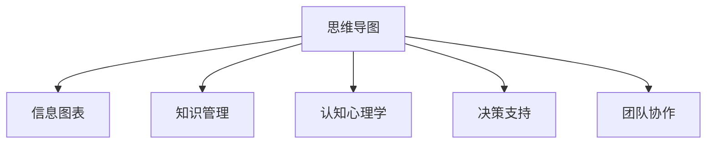

                 

# 思维导图：可视化思考的有效工具

> 关键词：思维导图,信息图表,知识管理,认知心理学,决策支持,团队协作

## 1. 背景介绍

### 1.1 问题由来
在现代信息爆炸的时代，人们需要处理和记忆的信息量越来越大，对于组织和提取知识的需求日益增长。传统的线性文本笔记难以满足这一需求，尤其是对于复杂项目或团队协作，文档变得难以管理和共享。思维导图作为一种新型的信息表示方式，因其可视化、结构化的特性，近年来得到了广泛应用。思维导图不仅能够帮助我们整理知识、理清思路，还能够促进团队协作，提高决策效率。

### 1.2 问题核心关键点
思维导图是一种基于图表的信息管理工具，通过将信息转化为图形化的结构，帮助用户更好地理解和记忆。其核心关键点包括：

- **知识组织**：思维导图将知识组织成层次结构，便于理解和学习。
- **视觉化表达**：通过图形、颜色和关联线等元素，使信息更加生动、易于理解。
- **记忆促进**：视觉和关联信息更容易记忆，提高信息记忆效率。
- **决策支持**：思维导图通过结构化展示信息，有助于快速决策和问题解决。
- **团队协作**：思维导图便于分享和协作，促进知识共享和团队合作。

这些核心关键点使得思维导图成为信息管理和团队协作中的重要工具，被广泛应用于项目管理、知识管理、学习辅助等多个领域。

## 2. 核心概念与联系

### 2.1 核心概念概述

为更好地理解思维导图的应用，本节将介绍几个密切相关的核心概念：

- **思维导图**：一种通过图形化的方式表示信息的工具，常用于知识管理、学习辅助、项目管理等领域。
- **信息图表**：一种将信息以图形化的形式表示，用于传播和交流的工具。
- **知识管理**：对个人或组织中的知识进行收集、整理、存储和共享的过程。
- **认知心理学**：研究人类认知过程的学科，包括记忆、学习、决策等。
- **决策支持**：通过辅助决策工具，帮助决策者更好地理解问题和做出决策。
- **团队协作**：通过共享信息和协作，共同完成项目目标的过程。

这些核心概念之间的逻辑关系可以通过以下Mermaid流程图来展示：



这个流程图展示出思维导图与信息图表、知识管理、认知心理学、决策支持、团队协作等概念之间的关联：

1. 思维导图是一种信息图表，能够将信息以图形化的形式展示。
2. 知识管理通过思维导图整理和存储知识，便于查找和共享。
3. 认知心理学研究思维导图如何影响信息处理和记忆。
4. 决策支持通过思维导图辅助决策，提高决策效率。
5. 团队协作通过思维导图促进信息共享和团队合作。

## 3. 核心算法原理 & 具体操作步骤
### 3.1 算法原理概述

思维导图的核心算法原理包括：

- **层次结构构建**：将信息按照逻辑层次进行组织，形成树状结构。
- **关联关系表达**：通过线条和箭头等元素表示信息之间的关联。
- **颜色和形状使用**：利用颜色和形状区分信息类型和重要性。
- **布局优化**：通过算法优化思维导图的布局，使其易于阅读和理解。

这些原理使得思维导图能够有效帮助用户整理和理解信息，同时也为后续的决策和团队协作提供了基础。

### 3.2 算法步骤详解

思维导图的制作和应用主要包括以下几个关键步骤：

**Step 1: 收集和整理信息**

- 确定思维导图的主题或问题。
- 收集相关的信息和资料。
- 整理信息，识别关键点和关联。

**Step 2: 绘制思维导图**

- 确定思维导图的主要分支和子分支。
- 使用图形、线条和颜色等元素表示信息。
- 优化布局，使思维导图易于阅读和理解。

**Step 3: 应用思维导图**

- 用于个人知识管理，记录和整理学习笔记、工作思路等。
- 用于团队协作，共享和讨论项目信息。
- 用于决策支持，快速梳理和展示相关信息，辅助决策。

### 3.3 算法优缺点

思维导图具有以下优点：

- 直观易读：图形化的表达方式易于理解和记忆。
- 结构清晰：层次结构和关联关系有助于整理思路。
- 灵活可扩展：可以根据需求自由添加和修改节点。
- 易于分享：便于团队协作和知识共享。

但同时也存在一些缺点：

- 制作复杂：需要一定的设计和绘制技能。
- 信息密度高：信息过于集中可能导致阅读困难。
- 缺乏动态性：无法实时更新和动态展示信息。
- 适用场景有限：不适合处理海量信息或复杂问题。

尽管有这些局限性，思维导图仍然是信息管理和团队协作中不可或缺的工具。

### 3.4 算法应用领域

思维导图在多个领域得到了广泛应用，包括但不限于：

- 项目管理：帮助项目经理梳理项目流程和任务关系。
- 学习辅助：用于整理学习笔记和知识体系，促进学习和记忆。
- 商业决策：辅助决策者快速梳理和展示相关信息，提高决策效率。
- 创新思维：激发创新灵感，帮助团队解决问题。
- 知识管理：整理和存储个人或组织知识，便于查找和共享。

## 4. 数学模型和公式 & 详细讲解 & 举例说明

### 4.1 数学模型构建

思维导图虽然主要是图形化工具，但也有一些数学模型可以用于描述和优化其结构。

定义思维导图的层次结构为 $G=(V,E)$，其中 $V$ 是节点集合，$E$ 是边集合。节点表示信息点，边表示信息之间的关联。

**计算复杂度**：思维导图的构建和应用复杂度取决于节点和边数。一般而言，构建复杂度为 $O(|V|+|E|)$，应用复杂度也近似于此。

### 4.2 公式推导过程

以下推导基于两个基本公式：

1. **节点度公式**：对于节点 $v$，其度数（即与 $v$ 相连的边数）为 $d(v)$。
2. **关联度公式**：对于边 $e$，其关联度为 $a(e)$，即从源节点到目标节点的权重。

设 $n$ 为节点数，$m$ 为边数，则：

- 总节点度数：$\sum_{v \in V} d(v) = 2m$，即所有边被节点共享一次。
- 总关联度数：$\sum_{e \in E} a(e) = \sum_{v \in V} d(v) = 2m$，即所有边权重之和。

### 4.3 案例分析与讲解

**案例：项目管理思维导图**

下图为一个简单的项目管理思维导图示例：

```mermaid
graph TB
    A[项目目标]
    B[项目任务]
        C[任务1] -- B[任务2] -- B[任务3] -- B[任务4]
            D[子任务1]
```

分析：

- **层次结构**：项目目标位于顶层，任务1至任务4是下一层。
- **关联关系**：任务1至任务4之间有内部关联。
- **颜色和形状**：不同节点使用不同颜色和形状，表示任务类型和优先级。
- **布局优化**：优化布局，确保信息易于读取和理解。

## 5. 项目实践：代码实例和详细解释说明
### 5.1 开发环境搭建

要进行思维导图的制作和应用，首先需要搭建相应的开发环境。以下是使用Python进行MindManager开发的快速搭建步骤：

1. 安装MindManager：下载并安装MindManager软件，适用于Windows、Mac、Linux等多个平台。
2. 创建新项目：打开MindManager，创建一个新的思维导图项目。
3. 导入数据：将相关节点和边导入思维导图。
4. 应用优化：利用软件的优化功能，调整思维导图的布局和设计。

完成上述步骤后，即可开始制作和应用思维导图。

### 5.2 源代码详细实现

以下是一个简单的Python代码示例，用于模拟思维导图的构建和展示：

```python
import networkx as nx
import matplotlib.pyplot as plt

# 创建一个思维导图示例
G = nx.Graph()

# 添加节点和边
G.add_node('项目目标')
G.add_node('任务1')
G.add_node('任务2')
G.add_node('任务3')
G.add_node('任务4')
G.add_edge('项目目标', '任务1')
G.add_edge('项目目标', '任务2')
G.add_edge('项目目标', '任务3')
G.add_edge('项目目标', '任务4')

# 添加子任务节点
G.add_node('子任务1', parent='任务1')
G.add_edge('任务1', '子任务1')

# 展示思维导图
pos = nx.spring_layout(G)
nx.draw(G, pos, with_labels=True, node_size=1000, node_color='lightblue', node_shape='circle', font_size=14, font_color='black', edge_color='black')
plt.show()
```

### 5.3 代码解读与分析

以上代码使用了Python的networkx库，通过图形绘制的方式展示思维导图。主要步骤包括：

- 创建思维导图示例 `G`。
- 添加节点和边，构建层次结构。
- 添加子任务节点，扩展层次结构。
- 使用`nx.draw`函数绘制思维导图。

## 6. 实际应用场景

### 6.1 项目管理

在项目管理中，思维导图帮助项目经理理清项目流程和任务关系，提高团队协作效率。项目经理可以通过思维导图快速查看项目目标、任务分配、子任务等关键信息，及时调整项目计划。

### 6.2 学习辅助

在学习辅助中，思维导图用于整理学习笔记和知识体系，帮助学生更好地理解和记忆学习内容。学生可以使用思维导图记录课堂笔记、复习知识点、整理思维导图等。

### 6.3 商业决策

在商业决策中，思维导图通过图形化的方式展示决策所需的信息，帮助决策者快速梳理和展示相关信息，提高决策效率。企业可以使用思维导图辅助战略规划、市场分析、项目管理等。

### 6.4 创新思维

在创新思维中，思维导图用于激发创新灵感，帮助团队解决问题。团队可以通过思维导图进行头脑风暴、流程重组、创意映射等，促进创新和创造力。

## 7. 工具和资源推荐
### 7.1 学习资源推荐

为了帮助开发者系统掌握思维导图的应用，以下是一些优质的学习资源：

1. **《思维导图使用手册》**：详细介绍了思维导图的原理和应用，适用于初学者入门。
2. **《信息图表设计》**：介绍了信息图表的设计原则和制作技巧，与思维导图密切相关。
3. **《知识管理》**：介绍了知识管理的概念、工具和实践方法，思维导图是其中的重要工具。
4. **《认知心理学》**：介绍了认知心理学的基本概念和理论，帮助理解思维导图如何影响信息处理和记忆。
5. **《决策支持系统》**：介绍了决策支持系统的设计原理和应用场景，思维导图是其中的重要工具。

通过对这些资源的学习实践，相信你一定能够快速掌握思维导图的应用，并将其用于解决实际问题。

### 7.2 开发工具推荐

思维导图的制作和应用需要利用专业的工具。以下是几款常用的思维导图制作工具：

1. **MindManager**：一款功能强大的思维导图软件，支持Windows、Mac、Linux等多个平台。
2. **XMind**：另一款流行的思维导图软件，具有丰富的功能和强大的可视化支持。
3. **Lucidchart**：一款在线思维导图工具，支持团队协作和云同步。
4. **Coggle**：另一款在线思维导图工具，支持实时协作和项目管理。
5. **MindMeister**：一款云思维导图工具，支持实时协作和云同步。

合理利用这些工具，可以显著提升思维导图的制作和应用效率，加快创新迭代的步伐。

### 7.3 相关论文推荐

思维导图在信息管理和团队协作中的应用得到了广泛的研究。以下是几篇奠基性的相关论文，推荐阅读：

1. **《思维导图在项目管理中的应用》**：研究了思维导图在项目管理中的应用效果和优势。
2. **《思维导图在知识管理中的应用》**：介绍了思维导图如何帮助组织整理和共享知识。
3. **《思维导图在创新思维中的应用》**：研究了思维导图如何促进创新思维和问题解决。
4. **《思维导图在决策支持中的应用》**：介绍了思维导图如何辅助决策过程。

这些论文代表了中国思维导图领域的研究进展，通过学习这些前沿成果，可以帮助研究者把握学科前进方向，激发更多的创新灵感。

## 8. 总结：未来发展趋势与挑战
### 8.1 总结

本文对思维导图的原理、应用和实现进行了全面系统的介绍。首先阐述了思维导图的背景和意义，明确了思维导图在信息管理和团队协作中的独特价值。其次，从原理到实践，详细讲解了思维导图的数学模型和关键步骤，给出了思维导图制作和应用的完整代码实例。同时，本文还探讨了思维导图在项目管理、学习辅助、商业决策等多个领域的应用前景，展示了思维导图的应用潜力。

通过本文的系统梳理，可以看到，思维导图作为一种视觉化工具，在信息管理和团队协作中具有广泛的应用。它不仅能够帮助我们整理和理解信息，还能促进团队协作和决策效率，具有重要的实用价值。

### 8.2 未来发展趋势

展望未来，思维导图技术将呈现以下几个发展趋势：

1. **数字化和在线化**：思维导图软件将更多地向数字化和在线化方向发展，支持云同步、实时协作等功能。
2. **智能化和自动化**：思维导图软件将加入智能化和自动化功能，如自动布局优化、自动生成关联等。
3. **跨平台和跨设备**：思维导图将支持更多的平台和设备，如移动设备、智能穿戴设备等。
4. **融合其他工具**：思维导图将与其他信息管理工具和协作平台深度融合，形成更完善的信息管理系统。
5. **全球化推广**：思维导图将进一步推广到国际市场，帮助全球用户提升信息管理和团队协作效率。

这些趋势使得思维导图的应用范围和功能将进一步拓展，为用户提供更加便捷和高效的信息管理体验。

### 8.3 面临的挑战

尽管思维导图技术已经取得了显著进展，但在迈向更加智能化、普适化应用的过程中，仍面临诸多挑战：

1. **用户接受度**：部分用户对思维导图的使用和接受度较低，需要进一步推广和普及。
2. **界面友好度**：部分用户反映思维导图的界面和操作较为复杂，需要简化和优化。
3. **应用场景限制**：思维导图在一些特定的应用场景（如海量数据管理、复杂问题分析）中存在局限性。
4. **知识传播**：思维导图的应用普及仍需进一步推动，需要通过培训和教育提高用户认知。
5. **技术融合**：与其他信息管理工具和协作平台的深度融合需要更多技术支持。

这些挑战需要在技术开发、市场推广和用户体验等方面持续优化和改进。

### 8.4 研究展望

面向未来，思维导图技术需要在以下几个方面进行进一步研究：

1. **用户体验优化**：进一步简化界面和操作，提高用户友好度。
2. **智能化功能增强**：加入智能化和自动化功能，提升思维导图的应用效果。
3. **融合其他工具**：探索思维导图与其他信息管理工具和协作平台的深度融合方法。
4. **全球化推广**：推动思维导图技术的全球化推广和普及，提升全球用户的信息管理能力。
5. **跨平台支持**：支持更多的平台和设备，扩大思维导图的普及范围。

这些研究方向的探索，必将引领思维导图技术迈向更高的台阶，为用户带来更加便捷和高效的信息管理体验。

## 9. 附录：常见问题与解答

**Q1：如何选择合适的思维导图工具？**

A: 选择思维导图工具时，可以考虑以下几个因素：
- 功能丰富度：是否支持云同步、实时协作、自定义主题等。
- 易用性：界面是否友好，操作是否简单。
- 兼容性：是否支持多种平台和设备，如Windows、Mac、Android等。
- 价格和付费方式：是否提供免费版和付费版，付费方式是否合理。

**Q2：如何制作高质量的思维导图？**

A: 制作高质量的思维导图需要注意以下几点：
- 明确主题：确定思维导图的主要主题和目标。
- 信息整理：整理和分类信息，识别关键点和关联。
- 结构清晰：使用层次结构和关联关系，确保信息易于理解。
- 视觉化表达：利用图形、线条和颜色等元素，使信息更加生动。
- 优化布局：通过优化布局，确保思维导图易于阅读和理解。

**Q3：如何使用思维导图辅助决策？**

A: 使用思维导图辅助决策可以遵循以下步骤：
- 确定决策目标：明确决策的主题和目标。
- 梳理信息：梳理和展示决策所需的信息。
- 分析关系：分析信息之间的关系，识别关键点和潜在问题。
- 制定方案：制定多个决策方案，评估优劣。
- 选择方案：根据决策目标和信息分析结果，选择最优方案。

这些技巧和工具可以帮助用户更好地使用思维导图辅助决策，提高决策效率和准确性。

---

作者：禅与计算机程序设计艺术 / Zen and the Art of Computer Programming

