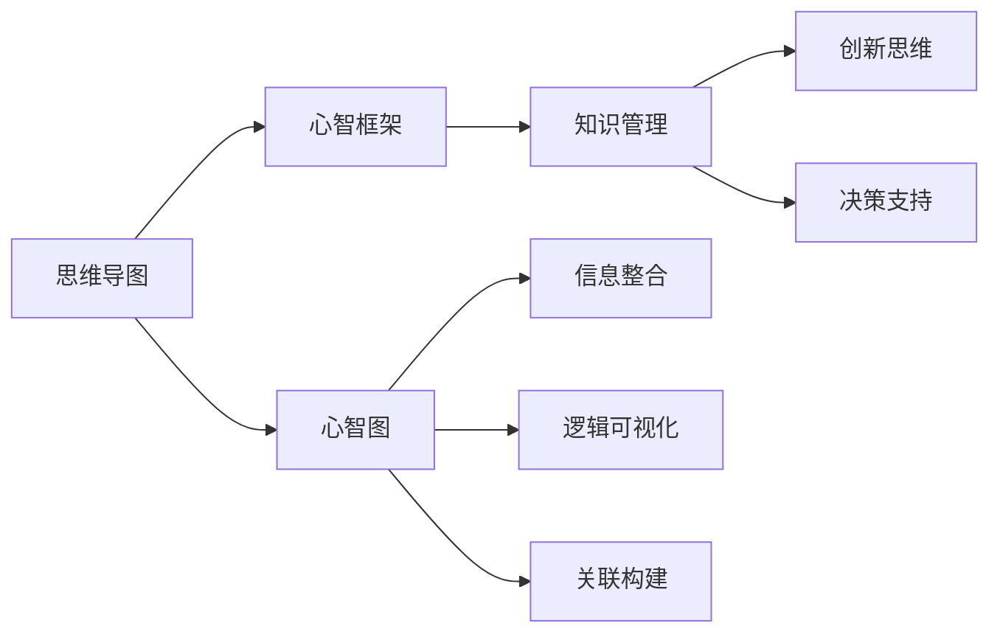
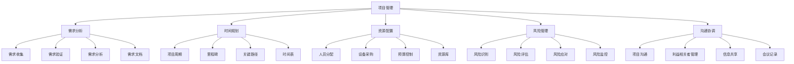
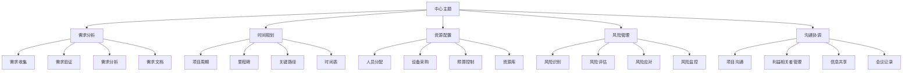

                 

# 思维导图：可视化思考的有效工具

> 关键词：思维导图,心智图,心智框架,知识管理,思考工具,创新思维,决策支持

## 1. 背景介绍

### 1.1 问题由来
在信息时代，人类面临的信息量爆炸式增长，每天通过各种渠道接收到的信息已远超我们处理和记忆的能力。如何在海量的信息中提取有价值的知识，形成系统的认知框架，做出明智的决策，成为了一个亟待解决的问题。

### 1.2 问题核心关键点
思维导图的概念最早由英国心理学家托尼·布赖恩（Tony Buzan）在20世纪70年代提出，主要用于辅助人们理解和记忆信息，逐渐发展成为一种全面的思维辅助工具。通过将思维和信息以图形化的方式呈现，思维导图能够有效地整合知识，激发创造性思维，促进深入理解与决策。

### 1.3 问题研究意义
思维导图作为一种结构化思维工具，对于提升个人的学习效率、创造力和问题解决能力具有重要意义。特别是在面对复杂问题时，思维导图能够帮助用户系统梳理信息、发现关联、揭示本质，从而提供更有深度和广度的思考维度。在商业、教育、科研等领域，思维导图已经成为团队协作、知识管理、决策支持的重要手段。

## 2. 核心概念与联系

### 2.1 核心概念概述

思维导图（Mind Map）是一种以图形化方式呈现思维过程和知识结构的工具，通常以中心主题为核心，通过分支（Branch）、子分支（Sub-branch）、关键字（Keyword）、颜色、图片等方式构建网络图，表示信息之间的逻辑关系和关联性。

**心智图（Mind Map）**：思维导图在不同文化中的称呼，主要是一种思维辅助工具，用于可视化思维和知识的关联和组织。

**心智框架（Mind Framework）**：一个结构化的思维体系，通常包括中心主题、关键概念、相关数据和实例，用于指导思考和行动。

**知识管理（Knowledge Management）**：对知识进行收集、存储、整理和共享的过程，目标是优化知识的使用效率和价值。

**创新思维（Creative Thinking）**：利用新颖的方法、工具和技术，发现新的想法、解决方案和可能性。

**决策支持（Decision Support）**：使用数据和分析工具，辅助决策者做出更明智的选择。

这些核心概念通过思维导图这一媒介，紧密相连，共同构成了人类思考和知识管理的方法论体系。

### 2.2 核心概念原理和架构的 Mermaid 流程图



这个流程图展示了思维导图与其他概念的逻辑关系：思维导图作为一个容器，将心智图、心智框架、知识管理、创新思维和决策支持等关键概念有机整合，以信息整合、逻辑可视化、关联构建的方式，辅助人类进行深度思考和知识管理。

## 3. 核心算法原理 & 具体操作步骤
### 3.1 算法原理概述

思维导图的构建算法原理基于人类思维的自然结构，即从中心主题向外辐射出多条分支，每条分支代表一个关键概念或信息点，分支之间通过颜色、文字、图片等方式表示关联性。这种结构化表示方式，使得信息间的关系更加直观，便于理解与记忆。

### 3.2 算法步骤详解

思维导图构建的算法步骤如下：

1. **定义中心主题**：首先明确思维导图的主要议题或目标，将其置于图的中心位置。
2. **创建分支**：从中心主题出发，向外扩展分支，每个分支代表一个核心概念或关键信息点。
3. **填充细节**：在每个分支上添加更多的子分支、关键字、颜色、图片等，进一步细化信息。
4. **建立关联**：通过分支之间的颜色、形状、箭头等方式，表示不同分支之间的关联性。
5. **整理结构**：不断调整分支、子分支的位置和布局，确保信息层次分明，逻辑清晰。
6. **反复迭代**：在构建过程中，不断回顾和反思，确保思维导图的全面性和准确性。

### 3.3 算法优缺点

思维导图作为一种结构化思维工具，具有以下优点：

- **直观易用**：图形化的表示方式使得信息间的关系一目了然，便于理解与记忆。
- **结构清晰**：层次分明的信息结构有助于系统梳理思路，提高思考的深度和广度。
- **灵活可变**：可以根据需要进行调整和优化，适应不同的思考场景。
- **多维度展示**：能够同时呈现文字、图片、颜色等多维度信息，丰富思考内容。

同时，该方法也存在一些局限：

- **容易过载**：信息过于丰富可能导致视觉疲劳，难以聚焦核心内容。
- **时间成本高**：构建思维导图需要一定的思考和整理时间，对于复杂问题可能耗时较长。
- **理解门槛**：对于不熟悉思维导图的人来说，可能需要一定时间适应其思维方式。

### 3.4 算法应用领域

思维导图的应用领域非常广泛，包括但不限于：

- **项目管理**：通过思维导图进行项目规划、任务分配和进度跟踪，提高团队协作效率。
- **学习和教育**：辅助学生和教师进行知识整理、概念理解和学习策略制定。
- **创新与设计**：利用思维导图进行创意发散、概念迭代和产品设计，提升创新能力。
- **决策支持**：辅助企业高层进行战略规划、市场分析和风险评估，提升决策科学性。
- **知识管理**：帮助组织构建知识库、梳理业务流程、优化知识共享机制。

## 4. 数学模型和公式 & 详细讲解 & 举例说明

### 4.1 数学模型构建

思维导图虽然以图形化方式呈现，但其构建过程仍需一定的数学和逻辑基础。本文将通过数学模型来分析思维导图的构建原理和步骤。

假设思维导图为一个树状图结构，以中心主题 $C$ 为根节点，$n$ 个分支 $B_1, B_2, \dots, B_n$ 为叶节点。每个分支上可以包含 $k_i$ 个关键点（Keyword），关键点之间的关联关系可以用有向边表示，每条边权重表示其重要性和信息量。

### 4.2 公式推导过程

构建思维导图的数学模型可以表示为：

$$
\begin{aligned}
& \text{最小化目标函数} \quad J(C, B_1, B_2, \dots, B_n) \\
& \text{约束条件} \quad \sum_{i=1}^n \sum_{j=1}^{k_i} C(B_i, K_j) = N \\
& \text{目标函数} \quad J = \sum_{i=1}^n \sum_{j=1}^{k_i} w_{ij} \times \text{Score}(C, B_i, K_j)
\end{aligned}
$$

其中：
- $C(B_i, K_j)$ 表示中心主题 $C$ 到分支 $B_i$ 的关键点 $K_j$ 的关联度。
- $w_{ij}$ 表示边 $(i,j)$ 的权重，反映关键点之间的关联重要性。
- $\text{Score}(C, B_i, K_j)$ 表示关键点 $K_j$ 在分支 $B_i$ 上的得分，用于衡量关键点在思维导图中所占权重。

目标函数 $J$ 最小化思维导图的整体关联度，约束条件 $\sum_{i=1}^n \sum_{j=1}^{k_i} C(B_i, K_j) = N$ 确保思维导图的信息完整性和准确性。

### 4.3 案例分析与讲解

以项目管理为例，分析如何利用思维导图构建项目规划思维导图：

1. **中心主题**：项目管理
2. **一级分支**：需求分析、时间规划、资源配置、风险管理、沟通协调
3. **二级分支**：
   - 需求分析：需求收集、需求验证、需求分析、需求文档
   - 时间规划：项目周期、里程碑、关键路径、时间表
   - 资源配置：人员分配、设备采购、预算控制、资源库
   - 风险管理：风险识别、风险评估、风险应对、风险监控
   - 沟通协调：项目沟通、利益相关者管理、信息共享、会议记录
4. **关键点**：需求文档、时间表、资源库、风险监控、项目沟通

构建过程如下：



这种结构化的表达方式，使得项目管理任务的各个环节一目了然，便于团队成员理解任务分配和优先级。

## 5. 项目实践：代码实例和详细解释说明

### 5.1 开发环境搭建

思维导图工具的开发通常需要以下环境：

1. Python 3.x：用于数据处理和算法实现。
2. matplotlib：用于可视化图表的绘制。
3. networkx：用于构建和管理图结构。
4. PyCharm：Python IDE，提供代码编写和调试环境。

### 5.2 源代码详细实现

以下是一个使用Python和networkx库构建思维导图的简单实现示例：

```python
import networkx as nx
import matplotlib.pyplot as plt

# 创建思维导图图结构
G = nx.DiGraph()

# 添加中心主题
G.add_node('中心主题', color='red', size=2)

# 添加分支
G.add_node('需求分析', color='blue', size=1)
G.add_node('时间规划', color='green', size=1)
G.add_node('资源配置', color='yellow', size=1)
G.add_node('风险管理', color='purple', size=1)
G.add_node('沟通协调', color='orange', size=1)

# 添加分支间关联
G.add_edge('中心主题', '需求分析', weight=1)
G.add_edge('中心主题', '时间规划', weight=1)
G.add_edge('中心主题', '资源配置', weight=1)
G.add_edge('中心主题', '风险管理', weight=1)
G.add_edge('中心主题', '沟通协调', weight=1)

# 添加子分支和关键点
G.add_node('需求收集', color='blue', size=0.5)
G.add_edge('需求分析', '需求收集', weight=1)
G.add_node('需求验证', color='blue', size=0.5)
G.add_edge('需求分析', '需求验证', weight=1)
# 依此类推，添加所有关键点和关联

# 绘制思维导图
pos = nx.spring_layout(G)
nx.draw(G, pos, with_labels=True, node_size=1000, node_color=['red', 'blue', 'green', 'yellow', 'purple', 'orange'], edge_color='black', width=2, font_size=12)
plt.show()
```

### 5.3 代码解读与分析

上述代码实现了以下功能：
- 使用networkx库构建思维导图图结构。
- 添加中心主题、一级分支、二级分支和关键点。
- 添加分支间的关联，并设置权重。
- 使用matplotlib库绘制思维导图。

代码中，首先使用networkx库创建一个有向图，表示思维导图的基本结构。然后添加中心主题和各个分支，并设置分支颜色和大小。接着添加分支间的关联，并设置关联的权重，表示关联的重要性。最后使用matplotlib库将图绘制出来，展示思维导图的可视化效果。

### 5.4 运行结果展示

运行上述代码，将得到如下思维导图：



## 6. 实际应用场景

### 6.1 项目管理

在项目管理中，思维导图可以帮助团队系统梳理项目任务，明确每个任务的优先级和依赖关系，提高团队协作效率。通过构建项目规划思维导图，可以清晰地展示项目进度、风险管理和资源配置，帮助项目经理和团队成员做出更明智的决策。

### 6.2 学习和教育

在学习和教育领域，思维导图是辅助学生理解和记忆知识的重要工具。教师可以使用思维导图构建课程大纲，帮助学生理解复杂的概念和知识结构。学生可以通过绘制思维导图，整理和复习所学知识，加深理解和记忆。

### 6.3 创新与设计

在创新与设计领域，思维导图可以辅助创意发散和概念迭代。设计师可以通过思维导图记录和组织设计灵感，探索不同的设计方案和方向。企业可以通过思维导图进行产品设计和市场分析，优化产品设计和用户体验。

### 6.4 决策支持

在商业决策中，思维导图可以帮助高层管理者系统梳理决策所需的信息和数据，构建清晰的决策框架。通过构建决策思维导图，可以明确决策目标、关键因素和备选方案，帮助管理者做出更全面的分析和判断。

### 6.5 未来应用展望

随着科技的发展和信息量的激增，思维导图的应用场景将进一步扩展。未来，思维导图可能与人工智能、大数据等技术结合，实现自动化的知识管理和智能决策支持。例如，使用自然语言处理技术自动生成思维导图，或使用机器学习算法优化思维导图结构，提升其智能性和实用性。

## 7. 工具和资源推荐

### 7.1 学习资源推荐

1. **《思维导图：有效思考的指南》**：托尼·布赖恩的经典著作，详细介绍了思维导图的基本原理和应用方法。
2. **Coursera《思维导图与知识管理》课程**：由密歇根大学开设的在线课程，涵盖思维导图的基础知识和实践技巧。
3. **MindMeister**：一款流行的在线思维导图软件，提供丰富的工具和模板，支持团队协作和分享。
4. **XMind**：一款功能强大的思维导图软件，支持多平台使用，具有丰富的自定义和扩展功能。
5. **InVision**：一款设计协作工具，提供思维导图功能，支持团队协同和可视化设计。

### 7.2 开发工具推荐

1. **PyCharm**：Python IDE，支持代码编写、调试和测试，提供丰富的插件和扩展。
2. **Jupyter Notebook**：支持Python代码的交互式执行，非常适合数据处理和算法开发。
3. **Matplotlib**：Python绘图库，支持多种图表类型和定制化设置，适用于数据可视化。
4. **NetworkX**：Python图论库，支持构建和管理图结构，适用于思维导图和网络分析。

### 7.3 相关论文推荐

1. **《利用思维导图进行知识管理的实践研究》**：探讨了思维导图在知识管理中的应用，提出了知识地图（Knowledge Map）的概念。
2. **《创新思维与思维导图：理论与实践》**：结合创新思维理论，探讨了思维导图在创意发散和问题解决中的应用。
3. **《基于思维导图的决策支持系统》**：研究了思维导图在决策支持系统中的应用，提出了结构化决策模型的构建方法。

## 8. 总结：未来发展趋势与挑战

### 8.1 总结

思维导图作为一种结构化思维工具，广泛应用于项目管理、学习和教育、创新与设计、决策支持等多个领域。通过将思维和信息以图形化的方式呈现，思维导图能够帮助人们系统梳理信息、发现关联、揭示本质，从而提供更有深度和广度的思考维度。

### 8.2 未来发展趋势

思维导图作为一种结构化思维工具，其应用前景广阔。未来，思维导图可能会与人工智能、大数据、物联网等技术结合，进一步提升其智能性和实用性。例如，使用自然语言处理技术自动生成思维导图，或使用机器学习算法优化思维导图结构，提升其智能性和实用性。

### 8.3 面临的挑战

思维导图虽然具有诸多优点，但在应用过程中仍面临一些挑战：

1. **复杂性问题**：对于复杂的项目和任务，思维导图的构建和理解可能变得困难。
2. **过度依赖**：过度依赖思维导图可能导致思维僵化，限制创造性思维的发展。
3. **工具选择**：选择合适的思维导图工具，需要考虑其易用性、功能性和扩展性。
4. **数据量问题**：大量数据的信息展示可能导致思维导图过于复杂，难以聚焦核心内容。

### 8.4 研究展望

未来的研究方向可能包括：

1. **自动化生成**：研究如何利用人工智能和机器学习技术，自动生成思维导图，减少人工劳动。
2. **智能优化**：研究如何通过算法优化思维导图的结构，提升其信息展示效果和可用性。
3. **跨领域应用**：研究思维导图在更多领域的应用，如医疗、金融、农业等，提升其普适性和实用性。
4. **多模态融合**：研究如何将思维导图与其他信息展示方式结合，如表格、图形、视频等，形成多模态信息展示系统。

思维导图作为一种结构化思维工具，其应用前景广阔。通过不断探索和创新，未来思维导图将进一步提升其智能性和实用性，成为人类思维和知识管理的重要辅助手段。

## 9. 附录：常见问题与解答

### Q1: 思维导图与心智图有何区别？

A: 思维导图和心智图是同一种工具的不同称呼，通常用于辅助思考、学习和记忆，本质上没有区别。

### Q2: 如何在复杂项目中构建思维导图？

A: 复杂项目中构建思维导图，可以采用以下步骤：
1. 划分任务模块，将项目拆分为多个子任务。
2. 确定每个子任务的关键点和优先级。
3. 构建子任务思维导图，连接各关键点。
4. 将子任务思维导图整合为项目总体思维导图，形成完整的项目规划。

### Q3: 思维导图在学习和教育中的应用有哪些？

A: 思维导图在学习和教育中的应用包括：
1. 辅助学生整理和复习知识，构建知识结构。
2. 帮助教师设计课程大纲，组织教学内容。
3. 促进学生和教师的互动，提升教学效果。

### Q4: 使用思维导图进行创新与设计的优点和缺点有哪些？

A: 使用思维导图进行创新与设计的优点包括：
1. 辅助创意发散和概念迭代。
2. 提高设计思路的组织和可视化。
3. 促进跨学科协作和知识共享。

缺点包括：
1. 可能需要一定时间适应其思维方式。
2. 复杂项目可能过于复杂，难以聚焦核心内容。

### Q5: 思维导图在商业决策中的应用有哪些？

A: 思维导图在商业决策中的应用包括：
1. 系统梳理决策所需的信息和数据。
2. 构建清晰的决策框架。
3. 辅助高层管理者做出全面的分析和判断。

---

作者：禅与计算机程序设计艺术 / Zen and the Art of Computer Programming

