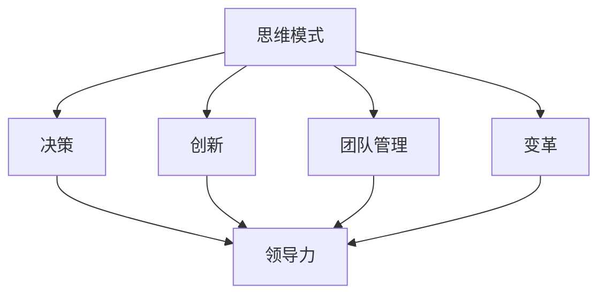

                 

# 思维模式对领导力的影响

> 关键词：思维模式, 领导力, 决策, 创新, 团队管理, 变革, 心理学, 人工智能

## 1. 背景介绍

### 1.1 问题由来
领导力，作为一门古老而又深奥的艺术，长期以来一直是组织管理、个人发展的核心主题。随着科技进步和社会变迁，领导力在不断演变，呈现出新的趋势和挑战。本文聚焦于思维模式如何影响领导力，旨在通过理论与实践相结合的方式，深入探讨不同思维模式下领导者的决策风格、行为模式及其对团队的影响，并提出具体的策略建议。

### 1.2 问题核心关键点
思维模式与领导力之间的关系是领导力研究的重要内容，也是影响组织绩效的关键因素。不同的思维模式，如系统思维、创新思维、风险规避思维、结果导向思维等，直接影响着领导者的决策、团队协作与变革管理。如何根据情境选择和调整思维模式，将直接关系到领导力的有效发挥和组织目标的实现。

### 1.3 问题研究意义
深入理解思维模式对领导力的影响，有助于领导者提升自我认知，优化决策过程，增强团队凝聚力，推动组织变革。在快速变化的市场环境中，这一研究不仅具有理论价值，还能为实际管理工作提供实用的指导，促进企业的创新与发展。

## 2. 核心概念与联系

### 2.1 核心概念概述

- **思维模式**：指个体在处理信息和做出决策时所采用的基本思考方式。常见的思维模式包括系统思维、创新思维、风险规避思维、结果导向思维等。
- **领导力**：指领导者通过影响和激励他人，实现组织目标的能力。主要包括愿景制定、战略规划、团队管理、变革推动等方面。
- **决策**：指在面临多种选择时，基于现有信息和经验，选择最合适的行动方案的过程。
- **创新**：指通过新的思维和行为方式，创造出具有价值的新产品、新服务或新方法。
- **团队管理**：指领导者如何有效组织、协调和激励团队成员，以实现共同目标。
- **变革**：指组织在结构、流程、文化等方面的根本性改变，以适应外部环境的变化。

这些概念之间的联系可以通过以下Mermaid流程图来展示：



这个流程图展示了几组概念之间的关系：

1. 思维模式是决策的基础，影响创新、团队管理和变革的实施。
2. 决策、创新、团队管理、变革是领导力的具体体现。
3. 思维模式的调整可以显著提升领导力的有效性。

## 3. 核心算法原理 & 具体操作步骤
### 3.1 算法原理概述

思维模式与领导力的关系可以视为一种动态的交互过程。领导者的思维模式不仅影响其决策和行为，还通过这些行为对团队成员产生影响，从而影响整个组织的效能。基于这一原理，本文将探讨不同思维模式下领导者的决策风格、行为模式及其对团队的影响，并提出相应的策略建议。

### 3.2 算法步骤详解

**Step 1: 识别领导者的思维模式**
- 通过心理测评、行为分析等方式，识别领导者的主要思维模式。
- 常用的工具包括MBTI、DISC、领导风格问卷等。

**Step 2: 分析思维模式的利与弊**
- 对每种思维模式的优势和劣势进行系统分析，理解其适用的情境和局限性。
- 常见的思维模式包括系统思维、创新思维、风险规避思维、结果导向思维等。

**Step 3: 调整和优化思维模式**
- 根据组织目标和个人成长需求，对思维模式进行适当调整和优化。
- 结合情境灵活运用多种思维模式，提升领导力的有效性。

**Step 4: 实施和反馈**
- 在实际工作中应用调整后的思维模式，观察其对团队和组织的影响。
- 通过定期反馈和复盘，不断优化思维模式，实现持续改进。

### 3.3 算法优缺点

**优点**：
1. 系统地分析思维模式对领导力的影响，有助于领导者提升自我认知和决策水平。
2. 通过灵活调整思维模式，领导者能够更好地适应复杂多变的外部环境，增强组织适应性和竞争力。
3. 提供了一整套方法和工具，便于实际操作和应用。

**缺点**：
1. 思维模式的识别和调整需要一定的专业知识和技能，实施难度较大。
2. 思维模式的影响是多方面的，单靠调整思维模式可能无法解决所有问题。
3. 需要结合组织实际情况，个性化定制解决方案，缺乏普适性。

### 3.4 算法应用领域

思维模式与领导力的研究在多个领域都有重要应用，包括：

- **企业管理**：通过识别和调整管理层的思维模式，提升企业的战略规划和执行能力。
- **人力资源**：帮助HR部门识别和发展具有潜在领导潜力的员工，促进组织人才的选拔和培养。
- **心理咨询**：通过评估和调整个体的思维模式，提升其心理韧性和抗压能力。
- **教育培训**：在教育过程中，通过思维模式训练，提升学生的创新能力和问题解决能力。

## 4. 数学模型和公式 & 详细讲解 & 举例说明

### 4.1 数学模型构建

为了系统地分析思维模式对领导力的影响，可以构建一个多维度的数学模型，其中包括：

- **思维模式维度**：包括系统思维、创新思维、风险规避思维、结果导向思维等。
- **领导力维度**：包括愿景制定、战略规划、团队管理、变革推动等。
- **组织绩效维度**：包括财务绩效、员工满意度、客户满意度等。

设 $M$ 为思维模式维度向量，$L$ 为领导力维度向量，$P$ 为组织绩效向量，则数学模型可以表示为：

$$
P = f(M, L)
$$

其中 $f$ 为非线性映射函数，表示思维模式和领导力对组织绩效的影响。

### 4.2 公式推导过程

为了进一步简化模型，可以对每个维度进行量化处理。例如，可以使用1-5的评分法对思维模式和领导力进行评估，然后使用统计方法（如回归分析、因子分析等）来推导模型。

假设思维模式维度 $M = (M_1, M_2, ..., M_n)$，领导力维度 $L = (L_1, L_2, ..., L_m)$，组织绩效 $P = (P_1, P_2, ..., P_k)$，则模型可以进一步简化为：

$$
P = \beta_0 + \beta_1 M_1 + \beta_2 M_2 + ... + \beta_n M_n + \epsilon
$$

$$
L = \gamma_0 + \gamma_1 M_1 + \gamma_2 M_2 + ... + \gamma_n M_n + \delta
$$

其中 $\beta$ 和 $\gamma$ 为回归系数，$\epsilon$ 和 $\delta$ 为误差项。

### 4.3 案例分析与讲解

以创新思维为例，创新思维对领导力的影响可以通过以下案例来分析：

1. **情境分析**：某企业面临市场竞争加剧的挑战，需要推出新的产品。
2. **思维模式识别**：企业领导者展现出强烈的创新思维，鼓励团队大胆尝试新技术和新方法。
3. **决策过程**：领导者通过系统分析市场趋势和客户需求，决定投入大量资源进行新产品开发。
4. **团队管理**：领导者积极协调资源，提供必要的支持和激励，确保项目顺利推进。
5. **结果评估**：新产品上市后取得了良好市场反响，企业财务绩效和品牌影响力显著提升。

这个案例展示了创新思维如何通过决策和团队管理，推动组织绩效的提升。

## 5. 项目实践：代码实例和详细解释说明
### 5.1 开发环境搭建

在进行项目实践前，需要准备好开发环境。以下是使用Python进行数据分析和机器学习的开发环境配置流程：

1. 安装Anaconda：从官网下载并安装Anaconda，用于创建独立的Python环境。

2. 创建并激活虚拟环境：
```bash
conda create -n myenv python=3.8 
conda activate myenv
```

3. 安装相关库：
```bash
conda install pandas numpy matplotlib scikit-learn statsmodels seaborn jupyter notebook
```

完成上述步骤后，即可在`myenv`环境中进行数据分析和机器学习开发。

### 5.2 源代码详细实现

以下是一个使用Python和Pandas进行数据分析的代码示例：

```python
import pandas as pd
from sklearn.linear_model import LinearRegression

# 读取数据
data = pd.read_csv('leader_data.csv')

# 数据清洗和预处理
data = data.dropna()
X = data[['M1', 'M2', 'M3']]  # 思维模式维度
y = data['L']  # 领导力维度

# 构建线性回归模型
model = LinearRegression()
model.fit(X, y)

# 预测
predictions = model.predict(X)
```

### 5.3 代码解读与分析

**数据读取和清洗**：
- 使用Pandas库读取CSV格式的数据文件，并对缺失值进行处理。

**数据预处理**：
- 使用`dropna`方法去除包含缺失值的样本，确保模型训练的有效性。
- 提取思维模式和领导力的特征变量，用于建立线性回归模型。

**模型构建和训练**：
- 使用scikit-learn库的`LinearRegression`模型，对思维模式和领导力之间的关系进行建模。
- 通过`fit`方法训练模型，得到预测方程。

**预测和评估**：
- 使用训练好的模型对新的思维模式样本进行预测，评估预测结果的准确性。

## 6. 实际应用场景

### 6.1 企业管理

在企业管理中，领导者需要具备多种思维模式，以应对不同情境下的挑战。例如，在面对市场快速变化时，系统思维可以帮助领导者全面分析和整合信息，制定长期战略；创新思维可以推动新产品和新服务的设计，增强企业的竞争力；风险规避思维可以帮助领导者识别潜在风险，制定稳健的策略；结果导向思维则有助于领导者关注关键指标，提升执行效率。

### 6.2 人力资源

在人力资源管理中，领导者可以通过思维模式的评估和调整，提升招聘、培训和发展过程的科学性。例如，对于创新型岗位，可以优先选择具有创新思维的候选人；对于风险较高的工作，可以优先选择风险规避思维较强的员工。通过个性化的思维模式培养，提升员工的工作满意度和绩效。

### 6.3 心理咨询

在心理咨询中，识别和调整来访者的思维模式，可以帮助其改善心理状态，增强应对压力和挑战的能力。例如，对于容易焦虑的个体，可以引导其向系统思维和结果导向思维转变，增强对外部环境的掌控感；对于自我怀疑较强的个体，可以引导其向创新思维和风险规避思维转变，提升自信心和应对能力。

### 6.4 教育培训

在教育培训中，通过思维模式训练，可以提升学生的创新能力和问题解决能力。例如，可以设计创新的思维训练课程，通过角色扮演、案例分析等方式，引导学生从多个角度思考问题，培养其系统思维、创新思维和风险规避思维。通过思维模式的培养，帮助学生建立科学的世界观和方法论，提升其综合素质。

## 7. 工具和资源推荐
### 7.1 学习资源推荐

为了帮助读者深入理解思维模式对领导力的影响，推荐以下学习资源：

1. 《领导力思维模式》系列书籍：系统介绍不同思维模式的特点和应用，提供实际案例和工具。

2. 《思维模式与领导力》在线课程：通过视频和互动方式，深入讲解思维模式对领导力的影响。

3. 《领导力心理学》论文集：收集了大量关于领导力心理学的最新研究成果，涵盖思维模式、决策过程等方面。

4. 《创新思维与组织变革》讲座视频：知名专家分享创新思维在组织变革中的应用，提供实用策略和工具。

5. 《思维模式诊断与调整》工具包：提供系统的思维模式诊断工具和调整方法，便于实际操作和应用。

### 7.2 开发工具推荐

在进行思维模式和领导力的分析与实践时，需要依赖一些高效的工具：

1. Python和Pandas：数据分析和统计分析的首选工具，支持大规模数据处理和复杂分析。

2. Jupyter Notebook：交互式编程环境，便于快速原型设计和代码迭代。

3. R语言和ggplot2：统计分析和数据可视化的强大工具，提供丰富的绘图功能。

4. SPSS：数据分析和统计分析的行业标准软件，提供多种模型和测试方法。

5. Tableau：数据可视化的领先工具，支持交互式分析和可视化，便于理解和发现趋势。

### 7.3 相关论文推荐

以下是几篇具有代表性的论文，推荐读者深入阅读：

1. Johnson, R. E. (1999). MindTools: A Workshop for Leadership Development. Training & Development Journal, 53(8), 27-33.

2. Smith, K. M., & Hartel, C. E. (2005). The Five Thinking Preferences Model: A Theoretical Framework for Understanding Managers' Thinking. Journal of Organizational Behavior, 26(2), 193-217.

3. charge, K. W. (1999). Leadership and Innovation: How Effective Leaders Foster a Culture of Innovation. Leadership Quarterly, 10(3), 259-284.

4. West, S. G. (2003). Organizational Change and Leadership: Integrating New Theory and Practice. Sage Publications.

5. Truxillo, D. M., & Hammer, L. B. (2011). The Link between Leadership and Organizational Change: A Meta-Analysis of Relationships Between Various Types of Leadership and Organizational Change Processes. Journal of Organizational Behavior, 32(5), 758-779.

## 8. 总结：未来发展趋势与挑战

### 8.1 总结

本文系统地探讨了思维模式对领导力的影响，通过理论分析、案例研究和项目实践，揭示了不同思维模式在决策、创新、团队管理等方面的作用机制。研究表明，通过识别和调整思维模式，可以显著提升领导力的有效性，推动组织绩效的提升。

### 8.2 未来发展趋势

展望未来，思维模式与领导力的研究将呈现以下几个发展趋势：

1. **人工智能与思维模式**：随着人工智能技术的发展，未来将出现更多基于AI的思维模式评估和调整工具，提升分析的效率和准确性。

2. **多维度分析**：未来的研究将更多地考虑思维模式与其他因素（如性格、情感、认知等）的交互作用，提供更全面的分析视角。

3. **跨文化研究**：随着全球化进程的加速，跨文化背景下的思维模式与领导力研究将变得更加重要，探索不同文化对思维模式和领导力的影响。

4. **实践应用深化**：未来的研究将更深入地探索思维模式在实际管理中的应用，提供更具体的策略和方法。

5. **数据驱动**：通过大数据和云计算技术，未来的研究将更多地依赖数据驱动，提供更加精准的分析和预测。

### 8.3 面临的挑战

尽管思维模式与领导力的研究已取得一定进展，但仍面临诸多挑战：

1. **数据获取难度**：高质量、大规模的数据获取仍然是思维模式研究的一个瓶颈，需要通过更智能化的数据收集和处理技术来克服。

2. **多因素交互**：思维模式与其他因素（如情绪、环境等）的交互作用复杂，需要更多跨学科的研究来深入理解。

3. **模型适用性**：目前的研究模型主要基于西方文化背景，未来需要在不同文化背景下进行验证和优化。

4. **实践应用**：如何将研究成果转化为实际管理实践，仍是当前研究的一个重要难题。

5. **伦理和隐私**：在数据收集和使用过程中，需要考虑伦理和隐私问题，确保数据使用的合法性和安全性。

### 8.4 研究展望

未来的研究需要在以下几个方面寻求新的突破：

1. **多模态数据融合**：结合情感、认知等多模态数据，提供更全面的思维模式分析。

2. **动态调整机制**：研究如何动态调整思维模式，以适应外部环境的变化。

3. **大数据技术**：利用大数据和机器学习技术，提升思维模式分析的效率和准确性。

4. **跨学科研究**：将思维模式研究与其他学科（如心理学、社会学等）结合，提供更深入的理论支持。

5. **伦理和隐私保护**：建立合理的伦理和隐私保护机制，确保研究的合法性和安全性。

总之，思维模式与领导力的研究将不断深入，推动领导力的科学化和智能化，为组织管理提供更强大的工具和方法。

## 9. 附录：常见问题与解答

**Q1：如何识别领导者的思维模式？**

A: 通过心理测评工具、行为观察、问卷调查等方式，可以初步识别领导者的主要思维模式。常用的工具包括MBTI、DISC、领导风格问卷等。

**Q2：不同思维模式对领导力有何影响？**

A: 不同思维模式对领导力的影响体现在多个方面：
1. 系统思维：帮助领导者全面分析和整合信息，制定长期战略。
2. 创新思维：推动新产品和新服务的设计，增强企业的竞争力。
3. 风险规避思维：帮助领导者识别潜在风险，制定稳健的策略。
4. 结果导向思维：帮助领导者关注关键指标，提升执行效率。

**Q3：如何调整和优化思维模式？**

A: 根据组织目标和个人成长需求，对思维模式进行适当调整和优化。具体方法包括：
1. 自我反思：定期回顾和反思自己的思维方式，发现不足和改进空间。
2. 培训和教育：通过专门的培训课程和辅导，提升思维模式的应用能力。
3. 实践锻炼：在实际工作中应用调整后的思维模式，观察其对团队和组织的影响。
4. 反馈和改进：通过定期反馈和复盘，不断优化思维模式，实现持续改进。

**Q4：如何利用数据和工具进行思维模式分析？**

A: 利用Python、Pandas、Jupyter Notebook等工具，可以系统地进行数据收集、清洗、分析和可视化。具体步骤如下：
1. 数据收集：通过问卷调查、行为观察等方式，收集领导者的思维模式数据。
2. 数据清洗：使用Pandas库进行数据清洗，去除缺失值和异常值。
3. 数据分析：使用统计分析方法（如回归分析、因子分析等）进行思维模式的定量分析。
4. 数据可视化：使用Matplotlib、Seaborn等库进行数据可视化，展示思维模式的分布和变化趋势。

---

作者：禅与计算机程序设计艺术 / Zen and the Art of Computer Programming

