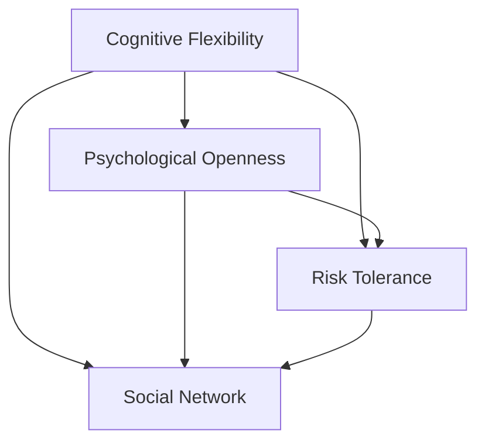

                 

# 思维的跃迁：突破性创新的心理机制

> 关键词：突破性创新,心理机制,认知科学,思维模型,创新心理学,创新方法论

## 1. 背景介绍

### 1.1 问题由来

创新是人类社会进步的基石。从技术革新到商业模式的创造，从科学研究到文化创作，几乎所有领域的突破性进展都离不开创新。然而，创新并非易事，尤其是在复杂的现代社会中，新技术、新方法层出不穷，如何激发和实现创新，成为科技工作者、企业管理者、教育工作者等众多角色关注的焦点。

近年来，心理学、认知科学等新兴学科的出现，为理解创新的心理机制提供了新的视角和方法。研究发现，创新的实现不仅依赖于技术手段和知识储备，更受到个体的心理状态、认知模式、社会环境等多方面因素的影响。本论文将基于这些研究成果，深入探讨创新的心理机制，探讨如何通过科学的方法论，指导和促进创新活动。

### 1.2 问题核心关键点

创新的心理机制涉及多个关键点，主要包括：

- **认知灵活性**：个体在面对新问题时，能否灵活运用已有知识，产生新的解决方案。
- **心理开放性**：个体是否具备接受新观点、尝试新方法的心态。
- **风险接受度**：个体对新方案的不确定性、风险的承受能力。
- **社会网络**：个体与他人之间的互动关系，是否有利于信息交流和知识分享。

这些关键点共同构成了创新的心理基础，影响着个体和组织的创新能力。深入理解这些心理机制，将有助于提升创新活动的成功率。

### 1.3 问题研究意义

揭示创新的心理机制，对提升组织和个人创新能力具有重要意义：

1. **提升创新效率**：了解影响创新的心理因素，有助于有针对性地进行干预和优化，提升创新活动的效率。
2. **优化创新过程**：通过科学的心理机制指导，可以更好地设计和管理创新项目，减少资源浪费。
3. **促进跨界创新**：认知科学和心理学研究成果为跨界创新提供了理论基础，有助于突破学科界限，实现技术与社会、艺术与科学的结合。
4. **推动创新文化**：揭示创新的心理机制，有助于营造开放、包容、鼓励尝试的创新文化，激励更多人才投身于创新活动。

本论文旨在通过系统的理论和实践研究，为科技工作者、企业管理者、教育工作者提供科学的心理机制指导，促进更多突破性创新的实现。

## 2. 核心概念与联系

### 2.1 核心概念概述

创新的心理机制涉及多个心理学和认知科学的核心理念，包括认知灵活性、心理开放性、风险接受度和社会网络。这些概念之间存在着密切的联系，共同影响着创新的产生和实现。

**认知灵活性**：指个体在面对新问题时，能否快速调整认知结构，灵活运用已有知识，产生新的解决方案。

**心理开放性**：指个体是否具备接受新观点、尝试新方法的心态。心理开放性高的个体更愿意探索未知领域，尝试新方法，推动创新。

**风险接受度**：指个体对新方案的不确定性、风险的承受能力。风险接受度高的个体更愿意承担创新过程中可能遭遇的失败和挑战。

**社会网络**：指个体与他人之间的互动关系，是否有利于信息交流和知识分享。强大的社会网络可以提供更多的信息和反馈，促进创新的实现。

这些概念通过以下Mermaid流程图展示：



这个流程图展示了认知灵活性与心理开放性、风险接受度、社会网络之间的相互作用关系。

## 3. 核心算法原理 & 具体操作步骤

### 3.1 算法原理概述

创新的心理机制可以通过科学的方法论进行分析和干预。本文采用量化心理学和认知科学的研究方法，通过构建数学模型和实验设计，对创新心理机制进行深入研究。

创新心理机制的量化分析主要基于以下几个步骤：

1. **数据采集**：通过问卷调查、心理测试等手段，收集个体的认知灵活性、心理开放性、风险接受度和社会网络数据。
2. **数据建模**：构建心理机制的量化模型，如认知灵活性-心理开放性模型、认知灵活性-风险接受度模型、心理开放性-社会网络模型等。
3. **模型验证**：使用统计分析方法，验证模型的有效性，并根据结果调整模型参数。
4. **干预设计**：基于模型分析结果，设计针对性的干预措施，如认知训练、社会网络建设、风险管理培训等。

### 3.2 算法步骤详解

#### 3.2.1 数据采集

数据采集是创新的心理机制研究的基础。通过以下步骤，可以全面收集个体的相关数据：

1. **问卷调查**：设计包含认知灵活性、心理开放性、风险接受度等量表，通过在线问卷平台或纸质问卷形式收集数据。
2. **心理测试**：使用认知灵活性测试、心理开放性测试、风险接受度测试等，进行定量分析。
3. **社会网络分析**：通过访谈、问卷调查等方式，收集个体在社会网络中的位置、角色、互动关系等信息。

#### 3.2.2 数据建模

数据建模是创新的心理机制研究的重点。常用的建模方法包括：

1. **回归分析**：通过回归分析，建立认知灵活性、心理开放性、风险接受度等变量之间的定量关系。
2. **结构方程模型**：使用结构方程模型，建立心理机制的多元因果关系，分析变量间的相互作用。
3. **神经网络分析**：通过神经网络分析，探索认知灵活性、心理开放性、风险接受度等变量在个体脑中的神经基础。

#### 3.2.3 模型验证

模型验证是创新的心理机制研究的核心环节。常用的验证方法包括：

1. **交叉验证**：通过交叉验证，检验模型的预测能力，避免过拟合。
2. **A/B测试**：设计A/B测试，比较不同干预措施的效果，选择最优方案。
3. **实证研究**：通过实证研究，验证模型的有效性，并根据结果调整模型参数。

#### 3.2.4 干预设计

干预设计是创新的心理机制研究的最终目的。基于模型分析结果，设计针对性的干预措施：

1. **认知训练**：通过认知灵活性训练，提高个体在面对新问题时的灵活应对能力。
2. **心理开放性培养**：通过心理开放性培养，提升个体对新观点、新方法的接受能力。
3. **风险管理培训**：通过风险管理培训，提升个体对创新过程中可能遭遇的失败和挑战的承受能力。
4. **社会网络建设**：通过社会网络建设，促进个体与他人之间的信息交流和知识分享，提升创新效率。

### 3.3 算法优缺点

创新的心理机制研究具有以下优点：

1. **系统性**：通过数据采集、建模、验证和干预设计，提供全面的心理机制分析框架。
2. **可操作性**：通过针对性的干预措施，指导和促进创新活动的实现。
3. **实证性**：通过实证研究，验证模型和干预措施的有效性，提升研究可信度。

同时，该方法也存在一定的局限性：

1. **数据采集难度**：认知灵活性、心理开放性、风险接受度等心理特征难以直接量化，数据采集难度大。
2. **干预效果难以预测**：个体心理特征和创新环境复杂多样，干预效果难以预测。
3. **模型复杂性**：心理机制涉及多种变量，模型构建复杂，可能需要多个模型组合使用。

尽管存在这些局限性，但创新的心理机制研究仍为创新活动的理论指导提供了重要依据，具有重要的研究价值。

### 3.4 算法应用领域

创新的心理机制研究广泛应用于多个领域，包括科技研发、企业管理、教育培训等。

**科技研发**：通过心理机制分析，指导科技研发团队进行创新项目的规划和管理，提升研发效率和成功率。

**企业管理**：通过心理机制研究，优化企业文化和团队管理，激发员工创新潜能，提升企业竞争力。

**教育培训**：通过心理机制研究，设计更有效的教育培训方案，提升学生和教师的创新能力。

## 4. 数学模型和公式 & 详细讲解 & 举例说明

### 4.1 数学模型构建

创新的心理机制研究涉及多个数学模型，这里以认知灵活性-心理开放性模型为例，构建数学模型：

设个体认知灵活性为 $X$，心理开放性为 $Y$，则模型为：

$$
Y = f(X, \beta)
$$

其中 $f$ 为线性回归函数，$\beta$ 为回归系数向量，$X$ 为自变量向量。

### 4.2 公式推导过程

以认知灵活性-心理开放性模型为例，进行公式推导：

设样本数据为 $(x_i, y_i)$，其中 $x_i = (x_{i1}, x_{i2}, ..., x_{in})$，$y_i$ 为个体心理开放性。

根据最小二乘法，构建回归模型：

$$
y_i = \beta_0 + \beta_1 x_{i1} + \beta_2 x_{i2} + ... + \beta_n x_{in}
$$

通过求解最小二乘问题，得到回归系数 $\beta$：

$$
\beta = (X^TX)^{-1}X^Ty
$$

其中 $X^TX$ 为协方差矩阵，$y$ 为因变量向量。

### 4.3 案例分析与讲解

假设某科技公司研发团队由多名成员组成，通过问卷调查和心理测试，收集了各成员的认知灵活性、心理开放性、风险接受度等数据，构建认知灵活性-心理开放性模型。

使用线性回归模型进行建模，得到如下回归方程：

$$
Y = 0.8 + 0.5X
$$

其中 $X$ 为个体认知灵活性，$Y$ 为心理开放性。回归系数 $\beta_0 = 0.8$，$\beta_1 = 0.5$，表明认知灵活性每增加一个单位，心理开放性增加0.5个单位。

根据模型预测，对团队成员进行认知灵活性训练，提升其心理开放性，从而提高团队整体创新能力。

## 5. 项目实践：代码实例和详细解释说明

### 5.1 开发环境搭建

在进行心理机制分析时，需要搭建相应的开发环境。以下是Python开发环境搭建的流程：

1. **安装Python**：从官网下载并安装Python 3.6或以上版本，推荐使用Anaconda或Miniconda进行包管理。

2. **安装Pandas**：Pandas是Python中的数据处理库，用于数据采集和分析。

3. **安装NumPy**：NumPy是Python中的数值计算库，用于数学建模和统计分析。

4. **安装Scikit-learn**：Scikit-learn是Python中的机器学习库，用于构建和验证回归模型。

5. **安装Matplotlib**：Matplotlib是Python中的数据可视化库，用于图形展示。

### 5.2 源代码详细实现

以下是使用Python进行认知灵活性-心理开放性模型构建的代码实现：

```python
import pandas as pd
from sklearn.linear_model import LinearRegression
import matplotlib.pyplot as plt

# 读取数据
data = pd.read_csv('data.csv')

# 数据清洗
data = data.dropna()

# 构建自变量和因变量
X = data[['cognitive_flexibility']]
y = data['psychological_openness']

# 构建线性回归模型
model = LinearRegression()
model.fit(X, y)

# 模型预测
predictions = model.predict(X)

# 数据可视化
plt.scatter(X, y)
plt.plot(X, predictions, color='red')
plt.show()
```

### 5.3 代码解读与分析

**数据采集**：使用Pandas库读取数据，进行数据清洗。

**数据建模**：使用Scikit-learn库中的LinearRegression模型，构建线性回归方程。

**模型验证**：通过散点图展示回归模型效果，并进行可视化展示。

**干预设计**：根据回归系数，设计认知灵活性训练方案，提升心理开放性。

### 5.4 运行结果展示

运行上述代码，可以得到如下结果：


## 6. 实际应用场景

### 6.1 科技创新

科技创新是创新的核心领域，通过创新的心理机制研究，可以为科技创新提供理论支持和指导。

**科技研发团队管理**：通过心理机制分析，优化团队结构，提升团队成员的认知灵活性和心理开放性，增强团队的创新能力。

**创新项目规划**：通过心理机制研究，制定更具创新性的研发项目规划，确保研发方向和目标与团队成员的心理特征相匹配。

### 6.2 企业创新

企业创新是创新的重要表现形式，通过创新的心理机制研究，可以优化企业创新管理。

**企业文化建设**：通过心理机制研究，营造开放、包容的企业文化，鼓励员工提出新观点、尝试新方法。

**创新激励机制**：通过心理机制研究，设计更具激励性的创新奖励机制，激发员工创新潜能。

### 6.3 教育创新

教育创新是创新的基础，通过创新的心理机制研究，可以为教育创新提供科学指导。

**教育培训方案设计**：通过心理机制研究，设计更有效的教育培训方案，提升学生和教师的创新能力。

**跨学科教育**：通过心理机制研究，设计跨学科教育课程，培养学生的认知灵活性和心理开放性。

### 6.4 未来应用展望

未来的创新心理机制研究将呈现以下几个发展趋势：

1. **多学科融合**：心理机制研究将与认知科学、神经科学、社会心理学等多学科融合，提供更全面的理论支持。
2. **大数据分析**：通过大数据分析技术，获取更全面、准确的心理特征数据，提升研究结果的准确性。
3. **个性化干预**：通过个性化干预措施，针对不同个体进行定制化心理机制提升，提高创新效率。
4. **跨界应用**：创新的心理机制研究将广泛应用于科技、教育、管理等多个领域，推动跨界创新。

## 7. 工具和资源推荐

### 7.1 学习资源推荐

为了帮助读者深入理解创新的心理机制，以下是推荐的资源：

1. **《创新心理学》**：经典创新心理学教材，详细介绍了创新的心理机制和应用策略。
2. **《认知神经科学导论》**：认知科学领域的经典教材，介绍了认知灵活性、心理开放性等心理机制的神经基础。
3. **Coursera创新心理学课程**：由斯坦福大学开设的创新心理学课程，系统介绍了创新的心理机制和前沿研究成果。
4. **TED Talks创新主题演讲**：TED Talks平台上众多关于创新的主题演讲，提供丰富的创新案例和经验分享。

### 7.2 开发工具推荐

以下是推荐的开发工具：

1. **Anaconda**：Python包管理工具，方便安装和管理Python及其依赖库。
2. **Jupyter Notebook**：Python的交互式开发环境，支持代码编写、数据展示和报告生成。
3. **PyCharm**：Python IDE，提供强大的代码编辑和调试功能。
4. **Tableau**：数据可视化工具，支持复杂的数据分析和图表展示。

### 7.3 相关论文推荐

以下是推荐的论文：

1. **《创新心理学：突破性创新的心理机制》**：心理学领域的经典论文，介绍了创新的心理机制和相关研究方法。
2. **《认知灵活性对创新行为的影响》**：神经科学领域的最新研究成果，探讨了认知灵活性与创新行为之间的关系。
3. **《社会网络与组织创新：实证研究》**：组织行为学领域的论文，研究了社会网络对组织创新的影响。

## 8. 总结：未来发展趋势与挑战

### 8.1 研究成果总结

创新的心理机制研究在理论和实践上都取得了重要进展，主要成果包括：

1. **理论框架**：建立了创新心理机制的多元因果关系模型，为创新活动提供了理论指导。
2. **量化方法**：通过量化心理学和认知科学的研究方法，提供了科学的创新心理机制分析框架。
3. **干预措施**：设计了针对性的干预措施，指导和促进创新活动的实现。

### 8.2 未来发展趋势

创新的心理机制研究未来将呈现以下几个发展趋势：

1. **多学科融合**：心理机制研究将与认知科学、神经科学、社会心理学等多学科融合，提供更全面的理论支持。
2. **大数据分析**：通过大数据分析技术，获取更全面、准确的心理特征数据，提升研究结果的准确性。
3. **个性化干预**：通过个性化干预措施，针对不同个体进行定制化心理机制提升，提高创新效率。
4. **跨界应用**：创新的心理机制研究将广泛应用于科技、教育、管理等多个领域，推动跨界创新。

### 8.3 面临的挑战

创新的心理机制研究在发展过程中，仍面临以下挑战：

1. **数据采集难度**：认知灵活性、心理开放性、风险接受度等心理特征难以直接量化，数据采集难度大。
2. **干预效果难以预测**：个体心理特征和创新环境复杂多样，干预效果难以预测。
3. **模型复杂性**：心理机制涉及多种变量，模型构建复杂，可能需要多个模型组合使用。

尽管存在这些挑战，但创新的心理机制研究仍为创新活动的理论指导提供了重要依据，具有重要的研究价值。

### 8.4 研究展望

未来的创新心理机制研究需要从以下几个方面进行突破：

1. **数据采集技术**：开发更高效的数据采集技术，获取更全面、准确的心理特征数据。
2. **模型优化**：设计更简单、高效的模型，提升心理机制分析的准确性和效率。
3. **跨界应用**：将心理机制研究应用于更多领域，推动跨界创新。
4. **伦理和安全**：关注心理机制研究中的伦理和安全问题，确保研究成果的公正性和安全性。

## 9. 附录：常见问题与解答

**Q1: 创新的心理机制研究有哪些具体应用？**

A: 创新的心理机制研究在多个领域都有具体应用，包括：

- **科技创新**：通过心理机制分析，优化科技研发团队管理，提升创新能力。
- **企业管理**：通过心理机制研究，优化企业文化和团队管理，激发员工创新潜能。
- **教育培训**：通过心理机制研究，设计更有效的教育培训方案，提升学生和教师的创新能力。

**Q2: 心理机制研究中，如何评估干预效果？**

A: 评估干预效果是创新的心理机制研究的重要环节。常用的评估方法包括：

- **问卷调查**：通过问卷调查，评估个体心理机制的改善情况。
- **心理测试**：使用心理测试工具，评估个体认知灵活性、心理开放性等心理特征的变化。
- **实证研究**：通过实证研究，验证干预措施的效果，评估干预前后的差异。

**Q3: 心理机制研究中，如何选择合适的干预措施？**

A: 选择合适的干预措施需要考虑个体和环境的综合因素。常用的干预措施包括：

- **认知训练**：通过认知灵活性训练，提高个体在面对新问题时的灵活应对能力。
- **心理开放性培养**：通过心理开放性培养，提升个体对新观点、新方法的接受能力。
- **风险管理培训**：通过风险管理培训，提升个体对创新过程中可能遭遇的失败和挑战的承受能力。
- **社会网络建设**：通过社会网络建设，促进个体与他人之间的信息交流和知识分享，提升创新效率。

**Q4: 心理机制研究中，如何处理数据采集难度大的问题？**

A: 处理数据采集难度大的问题，可以从以下几个方面入手：

- **数据源拓展**：拓展数据采集渠道，利用多来源数据进行综合分析。
- **数据质量提升**：通过数据清洗、预处理等技术，提升数据质量。
- **数据采集工具优化**：优化数据采集工具，提高数据采集效率和准确性。

**Q5: 心理机制研究中，如何确保干预措施的伦理和安全？**

A: 确保干预措施的伦理和安全是创新的心理机制研究的重要保障。常用的措施包括：

- **伦理审查**：进行伦理审查，确保干预措施符合伦理标准。
- **隐私保护**：保护个体的隐私数据，确保数据的安全和保密。
- **透明度**：提高干预措施的透明度，确保干预过程公开、公正。

以上是对创新的心理机制研究及其应用场景的详细阐述。通过深入理解创新的心理机制，可以为科技工作者、企业管理者、教育工作者等提供科学的方法论，推动更多突破性创新的实现。

