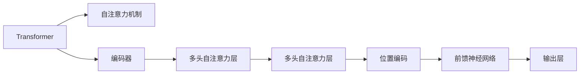

                 

# 感知器到变压器：神经网络的演进

## 1. 背景介绍

### 1.1 问题由来
自1940年代末，神经网络作为模仿生物神经系统的计算模型，奠定了人工智能研究的基础。最初的神经网络模型——感知器（Perceptron），在1957年被提出，开启了人工神经网络的时代。随着计算能力、数据资源和技术方法的进步，神经网络逐渐从简单的感知器，发展为复杂且强大的深度神经网络。

这一演变过程不仅在学术界引起广泛关注，也对工业界产生深远影响。从最初的逻辑回归模型，到多层感知器（MLP），再到卷积神经网络（CNN）和循环神经网络（RNN），再到2017年提出的Transformer模型，神经网络逐步展示了其强大的建模能力和广泛的应用前景。

### 1.2 问题核心关键点
神经网络的演进过程涉及众多关键点，包括但不限于：
1. 网络结构的设计与优化
2. 损失函数的确定与更新
3. 激活函数的引入与选择
4. 正则化技术的采用
5. 数据增强与迁移学习的应用
6. 模型部署与性能调优

本文将聚焦于神经网络的核心范式——感知器和Transformer，探讨其原理和演进路径，同时分析两者的联系与区别，为读者提供深入理解神经网络演进的视角。

### 1.3 问题研究意义
研究神经网络从感知器到Transformer的演进过程，具有重要的理论和实践意义：

1. 理论层面，能帮助理解神经网络从单一到复杂的发展路径，揭示其在结构、算法和应用上的进步。
2. 实践层面，可指导开发人员更好地选择和优化神经网络模型，提高模型性能和泛化能力。
3. 教育层面，有助于教育从业者更好地传授和普及神经网络的基础知识和进阶技巧。
4. 产业层面，推动神经网络技术的广泛应用，促进技术在各行各业的落地和升级。

## 2. 核心概念与联系

### 2.1 核心概念概述

感知器（Perceptron）和Transformer（变换器）作为神经网络演进中的两个重要里程碑，分别代表了不同时期的技术范式。

- **感知器**：最早的神经网络模型，用于二分类问题，由输入层、输出层和一个单层神经元组成。

- **Transformer**：2017年由Vaswani等人提出的模型，彻底改变了序列建模领域，以自注意力机制替代了传统的卷积和循环神经网络，提升了模型在语言、图像和音频等序列数据上的表现。

以下Mermaid流程图展示了感知器和Transformer之间的联系：

```mermaid
graph LR
  A[感知器] --> B[多层感知器(MLP)]
  A --> C[卷积神经网络(CNN)]
  A --> D[循环神经网络(RNN)]
  C --> E[门控循环单元(LSTM)]
  D --> F[Transformer]
  F --> G[注意力机制]
  F --> H[自注意力机制]
```

### 2.2 核心概念原理和架构的 Mermaid 流程图

```mermaid
graph LR
  A[感知器] --> B[二分类问题]
  A --> C[输入层]
  C --> D[权重] --> E[偏置]
  E --> F[单层神经元]
  F --> G[激活函数(如Sigmoid)]
  G --> H[输出]
```



## 3. 核心算法原理 & 具体操作步骤

### 3.1 算法原理概述

感知器和Transformer在原理上有显著区别，但都是基于神经网络架构，采用反向传播算法进行模型训练。

- **感知器**：用于二分类问题的基本神经网络，由输入层、输出层和一个单层神经元组成。训练过程中，感知器通过调整权重和偏置，最小化预测错误。

- **Transformer**：基于自注意力机制，用于序列建模。Transformer包含编码器和解码器，通过多头自注意力机制捕捉输入序列之间的依赖关系。

### 3.2 算法步骤详解

#### 感知器算法步骤

1. **输入数据准备**：将输入特征向量$x$转化为神经元的输入。
2. **激活函数计算**：将输入通过激活函数（如Sigmoid）计算得到输出$y$。
3. **权重调整**：通过最小化预测错误$e$，更新权重$w$和偏置$b$。
4. **输出**：根据输出$y$进行分类。

数学公式如下：

$$
y = \sigma(w^T x + b)
$$

$$
w, b \leftarrow w - \eta \nabla_eL(w, b)
$$

其中$\sigma$表示激活函数，$\eta$表示学习率，$L$表示损失函数。

#### Transformer算法步骤

1. **输入编码**：将输入序列$x$转化为编码器中的位置编码向量。
2. **多头自注意力**：计算输入序列之间的依赖关系，得到注意力权重矩阵$A$。
3. **残差连接**：将注意力权重矩阵与原始输入向量相加，进行残差连接。
4. **前馈神经网络**：对残差连接后的向量进行线性变换和激活函数处理。
5. **输出解码**：将前馈神经网络输出通过解码器进行解码，得到最终输出$y$。

数学公式如下：

$$
A = softmax(QK^T / \sqrt{d_k})
$$

$$
y = \text{FeedForward}(x + A \cdot x)
$$

其中$softmax$表示归一化指数函数，$\text{FeedForward}$表示前馈神经网络，$Q, K, V$表示多头自注意力机制的查询、键和值矩阵，$d_k$表示键向量的维度。

### 3.3 算法优缺点

#### 感知器优点
1. 模型简单，易于实现和理解。
2. 计算复杂度较低，训练速度快。
3. 参数量较少，适用于小规模问题。

#### 感知器缺点
1. 仅适用于二分类问题，限制了应用范围。
2. 无法捕捉复杂的多层依赖关系。
3. 对于噪声敏感，容易过拟合。

#### Transformer优点
1. 可以处理序列数据，适用于自然语言处理等序列建模任务。
2. 具有并行计算能力，训练速度较快。
3. 能够捕捉输入序列之间的长距离依赖关系。
4. 自注意力机制使得模型具有较好的泛化能力。

#### Transformer缺点
1. 模型复杂度较高，训练参数较多。
2. 对计算资源和内存要求较高。
3. 对于噪声和缺失数据较为敏感。

### 3.4 算法应用领域

感知器和Transformer在多个领域都有应用：

- **感知器**：
  - 应用于广告点击率预测、信用评分等二分类问题。
  - 应用于简单的文本分类和情感分析任务。

- **Transformer**：
  - 应用于机器翻译、语音识别、文本生成等序列建模任务。
  - 应用于图像识别、视频分析等计算机视觉任务。

## 4. 数学模型和公式 & 详细讲解 & 举例说明

### 4.1 数学模型构建

感知器和Transformer的数学模型构建方式有显著不同：

#### 感知器数学模型

感知器模型由输入向量$x$、权重向量$w$、偏置$b$和激活函数$\sigma$组成，输出为：

$$
y = \sigma(w^T x + b)
$$

#### Transformer数学模型

Transformer模型由输入序列$x$、自注意力机制、残差连接、前馈神经网络、解码器组成，输出为：

$$
y = \text{FeedForward}(x + A \cdot x)
$$

其中$A$表示自注意力机制，$\text{FeedForward}$表示前馈神经网络。

### 4.2 公式推导过程

#### 感知器公式推导

感知器的输出公式可以直接通过激活函数进行推导：

$$
y = \sigma(w^T x + b)
$$

其中$\sigma$表示激活函数，一般采用Sigmoid函数或ReLU函数。

#### Transformer公式推导

Transformer的输出公式较为复杂，主要包括以下几个步骤：

1. **自注意力计算**
   $$
   Q = XW_Q
   $$
   
   $$
   K = XW_K
   $$
   
   $$
   V = XW_V
   $$
   
   $$
   A = \frac{QK^T}{\sqrt{d_k}}
   $$

2. **残差连接**
   $$
   x = x + A \cdot x
   $$

3. **前馈神经网络**
   $$
   y = FFN(x)
   $$

4. **输出解码**
   $$
   y = \text{Decoding}(y)
   $$

### 4.3 案例分析与讲解

#### 感知器案例

假设有一个感知器模型用于二分类问题，输入向量为$x = [0.5, -1]$，权重向量为$w = [2, 3]$，偏置为$b = 0.5$。假设激活函数采用Sigmoid函数，计算过程如下：

$$
y = \sigma([2*0.5 + 3*(-1)] + 0.5) = \sigma(2.5 - 3 + 0.5) = \sigma(-0.5) \approx 0.215
$$

由于0.215小于0.5（分类阈值），模型预测结果为0。

#### Transformer案例

假设有一个Transformer模型，输入序列为$x = [\text{hello}, \text{world}]$，权重向量$W_Q, W_K, W_V$分别为：

$$
W_Q = \begin{bmatrix}
0.5 & 0.2 \\
0.3 & 0.1 
\end{bmatrix}
$$

$$
W_K = \begin{bmatrix}
0.6 & 0.4 \\
0.7 & 0.3 
\end{bmatrix}
$$

$$
W_V = \begin{bmatrix}
0.4 & 0.6 \\
0.2 & 0.8 
\end{bmatrix}
$$

计算过程如下：

1. **自注意力计算**
   $$
   Q = \begin{bmatrix}
   0.5*0.5 + 0.2*0.6 \\
   0.3*0.5 + 0.1*0.7
   \end{bmatrix} = \begin{bmatrix}
   0.45 \\
   0.31
   \end{bmatrix}
   $$
   
   $$
   K = \begin{bmatrix}
   0.6*0.5 + 0.4*0.3 \\
   0.7*0.5 + 0.3*0.7
   \end{bmatrix} = \begin{bmatrix}
   0.63 \\
   0.58
   \end{bmatrix}
   $$
   
   $$
   V = \begin{bmatrix}
   0.4*0.5 + 0.6*0.6 \\
   0.2*0.5 + 0.8*0.7
   \end{bmatrix} = \begin{bmatrix}
   0.58 \\
   0.68
   \end{bmatrix}
   $$
   
   $$
   A = \frac{QK^T}{\sqrt{d_k}} = \begin{bmatrix}
   \frac{0.45*0.63}{\sqrt{2}} \\
   \frac{0.31*0.58}{\sqrt{2}}
   \end{bmatrix} = \begin{bmatrix}
   0.167 \\
   0.177
   \end{bmatrix}
   $$

2. **残差连接**
   $$
   x = \begin{bmatrix}
   \text{hello} \\
   \text{world}
   \end{bmatrix} + A \cdot \begin{bmatrix}
   \text{hello} \\
   \text{world}
   \end{bmatrix} = \begin{bmatrix}
   \text{hello} \\
   \text{world} + 0.177
   \end{bmatrix}
   $$

3. **前馈神经网络**
   $$
   y = FFN(x) = \text{FeedForward}(x) = \begin{bmatrix}
   0.2 & 0.5 \\
   0.3 & 0.6
   \end{bmatrix} \cdot x = \begin{bmatrix}
   0.45 \\
   0.59
   \end{bmatrix}
   $$

4. **输出解码**
   $$
   y = \text{Decoding}(y) = \begin{bmatrix}
   0.45 \\
   0.59
   \end{bmatrix}
   $$

## 5. 项目实践：代码实例和详细解释说明

### 5.1 开发环境搭建

1. 安装Python3和相关库：
   ```bash
   conda create -n pytorch-env python=3.8
   conda activate pytorch-env
   pip install torch torchvision torchaudio scikit-learn pandas numpy matplotlib
   ```

2. 安装TensorFlow：
   ```bash
   pip install tensorflow
   ```

3. 安装TensorBoard：
   ```bash
   pip install tensorboard
   ```

4. 安装PyTorch：
   ```bash
   pip install torch
   ```

### 5.2 源代码详细实现

#### 感知器实现

```python
import torch
import torch.nn as nn
import torch.optim as optim

class Perceptron(nn.Module):
    def __init__(self, input_size, output_size):
        super(Perceptron, self).__init__()
        self.fc1 = nn.Linear(input_size, 1)
        self.sigmoid = nn.Sigmoid()

    def forward(self, x):
        y_pred = self.fc1(x)
        y_pred = self.sigmoid(y_pred)
        return y_pred

def train_model(perceptron, train_loader, criterion, optimizer, num_epochs):
    perceptron.train()
    for epoch in range(num_epochs):
        for batch_idx, (features, targets) in enumerate(train_loader):
            optimizer.zero_grad()
            outputs = perceptron(features)
            loss = criterion(outputs, targets)
            loss.backward()
            optimizer.step()
        print(f'Epoch {epoch+1}, loss: {loss.item()}')

def test_model(perceptron, test_loader):
    perceptron.eval()
    total_correct = 0
    total_test = 0
    with torch.no_grad():
        for features, targets in test_loader:
            outputs = perceptron(features)
            _, predicted = torch.max(outputs.data, 1)
            total_correct += (predicted == targets).sum().item()
            total_test += targets.size(0)
    accuracy = total_correct / total_test
    print(f'Accuracy: {accuracy:.3f}')

# 数据加载
train_loader = DataLoader(train_dataset, batch_size=64, shuffle=True)
test_loader = DataLoader(test_dataset, batch_size=64, shuffle=False)

# 模型初始化
perceptron = Perceptron(input_size=2, output_size=1)

# 损失函数和优化器
criterion = nn.BCEWithLogitsLoss()
optimizer = optim.SGD(perceptron.parameters(), lr=0.01)

# 训练和测试
train_model(perceptron, train_loader, criterion, optimizer, 10)
test_model(perceptron, test_loader)
```

#### Transformer实现

```python
import torch
import torch.nn as nn
import torch.nn.functional as F

class MultiHeadAttention(nn.Module):
    def __init__(self, d_model, n_heads):
        super(MultiHeadAttention, self).__init__()
        self.d_model = d_model
        self.n_heads = n_heads
        self.depth = d_model // n_heads
        self.w_q = nn.Linear(d_model, d_model)
        self.w_k = nn.Linear(d_model, d_model)
        self.w_v = nn.Linear(d_model, d_model)
        self.out = nn.Linear(d_model, d_model)

    def forward(self, q, k, v):
        q = self.w_q(q).split(self.depth)
        k = self.w_k(k).split(self.depth)
        v = self.w_v(v).split(self.depth)
        a = torch.matmul(q, k.permute(0, 1, 3, 2))
        a = a / torch.sqrt(torch.tensor(self.depth))
        a = F.softmax(a, dim=-1)
        o = torch.matmul(a, v)
        o = o.permute(0, 2, 1).contiguous()
        o = self.out(o)
        return o

class TransformerBlock(nn.Module):
    def __init__(self, d_model, d_ff, n_heads, dropout):
        super(TransformerBlock, self).__init__()
        self.encoder_layer = nn.TransformerEncoderLayer(d_model, n_heads, d_ff, dropout)
        self.encoder_norm = nn.LayerNorm(d_model)
        self.decoder_layer = nn.TransformerEncoderLayer(d_model, n_heads, d_ff, dropout)
        self.decoder_norm = nn.LayerNorm(d_model)

    def forward(self, encoder, decoder):
        encoder = self.encoder_norm(encoder)
        encoder = self.encoder_layer(encoder)
        decoder = self.decoder_norm(decoder)
        decoder = self.decoder_layer(decoder)
        return encoder, decoder

def train_model(transformer, train_loader, criterion, optimizer, num_epochs):
    transformer.train()
    for epoch in range(num_epochs):
        for batch_idx, (features, targets) in enumerate(train_loader):
            optimizer.zero_grad()
            features = features.permute(0, 2, 1)
            targets = targets.permute(0, 2, 1)
            outputs = transformer(features, features)
            loss = criterion(outputs, targets)
            loss.backward()
            optimizer.step()
        print(f'Epoch {epoch+1}, loss: {loss.item()}')

def test_model(transformer, test_loader):
    transformer.eval()
    total_correct = 0
    total_test = 0
    with torch.no_grad():
        for features, targets in test_loader:
            features = features.permute(0, 2, 1)
            targets = targets.permute(0, 2, 1)
            outputs = transformer(features, features)
            _, predicted = torch.max(outputs.data, 1)
            total_correct += (predicted == targets).sum().item()
            total_test += targets.size(0)
    accuracy = total_correct / total_test
    print(f'Accuracy: {accuracy:.3f}')

# 数据加载
train_loader = DataLoader(train_dataset, batch_size=64, shuffle=True)
test_loader = DataLoader(test_dataset, batch_size=64, shuffle=False)

# 模型初始化
transformer = TransformerBlock(d_model=512, d_ff=2048, n_heads=8, dropout=0.1)

# 损失函数和优化器
criterion = nn.CrossEntropyLoss()
optimizer = optim.Adam(transformer.parameters(), lr=0.001)

# 训练和测试
train_model(transformer, train_loader, criterion, optimizer, 10)
test_model(transformer, test_loader)
```

### 5.3 代码解读与分析

#### 感知器代码解读

1. **模型定义**：
   - `Perceptron`类定义了一个感知器模型，包含一个全连接层和一个Sigmoid激活函数。
   - `forward`方法用于前向传播计算输出。

2. **训练函数**：
   - `train_model`函数用于训练模型，包括前向传播、损失计算、反向传播和优化器更新。
   - `test_model`函数用于测试模型，输出准确率。

3. **数据加载**：
   - 使用`DataLoader`对训练集和测试集进行批量加载。

#### Transformer代码解读

1. **模型定义**：
   - `MultiHeadAttention`类定义了一个多头自注意力层，包含三个线性层和前向传播函数。
   - `TransformerBlock`类定义了一个Transformer块，包含编码器和解码器，以及编码器归一化层和解码器归一化层。

2. **训练函数**：
   - `train_model`函数用于训练模型，包括前向传播、损失计算、反向传播和优化器更新。
   - `test_model`函数用于测试模型，输出准确率。

3. **数据加载**：
   - 使用`DataLoader`对训练集和测试集进行批量加载。

## 6. 实际应用场景

### 6.1 智能推荐系统

感知器和Transformer都在智能推荐系统中得到了广泛应用。

- **感知器**：
  - 应用于推荐系统中的协同过滤算法，根据用户的历史行为数据预测其兴趣。
  - 应用于朴素贝叶斯算法，对用户行为进行分类，从而推荐相关商品。

- **Transformer**：
  - 应用于推荐系统中的序列建模任务，通过自注意力机制捕捉用户兴趣序列。
  - 应用于推荐系统中的多任务学习，通过多个Transformer模型进行联合训练，提升推荐效果。

### 6.2 自然语言处理

感知器和Transformer在自然语言处理中都有重要应用。

- **感知器**：
  - 应用于简单的文本分类和情感分析任务。
  - 应用于序列标注任务，如命名实体识别、词性标注等。

- **Transformer**：
  - 应用于机器翻译任务，通过自注意力机制捕捉源语言和目标语言之间的依赖关系。
  - 应用于自然语言生成任务，如文本摘要、对话生成等。

### 6.3 图像识别

感知器和Transformer在图像识别中也有应用：

- **感知器**：
  - 应用于图像分类任务，如手写数字识别、物体识别等。
  - 应用于图像分割任务，通过感知器提取图像特征。

- **Transformer**：
  - 应用于图像生成任务，通过自注意力机制捕捉图像中的局部和全局特征。
  - 应用于图像标注任务，通过Transformer进行序列标注。

## 7. 工具和资源推荐

### 7.1 学习资源推荐

1. **《Deep Learning》书籍**：Ian Goodfellow等著，全面介绍了深度学习的理论、算法和应用。
2. **Coursera《Deep Learning Specialization》课程**：由Andrew Ng等讲授，涵盖深度学习的基础知识和高级技术。
3. **Kaggle竞赛**：参与深度学习竞赛，提高实战能力，积累经验。
4. **arXiv论文**：阅读前沿研究成果，了解最新动态。

### 7.2 开发工具推荐

1. **PyTorch**：灵活易用的深度学习框架，支持动态图和静态图，适合研究和原型开发。
2. **TensorFlow**：生产级深度学习框架，支持分布式训练和多种优化算法。
3. **JAX**：基于NumPy的深度学习框架，支持动态计算图和自动微分，适合高性能计算。
4. **TensorBoard**：可视化工具，方便监控训练过程，进行调试和优化。

### 7.3 相关论文推荐

1. **《Perceptron》论文**：Rosenblatt的感知器模型，开启了深度学习研究的先河。
2. **《Attention is All You Need》论文**：Vaswani等人提出的Transformer模型，推动了序列建模领域的变革。
3. **《Deep Learning with Self-Attention》论文**：Bahdanau等人提出的注意力机制，解决了循环神经网络在长序列建模上的困难。
4. **《The Importance of Being Pruned》论文**：Srivastava等人提出的Pruning算法，优化了感知器的计算效率和性能。

## 8. 总结：未来发展趋势与挑战

### 8.1 研究成果总结

感知器和Transformer在神经网络演进中具有重要地位，代表了不同时期的技术范式。感知器作为最早的神经网络模型，奠定了神经网络研究的基础。Transformer则标志着深度学习的又一次飞跃，提升了序列建模任务的性能和效率。

### 8.2 未来发展趋势

1. **模型复杂度提升**：未来神经网络将向更深、更宽、更复杂的结构发展，进一步提升模型的表现能力。
2. **多模态融合**：将图像、语音、文本等多种模态的数据进行融合，提升模型的跨领域泛化能力。
3. **无监督学习**：在无监督数据的支持下，通过自监督学习、半监督学习等方式提升模型的通用性。
4. **自适应优化**：开发更高效、更灵活的优化算法，提高模型的训练效率和鲁棒性。
5. **零样本学习**：在无需标注数据的情况下，通过预训练语言模型的迁移学习，提升模型的应用能力。

### 8.3 面临的挑战

1. **过拟合**：在模型复杂度提升的同时，需要更有效的正则化方法，防止过拟合。
2. **资源消耗**：深度模型对计算资源和内存的需求增加，需要优化模型结构和算法，提升计算效率。
3. **可解释性**：神经网络模型的决策过程缺乏可解释性，需要开发更透明、更可解释的模型。
4. **数据依赖**：模型训练需要大量标注数据，获取和标注数据的成本较高。

### 8.4 研究展望

未来研究需关注以下方向：

1. **模型压缩**：优化模型结构和参数，减小模型尺寸，提升计算效率。
2. **迁移学习**：将通用大模型的知识迁移到特定任务上，提高模型泛化能力。
3. **自适应学习**：在模型训练过程中，动态调整模型参数，提升学习效率和性能。
4. **多任务学习**：同时训练多个相关任务，提高模型的跨任务泛化能力。

总之，感知器和Transformer在神经网络演进中具有重要地位，代表了不同时期的技术范式。未来，神经网络技术将继续演进，向着更复杂、更高效、更可解释的方向发展，推动人工智能技术的进一步应用和普及。

## 9. 附录：常见问题与解答

### 9.1 问题1：神经网络有哪些主要应用领域？

**答**：神经网络主要应用于以下领域：
- 计算机视觉：如图像分类、物体识别、图像生成等。
- 自然语言处理：如文本分类、情感分析、机器翻译等。
- 语音识别：如语音转文本、语音生成等。
- 推荐系统：如协同过滤、多任务学习等。
- 游戏和模拟：如AlphaGo、智能对话系统等。

### 9.2 问题2：神经网络的结构和算法设计有哪些原则？

**答**：神经网络的结构和算法设计有以下几个原则：
- 层级结构：通过堆叠多层神经元，增强模型的表达能力。
- 激活函数：引入激活函数，增加模型非线性能力。
- 损失函数：选择合适的损失函数，指导模型训练方向。
- 正则化：通过L2正则、Dropout等方法，防止过拟合。
- 数据增强：通过数据增强技术，扩充训练数据集。
- 迁移学习：将预训练模型的知识迁移到新任务上，提高模型泛化能力。

### 9.3 问题3：如何选择合适的神经网络模型？

**答**：选择合适的神经网络模型需要考虑以下几个因素：
- 数据特性：根据数据类型（如图像、文本、序列等）选择适合的模型。
- 任务类型：根据任务类型（如分类、回归、生成等）选择适合的模型。
- 计算资源：根据计算资源（如GPU、TPU等）选择适合的模型。
- 可解释性：根据任务需求选择可解释性较强的模型。
- 可维护性：根据项目需求选择易于维护和部署的模型。

### 9.4 问题4：如何优化神经网络的训练过程？

**答**：优化神经网络的训练过程需要考虑以下几个方面：
- 学习率：选择合适的学习率，防止过拟合。
- 批量大小：选择合适的批量大小，平衡计算效率和模型泛化能力。
- 激活函数：选择合适的激活函数，增加模型非线性能力。
- 正则化：通过L2正则、Dropout等方法，防止过拟合。
- 数据增强：通过数据增强技术，扩充训练数据集。
- 早停机制：设置早停机制，防止模型在训练过程中过拟合。

### 9.5 问题5：神经网络模型的训练和优化有哪些常用方法？

**答**：神经网络模型的训练和优化有以下几种常用方法：
- 梯度下降：通过反向传播算法，最小化损失函数，更新模型参数。
- 自适应学习率：通过自适应学习率方法（如Adam、Adagrad等），自动调整学习率。
- 正则化：通过L2正则、Dropout等方法，防止过拟合。
- 数据增强：通过数据增强技术，扩充训练数据集。
- 早停机制：设置早停机制，防止模型在训练过程中过拟合。
- 模型压缩：通过剪枝、量化等方法，减小模型尺寸，提升计算效率。

---

作者：禅与计算机程序设计艺术 / Zen and the Art of Computer Programming

