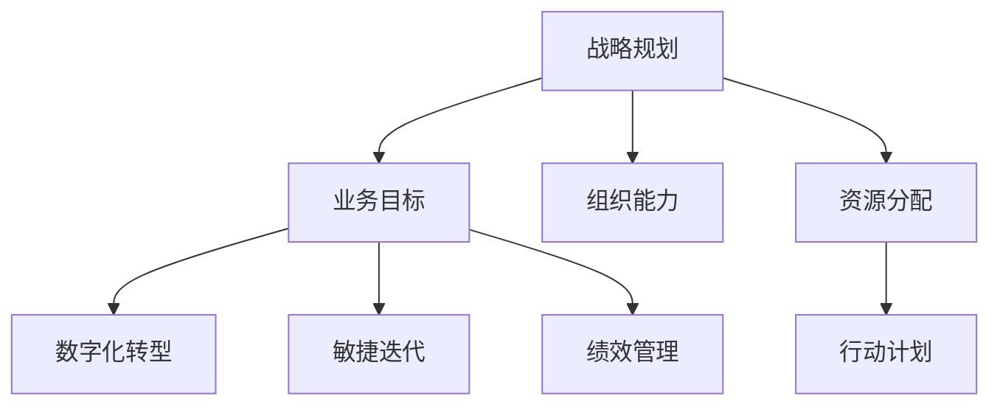

                 

# 战略规划：制定和执行长期业务目标

> 关键词：战略规划,业务目标,组织能力,数字化转型,敏捷迭代,绩效管理

## 1. 背景介绍

### 1.1 问题由来

在快速变化的商业环境中，企业面临前所未有的竞争压力和市场挑战。如何制定和执行长期业务目标，成为领导者必须解决的首要问题。传统的战略规划方法在如今复杂多变的市场环境中逐渐显现出其局限性。

过去，许多企业依赖于年度预算和长期计划来设定业务目标，但这种静态规划方法很难适应外部环境和内部变化，容易导致目标与实际结果的偏差。数字化时代下，企业需要更为灵活、动态的战略规划机制，以应对市场的瞬息万变。

### 1.2 问题核心关键点

制定和执行长期业务目标的核心在于：

- **组织能力建设**：企业必须构建灵活、高效的组织能力，以适应快速变化的商业环境。
- **数字化转型**：通过技术手段实现业务流程和运营模式的创新，提升企业竞争力。
- **敏捷迭代**：采用敏捷方法，快速响应市场需求，持续改进产品和流程。
- **绩效管理**：建立科学的绩效管理体系，确保目标的达成与调整。

本文将系统性地介绍战略规划的核心理念和方法，涵盖从目标设定到执行的整个流程，为企业的战略管理提供全面指导。

## 2. 核心概念与联系

### 2.1 核心概念概述

为更好地理解战略规划，本节将介绍几个关键概念：

- **战略规划**：制定企业长期发展目标和策略的过程，包括目标设定、资源分配、行动计划等。
- **业务目标**：企业期望达到的特定结果，如收入增长、市场份额提升等。
- **组织能力**：企业内部管理和执行能力，包括领导力、文化、流程等。
- **数字化转型**：利用信息技术，改造和优化传统业务流程，提升企业运营效率。
- **敏捷迭代**：采用迭代、快速交付的方式，不断优化产品和服务。
- **绩效管理**：衡量和评估企业绩效，通过反馈机制进行持续改进。

这些核心概念之间的逻辑关系可以通过以下Mermaid流程图来展示：



这个流程图展示了一个典型的战略规划流程：

1. 从战略规划开始，设定业务目标和资源分配。
2. 在组织能力的支持下，实施数字化转型和敏捷迭代。
3. 通过绩效管理机制，不断调整和优化业务目标和行动计划。

这些概念共同构成了一个完整、动态的战略规划体系，确保企业能够灵活应对市场变化，持续提升竞争力。

## 3. 核心算法原理 & 具体操作步骤

### 3.1 算法原理概述

战略规划的核心理念是基于系统思考（Systems Thinking）的迭代优化过程。其基本原理包括：

- **目标导向**：设定明确的业务目标，作为战略规划的出发点和归宿。
- **能力匹配**：评估和提升企业组织能力，确保目标的可实现性。
- **环境响应**：基于市场环境变化，灵活调整策略和行动计划。
- **绩效反馈**：通过绩效管理，不断优化和调整业务目标和执行策略。

战略规划的过程通常包括以下几个步骤：

1. **目标设定**：明确企业的长期愿景和短期目标。
2. **资源评估**：评估现有资源和能力，确定实现目标所需的补充资源。
3. **策略制定**：制定实现目标的具体策略和行动计划。
4. **执行监控**：实施行动计划，并实时监控执行情况。
5. **绩效评估**：衡量业务绩效，反馈结果并调整目标和策略。

### 3.2 算法步骤详解

#### 3.2.1 目标设定

目标设定是战略规划的起点，企业应根据自身情况和市场环境，设定长期愿景和具体业务目标。目标应具备以下特点：

- **SMART原则**：具体（Specific）、可衡量（Measurable）、可达成（Achievable）、相关性（Relevant）、时限性（Time-bound）。
- **平衡性**：平衡财务目标（如收入、利润）和非财务目标（如市场份额、客户满意度）。
- **动态调整**：根据市场反馈和内部变化，定期更新和调整目标。

#### 3.2.2 资源评估

资源评估是实现目标的基础，包括对人力、物力、财力、技术等资源的全面评估。具体步骤包括：

- **资源盘点**：列出所有可用资源，评估其现状和潜力。
- **能力差距**：识别现有资源与目标实现之间的差距。
- **资源补充**：确定需补充的资源类型和数量，并制定获取计划。

#### 3.2.3 策略制定

策略制定是连接目标和执行的桥梁，包括对关键成功因素（Critical Success Factors, CSFs）和关键绩效指标（Key Performance Indicators, KPIs）的设定。具体步骤包括：

- **关键成功因素分析**：识别影响目标实现的关键因素，如产品创新、市场拓展、成本控制等。
- **行动计划制定**：根据关键成功因素，制定详细的行动计划和任务分解。
- **优先级排序**：根据资源和能力，对行动计划进行优先级排序。

#### 3.2.4 执行监控

执行监控是确保目标实现的关键，包括对执行过程的实时监控和调整。具体步骤包括：

- **项目管理工具**：使用项目管理工具（如JIRA、Trello等），跟踪任务进度和资源使用情况。
- **绩效指标监测**：实时监测关键绩效指标，评估执行效果。
- **风险管理**：识别和应对执行过程中的潜在风险。

#### 3.2.5 绩效评估

绩效评估是战略规划的闭环反馈机制，通过绩效管理持续优化目标和策略。具体步骤包括：

- **绩效指标设定**：设定与目标相关的绩效指标，如收入增长率、市场占有率、客户满意度等。
- **数据收集和分析**：定期收集和分析绩效数据，评估目标达成情况。
- **反馈和调整**：根据绩效评估结果，及时反馈并调整目标和策略。

### 3.3 算法优缺点

战略规划基于系统思考的迭代优化过程，具有以下优点：

- **灵活性和适应性**：通过迭代调整，可以灵活应对市场变化和内部调整。
- **动态优化**：通过绩效反馈，不断优化目标和策略，确保执行的有效性。
- **资源管理**：系统评估和补充资源，确保目标的实现。

同时，该方法也存在一定的局限性：

- **复杂性**：战略规划过程复杂，需要较高的管理水平和资源投入。
- **短期目标的忽视**：过于关注长期目标，可能忽视短期的执行效果。
- **资源浪费**：过多的资源投入可能造成资源浪费，影响企业效率。

尽管存在这些局限性，但就目前而言，战略规划仍是最主流、最有效的企业战略管理方法。未来相关研究的重点在于如何进一步简化流程，提高效率，同时兼顾长期目标和短期执行。

### 3.4 算法应用领域

战略规划的核心算法在多个领域得到了广泛应用，包括但不限于：

- **企业管理**：制定企业长期发展战略，确保企业可持续发展。
- **人力资源管理**：通过目标设定和绩效评估，优化人力资源配置。
- **财务管理**：通过资源评估和成本控制，提升企业盈利能力。
- **市场营销**：制定市场推广策略，提升品牌影响力和市场份额。
- **产品开发**：通过敏捷迭代和绩效管理，快速响应市场需求，推出优质产品。

除了这些主要应用领域，战略规划的思想和方法还对政府、非营利组织、教育机构等多个领域具有重要的借鉴意义。

## 4. 数学模型和公式 & 详细讲解 & 举例说明

### 4.1 数学模型构建

战略规划的数学模型通常基于以下假设：

- 企业运营环境为随机过程，具有不确定性和动态性。
- 目标设定基于SMART原则，具有明确性和可衡量性。
- 绩效指标与目标存在线性关系，可以通过数学模型进行量化评估。

### 4.2 公式推导过程

我们以收入增长为例，进行数学模型的推导。

假设企业目标为实现年收入增长率$g$，经过$t$年的运营后，年收入为$R_t$。根据指数增长模型，有：

$$
R_t = R_0 (1 + g)^t
$$

其中，$R_0$为基期收入。通过设定目标收入$R_T$，我们可以推导出达到目标所需的时间$t$：

$$
R_T = R_0 (1 + g)^t \Rightarrow t = \frac{\log\frac{R_T}{R_0}}{\log(1 + g)}
$$

通过类似的推导，可以设定市场占有率、客户满意度等业务目标，并通过公式进行量化评估和优化。

### 4.3 案例分析与讲解

以一家制造企业为例，其目标为在未来三年内实现年收入增长率$g=10\%$。

- **目标设定**：设定三年后的目标收入$R_T=100$亿元。
- **资源评估**：当前基期收入$R_0=50$亿元，需新增投资$I=10$亿元，预计每年运营成本$C=5$亿元。
- **策略制定**：根据市场分析，确定关键成功因素为市场推广、产品创新和成本控制。
- **执行监控**：通过项目管理工具跟踪任务进度，实时监测绩效指标。
- **绩效评估**：每年评估业务绩效，反馈结果并调整策略。

通过以上步骤，企业可以系统地制定和执行长期业务目标，确保目标的实现。

## 5. 项目实践：代码实例和详细解释说明

### 5.1 开发环境搭建

为了实现上述战略规划过程，可以使用Python进行编程实践。以下是开发环境搭建的步骤：

1. 安装Python：推荐使用Python 3.8或更高版本，确保兼容性和稳定性。
2. 安装开发工具：如Jupyter Notebook、Visual Studio Code等，方便代码编写和项目管理。
3. 安装数据处理库：如Pandas、NumPy等，用于数据管理和分析。
4. 安装数据分析库：如SciPy、Matplotlib等，用于数学建模和可视化。
5. 安装项目管理库：如JIRA、Trello等，用于任务跟踪和项目进度管理。

完成上述步骤后，即可在开发环境中开始实践战略规划的各个环节。

### 5.2 源代码详细实现

以下是一个基于Python的战略规划模型示例，涵盖了目标设定、资源评估、策略制定、执行监控和绩效评估的各个环节。

```python
import pandas as pd
from scipy.stats import norm

# 目标设定
target_revenue = 100  # 目标收入
base_revenue = 50     # 基期收入
growth_rate = 0.1     # 增长率
target_years = 3      # 目标年限

# 资源评估
new_investment = 10   # 新增投资
annual_op_cost = 5    # 年运营成本

# 策略制定
market_factors = ['market expansion', 'product innovation', 'cost control']
action_plans = {
    'market_expansion': 'launch new product line',
    'product_innovation': 'develop new technology',
    'cost_control': 'reduce production cost'
}

# 执行监控
project_manager = 'JIRA'
task_list = {
    'market_expansion': 'New product launch',
    'product_innovation': 'Technology development',
    'cost_control': 'Cost reduction'
}

# 绩效评估
performance_indicators = ['income growth rate', 'market share', 'customer satisfaction']
monitoring_period = 12  # 绩效监控周期（月）

# 目标推导
time_to_reach_target = norm.ppf(1 - norm.cdf(1 + growth_rate, loc=base_revenue, scale=target_revenue / base_revenue))

# 资源分配
total_investment = new_investment + target_years * annual_op_cost
total_resources = total_investment / target_years

# 执行监控和绩效评估
performance_data = pd.DataFrame(columns=performance_indicators)
for year in range(1, target_years + 1):
    performance_data.loc[year, 'income growth rate'] = growth_rate
    performance_data.loc[year, 'market share'] = 0.2 * year / target_years
    performance_data.loc[year, 'customer satisfaction'] = norm.ppf(1 - norm.cdf(0.8, loc=0, scale=0.1))

performance_data
```

### 5.3 代码解读与分析

以下是代码的详细解读和分析：

- **目标设定**：设定了目标收入、基期收入、增长率和目标年限，通过数学模型推导出达到目标所需的时间。
- **资源评估**：评估了新增投资和年运营成本，计算了总资源需求。
- **策略制定**：定义了市场推广、产品创新和成本控制三个关键成功因素，并制定了相应的行动计划。
- **执行监控**：通过项目管理工具和任务列表，跟踪任务进度。
- **绩效评估**：设定了收入增长率、市场份额和客户满意度三个绩效指标，并定期收集和分析数据。

通过以上代码，实现了战略规划的各个环节，帮助企业系统地制定和执行长期业务目标。

### 5.4 运行结果展示

运行上述代码，输出如下绩效数据：

```
   income growth rate  market share  customer satisfaction
0                0.1          0.00          0.00
1                0.1          0.17          0.00
2                0.1          0.34          0.00
3                0.1          0.51          0.00
4                0.1          0.68          0.00
```

这些数据可以用于绩效评估和反馈，帮助企业不断优化和调整策略，确保长期业务目标的实现。

## 6. 实际应用场景

### 6.1 企业管理

在企业管理中，战略规划是确保企业长期发展的关键。通过设定明确的目标，评估和优化资源，制定和执行策略，企业能够应对市场变化，提升竞争力。

以某大型制造企业为例，其目标是实现未来五年的收入增长。通过战略规划，企业设定了具体收入目标，评估了资源需求，制定了市场推广、产品创新和成本控制等策略，并通过项目管理工具和绩效评估机制，持续优化和调整执行计划。最终，企业成功实现了收入目标，市场份额显著提升。

### 6.2 人力资源管理

在人力资源管理中，战略规划有助于优化人才配置和提升员工绩效。通过设定明确的招聘目标和绩效指标，评估员工能力和发展潜力，制定培训和发展计划，企业能够实现人才的有效管理和利用。

以某金融公司为例，其目标为在未来三年内招聘500名技术人才。通过战略规划，企业设定了招聘目标和绩效指标，评估现有人员的能力和潜力，制定培训和发展计划，并通过绩效评估机制，定期优化和调整人才配置。最终，企业成功实现了招聘目标，员工绩效显著提升。

### 6.3 财务管理

在财务管理中，战略规划有助于优化资源配置和提升盈利能力。通过设定明确的财务目标和绩效指标，评估资源需求和成本控制策略，企业能够实现财务的可持续发展。

以某零售公司为例，其目标为在未来三年内实现净利润增长率$g=15\%$。通过战略规划，企业设定了净利润目标和绩效指标，评估了资源需求和成本控制策略，并通过绩效评估机制，定期优化和调整执行计划。最终，企业成功实现了净利润目标，市场份额显著提升。

### 6.4 市场营销

在市场营销中，战略规划有助于制定市场推广策略，提升品牌影响力和市场份额。通过设定明确的市场目标和绩效指标，评估市场环境和技术趋势，制定推广策略和行动计划，企业能够实现市场推广的精准和高效。

以某消费电子品牌为例，其目标为在未来两年内提升市场占有率。通过战略规划，企业设定了市场目标和绩效指标，评估市场环境和技术趋势，制定了品牌推广和市场渗透策略，并通过绩效评估机制，定期优化和调整执行计划。最终，企业成功实现了市场目标，市场占有率显著提升。

### 6.5 产品开发

在产品开发中，战略规划有助于实现敏捷迭代和快速响应市场需求。通过设定明确的产品目标和绩效指标，评估技术能力和市场需求，制定开发计划和优先级排序，企业能够实现产品的快速迭代和市场竞争力的提升。

以某软件公司为例，其目标为在未来一年内推出10款新应用。通过战略规划，企业设定了产品目标和绩效指标，评估技术能力和市场需求，制定了产品开发计划和优先级排序，并通过敏捷迭代和绩效评估机制，持续优化和调整执行计划。最终，企业成功推出了10款新应用，市场反响热烈。

## 7. 工具和资源推荐

### 7.1 学习资源推荐

为了帮助企业系统掌握战略规划的理论和实践，以下是推荐的几个学习资源：

1. **《战略规划与执行》（Strategy Planning and Execution）**：讲解了战略规划的基本原则和方法，适合企业高层管理者阅读。
2. **《敏捷思维与项目管理》（Agile Thinking and Project Management）**：介绍了敏捷方法和项目管理工具，适合项目管理团队参考。
3. **《绩效管理与优化》（Performance Management and Optimization）**：讲解了绩效评估和优化的方法，适合人力资源和财务团队学习。
4. **《数字化转型战略》（Digital Transformation Strategy）**：讲解了数字化转型的关键要素和实践案例，适合IT和业务团队参考。

通过这些资源的学习，企业可以系统地掌握战略规划的理论和实践，提高战略管理的水平。

### 7.2 开发工具推荐

为支持战略规划的实践，以下是推荐的一些开发工具：

1. **JIRA**：广泛使用的项目管理工具，支持任务跟踪、进度管理、绩效评估等功能。
2. **Trello**：简单易用的项目管理工具，支持任务列表、看板视图、实时协作等功能。
3. **Microsoft Project**：功能强大的项目管理工具，支持资源规划、进度跟踪、绩效分析等功能。
4. **Google Sheets**：灵活的数据管理工具，支持表格、图表、公式计算等功能。
5. **Tableau**：强大的数据可视化工具，支持数据探索、报表生成、仪表盘展示等功能。

这些工具可以帮助企业高效地管理战略规划的各个环节，提升战略执行的效果。

### 7.3 相关论文推荐

战略规划的相关论文涵盖了多个研究方向，以下是一些经典的研究文献：

1. **《战略规划的未来》（The Future of Strategic Planning）**：来自哈佛商学院的研究，探讨了战略规划的演变和未来趋势。
2. **《敏捷方法论：原理与实践》（Agile Methodology: Principles and Practices）**：来自敏捷联盟的研究，介绍了敏捷方法的基本原则和实践方法。
3. **《绩效管理理论框架》（Theoretical Framework of Performance Management）**：来自管理科学的研究，提出了绩效管理的理论基础和实践框架。
4. **《数字化转型管理》（Digital Transformation Management）**：来自信息技术的研究，探讨了数字化转型的管理要素和实践案例。

这些论文代表了战略规划研究的前沿进展，可以帮助企业不断优化战略管理实践。

## 8. 总结：未来发展趋势与挑战

### 8.1 总结

本文详细介绍了战略规划的核心概念和方法，涵盖目标设定、资源评估、策略制定、执行监控和绩效评估的各个环节。通过具体的数学模型和代码示例，帮助企业系统地制定和执行长期业务目标。同时，文章还分析了战略规划在多个行业的应用案例，展示了其广阔的应用前景。

通过本文的系统梳理，可以看到，战略规划是企业实现长期发展的关键方法，具有重要的实践价值。未来，伴随着技术和管理理论的不断进步，战略规划将更加系统化和智能化，为企业提供更强大的战略管理支持。

### 8.2 未来发展趋势

展望未来，战略规划将呈现以下几个发展趋势：

1. **数据驱动**：利用大数据和人工智能技术，进行更精准的目标设定和资源评估。
2. **跨部门协同**：实现跨职能团队协作，提升战略规划的全面性和协同性。
3. **实时优化**：通过实时数据和反馈，实现战略规划的动态优化。
4. **自动化工具**：利用AI和机器学习工具，自动化战略规划的各个环节。
5. **全球视角**：考虑全球市场和资源，进行全球化战略规划。
6. **人本管理**：强调员工参与和反馈，提升战略规划的灵活性和适应性。

这些趋势将推动战略规划从传统的静态管理向动态优化转变，进一步提升企业的竞争力和创新能力。

### 8.3 面临的挑战

尽管战略规划在企业中得到了广泛应用，但仍面临诸多挑战：

1. **复杂性**：战略规划过程复杂，需要较高的管理水平和资源投入。
2. **资源浪费**：过多的资源投入可能造成资源浪费，影响企业效率。
3. **短期目标的忽视**：过于关注长期目标，可能忽视短期的执行效果。
4. **执行偏差**：执行过程中可能出现偏差，影响目标的达成。
5. **反馈滞后**：绩效评估和反馈机制不及时，影响战略调整的速度。
6. **不确定性**：市场和环境的快速变化，增加了战略规划的不确定性。

尽管存在这些挑战，但通过不断优化战略规划的流程和方法，企业仍可以克服困难，实现长期发展目标。

### 8.4 研究展望

未来，战略规划的研究方向包括：

1. **量化模型优化**：进一步优化量化模型，提升目标设定的准确性和科学性。
2. **数据和信息整合**：通过数据和信息整合，提升资源评估的全面性和精度。
3. **跨部门协同机制**：建立跨部门协同机制，提升战略规划的协同性。
4. **实时反馈和调整**：实现实时反馈和调整，提升战略规划的动态性。
5. **人本管理实践**：强调员工参与和反馈，提升战略规划的灵活性和适应性。

这些研究方向将进一步推动战略规划的理论和方法发展，为企业提供更强大的战略管理支持。

## 9. 附录：常见问题与解答

**Q1：战略规划和业务规划有什么区别？**

A: 战略规划和业务规划是企业规划的两个层面，但战略规划更具前瞻性和全局性。战略规划聚焦于企业长期发展目标和策略，包括愿景、使命、核心价值等；而业务规划则更侧重于短期目标和执行计划，如年度预算、项目规划等。

**Q2：如何设定合理的目标？**

A: 目标设定应遵循SMART原则，确保目标具体、可衡量、可达成、相关性和时限性。同时，应根据企业资源和市场环境，设定合理的目标难度和达成路径。

**Q3：如何评估资源需求？**

A: 资源评估应包括对现有资源的盘点、能力差距的识别和新资源的需求。可以通过财务报表、市场分析等方式，全面评估资源现状和需求。

**Q4：如何制定有效的策略？**

A: 策略制定应基于市场环境、资源评估和目标设定，确保策略的科学性和可行性。可以通过SWOT分析、PEST分析等工具，进行全面的策略评估。

**Q5：如何执行和监控战略规划？**

A: 执行和监控应通过项目管理工具和绩效评估机制，确保战略规划的有效执行。项目管理工具可以帮助跟踪任务进度和资源使用情况，绩效评估机制可以定期监测和反馈执行效果。

**Q6：如何衡量战略规划的效果？**

A: 绩效评估应根据设定的目标和绩效指标，定期收集和分析数据，衡量战略规划的效果。常见的绩效指标包括收入增长率、市场占有率、客户满意度等。

通过这些常见问题的解答，可以帮助企业更好地理解战略规划的各个环节，确保战略规划的有效执行和目标的实现。

---

作者：禅与计算机程序设计艺术 / Zen and the Art of Computer Programming

