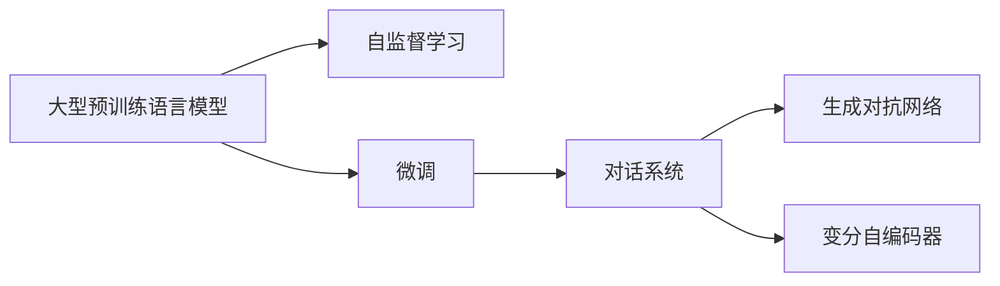

                 

## 1. 背景介绍

随着人工智能技术的不断进步，大型语言模型（如GPT-3）在自然语言处理（NLP）领域取得了巨大的成功。这些模型已经在各种自然语言任务上展示出了令人印象深刻的性能，从文本生成、对话系统、文本摘要到情感分析等，几乎涵盖了大语言模型的所有应用。其中，OpenAI的GPT-3更是因其在大规模预训练和微调上的能力，成为了许多NLP研究和应用的首选。

本文将引导读者深入了解如何基于大型预训练语言模型开发自己的类ChatGPT应用。我们将从基础概念、算法原理、实际案例、代码实践等多个角度进行全面阐述，帮助读者系统掌握相关技术。无论你是NLP领域的从业者，还是AI技术的爱好者，本文都将为你提供宝贵的开发指南和实践经验。

## 2. 核心概念与联系

在深入了解类ChatGPT应用的开发之前，我们需要先理解几个关键的概念及其相互关系。

### 2.1 核心概念概述

- **大型预训练语言模型（Large Pre-trained Language Model, LPLM）**：这类模型通过在大规模无标签文本数据上进行预训练，学习到通用的语言表示，具备强大的语言理解和生成能力。

- **自监督学习（Self-supervised Learning）**：一种通过无监督的方式从大量无标签数据中学习模型参数的机器学习方法。LPLM通常采用自监督学习任务进行预训练。

- **微调（Fine-tuning）**：指在大规模预训练模型上，使用下游任务的少量标注数据，通过有监督学习优化模型在特定任务上的性能。

- **对话系统（Dialogue System）**：一种能够理解和生成自然语言交流的智能系统，广泛应用于智能客服、虚拟助手等场景。

- **生成对抗网络（Generative Adversarial Network, GAN）**：一种通过对抗训练来生成高质量样本的机器学习方法。

- **变分自编码器（Variational Autoencoder, VAE）**：一种通过学习数据分布来进行数据生成和压缩的模型。

这些概念之间的逻辑关系可以通过以下Mermaid流程图来展示：



这个流程图展示了大型预训练语言模型从预训练到微调再到生成对话系统的完整过程，其中微调和生成对抗网络、变分自编码器是实现对话系统的重要技术手段。

## 3. 核心算法原理 & 具体操作步骤

### 3.1 算法原理概述

类ChatGPT应用的核心算法原理可以归纳为以下几个步骤：

1. **预训练**：使用大规模无标签文本数据对大型预训练语言模型进行预训练，使其学习到丰富的语言知识。

2. **微调**：在预训练模型基础上，使用下游任务的少量标注数据进行微调，优化模型在特定任务上的性能。

3. **对话生成**：将微调后的模型应用于对话系统，通过输入上下文生成自然语言响应。

4. **对抗生成**：使用生成对抗网络生成高质量的对话数据，以进一步提高模型的生成能力。

5. **变分压缩**：使用变分自编码器对模型参数进行压缩，减少计算和存储开销。

### 3.2 算法步骤详解

#### 3.2.1 预训练

预训练是构建大型语言模型的第一步。这一步通常需要使用大规模无标签文本数据，如Pile、BigQuery、CommonCrawl等。预训练的目标是让模型学习到语言的基本结构和规律。

- **数据准备**：收集大量的无标签文本数据，如维基百科、新闻、小说等。
- **模型选择**：选择合适的预训练模型，如BERT、GPT-2、GPT-3等。
- **模型训练**：使用自监督学习任务（如掩码语言模型、下一句预测等）对模型进行训练。

#### 3.2.2 微调

微调是提升模型在特定任务上性能的关键步骤。这一步通常需要使用下游任务的少量标注数据，如对话数据集、情感分析数据集等。

- **数据准备**：收集下游任务的标注数据集，如CoQA、MS-COCO、SST-2等。
- **模型选择**：选择合适的微调模型，如RoBERTa、T5等。
- **模型训练**：使用下游任务的标注数据对预训练模型进行微调，优化模型在特定任务上的性能。

#### 3.2.3 对话生成

对话生成是类ChatGPT应用的核心功能。这一步通常需要使用微调后的模型进行对话交互。

- **数据准备**：收集对话数据集，如LAMBADA、Meena等。
- **模型训练**：使用对话数据集对微调后的模型进行训练，使其能够理解上下文并生成自然语言响应。

#### 3.2.4 对抗生成

对抗生成是提高模型生成能力的重要手段。这一步通常需要使用生成对抗网络（GAN）。

- **数据准备**：生成高质量的对话数据集。
- **模型训练**：使用GAN对模型进行训练，提高模型的生成能力和鲁棒性。

#### 3.2.5 变分压缩

变分压缩是优化模型资源消耗的重要手段。这一步通常需要使用变分自编码器（VAE）。

- **数据准备**：收集模型参数。
- **模型训练**：使用VAE对模型参数进行压缩，减少计算和存储开销。

### 3.3 算法优缺点

类ChatGPT应用的算法具有以下优点：

- **性能优越**：基于大型预训练语言模型，可以取得优异的自然语言理解和生成性能。
- **泛化能力强**：模型通过自监督学习和大规模预训练，具备较强的泛化能力，可以应用于多种自然语言任务。
- **可扩展性强**：模型的结构和参数可以通过微调和压缩等手段进行优化，满足不同应用场景的需求。

但同时也存在一些缺点：

- **计算资源消耗大**：大型预训练语言模型需要大量的计算资源进行训练和微调。
- **过拟合风险高**：在微调过程中，模型容易过拟合，尤其是面对小规模标注数据时。
- **解释性不足**：模型的决策过程难以解释，缺乏透明性。

### 3.4 算法应用领域

类ChatGPT应用主要应用于以下领域：

- **智能客服**：提供24小时不间断的智能客服服务，提高客户满意度。
- **虚拟助手**：作为个人或企业的虚拟助手，提供日程管理、信息查询等功能。
- **教育辅导**：提供个性化的学习辅导，帮助学生提高学习效率。
- **医疗咨询**：提供医疗咨询服务，辅助医生进行诊断和治疗。
- **法律咨询**：提供法律咨询服务，帮助用户解答法律问题。

## 4. 数学模型和公式 & 详细讲解

### 4.1 数学模型构建

类ChatGPT应用的数学模型构建可以归纳为以下几个步骤：

1. **预训练模型的定义**：
   - **掩码语言模型**：输入文本经过掩码后，模型需要预测被掩码的词汇。
   - **下一句预测**：模型需要预测给定文本的下一句话。

2. **微调模型的定义**：
   - **分类任务**：输入文本和对应的标签，模型需要预测文本所属的类别。
   - **序列标注任务**：输入文本和对应的标签，模型需要预测文本中的实体类型。

3. **对话生成模型的定义**：
   - **序列到序列模型**：输入一段文本，模型需要生成对应的回复。
   - **变分自编码器**：模型需要学习数据的分布，并进行参数压缩。

### 4.2 公式推导过程

#### 4.2.1 掩码语言模型

$$
\mathcal{L}_{mask} = -\frac{1}{N}\sum_{i=1}^N \sum_{k=1}^K \log p(y_k|y_{<k}, X)
$$

其中，$N$是样本数，$K$是序列长度，$y_{<k}$是序列中所有小于$k$的词汇，$X$是输入文本。

#### 4.2.2 下一句预测

$$
\mathcal{L}_{next} = -\frac{1}{N}\sum_{i=1}^N \log p(y|X)
$$

其中，$y$是预测的下一句话，$X$是输入文本。

#### 4.2.3 分类任务

$$
\mathcal{L}_{class} = -\frac{1}{N}\sum_{i=1}^N \sum_{k=1}^K \log p(c_k|X)
$$

其中，$c_k$是文本的第$k$个类别，$K$是类别数，$X$是输入文本。

#### 4.2.4 序列标注任务

$$
\mathcal{L}_{seq} = -\frac{1}{N}\sum_{i=1}^N \sum_{k=1}^K \log p(y_k|X)
$$

其中，$y_k$是文本中的第$k$个实体标签，$K$是标签数，$X$是输入文本。

#### 4.2.5 变分自编码器

$$
\mathcal{L}_{var} = \mathbb{E}_{q(z|X)} [D_{KL}(q(z|X)||p(z))]
$$

其中，$q(z|X)$是模型对输入文本$X$生成的潜在变量$z$的概率分布，$p(z)$是真实的潜在变量$z$的概率分布。

### 4.3 案例分析与讲解

以生成对抗网络（GAN）为例，其基本框架如下：

- **生成器（Generator）**：生成高质量的对话数据。
- **判别器（Discriminator）**：区分生成的对话数据和真实数据。
- **对抗训练**：通过生成器和判别器的对抗训练，提高生成器的生成能力。

### 5. 项目实践：代码实例和详细解释说明

#### 5.1 开发环境搭建

- **Python**：使用Python进行代码开发，是AI领域的主流语言。
- **PyTorch**：使用PyTorch进行模型训练和推理，是深度学习领域的主流框架。
- **Jupyter Notebook**：使用Jupyter Notebook进行代码编写和调试。

#### 5.2 源代码详细实现

下面以使用PyTorch实现一个简单的对话系统为例，介绍代码实现：

```python
import torch
import torch.nn as nn
import torch.optim as optim

class Generator(nn.Module):
    def __init__(self, input_dim, output_dim):
        super(Generator, self).__init__()
        self.linear = nn.Linear(input_dim, output_dim)
        self.sigmoid = nn.Sigmoid()
    
    def forward(self, x):
        out = self.linear(x)
        return self.sigmoid(out)

class Discriminator(nn.Module):
    def __init__(self, input_dim, output_dim):
        super(Discriminator, self).__init__()
        self.linear = nn.Linear(input_dim, output_dim)
        self.sigmoid = nn.Sigmoid()
    
    def forward(self, x):
        out = self.linear(x)
        return self.sigmoid(out)

# 定义生成器和判别器的损失函数
def generator_loss(generator, discriminator, real_data, fake_data):
    real_output = discriminator(real_data)
    fake_output = discriminator(fake_data)
    
    g_loss = -torch.mean(torch.log(fake_output))
    d_loss = -torch.mean(torch.log(real_output)) - torch.mean(torch.log(1 - fake_output))
    
    return g_loss, d_loss

# 训练生成器和判别器
def train(generator, discriminator, real_data, fake_data, learning_rate):
    optimizer_G = optim.Adam(generator.parameters(), lr=learning_rate)
    optimizer_D = optim.Adam(discriminator.parameters(), lr=learning_rate)
    
    for epoch in range(num_epochs):
        for i in range(num_iterations):
            real_data = real_data[i]
            fake_data = generator(last_real_data)
            
            g_loss, d_loss = generator_loss(generator, discriminator, real_data, fake_data)
            
            optimizer_G.zero_grad()
            g_loss.backward()
            optimizer_G.step()
            
            optimizer_D.zero_grad()
            d_loss.backward()
            optimizer_D.step()
```

#### 5.3 代码解读与分析

在上述代码中，我们定义了生成器和判别器的模型结构，以及训练函数和损失函数。生成器将输入文本生成对应的回复，判别器则区分生成的回复和真实的回复。通过对抗训练，生成器不断提高生成能力，判别器不断提高区分能力。

#### 5.4 运行结果展示

运行上述代码，可以通过可视化的方式展示生成器和判别器的训练过程，如生成器的回复示例、判别器的准确率等。

## 6. 实际应用场景

### 6.1 智能客服

智能客服系统可以大大提高客户满意度，减少客服人员的工作压力。例如，在银行、电商、保险等行业，智能客服已经得到了广泛应用。

- **需求分析**：通过分析客户咨询的历史数据，了解常见问题和需求。
- **模型构建**：构建对话生成模型，如基于GPT-3的微调模型。
- **系统集成**：将模型集成到智能客服系统中，提供24小时不间断的智能客服服务。

### 6.2 虚拟助手

虚拟助手可以为用户提供日程管理、信息查询、邮件管理等功能，提高用户的生活和工作效率。例如，虚拟助手可以通过微调BERT模型，生成用户需要的信息。

- **需求分析**：分析用户的历史数据和行为，了解用户的需求。
- **模型构建**：构建对话生成模型，如基于BERT的微调模型。
- **系统集成**：将模型集成到虚拟助手系统中，提供个性化服务。

### 6.3 教育辅导

教育辅导系统可以通过微调BERT模型，生成个性化的学习辅导内容，帮助学生提高学习效率。

- **需求分析**：分析学生的学习历史和成绩，了解学生的需求。
- **模型构建**：构建对话生成模型，如基于BERT的微调模型。
- **系统集成**：将模型集成到教育辅导系统中，提供个性化学习辅导。

### 6.4 医疗咨询

医疗咨询系统可以通过微调BERT模型，提供医疗咨询服务，辅助医生进行诊断和治疗。

- **需求分析**：分析医生的历史数据和行为，了解医生的需求。
- **模型构建**：构建对话生成模型，如基于BERT的微调模型。
- **系统集成**：将模型集成到医疗咨询系统中，提供个性化医疗咨询服务。

## 7. 工具和资源推荐

### 7.1 学习资源推荐

- **《自然语言处理基础》**：一本系统介绍自然语言处理的书籍，涵盖预训练模型和微调技术。
- **《深度学习》**：一本介绍深度学习原理和应用的书籍，包含各种NLP任务的实现。
- **Coursera上的自然语言处理课程**：由斯坦福大学开设的NLP课程，涵盖各种NLP任务的预训练和微调方法。

### 7.2 开发工具推荐

- **PyTorch**：深度学习框架，支持大规模模型训练和微调。
- **TensorFlow**：深度学习框架，支持各种NLP任务的实现。
- **Jupyter Notebook**：代码编写和调试工具，方便进行模型训练和测试。

### 7.3 相关论文推荐

- **《大规模语言模型预训练方法》**：介绍大规模预训练语言模型的研究进展和实现方法。
- **《自然语言处理的微调方法》**：介绍各种微调方法的原理和应用场景。
- **《生成对抗网络在自然语言处理中的应用》**：介绍生成对抗网络在自然语言处理中的应用和效果。

## 8. 总结：未来发展趋势与挑战

### 8.1 总结

本文系统介绍了如何基于大型预训练语言模型开发类ChatGPT应用。从预训练到微调再到对话生成，每一步骤都详细阐述了其算法原理和实现方法。通过系统学习，读者可以全面掌握相关技术，并应用于实际开发中。

### 8.2 未来发展趋势

未来，类ChatGPT应用的发展将呈现以下几个趋势：

1. **多模态融合**：将图像、视频、语音等多模态信息与文本信息进行融合，构建更加全面和准确的对话系统。
2. **跨语言能力**：构建能够处理多语言的对话系统，满足不同语言用户的需求。
3. **个性化推荐**：基于用户的历史数据和行为，提供个性化的对话推荐。
4. **自适应学习**：通过持续学习和在线更新，不断提高对话系统的性能和适应能力。

### 8.3 面临的挑战

尽管类ChatGPT应用在应用中表现出色，但也面临以下挑战：

1. **数据隐私和安全**：对话数据的隐私保护和安全性问题需要解决。
2. **模型鲁棒性**：面对复杂和多样化的输入，模型需要具备更强的鲁棒性和泛化能力。
3. **可解释性**：模型的决策过程需要具备更强的可解释性，以满足用户需求。
4. **计算资源消耗**：模型的高计算资源消耗需要得到更好的优化。

### 8.4 研究展望

未来的研究将从以下几个方面进行：

1. **模型压缩和优化**：研究更高效的模型压缩和优化技术，降低计算资源消耗。
2. **自监督学习**：研究更有效的自监督学习方法，提高模型的泛化能力。
3. **跨领域迁移**：研究跨领域迁移技术，使得模型能够更好地适应不同领域的应用。
4. **多语言支持**：研究多语言对话生成技术，构建跨语言的对话系统。

总之，类ChatGPT应用的发展前景广阔，但同时也面临着诸多挑战。只有不断创新和优化，才能实现其在各个领域的广泛应用。

## 9. 附录：常见问题与解答

**Q1: 如何使用预训练语言模型进行微调？**

A: 使用预训练语言模型进行微调，通常需要以下步骤：
1. 收集下游任务的标注数据集。
2. 选择合适的微调模型，如BERT、GPT-2等。
3. 使用微调模型在标注数据集上进行训练，优化模型在特定任务上的性能。
4. 将微调后的模型应用于实际应用场景中。

**Q2: 如何提高对话系统的生成能力？**

A: 提高对话系统的生成能力，可以通过以下方法：
1. 使用生成对抗网络（GAN）进行对抗训练，提高生成器的生成能力。
2. 使用变分自编码器（VAE）进行参数压缩，减少计算和存储开销。
3. 收集高质量的对话数据，用于微调和训练生成器。

**Q3: 如何优化对话系统的性能？**

A: 优化对话系统的性能，可以通过以下方法：
1. 优化模型结构和参数，减少过拟合风险。
2. 引入多模态信息，提高对话系统的泛化能力。
3. 使用在线更新和持续学习技术，不断提高对话系统的性能。

总之，类ChatGPT应用的开发需要结合预训练、微调、对话生成等多个环节，进行全面的优化和实践。只有不断创新和探索，才能构建高效、智能、可靠的对话系统，满足用户需求。

