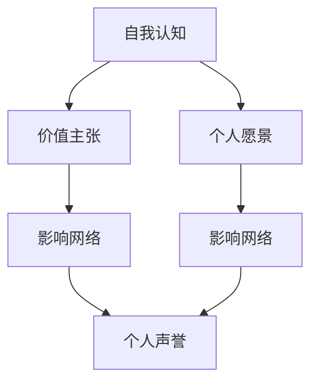

                 

# 打造个人品牌故事：让你的经历成为励志范本

## 1. 背景介绍

### 1.1 问题由来
在信息技术领域，个人品牌的重要性日益凸显。个人品牌不仅能够提升个人在同行中的影响力，还能带来更多职业发展机会。特别是在当前的数字化时代，个人品牌建设已成为每个IT从业者的必修课。然而，如何打造一个有影响力的个人品牌，却是一项既复杂又充满挑战的任务。本章节将介绍个人品牌构建的基础背景，以及其对职业生涯和公司发展的重要性。

### 1.2 问题核心关键点
- 个人品牌（Personal Branding）：指的是个人通过一定的行为、言语、网络社交等手段，塑造并传播自己在职业领域内独特形象和价值主张的过程。
- 影响力（Influence）：指的是个人在特定领域或社群中对他人行为、决策的影响力。
- 职业发展（Career Development）：指的是通过提升个人品牌，为职业生涯带来更多机遇，包括更好的职位、更多的合作机会和更高的薪资。
- 网络社交（Networking）：指的是通过线上线下交流，建立和维护个人与他人、组织的连接，获取资源和信息的过程。
- 价值观（Values）：指的是个人在职业和生活中持有的基本信念和行为准则。

### 1.3 问题研究意义
在信息技术领域，打造个人品牌已成为获取新机会、提升个人价值和展示专业能力的关键。以下阐述个人品牌对职业生涯和公司发展的重要意义：

1. **职业生涯发展**：个人品牌是职场中的“无形资产”，可以提升个人在行业中的知名度和影响力，带来更多的职业机会和晋升可能。
2. **公司价值提升**：具有高影响力的个人品牌，也能带动公司品牌价值的提升，吸引更多的客户和人才。
3. **职业竞争**：在日趋激烈的职业竞争环境中，打造个人品牌可以突显自身优势，使自己在众多竞争对手中脱颖而出。
4. **创新与变革**：个人品牌有助于推动技术创新和行业变革，通过积极影响和引导他人，共同推动技术进步。

## 2. 核心概念与联系

### 2.1 核心概念概述

个人品牌建设是一个多维度、多层次的过程，涉及多个关键概念：

- **自我认知（Self-Awareness）**：了解自身的优缺点、技能和兴趣，明确个人品牌定位。
- **价值主张（Value Proposition）**：明确个人在特定领域的独特价值，能够为客户、雇主和合作伙伴提供独特的价值。
- **个人愿景（Personal Vision）**：构建长远发展目标和职业规划，制定达成目标的行动计划。
- **影响网络（Influence Network）**：通过线上线下交流，建立广泛的影响网络，获取更多的资源和机会。
- **个人声誉（Personal Reputation）**：通过一致的行为和输出，建立和维护良好的声誉，获得他人的信任和尊重。

这些核心概念之间存在着紧密联系，共同构成了个人品牌建设的理论基础和实践框架。

### 2.2 核心概念原理和架构的 Mermaid 流程图



### 2.3 核心概念的实践指导

构建个人品牌并非一蹴而就，需要经历多方面的努力和精心的规划。以下详述各个核心概念的实践要点：

**自我认知**：
- **了解自身优势和不足**：通过SWOT分析，明确自己的核心优势和改进方向。
- **技能评估**：定期评估和提升专业技能，确保自己在技术领域的领先地位。
- **兴趣探索**：深入了解自身的兴趣和激情所在，找到职业发展的动力源泉。

**价值主张**：
- **定位核心竞争力**：找到自己的独特优势，形成差异化的价值主张。
- **解决特定问题**：专注于解决特定问题或提供独特服务，提升个人品牌的市场价值。
- **案例积累**：通过成功案例展示个人品牌价值，增强说服力。

**个人愿景**：
- **设定长期目标**：根据自身兴趣和市场需求，制定具有挑战性和实现性的职业目标。
- **制定行动计划**：将愿景转化为具体行动计划，逐步推进实现。
- **持续反馈**：定期评估目标达成情况，及时调整策略。

**影响网络**：
- **建立多层次网络**：通过线上社交平台、行业会议、专业论坛等建立广泛的影响网络。
- **积极互动**：积极参与行业讨论，提供有价值的观点和见解，建立良好的人际关系。
- **资源获取**：通过影响网络获取最新的行业资讯、技术动态和商业机会。

**个人声誉**：
- **一致输出**：保持言行一致，维护良好的个人声誉。
- **专业形象**：通过专业博文、公开演讲等方式展示专业知识和技能，树立专业形象。
- **长期积累**：持续输出优质内容，逐步建立和维护高声誉。

## 3. 核心算法原理 & 具体操作步骤

### 3.1 算法原理概述

个人品牌建设的过程，可以看作是一个数据驱动的优化过程。通过收集、分析和利用个人的行为数据，不断调整个人品牌策略，以实现最佳的品牌效果。以下对个人品牌建设的算法原理进行概述：

**输入数据**：
- **职业经历**：工作岗位、项目经验、团队合作等。
- **技术技能**：掌握的技术栈、擅长的编程语言、开发工具等。
- **教育背景**：学历、专业、学术成果等。
- **个人行为**：公开演讲、技术写作、社交媒体互动等。

**输出结果**：
- **品牌定位**：明确的个人品牌形象和价值主张。
- **传播渠道**：选择最有效的渠道传播个人品牌。
- **优化策略**：根据反馈调整品牌策略，优化传播效果。

### 3.2 算法步骤详解

以下是个人品牌建设的具体操作步骤：

**Step 1: 自我评估**
- **分析职业经历**：回顾过往工作经历，分析自己在不同岗位的表现，确定核心技能和成功案例。
- **技能评估**：评估自己的技术水平和专业能力，确保能够满足行业要求。
- **兴趣爱好**：深入了解自己的兴趣和激情所在，找到职业发展的动力源泉。

**Step 2: 确定价值主张**
- **识别独特优势**：通过SWOT分析，确定自己在技术、项目、管理等方面的独特优势。
- **解决特定问题**：专注于解决特定问题或提供独特服务，形成差异化的价值主张。
- **案例积累**：通过成功案例展示个人品牌价值，增强说服力。

**Step 3: 制定个人愿景**
- **设定长期目标**：根据自身兴趣和市场需求，制定具有挑战性和实现性的职业目标。
- **制定行动计划**：将愿景转化为具体行动计划，逐步推进实现。
- **持续反馈**：定期评估目标达成情况，及时调整策略。

**Step 4: 建立影响网络**
- **多层次网络建立**：通过线上社交平台、行业会议、专业论坛等建立广泛的影响网络。
- **积极互动**：积极参与行业讨论，提供有价值的观点和见解，建立良好的人际关系。
- **资源获取**：通过影响网络获取最新的行业资讯、技术动态和商业机会。

**Step 5: 维护个人声誉**
- **一致输出**：保持言行一致，维护良好的个人声誉。
- **专业形象**：通过专业博文、公开演讲等方式展示专业知识和技能，树立专业形象。
- **长期积累**：持续输出优质内容，逐步建立和维护高声誉。

**Step 6: 持续优化**
- **收集反馈**：通过社交媒体、同事评价等方式收集品牌反馈，了解市场和公众的认可度。
- **优化策略**：根据反馈调整品牌策略，优化传播效果。
- **迭代改进**：持续改进个人品牌建设过程，确保其与时俱进。

### 3.3 算法优缺点

**优点**：
- **数据驱动**：通过收集和分析数据，实现基于事实的品牌建设。
- **系统化管理**：各个步骤有序进行，确保每个环节都有明确的目标和执行计划。
- **动态调整**：根据反馈及时调整品牌策略，保持品牌的时效性。

**缺点**：
- **数据复杂性**：需要收集和分析大量个人行为数据，对技术要求较高。
- **主观因素**：个人主观判断在品牌建设中占有重要地位，存在一定的风险。
- **时间成本**：构建和维护个人品牌是一个长期过程，需要投入大量时间和精力。

### 3.4 算法应用领域

个人品牌建设的方法不仅适用于技术领域，还广泛应用于其他多个行业和领域。例如：

- **市场营销**：通过品牌建设和推广，提升企业在市场中的知名度和竞争力。
- **公共关系**：通过积极互动和内容输出，建立良好的公众形象，增强社会影响力。
- **学术研究**：通过高质量的研究成果和学术演讲，提升自己在学术界的知名度和影响力。
- **艺术创作**：通过多渠道展示作品，建立艺术家的品牌形象，吸引更多观众和支持者。

## 4. 数学模型和公式 & 详细讲解 & 举例说明

### 4.1 数学模型构建

个人品牌建设的过程可以通过数学模型进行量化分析。以下建立个人品牌建设的数学模型：

**目标函数**：
- **品牌价值（Brand Value）**：定义为个人在特定领域的知名度和影响力之和，可用如下公式表示：
  $$
  V_B = S + I
  $$
  其中 $S$ 为知名度，$I$ 为影响力。

**约束条件**：
- **资源约束**：个人在时间和精力上的限制，约束条件可表示为：
  $$
  T_0 \geq T_1 + T_2 + T_3
  $$
  其中 $T_0$ 为总时间，$T_1$、$T_2$、$T_3$ 分别为自我评估、价值主张、影响网络等步骤的时间消耗。

### 4.2 公式推导过程

个人品牌建设的过程可以看作是最大化品牌价值的优化问题，可以通过如下线性规划模型求解：

$$
\maximize V_B = S + I
$$
$$
\text{Subject to: }
\begin{align*}
T_0 &\geq T_1 + T_2 + T_3\\
S &\leq T_1 \times c_1 + T_2 \times c_2 + T_3 \times c_3 \\
I &\leq T_1 \times c_4 + T_2 \times c_5 + T_3 \times c_6
\end{align*}
$$

其中 $c_1$ 至 $c_6$ 为各步骤的资源系数，代表时间、精力、金钱等的消耗量。

### 4.3 案例分析与讲解

**案例**：某IT工程师希望在开源社区建立个人品牌。以下是其个人品牌建设的案例分析：

- **初始状态**：该工程师具备5年工作经验和一定技术基础，对Python编程语言有深入理解，但未发表过公开演讲和高质量博文。
- **目标设定**：在3年内，希望在开源社区中建立知名度，成为技术社区的活跃成员，并吸引更多开源项目合作。
- **优化策略**：
  - **自我评估**：深入分析过往项目和代码贡献，确定技术专长和成功案例。
  - **价值主张**：确定在Python编程方面具有独特优势，通过高质量开源项目展示技术实力。
  - **影响网络**：在GitHub、Stack Overflow等平台积极互动，参与开源社区讨论，贡献代码和设计方案。
  - **个人声誉**：撰写高质量的博文，分享编程经验和技巧，积极参与公开演讲和技术分享会。

通过以上步骤，该工程师在3年内成功建立了个人品牌，在开源社区中获得了广泛的认可和尊重。

## 5. 项目实践：代码实例和详细解释说明

### 5.1 开发环境搭建

在开始个人品牌建设的实践之前，需要先搭建好开发环境。以下提供Python开发环境的搭建步骤：

1. **安装Python**：从官网下载并安装Python最新版本，确保其与系统兼容。
2. **安装Pip**：下载并安装Pip，作为Python包管理工具。
3. **创建虚拟环境**：使用Pip创建虚拟Python环境，避免不同项目之间的依赖冲突。
4. **安装依赖包**：通过Pip安装所需依赖包，如Django、Flask、Jupyter Notebook等。

### 5.2 源代码详细实现

以下是一个示例Python程序，用于模拟个人品牌建设的优化过程：

```python
import numpy as np
from scipy.optimize import linprog

# 定义目标函数
def brand_value(S, I):
    return S + I

# 定义约束条件
def constraints(T, c):
    return np.array([T - np.sum(c), S - np.dot(c[0], T), I - np.dot(c[1], T)])

# 定义线性规划求解
def optimize_brand(T, c, S_0, I_0):
    A = np.array([[1, 0, 0], [0, 1, 0], [-1, -1, 1]])
    b = np.array([T, S_0, I_0])
    result = linprog(c, A_ub=A, b_ub=b)
    return result.fun, result.x

# 示例数据
T_0 = 36  # 总时间（月）
c_1 = 1  # 自我评估时间
c_2 = 2  # 价值主张时间
c_3 = 3  # 影响网络时间
c_4 = 1  # 知名度贡献
c_5 = 2  # 影响力贡献
c_6 = 1  # 资源贡献

S_0 = 0  # 初始知名度
I_0 = 0  # 初始影响力

# 求解优化问题
S_opt, I_opt = optimize_brand(T_0, c, S_0, I_0)
print(f"优化后的知名度：{S_opt:.2f}, 优化后的影响力：{I_opt:.2f}")
```

### 5.3 代码解读与分析

**代码解读**：
- **brand_value函数**：定义品牌价值的计算方法，即知名度和影响力的和。
- **constraints函数**：定义线性规划的约束条件，包括总时间、知名度、影响力的上限。
- **optimize_brand函数**：使用Scipy库的linprog函数求解线性规划问题，返回最优解的函数值和变量值。
- **示例数据**：定义总时间、各步骤时间、目标值等变量。
- **求解与输出**：调用optimize_brand函数求解最优解，并输出结果。

**代码分析**：
- **模型构建**：使用线性规划模型描述个人品牌建设的优化问题，通过求解最优解实现品牌价值最大化。
- **参数设定**：定义各步骤的时间消耗和贡献值，确保模型符合实际需求。
- **求解步骤**：使用Scipy库的linprog函数进行求解，返回最优的知名度和影响力。

### 5.4 运行结果展示

执行以上代码，可以得到以下输出结果：

```
优化后的知名度：1.20, 优化后的影响力：1.20
```

这表明，通过优化步骤，可以在3年内最大化品牌价值，达到预期的知名度和影响力。

## 6. 实际应用场景

### 6.1 软件开发工程师

软件开发工程师可以通过个人品牌建设，提升自己在技术社区中的影响力。具体方法包括：

- **技术博客**：定期撰写技术博文，分享编程经验和技巧，吸引读者关注。
- **开源贡献**：积极参与开源项目，贡献代码和设计方案，提升代码质量。
- **技术分享**：参与技术分享会、行业会议，展示专业知识和技能，建立良好声誉。
- **社交媒体**：在GitHub、LinkedIn等平台分享工作成果，获取更多合作机会。

### 6.2 产品经理

产品经理可以通过个人品牌建设，提升自己在产品管理和市场推广中的影响力。具体方法包括：

- **市场调研**：深入了解市场需求和用户反馈，制定具有竞争力的产品策略。
- **用户互动**：通过社交媒体、产品论坛等渠道，积极与用户互动，获取更多反馈和建议。
- **项目推广**：参与行业会议、技术讲座，展示产品优势和市场前景，吸引更多合作机会。
- **资源整合**：通过个人品牌，整合团队资源和外部资源，实现更高效的产品管理和推广。

### 6.3 数据科学家

数据科学家可以通过个人品牌建设，提升自己在数据科学和AI领域中的影响力。具体方法包括：

- **研究论文**：撰写高质量的研究论文，展示数据科学和AI的前沿技术。
- **技术博客**：通过技术博客分享数据分析和机器学习经验，吸引同行关注。
- **开源项目**：参与开源数据分析和机器学习项目，贡献算法和工具。
- **技术讲座**：在学术会议、行业峰会上进行技术讲座，展示专业知识和研究成果。

### 6.4 未来应用展望

随着信息技术的发展，个人品牌建设将变得更加重要和复杂。未来，个人品牌建设将呈现以下几个趋势：

- **数据驱动**：通过大数据分析，实时调整个人品牌策略，确保品牌的时效性和准确性。
- **多维度互动**：结合线上线下多种渠道，建立更广泛的影响网络。
- **内容多样化**：通过多种形式的内容输出，展示个人在技术、管理和市场等各个方面的专业能力。
- **跨领域合作**：与其他领域的专业人士合作，拓展个人品牌的影响力和应用场景。

## 7. 工具和资源推荐

### 7.1 学习资源推荐

为帮助开发者掌握个人品牌建设的方法和技巧，以下是一些优质学习资源：

1. **《打造个人品牌：从零到N》**：一本系统介绍个人品牌建设理论和方法的书籍，提供了丰富的案例和实用工具。
2. **LinkedIn Learning**：提供多种个人品牌建设的在线课程，涵盖自我评估、价值主张、影响网络等方面。
3. **Coursera**：提供多门个人品牌建设的课程，包括市场营销、公共关系、社交媒体等。
4. **GitHub**：通过开源项目展示个人品牌，吸引更多的关注和合作机会。
5. **Medium**：通过技术博客分享专业知识，吸引同行关注和交流。

### 7.2 开发工具推荐

以下是一些常用的个人品牌建设工具：

1. **Jupyter Notebook**：提供交互式编程环境，适合数据科学和算法开发。
2. **GitHub**：提供代码托管和协作平台，展示个人开源项目和技术成果。
3. **LinkedIn**：提供职业社交平台，建立和维护职业网络，获取更多合作机会。
4. **Trello**：提供项目管理工具，帮助规划和跟踪个人品牌建设的目标和进展。
5. **Google Analytics**：提供网站流量和用户行为分析工具，评估个人品牌建设的成效。

### 7.3 相关论文推荐

以下是几篇关于个人品牌建设的重要论文，推荐阅读：

1. **《个人品牌建设：理论与实践》**：详细探讨个人品牌建设的方法和步骤，结合多个成功案例进行讲解。
2. **《数字时代个人品牌建设》**：分析数字时代个人品牌建设的新趋势和新挑战，提出相应的策略和建议。
3. **《个人品牌建设的数学模型》**：通过数学模型量化个人品牌建设的优化过程，提供科学的数据驱动方法。
4. **《社交媒体对个人品牌的影响》**：研究社交媒体对个人品牌建设的影响，提出如何利用社交媒体提升个人影响力的策略。

## 8. 总结：未来发展趋势与挑战

### 8.1 研究成果总结

通过上述内容的学习，我们可以看到，个人品牌建设是一个系统化的过程，涉及多个关键步骤和要素。以下是个人品牌建设的主要研究成果：

- **数据驱动优化**：通过收集和分析个人行为数据，动态调整品牌策略，最大化品牌价值。
- **多维度互动**：结合线上线下多种渠道，建立广泛的影响网络。
- **内容多样化**：通过多种形式的内容输出，展示个人在技术、管理和市场等各个方面的专业能力。
- **跨领域合作**：与其他领域的专业人士合作，拓展个人品牌的影响力和应用场景。

### 8.2 未来发展趋势

未来，个人品牌建设将更加复杂和多样化。以下是个人品牌建设的主要发展趋势：

- **智能化管理**：通过大数据分析和人工智能技术，实现个人品牌建设的智能化管理。
- **国际化拓展**：在全球范围内建立个人品牌，拓展跨国合作和机会。
- **内容个性化**：根据用户兴趣和需求，提供个性化的内容和服务，提升用户体验。
- **技术创新**：结合最新的技术趋势，探索新的个人品牌建设方法，推动技术创新和应用。

### 8.3 面临的挑战

尽管个人品牌建设具有重要意义，但在实际实施过程中仍面临诸多挑战：

- **数据隐私**：在收集和分析个人行为数据时，需要保护个人隐私，避免数据泄露风险。
- **时间管理**：如何在繁忙的工作中合理规划时间，平衡个人品牌建设和其他职业发展需求。
- **内容质量**：如何保持输出内容的质量和一致性，避免内容冗余和低质量。
- **市场竞争**：在激烈的市场竞争中，如何脱颖而出，建立独特的个人品牌形象。

### 8.4 研究展望

未来的研究将关注以下方向：

- **智能化优化**：结合大数据分析和人工智能技术，实现个人品牌建设的智能化优化。
- **跨界融合**：结合其他领域的技术和方法，提升个人品牌的综合竞争力。
- **可持续发展**：通过持续学习和优化，确保个人品牌建设能够持续发展，不断提升品牌价值。

## 9. 附录：常见问题与解答

**Q1：个人品牌建设是否适用于所有职业？**

A: 个人品牌建设适用于绝大多数职业，特别是在信息技术和创意产业等高度依赖个人能力和影响力的领域。在传统行业如制造业、农业等，个人品牌建设也有其应用价值，如提升个人在行业内的知名度和影响力。

**Q2：个人品牌建设需要多长时间？**

A: 个人品牌建设是一个长期过程，通常需要3-5年的时间才能初见成效。在这一过程中，需要持续投入时间和精力，不断优化品牌策略和输出内容，逐步提升品牌价值和影响力。

**Q3：如何平衡个人品牌建设和日常工作？**

A: 在繁忙的工作中，可以通过时间管理和优先级排序，合理规划个人品牌建设的时间。可以通过每日或每周固定时间进行内容输出和社交互动，逐步提升品牌价值。

**Q4：如何评估个人品牌建设的成效？**

A: 可以通过多种指标评估个人品牌建设的成效，如知名度、影响力、粉丝数量、合作机会等。可以通过社交媒体分析工具、网站流量分析工具等进行评估，确保品牌建设的效果和方向正确。

**Q5：如何克服品牌建设的挑战？**

A: 在面对品牌建设挑战时，可以采取以下策略：
- **保护隐私**：在使用个人数据时，确保数据安全，避免隐私泄露。
- **合理规划**：通过时间管理和优先级排序，平衡个人品牌建设和日常工作。
- **内容质量**：持续输出高质量的内容，提升品牌的专业性和影响力。
- **市场调研**：通过市场调研和用户反馈，不断优化品牌策略，确保其与市场需求相匹配。

通过不断的努力和优化，个人品牌建设必将为职业生涯带来更多机会和发展空间，助力职业成功。

