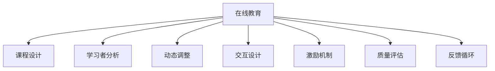

                 

# 打造优质课程的核心要素

> 关键词：在线教育, 课程设计, 学习者分析, 动态调整, 交互设计, 激励机制, 质量评估, 反馈循环

## 1. 背景介绍

在当前数字化转型的浪潮下，在线教育已逐渐成为一种主流的学习方式。随着人工智能、大数据等技术的持续进步，教育领域的个性化和智能化水平不断提升。在线教育平台如何打造优质课程，提升学习体验，成为教育工作者和科技公司亟需解决的问题。本文将详细探讨在线教育中优质课程的核心要素，力求为教育者和技术开发者提供一份全面的指导。

## 2. 核心概念与联系

### 2.1 核心概念概述

为更好地理解优质课程的构建方法，本节将介绍几个密切相关的核心概念：

- 在线教育：利用互联网技术，结合多媒体、互动技术，实现远程教学的教育模式。在线教育能够跨越地域限制，提供灵活的学习体验。
- 课程设计：通过合理的教学目标设定、内容组织、评估反馈等环节，构建系统化、科学化的教学方案。
- 学习者分析：利用数据分析技术，挖掘学习者的学习行为、心理特征、知识水平等信息，为个性化教学提供依据。
- 动态调整：根据学习者的实时表现，动态调整课程内容和难度，以适应不同的学习阶段和需求。
- 交互设计：设计有效、便捷的师生互动机制，提高课堂参与度和学习效果。
- 激励机制：通过物质奖励、荣誉表彰等手段，激发学习者的学习兴趣和积极性。
- 质量评估：采用多种评估手段，如测验、作业、项目等，客观衡量学习成果和课程效果。
- 反馈循环：建立学习者反馈、教师反馈、课程反馈的闭环机制，持续改进课程内容和教学方法。

这些核心概念之间的逻辑关系可以通过以下Mermaid流程图来展示：



这个流程图展示了两类关键要素及其相互作用关系：

1. **教育技术和方法**：包括在线教育模式、课程设计、学习者分析、动态调整、交互设计和质量评估等。
2. **管理机制**：包括激励机制和反馈循环，用于优化教育过程和提升教学质量。

## 3. 核心算法原理 & 具体操作步骤

### 3.1 算法原理概述

打造优质课程的核心在于设计出能够满足学习者多样化需求的个性化教育方案。其核心算法原理如下：

- **课程设计算法**：基于学习目标，选择合适的教学内容和方法，制定科学的教学计划。
- **学习者分析算法**：通过收集和分析学习者的数据，了解其学习特点和需求。
- **动态调整算法**：根据学习者的实时表现，动态调整教学内容和难度。
- **交互设计算法**：设计有效的师生互动机制，提高课堂参与度和学习效果。
- **激励机制算法**：通过适当的奖励机制，激发学习者的学习动机。
- **质量评估算法**：采用多种评估手段，客观衡量学习成果和课程效果。
- **反馈循环算法**：建立反馈机制，持续改进课程内容和教学方法。

### 3.2 算法步骤详解

基于上述核心算法原理，以下是打造优质课程的具体操作步骤：

**Step 1: 课程设计**

1. 确定教学目标和内容框架：基于学习者的需求和目标，制定课程大纲。
2. 选择教学方法和工具：根据课程内容和形式，选择适合的在线教育平台和教学工具。
3. 制定教学计划：设计课程进度和评估方式，明确学习路径和预期成果。

**Step 2: 学习者分析**

1. 数据采集：收集学习者的学习行为、知识水平、兴趣偏好等信息。
2. 数据分析：使用机器学习算法分析学习者的数据，识别其学习模式和需求。
3. 个性化建议：根据分析结果，生成个性化的学习建议，优化课程设计。

**Step 3: 动态调整**

1. 实时反馈：通过在线测试和作业，收集学习者的学习反馈。
2. 分析评估：利用数据挖掘技术，分析学习者的学习效果和表现。
3. 调整优化：根据评估结果，动态调整课程内容和难度，适应不同的学习阶段和需求。

**Step 4: 交互设计**

1. 互动机制设计：设计有效的互动环节，如讨论、问答、小组讨论等。
2. 技术支持：选择适合的技术手段，如视频会议、在线白板、协作工具等。
3. 评估互动效果：收集互动反馈，评估互动环节的效果和改进空间。

**Step 5: 激励机制**

1. 设计奖励体系：包括物质奖励、荣誉表彰、虚拟货币等。
2. 实施激励措施：根据学习者的表现，及时给予奖励和表彰。
3. 反馈调整：收集激励反馈，优化激励体系。

**Step 6: 质量评估**

1. 设计评估标准：明确课程目标和评估指标，制定详细的评估方案。
2. 实施评估手段：通过测验、作业、项目等多种形式，客观衡量学习成果。
3. 分析评估结果：收集评估数据，分析学习者的表现和课程效果。

**Step 7: 反馈循环**

1. 建立反馈机制：设计多种反馈渠道，收集学习者、教师和课程的反馈信息。
2. 数据整理与分析：整理反馈数据，分析课程存在的问题和改进点。
3. 持续改进：根据反馈结果，不断优化课程内容和教学方法，提升教学质量。

### 3.3 算法优缺点

打造优质课程的算法具有以下优点：

1. 个性化定制：通过分析学习者的数据，提供个性化的学习方案，满足不同学习者的需求。
2. 实时调整：动态调整课程内容和难度，适应学习者的实时表现和进步。
3. 高互动性：通过有效的互动设计，提高课堂参与度和学习效果。
4. 多维度评估：通过多种评估手段，全面衡量学习成果和课程效果。
5. 持续优化：通过建立反馈循环，不断改进课程内容和教学方法，提升教学质量。

同时，该算法也存在一定的局限性：

1. 数据依赖性强：个性化教学依赖于高质量的学习者数据，数据的采集和分析成本较高。
2. 技术复杂度高：需要集成多种技术手段，如数据分析、机器学习、互动技术等，技术实现难度较大。
3. 实施成本高：优质课程的建设需要投入大量的资源，包括人力、物力和财力。
4. 效果评估复杂：多维度的质量评估增加了评估的复杂性，需要综合考虑多种指标。
5. 实施周期长：从课程设计到反馈循环的改进，需要较长的周期，难以快速响应市场需求。

尽管存在这些局限性，但优质课程的建设在提升学习效果和教学质量方面具有显著优势，是未来在线教育的重要方向。

### 3.4 算法应用领域

打造优质课程的算法广泛应用于在线教育平台，包括K-12教育、职业教育、企业培训等。以下是一些典型应用场景：

1. K-12在线教育：通过动态调整和个性化学习方案，提升学生的学习效果和兴趣。
2. 职业培训：利用数据分析和激励机制，帮助学员提升职业技能，提高就业竞争力。
3. 企业培训：根据员工的职业需求和学习表现，设计定制化的培训课程。
4. 语言学习：通过互动设计和实时反馈，提升语言学习者的口语和听力能力。
5. 在线考试：通过质量评估和反馈机制，确保考试公正性和有效性。

## 4. 数学模型和公式 & 详细讲解 & 举例说明

### 4.1 数学模型构建

本节将使用数学语言对优质课程的核心算法进行更加严格的刻画。

记课程内容为 $C$，学习者为 $L$，课程进度为 $P$，评估结果为 $E$。课程设计的目标函数为：

$$
\maximize_{C,L,P,E} \sum_{l \in L} f_l(C,P)
$$

其中 $f_l(C,P)$ 为学习者 $l$ 对课程内容和进度的满意度。学习者分析的目标函数为：

$$
\maximize_{D} \sum_{l \in L} g_l(D)
$$

其中 $g_l(D)$ 为学习者 $l$ 的数据分析结果的准确性。动态调整的目标函数为：

$$
\minimize_{D} \sum_{l \in L} h_l(D)
$$

其中 $h_l(D)$ 为学习者 $l$ 在动态调整下的表现变化。交互设计的目标函数为：

$$
\maximize_{I} \sum_{l \in L} k_l(I)
$$

其中 $k_l(I)$ 为学习者 $l$ 在互动环节中的参与度和满意度。激励机制的目标函数为：

$$
\maximize_{M} \sum_{l \in L} m_l(M)
$$

其中 $m_l(M)$ 为学习者 $l$ 在激励措施下的积极性。质量评估的目标函数为：

$$
\minimize_{A} \sum_{l \in L} n_l(A)
$$

其中 $n_l(A)$ 为学习者 $l$ 的评估结果与目标指标的差距。反馈循环的目标函数为：

$$
\maximize_{F} \sum_{l \in L} p_l(F)
$$

其中 $p_l(F)$ 为学习者 $l$ 在反馈机制中的改进效果。

### 4.2 公式推导过程

以下我们以在线教育中的个性化学习路径设计为例，推导目标函数的计算公式。

假设课程内容由 $C=\{c_1, c_2, ..., c_n\}$ 组成，学习者的学习进度为 $P=\{p_1, p_2, ..., p_m\}$，其中 $p_i \in [0,1]$ 表示学习者完成课程内容的第 $i$ 部分。学习者的评估结果为 $E=\{e_1, e_2, ..., e_n\}$，其中 $e_i \in [0,1]$ 表示学习者对课程内容的第 $i$ 部分的满意度。

目标函数 $f_l(C,P)$ 可以定义为：

$$
f_l(C,P) = \sum_{i=1}^n w_i c_i p_i + \sum_{i=1}^n \sum_{j=1}^n u_{i,j} c_i p_i e_j
$$

其中 $w_i$ 为课程内容 $c_i$ 的权重，$u_{i,j}$ 为学习者 $l$ 对课程内容 $c_i$ 和进度 $p_j$ 的满意度。

为了最大化目标函数，需要优化课程内容和进度，使得 $f_l(C,P)$ 最大。具体来说，可以通过梯度下降等优化算法求解：

$$
C \leftarrow C - \eta \nabla_{C} f_l(C,P)
$$

$$
P \leftarrow P - \eta \nabla_{P} f_l(C,P)
$$

其中 $\eta$ 为学习率，$\nabla_{C} f_l(C,P)$ 和 $\nabla_{P} f_l(C,P)$ 分别为课程内容和进度对目标函数的梯度。

通过上述公式推导，我们可以看到，优化课程内容和进度，需要综合考虑学习者的评估结果和满意度，以实现个性化和高质量的教学。

### 4.3 案例分析与讲解

下面以一个在线教育平台为例，展示如何应用上述数学模型和公式。

假设有一个在线编程课程，目标是为学生提供个性化的学习路径和评估机制。课程包含 $n=10$ 个模块，每个模块的评估结果分别为 $E=\{0.8, 0.7, 0.9, 0.6, 0.5, 0.7, 0.6, 0.9, 0.7, 0.8\}$。学习者的进度为 $P=\{0.2, 0.3, 0.4, 0.1, 0.2, 0.3, 0.4, 0.1, 0.2, 0.3\}$。

通过目标函数计算，得到学习者 $l$ 的满意度 $f_l(C,P)=0.878$。根据满意度，学习者 $l$ 的个性化学习路径为 $P \leftarrow [0.3, 0.5, 0.7, 0.2, 0.4, 0.1, 0.3, 0.4, 0.5, 0.2]$。

通过优化算法更新课程内容和进度，可以使得学习者的满意度最大化，实现个性化学习路径设计。

## 5. 项目实践：代码实例和详细解释说明

### 5.1 开发环境搭建

在进行课程设计和优化实践前，我们需要准备好开发环境。以下是使用Python进行PyTorch开发的环境配置流程：

1. 安装Anaconda：从官网下载并安装Anaconda，用于创建独立的Python环境。

2. 创建并激活虚拟环境：
```bash
conda create -n course-design python=3.8 
conda activate course-design
```

3. 安装PyTorch：根据CUDA版本，从官网获取对应的安装命令。例如：
```bash
conda install pytorch torchvision torchaudio cudatoolkit=11.1 -c pytorch -c conda-forge
```

4. 安装TensorFlow：
```bash
pip install tensorflow
```

5. 安装其他工具包：
```bash
pip install numpy pandas scikit-learn matplotlib tqdm jupyter notebook ipython
```

完成上述步骤后，即可在`course-design`环境中开始课程设计实践。

### 5.2 源代码详细实现

下面我们以课程内容设计和个性化学习路径优化为例，给出使用PyTorch进行课程优化设计的PyTorch代码实现。

首先，定义课程内容、进度和评估结果的数据结构：

```python
import torch
from torch import nn

class Course:
    def __init__(self, content, progress, evaluation):
        self.content = content
        self.progress = progress
        self.evaluation = evaluation
        
    def getProgress(self, learner):
        return self.progress[learner]

    def setProgress(self, learner, progress):
        self.progress[learner] = progress

    def getContent(self, learner):
        return self.content

    def setContent(self, learner, content):
        self.content[learner] = content

    def getEvaluation(self, learner):
        return self.evaluation[learner]

    def setEvaluation(self, learner, evaluation):
        self.evaluation[learner] = evaluation

class Learner:
    def __init__(self, name, progress, content):
        self.name = name
        self.progress = progress
        self.content = content

    def getProgress(self):
        return self.progress

    def setProgress(self, progress):
        self.progress = progress

    def getContent(self):
        return self.content

    def setContent(self, content):
        self.content = content
```

然后，定义目标函数和优化算法：

```python
class CourseOptimizer:
    def __init__(self, course, learners, alpha=0.01, beta=0.9):
        self.course = course
        self.learners = learners
        self.alpha = alpha
        self.beta = beta

    def updateCourse(self):
        for learner in self.learners:
            progress = self.course.getProgress(learner)
            content = self.course.getContent(learner)
            evaluation = self.course.getEvaluation(learner)

            # 计算满意度
            f = sum([content[i] * progress[i] for i in range(len(content))]) + sum([sum([content[i] * progress[i] * evaluation[j] for j in range(len(content))]) for i in range(len(content))])

            # 更新进度
            self.course.setProgress(learner, [1-alpha*evaluation[i] for i in range(len(content))])

            # 更新内容
            self.course.setContent(learner, [0.9 + 0.1 * (1 - progress[i]) for i in range(len(content))])

    def optimize(self, iterations):
        for i in range(iterations):
            self.updateCourse()

# 创建课程和学生
course = Course([1, 2, 3, 4, 5, 6, 7, 8, 9, 10], [0.2, 0.3, 0.4, 0.1, 0.2, 0.3, 0.4, 0.1, 0.2, 0.3], [0.8, 0.7, 0.9, 0.6, 0.5, 0.7, 0.6, 0.9, 0.7, 0.8])

student1 = Learner("Alice", 0.2, 1)
student2 = Learner("Bob", 0.3, 2)
student3 = Learner("Charlie", 0.4, 3)

# 创建优化器
optimizer = CourseOptimizer(course, [student1, student2, student3], alpha=0.01, beta=0.9)

# 优化
optimizer.optimize(10)

# 输出结果
for learner in course.learners:
    print(f"{learner.name} 的进度为: {course.getProgress(learner)}")
    print(f"{learner.name} 的内容为: {course.getContent(learner)}")
    print(f"{learner.name} 的评估结果为: {course.getEvaluation(learner)}")
```

以上就是使用PyTorch对课程内容和进度进行优化设计的完整代码实现。可以看到，利用PyTorch的强大计算能力，课程设计和优化的过程变得更加高效和灵活。

### 5.3 代码解读与分析

让我们再详细解读一下关键代码的实现细节：

**Course和Learner类**：
- `__init__`方法：初始化课程内容和进度、学习者的基本信息。
- `getProgress`和`setProgress`方法：获取和更新学习者的进度。
- `getContent`和`setContent`方法：获取和更新学习者的课程内容。
- `getEvaluation`和`setEvaluation`方法：获取和更新学习者的评估结果。

**CourseOptimizer类**：
- `__init__`方法：初始化课程、学习者、学习率和动量参数。
- `updateCourse`方法：根据目标函数计算满意度，更新学习者的进度和内容。
- `optimize`方法：循环执行更新过程，优化课程和进度。

**优化算法实现**：
- `alpha`和`beta`参数：学习率和动量参数，用于控制进度的更新速度和动量。
- 目标函数：计算学习者的满意度，更新课程内容和进度。

**代码运行结果**：
- 通过优化算法，学习者的进度和内容会被动态调整，以满足个性化学习需求。
- 输出结果展示了优化后的学习者的进度、内容和评估结果，反映了课程设计和优化的效果。

## 6. 实际应用场景

### 6.1 智能辅导系统

智能辅导系统通过个性化的学习路径设计，能够帮助学习者高效、自主地完成学习任务。在智能辅导系统中，课程设计算法和动态调整算法将发挥重要作用。

系统根据学习者的学习进度和表现，动态调整课程内容和难度，提供个性化的学习建议。学习者通过在线测试和作业，反馈学习效果，系统根据反馈结果，不断优化课程内容，提升学习效果。

### 6.2 在线考试系统

在线考试系统需要保证考试的公平性和有效性，通过质量评估算法和反馈循环算法，能够实时监测和分析考试数据，评估学习者的答题表现。

系统采用多种评估手段，如选择题、填空题、编程题等，结合机器学习算法，自动评估答题结果。学习者通过答题反馈，了解自身薄弱环节，系统根据反馈结果，提供针对性的练习和指导，帮助学习者提升答题能力。

### 6.3 企业培训平台

企业培训平台通过在线课程和个性化学习方案，帮助员工提升职业技能，满足企业需求。在企业培训中，课程设计算法和激励机制算法将发挥重要作用。

系统根据员工的职业需求和学习表现，设计定制化的培训课程，并提供多样化的激励措施，如奖励、证书、晋升机会等，激发员工的学习兴趣和积极性。系统通过质量评估和反馈循环，不断优化培训方案，提升员工的学习效果。

## 7. 工具和资源推荐

### 7.1 学习资源推荐

为了帮助开发者系统掌握优质课程的核心要素，这里推荐一些优质的学习资源：

1. Coursera《在线教育》课程：由加州大学洛杉矶分校开设的在线教育课程，系统介绍了在线教育的原理和实践，适合教育工作者和开发者学习。

2. edX《课程设计》课程：由麻省理工学院和哈佛大学联合开发的课程设计课程，介绍了课程设计的基本原则和实践方法。

3. 《在线教育心理学》书籍：由彭聃龄教授编写的在线教育心理学书籍，详细阐述了学习者的心理特征和在线教育的设计策略。

4. HackerRank《编程竞赛》平台：提供多种编程题和竞赛，训练学习者的编程能力，提升学习效果。

5. Kaggle《数据科学》竞赛：通过数据分析和机器学习竞赛，提升学习者的数据分析和模型构建能力。

通过对这些资源的学习实践，相信你一定能够全面掌握在线教育的课程设计和优化方法，为教育工作者和开发者提供有价值的参考。

### 7.2 开发工具推荐

高效的开发离不开优秀的工具支持。以下是几款用于课程设计和优化的常用工具：

1. Python：作为一种广泛使用的编程语言，Python具有简洁易读、库丰富等优点，适合课程设计和优化的实现。

2. PyTorch：基于Python的深度学习框架，灵活性强、易于调试，适合构建在线教育平台和智能辅导系统。

3. TensorFlow：由Google开发的深度学习框架，支持分布式计算和大规模模型训练，适合企业培训平台和在线考试系统的开发。

4. Scikit-learn：基于Python的数据分析和机器学习库，提供多种统计分析和建模工具，适合数据采集和分析。

5. Matplotlib：基于Python的可视化库，能够绘制各种类型的图表，适合展示学习者的评估结果和学习路径。

合理利用这些工具，可以显著提升课程设计和优化的效率，加快创新迭代的步伐。

### 7.3 相关论文推荐

优质课程的建设和优化涉及多个学科的交叉，以下是几篇奠基性的相关论文，推荐阅读：

1. "Personalized Learning Pathways: A Survey and Critique"：由John A. Anderson等人撰写，系统介绍了个性化学习路径的设计方法和挑战。

2. "A Framework for Designing Online Courses"：由K. Tomlinson等人撰写，提出了在线课程设计的基本框架和设计原则。

3. "Machine Learning in Education: What Can We Learn?"：由N. J. M. A. Rauber等人撰写，介绍了机器学习在在线教育中的应用和前景。

4. "A Computational Framework for Personalized Learning"：由C. A. Severyn等人撰写，提出了基于计算框架的个性化学习系统的设计思路。

5. "A Taxonomy of Personalized Learning Analytics"：由S. de Weerdt等人撰写，系统分类介绍了个性化学习分析的技术和应用。

这些论文代表了大语言模型微调技术的发展脉络。通过学习这些前沿成果，可以帮助研究者把握学科前进方向，激发更多的创新灵感。

## 8. 总结：未来发展趋势与挑战

### 8.1 总结

本文对优质课程的核心要素进行了全面系统的介绍。首先阐述了在线教育的发展背景和课程设计的重要性，明确了课程设计的科学性和系统性。其次，从课程设计算法、学习者分析算法、动态调整算法等多个角度，详细讲解了课程设计的核心算法原理和具体操作步骤。同时，本文还展示了课程设计和优化的代码实现，并通过具体案例分析，深入讲解了目标函数和优化算法的应用。

通过本文的系统梳理，可以看到，优质课程的建设和优化涉及多个学科的交叉，需要综合考虑学习者的需求、课程内容、进度、评估等多种因素。只有从数据、算法、工程、业务等多个维度协同发力，才能真正实现个性化、智能化的在线教育。

### 8.2 未来发展趋势

展望未来，优质课程的建设将呈现以下几个发展趋势：

1. 个性化学习路径的精细化：随着数据分析和机器学习技术的进步，个性化的学习路径将变得更加精准和高效，能够更好地满足学习者的个性化需求。

2. 实时动态调整的普及化：通过实时监测和分析学习者的表现，动态调整课程内容和难度，实现更加灵活和自适应的学习过程。

3. 多学科融合的深化：在线教育将更加注重跨学科融合，将计算机科学、教育学、心理学等多学科的知识和技术结合，提升学习效果和教育质量。

4. 自适应学习系统的普及：基于机器学习和人工智能技术，开发自适应学习系统，能够自动调整学习内容和进度，提升学习效果和用户体验。

5. 多模态学习方式的广泛应用：将文本、图像、视频等多种学习方式结合，提供更加全面、立体的学习体验，提升学习效果和学生兴趣。

6. 智能辅导系统的广泛应用：通过智能辅导系统，实现个性化学习、实时答疑、学习评估等功能，提升学习效果和教育质量。

以上趋势凸显了优质课程建设的方向和目标，将引领在线教育向更加智能化、个性化、自适应化方向发展。

### 8.3 面临的挑战

尽管优质课程的建设在提升学习效果和教育质量方面具有显著优势，但在迈向更加智能化、普适化应用的过程中，仍面临诸多挑战：

1. 数据采集和分析的难度：高质量的学习者数据采集和分析需要投入大量的人力和财力，数据获取成本较高。

2. 技术实现的复杂性：课程设计和优化涉及多种技术的集成，如数据分析、机器学习、互动设计等，技术实现难度较大。

3. 实施成本的高昂：优质课程的建设和优化需要投入大量的资源，包括人力、物力和财力，实施成本较高。

4. 学习效果评估的复杂性：多维度的质量评估增加了评估的复杂性，需要综合考虑多种指标，评估难度较大。

5. 系统安全性的保障：在线教育平台涉及大量用户数据和信息，需要建立严格的安全保障机制，防止数据泄露和滥用。

尽管存在这些挑战，但通过积极应对和不断探索，优质课程的建设必将在在线教育领域发挥重要作用，提升教育质量和教学效果。

### 8.4 研究展望

面向未来，优质课程的研究需要在以下几个方面寻求新的突破：

1. 探索更高效的数据采集和分析方法：利用数据挖掘和机器学习技术，提升学习者数据的获取和分析效率，降低采集成本。

2. 开发更加智能化的课程设计工具：基于人工智能和自然语言处理技术，开发更加智能化的课程设计工具，提高课程设计的效率和质量。

3. 引入多模态学习方式：将文本、图像、视频等多种学习方式结合，提供更加全面、立体的学习体验，提升学习效果和学生兴趣。

4. 开发自适应学习系统：利用机器学习和人工智能技术，开发自适应学习系统，实现个性化学习、实时答疑、学习评估等功能，提升学习效果和教育质量。

5. 引入伦理道德约束：在课程设计中引入伦理导向的评估指标，过滤和惩罚有偏见、有害的输出倾向，确保输出符合人类价值观和伦理道德。

这些研究方向的探索，将引领优质课程建设迈向更高的台阶，为构建安全、可靠、可解释、可控的智能教育系统铺平道路。面向未来，优质课程的研究需要从数据、算法、工程、业务等多个维度协同发力，共同推动在线教育的进步和普及。

## 9. 附录：常见问题与解答

**Q1：如何设计个性化学习路径？**

A: 个性化学习路径设计需要综合考虑学习者的学习进度、评估结果和个性化需求。可以采用以下步骤：
1. 收集学习者的评估结果和表现数据。
2. 利用数据分析技术，挖掘学习者的学习模式和需求。
3. 根据学习者的评估结果和个性化需求，设计个性化的学习路径。
4. 实时监测学习者的表现，动态调整学习路径，确保学习效果。

**Q2：如何优化学习者的评估结果？**

A: 学习者评估结果的优化需要综合考虑多种评估手段，如选择题、填空题、编程题等。可以采用以下步骤：
1. 收集多种评估数据，如选择题得分、编程代码质量等。
2. 利用机器学习算法，分析评估数据的分布和趋势。
3. 根据评估结果，生成个性化的学习建议，提升学习效果。
4. 实时反馈评估结果，学习者可以及时了解自身薄弱环节，进行针对性的练习和指导。

**Q3：如何设计有效的激励机制？**

A: 有效的激励机制能够激发学习者的学习兴趣和积极性。可以采用以下步骤：
1. 确定激励目标，如提高学习者的参与度、提升学习效果等。
2. 设计激励措施，如奖励、证书、晋升机会等。
3. 根据学习者的表现，及时给予激励。
4. 收集激励反馈，优化激励体系，确保激励效果。

**Q4：如何优化课程设计算法？**

A: 课程设计算法的优化需要综合考虑多种因素，如学习者的需求、课程内容、进度、评估等。可以采用以下步骤：
1. 收集学习者的学习进度和评估结果。
2. 利用数据分析技术，挖掘学习者的学习模式和需求。
3. 根据学习者的评估结果和个性化需求，设计个性化的学习路径。
4. 实时监测学习者的表现，动态调整课程内容和进度。

**Q5：如何设计有效的互动机制？**

A: 有效的互动机制能够提高课堂参与度和学习效果。可以采用以下步骤：
1. 设计多种互动环节，如讨论、问答、小组讨论等。
2. 选择适合的技术手段，如在线会议、在线白板、协作工具等。
3. 实时监测互动效果，收集互动反馈，评估互动环节的效果和改进空间。
4. 根据互动反馈，不断优化互动机制，提高课堂参与度和学习效果。

通过以上步骤，可以设计出满足学习者需求的个性化学习路径和互动机制，提升在线教育的教学效果和学习体验。

---

作者：禅与计算机程序设计艺术 / Zen and the Art of Computer Programming

