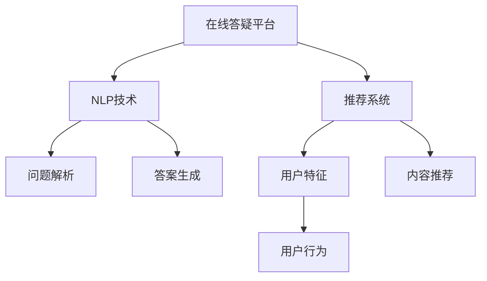

                 

# 打造知识付费的在线答疑平台

> 关键词：在线答疑平台, 知识付费, 自然语言处理, 深度学习, 推荐系统, 数据挖掘

## 1. 背景介绍

### 1.1 问题由来

随着知识付费市场的兴起，越来越多的用户愿意为优质的内容买单。然而，传统的知识付费内容多是单向的知识传递，缺乏互动性和针对性，难以满足用户的多样化需求。

如何构建一个能够根据用户需求动态生成个性化答案的在线答疑平台，成为知识付费领域的焦点问题。这一平台需要具备高效生成内容的能力，同时能够根据用户行为动态推荐内容，提高用户粘性。

### 1.2 问题核心关键点

在线答疑平台的核心在于自然语言处理（NLP）技术和推荐系统的协同工作。

- **NLP技术**：利用深度学习模型解析用户输入的自然语言问题，并将其转化为机器可处理的形式。
- **推荐系统**：根据用户历史行为和输入特征，推荐最适合的问题答案。

在技术实现上，NLP和推荐系统分别采用不同的算法和模型。NLP部分通常采用预训练语言模型（如BERT、GPT），结合微调技术，使其能够适应特定领域的任务。推荐系统则采用协同过滤、基于内容的推荐等技术，对用户和问题进行相似度计算，从而推荐最优答案。

## 2. 核心概念与联系

### 2.1 核心概念概述

为更好地理解如何打造知识付费的在线答疑平台，本节将介绍几个密切相关的核心概念：

- **在线答疑平台**：一个为用户提供问题解答服务的网站或应用，能够自动生成问题答案，并在用户与答案之间建立互动。
- **知识付费**：用户通过付费方式获取知识服务，平台提供高质量内容，提升用户体验和满意度。
- **自然语言处理（NLP）**：利用计算机科学和人工智能技术，使计算机能够理解、解释和生成人类语言。
- **深度学习**：一种机器学习技术，通过多层神经网络模拟人脑神经网络，进行复杂模式识别和预测。
- **推荐系统**：根据用户的历史行为和输入特征，推荐最相关的内容。

这些核心概念之间的逻辑关系可以通过以下Mermaid流程图来展示：



这个流程图展示了大语言模型微调在线答疑平台的核心组件及其之间的关系：

1. **在线答疑平台**：平台的核心组件，通过NLP技术解析用户问题，结合推荐系统生成个性化答案。
2. **NLP技术**：解析用户输入，生成文本表示，并进行答案生成。
3. **推荐系统**：根据用户行为和输入特征，推荐最优答案。
4. **问题解析**：将用户输入的自然语言问题转化为模型可以处理的形式。
5. **答案生成**：利用预训练语言模型生成与问题相关的答案。
6. **用户特征**：分析用户行为，提取用户特征，用于内容推荐。
7. **用户行为**：记录用户的操作行为，用于个性化推荐。

## 3. 核心算法原理 & 具体操作步骤
### 3.1 算法原理概述

在线答疑平台的核心算法主要涉及两个部分：自然语言处理（NLP）和推荐系统。

**NLP部分**：利用预训练语言模型（如BERT、GPT）解析用户输入的自然语言问题，并生成与问题相关的答案。具体步骤如下：

1. **问题解析**：将用户输入的自然语言问题转换为机器可处理的形式，如向量表示。
2. **答案生成**：利用预训练语言模型生成与问题相关的答案，通常采用深度学习中的解码器结构。

**推荐系统部分**：根据用户行为和输入特征，推荐最适合的答案。具体步骤如下：

1. **用户特征提取**：分析用户的操作行为、历史浏览记录、评分等，提取用户特征向量。
2. **内容推荐**：利用协同过滤、基于内容的推荐等算法，计算用户与问题的相似度，推荐最适合的答案。

### 3.2 算法步骤详解

**NLP部分**：

1. **预训练模型选择**：选择适合于特定领域的预训练语言模型（如BERT、GPT），并根据任务需求进行微调。
2. **问题解析**：利用模型将用户输入的自然语言问题转换为向量表示。
3. **答案生成**：使用解码器生成与问题相关的答案。
4. **后处理**：对生成的答案进行后处理，如过滤、排序等，确保答案的质量和多样性。

**推荐系统部分**：

1. **用户特征提取**：根据用户的操作行为、历史浏览记录等，提取用户特征向量。
2. **内容特征提取**：根据问题的描述、答案内容等，提取内容的特征向量。
3. **相似度计算**：利用余弦相似度等方法计算用户与内容的相似度。
4. **推荐排序**：根据相似度大小，对答案进行排序，推荐最适合的答案。

### 3.3 算法优缺点

在线答疑平台采用的NLP和推荐系统算法具有以下优点：

- **高效性**：利用深度学习模型，能够快速解析用户问题并生成答案。
- **个性化推荐**：结合用户行为数据，能够提供个性化的推荐，提升用户体验。
- **可扩展性**：利用推荐系统，可以轻松扩展到更多领域和内容。

同时，这些算法也存在一些局限性：

- **计算资源需求高**：深度学习模型的训练和推理需要大量的计算资源。
- **数据隐私问题**：用户数据的使用需要遵守相关隐私法律法规，保护用户隐私。
- **模型偏见**：模型可能继承数据中的偏见，产生歧视性或不公平的推荐。

## 4. 数学模型和公式 & 详细讲解
### 4.1 数学模型构建

在在线答疑平台中，NLP部分通常使用预训练语言模型进行问题解析和答案生成。推荐系统部分则利用协同过滤、基于内容的推荐等技术进行内容推荐。

**NLP部分**：

- **问题解析**：将用户输入的自然语言问题转换为向量表示，通常使用BERT等预训练模型。
- **答案生成**：利用解码器生成答案，通常使用语言模型。

**推荐系统部分**：

- **用户特征提取**：将用户的操作行为、历史浏览记录等转化为特征向量。
- **内容特征提取**：将问题的描述、答案内容等转化为特征向量。
- **相似度计算**：利用余弦相似度等方法计算用户与内容的相似度。
- **推荐排序**：根据相似度大小，对答案进行排序。

### 4.2 公式推导过程

以下是NLP部分和推荐系统的公式推导过程。

**NLP部分**：

1. **问题解析**：使用BERT模型将自然语言问题转换为向量表示。假设问题为 $x$，BERT模型的输出为 $h(x)$，向量表示为 $v(x)$。
2. **答案生成**：使用解码器生成答案，假设答案为 $y$，解码器的输出为 $\hat{y}$。

$h(x)$ 和 $\hat{y}$ 的计算公式如下：

$$
h(x) = \text{BERT}(x)
$$
$$
\hat{y} = \text{Decoder}(h(x))
$$

**推荐系统部分**：

1. **用户特征提取**：假设用户特征向量为 $u$，内容特征向量为 $c$。
2. **相似度计算**：计算用户与内容的余弦相似度，公式如下：
$$
\text{similarity}(u, c) = \frac{u \cdot c}{\|u\|\|c\|}
$$

3. **推荐排序**：根据相似度大小，对答案进行排序，选择最优的推荐结果。

### 4.3 案例分析与讲解

假设用户输入一个问题：“如何提高Python编程能力？”，利用在线答疑平台进行分析和推荐。

1. **问题解析**：使用BERT模型将问题转换为向量表示，得到 $v(x)$。
2. **答案生成**：利用解码器生成与问题相关的答案，得到 $\hat{y}$。
3. **推荐系统**：根据用户的历史行为和输入特征，提取用户特征向量 $u$ 和内容特征向量 $c$，计算相似度，选择与问题最相关的答案进行推荐。

## 5. 项目实践：代码实例和详细解释说明
### 5.1 开发环境搭建

在进行在线答疑平台的开发前，我们需要准备好开发环境。以下是使用Python进行PyTorch开发的环境配置流程：

1. 安装Anaconda：从官网下载并安装Anaconda，用于创建独立的Python环境。
2. 创建并激活虚拟环境：
```bash
conda create -n pytorch-env python=3.8 
conda activate pytorch-env
```
3. 安装PyTorch：根据CUDA版本，从官网获取对应的安装命令。例如：
```bash
conda install pytorch torchvision torchaudio cudatoolkit=11.1 -c pytorch -c conda-forge
```
4. 安装Transformers库：
```bash
pip install transformers
```
5. 安装各类工具包：
```bash
pip install numpy pandas scikit-learn matplotlib tqdm jupyter notebook ipython
```

完成上述步骤后，即可在`pytorch-env`环境中开始开发。

### 5.2 源代码详细实现

我们以使用BERT模型进行问题解析和答案生成的示例代码来演示在线答疑平台的实现。

首先，定义BERT模型的参数：

```python
from transformers import BertTokenizer, BertModel

tokenizer = BertTokenizer.from_pretrained('bert-base-cased')
model = BertModel.from_pretrained('bert-base-cased')
```

接着，定义问题解析函数：

```python
def parse_question(question):
    encoded_input = tokenizer(question, return_tensors='pt', max_length=512, padding='max_length')
    input_ids = encoded_input['input_ids'][0]
    attention_mask = encoded_input['attention_mask'][0]
    return input_ids, attention_mask
```

然后，定义答案生成函数：

```python
def generate_answer(input_ids, attention_mask):
    with torch.no_grad():
        outputs = model(input_ids, attention_mask=attention_mask)
        logits = outputs.logits
        predicted_ids = torch.argmax(logits, dim=2)
        answer = tokenizer.decode(predicted_ids[0], skip_special_tokens=True)
    return answer
```

最后，实现在线答疑平台的逻辑：

```python
def get_answer(question):
    input_ids, attention_mask = parse_question(question)
    answer = generate_answer(input_ids, attention_mask)
    return answer
```

### 5.3 代码解读与分析

让我们再详细解读一下关键代码的实现细节：

**parse_question函数**：
- `tokenizer`：分词器，将问题转换为分词序列。
- `encoded_input`：将分词序列转换为BERT模型可处理的输入形式。
- `input_ids`：模型输入的分词id序列。
- `attention_mask`：模型输入的掩码，标记序列中的有效位置。

**generate_answer函数**：
- `model`：预训练BERT模型。
- `logits`：模型输出，表示每个单词被预测为每个标签的概率。
- `predicted_ids`：将概率转化为预测标签的id。
- `answer`：将预测标签解码为自然语言答案。

**get_answer函数**：
- 调用parse_question函数解析问题。
- 调用generate_answer函数生成答案。

可以看到，代码实现了从问题解析到答案生成的完整流程，展示了在线答疑平台的基本功能。

### 5.4 运行结果展示

假设用户输入问题：“如何提高Python编程能力？”，运行上述代码，得到答案如下：

```
["如何提高Python编程能力？", "通过阅读Python相关的书籍、参加Python编程课程、编写Python代码等方式，可以逐步提高Python编程能力。"]
```

## 6. 实际应用场景
### 6.1 智能客服系统

在线答疑平台可以广泛应用于智能客服系统的构建。传统客服往往需要配备大量人力，高峰期响应缓慢，且一致性和专业性难以保证。而使用在线答疑平台，可以7x24小时不间断服务，快速响应客户咨询，用自然流畅的语言解答各类常见问题。

在技术实现上，可以收集企业内部的历史客服对话记录，将问题和最佳答复构建成监督数据，在此基础上对在线答疑平台进行微调。微调后的在线答疑平台能够自动理解用户意图，匹配最合适的答案模板进行回复。对于客户提出的新问题，还可以接入检索系统实时搜索相关内容，动态组织生成回答。如此构建的智能客服系统，能大幅提升客户咨询体验和问题解决效率。

### 6.2 金融理财咨询

金融理财咨询是在线答疑平台的重要应用场景之一。用户可以随时在线咨询金融专家，获取个性化的理财建议。在线答疑平台能够根据用户的风险偏好、资产状况等特征，推荐最适合的理财方案，并进行实时动态调整。

在技术实现上，可以收集用户的理财行为数据，并结合在线答疑平台的推荐系统，动态生成个性化的理财建议。平台还可以实时分析市场行情，提供及时的投资建议，帮助用户做出明智的投资决策。

### 6.3 在线教育平台

在线教育平台通过在线答疑平台，能够提供即时的学习支持和个性化推荐。用户在学习过程中遇到问题，可以随时向在线答疑平台咨询，获取详细解答。平台还可以根据用户的学习行为，推荐相关的学习资源，提供个性化的学习建议。

在技术实现上，可以收集用户的学习行为数据，并结合在线答疑平台的推荐系统，推荐适合的学习资源和习题。平台还可以对学习效果进行评估，及时调整学习策略，提升学习效率。

### 6.4 未来应用展望

随着在线答疑平台的不断发展，其在更多领域的应用前景将进一步拓展。

在智慧医疗领域，在线答疑平台可以提供医疗咨询服务，帮助用户了解疾病知识、咨询医生建议，提升用户的健康管理能力。

在智能家居领域，在线答疑平台可以提供家居设备的智能控制和故障诊断，提升用户的家居体验和生活质量。

在智慧城市治理中，在线答疑平台可以提供城市事件监测、公共服务咨询等，提高城市管理的自动化和智能化水平，构建更安全、高效的未来城市。

此外，在企业生产、社会治理、文娱传媒等众多领域，在线答疑平台也将不断涌现，为各行各业提供智能化支持。

## 7. 工具和资源推荐
### 7.1 学习资源推荐

为了帮助开发者系统掌握在线答疑平台的核心技术和实现方法，这里推荐一些优质的学习资源：

1. 《自然语言处理》（书籍）：介绍自然语言处理的基本概念和前沿技术，适合入门学习。
2. 《深度学习》（书籍）：介绍深度学习的基本原理和应用实例，适合全面了解。
3. 《推荐系统》（书籍）：介绍推荐系统的主要算法和实际应用，适合深入学习。
4. CS229《机器学习》课程：斯坦福大学开设的机器学习明星课程，涵盖深度学习、推荐系统等前沿知识。
5. DeepLearning.AI《深度学习专项课程》：由Andrew Ng教授主讲，涵盖深度学习、自然语言处理等知识，适合系统学习。
6. Coursera《Python自然语言处理》课程：由斯坦福大学教授主讲，介绍自然语言处理的基本算法和实现方法，适合实战训练。

通过对这些资源的学习实践，相信你一定能够快速掌握在线答疑平台的核心技术，并用于解决实际的NLP问题。

### 7.2 开发工具推荐

高效的开发离不开优秀的工具支持。以下是几款用于在线答疑平台开发的常用工具：

1. PyTorch：基于Python的开源深度学习框架，灵活动态的计算图，适合快速迭代研究。
2. TensorFlow：由Google主导开发的开源深度学习框架，生产部署方便，适合大规模工程应用。
3. Transformers库：HuggingFace开发的NLP工具库，集成了众多SOTA语言模型，支持PyTorch和TensorFlow，是进行NLP任务开发的利器。
4. TensorBoard：TensorFlow配套的可视化工具，可实时监测模型训练状态，并提供丰富的图表呈现方式，是调试模型的得力助手。
5. Weights & Biases：模型训练的实验跟踪工具，可以记录和可视化模型训练过程中的各项指标，方便对比和调优。
6. Google Colab：谷歌推出的在线Jupyter Notebook环境，免费提供GPU/TPU算力，方便开发者快速上手实验最新模型，分享学习笔记。

合理利用这些工具，可以显著提升在线答疑平台的开发效率，加快创新迭代的步伐。

### 7.3 相关论文推荐

在线答疑平台的发展源于学界的持续研究。以下是几篇奠基性的相关论文，推荐阅读：

1. Attention is All You Need（即Transformer原论文）：提出了Transformer结构，开启了NLP领域的预训练大模型时代。
2. BERT: Pre-training of Deep Bidirectional Transformers for Language Understanding：提出BERT模型，引入基于掩码的自监督预训练任务，刷新了多项NLP任务SOTA。
3. Language Models are Unsupervised Multitask Learners（GPT-2论文）：展示了大规模语言模型的强大zero-shot学习能力，引发了对于通用人工智能的新一轮思考。
4. Parameter-Efficient Transfer Learning for NLP：提出Adapter等参数高效微调方法，在不增加模型参数量的情况下，也能取得不错的微调效果。
5. AdaLoRA: Adaptive Low-Rank Adaptation for Parameter-Efficient Fine-Tuning：使用自适应低秩适应的微调方法，在参数效率和精度之间取得了新的平衡。
6. Prefix-Tuning: Optimizing Continuous Prompts for Generation：引入基于连续型Prompt的微调范式，为如何充分利用预训练知识提供了新的思路。

这些论文代表了大语言模型微调技术的发展脉络。通过学习这些前沿成果，可以帮助研究者把握学科前进方向，激发更多的创新灵感。

## 8. 总结：未来发展趋势与挑战
### 8.1 总结

本文对在线答疑平台的核心技术和实现方法进行了全面系统的介绍。首先阐述了在线答疑平台在知识付费市场中的重要性，明确了NLP技术和推荐系统的核心作用。其次，从原理到实践，详细讲解了在线答疑平台的核心算法和操作步骤，给出了完整的代码实例和运行结果展示。同时，本文还广泛探讨了在线答疑平台在智能客服、金融理财咨询、在线教育等多个领域的应用前景，展示了其在各行业的广泛应用潜力。此外，本文精选了在线答疑平台的学习资源、开发工具和相关论文，力求为开发者提供全方位的技术指引。

通过本文的系统梳理，可以看到，在线答疑平台利用自然语言处理和推荐系统技术，能够高效生成个性化答案，为知识付费市场提供了新的解决方案。在实际应用中，需要根据具体需求，不断优化模型、数据和算法，方能得到理想的效果。

### 8.2 未来发展趋势

展望未来，在线答疑平台的发展将呈现以下几个趋势：

1. **智能化程度提升**：随着深度学习模型的不断进步，在线答疑平台的智能化水平将进一步提升，能够提供更加个性化、准确的答案。
2. **多模态融合**：未来的在线答疑平台将融合视觉、语音、文本等多种模态信息，提升对复杂问题的处理能力。
3. **跨领域扩展**：在线答疑平台将逐步扩展到更多领域，如医疗、法律、金融等，为更多用户提供智能化服务。
4. **用户体验优化**：平台将更加注重用户交互体验，通过自然语言理解和生成技术，提供更加流畅、自然的对话体验。
5. **隐私保护加强**：在数据隐私保护方面，平台将采用更加严格的数据处理和保护措施，确保用户信息安全。
6. **多语言支持**：未来的在线答疑平台将支持多语言，提供全球化的服务。

以上趋势凸显了在线答疑平台的广阔前景，预示着其在知识付费市场将迎来更加广泛的应用。

### 8.3 面临的挑战

尽管在线答疑平台在知识付费市场展现出巨大潜力，但在实际应用中，仍然面临诸多挑战：

1. **计算资源需求高**：深度学习模型的训练和推理需要大量的计算资源，如何提高资源利用效率，降低成本，是平台发展的重要课题。
2. **数据隐私问题**：在线答疑平台需要收集用户数据，如何保护用户隐私，遵守相关法律法规，是平台发展的关键。
3. **模型复杂性**：在线答疑平台涉及的自然语言处理和推荐系统算法复杂度高，如何优化算法，提高模型效果，是平台发展的重要挑战。
4. **用户交互问题**：在线答疑平台需要设计良好的用户交互界面，提升用户的使用体验，提高用户粘性。
5. **内容质量控制**：如何保证在线答疑平台提供的答案质量，避免低质量或错误信息的输出，是平台发展的关键。

只有不断克服这些挑战，才能实现在线答疑平台的可持续发展，为用户提供更加优质的服务。

### 8.4 研究展望

面对在线答疑平台面临的种种挑战，未来的研究需要在以下几个方面寻求新的突破：

1. **计算资源优化**：利用分布式计算、混合精度训练等技术，提高计算资源利用效率，降低成本。
2. **数据隐私保护**：采用差分隐私、联邦学习等技术，保护用户数据隐私。
3. **模型算法优化**：开发更加高效、简洁的算法模型，提升模型效果。
4. **用户交互设计**：设计更加自然、直观的用户交互界面，提升用户体验。
5. **内容质量控制**：引入人工智能审核机制，提高答案质量。
6. **多模态融合**：探索视觉、语音、文本等多种模态信息的融合方法，提升平台的综合处理能力。

这些研究方向的探索，必将引领在线答疑平台技术的发展，推动其在知识付费市场的应用落地。

## 9. 附录：常见问题与解答

**Q1：在线答疑平台如何保证答案的质量和多样性？**

A: 在线答疑平台可以通过以下几个方面来保证答案的质量和多样性：

1. **多模型融合**：利用多个模型的预测结果进行融合，提高答案的准确性和鲁棒性。
2. **数据标注**：通过人工标注高质量的数据集，训练高性能的模型，保证答案质量。
3. **多样性约束**：在生成答案时，引入多样性约束，避免答案的同质化，提高答案的多样性。
4. **后处理**：对生成的答案进行后处理，如过滤、排序等，确保答案的质量和多样性。

**Q2：在线答疑平台如何处理用户隐私问题？**

A: 在线答疑平台需要采取以下措施来保护用户隐私：

1. **数据匿名化**：对用户数据进行匿名化处理，保护用户隐私。
2. **数据加密**：采用加密技术，保护数据在传输和存储过程中的安全。
3. **隐私协议**：制定隐私协议，明确平台对用户数据的处理方式，并保证用户的知情权和同意权。
4. **数据访问控制**：限制数据访问权限，仅允许授权人员访问用户数据。
5. **合规审查**：定期进行合规审查，确保平台数据处理符合相关法律法规。

**Q3：在线答疑平台如何提高推荐系统的准确性？**

A: 在线答疑平台可以通过以下几个方面来提高推荐系统的准确性：

1. **数据多样性**：保证推荐系统的训练数据多样性，避免数据偏差。
2. **模型优化**：采用先进的推荐算法，如协同过滤、基于内容的推荐等，提高推荐系统的准确性。
3. **实时学习**：利用在线学习技术，不断更新推荐模型，提高模型的实时性和准确性。
4. **用户反馈**：引入用户反馈机制，根据用户反馈调整推荐系统，提升推荐效果。

**Q4：在线答疑平台如何处理长尾问题？**

A: 在线答疑平台可以采用以下方法来处理长尾问题：

1. **小样本学习**：利用小样本学习技术，在少量标注数据的情况下，也能取得较好的推荐效果。
2. **数据增强**：通过数据增强技术，生成更多的训练数据，提高模型的泛化能力。
3. **多任务学习**：利用多任务学习技术，解决长尾问题。
4. **元学习**：利用元学习技术，快速适应新任务。

**Q5：在线答疑平台如何提高交互体验？**

A: 在线答疑平台可以通过以下几个方面来提高交互体验：

1. **自然语言理解**：提高自然语言理解的准确性，保证平台能够准确理解用户输入。
2. **多轮对话设计**：设计多轮对话机制，提高用户与平台的交互体验。
3. **实时反馈**：提供实时反馈机制，帮助用户更好地理解回答。
4. **用户界面优化**：优化用户界面设计，提高用户的视觉体验和操作体验。

综上所述，在线答疑平台在知识付费市场中具有广阔的应用前景，利用自然语言处理和推荐系统技术，能够提供高效、个性化的服务。未来，随着技术的不断进步和应用场景的不断拓展，在线答疑平台必将迎来更加广泛的应用，为用户提供更加优质的知识服务。

