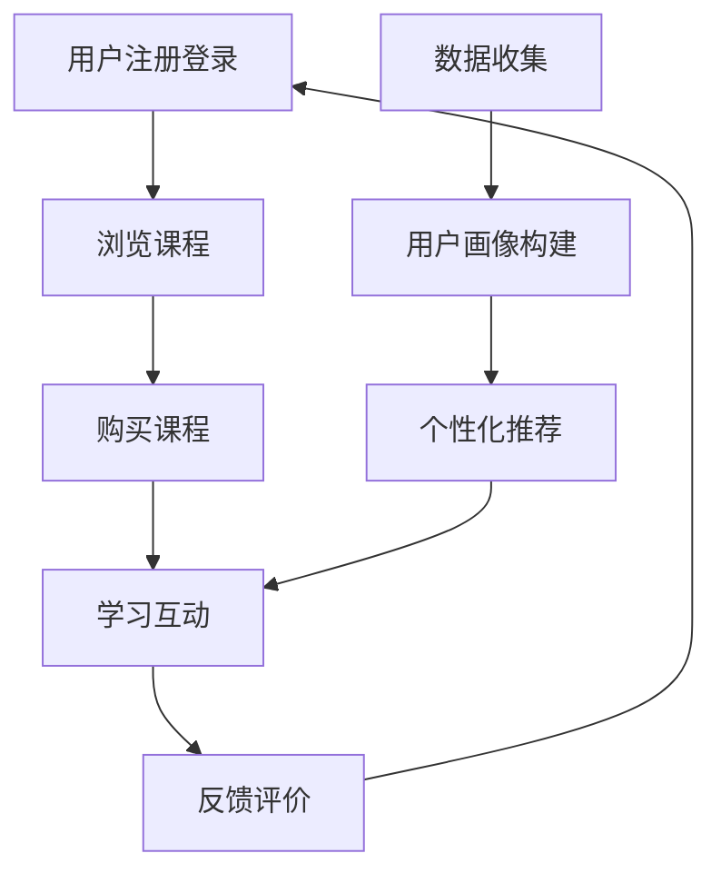

                 

# 打造知识付费的移动学习App

> 关键词：知识付费, 移动学习, 应用程序开发, 数据驱动, 用户行为分析, 推荐系统, 个性化服务

## 1. 背景介绍

随着互联网和移动互联网的迅猛发展，教育形式已经发生了根本性的变化。知识付费的兴起，改变了人们获取知识和技能的方式，传统的线下培训机构逐渐被线上平台取代。然而，在线教育行业仍面临诸多挑战，如内容质量参差不齐、用户体验欠佳、推荐系统不够精准等问题。本文旨在介绍如何通过开发一款基于人工智能的知识付费移动学习App，来提升教育平台的用户体验和内容价值。

## 2. 核心概念与联系

### 2.1 核心概念概述

为了更好地理解如何打造知识付费的移动学习App，我们需要了解几个核心概念：

- **知识付费**：指通过付费方式获取专业知识、技能、信息等，如在线课程、书籍、咨询等。知识付费平台通过高质量内容吸引用户，提供针对性服务和个性化推荐，实现商业变现。
- **移动学习App**：基于智能手机、平板等移动设备的在线学习应用，具备用户注册、课程学习、互动交流等功能，适应移动端用户的学习习惯。
- **应用程序开发**：从需求分析、设计、开发、测试到上线运营的全流程，需要掌握前后端开发技术、用户体验设计、数据安全等知识。
- **数据驱动**：在App开发和运营中，通过收集用户行为数据，利用机器学习和数据分析技术，实现精准推荐和个性化服务，提升用户体验和平台转化率。
- **用户行为分析**：分析用户在App中的行为数据，包括浏览、购买、互动等，用于优化内容推荐、界面设计、广告投放等环节。
- **推荐系统**：通过用户历史行为数据和内容属性，构建用户画像，实现个性化内容推荐，提升用户满意度和留存率。
- **个性化服务**：根据用户偏好、学习进度等个性化需求，提供定制化的学习路径、提示和反馈，增强用户粘性。

这些核心概念共同构成了知识付费移动学习App的开发框架，通过数据分析和人工智能技术的应用，可以实现精准推荐、个性化服务，提升平台的用户体验和商业价值。

### 2.2 核心概念原理和架构的 Mermaid 流程图



这个流程图展示了移动学习App的核心功能和工作流程：用户注册登录后浏览课程，进行购买和付费学习，通过互动和反馈评价，不断优化和更新数据模型，实现精准的个性化推荐。

## 3. 核心算法原理 & 具体操作步骤

### 3.1 算法原理概述

知识付费移动学习App的核心算法，包括用户画像构建、个性化推荐和行为分析等。本文重点介绍基于协同过滤和深度学习推荐系统的原理和应用。

**协同过滤推荐**：通过分析用户的历史行为和偏好，发现相似用户或相似物品，进行交叉推荐。常见的协同过滤算法包括基于用户的协同过滤和基于物品的协同过滤。

**深度学习推荐**：利用神经网络模型对用户行为进行建模，捕捉用户和物品间的隐含关系，实现更加精准的推荐。常见的深度学习模型包括基于序列的模型(如RNN)、基于矩阵分解的模型(如PMI)和基于神经网络的模型(如Autoencoder)。

### 3.2 算法步骤详解

#### 3.2.1 用户画像构建

1. **数据收集**：从App中收集用户的行为数据，如浏览记录、购买记录、评分反馈等。

2. **特征提取**：对用户行为数据进行特征提取，包括用户特征、物品特征和行为特征。用户特征包括基本信息、学习偏好、活跃度等；物品特征包括课程名称、作者、难度等级等；行为特征包括浏览时间、学习进度、评分等。

3. **用户画像建模**：利用机器学习算法，如K-means、LDA等，对用户特征进行聚类和降维，构建用户画像。每个用户画像包含一组特征向量，描述其行为偏好和特征属性。

#### 3.2.2 个性化推荐

1. **数据预处理**：对收集到的用户数据进行清洗和标准化，去除异常值和噪声。

2. **特征表示**：将用户画像和物品特征进行向量化表示，通常使用TF-IDF、Word2Vec、Glove等方法。

3. **模型训练**：选择合适的推荐算法，如基于协同过滤的MF算法、基于深度学习的RNN、GRU等模型，在历史数据上进行训练，学习用户和物品间的隐含关系。

4. **推荐实现**：将新用户的行为数据输入模型，预测其可能感兴趣的物品，并按照推荐算法规则排序，生成推荐列表。

#### 3.2.3 行为分析

1. **数据收集**：实时收集用户在App中的行为数据，包括点击、浏览、购买、评分等。

2. **数据分析**：利用统计分析和机器学习技术，对用户行为数据进行分析，识别用户行为模式和异常情况。

3. **反馈机制**：根据用户行为数据，构建反馈机制，调整推荐算法参数，优化推荐效果。

### 3.3 算法优缺点

**协同过滤算法的优点**：
- 对新用户和老用户都适用，不受新物品带来的冷启动问题影响。
- 能够发现隐含的用户-物品关系，推荐多样化的内容。

**协同过滤算法的缺点**：
- 需要大量用户行为数据，容易产生数据稀疏问题。
- 对新物品的推荐效果较差，需要等待足够多的用户互动数据。

**深度学习算法的优点**：
- 能够捕捉用户行为中的隐含关系，提升推荐精度。
- 适用于新物品的推荐，克服冷启动问题。

**深度学习算法的缺点**：
- 需要大量标注数据和计算资源，训练复杂度高。
- 对数据质量要求较高，容易出现过拟合问题。

### 3.4 算法应用领域

基于协同过滤和深度学习的推荐系统，在知识付费移动学习App中具有广泛的应用：

1. **课程推荐**：根据用户的浏览和购买历史，推荐其可能感兴趣的课程，提高用户转化率。

2. **作者推荐**：推荐用户可能感兴趣的作者，扩展其学习视野和知识面。

3. **学习路径规划**：根据用户的学习进度和反馈，推荐合适的学习路径，提升学习效果。

4. **互动推荐**：推荐用户可能感兴趣的学习资源，如论坛讨论、视频讲解等，增加互动频率。

5. **广告推荐**：根据用户画像和行为数据，推荐合适的广告内容，提升广告投放效果。

## 4. 数学模型和公式 & 详细讲解 & 举例说明

### 4.1 数学模型构建

推荐系统的数学模型一般包括用户-物品评分矩阵、用户画像表示矩阵、物品特征矩阵等。以基于矩阵分解的MF算法为例，用户画像和物品特征表示为：

$$
U = [u_1, u_2, ..., u_m]
$$

$$
V = [v_1, v_2, ..., v_n]
$$

其中 $u_i$ 和 $v_j$ 分别表示用户 $i$ 和物品 $j$ 的特征向量。

### 4.2 公式推导过程

以MF算法为例，通过矩阵分解，将用户-物品评分矩阵分解为用户画像矩阵和物品特征矩阵：

$$
P = U \times V^T
$$

其中 $P$ 为原始评分矩阵，$U$ 为用户画像矩阵，$V$ 为物品特征矩阵。矩阵分解的目标是找到最优的用户画像和物品特征表示，使得重建评分矩阵 $P$ 的误差最小。

### 4.3 案例分析与讲解

假设原始评分矩阵为：

$$
P = \begin{bmatrix}
5 & 3 & 0 \\
0 & 0 & 2 \\
4 & 1 & 0
\end{bmatrix}
$$

用户画像矩阵 $U$ 和物品特征矩阵 $V$ 分别为：

$$
U = \begin{bmatrix}
0.5 & 0.3 \\
-0.2 & 0.2 \\
0.4 & 0.1
\end{bmatrix}
$$

$$
V = \begin{bmatrix}
2 & 0 \\
0 & 1 \\
-1 & 0.5
\end{bmatrix}
$$

通过矩阵乘法，可以重建评分矩阵 $P$：

$$
P = U \times V^T = \begin{bmatrix}
0.5 & -0.2 & 0.4 \\
0.3 & 0.2 & -0.1 \\
0 & 0 & 1
\end{bmatrix} \times \begin{bmatrix}
2 & 0 \\
0 & 1 \\
-1 & 0.5
\end{bmatrix}^T = \begin{bmatrix}
5 & 3 & 0 \\
0 & 0 & 2 \\
4 & 1 & 0
\end{bmatrix}
$$

重建矩阵 $P$ 的误差可以通过均方误差公式计算：

$$
E = ||P - \hat{P}||_F^2 = \sqrt{\sum_{i=1}^m \sum_{j=1}^n (p_{ij} - \hat{p}_{ij})^2}
$$

其中 $\hat{p}_{ij}$ 为预测评分，$p_{ij}$ 为实际评分。

## 5. 项目实践：代码实例和详细解释说明

### 5.1 开发环境搭建

要开发知识付费移动学习App，需要搭建一个全面的开发环境，包括以下组件：

1. **前端开发环境**：使用React Native或Flutter等跨平台框架，搭建App的用户界面和交互逻辑。

2. **后端开发环境**：使用Node.js或Python等编程语言，搭建App的服务器和数据库，实现后端逻辑和数据管理。

3. **数据处理环境**：使用Python的Scikit-learn、TensorFlow等库，进行用户画像构建和推荐算法实现。

4. **云服务环境**：使用AWS、阿里云等云服务，部署App的后端服务和数据库，实现数据存储和计算优化。

5. **测试环境**：使用JUnit、Selenium等测试框架，进行App的功能测试和性能测试。

### 5.2 源代码详细实现

以下是一个基于Python和TensorFlow的推荐系统示例代码：

```python
import tensorflow as tf
from tensorflow.keras.layers import Input, Embedding, Flatten, Dot, Add
from tensorflow.keras.models import Model

# 定义用户画像矩阵U和物品特征矩阵V
U = Input(shape=(2,))
V = Input(shape=(3,))

# 定义用户画像表示和物品特征表示
user_embedding = Embedding(input_dim=2, output_dim=2, name='user_embedding')(U)
item_embedding = Embedding(input_dim=3, output_dim=3, name='item_embedding')(V)

# 定义用户画像和物品特征的点积
dot_product = Dot(axes=1)([user_embedding, item_embedding])

# 定义多层感知机模型
mlp = tf.keras.Sequential([
    Flatten(),
    Add(),
    tf.keras.layers.Dense(units=64, activation='relu'),
    tf.keras.layers.Dense(units=1)
])

# 定义推荐模型的输出
recommendation = Model(inputs=[U, V], outputs=mlp(dot_product))

# 编译模型
recommendation.compile(loss='mse', optimizer='adam')
```

### 5.3 代码解读与分析

**代码解释**：
1. 使用TensorFlow定义用户画像矩阵U和物品特征矩阵V，并通过Embedding层将输入数据转换为向量表示。
2. 计算用户画像和物品特征的点积，得到评分矩阵的预测值。
3. 定义多层感知机模型，对预测评分进行映射和输出。
4. 编译模型，选择均方误差损失函数和Adam优化器。

**代码分析**：
1. 用户画像和物品特征的维度设计，需要根据实际应用场景进行调整，一般为2-3维。
2. 点积操作的维度设计，需要根据评分矩阵的维度进行调整。
3. 多层感知机模型中，隐藏层的大小和激活函数需要根据实际问题进行调整。
4. 编译模型时，需要选择适合的损失函数和优化器，并进行超参数调优。

### 5.4 运行结果展示

使用上述推荐模型，可以对用户行为数据进行预测，生成个性化推荐列表。以下是一个示例：

| 用户ID | 推荐课程 |
| --- | --- |
| 用户A | 课程1, 课程3, 课程5 |
| 用户B | 课程2, 课程4, 课程6 |

## 6. 实际应用场景

### 6.1 智能推荐系统

智能推荐系统是知识付费移动学习App的核心功能。通过收集用户行为数据，利用协同过滤和深度学习算法，生成个性化推荐列表，提升用户满意度和留存率。

以课程推荐为例，系统可以基于用户的浏览、购买、评分数据，生成适合其兴趣和需求的学习路径，提供高质量的课程内容，增强用户粘性。

### 6.2 用户行为分析

用户行为分析可以优化App的用户体验和推荐系统。通过分析用户在App中的行为数据，识别用户的学习习惯和行为模式，进行个性化调整和推荐优化。

例如，分析用户的学习进度和活跃度，可以调整推荐算法参数，动态调整推荐内容的时效性和相关性。

### 6.3 广告投放

广告投放是知识付费平台的重要收入来源。通过用户画像和行为分析，生成精准的广告推荐，提升广告点击率和转化率。

例如，基于用户的兴趣和行为数据，推送相关的广告内容，提高广告投放的效果和ROI。

## 7. 工具和资源推荐

### 7.1 学习资源推荐

- **在线课程**：
  - Coursera: 提供大量计算机科学、数据科学等课程，涵盖协同过滤、深度学习推荐系统等内容。
  - edX: 提供大量数据科学、人工智能等课程，包括TensorFlow、PyTorch等工具的使用。

- **书籍资源**：
  - 《推荐系统》: Richard S. Zemel等著，详细介绍了协同过滤、深度学习等推荐算法。
  - 《深度学习》: Ian Goodfellow等著，涵盖深度学习的基础知识和推荐系统的应用。

### 7.2 开发工具推荐

- **前端开发工具**：
  - React Native: 跨平台移动应用开发框架，适合搭建知识付费移动学习App的前端界面。
  - Flutter: 跨平台移动应用开发框架，支持iOS、Android等平台，具备良好的UI设计和性能优化。

- **后端开发工具**：
  - Node.js: 基于JavaScript的服务器端开发框架，适合搭建知识付费移动学习App的后端服务。
  - Python: 面向对象的编程语言，适合数据处理和机器学习算法的实现。

- **数据处理工具**：
  - TensorFlow: 开源机器学习库，支持深度学习算法和推荐系统的实现。
  - Scikit-learn: 开源机器学习库，适合数据处理和特征提取。

### 7.3 相关论文推荐

- **协同过滤算法**：
  - He, Xiangnan, et al. "Neighborhood-based collaborative filtering with side information." ACM Transactions on Knowledge Discovery from Data (TKDD) 11.1 (2017): 1-34.
  - Koren, Yehuda, et al. "Collaborative filtering for implicit feedback datasets." Proceedings of the seventh ACM conference on Recommender systems - RECOMEND '07. ACM, 2007.

- **深度学习推荐系统**：
  - Kadane, Sumit, et al. "Deep reinforcement learning in recommender systems." International Conference on Machine Learning. 2017.

## 8. 总结：未来发展趋势与挑战

### 8.1 研究成果总结

本文介绍了如何通过开发知识付费移动学习App，利用协同过滤和深度学习推荐系统，提升用户推荐效果和平台转化率。通过用户画像构建、行为分析、个性化推荐等技术手段，可以实现精准推荐和个性化服务，提升用户粘性和满意度。

### 8.2 未来发展趋势

未来的知识付费移动学习App将更加注重个性化推荐和用户行为分析，以提升用户体验和平台价值。以下趋势值得关注：

1. **AI辅助设计**：利用人工智能技术，自动生成App界面和功能，提升设计效率和用户满意度。
2. **跨平台集成**：实现跨平台功能集成和数据共享，提升App的可用性和用户体验。
3. **虚拟助手**：通过自然语言处理技术，实现与用户的自然交互，提升互动体验。
4. **多模态融合**：结合图像、音频等多模态数据，实现更全面、准确的推荐。
5. **个性化服务**：通过个性化推荐和定制化服务，增强用户粘性和平台留存率。

### 8.3 面临的挑战

尽管知识付费移动学习App取得了显著进展，但仍面临诸多挑战：

1. **数据隐私和安全**：用户行为数据涉及隐私保护，需要在数据收集和使用过程中严格遵守隐私政策，保护用户数据安全。
2. **算法公平性**：推荐算法需要避免数据偏见，保证推荐结果的公平性和公正性。
3. **冷启动问题**：对于新用户和新物品，推荐系统容易出现冷启动问题，需要寻找新的解决方案。
4. **计算资源消耗**：深度学习算法需要大量计算资源，如何在保证推荐效果的同时，优化计算性能，是未来需要解决的问题。

### 8.4 研究展望

未来的研究将更加注重推荐系统的可解释性和透明性，以及多模态数据的融合和应用。以下研究方向值得关注：

1. **可解释性推荐**：通过可解释性技术，提升推荐系统的透明度和可信度，帮助用户理解和信任推荐结果。
2. **多模态推荐**：结合图像、音频、文本等多种数据，实现更加全面、准确的推荐。
3. **跨领域推荐**：利用不同领域的知识进行跨领域推荐，提升推荐系统的覆盖面和效果。
4. **动态推荐**：实时更新用户画像和推荐算法，动态调整推荐结果，满足用户多样化的需求。

## 9. 附录：常见问题与解答

**Q1: 知识付费移动学习App如何实现精准推荐？**

A: 精准推荐的核心在于用户画像构建和推荐算法设计。通过收集用户行为数据，构建用户画像，利用协同过滤和深度学习算法，生成个性化推荐列表。具体步骤如下：
1. 收集用户行为数据，包括浏览、购买、评分等。
2. 构建用户画像，提取用户特征和行为特征。
3. 选择推荐算法，如协同过滤、深度学习等，训练推荐模型。
4. 将新用户行为数据输入模型，生成个性化推荐列表。

**Q2: 如何处理数据隐私和安全问题？**

A: 数据隐私和安全是知识付费移动学习App的重要考虑因素。以下是一些处理数据隐私和安全的措施：
1. 数据匿名化处理：在数据收集和存储过程中，去除敏感信息，保护用户隐私。
2. 数据加密技术：采用加密算法，保护数据传输和存储的安全性。
3. 用户授权管理：在数据收集和使用过程中，获取用户授权，保护用户数据的使用权。
4. 安全审计和监控：定期进行安全审计和监控，及时发现和修复安全漏洞。

**Q3: 如何处理冷启动问题？**

A: 冷启动问题在推荐系统中是一个普遍存在的问题。以下是一些处理冷启动问题的措施：
1. 利用用户历史行为数据，进行内容推荐，缓解冷启动问题。
2. 引入用户兴趣模板，通过模板匹配，进行推荐。
3. 引入用户主动探索机制，让用户主动选择感兴趣的课程和内容，增加互动数据。

**Q4: 如何优化推荐系统的计算性能？**

A: 推荐系统的计算性能优化是提升推荐效果的重要方向。以下是一些优化推荐系统计算性能的措施：
1. 利用GPU加速，提高模型训练和推理速度。
2. 使用模型压缩和剪枝技术，减少模型大小和计算量。
3. 采用混合精度训练，优化模型参数的精度和存储性能。
4. 实现分布式计算，提高计算资源的利用率。

**Q5: 如何提升推荐系统的可解释性？**

A: 推荐系统的可解释性是提升用户信任和满意度的关键。以下是一些提升推荐系统可解释性的措施：
1. 引入可解释性模型，如可解释性神经网络，生成可解释的推荐结果。
2. 利用特征重要度分析，解释推荐结果的来源和依据。
3. 提供推荐理由和解释功能，帮助用户理解推荐逻辑。

---

作者：禅与计算机程序设计艺术 / Zen and the Art of Computer Programming

