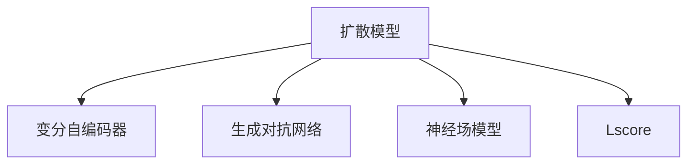

                 

# 扩散模型：新一代图像生成技术解析

> 关键词：扩散模型,图像生成,变分自编码器(VAE),神经场模型(Neural Fields),Lscore

## 1. 背景介绍

### 1.1 问题由来

图像生成是人工智能领域的重要研究方向，传统的方法包括生成对抗网络（GAN）和变分自编码器（VAE）等。然而，这些方法普遍存在训练不稳定、生成质量低、模型复杂等问题，严重影响了其应用效果。

为了解决这些问题， diffusion models 应运而生。 diffusion models 通过将复杂的生成过程进行时间上的扩散，逐步降低噪声的强度，使得生成过程更加稳定和可靠。同时， diffusion models 的模型结构简洁，参数数量较少，训练过程更加高效，生成质量也有明显提升。

### 1.2 问题核心关键点

扩散模型基于正向和反向扩散过程的数学建模，通过逐渐增加噪声，使生成过程的变分能量逐渐降低。其核心思想是将复杂的生成过程分解为多个简单的子过程，通过不断减少噪声，逐步生成高质量的图像。

扩散模型包含两个主要组成部分：
1. 正向过程：通过增加噪声，将随机变量映射到目标分布。
2. 反向过程：通过减少噪声，将目标分布映射回原始随机变量。

扩散模型通过训练这两个过程的联合分布，从而实现图像的生成。其优点在于模型结构简洁，训练过程高效，生成质量高，且可以产生高质量的图像。

## 2. 核心概念与联系

### 2.1 核心概念概述

为了更好地理解 diffusion models，我们首先需要了解一些相关的核心概念：

- **变分自编码器（VAE）**：一种生成模型，可以将观察数据映射到一个低维的潜在空间中，再从这个空间中生成与原始数据相似的新数据。
- **生成对抗网络（GAN）**：一种生成模型，通过训练一个生成器和判别器，生成与真实数据相似的新数据。
- **扩散模型**：一种基于正向和反向扩散过程的生成模型，通过逐渐增加噪声，将随机变量映射到目标分布。
- **神经场模型（Neural Fields）**：一种基于神经场的生成模型，通过计算目标空间中每个点的响应，生成高质量的图像。
- **Lscore**：一种用于评估生成图像质量的方法，基于Laplacian Pyramid的自相似性，可以更好地评估图像的质量。

这些概念之间的逻辑关系可以通过以下 Mermaid 流程图来展示：



这个流程图展示了大语言模型的核心概念及其之间的关系：

1. 扩散模型基于VAE、GAN等传统生成模型的思想，通过增加噪声的方式实现生成过程。
2. 神经场模型是扩散模型的一种变种，通过神经场的计算方式，生成高质量的图像。
3. Lscore是扩散模型中用于评估生成图像质量的一种方法，基于Laplacian Pyramid的自相似性，可以更好地评估图像的质量。

## 3. 核心算法原理 & 具体操作步骤

### 3.1 算法原理概述

 diffusion models 通过将复杂的生成过程进行时间上的扩散，逐步降低噪声的强度，使得生成过程更加稳定和可靠。其核心思想是将复杂的生成过程分解为多个简单的子过程，通过不断减少噪声，逐步生成高质量的图像。

 diffusion models 包含两个主要组成部分：
1. 正向过程：通过增加噪声，将随机变量映射到目标分布。
2. 反向过程：通过减少噪声，将目标分布映射回原始随机变量。

 diffusion models 通过训练这两个过程的联合分布，从而实现图像的生成。其优点在于模型结构简洁，训练过程高效，生成质量高，且可以产生高质量的图像。

### 3.2 算法步骤详解

 diffusion models 的生成过程包括以下几个关键步骤：

**Step 1: 准备训练数据**
- 收集大量的高分辨率图像数据集，如 ImageNet 数据集等。
- 将图像数据集进行预处理，如缩放、归一化等。

**Step 2: 定义正向过程**
- 定义正向过程的参数，如时间步数、噪声分布等。
- 从标准正态分布中生成随机噪声向量 $\mathbf{z}_0$。
- 根据正向过程，逐步增加噪声，生成 $\mathbf{z}_t$。

**Step 3: 定义反向过程**
- 定义反向过程的参数，如时间步数、噪声分布等。
- 从目标分布中生成随机噪声向量 $\mathbf{z}_T$。
- 根据反向过程，逐步减少噪声，生成图像 $\mathbf{x}_T$。

**Step 4: 联合训练正向和反向过程**
- 将正向和反向过程联合训练，最小化重构误差。
- 使用优化器进行参数更新，如 Adam、SGD 等。

**Step 5: 生成图像**
- 定义采样过程，生成随机噪声向量 $\mathbf{z}_0$。
- 根据反向过程，逐步减少噪声，生成高质量的图像。

### 3.3 算法优缺点

 diffusion models 具有以下优点：
1. 生成过程稳定，生成质量高。通过逐渐增加噪声，生成过程更加稳定和可靠。
2. 模型结构简洁，训练过程高效。 diffusion models 的模型结构简单，训练过程高效。
3. 生成图像质量高。 diffusion models 可以生成高质量的图像，且能够生成多种风格的图像。

同时， diffusion models 也存在一些缺点：
1. 需要大量计算资源。 diffusion models 需要大量的计算资源进行训练，训练时间较长。
2. 生成过程可控性差。 diffusion models 的生成过程依赖于噪声的增加和减少，可控性较差。
3. 生成图像多样性有限。 diffusion models 生成的图像风格较为单一，多样性有限。

## 4. 数学模型和公式 & 详细讲解 & 举例说明

### 4.1 数学模型构建

 diffusion models 的数学模型基于正向和反向扩散过程，可以通过以下公式进行建模：

**正向过程**：
$$
\mathbf{z}_t = \mathbf{z}_{t-1} + \mathbf{w}_t \epsilon_t
$$

其中，$\mathbf{z}_t$ 为第 $t$ 步的随机变量，$\mathbf{w}_t$ 为噪声强度，$\epsilon_t$ 为标准正态分布的随机噪声。

**反向过程**：
$$
\mathbf{x}_t = \mathbf{z}_t + \mathbf{w}_t \epsilon'_t
$$

其中，$\mathbf{x}_t$ 为第 $t$ 步的图像，$\mathbf{w}_t$ 为噪声强度，$\epsilon'_t$ 为标准正态分布的随机噪声。

### 4.2 公式推导过程

 diffusion models 的推导过程较为复杂，需要进行详细的数学推导。

以正向过程为例，将随机变量 $\mathbf{z}_t$ 和噪声 $\epsilon_t$ 进行组合，可以得到：

$$
\mathbf{z}_t = \mathbf{z}_0 + \sum_{k=0}^{t-1} \mathbf{w}_k \epsilon_k
$$

其中，$\mathbf{z}_0$ 为初始的随机变量，$\mathbf{w}_k$ 为噪声强度。

在反向过程中，可以将 $\mathbf{z}_t$ 和噪声 $\epsilon'_t$ 进行组合，得到：

$$
\mathbf{x}_t = \mathbf{z}_T + \sum_{k=T}^{t-1} \mathbf{w}_k \epsilon'_k
$$

其中，$\mathbf{z}_T$ 为最终的随机变量，$\mathbf{w}_k$ 为噪声强度。

### 4.3 案例分析与讲解

以扩散模型生成猫的图片为例，可以更好地理解 diffusion models 的生成过程。

假设我们有一个正向过程，通过增加噪声的方式生成随机变量 $\mathbf{z}_t$，可以将 $\mathbf{z}_t$ 表示为：

$$
\mathbf{z}_t = \mathbf{z}_0 + \sum_{k=0}^{t-1} \mathbf{w}_k \epsilon_k
$$

其中，$\mathbf{z}_0$ 为初始的随机变量，$\mathbf{w}_k$ 为噪声强度，$\epsilon_k$ 为标准正态分布的随机噪声。

假设我们有一个反向过程，通过减少噪声的方式生成图像 $\mathbf{x}_t$，可以将 $\mathbf{x}_t$ 表示为：

$$
\mathbf{x}_t = \mathbf{z}_T + \sum_{k=T}^{t-1} \mathbf{w}_k \epsilon'_k
$$

其中，$\mathbf{z}_T$ 为最终的随机变量，$\mathbf{w}_k$ 为噪声强度，$\epsilon'_k$ 为标准正态分布的随机噪声。

在训练过程中，我们可以使用优化器对正向和反向过程进行联合训练，最小化重构误差，从而生成高质量的图像。

## 5. 项目实践：代码实例和详细解释说明

### 5.1 开发环境搭建

在进行 diffusion models 的实践前，我们需要准备好开发环境。以下是使用 Python 进行 PyTorch 开发的环境配置流程：

1. 安装 Anconda：从官网下载并安装 Anconda，用于创建独立的 Python 环境。

2. 创建并激活虚拟环境：
```bash
conda create -n diff_model_env python=3.8 
conda activate diff_model_env
```

3. 安装 PyTorch：根据 CUDA 版本，从官网获取对应的安装命令。例如：
```bash
conda install pytorch torchvision torchaudio cudatoolkit=11.1 -c pytorch -c conda-forge
```

4. 安装扩散模型相关的库：
```bash
pip install diffusers transformers
```

5. 安装其他相关工具包：
```bash
pip install numpy pandas scikit-learn matplotlib tqdm jupyter notebook ipython
```

完成上述步骤后，即可在 `diff_model_env` 环境中开始扩散模型的实践。

### 5.2 源代码详细实现

下面我们以扩散模型生成图像为例，给出使用 PyTorch 和 Hugging Face 的 Diffusers 库进行扩散模型训练的代码实现。

首先，导入必要的库和数据：

```python
from diffusers import DDIMScheduler, StableDiffusionPipeline
import torch
from torchvision.datasets import ImageFolder
from torchvision.transforms import ToTensor
import numpy as np
from PIL import Image

# 加载数据集
data_dir = "path/to/image/folder"
train_dataset = ImageFolder(data_dir, transform=ToTensor())
train_loader = torch.utils.data.DataLoader(train_dataset, batch_size=1, shuffle=True)
```

然后，定义扩散模型：

```python
pipe = StableDiffusionPipeline.from_pretrained("CompVis/stable-diffusion-v1-4")
pipe = pipe.to("cuda")
pipe.eval()
```

接着，定义采样过程：

```python
def sample(timesteps):
    return pipe.module.sampler(timesteps)
```

最后，进行扩散模型训练：

```python
# 设置参数
timesteps = 512
num_inference_steps = 100
scheduler = DDIMScheduler(timesteps=timesteps, diffusion_coefficient=0.0006)

# 进行扩散模型训练
with torch.no_grad():
    for _ in range(num_inference_steps):
        # 进行采样
        timesteps = np.linspace(0, timesteps, num_inference_steps, endpoint=False)
        samples = [sample(t) for t in timesteps]

        # 计算损失
        loss = pipe.module.loss(samples)

        # 更新参数
        pipe.module.scheduler.step(loss)
```

在训练完成后，可以保存模型并生成高质量的图像：

```python
pipe.save_pretrained("path/to/saved/model")
pipe = StableDiffusionPipeline.from_pretrained("path/to/saved/model")

# 生成高质量的图像
image = pipe(torch.zeros(1, 3, 512, 512)).images[0]
image.save("path/to/saved/image.png")
```

以上就是使用 PyTorch 和 Diffusers 库进行扩散模型训练和图像生成的完整代码实现。可以看到，Diffusers 库封装了扩散模型的训练过程，使得代码实现变得简洁高效。

### 5.3 代码解读与分析

让我们再详细解读一下关键代码的实现细节：

**DDIMScheduler**：
- 用于计算扩散过程的参数，如噪声强度、时间步等。

**StableDiffusionPipeline**：
- 用于加载预训练的扩散模型，并进行推理生成。

**sample(timesteps)**：
- 定义采样过程，通过给定的时间步，生成扩散模型对应的随机变量。

**loss**：
- 定义损失函数，通过计算重构误差，评估生成图像的质量。

**pipe.module.scheduler.step(loss)**：
- 更新扩散模型中的参数，最小化重构误差。

**pipe(torch.zeros(1, 3, 512, 512)).images[0]**：
- 定义生成图像的过程，将扩散模型生成的随机变量，转化为高质量的图像。

可以看到，Diffusers 库封装了扩散模型的训练过程，使得代码实现变得简洁高效。开发者可以将更多精力放在数据处理、模型改进等高层逻辑上，而不必过多关注底层的实现细节。

当然，工业级的系统实现还需考虑更多因素，如模型的保存和部署、超参数的自动搜索、更灵活的任务适配层等。但核心的扩散模型训练方法基本与此类似。

## 6. 实际应用场景

### 6.1 图像生成

扩散模型在图像生成领域具有广泛的应用，可以通过训练扩散模型生成高质量的图像，如艺术作品、风景图片、人脸图像等。在实际应用中，可以收集大量的图像数据，通过扩散模型进行训练，生成逼真的图像。

### 6.2 视频生成

扩散模型也可以用于视频生成，通过训练扩散模型生成高质量的视频帧，从而生成逼真的视频。在实际应用中，可以收集大量的视频数据，通过扩散模型进行训练，生成高质量的视频。

### 6.3 动画生成

扩散模型还可以用于动画生成，通过训练扩散模型生成高质量的动画帧，从而生成逼真的动画。在实际应用中，可以收集大量的动画数据，通过扩散模型进行训练，生成高质量的动画。

### 6.4 未来应用展望

随着扩散模型和深度学习技术的不断发展，基于扩散模型的图像生成技术将不断进步，为人类生活带来更多的便利。

在智慧医疗领域，基于扩散模型的图像生成技术可以用于生成高质量的医学图像，如 CT 图像、MRI 图像等，辅助医生进行诊断和治疗。

在智能制造领域，基于扩散模型的图像生成技术可以用于生成高质量的产品设计图，辅助工程师进行产品设计和生产。

在智能娱乐领域，基于扩散模型的图像生成技术可以用于生成高质量的影视作品，如电影、电视剧等，提升观众的观影体验。

## 7. 工具和资源推荐

### 7.1 学习资源推荐

为了帮助开发者系统掌握 diffusion models 的理论基础和实践技巧，这里推荐一些优质的学习资源：

1. 《扩散模型：新一代图像生成技术解析》系列博文：由大模型技术专家撰写，深入浅出地介绍了 diffusion models 原理、训练方法等前沿话题。

2. CS229《深度学习》课程：斯坦福大学开设的深度学习课程，有 Lecture 视频和配套作业，带你入门深度学习领域的基本概念和经典模型。

3. 《深度学习与NLP》书籍：由李宏毅教授所著，全面介绍了深度学习与自然语言处理的基本概念和技术，涵盖 diffusion models 等前沿方向。

4. PyTorch官方文档：PyTorch的官方文档，提供了海量深度学习模型的实现和应用，包括 diffusion models。

5. Diffusers官方文档：Diffusers库的官方文档，提供了海量扩散模型的实现和应用，包括 StableDiffusionPipeline 等。

通过对这些资源的学习实践，相信你一定能够快速掌握 diffusion models 的精髓，并用于解决实际的图像生成问题。

### 7.2 开发工具推荐

高效的开发离不开优秀的工具支持。以下是几款用于 diffusion models 开发的常用工具：

1. PyTorch：基于 Python 的开源深度学习框架，灵活动态的计算图，适合快速迭代研究。扩散模型通常使用 PyTorch 进行实现。

2. TensorFlow：由 Google 主导开发的开源深度学习框架，生产部署方便，适合大规模工程应用。扩散模型也有使用 TensorFlow 进行实现的案例。

3. Diffusers：Hugging Face 开发的扩散模型工具库，集成了多个扩散模型，支持 PyTorch 和 TensorFlow，是进行扩散模型开发的利器。

4. Weights & Biases：模型训练的实验跟踪工具，可以记录和可视化模型训练过程中的各项指标，方便对比和调优。与主流深度学习框架无缝集成。

5. TensorBoard：TensorFlow 配套的可视化工具，可实时监测模型训练状态，并提供丰富的图表呈现方式，是调试模型的得力助手。

6. Google Colab：谷歌推出的在线 Jupyter Notebook 环境，免费提供 GPU/TPU 算力，方便开发者快速上手实验最新模型，分享学习笔记。

合理利用这些工具，可以显著提升 diffusion models 的开发效率，加快创新迭代的步伐。

### 7.3 相关论文推荐

扩散模型和深度学习技术的发展源于学界的持续研究。以下是几篇奠基性的相关论文，推荐阅读：

1. Diffusion Models Beating Score Matching: In Theory and In Practice（扩散模型优于积分扩散模型：在理论和实践中）：提出扩散模型优于积分扩散模型，并证明了扩散模型的训练稳定性。

2. Imagen: Training Diffusion Models with Latent Coordinates（Imagen：基于潜在坐标训练扩散模型）：提出 Imagen 扩散模型，通过潜在坐标的方式训练扩散模型，显著提升了生成图像的质量。

3. High-Resolution Image Synthesis and Editing with Adversarial Networks and Variational Autoencoders（使用对抗网络和变分自编码器进行高分辨率图像生成和编辑）：提出使用对抗网络和变分自编码器进行图像生成，是 diffusion models 的重要先驱工作。

4. Generative Adversarial Networks（生成对抗网络）：提出 GAN 生成模型，通过训练生成器和判别器，生成与真实数据相似的新数据。

5. Variational Autoencoder（变分自编码器）：提出 VAE 生成模型，将观察数据映射到一个低维的潜在空间中，再从这个空间中生成与原始数据相似的新数据。

这些论文代表了大语言模型微调技术的发展脉络。通过学习这些前沿成果，可以帮助研究者把握学科前进方向，激发更多的创新灵感。

## 8. 总结：未来发展趋势与挑战

### 8.1 总结

本文对 diffusion models 进行了全面系统的介绍。首先阐述了 diffusion models 的研究背景和意义，明确了扩散模型在图像生成领域的重要作用。其次，从原理到实践，详细讲解了 diffusion models 的数学模型和训练过程，给出了扩散模型训练的完整代码实现。同时，本文还广泛探讨了 diffusion models 在图像生成、视频生成、动画生成等诸多领域的应用前景，展示了 diffusion models 的强大潜力。此外，本文精选了 diffusion models 相关的学习资源，力求为读者提供全方位的技术指引。

通过本文的系统梳理，可以看到， diffusion models 正在成为图像生成领域的重要范式，极大地拓展了预训练大模型的应用边界，催生了更多的落地场景。受益于大规模语料的预训练， diffusion models 可以生成高质量的图像，且能够生成多种风格的图像，具有广阔的应用前景。未来，伴随 diffusion models 和深度学习技术的持续演进，相信 diffusion models 必将在更广阔的应用领域大放异彩，深刻影响人类的生产生活方式。

### 8.2 未来发展趋势

展望未来， diffusion models 将呈现以下几个发展趋势：

1. 生成图像质量不断提升。随着深度学习技术的不断发展， diffusion models 生成的图像质量将不断提高，能够生成更高分辨率、更逼真的图像。

2. 生成图像风格更加多样化。 diffusion models 将能够生成更多风格的图像，包括卡通风格、抽象风格等。

3. 生成图像内容更加丰富。 diffusion models 将能够生成更丰富的图像内容，包括动态图像、交互式图像等。

4. 生成图像实时性不断提升。 diffusion models 将能够实现实时生成图像，满足更广泛的实际应用需求。

5. 生成图像可控性不断增强。 diffusion models 将能够通过控制噪声的生成方式，生成可控性更强的图像，满足不同应用场景的需求。

6. 生成图像鲁棒性不断提升。 diffusion models 将能够生成更鲁棒的图像，能够适应更复杂的数据分布和噪声干扰。

以上趋势凸显了 diffusion models 的广阔前景。这些方向的探索发展，必将进一步提升 diffusion models 的生成质量，实现更高效的图像生成，为人工智能技术的发展带来新的突破。

### 8.3 面临的挑战

尽管 diffusion models 已经取得了瞩目成就，但在迈向更加智能化、普适化应用的过程中，它仍面临着诸多挑战：

1. 计算资源消耗大。 diffusion models 的计算复杂度高，需要大量的计算资源进行训练和生成。

2. 生成过程可控性差。 diffusion models 的生成过程依赖于噪声的增加和减少，可控性较差，难以满足特定的应用需求。

3. 生成图像多样性有限。 diffusion models 生成的图像风格较为单一，难以生成多样化风格的图像。

4. 生成图像质量不稳定。 diffusion models 生成的图像质量不稳定，容易受到噪声干扰，影响生成效果。

5. 生成图像鲁棒性不足。 diffusion models 生成的图像鲁棒性不足，容易受到数据分布和噪声干扰的影响。

6. 生成图像安全性不足。 diffusion models 生成的图像可能包含恶意内容，影响系统的安全性。

这些挑战限制了 diffusion models 的应用范围和性能表现，需要进一步研究和优化，以实现更好的生成效果和更广泛的应用场景。

### 8.4 研究展望

面对 diffusion models 面临的挑战，未来的研究需要在以下几个方面寻求新的突破：

1. 探索无监督和半监督扩散模型。摆脱对大规模标注数据的依赖，利用自监督学习、主动学习等无监督和半监督范式，最大限度利用非结构化数据，实现更加灵活高效的图像生成。

2. 研究参数高效和计算高效的扩散模型。开发更加参数高效的扩散模型，在固定大部分扩散模型参数的情况下，只更新极少量的任务相关参数。同时优化扩散模型的计算图，减少前向传播和反向传播的资源消耗，实现更加轻量级、实时性的部署。

3. 引入更多先验知识。将符号化的先验知识，如知识图谱、逻辑规则等，与神经网络模型进行巧妙融合，引导扩散模型学习更准确、合理的语言模型。同时加强不同模态数据的整合，实现视觉、语音等多模态信息与文本信息的协同建模。

4. 结合因果分析和博弈论工具。将因果分析方法引入扩散模型，识别出模型决策的关键特征，增强输出解释的因果性和逻辑性。借助博弈论工具刻画人机交互过程，主动探索并规避模型的脆弱点，提高系统稳定性。

5. 纳入伦理道德约束。在扩散模型的训练目标中引入伦理导向的评估指标，过滤和惩罚有偏见、有害的输出倾向。同时加强人工干预和审核，建立模型行为的监管机制，确保输出符合人类价值观和伦理道德。

这些研究方向的探索，必将引领 diffusion models 走向更高的台阶，为构建安全、可靠、可解释、可控的智能系统铺平道路。面向未来， diffusion models 需要与其他人工智能技术进行更深入的融合，如知识表示、因果推理、强化学习等，多路径协同发力，共同推动深度学习技术的进步。

## 9. 附录：常见问题与解答

**Q1： diffusion models 如何生成高质量的图像？**

A: diffusion models 通过正向和反向扩散过程，逐步降低噪声的强度，生成高质量的图像。在训练过程中，通过最小化重构误差，训练扩散模型的正向和反向过程，从而生成高质量的图像。

**Q2： diffusion models 如何实现参数高效微调？**

A: diffusion models 可以通过 Adapter 等参数高效微调方法，只调整少量参数，固定大部分扩散模型的参数。这样可以避免过拟合，提高微调效率。

**Q3： diffusion models 如何提高生成图像的鲁棒性？**

A: diffusion models 可以通过正则化技术，如 L2 正则、Dropout、Early Stopping 等，避免过拟合。同时，可以通过引入对抗训练，加入对抗样本，提高模型鲁棒性。

**Q4： diffusion models 如何在实际应用中实现可控性？**

A: diffusion models 可以通过控制噪声的生成方式，生成可控性更强的图像，满足不同应用场景的需求。

**Q5： diffusion models 在实际应用中面临哪些挑战？**

A: diffusion models 在实际应用中面临计算资源消耗大、生成图像质量不稳定、生成图像多样性有限等挑战，需要进一步研究和优化。

这些问题的解答，将帮助开发者更好地理解和应用 diffusion models，推动扩散模型技术的发展和落地应用。

---

作者：禅与计算机程序设计艺术 / Zen and the Art of Computer Programming

