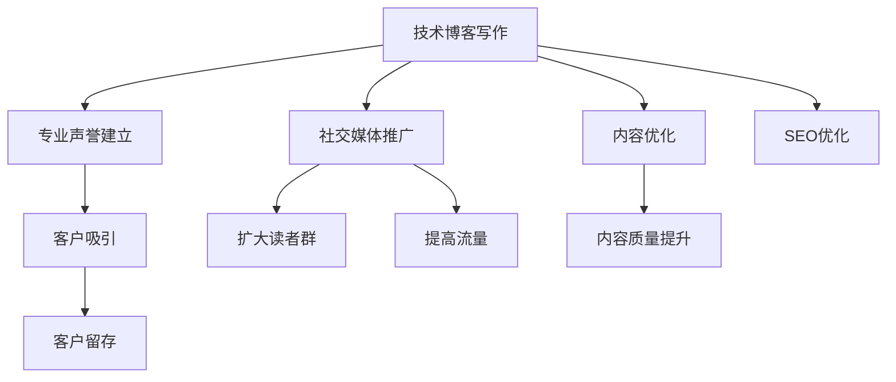

                 

# 技术博客写作：建立专业声誉和吸引客户

> 关键词：博客写作, 专业声誉, 客户吸引, 技术内容, 写作技巧, 营销策略

## 1. 背景介绍

在数字化时代，技术博客已经成为了技术人员展示专业知识、分享技术洞见的重要平台。无论是在企业内部，还是在公开的社交媒体上，博客写作都是一种有力的个人品牌建设工具，可以帮助建立专业声誉，吸引潜在客户，促进技术交流和合作。本文将从几个核心维度，探讨如何撰写一篇高效、有影响力的技术博客文章，从而在IT领域内建立自己的专业声誉，并有效吸引和保持客户。

## 2. 核心概念与联系

### 2.1 核心概念概述

为了更好地理解技术博客写作的重要性及其与专业声誉和客户吸引之间的关系，我们需要首先明确几个关键概念：

- **技术博客**：个人或组织在网络上定期发布的关于技术和行业洞见的撰写文章。它可以是技术教程、案例研究、行业分析、最新研究等，旨在分享知识，促进技术交流。
- **专业声誉**：通过高质量的技术写作，个人或组织在同行和潜在客户中建立起来的信任和权威。这种声誉对于技术咨询、产品推广、招聘等方面至关重要。
- **客户吸引**：通过展示专业知识和技术实力，博客作者可以吸引潜在客户，扩大影响力，并建立长期的客户关系。这对企业而言，意味着潜在销售额的增加和市场竞争力的提升。

这些概念之间存在密切的联系。技术博客是建立专业声誉和吸引客户的主要媒介，而高质量的内容则是吸引和保持读者兴趣的关键。在撰写技术博客时，需要注意内容的专业性、独特性和易读性，同时要善于利用社交媒体和其他平台进行推广，以扩大影响力。

### 2.2 核心概念原理和架构的 Mermaid 流程图



这个流程图展示了技术博客写作与专业声誉和客户吸引之间的逻辑关系。首先，技术博客的撰写是建立专业声誉和吸引客户的基础。通过内容优化、社交媒体推广和SEO优化等手段，可以扩大读者群和提高流量，最终实现客户留存和吸引的目标。

## 3. 核心算法原理 & 具体操作步骤

### 3.1 算法原理概述

技术博客写作本质上是一个内容生成和优化过程。其核心目标是通过高质量、有价值的内容，在目标受众中建立专业声誉，并吸引和保持客户。这个过程包括内容创作、编辑、发布和推广等步骤。

### 3.2 算法步骤详解

技术博客的写作步骤可以分为以下几个关键环节：

1. **选题策划**：根据个人或组织的技术专长和目标受众的需求，选择合适的技术主题进行深入研究。
2. **内容创作**：围绕选题进行详细的研究和分析，撰写高质量的技术文章。
3. **内容优化**：通过SEO、用户体验优化等方式，提高文章的可见性和吸引力。
4. **发布与推广**：选择合适的发布平台，并利用社交媒体、电子邮件营销等手段进行推广。
5. **反馈与迭代**：收集读者反馈，不断优化内容，迭代改进博客写作技巧。

### 3.3 算法优缺点

技术博客写作的优势包括：

- **内容多样性**：可以根据技术领域的不同，选择多种类型的内容进行撰写，满足不同受众的需求。
- **建立信任**：通过持续提供有价值的技术洞见和解决方案，建立行业内的信任和权威。
- **展示实力**：通过分享复杂的技术问题和解决方案，展示个人的技术实力和深度。

然而，技术博客写作也面临一些挑战：

- **时间成本高**：高质量的内容创作和优化需要大量的时间和精力。
- **竞争激烈**：技术领域竞争激烈，需要不断创新和优化内容以吸引读者。
- **技术要求高**：需要具备较强的技术基础和写作能力，才能写出高质量的博客文章。

### 3.4 算法应用领域

技术博客不仅在IT技术分享中具有重要地位，在多个应用领域也得到了广泛应用，包括但不限于：

- **技术咨询**：通过撰写技术博客，展示专业知识和经验，吸引潜在客户，提供定制化的技术咨询和解决方案。
- **产品推广**：在博客中分享产品的使用案例和最佳实践，提升品牌知名度和客户信任度。
- **招聘和人才培养**：在技术博客中分享招聘信息和技术洞见，吸引优秀人才的加入。
- **社区建设**：通过博客建立技术社区，促进技术交流和合作，提升组织在行业内的影响力。

## 4. 数学模型和公式 & 详细讲解 & 举例说明

### 4.1 数学模型构建

技术博客写作的效果可以通过以下几个指标来衡量：

- **阅读量**：衡量文章被阅读的次数，反映内容的吸引力。
- **用户参与度**：包括评论、分享、点赞等互动行为，反映内容的互动性和影响力。
- **转化率**：指从博客引流到其他目标页面（如产品页面、产品演示等）的用户比例，反映博客的实际价值。

### 4.2 公式推导过程

设文章的阅读次数为 $R$，用户参与度为 $I$，转化率为 $C$，则博客的影响力 $L$ 可以表示为：

$$
L = k \times R \times I \times C
$$

其中 $k$ 为常数，代表其他因素对影响力的综合影响。通过优化上述公式中的各个变量，可以最大化博客的影响力。

### 4.3 案例分析与讲解

以某IT公司技术博客为例，分析如何通过优化内容、推广策略和用户体验，提升博客的影响力。

1. **内容优化**：通过数据分析发现，读者对最新的技术趋势和行业洞见最感兴趣。因此，公司调整内容策略，增加关于前沿技术、技术趋势分析的文章。
2. **推广策略**：利用SEO优化，提升文章在搜索引擎中的排名。同时，通过社交媒体平台进行推广，吸引更多潜在客户。
3. **用户体验优化**：优化博客的界面设计和阅读体验，确保文章易于阅读，提高用户停留时间和参与度。

通过这些措施，该公司的技术博客阅读量和用户参与度显著提升，吸引了更多的潜在客户，实现了良好的营销效果。

## 5. 项目实践：代码实例和详细解释说明

### 5.1 开发环境搭建

为了撰写高质量的技术博客，我们需要一个高效的开发环境。以下是Python开发环境的搭建步骤：

1. 安装Anaconda：从官网下载并安装Anaconda，用于创建独立的Python环境。
2. 创建并激活虚拟环境：
```bash
conda create -n blog-env python=3.8 
conda activate blog-env
```

3. 安装必要的Python包：
```bash
pip install pandas numpy matplotlib jupyter notebook
```

4. 配置博客发布工具：选择如Github Pages、GitLab Pages等平台，并根据其文档配置发布流程。

### 5.2 源代码详细实现

以下是一个Python脚本的示例，用于自动生成和发布技术博客文章：

```python
import pandas as pd
import numpy as np
import matplotlib.pyplot as plt

# 生成博客数据
data = pd.DataFrame({
    '阅读量': np.random.randint(1000, 10000, size=100),
    '用户参与度': np.random.randint(0, 10, size=100),
    '转化率': np.random.rand(100)
})

# 分析数据
mean_阅读量 = data['阅读量'].mean()
mean_用户参与度 = data['用户参与度'].mean()
mean_转化率 = data['转化率'].mean()

# 可视化分析结果
plt.figure(figsize=(10, 6))
plt.bar(['阅读量', '用户参与度', '转化率'], [mean_阅读量, mean_用户参与度, mean_转化率])
plt.xlabel('指标')
plt.ylabel('平均值')
plt.title('博客影响力分析')
plt.show()

# 生成博客文章
blog_title = '技术博客影响力分析'
blog_content = """
在本博客中，我们分析了影响博客影响力的关键指标，包括阅读量、用户参与度和转化率。通过数据可视化，我们可以清晰地看到这些指标对博客影响力的综合影响。未来，我们将进一步优化博客内容、推广策略和用户体验，以提升博客的影响力和实际价值。
"""
```

### 5.3 代码解读与分析

这个Python脚本展示了如何通过数据分析和可视化，提升博客的影响力。通过计算阅读量、用户参与度和转化率的平均值，并使用条形图进行可视化，我们可以直观地了解博客各个指标的表现，进而优化内容策略。

## 6. 实际应用场景

### 6.1 企业技术博客

企业可以通过技术博客展示公司的技术实力和创新能力，吸引潜在客户，并提升品牌知名度。例如，一家提供SaaS产品的公司，可以在博客上分享最新产品的技术实现、用户体验和成功案例，展示产品的技术优势和市场潜力。

### 6.2 个人品牌建设

技术人员可以通过撰写技术博客，展示自己的技术深度和创新能力，建立个人品牌，吸引行业内的关注和合作。例如，某数据科学家可以在博客上分享机器学习、数据挖掘方面的最新研究和应用案例，展示自己的专业知识和技能。

### 6.3 开源社区贡献

开源项目的贡献者可以通过技术博客分享自己的开发经验和项目案例，吸引更多开发者加入项目，提升项目的知名度和影响力。例如，某开源机器学习库的贡献者，可以在博客上分享自己的开发心得、代码优化和应用案例，展示项目的应用价值。

## 7. 工具和资源推荐

### 7.1 学习资源推荐

为了提升技术博客写作技能，以下是一些推荐的学习资源：

1. **《写作之美》系列课程**：涵盖从博客结构、选题策划到内容优化、SEO技巧等各个方面的详细讲解，适合新手入门。
2. **《如何写出令人印象深刻的博客》一书**：系统介绍如何撰写高质量的技术博客，包括内容创作、编辑和推广等环节。
3. **Medium博客平台**：全球最大的技术博客平台之一，通过阅读其他高质量博客，学习优秀的写作技巧和推广策略。
4. **博客写作社区**：如GitHub、Stack Overflow等，通过与其他博主的互动，提升写作水平和传播效果。
5. **在线写作工具**：如Grammarly、Hemingway等，提升博客文章的语法、拼写和可读性。

### 7.2 开发工具推荐

为了高效撰写技术博客，以下是一些推荐的开发工具：

1. **Jupyter Notebook**：支持多种编程语言和格式，方便撰写、编辑和分享技术文章。
2. **GitHub Pages**：免费的博客发布平台，通过GitHub仓库自动生成静态页面，方便管理和推广博客。
3. **Grammarly**：自动语法检查工具，提升博客文章的可读性和专业性。
4. **Visual Studio Code**：轻量级但功能强大的代码编辑器，支持多种编程语言和插件。
5. **Google Docs**：免费的在线文档编辑器，方便多人协作和版本管理。

### 7.3 相关论文推荐

技术博客写作的研究方向涵盖了多个领域，以下是一些推荐的论文：

1. **《博客写作的心理学》**：探讨博客写作的心理机制和受众行为，帮助撰写更具吸引力的博客。
2. **《SEO优化技术》**：详细介绍如何通过SEO优化提升博客在搜索引擎中的排名，吸引更多读者。
3. **《内容营销与博客写作》**：系统介绍内容营销和博客写作的策略，提升博客的实际价值和影响力。
4. **《技术博客的社会影响》**：研究技术博客对技术社区和社会的影响，评估博客写作的社会效益。
5. **《博客写作的自动化工具》**：介绍最新的博客写作自动化工具和技巧，提升撰写效率和质量。

## 8. 总结：未来发展趋势与挑战

### 8.1 研究成果总结

技术博客写作在IT领域中扮演着越来越重要的角色。通过高质量的内容和有效的推广策略，博客作者可以建立专业声誉，吸引潜在客户，提升品牌影响力。未来，随着技术的发展和市场的需求变化，博客写作的策略和技术也将不断演进。

### 8.2 未来发展趋势

技术博客写作的未来趋势包括以下几个方面：

1. **多样化内容形式**：除了传统的博客文章，视频博客、播客等新兴形式也将受到更多关注。
2. **社交媒体整合**：通过社交媒体平台进行推广，提升博客的可见性和互动性。
3. **自动化和工具化**：利用自动化工具和AI技术，提高博客写作和优化效率。
4. **多语言支持**：随着全球化和技术共享的需求增加，多语言博客写作也将成为趋势。
5. **沉浸式体验**：通过增强现实和虚拟现实技术，提升博客的互动性和沉浸感。

### 8.3 面临的挑战

尽管技术博客写作具有诸多优势，但仍然面临一些挑战：

1. **内容质量提升**：高质量内容的创作和优化需要大量时间和精力。
2. **市场竞争激烈**：技术博客数量众多，如何脱颖而出需要不断创新和优化。
3. **读者需求变化**：技术发展迅速，读者需求不断变化，需要不断调整内容策略。
4. **技术要求高**：需要具备较强的技术基础和写作能力，才能写出高质量的博客文章。
5. **时间管理**：撰写和优化博客需要合理安排时间，避免过度分散精力。

### 8.4 研究展望

未来的技术博客写作研究可以从以下几个方向进行探索：

1. **博客内容分析**：利用自然语言处理技术，分析博客文章的风格、情感和受众反馈，优化内容策略。
2. **博客效果评估**：开发更精确的博客影响力评估模型，评估不同策略的效果。
3. **读者行为研究**：通过数据挖掘和行为分析，了解读者的阅读习惯和偏好，优化推广策略。
4. **博客写作自动化**：研究博客写作的自动化技术，提高撰写效率和质量。
5. **多平台整合**：研究如何将博客内容有效地整合到其他平台，如视频、播客等，提升传播效果。

## 9. 附录：常见问题与解答

**Q1：如何选择合适的博客主题？**

A: 选择博客主题时，可以参考以下几个步骤：
1. **兴趣和专业性**：选择自己感兴趣且熟悉的技术领域。
2. **目标受众**：了解目标受众的需求和兴趣，选择相关主题。
3. **竞争分析**：调研当前市场，选择竞争少、有潜力的主题。
4. **数据分析**：通过数据分析，选择具有较高潜力的主题。

**Q2：如何提升博客文章的吸引力？**

A: 提升博客文章吸引力的关键在于内容的价值和独特性。以下是几个建议：
1. **深入研究**：选择有深度的技术主题，进行详细的研究和分析。
2. **有趣案例**：分享实际应用案例和有趣故事，增加文章的可读性。
3. **互动性强**：通过提问、评论等方式，增强读者的互动性和参与感。
4. **视觉元素**：使用图表、代码块等视觉元素，提升文章的可读性和美观性。
5. **多媒体内容**：结合视频、图片等多媒体内容，丰富文章形式。

**Q3：如何有效地推广博客文章？**

A: 博客文章的推广可以通过以下几种方式：
1. **社交媒体平台**：利用Facebook、Twitter、LinkedIn等社交媒体平台进行推广。
2. **电子邮件营销**：通过邮件列表发送博客文章，直接触达目标受众。
3. **SEO优化**：优化博客文章的关键词和内容，提升在搜索引擎中的排名。
4. **论坛和社区**：在相关的技术论坛和社区分享博客文章，扩大影响力。
5. **合作伙伴**：与相关的技术博客和平台合作，互相推广内容。

**Q4：如何平衡博客写作和其他工作？**

A: 平衡博客写作和其他工作需要合理安排时间和精力：
1. **设定时间**：每天或每周设定固定时间进行博客写作，避免影响其他工作。
2. **优先级**：根据工作重要性和紧急性，合理分配时间。
3. **自动化工具**：利用自动化工具进行内容优化和发布，提高效率。
4. **团队协作**：与团队成员协作，分担博客写作任务。

---

作者：禅与计算机程序设计艺术 / Zen and the Art of Computer Programming

