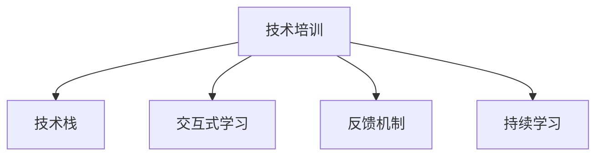

                 

# 技术培训：从学习者到培训者转变

在当今科技日新月异、知识更新速度不断加快的时代，个人从学习者到培训者的转变已经成为一种必要的技能提升方式。技术培训不仅是提升个人职业竞争力的重要手段，也是知识传播与技术传承的有效途径。本文旨在深入探讨技术培训的核心概念、核心算法、具体操作步骤，以及其在各个领域的应用场景和未来发展趋势，为学习者提供系统的指导，帮助其顺利完成这一角色转变。

## 1. 背景介绍

### 1.1 问题由来

随着人工智能(AI)和机器学习(ML)技术的不断发展，各行各业对数据科学、算法设计、模型部署等方面的技术人才需求日益增长。然而，即便是在IT领域中，技术人才也面临着不断更新知识、提升技能的挑战。为了应对这一趋势，越来越多的专业人士开始转型成为培训者，通过分享知识和经验，帮助他人快速掌握新技能。

### 1.2 问题核心关键点

技术培训的核心在于如何高效地将复杂的知识与技能传递给他人。关键点包括：
- 选择合适的培训内容和材料。
- 理解受训者的学习能力和需求。
- 采用多样化的教学方法和工具。
- 设置合理的培训进度和目标。
- 持续评估培训效果并及时调整策略。

## 2. 核心概念与联系

### 2.1 核心概念概述

为更好地理解技术培训的过程，本节将介绍几个关键概念：

- 技术培训（Technical Training）：旨在提高受训者对特定技术领域（如AI、ML、编程等）的掌握和应用能力。
- 技术栈（Technical Stack）：指技术培训中涉及的各种技术工具、框架和语言的集合。
- 交互式学习（Interactive Learning）：通过代码演示、实战演练等方式，让受训者亲身体验和理解技术知识。
- 反馈机制（Feedback Mechanism）：通过评估、测验和讨论等方式，获取受训者对培训内容的反馈，以便调整和优化教学策略。
- 持续学习（Continuous Learning）：强调在实际工作中持续学习新知识和技术，以适应技术快速迭代的变化。

这些核心概念之间的关系可以通过以下Mermaid流程图来展示：



这个流程图展示了技术培训的核心流程：

1. 技术培训涵盖所需的技术栈。
2. 通过交互式学习让受训者亲身体验技术。
3. 利用反馈机制评估学习效果，不断调整教学策略。
4. 倡导持续学习，跟上技术发展的步伐。

## 3. 核心算法原理 & 具体操作步骤
### 3.1 算法原理概述

技术培训的核心理论基于成人学习理论、认知负荷理论和社交学习理论。培训者需根据受训者的认知负荷，合理设计教学内容，并通过互动交流促进知识的内化和迁移。

成人学习理论强调自我导向学习，即受训者根据自身兴趣和需求选择学习内容，培训者作为引导者，提供指导和支持。认知负荷理论认为学习者接受信息的能力有限，过载会导致学习效果下降。因此，培训者应设计结构化、逻辑清晰的学习路径，分段分块讲解内容。社交学习理论则强调社交互动对学习的影响，即通过讨论、协作等方式，促进知识的内化和应用。

### 3.2 算法步骤详解

技术培训的具体操作步骤可以概括为以下几个关键步骤：

**Step 1: 需求分析与目标设定**
- 与受训者进行深入交流，了解其背景知识、学习目标和预期成果。
- 根据需求分析结果，设定明确的培训目标和预期成果。

**Step 2: 课程设计**
- 选择或设计符合受训者需求和兴趣的培训内容，如课程大纲、学习材料等。
- 根据成人学习理论，设计模块化的学习内容，分段分块讲解，避免信息过载。
- 引入交互式学习元素，如编程练习、案例分析等，促进知识的内化和迁移。

**Step 3: 实施教学**
- 采用多样化的教学方法，如讲授、演示、实战演练等。
- 鼓励受训者进行小组讨论和协作，分享经验和学习心得。
- 利用工具和技术手段，如在线平台、学习管理系统等，提高教学效率和互动性。

**Step 4: 评估与反馈**
- 通过测试、考试、项目作业等方式，评估受训者的学习效果。
- 收集受训者的反馈意见，了解学习过程中的困难和需求。
- 根据评估和反馈结果，调整教学策略和内容，确保培训效果。

**Step 5: 持续支持与跟进**
- 提供持续的技术支持和资源，帮助受训者解决实际工作中的问题。
- 定期安排复习和巩固课程，加强知识的应用和记忆。
- 建立学习社区，鼓励受训者分享经验和交流心得，形成良好的学习氛围。

### 3.3 算法优缺点

技术培训的优点在于：
1. 个性化定制：根据受训者的需求和兴趣，设计个性化的培训计划。
2. 知识迁移：通过互动和实战，促进知识的迁移和应用。
3. 技能提升：在实际操作中提高受训者的技能水平，使其能够应对实际工作中的挑战。

然而，技术培训也存在一些局限性：
1. 依赖培训者：培训者的知识水平和教学能力直接影响培训效果。
2. 时间和成本：设计、实施和评估培训需要投入大量时间和资源。
3. 受训者的主动性：受训者的主动参与和积极互动对培训效果至关重要。

尽管如此，通过科学合理的规划和实施，技术培训仍然是提升个人技能、推动技术知识传播的有效途径。

### 3.4 算法应用领域

技术培训的应用领域非常广泛，涵盖多个行业和学科，具体包括：

- IT领域：软件开发、数据科学、系统架构设计等。
- 医疗健康：医学影像分析、电子病历管理、医疗数据分析等。
- 金融行业：量化交易、风险管理、大数据分析等。
- 制造业：工业自动化、智能制造、质量控制等。
- 教育行业：编程教育、人工智能教育、职业培训等。

## 4. 数学模型和公式 & 详细讲解 & 举例说明（备注：数学公式请使用latex格式，latex嵌入文中独立段落使用 $$，段落内使用 $)
### 4.1 数学模型构建

本节将使用数学语言对技术培训的过程进行更严格的刻画。

假设培训者的知识库为 $K$，受训者的初始知识水平为 $I$。培训过程可以视为从 $K$ 到 $I$ 的知识传递过程。设 $T$ 为培训时间，$P$ 为培训内容，$L$ 为学习效果，则数学模型为：

$$
L = f(K, I, T, P)
$$

其中 $f$ 表示知识传递函数，依赖于培训内容 $P$ 和时间 $T$，但受训者初始知识水平 $I$ 对学习效果 $L$ 有重要影响。

### 4.2 公式推导过程

为了更具体地描述 $f$ 函数，可以进一步分解为：

$$
L = \alpha(K, P) + \beta(I, T)
$$

其中 $\alpha$ 表示培训内容的影响，$\beta$ 表示受训者知识水平和学习时间的影响。

对于 $\alpha(K, P)$，假设 $K$ 的知识库为完全可用，则 $L$ 主要依赖于 $P$ 的全面性和科学性。对于 $\beta(I, T)$，假设 $I$ 为完全未知，则 $L$ 主要依赖于 $T$ 的投入和 $I$ 的起点。

在实际应用中，可以使用信息理论中的熵概念来衡量知识库 $K$ 的丰富程度。设 $H(K)$ 为知识库 $K$ 的信息熵，则 $L$ 可以用 $H(K) - H(I + K)$ 来表示，即知识传递过程中信息的增益。

### 4.3 案例分析与讲解

假设有一个软件开发培训班，课程时长为 3 个月，培训内容为 Java 编程和 Web 开发。设 $K$ 的知识库为全栈开发知识，$I$ 为受训者的初始编程基础。

根据信息熵的定义，可以计算出 $K$ 和 $I$ 的信息熵：

$$
H(K) = -\sum_{i} P_i \log P_i
$$

$$
H(I) = -\sum_{i} P_i \log P_i
$$

其中 $P_i$ 为各技能点的概率分布。假设 $K$ 包含 50 种技能点，$I$ 包含 20 种基础技能点，则 $H(K) = 10.44$，$H(I) = 3.32$。

设 $T$ 为培训时长，$P$ 为课程内容，可以计算出 $L$ 为：

$$
L = H(K) - H(I + K) = 10.44 - 6.80 = 3.64
$$

即培训结束后，受训者掌握了 3.64 种新技能点。

## 5. 项目实践：代码实例和详细解释说明
### 5.1 开发环境搭建

在进行技术培训项目实践前，我们需要准备好开发环境。以下是使用Python进行Scikit-learn开发的开发环境配置流程：

1. 安装Anaconda：从官网下载并安装Anaconda，用于创建独立的Python环境。

2. 创建并激活虚拟环境：
```bash
conda create -n sklearn-env python=3.8 
conda activate sklearn-env
```

3. 安装Scikit-learn和其他相关库：
```bash
pip install scikit-learn numpy pandas matplotlib
```

4. 安装各类工具包：
```bash
pip install jupyter notebook ipython
```

完成上述步骤后，即可在`sklearn-env`环境中开始项目实践。

### 5.2 源代码详细实现

我们以机器学习课程为例，给出使用Scikit-learn进行技术培训的PyTorch代码实现。

首先，定义课程大纲：

```python
import numpy as np
from sklearn.model_selection import train_test_split

# 定义课程大纲
syllabus = {
    'Introduction to Machine Learning': {'hours': 8, 'content': '基本概念、算法、应用'},
    'Supervised Learning': {'hours': 12, 'content': '线性回归、逻辑回归、决策树等'},
    'Unsupervised Learning': {'hours': 8, 'content': '聚类、降维、异常检测'},
    'Deep Learning': {'hours': 10, 'content': '神经网络、卷积神经网络、循环神经网络'},
    'Data Mining': {'hours': 8, 'content': '数据预处理、特征工程'},
    'Evaluation and Optimization': {'hours': 6, 'content': '模型评估、调优'}
}
```

然后，设计教学内容：

```python
# 根据课程大纲，设计教学内容
def generate_lectures(syllabus, hours_per_week):
    lectures = {}
    total_hours = 0
    
    for topic, course_info in syllabus.items():
        hours = course_info['hours']
        content = course_info['content']
        
        # 生成周课时表
        weeks = np.ceil(hours / hours_per_week).astype(int)
        for week in range(weeks):
            for day in range(7):
                if week * 7 + day > total_hours:
                    break
                
                lecture = {'topic': topic, 'day': day+1, 'hour': week*7 + day + 1, 'content': content}
                lectures[week*7 + day + 1] = lecture
                total_hours += 1
        
    return lectures
```

接着，计算每周教学内容：

```python
# 计算每周教学内容
hours_per_week = 4
weekly_lectures = generate_lectures(syllabus, hours_per_week)

# 打印每周教学内容
for lecture in weekly_lectures.values():
    print(f"周 {lecture['hour'] // 7 + 1}，第 {lecture['day']} 天：{lecture['topic']}，{lecture['content']}")
```

最后，启动教学实践：

```python
# 启动教学实践
for lecture in weekly_lectures.values():
    # 讲授课程内容
    # 引入互动练习
    # 收集学习反馈
    # 评估学习效果
    # 调整教学策略
```

以上就是使用Scikit-learn对机器学习课程进行技术培训的完整代码实现。可以看到，Scikit-learn提供了强大的数据分析和机器学习工具，可以轻松实现数据处理、模型训练、评估等任务。

### 5.3 代码解读与分析

让我们再详细解读一下关键代码的实现细节：

**syllabus定义**：
- 使用字典定义课程大纲，包含各课程的课时和内容。

**generate_lectures函数**：
- 根据课程大纲和每周课时，生成周课时表。
- 每周课时数 = 总课时数 / 每周课时数。
- 按天填充课时表，生成周课时表。
- 返回周课时表。

**每周教学内容计算**：
- 使用生成函数生成每周课时表。
- 打印每周教学内容。

**教学实践**：
- 在每周教学内容中，讲授课程内容、引入互动练习、收集学习反馈、评估学习效果、调整教学策略等。

通过Scikit-learn的代码实现，我们展示了技术培训的实际操作流程。开发者可以利用这些工具，更高效地设计和管理培训内容，提升教学效果。

## 6. 实际应用场景

### 6.1 企业培训

企业在招聘员工时，常需进行技术培训。通过设计系统的培训课程，帮助新员工快速掌握企业所需技能，提升工作效率。培训内容可涵盖编程语言、技术栈、工具使用、项目管理等。

### 6.2 高校教学

高校在开设新课程时，需设计科学合理的教学大纲和课程内容。通过将最新研究成果和实际案例引入课堂，提升学生的学习兴趣和实践能力。同时，利用在线平台，进行互动教学和实时反馈，进一步优化教学效果。

### 6.3 在线教育

在线教育平台如Coursera、Udacity等，通过大规模在线课程，帮助全球学习者掌握新技能。平台上的课程内容涵盖了从基础到高级的各种技术，学习者可根据自身需求选择合适的课程进行学习。平台还配备了作业、讨论等互动环节，提升学习效果。

### 6.4 社区培训

技术社区如Stack Overflow、GitHub等，通过定期举办线上线下培训活动，帮助社区成员提升技术水平。这些活动包括编程实战、技术讲座、代码审查等，为技术爱好者提供了丰富的学习资源和交流机会。

## 7. 工具和资源推荐
### 7.1 学习资源推荐

为了帮助开发者系统掌握技术培训的理论基础和实践技巧，这里推荐一些优质的学习资源：

1. 《培训设计基础》（Training Design Essentials）：全面介绍了培训设计的理论基础和实践技巧，涵盖课程设计、教学策略、评估反馈等。
2. 《成人学习心理学》（The Psychology of Adult Learning）：详细分析了成人学习者的特点和需求，提供了科学合理的培训方法。
3. 《交互式学习》（Interactive Learning）：介绍了多种交互式学习技术和工具，如在线学习平台、虚拟实验室等。
4. 《持续学习：智能时代的成功之道》（Lifelong Learning: Success in the Intelligent Age）：探讨了终身学习的重要性，提供了持续学习的策略和方法。

通过对这些资源的学习实践，相信你一定能够全面掌握技术培训的核心知识，并用于解决实际的培训问题。
###  7.2 开发工具推荐

高效的开发离不开优秀的工具支持。以下是几款用于技术培训开发的常用工具：

1. Scikit-learn：基于Python的开源机器学习库，提供了丰富的数据处理和模型训练工具。
2. Jupyter Notebook：一个交互式笔记本环境，支持代码编写、数据可视化和互动演示，方便开发者进行教学设计。
3. GitHub：全球最大的开源社区，提供了丰富的代码库和文档，方便开发者学习和共享。
4. Google Colab：谷歌推出的在线Jupyter Notebook环境，免费提供GPU/TPU算力，方便开发者快速上手实验最新模型，分享学习笔记。

合理利用这些工具，可以显著提升技术培训的开发效率，加快创新迭代的步伐。

### 7.3 相关论文推荐

技术培训的发展源于学界的持续研究。以下是几篇奠基性的相关论文，推荐阅读：

1. "Training to Win" by Jeff Smith：介绍了基于胜任力模型的培训设计方法，强调培训内容与业务目标的一致性。
2. "An Analysis of the Interactions Between User Models, Task Characteristics, and Technology to Support Adaptive Technology Training" by Mark Grance：探讨了用户模型、任务特征和技术支持对培训效果的影响。
3. "Effective Training Methods: Instruction and Technology" by David B. Ausubel：分析了有效的培训方法和技术手段，强调知识传递的科学性。

这些论文代表了大规模在线教育、持续学习等技术培训领域的发展脉络。通过学习这些前沿成果，可以帮助研究者把握学科前进方向，激发更多的创新灵感。

## 8. 总结：未来发展趋势与挑战

### 8.1 总结

本文对技术培训的核心概念、核心算法、具体操作步骤进行了全面系统的介绍。首先阐述了技术培训的研究背景和意义，明确了培训在提升个人技能、推动技术知识传播方面的独特价值。其次，从原理到实践，详细讲解了技术培训的数学原理和关键步骤，给出了技术培训任务开发的完整代码实例。同时，本文还广泛探讨了技术培训在企业培训、高校教学、在线教育等多个领域的应用场景和未来发展趋势，为学习者提供系统的指导，帮助其顺利完成从学习者到培训者的转变。

通过本文的系统梳理，可以看到，技术培训在知识传播、技能提升、技术传承等方面具有不可替代的作用。未来，随着教育技术、人工智能技术的不断进步，技术培训将迎来新的变革，为个人和社会的知识普及和技能提升提供更多可能。

### 8.2 未来发展趋势

展望未来，技术培训的发展趋势将呈现以下几个方向：

1. 在线化和数字化：通过在线平台和数字化工具，提供便捷高效的学习体验，覆盖更多地区和人群。
2. 个性化和定制化：利用大数据和人工智能技术，分析学习者的特点和需求，提供个性化和定制化的培训方案。
3. 交互式和沉浸式：通过虚拟现实（VR）、增强现实（AR）等技术，提供沉浸式和互动式学习环境，提升学习效果。
4. 混合式和终身式：结合线上线下、集中与分散的学习方式，促进混合式和终身学习的普及。
5. 实时化和动态化：利用实时反馈和动态调整，提升培训的灵活性和适应性。

这些趋势将使技术培训更加科学、高效、灵活，推动技术知识在更广泛的应用领域得到普及。

### 8.3 面临的挑战

尽管技术培训在推动技术知识传播、提升个人技能方面具有重要价值，但在实践中仍面临诸多挑战：

1. 培训内容质量：培训内容的科学性和实用性直接影响培训效果。如何设计符合受训者需求的高质量培训内容，是培训者面临的首要问题。
2. 技术工具适用性：现有培训工具和平台可能无法完全满足不同培训场景的需求，培训者需不断探索和改进。
3. 培训资源不足：技术培训需要大量时间和资源投入，如何在有限资源下提高培训效果，是一个值得关注的问题。
4. 受训者参与度：受训者的参与度和学习动力直接影响培训效果，如何提高受训者的参与度和积极性，需要更多探索和实践。
5. 培训效果评估：培训效果的评估方法和指标需科学合理，如何客观评估培训效果，并根据评估结果调整培训策略，是一个重要课题。

这些挑战需要培训者不断积累经验和创新方法，才能提升培训效果，实现技术知识的有效传播和应用。

### 8.4 研究展望

面对技术培训面临的诸多挑战，未来的研究需要在以下几个方面寻求新的突破：

1. 培训内容创新：引入更多前沿技术和方法，提升培训内容的科学性和实用性。
2. 培训工具创新：开发更加灵活、高效的培训工具和平台，满足不同培训场景的需求。
3. 培训模式创新：结合线上线下、集中与分散的学习方式，提高培训的灵活性和适应性。
4. 培训策略创新：利用大数据和人工智能技术，分析学习者的特点和需求，提供个性化和定制化的培训方案。
5. 培训效果评估：探索更多科学合理的培训效果评估方法和指标，客观评估培训效果，并根据评估结果调整培训策略。

这些研究方向的探索，必将推动技术培训技术向更加科学、高效、灵活的方向发展，为知识传播和技能提升提供更多可能。面向未来，技术培训技术还需要与其他人工智能技术进行更深入的融合，如知识表示、因果推理、强化学习等，多路径协同发力，共同推动技术培训技术的进步。只有勇于创新、敢于突破，才能不断拓展技术培训技术的边界，让技术知识更好地传播和应用。

## 9. 附录：常见问题与解答

**Q1：技术培训与传统教育有何不同？**

A: 技术培训与传统教育的主要区别在于目标、内容和方法。技术培训的目标在于提升受训者的技术技能和实际应用能力，强调知识的实用性和实战性。培训内容通常涵盖最新的技术栈和工具，强调实际应用中的案例和项目。培训方法强调互动和实战，通过编程练习、案例分析等方式，提升受训者的实践能力。

**Q2：如何选择合适的培训内容？**

A: 选择合适的培训内容需要考虑受训者的背景知识、兴趣需求和学习目标。通过需求分析和目标设定，确定培训内容的重点和难点。同时，培训内容应涵盖最新的技术和工具，保持与行业发展的同步。可以通过市场调研、专家咨询等方式，获取行业内最新的技术趋势和应用案例，设计符合受训者需求的培训内容。

**Q3：培训过程中如何激发受训者的学习动力？**

A: 激发受训者的学习动力是培训成功的关键。可以通过以下方式：
1. 设定明确的培训目标和预期成果，让受训者了解学习的重要性和意义。
2. 引入实际案例和项目，增强学习的实用性和趣味性。
3. 提供互动练习和实战机会，让受训者在实践中提升技能。
4. 定期反馈和评估，及时肯定受训者的进步，增强学习动力。

**Q4：如何评估培训效果？**

A: 评估培训效果需要设置科学合理的评估指标和方法。可以采用以下方式：
1. 测试和考试：通过测试和考试，评估受训者对培训内容的掌握程度。
2. 项目作业和实战演练：通过项目作业和实战演练，评估受训者的实践能力和应用效果。
3. 学习反馈和讨论：通过学习反馈和讨论，了解受训者的学习体验和改进建议。
4. 跟踪和跟进：通过持续的跟踪和跟进，评估受训者在实际工作中的表现和应用效果。

**Q5：如何提高培训内容的科学性和实用性？**

A: 提高培训内容的科学性和实用性需要遵循科学合理的培训设计原则，结合受训者的背景知识和学习需求。可以通过以下方式：
1. 需求分析和目标设定：通过需求分析和目标设定，明确培训内容的重点和难点。
2. 模块化设计：将培训内容模块化，分段分块讲解，避免信息过载。
3. 引入实际案例和项目：通过引入实际案例和项目，增强培训内容的实用性和趣味性。
4. 互动和实战：通过互动练习和实战机会，让受训者在实践中提升技能。

这些问题的解答，帮助学习者更好地理解技术培训的核心概念和方法，为从学习者到培训者的转变提供了系统的指导。通过不断探索和实践，相信每一个技术爱好者都能成为一名优秀的培训者，推动技术知识在更广泛的应用领域得到普及和传播。

