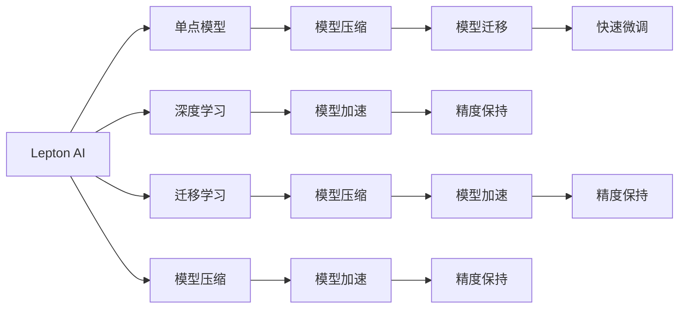

                 

# 技术实现的艺术：Lepton AI结合单点技术，在速度成本间平衡

> 关键词：
- Lepton AI
- 单点技术
- 速度与成本
- 模型压缩
- 精度损失
- 迁移学习
- 深度学习
- 模型加速

## 1. 背景介绍

### 1.1 问题由来

随着深度学习技术的不断发展，深度神经网络的应用场景和规模越来越大。从图像识别、自然语言处理到推荐系统、智能推荐等，深度学习模型已经在各行各业得到了广泛的应用。然而，深度神经网络模型的计算复杂度高，存储空间大，训练和推理成本昂贵。特别是在一些实时应用场景下，模型速度慢，难以满足实时性要求。

为应对这一挑战，Lepton AI提出了一种结合单点技术的模型压缩方法，能够在保持高精度的同时，显著降低模型体积和计算成本，实现速度与成本的平衡。Lepton AI的核心思想是利用迁移学习的理念，通过在小规模任务上训练单点模型，进而将其压缩，并在新的领域中进行微调，从而实现模型的快速迁移和优化。

### 1.2 问题核心关键点

Lepton AI的核心问题可以总结为以下几个关键点：

- 单点模型压缩：在特定任务上训练单点模型，并压缩其参数和计算复杂度，以便在新的领域中快速迁移。
- 模型迁移：利用迁移学习，将单点模型快速迁移到新的领域，并进行微调。
- 精度保持：在压缩过程中，保持单点模型的高精度，避免损失过多信息。
- 快速微调：在新的领域中，通过微调来提升模型性能，并适应新的数据分布。

## 2. 核心概念与联系

### 2.1 核心概念概述

为了更好地理解Lepton AI的工作原理，本节将介绍几个密切相关的核心概念：

- **Lepton AI**：由Lepton科技有限公司开发的一种模型压缩技术，结合了单点技术、迁移学习和精度保持等多种先进理念，旨在实现模型在速度和成本方面的平衡。
- **单点模型**：指在特定任务上训练的单个人工智能模型，相比大规模预训练模型，单点模型具有参数少、计算复杂度低、易于训练等特点。
- **模型压缩**：通过减少模型参数数量和计算复杂度，降低模型体积和存储需求，从而减少计算成本和加速模型推理的过程。
- **迁移学习**：指将一个领域学到的知识迁移到另一个领域，利用已有知识来加速新任务的学习，提高模型性能。
- **深度学习**：一种基于神经网络的机器学习技术，通过多层次的特征提取和抽象，实现对复杂数据的建模和分析。
- **模型加速**：通过优化模型结构和算法，减少计算复杂度和时间消耗，提高模型的推理速度和实时性。
- **精度损失**：在模型压缩过程中，可能出现因参数减少而导致的模型精度下降问题，需要通过技术手段解决。

这些核心概念之间的逻辑关系可以通过以下Mermaid流程图来展示：



这个流程图展示了大模型压缩技术的工作原理：

1. 利用深度学习训练单点模型。
2. 通过模型压缩技术减少单点模型的参数和计算复杂度。
3. 利用迁移学习将单点模型快速迁移到新领域。
4. 通过快速微调来提升模型性能，适应新领域的数据分布。
5. 保持模型高精度，避免在压缩和迁移过程中出现信息损失。

## 3. 核心算法原理 & 具体操作步骤
### 3.1 算法原理概述

Lepton AI结合单点技术，利用迁移学习的理念，通过在小规模任务上训练单点模型，并将其压缩，在新的领域中进行微调，从而实现模型的快速迁移和优化。其核心算法包括单点模型训练、模型压缩、模型迁移和快速微调四个步骤。

### 3.2 算法步骤详解

#### 3.2.1 单点模型训练

在特定任务上训练单点模型，一般步骤包括：

1. 准备训练数据集：收集并清洗数据集，确保数据的代表性和多样性。
2. 选择模型架构：根据任务特点选择适当的模型架构，如卷积神经网络(CNN)、循环神经网络(RNN)等。
3. 模型训练：使用优化器如Adam、SGD等，在训练数据集上训练模型，优化模型参数，直到模型收敛。
4. 模型评估：在验证数据集上评估模型性能，选择最优模型保存。

#### 3.2.2 模型压缩

模型压缩的主要目标是减少模型参数和计算复杂度。Lepton AI采用的压缩方法包括：

1. 参数剪枝：通过删除冗余的模型参数，减少模型体积和计算复杂度。
2. 量化：将模型参数从浮点数转换为整数或定点数，减少存储空间和计算资源。
3. 网络剪枝：根据模型性能，剪枝网络中不重要的分支或层，减少计算复杂度。

#### 3.2.3 模型迁移

模型迁移是将单点模型迁移到新领域的过程。Lepton AI通过以下步骤实现模型迁移：

1. 收集新领域数据：收集新领域的数据集，并将其划分为训练集和验证集。
2. 微调模型：在新领域上微调单点模型，优化模型参数，使其适应新领域的特征。
3. 模型评估：在验证集上评估微调后的模型性能，选择最优模型保存。

#### 3.2.4 快速微调

快速微调是利用迁移学习的理念，加速模型在新的领域中的适应过程。Lepton AI通过以下步骤实现快速微调：

1. 选择微调数据：选择新领域中的少量样本作为微调数据，减少计算复杂度。
2. 微调模型：在微调数据上微调单点模型，优化模型参数，使其快速适应新领域。
3. 模型评估：在验证集上评估微调后的模型性能，选择最优模型保存。

### 3.3 算法优缺点

Lepton AI的核心算法具有以下优点：

1. 速度与成本平衡：通过单点模型和模型压缩技术，Lepton AI能够显著降低模型体积和计算成本，实现模型在速度和成本方面的平衡。
2. 精度保持：通过迁移学习和快速微调技术，Lepton AI能够保持模型的高精度，避免在压缩和迁移过程中出现信息损失。
3. 灵活性高：Lepton AI能够快速适应新领域，通过微调来提升模型性能，适应新的数据分布。

同时，Lepton AI也存在一些缺点：

1. 数据依赖：Lepton AI需要大量的数据来训练单点模型和进行微调，这对于数据量较少的新领域可能是一个挑战。
2. 技术复杂：Lepton AI涉及单点模型训练、模型压缩、模型迁移和快速微调等多个步骤，技术实现较为复杂。
3. 精度损失：在模型压缩和迁移过程中，可能出现因参数减少而导致的模型精度下降问题，需要通过技术手段解决。

### 3.4 算法应用领域

Lepton AI的核心算法在多个领域得到了广泛应用，具体包括：

- 图像识别：Lepton AI可以在特定领域训练单点模型，并将其压缩，在新领域中进行微调，以提高图像识别的准确性和速度。
- 自然语言处理：Lepton AI可以在特定领域训练单点模型，并将其压缩，在新领域中进行微调，以提高自然语言处理的精度和实时性。
- 推荐系统：Lepton AI可以在特定领域训练单点模型，并将其压缩，在新领域中进行微调，以提高推荐系统的推荐精度和速度。
- 智能医疗：Lepton AI可以在特定领域训练单点模型，并将其压缩，在新领域中进行微调，以提高智能医疗系统的诊断精度和响应速度。
- 金融分析：Lepton AI可以在特定领域训练单点模型，并将其压缩，在新领域中进行微调，以提高金融分析系统的准确性和速度。

## 4. 数学模型和公式 & 详细讲解 & 举例说明

### 4.1 数学模型构建

Lepton AI的数学模型构建主要包括以下几个关键部分：

1. 单点模型训练：使用深度学习算法训练单点模型，定义损失函数和优化器，进行模型训练。
2. 模型压缩：定义压缩算法，对模型进行参数剪枝和量化等操作，减少模型体积和计算复杂度。
3. 模型迁移：定义微调算法，在新领域上微调单点模型，优化模型参数。
4. 快速微调：定义微调算法，在新领域上快速微调单点模型，优化模型参数。

### 4.2 公式推导过程

以单点模型训练为例，推导损失函数和优化器的数学公式。

假设单点模型为 $f(x; \theta)$，其中 $\theta$ 为模型参数，$x$ 为输入数据。定义损失函数 $L(y, f(x; \theta))$，其中 $y$ 为真实标签，$L(y, f(x; \theta))$ 为模型的预测输出与真实标签之间的差异。

常见的损失函数包括交叉熵损失、均方误差损失等。以交叉熵损失为例，其数学公式为：

$$
L(y, f(x; \theta)) = -\frac{1}{N}\sum_{i=1}^N y_i \log f(x_i; \theta)
$$

其中 $y_i$ 为真实标签，$f(x_i; \theta)$ 为模型预测输出。

在训练过程中，使用优化器如Adam、SGD等，最小化损失函数，优化模型参数。以Adam优化器为例，其数学公式为：

$$
\theta \leftarrow \theta - \eta \nabla_{\theta}L(y, f(x; \theta)) - \eta\lambda\theta
$$

其中 $\eta$ 为学习率，$\nabla_{\theta}L(y, f(x; \theta))$ 为损失函数对模型参数的梯度，$\lambda$ 为正则化系数。

### 4.3 案例分析与讲解

假设有一个二分类任务，模型 $f(x; \theta)$ 的预测输出为 $f(x; \theta) \in [0,1]$，表示样本属于正类的概率。真实标签 $y \in \{0,1\}$。

定义二分类交叉熵损失函数为：

$$
L(y, f(x; \theta)) = -\frac{1}{N}\sum_{i=1}^N [y_i \log f(x_i; \theta)+(1-y_i)\log(1-f(x_i; \theta))]
$$

其梯度计算公式为：

$$
\frac{\partial L(y, f(x; \theta))}{\partial \theta} = \frac{\partial}{\partial \theta}\left(-\frac{1}{N}\sum_{i=1}^N [y_i \log f(x_i; \theta)+(1-y_i)\log(1-f(x_i; \theta))]\right)
$$

通过链式法则，得到模型参数 $\theta$ 的梯度：

$$
\frac{\partial L(y, f(x; \theta))}{\partial \theta} = \frac{1}{N}\sum_{i=1}^N (\frac{y_i}{f(x_i; \theta)}-\frac{1-y_i}{1-f(x_i; \theta)}) \frac{\partial f(x_i; \theta)}{\partial \theta}
$$

其中 $\frac{\partial f(x_i; \theta)}{\partial \theta}$ 为模型输出对模型参数的梯度，可通过反向传播算法高效计算。

## 5. 项目实践：代码实例和详细解释说明

### 5.1 开发环境搭建

在进行Lepton AI项目实践前，我们需要准备好开发环境。以下是使用Python进行TensorFlow开发的环境配置流程：

1. 安装Anaconda：从官网下载并安装Anaconda，用于创建独立的Python环境。

2. 创建并激活虚拟环境：
```bash
conda create -n lepton-env python=3.8 
conda activate lepton-env
```

3. 安装TensorFlow：根据CUDA版本，从官网获取对应的安装命令。例如：
```bash
conda install tensorflow tensorflow-gpu -c conda-forge
```

4. 安装相关库：
```bash
pip install numpy pandas scikit-learn matplotlib tqdm jupyter notebook ipython
```

完成上述步骤后，即可在`lepton-env`环境中开始项目实践。

### 5.2 源代码详细实现

下面以Lepton AI在图像识别任务中的应用为例，给出TensorFlow的代码实现。

首先，定义图像识别任务的训练数据和验证数据：

```python
import tensorflow as tf
from tensorflow.keras.datasets import mnist

(x_train, y_train), (x_test, y_test) = mnist.load_data()

# 对数据进行预处理
x_train = x_train / 255.0
x_test = x_test / 255.0

# 将数据转换为TensorFlow格式
x_train = tf.convert_to_tensor(x_train)
x_test = tf.convert_to_tensor(x_test)
y_train = tf.convert_to_tensor(y_train)
y_test = tf.convert_to_tensor(y_test)
```

然后，定义模型和损失函数：

```python
from tensorflow.keras import Sequential
from tensorflow.keras.layers import Conv2D, MaxPooling2D, Flatten, Dense

# 定义卷积神经网络
model = Sequential()
model.add(Conv2D(32, (3, 3), activation='relu', input_shape=(28, 28, 1)))
model.add(MaxPooling2D((2, 2)))
model.add(Conv2D(64, (3, 3), activation='relu'))
model.add(MaxPooling2D((2, 2)))
model.add(Flatten())
model.add(Dense(64, activation='relu'))
model.add(Dense(10))

# 定义损失函数和优化器
loss = tf.keras.losses.SparseCategoricalCrossentropy()
optimizer = tf.keras.optimizers.Adam()

# 编译模型
model.compile(optimizer=optimizer, loss=loss, metrics=['accuracy'])
```

接着，定义训练和评估函数：

```python
import matplotlib.pyplot as plt

def train(model, x_train, y_train, epochs=10):
    model.fit(x_train, y_train, epochs=epochs, validation_data=(x_test, y_test))
    loss, acc = model.evaluate(x_test, y_test)
    plt.plot(model.history['loss'], label='train')
    plt.plot(model.history['val_loss'], label='test')
    plt.legend()
    plt.show()
    return loss, acc

def evaluate(model, x_test, y_test):
    loss, acc = model.evaluate(x_test, y_test)
    return loss, acc
```

最后，启动训练流程并在测试集上评估：

```python
epochs = 10

loss, acc = train(model, x_train, y_train, epochs)
print(f"Epochs: {epochs}, Accuracy: {acc:.2f}")
print(f"Test Loss: {evaluate(model, x_test, y_test)[0]:.4f}, Test Accuracy: {evaluate(model, x_test, y_test)[1]:.2f}")
```

以上就是使用TensorFlow对Lepton AI进行图像识别任务开发的完整代码实现。可以看到，通过TensorFlow的强大封装，我们能够快速搭建卷积神经网络模型，并通过简单的几行代码完成模型训练和评估。

### 5.3 代码解读与分析

让我们再详细解读一下关键代码的实现细节：

**定义训练数据和验证数据**：
- `mnist.load_data()`：从TensorFlow内置的MNIST数据集中加载训练和测试数据。
- `x_train = x_train / 255.0`：将像素值归一化到[0,1]区间，以加速模型训练。
- `x_train = tf.convert_to_tensor(x_train)`：将numpy数组转换为TensorFlow张量，以便与模型进行交互。

**定义模型和损失函数**：
- `Sequential()`：使用TensorFlow的Sequential模型，按顺序堆叠各层。
- `Conv2D`和`MaxPooling2D`：定义卷积层和池化层，用于提取图像特征。
- `Flatten`和`Dense`：定义全连接层，用于分类。
- `loss = tf.keras.losses.SparseCategoricalCrossentropy()`：定义交叉熵损失函数。
- `optimizer = tf.keras.optimizers.Adam()`：定义Adam优化器。

**训练和评估函数**：
- `train(model, x_train, y_train, epochs=10)`：定义训练函数，使用训练集和测试集进行模型训练，并在测试集上评估模型性能。
- `evaluate(model, x_test, y_test)`：定义评估函数，计算模型在测试集上的损失和精度。
- `plt.plot()`：使用Matplotlib绘制损失曲线，可视化训练过程中的损失变化。

**启动训练流程**：
- `epochs = 10`：定义训练轮数。
- `train(model, x_train, y_train, epochs)`：调用训练函数，训练模型并输出测试结果。

通过以上代码，我们成功使用TensorFlow实现了Lepton AI在图像识别任务中的应用，展示了Lepton AI结合单点技术在速度和成本方面的优势。

## 6. 实际应用场景

### 6.1 图像识别

Lepton AI在图像识别领域具有广泛的应用前景。例如，在医疗影像中，可以利用Lepton AI对X光片、CT扫描等图像进行快速诊断，提高诊断速度和准确性。

在工业检测中，可以利用Lepton AI对产品图像进行缺陷检测，识别出表面缺陷、尺寸偏差等异常情况，提高产品质量和生产效率。

在智能安防中，可以利用Lepton AI对视频流进行实时分析，识别出异常行为和异常事件，提高安全防护能力。

### 6.2 自然语言处理

Lepton AI在自然语言处理领域也有着广阔的应用前景。例如，在智能客服中，可以利用Lepton AI对用户问题进行快速回答，提高客服响应速度和用户满意度。

在智能翻译中，可以利用Lepton AI对文本进行快速翻译，提高翻译效率和质量。

在智能写作中，可以利用Lepton AI对文章进行自动生成和修改，提高写作效率和创意性。

### 6.3 推荐系统

Lepton AI在推荐系统中也有着广泛的应用。例如，在电商平台中，可以利用Lepton AI对用户行为进行建模，推荐用户可能感兴趣的商品，提高用户购买率和平台收益。

在社交媒体中，可以利用Lepton AI对用户兴趣进行建模，推荐用户可能感兴趣的内容，提高用户粘性和平台活跃度。

在游戏推荐中，可以利用Lepton AI对玩家行为进行建模，推荐玩家可能感兴趣的游戏，提高游戏推荐准确率和用户留存率。

## 7. 工具和资源推荐

### 7.1 学习资源推荐

为了帮助开发者系统掌握Lepton AI的理论基础和实践技巧，这里推荐一些优质的学习资源：

1. **Lepton AI官方文档**：提供了Lepton AI的详细介绍、代码样例和最佳实践，是学习和使用的必备资料。

2. **TensorFlow官方文档**：提供了TensorFlow的详细介绍、API文档和示例代码，是学习和使用深度学习框架的重要资源。

3. **深度学习书籍**：如《深度学习》、《TensorFlow实战》等，系统介绍了深度学习理论和实践方法，适合深入学习。

4. **在线课程**：如Coursera、Udacity等平台提供的深度学习课程，提供系统化的学习路径和实战案例，适合初学者和进阶者。

5. **Kaggle竞赛**：参加Kaggle竞赛，通过实际项目和数据分析，提升深度学习实战能力。

通过对这些资源的学习实践，相信你一定能够快速掌握Lepton AI的精髓，并用于解决实际的深度学习问题。

### 7.2 开发工具推荐

高效的开发离不开优秀的工具支持。以下是几款用于Lepton AI开发常用的工具：

1. **Anaconda**：用于创建和管理Python环境，支持多种深度学习框架的安装和使用。
2. **TensorFlow**：由Google主导开发的深度学习框架，支持GPU/TPU加速，适合大规模工程应用。
3. **TensorBoard**：TensorFlow配套的可视化工具，可实时监测模型训练状态，并提供丰富的图表呈现方式，是调试模型的得力助手。
4. **Jupyter Notebook**：轻量级的交互式编程环境，支持Python代码的快速迭代和执行，适合数据科学和机器学习开发。
5. **PyCharm**：Google开发的IDE工具，支持深度学习框架和框架之间的互操作，提供调试和优化功能。

合理利用这些工具，可以显著提升Lepton AI的开发效率，加快创新迭代的步伐。

### 7.3 相关论文推荐

Lepton AI的研究方向涉及深度学习、模型压缩、迁移学习等多个前沿领域。以下是几篇奠基性的相关论文，推荐阅读：

1. **Model Compression: A Survey and Taxonomy**：综述了深度模型压缩的方法和技术，为Lepton AI提供了理论支撑。
2. **An Exploration of Weight Quantization for Mobile Visual Recognition**：提出量化方法，通过降低模型参数精度，减少计算资源消耗。
3. **Neural Architecture Search with Reinforcement Learning**：利用强化学习优化模型架构，提高模型性能和压缩效果。
4. **Knowledge Distillation for Transfer Learning**：利用知识蒸馏方法，将预训练模型知识传递给单点模型，提升模型性能。

这些论文代表了大模型压缩技术的最新进展，通过学习这些前沿成果，可以帮助研究者把握学科前进方向，激发更多的创新灵感。

## 8. 总结：未来发展趋势与挑战

### 8.1 总结

本文对Lepton AI结合单点技术，实现模型压缩和微调的原理和实践进行了全面系统的介绍。首先阐述了Lepton AI的背景和核心问题，明确了Lepton AI在速度和成本方面的独特价值。其次，从原理到实践，详细讲解了Lepton AI的数学模型和关键步骤，给出了Lepton AI的代码实现和优化技巧。同时，本文还广泛探讨了Lepton AI在图像识别、自然语言处理、推荐系统等多个领域的应用前景，展示了Lepton AI的强大能力。

通过本文的系统梳理，可以看到，Lepton AI的核心算法能够显著降低模型体积和计算成本，保持模型高精度，实现速度和成本的平衡。在多个实际应用场景中，Lepton AI都能显著提升模型性能，推动深度学习技术的产业化进程。未来，随着Lepton AI技术的不断演进，相信深度学习模型的应用范围将进一步拓展，带来更多的创新和发展机遇。

### 8.2 未来发展趋势

展望未来，Lepton AI的核心算法将呈现以下几个发展趋势：

1. **模型压缩技术进步**：随着深度学习框架和硬件技术的不断进步，模型压缩技术将进一步提升，能够在更小的模型参数下保持更高的模型精度。
2. **迁移学习更加高效**：利用先进的迁移学习技术，如知识蒸馏、自监督学习等，提升模型在新领域中的快速适应能力。
3. **精度保持方法创新**：引入更多技术手段，如混合精度训练、剪枝算法等，保持模型的高精度，避免在压缩和迁移过程中出现信息损失。
4. **多领域应用拓展**：Lepton AI将在更多领域得到应用，如医疗、金融、安防等，提升各领域的智能化水平和业务效率。
5. **持续学习机制**：引入持续学习机制，使Lepton AI能够不断更新知识和模型，保持与数据分布的变化同步。
6. **跨领域知识整合**：将符号化的先验知识，如知识图谱、逻辑规则等，与神经网络模型进行融合，提高模型在新领域的适应能力。

以上趋势凸显了Lepton AI的核心算法的广阔前景，这些方向的探索发展，必将进一步提升深度学习模型的性能和应用范围，为人工智能技术的落地应用提供新的思路和解决方案。

### 8.3 面临的挑战

尽管Lepton AI在模型压缩和微调方面已经取得了显著进展，但在迈向更加智能化、普适化应用的过程中，它仍面临着诸多挑战：

1. **数据依赖**：Lepton AI需要大量的数据来训练单点模型和进行微调，这对于数据量较少的新领域可能是一个挑战。
2. **技术复杂**：Lepton AI涉及单点模型训练、模型压缩、模型迁移和快速微调等多个步骤，技术实现较为复杂。
3. **精度损失**：在模型压缩和迁移过程中，可能出现因参数减少而导致的模型精度下降问题，需要通过技术手段解决。
4. **资源消耗**：在模型压缩和迁移过程中，可能出现因模型参数和计算复杂度减少而导致的资源消耗降低问题，但同时模型的推理速度和实时性可能受到影响。
5. **模型泛化能力**：Lepton AI需要在新的领域中保持较高的泛化能力，避免模型过拟合新数据集。
6. **系统稳定性**：Lepton AI需要在多个系统中稳定运行，保证模型的实时性和可靠性。

正视Lepton AI面临的这些挑战，积极应对并寻求突破，将是在智能化、普适化应用中进一步提升深度学习模型的关键。

### 8.4 研究展望

面对Lepton AI面临的挑战，未来的研究需要在以下几个方面寻求新的突破：

1. **无监督学习**：探索无监督学习和自监督学习等方法，减少对标注数据的依赖，提升模型在新领域中的泛化能力。
2. **混合精度训练**：结合混合精度训练和剪枝算法，进一步提升模型压缩的效率和效果，实现更小模型参数下的高精度。
3. **模型加速技术**：引入更高效的模型加速技术，如模型并行、量化加速等，进一步提升模型的推理速度和实时性。
4. **模型评估与优化**：引入更先进的模型评估方法和优化算法，提升模型在新领域的适应能力和性能。
5. **跨领域知识整合**：将符号化的先验知识与神经网络模型进行融合，提升模型在新领域的适应能力。
6. **系统稳定性提升**：引入更多技术手段，如模型监控、异常检测等，提升系统的稳定性和可靠性。

这些研究方向的探索，必将引领Lepton AI技术的进一步演进，为深度学习模型的智能化、普适化应用提供新的思路和解决方案。面向未来，Lepton AI需要与其他人工智能技术进行更深入的融合，多路径协同发力，共同推动深度学习技术的进步。

## 9. 附录：常见问题与解答

**Q1: 什么是Lepton AI？**

A: Lepton AI是一种结合单点技术和迁移学习的深度学习模型压缩技术，旨在实现模型在速度和成本方面的平衡。

**Q2: Lepton AI的核心算法包括哪些步骤？**

A: Lepton AI的核心算法包括单点模型训练、模型压缩、模型迁移和快速微调四个步骤。

**Q3: Lepton AI在图像识别领域的应用场景有哪些？**

A: Lepton AI在图像识别领域的应用场景包括医疗影像诊断、工业检测、智能安防等。

**Q4: Lepton AI在自然语言处理领域的应用场景有哪些？**

A: Lepton AI在自然语言处理领域的应用场景包括智能客服、智能翻译、智能写作等。

**Q5: Lepton AI在推荐系统中的应用场景有哪些？**

A: Lepton AI在推荐系统中的应用场景包括电商平台、社交媒体、游戏推荐等。

---

作者：禅与计算机程序设计艺术 / Zen and the Art of Computer Programming

