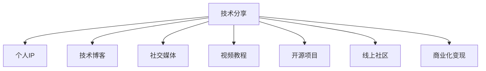

                 

# 技术演讲：从分享到个人IP打造

---

## 1. 背景介绍

### 1.1 问题由来

在这个信息爆炸的时代，如何将自己的技术分享有效地转化为个人品牌价值，成为许多技术人员共同关心的问题。特别是在开源社区和线上技术平台上，技术分享已成为展示个人专业能力的重要手段。然而，如何构建一个有影响力的个人IP（Intellectual Property），不仅仅是技术积累的问题，更涉及到网络推广、内容创作、社交互动等多个维度的综合能力。

### 1.2 问题核心关键点

构建个人IP的核心在于通过技术分享建立专家形象，并通过持续的高质量内容输出和社交互动，形成稳定的粉丝群体，从而实现影响力变现。关键点包括：

- 内容质量：技术分享的内容必须具备创新性、实用性和深度，能解决实际问题，吸引读者关注。
- 持续输出：技术分享需要持续进行，保持一定的更新频率，以保持读者的持续关注。
- 社交互动：积极与读者互动，回答他们的问题，参与讨论，形成社区氛围。
- 平台选择：选择合适的技术分享平台，根据平台特点进行内容优化。
- 推广策略：利用多种推广手段，如社交媒体、博客、视频、电子书等，提升个人品牌影响力。
- 商业化变现：在技术分享中植入广告、课程、咨询服务等商业元素，实现变现。

### 1.3 问题研究意义

技术分享与个人IP打造是一个双赢的过程。对于分享者而言，可以积累知识、展示才华、扩大影响，促进职业发展。对于读者而言，可以获得有价值的知识和技术，解决实际问题。此外，个人IP的形成和维护，也能够促进技术的进一步传播和应用，加速行业发展进程。

---

## 2. 核心概念与联系

### 2.1 核心概念概述

为更好地理解技术分享与个人IP打造，本节将介绍几个关键概念：

- 技术分享（Technical Sharing）：通过博客、社交媒体、视频平台等形式，将自己的技术知识、项目经验、研究心得等内容与他人分享，帮助他人解决问题，提升自己的技术影响力和知名度。
- 个人IP（Intellectual Property）：在技术领域中，个人IP通常指的是通过不断分享高质量技术内容，建立起来的专家形象和品牌影响力，表现为特定的领域认知度、信任度和商业价值。
- 技术博客（Tech Blog）：是一种常见的技术分享形式，通过撰写博客文章，记录技术进展、项目经验、思想洞见，形成个人知识库和知识传播平台。
- 社交媒体（Social Media）：如Twitter、LinkedIn、GitHub等平台，通过发布技术内容、参与讨论、回答问题，提升个人品牌曝光率和影响力。
- 视频教程（Video Tutorial）：通过录制和发布视频，讲解复杂技术问题、项目开发流程、实战案例，直观展示技术能力，提升视觉感染力。
- 开源项目（Open Source Project）：将自己编写的代码、工具库等发布到开源平台，吸引社区贡献，扩大技术影响力和协作网络。
- 线上社区（Online Community）：通过参与技术论坛、Q&A平台，与同行交流、讨论，建立自己的专业圈子，形成稳固的技术支持网络。
- 商业化变现（Monetization）：通过技术分享中的广告植入、付费课程、咨询服务等方式，将个人IP转化为经济收益。

这些概念之间的关系可以通过以下Mermaid流程图来展示：



这个流程图展示了一个技术分享者如何通过多渠道内容输出，建立个人IP，并最终实现商业变现的全过程。

---

## 3. 核心算法原理 & 具体操作步骤
### 3.1 算法原理概述

个人IP的打造，本质上是将技术知识转化为可传播、可变现的资产。技术分享与个人IP打造的核心算法原理包括：

- 内容质量保证：确保技术分享内容的高质量、创新性、实用性和深度，解决实际问题，吸引目标受众。
- 用户互动提升：积极与读者互动，通过问答、评论、讨论等方式，提升用户粘性和参与度。
- 多渠道输出：利用技术博客、社交媒体、视频平台、开源项目等多种渠道，提升个人品牌曝光率。
- 持续性维护：通过定期更新、持续互动、内容迭代，保持个人品牌的活跃度和影响力。
- 商业变现策略：在技术分享内容中巧妙植入商业元素，实现经济收益。

### 3.2 算法步骤详解

个人IP打造的技术分享算法步骤包括：

**Step 1: 定位技术领域**
- 明确自己的技术专长和兴趣领域，选择具有一定受众基础的领域作为切入点。
- 分析目标受众需求和痛点，确定技术分享的重点和方向。

**Step 2: 内容创作与发布**
- 撰写高质量的技术文章，如深度技术解析、实战案例、教程指南等。
- 制作多媒体内容，如视频教程、开源项目、在线课程等，增强视觉冲击力和实用性。
- 在选择的技术分享平台上发布内容，如GitHub、Medium、CSDN、技术博客等。

**Step 3: 社交互动与维护**
- 积极与读者互动，通过评论、问答、讨论等方式，建立社区氛围。
- 定期更新内容，保持平台的活跃度和读者的持续关注。
- 参与技术论坛、Q&A平台，拓展知识网络，提升影响力。

**Step 4: 商业变现**
- 在技术分享内容中植入广告、付费课程、咨询服务等商业元素，实现变现。
- 通过粉丝社区、知识付费平台、技术培训等方式，提升商业化效果。

### 3.3 算法优缺点

个人IP打造的技术分享方法具有以下优点：

- 广泛传播：通过多渠道内容输出，提升技术分享内容的曝光率和覆盖面。
- 积累影响力：通过持续高质量内容输出和互动，形成稳定的粉丝群体，提升个人品牌影响力。
- 变现灵活：根据个人兴趣和市场需求，选择多种变现方式，提升经济收益。

同时，该方法也存在一些局限性：

- 内容创作成本高：高质量内容的制作和维护需要大量时间和精力。
- 技术更新快：需要持续跟踪最新技术进展，保持内容的时效性和相关性。
- 市场竞争激烈：技术领域竞争激烈，需要不断创新和优化，才能保持领先地位。
- 商业化难度大：需要一定的商业思维和市场运营经验，才能实现成功变现。

尽管存在这些局限性，但就目前而言，通过技术分享打造个人IP仍然是一个主流且有效的策略。未来相关研究的重点在于如何进一步降低内容创作成本，提高变现效率，同时兼顾内容质量和时效性。

### 3.4 算法应用领域

个人IP打造的技术分享方法已经广泛应用于各个技术领域，如人工智能、区块链、大数据、云计算、物联网等。以下是几个典型应用场景：

- 人工智能专家通过撰写深度学习论文、发布实战案例、参与技术讨论，逐步建立影响力，最终实现商业变现。
- 区块链开发者通过开源项目、技术教程、在线培训等方式，分享区块链知识和经验，吸引社区贡献，提升商业价值。
- 大数据分析师通过撰写数据分析案例、发布实战视频、参与数据分析竞赛，提升技术能力，形成个人品牌，获得高薪职位或咨询机会。
- 云计算工程师通过博客、视频教程、技术讲座等形式，分享云计算技术，建立技术影响力，获得客户认可和商业合作。
- 物联网专家通过技术分享、开源项目、技术社区互动，建立物联网技术领域的权威地位，获得行业认可和商业收益。

这些应用场景展示了技术分享与个人IP打造在实际应用中的广泛影响力和商业价值。

---

## 4. 数学模型和公式 & 详细讲解 & 举例说明
### 4.1 数学模型构建

本节将使用数学语言对技术分享与个人IP打造的算法进行更加严格的刻画。

假设技术分享者的技术能力为 $T$，内容质量为 $Q$，用户互动率为 $I$，渠道曝光率为 $E$，内容更新频率为 $F$，商业变现能力为 $M$。技术分享过程可以看作一个复杂系统，其中各要素之间相互影响，最终影响个人IP的总体价值 $V$。

$$
V = f(T, Q, I, E, F, M)
$$

其中，$f$ 为一个复杂非线性函数，表示各要素的交互作用和综合效果。

### 4.2 公式推导过程

以下我们通过一些简化假设，推导个人IP打造的核心公式。

假设技术分享者每天撰写一篇技术博客，每月发布一个技术视频，每周在社交媒体上回答5个问题，每次互动持续2分钟。设 $T$、$Q$、$I$、$E$、$F$、$M$ 分别为上述各项指标的评分，则：

- 内容质量评分 $Q = \frac{1}{1+\exp(-k_1 \times Q')}$，其中 $Q'$ 为实际内容质量，$k_1$ 为权重系数。
- 用户互动评分 $I = \frac{1}{1+\exp(-k_2 \times I')}$，其中 $I'$ 为实际互动频率，$k_2$ 为权重系数。
- 渠道曝光评分 $E = \frac{1}{1+\exp(-k_3 \times E')}$，其中 $E'$ 为实际渠道曝光率，$k_3$ 为权重系数。
- 内容更新频率评分 $F = \frac{1}{1+\exp(-k_4 \times F')}$，其中 $F'$ 为实际内容更新频率，$k_4$ 为权重系数。
- 商业变现能力评分 $M = \frac{1}{1+\exp(-k_5 \times M')}$，其中 $M'$ 为实际商业变现能力，$k_5$ 为权重系数。

将各项评分代入公式 $V = f(T, Q, I, E, F, M)$，得：

$$
V = \frac{1}{1+\exp(-k_6 (T \times Q \times I \times E \times F \times M))}
$$

其中 $k_6$ 为权重系数，综合反映了各要素对个人IP价值的综合贡献。

### 4.3 案例分析与讲解

以下以一个具体的技术分享案例，展示如何通过多渠道内容输出，逐步打造个人IP：

假设技术分享者是一名大数据分析师，主要分享数据分析和机器学习方面的知识。他通过以下步骤建立个人IP：

1. 定位领域：大数据分析和机器学习。
2. 内容创作：撰写数据分析实战案例、机器学习论文、实战视频教程。
3. 社交互动：在技术社区如Kaggle、CSDN、Medium上回答问题、参与讨论。
4. 商业变现：开设在线数据分析课程，发布商业咨询服务。

通过不断的技术分享和互动，逐步积累粉丝和影响力，最终成为该领域的知名专家。

---

## 5. 项目实践：代码实例和详细解释说明
### 5.1 开发环境搭建

在进行技术分享与个人IP打造实践前，我们需要准备好开发环境。以下是使用Python进行GitHub代码托管和网站发布的环境配置流程：

1. 安装GitHub Desktop：从官网下载并安装GitHub Desktop，方便本地管理代码仓库。
2. 创建并克隆GitHub仓库：
```bash
git clone https://github.com/<username>/<repository>.git
```
3. 安装Python环境：
```bash
python -m pip install flask
```
4. 搭建本地服务器：
```bash
python app.py
```
5. 部署到GitHub Pages：
```bash
git subtree add --prefix=public git@github.com:<username>/<repository>.git gh-pages
git commit -am "Update gh-pages"
git push origin --set-upstream gh-pages
git push gh-pages
```

完成上述步骤后，即可在GitHub Pages上部署个人技术博客。

### 5.2 源代码详细实现

下面我们以一个简单的技术分享博客为例，给出在GitHub Pages上发布博客的Python代码实现。

首先，创建一个名为 `app.py` 的文件，定义Flask应用：

```python
from flask import Flask, render_template, request
app = Flask(__name__)

@app.route('/')
def index():
    return render_template('index.html')

@app.route('/post', methods=['POST'])
def post():
    title = request.form['title']
    content = request.form['content']
    with open('posts/' + title + '.md', 'w') as f:
        f.write(content)
    return "Post created successfully!"

if __name__ == '__main__':
    app.run(debug=True)
```

然后，创建一个名为 `templates` 的目录，定义模板文件 `index.html`：

```html
<!DOCTYPE html>
<html>
<head>
    <title>My Tech Blog</title>
</head>
<body>
    <h1>Welcome to My Tech Blog</h1>
    <form action="/post" method="POST">
        <label for="title">Title:</label>
        <input type="text" id="title" name="title"><br><br>
        <label for="content">Content:</label><br>
        <textarea id="content" name="content"></textarea><br><br>
        <input type="submit" value="Create Post">
    </form>
</body>
</html>
```

最后，创建一个名为 `posts` 的目录，用于保存所有博客文章。

完成上述步骤后，即可在本地运行应用，访问 `http://localhost:5000` 查看博客效果。

### 5.3 代码解读与分析

让我们再详细解读一下关键代码的实现细节：

**app.py**：
- 通过Flask框架创建应用，定义路由和处理函数。
- 定义首页和发布文章页面，以及文章创建和保存功能。

**index.html**：
- 定义HTML页面，包括标题和表单。
- 通过表单获取标题和内容，并通过路由处理函数创建并保存文章。

**posts** 目录：
- 保存所有博客文章，每个文章以标题和内容保存到本地。

以上代码实现展示了如何通过Flask框架搭建一个简单的博客系统，用于技术分享。开发者可以根据实际需求，进一步优化博客功能，如用户注册、文章分类、评论互动等。

---

## 6. 实际应用场景
### 6.1 技术社区贡献者

作为技术社区的活跃贡献者，通过在社区中分享技术知识、参与项目、解决问题，逐步建立专家形象。例如，在GitHub上定期提交代码、撰写技术博客、参与技术讨论，在Stack Overflow上回答问题，最终成为社区中的知名技术专家。

### 6.2 企业技术博主

通过在公司内部和外部分享技术进展、项目经验、知识库，建立企业技术品牌，提升公司的技术影响力和市场价值。例如，在企业博客、技术社区、视频平台等渠道分享技术内容，组织技术培训和分享会，成为企业内部的技术知识库和外部技术品牌的代言人。

### 6.3 自由职业者

通过在自由职业平台上分享技术文章、发布实战案例、提供咨询服务，建立个人品牌，获取客户认可和商业机会。例如，在Upwork、Freelancer、Fiverr等平台上发布技术项目和咨询服务，通过技术分享和项目实战，逐步扩大客户群体，提升商业变现能力。

### 6.4 学术研究人员

通过在学术期刊、会议、公开讲座等场合分享科研成果和技术见解，建立学术声誉，提升学术影响力。例如，在ACL、ICML、NIPS等顶级会议上发表研究论文，在Google Scholar、arXiv等平台上发布研究成果，成为学术领域的知名专家。

### 6.5 教育培训师

通过在线教育平台、视频课程、技术书籍等形式分享技术知识，建立教育品牌，提升教学效果和市场价值。例如，在Coursera、edX、Udacity等平台上开设技术课程，撰写技术书籍和教程，成为技术教育和培训的领军人物。

---

## 7. 工具和资源推荐
### 7.1 学习资源推荐

为了帮助开发者系统掌握技术分享与个人IP打造的理论基础和实践技巧，这里推荐一些优质的学习资源：

1. 《打造个人品牌：技术分享的艺术》系列博文：由技术分享领域的知名博主撰写，深入浅出地介绍了技术分享的方法和技巧，以及如何建立个人IP。
2. 《如何打造技术博客》课程：由技术博客领域的专家开设的在线课程，系统讲解如何搭建和运营技术博客，提升博客影响力和粉丝粘性。
3. 《技术内容创作与营销》书籍：深入探讨技术内容的创作方法和营销策略，帮助技术分享者提升内容质量、用户互动和商业变现能力。
4. 《影响力营销：技术分享的商业化之路》视频课程：由营销专家和技术分享高手共同授课，系统讲解如何通过技术分享实现商业变现。
5. GitHub Learning Lab：GitHub提供的免费学习平台，涵盖Git、GitHub Pages、GitHub Actions等技术分享和运营工具，帮助开发者提升技能。

通过对这些资源的学习实践，相信你一定能够快速掌握技术分享与个人IP打造的精髓，并用于解决实际的NLP问题。

### 7.2 开发工具推荐

高效的开发离不开优秀的工具支持。以下是几款用于技术分享与个人IP打造开发的常用工具：

1. Git：版本控制工具，方便开发者管理和发布代码。
2. GitHub：全球最大的代码托管平台，提供丰富的开源社区和技术分享平台。
3. Jupyter Notebook：交互式编程环境，支持多种编程语言和代码共享，方便技术分享和互动。
4. VSCode：轻量级代码编辑器，支持多种编程语言和插件，提高开发效率。
5. Markdown：轻量级文本格式，方便编写和格式化技术文章。
6. LaTeX：排版和出版工具，支持复杂的数学公式和学术文档的编写。
7. Trello：项目管理工具，帮助开发者组织任务、跟踪进度、协同合作。
8. Asana：团队协作工具，支持任务分配、进度跟踪、项目管理。

合理利用这些工具，可以显著提升技术分享与个人IP打造任务的开发效率，加快创新迭代的步伐。

### 7.3 相关论文推荐

技术分享与个人IP打造的研究源于学界的持续研究。以下是几篇奠基性的相关论文，推荐阅读：

1. 《技术分享与社会网络分析》：研究技术分享者的社交网络结构及其对技术扩散的影响。
2. 《技术博客的影响力评估》：通过数据分析方法，评估技术博客对读者影响力的量化指标。
3. 《技术分享与商业化变现》：探讨技术分享者如何通过商业化手段实现个人IP变现。
4. 《社交媒体与技术分享效果分析》：分析社交媒体对技术分享效果的影响和作用机制。
5. 《技术分享的内容质量与用户互动关系》：研究技术分享内容质量与用户互动之间的关系和优化策略。

这些论文代表了大语言模型微调技术的发展脉络。通过学习这些前沿成果，可以帮助研究者把握学科前进方向，激发更多的创新灵感。

---

## 8. 总结：未来发展趋势与挑战

### 8.1 总结

本文对技术分享与个人IP打造的方法进行了全面系统的介绍。首先阐述了技术分享与个人IP打造的研究背景和意义，明确了技术分享对技术积累、知识传播和商业变现的独特价值。其次，从原理到实践，详细讲解了技术分享与个人IP打造的数学模型和操作步骤，给出了技术分享任务开发的完整代码实例。同时，本文还广泛探讨了技术分享与个人IP打造在技术社区、企业内部、自由职业、学术研究和教育培训等领域的实际应用前景，展示了技术分享范式的广阔前景。此外，本文精选了技术分享与个人IP打造的各类学习资源，力求为读者提供全方位的技术指引。

通过本文的系统梳理，可以看到，技术分享与个人IP打造是一个双赢的过程。对于分享者而言，可以积累知识、展示才华、扩大影响，促进职业发展。对于读者而言，可以获得有价值的知识和技术，解决实际问题。此外，个人IP的形成和维护，也能够促进技术的进一步传播和应用，加速行业发展进程。

### 8.2 未来发展趋势

展望未来，技术分享与个人IP打造将呈现以下几个发展趋势：

1. 内容质量提升：随着技术分享者技术水平的提高和市场需求的增加，内容质量将不断提升，更加注重实用性和创新性。
2. 多渠道输出：技术分享将更加多样化，除了传统的博客和视频，还将拓展到音频、直播、虚拟现实等新媒介，满足不同受众的消费习惯。
3. 数据驱动：通过大数据分析和机器学习技术，分析受众行为和反馈，优化技术分享内容和策略。
4. 互动增强：通过智能推荐、社区互动等技术，提升用户互动体验，增加用户粘性和参与度。
5. 商业变现多样化：除了传统的课程、咨询服务、广告植入，还将出现更多的商业变现模式，如知识付费、产品推荐、品牌合作等。
6. 平台融合：技术分享与社交媒体、视频平台、在线教育等平台的融合将更加紧密，形成一体化的技术分享生态。

以上趋势凸显了技术分享与个人IP打造技术的广阔前景。这些方向的探索发展，必将进一步提升技术分享的效果和影响力，为技术分享者提供更多的商业化机会。

### 8.3 面临的挑战

尽管技术分享与个人IP打造技术已经取得了瞩目成就，但在迈向更加智能化、普适化应用的过程中，它仍面临着诸多挑战：

1. 内容创作成本高：高质量技术内容的制作和维护需要大量时间和精力，特别是深度分析和实战案例的创作。
2. 技术更新快：需要持续跟踪最新技术进展，保持内容的时效性和相关性，以避免过时和落伍。
3. 市场竞争激烈：技术领域竞争激烈，需要不断创新和优化，才能保持领先地位。
4. 商业变现难度大：需要一定的商业思维和市场运营经验，才能实现成功变现。
5. 受众反馈不足：技术分享者难以获取受众的实时反馈和互动，难以快速调整和优化内容策略。

尽管存在这些挑战，但通过不断优化技术分享策略、提升技术水平、拓展商业化渠道，相信技术分享与个人IP打造技术会不断突破瓶颈，迈向新的高峰。

### 8.4 研究展望

面对技术分享与个人IP打造所面临的种种挑战，未来的研究需要在以下几个方面寻求新的突破：

1. 探索无监督和半监督内容创作方法。摆脱对大规模标注数据的依赖，利用自监督学习、主动学习等无监督和半监督范式，最大限度利用非结构化数据，实现更加灵活高效的内容创作。
2. 研究互动增强技术。通过智能推荐、社区互动等技术，提升用户互动体验，增加用户粘性和参与度。
3. 开发内容质量评估工具。利用自然语言处理和机器学习技术，自动评估技术分享内容的质量和创新性，提供内容创作建议和优化策略。
4. 构建商业变现生态。通过平台合作、品牌合作、用户激励等手段，构建多元化的商业变现生态，提升技术分享者的商业化效果。
5. 引入更多元的内容形式。除了传统的博客和视频，还将出现更多的内容形式，如音频、直播、虚拟现实等，满足不同受众的消费习惯。

这些研究方向的探索，必将引领技术分享与个人IP打造技术迈向更高的台阶，为技术分享者提供更多的商业化机会。面向未来，技术分享与个人IP打造技术还需要与其他人工智能技术进行更深入的融合，如知识表示、因果推理、强化学习等，多路径协同发力，共同推动技术分享与个人IP打造技术的进步。只有勇于创新、敢于突破，才能不断拓展技术分享的边界，让技术分享技术更好地造福人类社会。

---

作者：禅与计算机程序设计艺术 / Zen and the Art of Computer Programming

