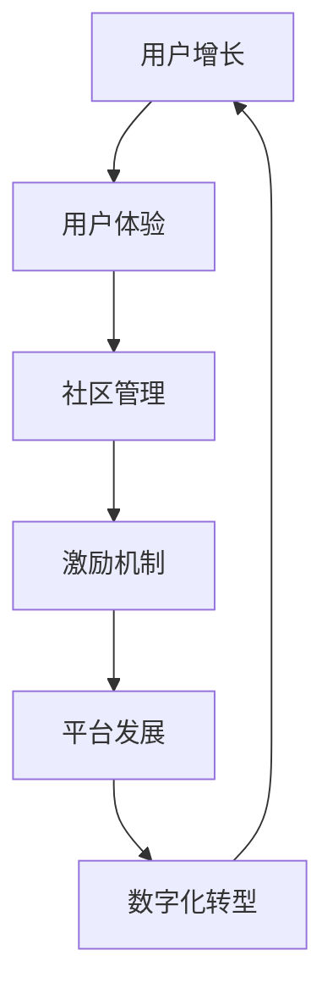

                 

# 技术社区运营：从0到10000用户

> 关键词：社区运营，用户增长，技术博客，用户体验，社区管理，激励机制，平台发展，数字化转型，AI和ML，数据驱动决策

## 1. 背景介绍

### 1.1 问题由来

在技术日新月异的时代，技术社区成为了连接技术爱好者、开发者、企业的桥梁，为技术交流、知识共享、人才培养提供了重要平台。然而，社区运营并非易事，从0到10000用户，背后涉及众多因素。本文旨在从用户增长、用户体验、社区管理、激励机制等多个维度，深入探讨技术社区运营的策略和实践，帮助技术社区从0起步，逐步成长为繁荣的生态。

### 1.2 问题核心关键点

- **用户增长**：如何吸引并留住用户，是社区运营的首要目标。
- **用户体验**：优化社区产品功能，提供良好的使用体验，提升用户黏性。
- **社区管理**：制定科学的管理制度，维护社区秩序，促进健康发展。
- **激励机制**：设计有效的激励措施，激发用户参与，促进社区活跃度。
- **平台发展**：建立完善的平台架构，支持社区规模化、可持续化发展。
- **数字化转型**：利用AI和ML技术，提升社区运营的智能化水平。

### 1.3 问题研究意义

技术社区运营的成功与否，直接关系到技术的传播、交流和应用。一个健康活跃的技术社区，能够推动技术创新、促进人才交流、加速企业数字化转型。本文通过对技术社区运营策略的系统梳理，旨在为社区运营者提供实用的指导，助力社区从零起步，逐步成为行业内外的重要资源和交流平台。

## 2. 核心概念与联系

### 2.1 核心概念概述

- **技术社区**：基于共同的技术兴趣和目标，组织起来的网络平台。
- **用户增长**：通过多种手段吸引新用户，并提升用户留存率的过程。
- **用户体验**：用户在使用社区产品时的感受和满意度。
- **社区管理**：制定并执行社区规则，维护社区秩序和生态。
- **激励机制**：通过奖励、积分、认证等手段，激励用户积极参与。
- **平台发展**：构建稳定、可扩展的技术架构，支持社区长期发展。
- **数字化转型**：利用AI和ML技术，提升社区运营效率和智能化水平。

这些概念相互联系，共同构成了技术社区运营的基础。通过科学的管理和运营，可以有效地吸引用户、提升体验、促进交流、激发参与，从而推动社区健康发展。

### 2.2 核心概念原理和架构的 Mermaid 流程图



## 3. 核心算法原理 & 具体操作步骤

### 3.1 算法原理概述

技术社区运营的核心算法原理在于用户增长、用户体验、社区管理、激励机制等各个维度的科学分析和优化。通过数据驱动、策略迭代，不断提升社区的整体活跃度和健康度。

### 3.2 算法步骤详解

**Step 1: 用户画像分析**
- 收集社区用户的基本信息，如年龄、职业、技术背景等。
- 分析用户行为数据，如访问频率、活跃时段、参与内容等。

**Step 2: 需求分析与定位**
- 通过问卷调查、用户访谈等方式，深入了解用户需求和期望。
- 根据用户画像和需求分析，定位社区的核心价值和目标用户群体。

**Step 3: 产品设计与优化**
- 根据需求分析结果，设计社区产品功能和界面。
- 通过A/B测试等方式，不断优化产品功能，提升用户体验。

**Step 4: 激励机制设计**
- 设计奖励体系，如积分、认证、特权等，激励用户参与。
- 定期推出活动和挑战，提高用户参与度。

**Step 5: 社区规则制定**
- 制定明确的社区规则，维护社区秩序。
- 定期监控社区动态，处理违规行为，促进健康发展。

**Step 6: 数据驱动决策**
- 利用数据分析工具，监控社区运营的关键指标，如用户增长率、活跃度、留存率等。
- 通过数据驱动的方式，不断优化运营策略。

### 3.3 算法优缺点

**优点**：
- 科学分析用户需求，优化产品体验，提升用户满意度。
- 通过数据驱动，动态调整运营策略，确保社区健康发展。
- 设计合理的激励机制，激发用户参与，促进社区活跃。

**缺点**：
- 需要大量数据支持，数据采集和处理成本较高。
- 策略迭代周期较长，需要持续投入资源。
- 数据隐私和安全问题，需严格遵守法律法规。

### 3.4 算法应用领域

社区运营的算法和策略，广泛应用于各类技术社区，包括开源社区、技术论坛、开发者社区等。无论是在企业内外部，还是在行业领域内，技术社区运营的算法和策略都具有普适性。

## 4. 数学模型和公式 & 详细讲解 & 举例说明

### 4.1 数学模型构建

假设社区有 $N$ 个用户，每个用户的活跃度为 $a_i$（$i=1,2,\cdots,N$），社区的平均活跃度为 $\bar{a}$。社区的总用户增长率 $G$ 为：

$$
G = \frac{\sum_{i=1}^{N}a_i}{N \times \bar{a}}
$$

其中，$\sum_{i=1}^{N}a_i$ 表示社区总活跃度，$N \times \bar{a}$ 表示社区总用户活跃度的均值。

### 4.2 公式推导过程

为了提升社区的用户增长率 $G$，可以引入用户激励机制 $I$，计算公式如下：

$$
G(I) = \frac{\sum_{i=1}^{N}a_i(I)}{N \times \bar{a}(I)}
$$

其中，$a_i(I)$ 表示在激励机制 $I$ 下用户的活跃度。

通过优化激励机制 $I$，可以显著提升社区的用户增长率。例如，在开源社区中，通过引入代码贡献积分，可以激励开发者贡献更多的代码，提升社区的技术含量和活跃度。

### 4.3 案例分析与讲解

假设某开源社区有 $N=1000$ 个用户，每个用户的平均活跃度为 $\bar{a}=0.5$。在引入代码贡献积分激励机制前，社区的总活跃度为 $\sum_{i=1}^{1000}a_i=500$。引入激励机制后，社区总活跃度提升至 $\sum_{i=1}^{1000}a_i(I)=700$，用户增长率提升至：

$$
G(I) = \frac{700}{1000 \times 0.5} = 1.4
$$

这意味着，引入代码贡献积分机制后，社区的用户增长率提升了40%。

## 5. 项目实践：代码实例和详细解释说明

### 5.1 开发环境搭建

为了实现上述算法和策略，需要先搭建相应的开发环境。以下是使用Python进行社区运营数据分析的开发环境配置流程：

1. 安装Python：从官网下载并安装Python 3.x版本。
2. 安装相关库：使用pip安装numpy、pandas、matplotlib、tqdm等库。
3. 设置虚拟环境：创建虚拟环境，使用venv或conda工具。
4. 安装数据分析工具：如Jupyter Notebook、JupyterLab等。

### 5.2 源代码详细实现

以下是一个简单的Python代码示例，用于计算社区的用户增长率：

```python
import numpy as np
import pandas as pd

# 假设社区有1000个用户，每个用户的活跃度为0.5
N = 1000
a_mean = 0.5

# 激励机制前，社区总活跃度为500
a_total = 500

# 激励机制后，社区总活跃度提升至700
a_total_after = 700

# 计算激励机制前后的用户增长率
G_before = a_total / (N * a_mean)
G_after = a_total_after / (N * a_mean)

print(f"激励机制前的用户增长率: {G_before}")
print(f"激励机制后的用户增长率: {G_after}")
```

### 5.3 代码解读与分析

代码通过计算激励机制前后的总活跃度和平均活跃度，得出社区的用户增长率。通过简单的数学计算，展示了激励机制对社区用户增长率的显著提升。

## 6. 实际应用场景

### 6.1 开源社区

开源社区是技术社区运营的重要领域。通过引入代码贡献积分、技术交流会、项目贡献奖励等激励机制，可以显著提升社区的活跃度和技术含量。例如，GitHub作为全球最大的开源社区，通过引入Star、Fork、Pull Request等功能，极大地促进了社区的发展和技术的传播。

### 6.2 技术论坛

技术论坛是技术爱好者交流技术知识的重要平台。通过优化论坛功能、引入积分奖励、举办技术挑战等措施，可以提升论坛的用户活跃度和内容质量。例如，Stack Overflow通过积分系统、徽章认证等方式，激励用户积极参与技术交流和问题解答，成为全球最大的开发者问答社区。

### 6.3 开发者社区

开发者社区是连接企业和开发者的重要桥梁。通过提供丰富的技术资源、举办技术培训、促进企业招聘等措施，可以吸引并留住开发者。例如，开发者社区CSDN通过技术文章、技术问答、招聘信息等功能，汇聚了大量技术开发者，成为国内领先的开发者社区。

### 6.4 未来应用展望

未来，随着AI和ML技术的不断进步，技术社区运营将更加智能化、数据化。AI驱动的个性化推荐系统、智能问答系统、用户行为预测等技术，将进一步提升社区的用户体验和运营效率。例如，百度知道通过引入AI驱动的智能问答系统，显著提升了用户问题解答的准确率和满意度。

## 7. 工具和资源推荐

### 7.1 学习资源推荐

- **《社区运营的艺术》**：介绍社区运营的基础知识和实战经验，适合新手入门。
- **《数据驱动的产品运营》**：深入剖析数据在产品运营中的应用，适合中高级开发者。
- **《技术社区的构建与运营》**：系统讲解技术社区的构建和运营策略，适合社区运营管理者。
- **GitHub官方文档**：详细介绍了GitHub社区的运营和管理策略，适合开源社区运营者。
- **Stack Overflow官方博客**：分享了Stack Overflow社区的成功运营经验，适合技术论坛运营者。

### 7.2 开发工具推荐

- **Jupyter Notebook**：免费的开源工具，支持代码编写、数据可视化、交互式数据分析等功能。
- **JupyterLab**：基于Web的交互式数据分析平台，支持Python、R、SQL等多种编程语言。
- **Visual Studio Code**：轻量级的代码编辑器，支持丰富的扩展和插件。
- **GitHub Desktop**：官方桌面应用，支持本地代码管理和社区协作。
- **Slack**：流行的即时通讯工具，适合社区内部的沟通协作。

### 7.3 相关论文推荐

- **《社区运营的策略与实践》**：介绍了社区运营的基本策略和实践经验，适合理论学习。
- **《用户增长策略的科学分析》**：探讨了用户增长的科学分析方法，适合数据分析师。
- **《技术社区的可持续发展》**：研究了技术社区的可持续发展策略，适合社区管理者。
- **《技术社区的激励机制设计》**：深入剖析了社区激励机制的设计和应用，适合社区运营者。

## 8. 总结：未来发展趋势与挑战

### 8.1 研究成果总结

本文通过对技术社区运营的深入探讨，系统梳理了社区运营的核心概念和关键策略。通过用户画像分析、需求定位、产品优化、激励机制设计、社区规则制定等环节，逐步构建了一个完整、科学的技术社区运营框架。

### 8.2 未来发展趋势

未来，技术社区运营将朝着更加智能化、数据化的方向发展。AI和ML技术的不断进步，将为社区运营带来更多的机遇和挑战。通过智能化的用户推荐系统、精准化的数据分析、个性化的社区内容，将进一步提升社区的用户体验和运营效率。

### 8.3 面临的挑战

尽管技术社区运营已经取得了一定的成果，但在快速发展的过程中，仍面临诸多挑战。例如，用户隐私保护、数据安全、社区管理等问题的处理，需要社区运营者持续投入资源，不断优化和改进。

### 8.4 研究展望

未来，社区运营的研究将更多地关注智能化、数据化、个性化等方面。如何利用AI和ML技术提升社区运营的智能化水平，如何通过数据驱动的方式，优化社区运营策略，都是值得深入探索的问题。

## 9. 附录：常见问题与解答

**Q1: 社区运营的核心指标有哪些？**

A: 社区运营的核心指标包括用户增长率、活跃度、留存率、用户满意度等。通过监控这些关键指标，可以评估社区运营的效果，并进行优化调整。

**Q2: 如何提升社区的用户留存率？**

A: 提升用户留存率的关键在于提供优质的用户体验。可以通过优化产品功能、增强社区互动、定期推出活动等方式，提升用户的满意度和忠诚度。

**Q3: 社区激励机制的设计原则是什么？**

A: 社区激励机制的设计原则包括公平性、透明性、多样性等。激励机制应尽可能覆盖所有用户群体，并通过透明的规则和标准，保持激励机制的公平性和公正性。

**Q4: 社区的可持续发展策略有哪些？**

A: 社区的可持续发展策略包括建立完善的平台架构、引入标准化流程、加强社区文化建设等。通过不断优化社区结构和运营模式，确保社区的长期稳定发展。

**Q5: 如何利用AI和ML技术提升社区运营效率？**

A: 利用AI和ML技术，可以进行用户行为预测、智能推荐、自动审核等，提升社区运营的智能化水平。例如，通过AI驱动的智能推荐系统，可以个性化推荐内容，提升用户活跃度。

---

作者：禅与计算机程序设计艺术 / Zen and the Art of Computer Programming

