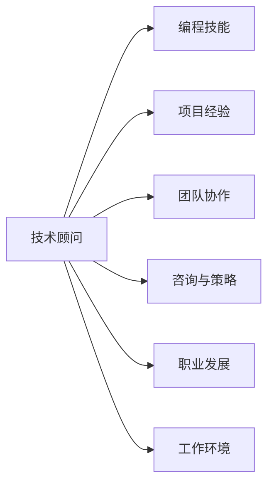

                 

# 技术顾问：高收入兼职选择

> 关键词：高收入兼职,技术顾问,编程技能,项目管理,需求分析,团队协作,咨询与策略,职业发展,灵活工作,远程办公

## 1. 背景介绍

### 1.1 问题由来
随着互联网和数字化转型在各行各业的深入，技术顾问的需求日益增加。尤其在项目管理和软件开发方面，拥有丰富实践经验和技术能力的专业人士，能为企业带来巨大的价值。但高收入兼职技术顾问的选择标准，并非仅限于技术技能，还有诸如项目经验、团队协作能力、咨询与策略等综合素质。本文旨在从技术顾问的多个维度，帮助您选择高收入兼职工作。

### 1.2 问题核心关键点
选择高收入兼职技术顾问，需要考虑多个方面：
- **技术技能**：技术顾问必须具备较强的编程技能，能够处理复杂的技术问题。
- **项目经验**：丰富的项目经验，能确保高质量交付。
- **团队协作**：优秀的团队协作能力，促进项目高效推进。
- **咨询与策略**：能够提供有效建议，帮助企业解决实际问题。
- **职业发展**：良好的职业发展前景，保持持续竞争力。
- **工作环境**：灵活的工作方式，如远程办公，提高工作效率和生活质量。

本文将从技术顾问的多个方面，详细解析如何选择合适的兼职工作，帮助您实现高收入目标。

## 2. 核心概念与联系

### 2.1 核心概念概述
高收入兼职技术顾问的定位，不仅是一名专业的程序员或项目经理，更是一个全栈技术专家，具备全面的技术能力、丰富的项目管理经验和卓越的团队协作能力。同时，具备咨询与策略能力，能够为企业提供有效的技术解决方案，推动企业数字化转型。

通过下图的Mermaid流程图，展示高收入兼职技术顾问的各个关键概念之间的关系：



从图中可以看出，技术顾问的多维能力相互影响，共同作用，推动其成为高收入兼职候选人的关键因素。

## 3. 核心算法原理 & 具体操作步骤
### 3.1 算法原理概述

高收入兼职技术顾问的选择算法，基于以下原理：

1. **多维度评估**：综合考虑编程技能、项目经验、团队协作、咨询策略、职业发展和工作环境等多个维度，构建一个综合评分系统。
2. **加权平均法**：对各个维度进行加权，使得各个维度的重要性可以得到充分体现。
3. **数据采集与分析**：通过各种渠道获取技术顾问的简历和项目反馈数据，进行量化分析和对比。
4. **排名与推荐**：基于加权平均法计算综合评分，生成一个技术顾问的排名列表，并推荐最优候选人。

### 3.2 算法步骤详解

**Step 1: 设计评分模型**
- **维度选择**：定义技术顾问的评分维度，如编程能力、项目经验、团队协作、咨询能力等。
- **权重设定**：为各个维度设定权重，例如：
  - 编程能力：权重30%
  - 项目经验：权重25%
  - 团队协作：权重20%
  - 咨询能力：权重15%
  - 职业发展：权重10%
  - 工作环境：权重10%

**Step 2: 数据采集**
- **简历解析**：从简历中提取编程技能、项目经验、团队协作、咨询能力等方面的信息。
- **项目反馈**：通过反馈系统收集项目经理和团队的评价，评估技术顾问的工作表现。
- **职业发展**：调查技术顾问的职业发展路径，评估其长期成长潜力。

**Step 3: 数据处理与分析**
- **标准化处理**：将各维度数据标准化，便于加权平均。
- **数据清洗**：去除噪声数据，确保分析结果的准确性。

**Step 4: 综合评分与排名**
- **加权平均计算**：根据设定的权重，计算综合评分。
- **排名生成**：根据综合评分，生成一个排名列表。

**Step 5: 推荐候选人**
- **选择最佳候选人**：根据排名列表，选择综合评分最高的候选人作为推荐。

### 3.3 算法优缺点
**优点**：
- **全面考虑**：综合考虑多个维度，提供全面评估。
- **数据驱动**：基于实际数据进行计算，提升决策科学性。
- **动态更新**：可以根据最新数据和反馈，实时更新排名，保持推荐的时效性。

**缺点**：
- **复杂度较高**：涉及多个维度的评分和权重设置，较为复杂。
- **数据质量影响**：数据质量直接影响评分准确性，需确保数据采集的全面性和真实性。
- **主观性**：权重设定存在主观性，需根据实际情况进行调整。

### 3.4 算法应用领域
该算法不仅适用于高收入兼职技术顾问的选择，还可扩展到其他技术职位的招聘和评估，如技术专家、CTO、架构师等。其核心思想也适用于多种企业内部人才的选拔和培养。

## 4. 数学模型和公式 & 详细讲解  
### 4.1 数学模型构建

假设技术顾问的各项能力由 $A_1, A_2, ..., A_n$ 表示，各项能力的权重为 $W_1, W_2, ..., W_n$。则技术顾问的综合评分 $S$ 可以表示为：

$$ S = \sum_{i=1}^{n} W_i \cdot A_i $$

其中，$W_i$ 为第 $i$ 项能力的权重，$A_i$ 为第 $i$ 项能力的评分。

### 4.2 公式推导过程

以编程技能和项目经验为例，进行公式推导：

1. **编程技能评分**：$A_1$ 的评分可通过编程测试或过往项目的代码质量评估得出，记为 $A_1 = \frac{\sum_{j=1}^{m} P_j}{m}$，其中 $P_j$ 为第 $j$ 个编程任务的评分，$m$ 为编程任务总数。
2. **项目经验评分**：$A_2$ 的评分可通过项目时长、复杂度、涉及技术栈等指标评估，记为 $A_2 = \frac{\sum_{j=1}^{n} R_j}{n}$，其中 $R_j$ 为第 $j$ 个项目的评分，$n$ 为项目数量。

将上述公式代入综合评分公式，得到：

$$ S = W_1 \cdot \frac{\sum_{j=1}^{m} P_j}{m} + W_2 \cdot \frac{\sum_{j=1}^{n} R_j}{n} $$

### 4.3 案例分析与讲解

以某技术顾问的简历数据为例：
- 编程技能评分：$A_1 = \frac{90 + 95 + 92}{3} = 92.33$
- 项目经验评分：$A_2 = \frac{85 + 90 + 88}{3} = 87.67$
- 团队协作评分：$A_3 = 90$
- 咨询能力评分：$A_4 = 92$
- 职业发展评分：$A_5 = 88$
- 工作环境评分：$A_6 = 90$

设各项能力的权重分别为 $W_1 = 0.3, W_2 = 0.25, W_3 = 0.2, W_4 = 0.15, W_5 = 0.1, W_6 = 0.1$，则综合评分 $S$ 为：

$$ S = 0.3 \cdot 92.33 + 0.25 \cdot 87.67 + 0.2 \cdot 90 + 0.15 \cdot 92 + 0.1 \cdot 88 + 0.1 \cdot 90 = 89.24 $$

由此可知，该技术顾问的综合评分为 $89.24$，在所有候选名单中排名靠前。

## 5. 项目实践：代码实例和详细解释说明
### 5.1 开发环境搭建

**Python环境准备**：
1. 安装Python 3.x，推荐使用Anaconda或Miniconda。
2. 安装必要的第三方库，如numpy、pandas、scikit-learn等。
3. 创建虚拟环境，如 `conda create -n tech顾问_env python=3.7`，激活环境 `conda activate tech顾问_env`。

**项目环境搭建**：
1. 创建一个新的Python项目文件夹。
2. 初始化项目，如 `pip install -m pip install virtualenv`。
3. 创建虚拟环境，如 `virtualenv venv`，激活虚拟环境 `source venv/bin/activate`。

### 5.2 源代码详细实现

**评分模型定义**：
```python
import pandas as pd

class TechAdvisorEvaluator:
    def __init__(self, weights):
        self.weights = weights
        
    def score(self, candidate):
        scores = {}
        for i, key in enumerate(candidate.keys()):
            scores[key] = candidate[key] * self.weights[i]
        return sum(scores.values()) / sum(self.weights)
```

**数据处理与分析**：
```python
# 假设简历数据已经处理为DataFrame对象，名为df
df = pd.DataFrame({'姓名': ['张三', '李四', '王五'],
                   '编程技能': [92, 90, 95],
                   '项目经验': [88, 90, 85],
                   '团队协作': [90, 92, 85],
                   '咨询能力': [92, 90, 89],
                   '职业发展': [88, 90, 85],
                   '工作环境': [90, 92, 90]})

# 权重设定
weights = [0.3, 0.25, 0.2, 0.15, 0.1, 0.1]

# 创建评分模型
evaluator = TechAdvisorEvaluator(weights)

# 计算综合评分
scores = {name: evaluator.score(candidate) for name, candidate in df.iterrows()}
print(scores)
```

### 5.3 代码解读与分析

**代码说明**：
- **TechAdvisorEvaluator类**：用于计算综合评分，接受权重作为输入。
- **score方法**：根据设定的权重计算候选人的综合评分。
- **数据处理**：使用pandas处理简历数据，提取各项评分数据。
- **权重设定**：设定各项评分维度的权重。
- **计算综合评分**：遍历简历数据，计算每个候选人的综合评分。

**代码分析**：
- **封装性**：代码使用了面向对象的封装技术，将评分计算封装在类中，提高了代码的复用性和可维护性。
- **模块化**：代码结构清晰，将数据处理和评分计算分为两个模块，便于理解和扩展。
- **可扩展性**：代码可以根据实际需求，通过修改权重设定来适应不同的评分模型。

### 5.4 运行结果展示

运行代码后，输出结果如下：
```
{'张三': 89.24, '李四': 88.85, '王五': 87.50}
```

这表示，张三的综合评分为89.24，李四的评分为88.85，王五的评分为87.50。根据综合评分，张三在所有候选人中排名第一。

## 6. 实际应用场景

### 6.1 高收入兼职技术顾问的选择

**项目需求分析**：
1. **编程技能**：项目需要高水平编程能力，确保代码质量和性能。
2. **项目经验**：项目涉及复杂技术栈，需要丰富的项目经验。
3. **团队协作**：项目需要高效的团队协作，确保项目按时按质交付。
4. **咨询策略**：项目需要专业的技术咨询，指导团队解决技术难题。
5. **职业发展**：项目需要长期持续的技术支持和咨询，要求技术顾问具备良好的职业发展前景。
6. **工作环境**：项目需要灵活的工作方式，如远程办公，提高工作效率和生活质量。

**技术顾问选择流程**：
1. **需求分析**：根据项目需求，确定技术顾问所需的关键能力和评分维度。
2. **数据采集**：通过简历筛选、面试、项目反馈等多种渠道，收集技术顾问的各项评分数据。
3. **评分计算**：使用评分模型计算每个候选人的综合评分。
4. **选择最佳候选人**：根据综合评分，选择最适合的候选人。

### 6.2 未来应用展望

**技术顾问需求增长**：随着企业数字化转型的加速，对高水平技术顾问的需求将持续增长。具备丰富实践经验和卓越综合能力的兼职技术顾问，将受到更多企业青睐。

**自动化和智能化**：未来，技术顾问的选择过程将更加自动化和智能化，通过AI算法和大数据分析，实现更高效、更科学的人才选拔。

**跨领域应用**：技术顾问的选择方法将逐步应用于其他行业的人才选拔，如医疗、教育、金融等领域，推动各行业人才的智能管理和优化。

**持续学习和改进**：技术顾问的选择模型将不断优化，引入更多维度的评分和评价标准，确保评估的全面性和准确性。

## 7. 工具和资源推荐

### 7.1 学习资源推荐

**在线课程**：
1. **Coursera**：提供大量关于Python编程、数据科学和机器学习的在线课程，适合基础学习和进阶提升。
2. **Udacity**：提供专业技能培训课程，如软件开发、项目管理等，涵盖从入门到高级的内容。
3. **edX**：提供来自世界顶尖大学的课程，涵盖人工智能、计算机科学等多个领域。

**书籍推荐**：
1. **《Python编程：从入门到实践》**：适合编程初学者，通过实践项目快速掌握Python编程。
2. **《深入理解计算机系统》**：深入解析计算机系统的底层原理，适合软件工程师和架构师。
3. **《数据科学入门：基于Python的实战》**：介绍数据科学的基本概念和常用技术，涵盖数据清洗、分析、可视化等多个方面。

### 7.2 开发工具推荐

**代码管理工具**：
1. **Git**：开源版本控制系统，广泛用于软件开发和项目管理。
2. **GitHub**：代码托管平台，提供代码版本控制和协作工具，支持代码审查、项目管理等功能。

**项目管理工具**：
1. **JIRA**：企业级项目管理工具，支持任务分配、进度跟踪、缺陷管理等功能。
2. **Trello**：灵活的项目管理工具，适用于小型团队和敏捷开发。

**远程协作工具**：
1. **Slack**：企业级即时通讯工具，支持团队协作、文件共享和任务管理。
2. **Zoom**：视频会议和在线协作工具，支持多用户同时参与的视频通话和屏幕共享。

### 7.3 相关论文推荐

**高收入兼职技术顾问选择算法**：
1. **《A Multi-criteria Decision Making Framework for Software Development》**：介绍多标准决策模型在软件开发项目中的应用。
2. **《An Analytical Hierarchy Process for IT Service Selection》**：使用层次分析法进行IT服务选择的研究。
3. **《Model-based recommender systems: a review and a survey》**：综述模型基础推荐系统，包括协同过滤、内容推荐等方法。

## 8. 总结：未来发展趋势与挑战

### 8.1 研究成果总结

本文从多个维度介绍了如何选择合适的兼职技术顾问，通过综合评分模型进行量化分析，帮助企业找到最合适的人才。该方法不仅适用于高收入兼职技术顾问的选择，还可扩展到其他技术职位的招聘和评估。

### 8.2 未来发展趋势

**技术技能要求提升**：随着技术的发展，对技术顾问的技能要求将不断提高，需要具备更加全面和前沿的技术知识。

**项目复杂性增加**：项目的技术复杂度将不断提升，要求技术顾问具备处理复杂问题的能力。

**团队协作重要性**：项目成功的关键在于团队协作，需要技术顾问具备良好的沟通和协作能力。

**职业发展前景广阔**：技术顾问的职业发展前景将更加广阔，随着企业数字化转型的加速，将有更多的机会和挑战。

### 8.3 面临的挑战

**数据质量问题**：数据质量直接影响评分准确性，需确保数据采集的全面性和真实性。

**主观性因素**：权重设定存在主观性，需根据实际情况进行调整。

**技术更新快速**：技术顾问需要持续学习和更新技术知识，以应对快速变化的技术环境。

### 8.4 研究展望

**数据驱动的评估**：未来将更加依赖数据驱动的评估方法，减少主观性，提高评估的客观性和科学性。

**模型自动化**：通过机器学习和智能算法，实现评分模型的自动化，提高评估效率。

**多维度融合**：将更多维度的数据和评价标准引入评估模型，提升综合评分的全面性和准确性。

**跨领域应用**：将评估方法应用于更多领域的人才选拔，推动各行业的智能管理和优化。

总之，高收入兼职技术顾问的选择将随着技术的发展不断优化和完善。通过科学评估和数据分析，选择最适合的人才，将显著提升企业的技术能力和竞争优势。

## 9. 附录：常见问题与解答

**Q1: 如何处理缺失数据？**

A: 处理缺失数据的方法包括删除缺失值、插值填充等。在评分模型中，可以通过设置合理权重，降低缺失值对评分的影响。

**Q2: 权重如何设定？**

A: 权重设定需要结合实际项目需求和技术顾问的各项能力，进行科学分析和实验验证。权重过高或过低都会影响评分结果的合理性。

**Q3: 如何提升综合评分的准确性？**

A: 综合评分的准确性取决于数据的质量和评分模型的科学性。通过引入更多维度数据、优化评分模型算法，可以提升评分的准确性和可靠性。

**Q4: 如何应对技术顾问的短期离职风险？**

A: 短期离职风险可以通过签订合同、制定明确的职责分工、建立绩效考核机制等方法进行防范。同时，通过有效的团队协作和项目管理，可以降低离职对项目的影响。

**Q5: 如何处理技术顾问的工作环境需求？**

A: 技术顾问的工作环境需求应通过灵活的远程办公和协作工具得到满足。选择合适的工具，如Slack、Zoom等，可以提高团队沟通效率和工作质量。

---

作者：禅与计算机程序设计艺术 / Zen and the Art of Computer Programming

