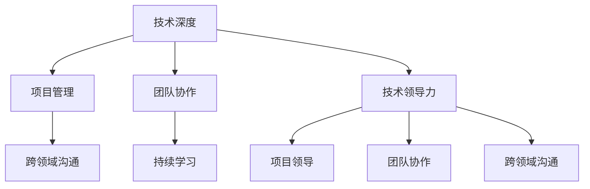

                 

# 技术领导力：提升职场价值

> 关键词：技术领导力,职场价值,软件开发,项目管理,产品管理,创新,团队建设,跨领域协作

## 1. 背景介绍

### 1.1 问题由来
在数字化时代，技术已不再是某个部门的专属领域，而是渗透到企业的各个环节。掌握技术领导力的领导者，能够在团队、组织乃至整个行业中发挥关键作用，驱动企业的持续创新与变革。然而，当前很多技术人员、项目管理者和产品负责人缺乏系统的技术领导力培养体系，导致他们在推进技术项目时遇到诸多挑战。如何在技术驱动的职场中提升自身价值，成为一名优秀的技术领导者？本文将系统介绍技术领导力的关键要素，并结合实际案例，提供实用的培养方法和建议。

### 1.2 问题核心关键点
技术领导力是指在技术驱动的职场中，通过技术专业能力和领导管理能力的协同提升，引领团队实现技术目标的能力。技术领导力的核心要素包括技术深度、项目领导、团队协作、跨领域沟通、持续学习等。掌握技术领导力的关键在于：
- **技术深度**：在特定技术领域具有深厚的专业知识和技能。
- **项目领导**：具备项目管理的基本知识和方法，能高效推动技术项目的实施。
- **团队协作**：能够建立高效的团队协作机制，充分发挥团队成员的潜力。
- **跨领域沟通**：具备与非技术人员沟通的能力，确保技术目标与业务目标的一致性。
- **持续学习**：不断更新技术知识，紧跟技术发展的趋势。

本文将从技术领导力的关键要素出发，系统介绍如何通过多方面的努力，提升技术领导力，从而在职场中发挥更大的价值。

## 2. 核心概念与联系

### 2.1 核心概念概述

为更好地理解技术领导力的构成和应用，本节将介绍几个密切相关的核心概念：

- **技术领导力(Technical Leadership)**：通过技术专业能力和领导管理能力的协同提升，引领团队实现技术目标的能力。
- **技术深度(Technical Depth)**：在特定技术领域具有深厚的专业知识和技能，包括技术原理、实现细节、性能调优等。
- **项目管理(Project Management)**：通过计划、组织、协调、控制等活动，使项目按期、按质、按量完成。
- **团队协作(Team Collaboration)**：通过合理的团队结构和有效的沟通机制，使团队成员发挥协同效应，高效完成任务。
- **跨领域沟通(Cross-Domain Communication)**：具备与非技术人员沟通的能力，确保技术目标与业务目标的一致性。
- **持续学习(Lifelong Learning)**：通过不断学习新知识、新技能，适应技术发展的变化。

这些核心概念之间的逻辑关系可以通过以下Mermaid流程图来展示：



这个流程图展示出技术领导力各要素之间的逻辑关系：

1. 技术深度是技术领导力的基石，为项目管理、团队协作和跨领域沟通提供专业支撑。
2. 项目管理、团队协作和跨领域沟通是技术领导力的具体体现，能够确保技术目标的顺利实现。
3. 技术领导力通过项目管理、团队协作和跨领域沟通，进一步提升技术深度和持续学习，形成正向循环。

## 3. 核心算法原理 & 具体操作步骤
### 3.1 算法原理概述

技术领导力的提升，本质上是一个系统性的学习与实践过程。通过不断学习和实践，逐渐在技术深度、项目管理、团队协作、跨领域沟通和持续学习等方面取得进步，最终形成一个全面的技术领导力体系。

### 3.2 算法步骤详解

技术领导力的提升可以分为以下几个关键步骤：

**Step 1: 自我评估**
- 分析自身在技术深度、项目管理、团队协作、跨领域沟通和持续学习等方面的现状。
- 确定提升目标，明确需要加强的领域。

**Step 2: 制定学习计划**
- 根据自我评估结果，制定有针对性的学习计划，包括技术书籍、在线课程、实战项目等。
- 设置学习进度，定期进行自我检查和调整。

**Step 3: 深化技术知识**
- 通过阅读专业书籍、参加技术讲座、参与开源项目等方式，不断扩展技术深度。
- 选择具有挑战性的项目，进行深度学习和实践。

**Step 4: 项目管理实践**
- 参与或主导项目管理实战项目，熟悉项目计划、进度跟踪、风险管理等技能。
- 学习并应用敏捷开发、Scrum、Kanban等项目管理方法。

**Step 5: 团队协作提升**
- 在团队中承担不同角色，如技术导师、项目经理等，提升协作能力。
- 建立高效的沟通机制，如定期站立会、代码审查等，促进团队协作。

**Step 6: 跨领域沟通训练**
- 参与业务相关的项目，与非技术人员深入交流，理解业务需求。
- 学习并应用沟通技巧，如清晰表达技术问题、使用比喻等。

**Step 7: 持续学习与创新**
- 定期参加技术研讨会、行业会议，了解最新的技术动态。
- 尝试新技术、新工具，提升技术敏感性和创新能力。

### 3.3 算法优缺点

技术领导力的提升方法具有以下优点：
- 系统全面。通过多方面的学习和实践，逐步提升技术领导力。
- 实用性高。基于实际项目和团队协作的实践，提升能力更具针对性。
- 适应性强。根据个人需求和学习进度，灵活调整学习计划。

同时，该方法也存在一定的局限性：
- 时间投入大。技术深度、项目管理等领域的提升，需要较长的时间积累。
- 资源需求高。高强度的学习和实践，需要较多的学习资源和实战机会。
- 效果难以量化。技术领导力的提升更多依赖软技能的提升，难以用数据量化。

尽管存在这些局限性，但整体而言，该方法提供了系统的提升路径，有助于在技术驱动的职场中提升个人价值和团队绩效。

### 3.4 算法应用领域

技术领导力的方法在各个技术驱动的领域都有广泛的应用，例如：

- 软件开发：在项目开发中，通过技术深度和项目管理，带领团队实现高质量的软件交付。
- 数据分析：通过数据分析项目，提升数据挖掘、模型训练、结果解读等技能，实现数据驱动的业务决策。
- 人工智能：在AI项目中，通过技术深度和团队协作，提升模型性能和应用效果。
- 网络安全：通过安全事件响应、系统漏洞修复等项目，提升安全防护能力和团队协作能力。
- 云计算：通过云服务部署、性能优化等项目，提升云平台管理和应用开发能力。

## 4. 数学模型和公式 & 详细讲解 & 举例说明

本节将使用数学语言对技术领导力的提升过程进行更加严格的刻画。

记技术领导力的提升为一个多阶段决策过程，设当前技术深度为 $D$，项目管理能力为 $P$，团队协作能力为 $C$，跨领域沟通能力为 $K$，持续学习能力为 $L$。设提升后各项能力分别为 $D'$，$P'$，$C'$，$K'$，$L'$。

设学习计划中，技术深度、项目管理、团队协作、跨领域沟通和持续学习的权重分别为 $\alpha$，$\beta$，$\gamma$，$\delta$，$\epsilon$。则技术领导力的提升模型为：

$$
\begin{cases}
D' = D + \alpha f_D(D) \\
P' = P + \beta f_P(P) \\
C' = C + \gamma f_C(C) \\
K' = K + \delta f_K(K) \\
L' = L + \epsilon f_L(L)
\end{cases}
$$

其中 $f_X(X)$ 表示第 $X$ 项能力的提升函数。例如，对于技术深度提升，可以通过阅读专业书籍、参与开源项目等方式实现：

$$
f_D(D) = \sum_{i=1}^n f_{D_i}(D_i)
$$

其中 $D_i$ 表示第 $i$ 种提升方法，$f_{D_i}(D_i)$ 表示该方法提升技术深度的效果。类似地，项目管理、团队协作、跨领域沟通和持续学习的提升函数也有相应的定义。

## 5. 项目实践：代码实例和详细解释说明
### 5.1 开发环境搭建

在进行技术领导力提升的实践前，我们需要准备好开发环境。以下是使用Python进行开发的环境配置流程：

1. 安装Anaconda：从官网下载并安装Anaconda，用于创建独立的Python环境。

2. 创建并激活虚拟环境：
```bash
conda create -n tech-env python=3.8 
conda activate tech-env
```

3. 安装必要的Python包：
```bash
pip install numpy pandas scikit-learn tensorflow matplotlib
```

4. 安装Git、GitHub等版本控制工具，以及Jupyter Notebook等交互式开发环境。

完成上述步骤后，即可在`tech-env`环境中开始技术领导力提升的实践。

### 5.2 源代码详细实现

下面以技术深度提升为例，给出使用Python进行技术领导力提升的代码实现。

首先，定义技术深度的提升函数：

```python
import numpy as np

def improve_technical_depth(depth, method):
    if method == 'books':
        # 假设每本书提升0.1的技术深度
        return depth + 0.1
    elif method == 'projects':
        # 假设每个项目提升0.2的技术深度
        return depth + 0.2
    elif method == 'online_courses':
        # 假设每门在线课程提升0.05的技术深度
        return depth + 0.05
    else:
        return depth
```

然后，模拟多阶段的技术深度提升过程：

```python
initial_depth = 5.0

# 第一阶段：阅读专业书籍
depth_after_books = improve_technical_depth(initial_depth, 'books')

# 第二阶段：参与开源项目
depth_after_projects = improve_technical_depth(depth_after_books, 'projects')

# 第三阶段：参加在线课程
final_depth = improve_technical_depth(depth_after_projects, 'online_courses')

print(f"初始技术深度: {initial_depth}")
print(f"阅读书籍后: {depth_after_books}")
print(f"参与开源项目后: {depth_after_projects}")
print(f"参加在线课程后: {final_depth}")
```

以上代码展示了技术深度提升的基本流程。通过连续调用提升函数，模拟技术深度从初始状态逐步提升的过程。

### 5.3 代码解读与分析

让我们再详细解读一下关键代码的实现细节：

**improve_technical_depth函数**：
- 定义了三种提升技术深度的策略：阅读书籍、参与开源项目和参加在线课程。
- 根据选定的策略，计算提升后的技术深度。

**技术深度模拟提升过程**：
- 定义初始技术深度为5.0。
- 依次调用提升函数，模拟多阶段提升过程。
- 输出每一步提升后的技术深度。

可以看到，代码实现了技术深度提升的基本逻辑，反映了技术领导力提升的系统性方法。开发者可以根据具体需求，调整提升策略和参数，实现更为个性化的技术领导力提升。

## 6. 实际应用场景
### 6.1 技术驱动的软件开发

技术领导力在软件开发项目中尤为重要。一名优秀的技术领导者需要具备扎实的编程能力、项目管理和团队协作能力，能够高效推动项目进展，确保软件质量和交付进度。

在实践中，可以通过以下方式提升技术领导力：
- 在项目开发中，深入理解需求，提供技术方案，解决技术难题。
- 指导团队成员，提高编程技能和代码质量，提升整体团队的技术深度。
- 参与项目计划制定和进度跟踪，确保项目按时交付。
- 组织团队协作和代码审查，提高代码质量和团队凝聚力。

### 6.2 数据驱动的业务决策

数据分析项目中，技术领导力能够帮助数据分析师和数据科学家更好地理解业务需求，提升数据分析的准确性和实用性。

具体而言，可以通过以下方式提升技术领导力：
- 在数据分析项目中，与业务部门紧密合作，了解业务目标和需求。
- 运用数据挖掘和机器学习技术，提取有价值的洞察，支持业务决策。
- 建立数据可视化系统，使业务人员能够直观理解数据结果。
- 组织数据分享会和跨部门交流，促进业务和技术融合。

### 6.3 智能驱动的人工智能应用

在人工智能应用中，技术领导力能够确保模型性能和应用效果。通过提升技术深度和团队协作能力，技术领导者能够推动人工智能项目的成功实施。

具体而言，可以通过以下方式提升技术领导力：
- 在AI项目中，深入理解算法原理和模型训练过程，提升技术深度。
- 组织团队协作，共同解决模型训练中的技术难题，提升模型性能。
- 推动模型部署和应用，确保AI应用的效果和可扩展性。
- 建立AI应用的持续优化机制，及时更新模型，提升应用效果。

## 7. 工具和资源推荐
### 7.1 学习资源推荐

为了帮助开发者系统掌握技术领导力的关键要素，这里推荐一些优质的学习资源：

1. 《技术领导力修炼》系列博文：由知名技术专家撰写，系统介绍技术领导力的核心要素和实践方法。

2. 《软件工程原理》课程：斯坦福大学开设的软件工程经典课程，涵盖项目管理和团队协作的基本知识和方法。

3. 《数据科学与机器学习》书籍：详细介绍了数据科学和机器学习的核心技术，涵盖数据预处理、模型训练和结果解读等环节。

4. GitHub开源项目：加入知名的开源项目，通过实践提升技术领导力。例如，Google的TensorFlow、Facebook的PyTorch等。

5. Coursera在线课程：提供广泛的在线学习资源，涵盖技术领导力、项目管理、数据分析等领域的系统课程。

通过对这些资源的学习实践，相信你一定能够系统掌握技术领导力的精髓，并在实际项目中发挥更大的作用。

### 7.2 开发工具推荐

高效的开发离不开优秀的工具支持。以下是几款用于技术领导力提升开发的常用工具：

1. Git：版本控制工具，支持代码协同开发，促进团队协作。
2. GitHub：代码托管平台，提供丰富的协作工具和代码审查功能。
3. Jupyter Notebook：交互式开发环境，支持Python、R等语言，方便实时编写和调试代码。
4. Google Colab：在线Jupyter Notebook环境，免费提供GPU/TPU算力，方便快速实验最新模型。
5. GitHub Actions：自动化持续集成和部署工具，支持CI/CD流程，提升开发效率。

合理利用这些工具，可以显著提升技术领导力提升的开发效率，加快创新迭代的步伐。

### 7.3 相关论文推荐

技术领导力的发展源于学界的持续研究。以下是几篇奠基性的相关论文，推荐阅读：

1. 《软件开发的领导力》：探讨了软件开发中领导力的核心要素，提供了提升领导力的具体方法。

2. 《数据驱动的业务决策》：介绍了数据驱动业务决策的基本框架和实践方法，强调技术领导力在其中的作用。

3. 《人工智能领导力》：讨论了人工智能项目中领导力的关键要素，包括技术深度、项目管理、团队协作等。

4. 《技术领导力与组织创新》：研究了技术领导力对组织创新的影响，提供了提升技术领导力的创新路径。

这些论文代表了大领导力领域的发展脉络。通过学习这些前沿成果，可以帮助研究者把握学科前进方向，激发更多的创新灵感。

## 8. 总结：未来发展趋势与挑战

### 8.1 总结

本文对技术领导力的关键要素进行了全面系统的介绍。首先阐述了技术领导力在技术驱动的职场中的重要意义，明确了技术深度、项目管理、团队协作、跨领域沟通和持续学习等核心要素。其次，从原理到实践，详细讲解了技术领导力的提升过程，给出了系统化的提升方法和步骤。同时，本文还结合实际案例，展示了技术领导力在软件开发、数据分析和人工智能等不同领域的应用。

通过本文的系统梳理，可以看到，技术领导力提升是一个多维度、全方位的学习过程，需要系统化的规划和实践。只有持续学习和创新，才能不断提升个人价值，成为技术领域中的佼佼者。

### 8.2 未来发展趋势

展望未来，技术领导力的提升将呈现以下几个发展趋势：

1. 技术深度不断深化。随着技术领域的不断细分，技术领导力需要在更细化的技术领域中取得突破。
2. 项目管理方式多样化。敏捷开发、Scrum、Kanban等项目管理方式将得到更广泛的应用，提升项目管理和协作效率。
3. 团队协作机制多元化。通过多团队协作、跨团队交流等机制，促进知识共享和技术创新。
4. 跨领域沟通能力提升。随着数据和业务的融合，技术领导力需要更好地与业务领域进行沟通，确保技术目标和业务目标的一致性。
5. 持续学习成为常态。终身学习成为技术领导力的必备要素，技术领导力提升需要不断适应技术发展的变化。

以上趋势凸显了技术领导力提升的广阔前景。这些方向的探索发展，必将进一步提升技术领导力的系统性和实践性，为技术驱动的职场带来更多的价值和创新。

### 8.3 面临的挑战

尽管技术领导力的提升方法已经取得了一定的成效，但在实践中仍面临诸多挑战：

1. 技术深度提升难。技术深度需要长时间的积累和学习，难以在短时间内取得显著效果。
2. 项目管理复杂。项目管理涉及多方面的技能，如需求分析、进度跟踪、风险管理等，需要综合运用多种方法。
3. 团队协作难度大。不同背景、不同技能的团队成员需要高效的协作机制，以确保项目顺利实施。
4. 跨领域沟通困难。非技术人员对技术术语和业务需求的理解有限，技术领导力需要更好的沟通能力。
5. 持续学习压力大。技术快速发展的趋势，要求技术领导者不断学习和更新知识，难以平衡工作和学习。

尽管存在这些挑战，但通过系统化的学习与实践，这些挑战都是可以克服的。相信在不断探索和实践中，技术领导力将不断提升，引领技术驱动的职场向更高的目标迈进。

### 8.4 研究展望

面向未来，技术领导力的研究需要在以下几个方面寻求新的突破：

1. 探索更高效的提升方法。开发更加系统化和自动化的提升工具，帮助技术领导者更高效地提升技术深度、项目管理、团队协作、跨领域沟通和持续学习能力。
2. 引入更多跨学科知识。借鉴其他学科的方法和理论，如心理学、社会学等，提升技术领导的实践效果。
3. 加强团队建设。通过团队建设活动，增强团队凝聚力和协作效率，提升整体技术领导力水平。
4. 强化创新驱动。鼓励技术领导力创新，推动技术驱动的职场持续创新。

这些研究方向将进一步提升技术领导力的系统性和实效性，帮助技术领导者更好地应对未来的挑战和机遇。

## 9. 附录：常见问题与解答

**Q1：技术领导力提升需要哪些资源和工具？**

A: 技术领导力提升需要系统化的学习资源和实用的开发工具。常见的资源和工具包括：
1. 学习资源：如在线课程、专业书籍、技术博客等。
2. 开发工具：如Git、Jupyter Notebook、GitHub等。
3. 项目管理工具：如JIRA、Trello、Asana等。
4. 持续集成工具：如GitHub Actions、Jenkins等。

合理利用这些资源和工具，可以显著提升技术领导力提升的效率和效果。

**Q2：技术领导力提升的关键步骤是什么？**

A: 技术领导力提升的关键步骤包括：
1. 自我评估：分析自身在技术深度、项目管理、团队协作、跨领域沟通和持续学习等方面的现状。
2. 制定学习计划：根据自我评估结果，制定有针对性的学习计划，包括技术书籍、在线课程、实战项目等。
3. 深化技术知识：通过阅读专业书籍、参加技术讲座、参与开源项目等方式，不断扩展技术深度。
4. 项目管理实践：参与或主导项目管理实战项目，熟悉项目计划、进度跟踪、风险管理等技能。
5. 团队协作提升：在团队中承担不同角色，提升协作能力。
6. 跨领域沟通训练：参与业务相关的项目，与非技术人员深入交流，理解业务需求。
7. 持续学习与创新：定期参加技术研讨会、行业会议，了解最新的技术动态。

通过这些步骤的系统学习和实践，可以逐步提升技术领导力，实现技术驱动的职场价值提升。

**Q3：如何衡量技术领导力的提升效果？**

A: 技术领导力的提升效果可以通过以下几个方面来衡量：
1. 技术深度：通过技术评估、编程测试等方式，评估自身在特定技术领域的掌握程度。
2. 项目管理：通过项目进度、质量、成本等指标，评估项目管理的效果。
3. 团队协作：通过团队协作效率、代码质量、问题解决速度等指标，评估协作能力。
4. 跨领域沟通：通过与非技术人员沟通的频率和效果，评估跨领域沟通能力。
5. 持续学习：通过参加培训、阅读书籍、编写技术博客等方式，评估持续学习的效果。

通过定期进行自我评估和反馈，可以更清晰地了解技术领导力的提升效果，并不断调整提升策略。

**Q4：如何提升跨领域沟通能力？**

A: 提升跨领域沟通能力可以通过以下几个方法：
1. 学习非技术领域的知识：了解业务、市场、运营等领域的基本知识，与非技术人员有共同语言。
2. 与非技术人员合作：参与跨领域项目，与非技术人员进行深度交流和协作。
3. 使用比喻和类比：将技术问题用非技术人员易于理解的语言进行解释。
4. 组织跨领域培训：为团队成员提供跨领域培训，提升沟通能力。
5. 定期沟通机制：建立定期的跨领域沟通机制，如团队会议、项目讨论等。

通过这些方法，可以逐步提升跨领域沟通能力，促进技术与业务的紧密结合。

---

作者：禅与计算机程序设计艺术 / Zen and the Art of Computer Programming

