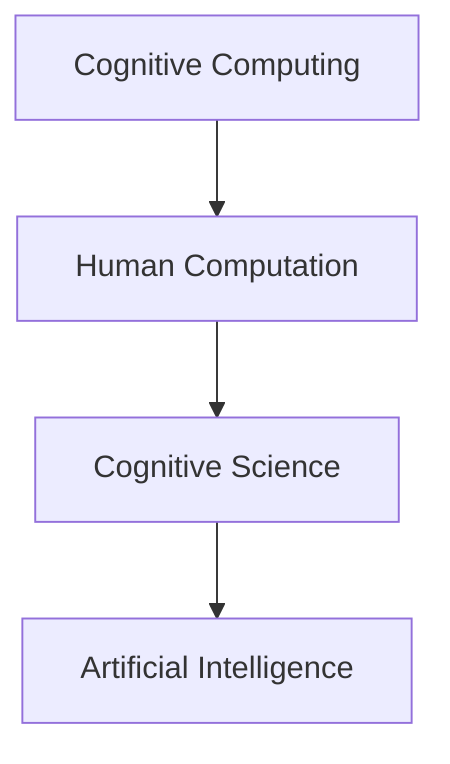

                 

# 探索人类思维的奥秘：人类计算的认知价值

> 关键词：认知计算, 人类计算, 人类思维, 算法学习, 人工智能, 认知科学

## 1. 背景介绍

### 1.1 问题由来

近年来，随着人工智能技术的飞速发展，尤其是在深度学习、大数据和计算机视觉等领域的突破，计算机的计算能力已经远远超越了人类大脑的计算能力。这一趋势引发了人们对于人类计算的认知价值和未来发展方向的深刻思考。

然而，当前的人工智能技术更多地强调计算能力，而忽略了人类特有的认知能力，如情感、意识、创造性思维等。这些能力是计算机难以完全模拟和复制的，但却是人类社会发展的关键要素。因此，探索人类思维的奥秘，挖掘人类计算的认知价值，成为人工智能领域的一个重要研究方向。

### 1.2 问题核心关键点

人类计算的认知价值研究主要围绕以下几个关键点展开：

- **认知计算**：研究如何通过计算模拟人类思维，实现认知功能。
- **人类计算**：探索人类特有的计算能力和认知机制，以及其对计算机设计的影响。
- **认知科学**：融合心理学、神经科学、认知工程等多学科知识，揭示人类认知过程的机理。
- **人工智能**：结合认知科学和计算机科学，开发具有人类认知能力的智能系统。

这些核心关键点构成了人类计算的认知价值研究的基本框架，旨在通过计算和模拟人类思维，提升人工智能的智能水平，进而推动人类社会的发展。

## 2. 核心概念与联系

### 2.1 核心概念概述

为了更好地理解人类计算的认知价值研究，我们需要介绍几个关键概念及其之间的联系：

- **认知计算**：通过计算模型模拟人类认知过程，如感知、记忆、推理、决策等。
- **人类计算**：指人类特有的计算能力，包括直觉、创造性思维、情感体验等。
- **认知科学**：研究人类认知过程和机制的科学，包括感知、记忆、注意、语言、情感等。
- **人工智能**：通过计算和算法实现人类智能，包括模仿人类认知和行为的能力。

这些概念之间的逻辑关系可以通过以下Mermaid流程图来展示：



这个流程图展示了认知计算、人类计算、认知科学与人工智能之间的相互关系：

1. 认知计算研究如何通过计算模型模拟人类认知过程。
2. 人类计算探索人类特有的计算能力和认知机制。
3. 认知科学融合多学科知识，揭示人类认知过程的机理。
4. 人工智能结合认知科学和计算机科学，开发具有人类认知能力的智能系统。

## 3. 核心算法原理 & 具体操作步骤

### 3.1 算法原理概述

人类计算的认知价值研究涉及多个领域的知识和方法，如认知科学、神经科学、心理学、计算机科学等。其核心算法原理包括以下几个方面：

- **神经网络模型**：模仿人类神经网络的结构和功能，研究神经元之间的连接和信息传递机制。
- **认知模拟算法**：通过模拟人类认知过程，研究感知、记忆、推理、决策等认知功能。
- **计算模型**：开发计算模型，实现对人类认知过程的模拟和理解。

### 3.2 算法步骤详解

基于认知计算的人类计算价值研究主要包括以下几个步骤：

**Step 1: 数据收集与预处理**

- 收集人类认知过程的各类数据，如神经信号、行为数据、语言数据等。
- 对数据进行清洗、标注和预处理，以便于后续分析和模拟。

**Step 2: 认知模型建立**

- 根据研究目标，选择合适的认知模型，如神经网络模型、认知模拟算法等。
- 对模型进行初始化，并设定相关的参数和假设。

**Step 3: 认知功能模拟**

- 将数据输入认知模型，模拟人类认知过程。
- 通过迭代优化，调整模型参数，提升模拟精度。

**Step 4: 结果验证与分析**

- 使用真实世界的数据对模拟结果进行验证，评估模型的有效性。
- 分析模拟结果，提取认知规律和机制。

**Step 5: 算法应用**

- 将模拟结果应用于实际问题，如智能交互、情感计算、决策支持等。
- 持续优化算法，提升人类计算的价值。

### 3.3 算法优缺点

人类计算的认知价值研究具有以下优点：

- **跨学科融合**：结合心理学、神经科学、计算机科学等多学科知识，提供更全面的认知理解。
- **理论与实践结合**：理论研究与实际应用相结合，提升人工智能系统的智能水平。
- **人机协同**：结合人类计算和计算机计算，实现人机协同，提升系统性能。

同时，该研究也存在一些局限性：

- **数据稀缺**：认知数据难以获取，特别是在脑信号和情感数据方面。
- **模型复杂**：人类认知过程复杂多变，难以通过单一模型完全模拟。
- **计算资源需求高**：大规模认知模拟需要高性能计算资源，如GPU、TPU等。

### 3.4 算法应用领域

人类计算的认知价值研究在多个领域都有广泛应用，例如：

- **情感计算**：研究人类情感的认知模型，开发智能情感识别和分析系统。
- **智能交互**：模拟人类认知过程，实现智能人机交互，提升用户体验。
- **决策支持**：研究人类决策过程，开发智能决策支持系统，辅助决策制定。
- **心理健康**：研究人类心理认知机制，开发智能心理健康评估和干预系统。
- **人机协作**：结合人类计算和计算机计算，提升人机协作的效率和效果。

## 4. 数学模型和公式 & 详细讲解 & 举例说明

### 4.1 数学模型构建

在人类计算的认知价值研究中，数学模型是理解和模拟人类认知过程的重要工具。常见的数学模型包括：

- **神经网络模型**：由多层神经元组成，模拟人类神经网络的结构和功能。
- **认知模拟算法**：使用计算模型模拟人类感知、记忆、推理等认知过程。

### 4.2 公式推导过程

以神经网络模型为例，其数学公式可以表示为：

$$
\text{Output}_i = \sigma(\sum_{j=1}^{n} W_{ij} \cdot \text{Input}_j + b_i)
$$

其中，$\text{Output}_i$表示第$i$个神经元的输出，$\text{Input}_j$表示第$j$个神经元的输入，$W_{ij}$表示连接权重，$b_i$表示偏置项，$\sigma$表示激活函数。

对于认知模拟算法，假设输入为$s$，输出为$r$，则其数学公式可以表示为：

$$
r = f(s, \theta)
$$

其中，$f$表示认知过程的函数，$\theta$表示模型的参数。

### 4.3 案例分析与讲解

以情感计算为例，通过神经网络模型模拟人类情感的认知过程。收集情感相关的数据，如面部表情、语音信号、文本数据等，使用神经网络模型进行训练，学习情感与特定特征之间的关系。

在训练过程中，可以使用交叉熵损失函数来衡量模型输出与真实标签之间的差异。训练完成后，使用验证集评估模型性能，并根据评估结果进行参数调整。

## 5. 项目实践：代码实例和详细解释说明

### 5.1 开发环境搭建

在进行人类计算的认知价值研究时，需要准备好相应的开发环境。以下是使用Python进行TensorFlow开发的环境配置流程：

1. 安装Anaconda：从官网下载并安装Anaconda，用于创建独立的Python环境。

2. 创建并激活虚拟环境：
```bash
conda create -n tf-env python=3.7 
conda activate tf-env
```

3. 安装TensorFlow：根据CUDA版本，从官网获取对应的安装命令。例如：
```bash
conda install tensorflow -c conda-forge -c pytorch
```

4. 安装各类工具包：
```bash
pip install numpy pandas scikit-learn matplotlib tqdm jupyter notebook ipython
```

完成上述步骤后，即可在`tf-env`环境中开始研究实践。

### 5.2 源代码详细实现

下面是使用TensorFlow对情感分类任务进行神经网络模型训练的代码实现：

```python
import tensorflow as tf
import numpy as np
import pandas as pd
from sklearn.model_selection import train_test_split
from tensorflow.keras.layers import Input, Dense, Dropout
from tensorflow.keras.models import Model

# 数据准备
data = pd.read_csv('emotion_data.csv')
X = data.drop(['label'], axis=1).values
y = data['label'].values
X_train, X_test, y_train, y_test = train_test_split(X, y, test_size=0.2, random_state=42)

# 模型构建
input_layer = Input(shape=(X_train.shape[1],))
x = Dense(64, activation='relu')(input_layer)
x = Dropout(0.5)(x)
output_layer = Dense(1, activation='sigmoid')(x)
model = Model(inputs=input_layer, outputs=output_layer)

# 编译模型
model.compile(optimizer='adam', loss='binary_crossentropy', metrics=['accuracy'])

# 训练模型
model.fit(X_train, y_train, epochs=10, batch_size=32, validation_data=(X_test, y_test))

# 评估模型
score = model.evaluate(X_test, y_test, verbose=0)
print('Test loss:', score[0])
print('Test accuracy:', score[1])
```

### 5.3 代码解读与分析

让我们再详细解读一下关键代码的实现细节：

**数据准备**：
- 使用Pandas读取情感数据集，并将其划分为训练集和测试集。

**模型构建**：
- 使用TensorFlow构建神经网络模型，包括输入层、隐藏层和输出层。
- 隐藏层使用ReLU激活函数，输出层使用Sigmoid激活函数。
- 添加Dropout层以减少过拟合。

**模型编译**：
- 使用Adam优化器和二元交叉熵损失函数编译模型。

**模型训练**：
- 使用训练集数据训练模型，指定epochs和batch size。
- 在每个epoch结束时，使用测试集数据评估模型性能。

**模型评估**：
- 使用测试集数据评估模型性能，输出损失值和准确率。

## 6. 实际应用场景

### 6.1 智能情感分析系统

基于人类计算的认知价值研究，可以开发智能情感分析系统，用于情感识别、情感分类、情感分析等。

在技术实现上，可以收集社交媒体、用户评论、视频等情感数据，使用神经网络模型进行训练，学习情感与特定特征之间的关系。微调后的情感分析模型能够自动识别文本中的情感倾向，对情感数据进行分类和分析，为情感预测、舆情监测等提供支持。

### 6.2 智能客服系统

人类计算的认知价值研究还可以应用于智能客服系统。通过模拟人类认知过程，实现智能人机交互，提升用户体验和满意度。

具体而言，可以收集用户咨询记录，构建情感识别模型，实时监测用户情绪，根据用户情绪调整服务策略，提供更加人性化的客服体验。

### 6.3 智能健康管理系统

人类计算的认知价值研究可以应用于智能健康管理系统，实现智能健康监测和干预。

通过收集用户的生理数据、行为数据、情感数据等，构建认知模型，实时监测用户的健康状态，预测疾病风险，提供个性化的健康建议。

## 7. 工具和资源推荐

### 7.1 学习资源推荐

为了帮助开发者系统掌握人类计算的认知价值研究，这里推荐一些优质的学习资源：

1. 《认知计算与神经网络》系列博文：由认知计算专家撰写，深入浅出地介绍了认知计算、神经网络模型等前沿话题。

2. 《情感计算与人工智能》课程：麻省理工学院开设的情感计算课程，涵盖情感识别、情感分类等核心内容，提供丰富的实践案例。

3. 《认知科学与人工智能》书籍：详细介绍了认知科学和人工智能的融合应用，提供丰富的理论和实践资源。

4. HuggingFace官方文档：提供丰富的预训练模型和微调样例代码，是进行情感计算任务开发的利器。

5. EMNLP、AAAI等顶级会议论文：收录最新情感计算研究进展，提供丰富的理论和技术支持。

通过对这些资源的学习实践，相信你一定能够快速掌握人类计算的认知价值研究的基本方法和技术。

### 7.2 开发工具推荐

高效的开发离不开优秀的工具支持。以下是几款用于人类计算的认知价值研究开发的常用工具：

1. TensorFlow：由Google主导开发的深度学习框架，生产部署方便，适合大规模工程应用。提供丰富的预训练模型和工具库，支持神经网络模型训练和情感分析等任务。

2. PyTorch：基于Python的开源深度学习框架，灵活高效，适合快速迭代研究。支持神经网络模型构建和训练，提供丰富的认知计算工具。

3. Weights & Biases：模型训练的实验跟踪工具，可以记录和可视化模型训练过程中的各项指标，方便对比和调优。与主流深度学习框架无缝集成。

4. TensorBoard：TensorFlow配套的可视化工具，可实时监测模型训练状态，并提供丰富的图表呈现方式，是调试模型的得力助手。

5. Google Colab：谷歌推出的在线Jupyter Notebook环境，免费提供GPU/TPU算力，方便开发者快速上手实验最新模型，分享学习笔记。

合理利用这些工具，可以显著提升人类计算的认知价值研究的开发效率，加快创新迭代的步伐。

### 7.3 相关论文推荐

人类计算的认知价值研究源于学界的持续研究。以下是几篇奠基性的相关论文，推荐阅读：

1. "A Theoretical Introduction to Neural Computation"：Yoshua Bengio等。介绍神经网络模型和认知计算的基本理论和方法。

2. "Human-AI Collaboration in AI Design"：Andrew Ng。探讨人机协同设计认知计算系统的思路和方法。

3. "Cognitive Modeling and Artificial Intelligence"：Larry Rosene等。详细介绍了认知模型和人工智能的融合应用。

4. "Neural Computation of Cognitive Processes"：Howard R. Brown。研究神经网络模型在认知计算中的应用。

5. "Cognitive Modeling and Computer Science"：Kenneth A. Palmer。探讨认知模型和计算机科学的融合应用。

这些论文代表了大规模语言模型微调技术的发展脉络。通过学习这些前沿成果，可以帮助研究者把握学科前进方向，激发更多的创新灵感。

## 8. 总结：未来发展趋势与挑战

### 8.1 总结

本文对人类计算的认知价值研究进行了全面系统的介绍。首先阐述了人类计算和认知计算的基本概念，明确了研究在人工智能领域的独特价值。其次，从原理到实践，详细讲解了认知计算的基本方法和步骤，给出了情感分析任务开发的完整代码实例。同时，本文还广泛探讨了认知计算在智能客服、情感分析、健康管理等多个行业领域的应用前景，展示了认知计算的巨大潜力。此外，本文精选了认知计算的相关学习资源，力求为读者提供全方位的技术指引。

通过本文的系统梳理，可以看到，人类计算的认知价值研究正在成为人工智能领域的重要范式，极大地拓展了认知计算的应用边界，催生了更多的落地场景。受益于大规模语料的预训练和认知计算模型的不断演进，人类计算的认知价值研究必将在构建人机协同的智能时代中扮演越来越重要的角色。

### 8.2 未来发展趋势

展望未来，人类计算的认知价值研究将呈现以下几个发展趋势：

1. **认知计算模型的复杂化**：随着认知计算技术的进步，认知计算模型将变得更加复杂和精细，能够更好地模拟人类认知过程。

2. **多模态认知计算**：将视觉、听觉、触觉等多模态信息与文本信息相结合，提升认知计算系统的综合感知能力。

3. **认知计算与人工智能的深度融合**：通过融合认知计算和人工智能，开发具有高度智能和自适应能力的认知计算系统。

4. **人机协同计算**：结合人类计算和计算机计算，提升认知计算系统的智能水平和适应性。

5. **情感计算的普及化**：将情感计算技术广泛应用于智能客服、智能家居、智能健康等领域，提升用户体验和智能化水平。

以上趋势凸显了人类计算的认知价值研究的发展方向，这些方向的探索发展，必将进一步提升认知计算系统的性能和应用范围，为人类认知智能的进化带来深远影响。

### 8.3 面临的挑战

尽管人类计算的认知价值研究已经取得了瞩目成就，但在迈向更加智能化、普适化应用的过程中，它仍面临着诸多挑战：

1. **数据稀缺**：认知数据难以获取，特别是在脑信号和情感数据方面。如何获取大规模高质量认知数据，是认知计算研究的一大难题。

2. **模型复杂**：人类认知过程复杂多变，难以通过单一模型完全模拟。如何构建更复杂的认知计算模型，提升认知模拟的精度和效果。

3. **计算资源需求高**：大规模认知模拟需要高性能计算资源，如GPU、TPU等。如何降低计算资源需求，提升计算效率。

4. **认知计算与人工智能的融合**：如何更好地融合认知计算和人工智能，实现人机协同计算，提升系统的智能水平。

5. **认知计算的伦理和安全**：如何保证认知计算系统的安全性、透明性和可解释性，避免算法的偏见和滥用。

这些挑战凸显了人类计算的认知价值研究需要进一步探索和优化。相信随着学界和产业界的共同努力，这些挑战终将一一被克服，人类计算的认知价值研究必将在构建人机协同的智能时代中扮演越来越重要的角色。

### 8.4 研究展望

面向未来，人类计算的认知价值研究需要在以下几个方面寻求新的突破：

1. **跨学科融合**：融合心理学、神经科学、计算机科学等多学科知识，提供更全面的认知理解。

2. **多模态认知计算**：将视觉、听觉、触觉等多模态信息与文本信息相结合，提升认知计算系统的综合感知能力。

3. **认知计算与人工智能的深度融合**：通过融合认知计算和人工智能，开发具有高度智能和自适应能力的认知计算系统。

4. **人机协同计算**：结合人类计算和计算机计算，提升认知计算系统的智能水平和适应性。

5. **认知计算的伦理和安全**：如何保证认知计算系统的安全性、透明性和可解释性，避免算法的偏见和滥用。

这些研究方向的探索，必将引领人类计算的认知价值研究迈向更高的台阶，为构建安全、可靠、可解释、可控的智能系统铺平道路。面向未来，人类计算的认知价值研究还需要与其他人工智能技术进行更深入的融合，如知识表示、因果推理、强化学习等，多路径协同发力，共同推动自然语言理解和智能交互系统的进步。只有勇于创新、敢于突破，才能不断拓展认知计算的边界，让智能技术更好地造福人类社会。

## 9. 附录：常见问题与解答

**Q1：人类计算和认知计算的区别是什么？**

A: 人类计算主要研究人类特有的计算能力和认知机制，如直觉、创造性思维、情感体验等。而认知计算则是通过计算模型模拟人类认知过程，研究感知、记忆、推理等认知功能。

**Q2：人类计算的认知价值研究如何应用于实际问题？**

A: 人类计算的认知价值研究可以通过构建认知模型，模拟人类认知过程，应用于智能情感分析、智能客服、智能健康管理等领域。

**Q3：人类计算和认知计算的融合有哪些难点？**

A: 人类计算和认知计算的融合难点主要包括数据获取、模型构建、计算资源需求、人机协同等方面。需要结合多学科知识，解决这些难题。

**Q4：人类计算的认知价值研究未来的发展方向是什么？**

A: 人类计算的认知价值研究未来的发展方向包括认知计算模型的复杂化、多模态认知计算、人机协同计算、认知计算与人工智能的深度融合、认知计算的伦理和安全等。

**Q5：如何提高人类计算的认知价值研究的效率？**

A: 提高效率可以通过数据预处理、模型优化、资源优化等手段实现。同时，利用多学科知识和技术，提升研究水平。

以上是基于人类计算的认知价值研究的全文内容。希望这篇博文能为你提供有价值的参考，并激发你进一步探索人类思维和计算的奥秘。

