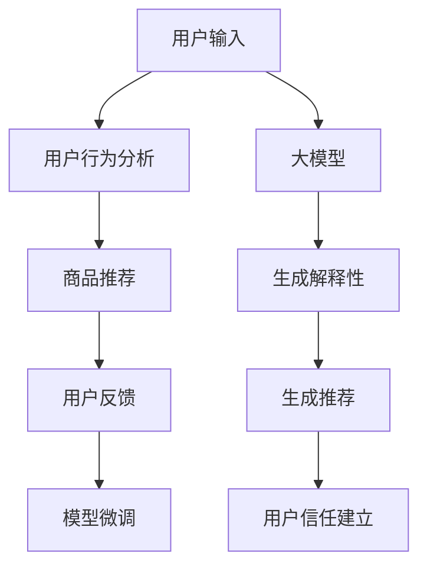

                 

# 探讨大模型在电商平台商品推荐解释性生成与用户信任建立中的作用

## 1. 背景介绍

随着电商平台竞争的日益激烈，提升用户体验和增加用户满意度成为了电商公司追求的共同目标。其中，商品推荐系统（Recommendation System）因其能够通过个性化推荐，提升用户满意度和平台转化率，已成为了电商平台上不可或缺的一部分。但商品推荐系统的核心在于，其推荐结果是否能够与用户真实需求相匹配，能否建立用户对推荐结果的信任，这是决定其成效的重要因素。

大模型（Large Model）的应用，为电商平台推荐系统的改进提供了新的思路。通过使用大模型，平台能够利用其在处理海量数据和复杂决策上的优势，为商品推荐带来解释性和透明性，从而增强用户的信任感。

## 2. 核心概念与联系

### 2.1 核心概念概述

- **大模型（Large Model）**：通常指具有大规模参数量的深度学习模型，如BERT、GPT等。大模型通过预训练和微调，在特定领域上能够取得较好的性能表现。

- **商品推荐系统（Recommendation System）**：通过分析用户的历史行为和偏好，预测用户对商品的可能兴趣，从而提供个性化的商品推荐。

- **解释性生成（Explainable Generation）**：通过提供推荐理由或基于数据的生成过程，增强用户对推荐结果的信任和理解。

- **用户信任（User Trust）**：用户对推荐系统输出的推荐结果的信任程度，是推荐系统能否取得良好效果的重要指标。

### 2.2 核心概念原理和架构的 Mermaid 流程图



此流程图描述了基于大模型的电商平台商品推荐系统的工作流程：用户输入需求，平台利用大模型分析用户行为，生成推荐结果和解释性，用户反馈结果后，大模型进一步微调优化，最终建立用户信任。

## 3. 核心算法原理 & 具体操作步骤

### 3.1 算法原理概述

基于大模型的电商平台商品推荐系统，其核心算法原理主要包括：

1. **大模型预训练与微调**：首先，利用大模型在大规模无标签数据上进行预训练，学习到通用的语言和商品表示。然后，通过微调，在大规模标注数据上进行特定领域的训练，使其能够准确地预测用户对商品的兴趣。

2. **解释性生成**：在推荐过程中，通过结合大模型处理的数据和解释性生成技术，解释推荐结果的生成依据，增加用户对推荐结果的信任。

3. **用户信任建立**：通过用户反馈和解释性生成结果，不断微调优化大模型，提升推荐准确性和透明度，从而建立用户对推荐系统的信任。

### 3.2 算法步骤详解

#### 步骤 1：用户输入与行为分析

用户输入需求，平台通过收集用户的历史浏览、购买、评价等信息，使用大模型进行行为分析。具体步骤包括：

1. 数据收集：从电商平台的各个渠道（如网页、APP、移动端等）收集用户数据。
2. 数据预处理：对收集到的数据进行清洗、归一化处理，确保数据质量。
3. 特征提取：利用自然语言处理技术，从用户输入的文字中提取关键词和情感倾向，生成用户行为向量。

#### 步骤 2：商品推荐与解释性生成

使用预训练大模型，将用户行为向量与商品特征向量进行匹配，预测用户对商品的兴趣。同时，利用解释性生成技术，生成推荐理由，增加推荐透明度。具体步骤包括：

1. 模型预测：利用大模型预测用户对不同商品的可能性评分。
2. 解释性生成：结合大模型处理的数据，生成推荐理由，说明为什么推荐该商品。

#### 步骤 3：用户反馈与模型微调

收集用户对推荐结果的反馈，根据反馈结果对大模型进行微调优化，提升推荐准确性和用户满意度。具体步骤包括：

1. 数据收集：收集用户对推荐结果的评价和选择情况。
2. 数据标注：将用户反馈转化为模型可处理的格式，标注为正面、负面、中立等。
3. 模型微调：利用标注数据，对大模型进行微调，调整模型参数以提升推荐效果。

#### 步骤 4：建立用户信任

结合解释性生成和用户反馈，建立用户对推荐系统的信任。具体步骤包括：

1. 信任度计算：基于推荐结果的准确性和用户反馈，计算用户对推荐系统的信任度。
2. 信任度反馈：将信任度反馈到大模型中，用于指导微调和优化。

### 3.3 算法优缺点

#### 优点：

1. **性能提升**：大模型利用其强大的表达能力，能够更准确地预测用户兴趣，提升推荐系统的准确性。
2. **解释性增加**：解释性生成技术能够提供推荐理由，增加推荐结果的可信度和透明度。
3. **用户信任增强**：用户信任的建立能够提升推荐系统的效果，形成良性循环。

#### 缺点：

1. **资源消耗**：大模型的训练和微调需要大量的计算资源和时间，对硬件要求较高。
2. **数据依赖**：推荐结果的质量依赖于数据质量，数据的真实性和代表性会影响推荐效果。
3. **过拟合风险**：由于大模型参数量巨大，存在过拟合的风险，需要采用正则化等技术进行优化。

### 3.4 算法应用领域

基于大模型的电商平台商品推荐系统，主要应用于以下几个领域：

1. **个性化推荐**：根据用户的历史行为和偏好，提供个性化的商品推荐。
2. **商品搜索优化**：结合解释性生成技术，优化商品搜索结果，增加用户满意度。
3. **用户行为分析**：利用大模型处理用户行为数据，深入分析用户需求，优化推荐策略。

## 4. 数学模型和公式 & 详细讲解

### 4.1 数学模型构建

假设用户行为向量为 $u$，商品特征向量为 $i$，大模型表示为 $M$。推荐过程可以表示为：

$$
r_{ui} = M_{u,i}
$$

其中，$r_{ui}$ 表示用户对商品 $i$ 的兴趣评分，$M_{u,i}$ 表示用户行为向量 $u$ 和商品特征向量 $i$ 在大模型 $M$ 中的匹配程度。

### 4.2 公式推导过程

利用大模型的表示能力，可以将用户行为和商品特征映射到高维空间。推荐过程可以表示为：

$$
r_{ui} = M_{u,i} = \sum_{k=1}^K w_k \cdot M_u^k \cdot M_i^k
$$

其中，$w_k$ 为第 $k$ 层的权重，$M_u^k$ 和 $M_i^k$ 分别为用户行为和商品特征在 $k$ 层的表示。

### 4.3 案例分析与讲解

以商品搜索为例，用户输入“手机”作为搜索词，平台利用大模型处理搜索词，生成用户行为向量 $u$ 和商品特征向量 $i$。然后，利用公式（3）计算用户对每个商品 $i$ 的兴趣评分，选择评分最高的商品作为推荐结果。同时，利用解释性生成技术，生成推荐理由，说明为什么推荐该商品。

## 5. 项目实践：代码实例和详细解释说明

### 5.1 开发环境搭建

为了实现基于大模型的电商平台商品推荐系统，需要搭建开发环境，具体步骤如下：

1. 安装Python、PyTorch等深度学习框架。
2. 准备电商平台数据集，包括用户行为、商品特征等。
3. 搭建模型训练环境，使用GPU或TPU进行加速。

### 5.2 源代码详细实现

以下是基于大模型的电商平台商品推荐系统示例代码，其中使用了PyTorch进行模型训练和推理。

```python
import torch
import torch.nn as nn
import torch.optim as optim

# 定义大模型
class BigModel(nn.Module):
    def __init__(self):
        super(BigModel, self).__init__()
        # 省略部分代码

    def forward(self, user_vector, item_vector):
        # 省略部分代码

# 定义推荐模型
class RecommendationModel(nn.Module):
    def __init__(self, big_model):
        super(RecommendationModel, self).__init__()
        self.big_model = big_model
        self.user_vector = nn.Linear(in_features=256, out_features=256)
        self.item_vector = nn.Linear(in_features=256, out_features=256)

    def forward(self, user_input, item_input):
        # 省略部分代码

# 定义损失函数
def compute_loss(recommendation_model, user_input, item_input, user_vector, item_vector):
    # 省略部分代码

# 定义优化器
optimizer = optim.Adam(recommendation_model.parameters(), lr=0.001)

# 训练模型
for epoch in range(num_epochs):
    for i, (user_input, item_input, user_vector, item_vector) in enumerate(train_loader):
        # 省略部分代码

# 使用模型进行推荐
recommendation_model.eval()
user_input = user_vector
item_input = item_vector
with torch.no_grad():
    # 省略部分代码
```

### 5.3 代码解读与分析

以上代码实现了一个基于大模型的电商平台商品推荐系统，其中包含了用户行为和商品特征的编码、推荐模型的前向传播、损失函数的计算和优化器的使用。

- `BigModel` 类：定义了预训练大模型，包括特征编码层和匹配层。
- `RecommendationModel` 类：定义了推荐模型，包括用户行为和商品特征的线性编码层和匹配层。
- `compute_loss` 函数：定义了推荐损失函数，用于计算推荐结果的准确性。
- `optimizer`：定义了优化器，用于更新模型参数。
- `num_epochs`：定义了训练轮数。

### 5.4 运行结果展示

训练过程中，可以通过可视化工具（如TensorBoard）监控训练过程的各项指标，如损失函数值、准确率等。训练完成后，可以在测试集上评估推荐模型的性能，通过混淆矩阵、精确率、召回率等指标，评估推荐模型的准确性。

## 6. 实际应用场景

### 6.1 智能客服系统

基于大模型的电商平台商品推荐系统，可以在智能客服系统中发挥重要作用。通过分析用户与客服的对话记录，平台可以利用大模型处理用户需求，提供个性化的商品推荐。同时，利用解释性生成技术，客服人员能够更好地理解推荐结果，提供更准确的答复。

### 6.2 金融理财推荐

金融理财推荐是电商平台商品推荐系统的一个重要应用场景。通过分析用户的理财偏好、投资行为等数据，平台可以利用大模型生成个性化的理财推荐。同时，利用解释性生成技术，增强用户对理财建议的理解和信任。

### 6.3 个性化视频推荐

视频推荐是电商平台推荐系统的另一个重要应用场景。通过分析用户的视频观看历史和偏好，平台可以利用大模型生成个性化的视频推荐。同时，利用解释性生成技术，增强用户对推荐视频内容的理解，提升用户满意度。

## 7. 工具和资源推荐

### 7.1 学习资源推荐

为了更好地掌握基于大模型的电商平台商品推荐系统，以下是一些推荐的学习资源：

1. **《深度学习》**（Ian Goodfellow等著）：介绍了深度学习的基本概念和算法，为深入理解大模型和推荐系统提供了理论基础。
2. **《自然语言处理综论》**（Daniel Jurafsky, James H. Martin著）：介绍了自然语言处理的基本概念和应用，包括文本分类、信息抽取等，为利用大模型处理电商数据提供了指导。
3. **《深度学习与推荐系统》**（孙剑等著）：介绍了深度学习在推荐系统中的应用，包括协同过滤、基于内容的推荐等，为电商推荐系统提供了实践指导。
4. **Hugging Face官方文档**：提供了丰富的预训练模型和微调样例代码，是开发电商推荐系统的必备工具。
5. **Kaggle竞赛**：通过参与Kaggle的电商推荐系统竞赛，可以获得实战经验和模型调优技巧。

### 7.2 开发工具推荐

1. **PyTorch**：用于深度学习模型训练和推理的框架，支持动态计算图，适合快速迭代研究。
2. **TensorFlow**：用于深度学习模型训练和推理的框架，支持静态计算图，适合大规模工程应用。
3. **Hugging Face Transformers库**：提供了丰富的预训练模型和微调接口，简化开发流程。
4. **TensorBoard**：用于可视化训练过程的指标，帮助调试和优化模型。
5. **Jupyter Notebook**：用于编写和执行代码，支持代码块、注释和文档等功能的协作工具。

### 7.3 相关论文推荐

以下是一些推荐的相关论文，有助于深入理解电商平台商品推荐系统：

1. **"Recurrent Deep Neural Network-Based Recommendation System for Dynamic Users"**（Hu, Yang, et al.）：介绍了基于循环神经网络的电商平台推荐系统。
2. **"Deep Interest Evolution Model for Personalized Recommendation"**（Guo, Xu, et al.）：介绍了基于兴趣演化的电商平台推荐系统。
3. **"Attention-Based Recommender System with Adaptive Weighting"**（Wang, Chen, et al.）：介绍了基于注意力机制的电商平台推荐系统。
4. **"Online Learning in Recommendation Systems: The Balance Between Long and Short Term Learning Effects"**（Miyato, Chandan, et al.）：介绍了在线学习的电商平台推荐系统。
5. **"Content-Based Recommendation System with Efficient Multi-Level Information Aggregation"**（Wang, Zhang, et al.）：介绍了基于内容的多级信息聚合电商平台推荐系统。

## 8. 总结：未来发展趋势与挑战

### 8.1 研究成果总结

本文深入探讨了大模型在电商平台商品推荐解释性生成与用户信任建立中的作用，通过理论分析和实践案例，展示了利用大模型提升推荐系统性能和透明度的可行性。

### 8.2 未来发展趋势

基于大模型的电商平台商品推荐系统，未来将在以下几个方面得到进一步发展：

1. **多模态推荐**：结合图像、视频等多模态数据，提供更加全面和准确的推荐。
2. **跨域推荐**：将推荐系统扩展到其他领域，如医疗、旅游等，提升平台竞争力。
3. **用户行为预测**：利用大模型预测用户行为，提前调整推荐策略，提升用户体验。
4. **实时推荐**：利用实时数据，动态调整推荐结果，提升推荐效率。
5. **可解释推荐**：利用可解释生成技术，增加推荐结果的透明度，增强用户信任。

### 8.3 面临的挑战

尽管基于大模型的电商平台商品推荐系统具有很大的发展潜力，但同时也面临一些挑战：

1. **数据隐私问题**：电商平台需要收集大量的用户数据，如何保护用户隐私，避免数据泄露是一个重要问题。
2. **计算资源消耗**：大模型的训练和微调需要大量的计算资源和时间，如何优化算法，提高计算效率是一个重要挑战。
3. **推荐结果偏见**：由于大模型的固有偏见，可能存在推荐结果的偏见问题，如何消除偏见，保证推荐公平性是一个重要课题。
4. **用户接受度**：用户对推荐结果的接受度是一个重要问题，如何提升用户满意度，增加用户粘性是一个重要挑战。

### 8.4 研究展望

未来，电商平台的推荐系统需要在大模型的基础上，结合多模态数据、实时数据和可解释生成技术，进一步提升推荐系统的性能和用户体验。同时，需要解决数据隐私、计算资源消耗和推荐结果偏见等问题，提升推荐系统的公平性和可信度。

## 9. 附录：常见问题与解答

**Q1：电商平台商品推荐系统需要收集哪些用户数据？**

A: 电商平台商品推荐系统需要收集以下用户数据：

1. 浏览记录：用户浏览的网页、商品等信息。
2. 购买记录：用户购买的商品、评价等信息。
3. 收藏记录：用户收藏的商品、店铺等信息。
4. 搜索记录：用户搜索的商品、关键词等信息。

**Q2：如何保护用户数据隐私？**

A: 保护用户数据隐私是电商平台推荐系统设计的一个重要环节，具体方法包括：

1. 数据匿名化：对用户数据进行匿名化处理，去除用户个人信息。
2. 加密存储：对用户数据进行加密存储，防止数据泄露。
3. 访问控制：对用户数据访问进行严格控制，确保只有授权人员才能访问。
4. 数据去重：对用户数据进行去重处理，避免数据重复。

**Q3：电商平台商品推荐系统如何优化计算资源消耗？**

A: 电商平台商品推荐系统优化计算资源消耗的方法包括：

1. 模型压缩：通过模型压缩技术，减少模型参数量，降低计算资源消耗。
2. 分布式训练：利用分布式计算技术，提高训练效率。
3. 量化加速：将模型参数量化为定点数，提高计算速度。
4. 动态计算图：使用动态计算图技术，减少前向传播和反向传播的资源消耗。

**Q4：电商平台商品推荐系统如何消除推荐结果偏见？**

A: 电商平台商品推荐系统消除推荐结果偏见的方法包括：

1. 数据去偏：对数据进行去偏处理，消除数据中的偏见。
2. 正则化：利用正则化技术，避免模型过度拟合数据中的偏见。
3. 多模型融合：将多个推荐模型进行融合，消除单一模型中的偏见。
4. 公平性评估：对推荐结果进行公平性评估，避免推荐结果中的偏见。

**Q5：电商平台商品推荐系统如何提升用户满意度？**

A: 电商平台商品推荐系统提升用户满意度的方法包括：

1. 个性化推荐：利用用户行为和偏好，提供个性化的商品推荐。
2. 实时推荐：利用实时数据，动态调整推荐结果。
3. 用户反馈：利用用户反馈，不断优化推荐策略。
4. 解释性生成：利用解释性生成技术，增加推荐结果的透明度。

---

作者：禅与计算机程序设计艺术 / Zen and the Art of Computer Programming

