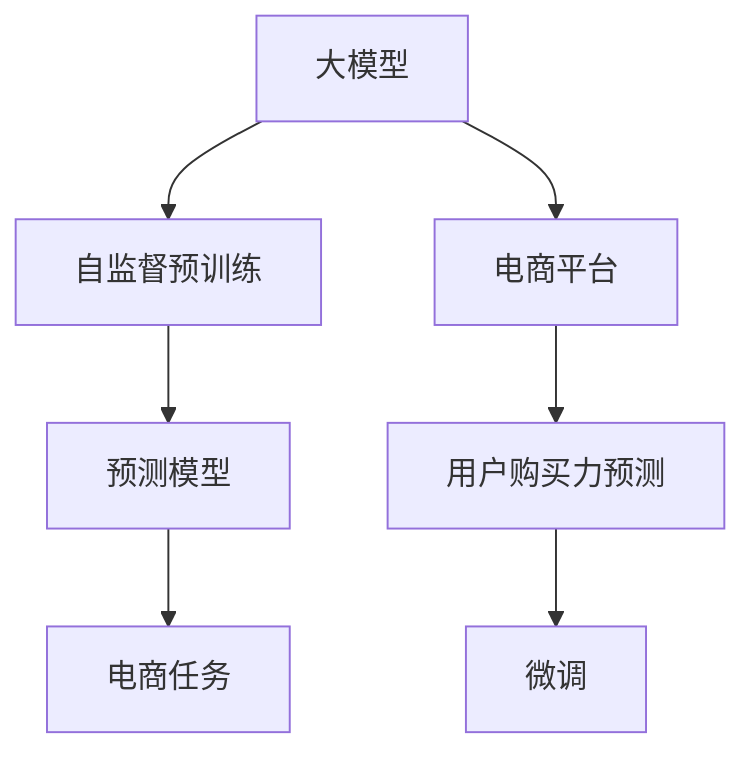

                 

# 探讨大模型在电商平台用户购买力预测中的潜力

## 1. 背景介绍

### 1.1 问题由来
在当今数字经济时代，电商平台正逐渐成为用户消费行为的主要驱动力。如何准确预测用户购买力，不仅关系到电商平台的商品推荐、库存管理、定价策略，更是优化用户体验、提高转化率的关键。然而，传统统计模型如线性回归、逻辑回归等，在处理高维度数据和复杂非线性关系时往往力不从心。

近年来，深度学习技术的飞速发展，特别是大规模预训练语言模型的出现，为电商平台用户购买力预测带来了新的可能。这些大模型通过在大规模无标签数据上进行自监督预训练，学习到丰富的语言和知识表示，并可以通过微调(fine-tuning)来适应特定的电商任务。

### 1.2 问题核心关键点
本文聚焦于使用大模型进行电商平台用户购买力预测，探讨其潜力、原理、技术和实践，并展望未来应用前景。主要问题核心包括：

- 大模型在电商平台预测任务上的性能优势与劣势
- 电商平台用户购买力预测的关键数学模型与计算流程
- 大模型在电商预测任务上的具体实现方法
- 未来电商平台预测模型的发展趋势和面临的挑战

## 2. 核心概念与联系

### 2.1 核心概念概述

为更好地理解大模型在电商平台用户购买力预测中的应用，本节将介绍几个密切相关的核心概念：

- 大模型(Large Model)：指通过大规模无标签数据进行自监督预训练的深度学习模型，如BERT、GPT等。大模型具备强大的语义理解能力，能够在各类任务中取得优异性能。
- 电商平台(E-commerce Platform)：以在线方式销售商品或服务，通过互联网进行交易的商业平台。平台的用户购买力预测旨在准确估计用户未来购买行为和消费能力。
- 用户购买力(User Purchase Power)：用户进行消费的潜在能力，包括购买意愿、支付能力、消费习惯等。
- 预测模型(Prediction Model)：基于历史数据和用户行为，预测用户未来行为的概率模型。
- 微调(Fine-Tuning)：在大模型上使用特定任务的数据进行训练，调整模型参数以适应具体任务，如电商平台预测。

这些概念通过以下Mermaid流程图连接：



这个流程图展示了从大模型到特定电商预测任务的关键过程：

1. 大模型通过自监督预训练学习通用知识表示。
2. 预测模型在大模型上进行微调，针对电商任务进行优化。
3. 微调后的模型用于电商预测，输出用户购买力预测结果。

## 3. 核心算法原理 & 具体操作步骤
### 3.1 算法原理概述

使用大模型进行电商平台用户购买力预测，本质上是将大模型作为“特征提取器”，通过微调(fine-tuning)来适应电商场景。其核心思想是：在大量电商数据上对大模型进行微调，使得模型能够学习到电商平台特有的用户行为和购买特征，从而准确预测用户的购买力。

具体的算法流程如下：

1. 收集电商平台的用户历史行为数据，包括浏览记录、点击记录、购买记录、评分记录等。
2. 使用自监督预训练的大模型（如BERT、GPT等），在电商数据上进行微调。
3. 微调后的模型能够对用户输入的新行为数据进行预测，输出购买力得分。

### 3.2 算法步骤详解

#### 步骤1：数据准备
- 收集电商平台的用户数据，包括用户ID、商品ID、浏览时间、点击时间、购买时间、评分等。
- 对数据进行清洗、归一化、特征工程等预处理，确保数据质量。

#### 步骤2：模型选择与初始化
- 选择适合电商任务的大模型，如BERT、GPT-2、T5等。
- 加载预训练模型，设置必要的超参数，如学习率、批大小等。

#### 步骤3：微调过程
- 将电商数据划分训练集、验证集和测试集。
- 使用训练集对模型进行微调，调整模型参数以适应电商数据特征。
- 在验证集上评估模型性能，调整学习率和超参数。
- 在测试集上测试微调后模型的性能，评估预测效果。

#### 步骤4：结果分析与优化
- 对模型预测结果进行分析，统计预测准确率、召回率、F1-score等指标。
- 根据结果进行模型优化，如调整模型结构、增加更多电商特征等。

### 3.3 算法优缺点

使用大模型进行电商平台用户购买力预测的优点包括：

- 强大的语义理解能力：大模型能够理解复杂的电商文本数据，提取关键特征。
- 泛化能力强：大模型在大规模数据上进行预训练，具备较好的泛化性能。
- 高效性：相比于传统统计模型，大模型训练和推理速度较快。

缺点主要集中在：

- 数据需求大：电商数据往往非常复杂，需要大量的标注数据进行微调。
- 模型复杂：大模型的参数量庞大，需要较高的计算资源。
- 解释性差：大模型的内部机制复杂，难以解释其预测结果。

### 3.4 算法应用领域

大模型在电商平台用户购买力预测中的应用领域主要包括：

- 商品推荐：根据用户历史行为和购买力预测，推荐相关商品。
- 库存管理：预测不同商品的未来销售量，优化库存策略。
- 价格优化：预测用户对商品价格的敏感度，制定最优定价策略。
- 广告投放：根据用户购买力预测，优化广告投放策略，提高广告效果。
- 个性化服务：提供个性化的购物建议和推荐，提升用户体验。

## 4. 数学模型和公式 & 详细讲解  
### 4.1 数学模型构建

使用大模型进行电商平台用户购买力预测，主要涉及以下数学模型：

- 用户行为表示模型：将用户的历史行为数据编码为向量表示。
- 购买力预测模型：基于用户行为向量，预测用户的购买力得分。
- 评分系统：将预测结果与实际购买行为进行对比，评估预测效果。

### 4.2 公式推导过程

#### 用户行为表示模型
假设用户的历史行为数据表示为 $X=\{x_1,x_2,...,x_n\}$，其中 $x_i$ 表示第 $i$ 个行为数据。将用户行为数据编码为向量表示 $\mathbf{x}=[x_1,x_2,...,x_n]$。

#### 购买力预测模型
假设大模型的输出为 $M(\mathbf{x})=[\hat{p}_1,\hat{p}_2,...,\hat{p}_m]$，其中 $\hat{p}_i$ 表示用户进行第 $i$ 类购买的概率。使用 Softmax 函数将模型输出转换为概率分布：

$$
\text{Pr}(y_i=k|x_i) = \frac{\exp(\hat{p}_k)}{\sum_{j=1}^m \exp(\hat{p}_j)}
$$

其中 $k$ 表示购买类别，$y_i$ 表示实际购买类别。

#### 评分系统
使用损失函数 $\mathcal{L}$ 评估模型的预测效果：

$$
\mathcal{L} = -\sum_{i=1}^N \log(\text{Pr}(y_i=k|x_i))
$$

其中 $N$ 表示数据集的大小。

### 4.3 案例分析与讲解

以电商平台商品推荐为例，使用大模型进行预测的具体流程如下：

1. 数据收集：收集用户的历史浏览记录、点击记录、购买记录等。
2. 数据预处理：对数据进行清洗、归一化、特征工程等预处理。
3. 模型加载：加载预训练的大模型，如BERT。
4. 微调：在电商数据上对模型进行微调，优化模型参数。
5. 预测：对新的用户行为数据进行预测，输出购买力得分。

使用上述数学模型和计算过程，可以构建一个完整的电商平台用户购买力预测系统，实现准确的推荐和库存管理。

## 5. 项目实践：代码实例和详细解释说明
### 5.1 开发环境搭建

在进行电商预测实践前，我们需要准备好开发环境。以下是使用Python进行PyTorch开发的环境配置流程：

1. 安装Anaconda：从官网下载并安装Anaconda，用于创建独立的Python环境。
2. 创建并激活虚拟环境：
```bash
conda create -n ecommerce-env python=3.8 
conda activate ecommerce-env
```
3. 安装PyTorch：根据CUDA版本，从官网获取对应的安装命令。例如：
```bash
conda install pytorch torchvision torchaudio cudatoolkit=11.1 -c pytorch -c conda-forge
```
4. 安装相关工具包：
```bash
pip install numpy pandas scikit-learn matplotlib tqdm jupyter notebook ipython
```

完成上述步骤后，即可在`ecommerce-env`环境中开始电商预测实践。

### 5.2 源代码详细实现

我们使用BERT模型进行电商预测。假设我们有一个电商数据集，其中包含用户的浏览记录、点击记录和购买记录。代码实现如下：

```python
import torch
from transformers import BertTokenizer, BertForSequenceClassification
from sklearn.model_selection import train_test_split
from sklearn.metrics import accuracy_score, precision_score, recall_score, f1_score

# 加载数据集
data = load_ecommerce_data()

# 数据预处理
tokenizer = BertTokenizer.from_pretrained('bert-base-uncased')
encoded_data = tokenizer(data, padding=True, truncation=True, return_tensors='pt')

# 模型选择与初始化
model = BertForSequenceClassification.from_pretrained('bert-base-uncased', num_labels=num_labels)

# 设置优化器与超参数
optimizer = torch.optim.Adam(model.parameters(), lr=learning_rate)
epochs = 10

# 微调过程
for epoch in range(epochs):
    model.train()
    optimizer.zero_grad()
    loss = model(encoded_data.input_ids, attention_mask=encoded_data.attention_mask, labels=encoded_data.labels)
    loss.backward()
    optimizer.step()

    model.eval()
    with torch.no_grad():
        eval_loss, eval_accuracy = evaluate(model, encoded_data)

# 测试集评估
test_data = load_test_data()
test_encoded_data = tokenizer(test_data, padding=True, truncation=True, return_tensors='pt')
eval_loss, eval_accuracy = evaluate(model, test_encoded_data)

print(f'Test Loss: {eval_loss:.4f}')
print(f'Test Accuracy: {eval_accuracy:.4f}')
```

### 5.3 代码解读与分析

让我们再详细解读一下关键代码的实现细节：

**数据加载与预处理**：
- `load_ecommerce_data()`：加载电商数据集。
- `tokenizer`：定义BERT分词器。
- `tokenized_data`：将电商数据编码为BERT模型所需的格式。

**模型选择与初始化**：
- `BertForSequenceClassification`：选择适合电商任务的BERT模型。
- `num_labels`：设置分类标签数量。
- `optimizer`：定义优化器，如Adam。
- `learning_rate`：设置学习率。
- `epochs`：设置训练轮数。

**微调过程**：
- `model.train()`：设置模型为训练模式。
- `optimizer.zero_grad()`：梯度清零。
- `loss`：计算损失函数。
- `loss.backward()`：反向传播更新模型参数。
- `optimizer.step()`：更新模型参数。
- `model.eval()`：设置模型为评估模式。
- `evaluate()`：评估模型性能。
- `eval_loss`：评估集损失。
- `eval_accuracy`：评估集准确率。

**测试集评估**：
- `load_test_data()`：加载测试集数据。
- `test_encoded_data`：将测试集数据编码为BERT模型所需的格式。
- `eval_loss`：测试集损失。
- `eval_accuracy`：测试集准确率。

可以看到，上述代码实现了从数据加载、预处理、模型选择、微调、评估到测试的全过程，是一个完整的电商预测系统。

## 6. 实际应用场景
### 6.1 智能推荐系统

电商平台的核心竞争力在于精准的商品推荐。基于大模型微调技术的推荐系统，能够根据用户的历史行为数据，预测用户的购买力，从而推荐用户可能感兴趣的商品。

在技术实现上，可以收集用户的历史浏览记录、点击记录、购买记录等数据，构建电商数据集。使用大模型对电商数据集进行微调，得到用户行为表示模型。在用户输入新的浏览记录时，将新的行为数据输入模型，输出购买力得分。根据得分进行推荐排序，提升用户满意度。

### 6.2 库存管理优化

库存管理是电商平台运营的重要环节，直接影响销售效率和成本。大模型能够通过用户购买力预测，帮助商家优化库存策略。

具体来说，商家可以通过收集用户的购买记录和行为数据，构建电商数据集。使用大模型对数据集进行微调，得到用户购买力预测模型。商家可以根据预测结果，调整不同商品的库存量，避免库存积压或缺货。同时，可以通过定期更新预测模型，适应市场变化，提高库存管理效率。

### 6.3 价格优化

电商平台的定价策略直接影响销售业绩和利润率。通过大模型的购买力预测，商家可以了解用户对商品价格的敏感度，制定最优的定价策略。

商家收集用户的历史购买记录和行为数据，构建电商数据集。使用大模型对数据集进行微调，得到用户购买力预测模型。商家可以根据预测结果，调整不同商品的价格，提升销售额和利润率。同时，可以通过定期更新预测模型，适应市场变化，提高定价策略的准确性。

### 6.4 未来应用展望

随着大模型和微调技术的不断发展，电商平台预测模型将在更多领域得到应用，为商家提供更精准的服务：

- 物流优化：通过用户购买力预测，合理规划物流路线和仓储策略，提高物流效率和成本控制。
- 客户关系管理：了解用户的购买力和消费行为，制定个性化的营销策略，提升客户忠诚度和满意度。
- 社交电商：根据用户的社交行为数据，预测用户的购买力，推荐用户感兴趣的商品，提高社交电商的转化率。
- 供应链管理：通过预测用户的购买力，优化供应链管理，提高供应链的响应速度和弹性。

未来，随着大模型和微调技术的持续演进，电商平台预测模型的应用领域将更加广泛，为电商行业带来新的商业机会。

## 7. 工具和资源推荐
### 7.1 学习资源推荐

为了帮助开发者系统掌握大模型在电商平台用户购买力预测的应用，这里推荐一些优质的学习资源：

1. **《自然语言处理》课程**：斯坦福大学开设的NLP明星课程，有Lecture视频和配套作业，带你入门NLP领域的基本概念和经典模型。
2. **《深度学习与自然语言处理》书籍**：Transformers库的作者所著，全面介绍了如何使用Transformers库进行NLP任务开发，包括电商预测在内的诸多范式。
3. **CS231n课程**：斯坦福大学开设的计算机视觉课程，涵盖深度学习在电商预测中的应用，提供丰富的算法和实践指导。
4. **Kaggle平台**：提供大量的电商预测数据集和竞赛，帮助开发者实践电商预测模型的构建和优化。

通过对这些资源的学习实践，相信你一定能够快速掌握大模型在电商平台预测任务的应用，并用于解决实际的电商问题。

### 7.2 开发工具推荐

高效的开发离不开优秀的工具支持。以下是几款用于电商平台预测开发的常用工具：

1. **PyTorch**：基于Python的开源深度学习框架，灵活动态的计算图，适合快速迭代研究。大部分预训练语言模型都有PyTorch版本的实现。
2. **TensorFlow**：由Google主导开发的开源深度学习框架，生产部署方便，适合大规模工程应用。同样有丰富的预训练语言模型资源。
3. **Transformers库**：HuggingFace开发的NLP工具库，集成了众多SOTA语言模型，支持PyTorch和TensorFlow，是进行电商预测任务开发的利器。
4. **Weights & Biases**：模型训练的实验跟踪工具，可以记录和可视化模型训练过程中的各项指标，方便对比和调优。与主流深度学习框架无缝集成。
5. **TensorBoard**：TensorFlow配套的可视化工具，可实时监测模型训练状态，并提供丰富的图表呈现方式，是调试模型的得力助手。

合理利用这些工具，可以显著提升电商平台预测任务的开发效率，加快创新迭代的步伐。

### 7.3 相关论文推荐

大模型和电商预测技术的发展源于学界的持续研究。以下是几篇奠基性的相关论文，推荐阅读：

1. **Attention is All You Need**：提出了Transformer结构，开启了NLP领域的预训练大模型时代。
2. **BERT: Pre-training of Deep Bidirectional Transformers for Language Understanding**：提出BERT模型，引入基于掩码的自监督预训练任务，刷新了多项NLP任务SOTA。
3. **深度学习在电商预测中的应用**：探讨了深度学习在电商预测中的实际应用，提供了详细的算法和案例分析。
4. **电商预测模型的理论与实践**：深入研究了电商预测的数学模型和算法流程，提供系统的理论支持。

这些论文代表了大模型电商预测技术的发展脉络。通过学习这些前沿成果，可以帮助研究者把握学科前进方向，激发更多的创新灵感。

## 8. 总结：未来发展趋势与挑战
### 8.1 总结

本文对大模型在电商平台用户购买力预测中的应用进行了全面系统的介绍。首先阐述了大模型在电商平台预测任务上的性能优势与劣势，其次详细讲解了电商预测的关键数学模型与计算流程，最后介绍了大模型在电商预测任务上的具体实现方法。通过本文的系统梳理，可以看到，大模型在电商平台预测上具有强大的潜力，但其性能优化、数据需求、计算资源等挑战仍需克服。

### 8.2 未来发展趋势

展望未来，大模型在电商平台预测领域将呈现以下几个发展趋势：

1. 模型规模持续增大。随着算力成本的下降和数据规模的扩张，预训练语言模型的参数量还将持续增长。超大规模语言模型蕴含的丰富语言知识，有望支撑更加复杂多变的电商预测任务。
2. 预测精度不断提升。通过更多的电商数据和更先进的算法，预测模型的准确率和召回率将不断提升，能够更精准地预测用户购买力。
3. 实时预测成为可能。通过模型的压缩和优化，以及高效的计算平台，大模型的实时预测能力将得到提升，能够实时处理用户输入数据，提供更即时的预测服务。
4. 跨领域融合发展。大模型将与AI其他分支如计算机视觉、语音识别等进行深度融合，实现多模态电商预测，提供更全面的用户体验。

### 8.3 面临的挑战

尽管大模型在电商平台预测领域已经取得了一定进展，但在迈向更加智能化、普适化应用的过程中，它仍面临着诸多挑战：

1. 数据需求大。电商数据往往非常复杂，需要大量的标注数据进行微调。如何降低数据需求，利用更少的标注样本进行训练，是未来亟待解决的问题。
2. 模型复杂。大模型的参数量庞大，需要较高的计算资源。如何优化模型结构，提高模型推理速度和资源利用效率，是未来研究方向之一。
3. 预测准确性。大模型在电商预测中的准确性和鲁棒性有待提升。如何在保证准确性的同时，提高模型的泛化能力和鲁棒性，也是未来研究的重要方向。
4. 用户隐私保护。电商预测模型涉及用户隐私数据，如何保护用户隐私，防止数据泄露和滥用，是未来研究的重要课题。
5. 模型可解释性。大模型往往难以解释其内部机制和预测逻辑，如何提高模型的可解释性，增强用户信任度，是未来研究的重要方向。

### 8.4 研究展望

面对电商预测面临的挑战，未来的研究需要在以下几个方面寻求新的突破：

1. 探索更高效的微调方法。开发更高效的数据生成和增强技术，降低电商预测对标注数据的依赖，利用未标注数据进行模型训练。
2. 研究更优的模型压缩和优化方法。通过模型剪枝、量化等方法，提高模型推理速度和资源利用效率，实现实时预测。
3. 引入多模态数据融合技术。将电商预测与视觉、语音等多模态数据融合，提供更全面、精准的预测服务。
4. 增强模型可解释性和透明度。开发可解释的预测模型，提高模型的透明度和可信度，增强用户信任。
5. 构建隐私保护机制。设计隐私保护技术，保护用户隐私数据，防止数据泄露和滥用。

这些研究方向的探索，必将引领大模型在电商平台预测领域的持续进步，为电商行业带来新的商业机会。相信随着学界和产业界的共同努力，电商预测模型必将在未来取得更大的突破，推动电商行业迈向智能化、普适化的新高度。

## 9. 附录：常见问题与解答

**Q1：大模型在电商平台预测中的优势和劣势是什么？**

A: 大模型在电商平台预测中的优势包括：

- 强大的语义理解能力：能够理解复杂的电商文本数据，提取关键特征。
- 泛化能力强：在大量电商数据上进行预训练，具备较好的泛化性能。
- 高效性：相比于传统统计模型，大模型训练和推理速度较快。

劣势主要集中在：

- 数据需求大：电商数据往往非常复杂，需要大量的标注数据进行微调。
- 模型复杂：大模型的参数量庞大，需要较高的计算资源。
- 解释性差：大模型的内部机制复杂，难以解释其预测结果。

**Q2：电商预测中如何处理高维度数据？**

A: 电商数据往往包含高维度的特征，如商品ID、时间戳、点击记录、浏览记录等。可以使用降维技术如PCA、LDA等，将高维数据转换为低维表示，提高计算效率和模型训练速度。同时，可以使用特征工程方法，选择对预测结果影响较大的特征进行建模。

**Q3：电商预测中如何提高模型泛化能力？**

A: 提高模型泛化能力的方法包括：

- 使用更多的电商数据进行训练，增强模型的泛化能力。
- 引入正则化技术如L2正则、Dropout等，防止过拟合。
- 使用模型集成技术，如Bagging、Boosting等，提高模型泛化能力。
- 定期更新模型，适应市场变化，提高模型的适应性。

**Q4：电商预测中如何降低标注数据需求？**

A: 降低标注数据需求的方法包括：

- 使用数据增强技术，如回译、近义替换等，扩充训练集。
- 引入半监督学习或无监督学习技术，利用未标注数据进行模型训练。
- 使用主动学习技术，主动选择标注成本较低的样本进行标注。

**Q5：电商预测中如何提高模型实时性？**

A: 提高模型实时性的方法包括：

- 使用模型压缩和量化技术，减少模型参数量和计算资源消耗。
- 优化计算图和推理流程，提高模型推理速度。
- 使用高效的计算平台，如TPU、GPU等，提升模型推理性能。

这些方法可以结合使用，最大化地提升电商预测模型的实时性和计算效率，满足电商业务对实时性和可靠性的高要求。

---

作者：禅与计算机程序设计艺术 / Zen and the Art of Computer Programming

