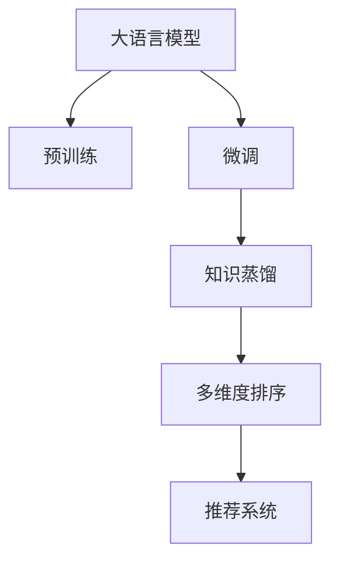

                 

# 推荐系统中的多维度排序：大模型的新思路

## 1. 背景介绍

随着互联网的飞速发展和数据量的爆炸性增长，推荐系统在电商、社交网络、视频平台等领域被广泛应用。然而，传统的推荐算法往往基于单一的评分预测模型，无法充分考虑用户和物品的多维度信息，导致推荐结果的泛化性和用户满意度不高。近年来，以深度学习为核心的多维度排序算法逐渐兴起，通过引入用户行为、物品属性、场景信息等多种维度的数据，极大地提升了推荐系统的效果和用户体验。

在此背景下，大语言模型在推荐系统中的应用引起了学界的广泛关注。大语言模型如BERT、GPT等，具备强大的文本理解和生成能力，能够将文本描述转换为高维语义向量，从而支持复杂的用户兴趣建模和物品多维度表示。基于大语言模型的新型推荐算法，有望在多维度排序方面取得显著突破，重塑推荐系统的技术格局。本文旨在系统探讨大语言模型在推荐系统中的应用，从理论到实践，详细介绍其多维度排序的算法原理、操作步骤、应用领域以及实际效果。

## 2. 核心概念与联系

### 2.1 核心概念概述

为更好理解大语言模型在推荐系统中的应用，本节将介绍几个关键概念及其相互联系：

- **大语言模型(Large Language Model, LLM)**：以自回归(如GPT)或自编码(如BERT)模型为代表的大规模预训练语言模型。通过在大规模无标签文本语料上进行预训练，学习通用的语言表示，具备强大的语言理解和生成能力。

- **推荐系统(Recommender System)**：根据用户历史行为和物品属性，自动为用户推荐个性化商品或内容的系统。推荐系统广泛应用在电商、社交网络、视频平台等互联网领域。

- **多维度排序(Multi-dimension Sorting)**：在推荐系统中，结合用户行为、物品属性、场景信息等多维度数据，对用户候选集进行排序，提升推荐准确性和用户体验。

- **预训练-微调(Fine-tuning)**：预训练-微调是大模型常用的训练方法，在预训练基础上，通过下游任务有监督的微调，使得模型能够适应特定的推荐任务。

- **知识蒸馏(Knowledge Distillation)**：通过教师模型向学生模型传输知识，提高学生模型的泛化能力和准确性。大语言模型可以通过知识蒸馏方法来增强推荐系统的知识表示能力。

这些核心概念之间的逻辑关系可以通过以下Mermaid流程图来展示：



这个流程图展示了从预训练到推荐系统应用的核心流程：

1. 大语言模型通过预训练获得基础能力。
2. 预训练模型通过微调适应推荐任务，获取任务特定知识。
3. 通过知识蒸馏进一步提升模型性能，融合更多知识源。
4. 结合多维度排序算法，对候选集进行排序，得到个性化推荐结果。

这些核心概念共同构成了大语言模型在推荐系统中的应用框架，使其能够在多维度排序方面发挥显著优势。

## 3. 核心算法原理 & 具体操作步骤

### 3.1 算法原理概述

大语言模型在推荐系统中的多维度排序，主要依赖于模型对用户兴趣和物品属性的联合建模，通过多维度数据的融合，实现对用户行为、物品特征、场景信息等多维度信息的有效利用。其核心思想是：

1. **用户兴趣建模**：利用大语言模型对用户历史行为和兴趣描述进行理解，构建用户兴趣向量。

2. **物品属性表示**：将物品的多维属性通过语言模型编码为语义向量，与用户兴趣向量进行相似度计算。

3. **场景信息融合**：考虑用户行为发生的上下文场景，如时间、地点、设备等，通过语言模型融合场景信息，提升推荐相关性。

4. **多维度排序**：结合用户兴趣向量、物品属性向量、场景信息向量，通过排序算法对候选集进行排序，输出最优推荐结果。

### 3.2 算法步骤详解

基于大语言模型在推荐系统中的应用，推荐算法可以划分为以下几个关键步骤：

**Step 1: 数据准备**

- **用户行为数据**：收集用户的历史行为数据，如浏览记录、购买历史、评分记录等。

- **物品属性数据**：整理物品的多维属性数据，如标题、描述、标签、类别等。

- **场景信息数据**：记录用户行为发生的时间、地点、设备等上下文信息。

**Step 2: 预训练模型选择**

- **大语言模型选择**：根据任务需求选择合适的预训练语言模型，如BERT、GPT、RoBERTa等。

- **微调超参数设置**：选择合适的优化算法、学习率、批大小等参数。

**Step 3: 用户兴趣建模**

- **用户行为编码**：将用户历史行为转化为文本描述，如"用户A购买了产品X"。

- **兴趣向量生成**：利用预训练语言模型对文本描述进行编码，生成用户兴趣向量。

**Step 4: 物品属性表示**

- **物品属性编码**：将物品属性转化为文本描述，如"产品X的类别是电子产品"。

- **属性向量生成**：利用预训练语言模型对文本描述进行编码，生成物品属性向量。

**Step 5: 场景信息融合**

- **场景信息编码**：将场景信息转化为文本描述，如"用户在2023年5月10日在家中用iPhone进行搜索"。

- **场景向量生成**：利用预训练语言模型对文本描述进行编码，生成场景向量。

**Step 6: 多维度排序**

- **相似度计算**：计算用户兴趣向量、物品属性向量、场景向量之间的相似度，生成候选集排序权重。

- **推荐结果输出**：基于排序权重，对候选集进行排序，输出推荐结果。

### 3.3 算法优缺点

基于大语言模型的推荐系统多维度排序具有以下优点：

- **多维度信息利用**：通过融合用户兴趣、物品属性、场景信息，能够更全面地理解用户需求，提升推荐准确性。

- **语义表达能力强**：大语言模型具备强大的语义理解能力，能够将文本描述转换为高维语义向量，实现对复杂信息的建模。

- **动态适应性强**：大语言模型能够适应动态变化的用户行为和物品属性，保持推荐系统的实时性和个性化。

- **领域适应性好**：大语言模型通过迁移学习，可以跨领域、跨场景进行推荐，具有较好的泛化能力。

同时，该方法也存在以下缺点：

- **数据需求量大**：预训练模型需要大规模无标签数据进行预训练，对数据获取和处理要求较高。

- **计算资源消耗大**：大模型参数量庞大，计算复杂度高，需要高性能计算资源进行训练和推理。

- **模型复杂度高**：多维度排序算法涉及到用户兴趣、物品属性、场景信息等多个维度的融合，模型结构复杂，难以优化。

- **可解释性不足**：大语言模型的内部工作机制复杂，难以解释推荐结果的生成逻辑。

尽管存在这些局限性，但基于大语言模型的推荐系统多维度排序方法，已经在多个实际应用中取得了显著效果，展现了其强大的潜力。

### 3.4 算法应用领域

基于大语言模型的多维度排序算法，已经应用于电商、社交网络、视频平台等众多领域，取得了显著的成果。

**电商推荐**：利用大语言模型对用户浏览、购买历史进行建模，结合物品属性和场景信息，生成个性化商品推荐。

**社交网络推荐**：通过分析用户的动态内容、好友互动等社交信息，结合物品属性和场景信息，生成个性化内容推荐。

**视频平台推荐**：结合用户观看历史、评分数据，利用大语言模型对视频内容进行多维度建模，生成个性化视频推荐。

除了上述这些领域外，大语言模型多维度排序技术还在智能客服、广告投放、新闻推荐等众多场景中得到应用，为各类互联网应用带来了显著的改进和提升。

## 4. 数学模型和公式 & 详细讲解 & 举例说明

### 4.1 数学模型构建

假设用户行为序列为 $U=\{u_1,u_2,\dots,u_t\}$，物品属性集合为 $I=\{i_1,i_2,\dots,i_m\}$，场景信息集合为 $C=\{c_1,c_2,\dots,c_n\}$。用户行为 $u_t$ 可以表示为文本 $u_t^{(text)}$，物品属性 $i_j$ 可以表示为文本 $i_j^{(text)}$，场景信息 $c_k$ 可以表示为文本 $c_k^{(text)}$。

定义用户兴趣向量为 $\mathbf{u} \in \mathbb{R}^d$，物品属性向量为 $\mathbf{i}_j \in \mathbb{R}^d$，场景向量为 $\mathbf{c}_k \in \mathbb{R}^d$。通过预训练语言模型，将文本转换为语义向量，得到用户兴趣向量、物品属性向量、场景向量。

定义物品属性-用户兴趣相似度矩阵为 $A \in \mathbb{R}^{m \times d}$，场景-用户兴趣相似度矩阵为 $B \in \mathbb{R}^{n \times d}$。通过相似度计算，生成物品属性-用户兴趣相似度 $a_{j,t} \in \mathbb{R}$，场景-用户兴趣相似度 $b_{k,t} \in \mathbb{R}$。

定义推荐得分函数 $f(\mathbf{u}, \mathbf{i}_j, \mathbf{c}_k) = a_{j,t}u + b_{k,t}u + \delta(u)$，其中 $\delta(u)$ 为额外的用户行为特征。

推荐排序算法可以表示为：

$$
\text{Top} = \text{argmax}_{i \in I} \left( \sum_{j=1}^{m} f(\mathbf{u}, \mathbf{i}_j, \mathbf{c}_k) \right)
$$

### 4.2 公式推导过程

1. **用户兴趣向量生成**

假设用户历史行为 $U=\{u_1,u_2,\dots,u_t\}$，通过预训练语言模型得到用户兴趣向量 $\mathbf{u} \in \mathbb{R}^d$：

$$
\mathbf{u} = f_{BERT}(u_1^{(text)},u_2^{(text)},\dots,u_t^{(text)})
$$

其中 $f_{BERT}$ 为BERT模型的文本编码函数。

2. **物品属性向量生成**

假设物品属性集合 $I=\{i_1,i_2,\dots,i_m\}$，通过预训练语言模型得到物品属性向量 $\mathbf{i}_j \in \mathbb{R}^d$：

$$
\mathbf{i}_j = f_{BERT}(i_j^{(text)})
$$

3. **场景向量生成**

假设场景信息集合 $C=\{c_1,c_2,\dots,c_n\}$，通过预训练语言模型得到场景向量 $\mathbf{c}_k \in \mathbb{R}^d$：

$$
\mathbf{c}_k = f_{BERT}(c_k^{(text)})
$$

4. **相似度计算**

物品属性-用户兴趣相似度 $a_{j,t}$ 可以表示为：

$$
a_{j,t} = \cos(\mathbf{u}, \mathbf{i}_j)
$$

场景-用户兴趣相似度 $b_{k,t}$ 可以表示为：

$$
b_{k,t} = \cos(\mathbf{u}, \mathbf{c}_k)
$$

5. **推荐得分计算**

推荐得分函数 $f(\mathbf{u}, \mathbf{i}_j, \mathbf{c}_k)$ 可以表示为：

$$
f(\mathbf{u}, \mathbf{i}_j, \mathbf{c}_k) = a_{j,t}u + b_{k,t}u + \delta(u)
$$

其中 $\delta(u)$ 为额外的用户行为特征，可以包括用户评分、浏览时间、点击率等。

6. **推荐排序**

推荐排序算法可以表示为：

$$
\text{Top} = \text{argmax}_{i \in I} \left( \sum_{j=1}^{m} f(\mathbf{u}, \mathbf{i}_j, \mathbf{c}_k) \right)
$$

### 4.3 案例分析与讲解

**电商推荐案例**：

假设某电商平台上，用户A在过去一个月内浏览过5款手机，其中款项数为 1 到 5，评分从 0 到 5。通过预训练语言模型，将用户行为转换为文本描述，生成用户兴趣向量 $\mathbf{u} \in \mathbb{R}^d$。假设平台上有 20 款手机，每款手机有 4 个属性，通过预训练语言模型，生成物品属性向量 $\mathbf{i}_j \in \mathbb{R}^d$。假设用户浏览手机时，场景信息为具体时间、地点和使用的设备，通过预训练语言模型，生成场景向量 $\mathbf{c}_k \in \mathbb{R}^d$。

假设物品属性-用户兴趣相似度矩阵 $A \in \mathbb{R}^{20 \times d}$，场景-用户兴趣相似度矩阵 $B \in \mathbb{R}^{5 \times d}$。通过相似度计算，生成物品属性-用户兴趣相似度 $a_{j,t} \in \mathbb{R}$，场景-用户兴趣相似度 $b_{k,t} \in \mathbb{R}$。

假设推荐得分函数为 $f(\mathbf{u}, \mathbf{i}_j, \mathbf{c}_k) = a_{j,t}u + b_{k,t}u + \delta(u)$，其中 $\delta(u)$ 为额外的用户行为特征。通过推荐得分函数，生成用户对每款手机的评分 $r \in [0,5]$。

推荐排序算法可以表示为：

$$
\text{Top} = \text{argmax}_{i \in I} \left( \sum_{j=1}^{20} r_j \right)
$$

通过以上分析，可以看到，大语言模型在电商推荐中的应用，能够结合用户行为、物品属性、场景信息等多维度数据，对用户兴趣进行更全面的建模，生成个性化的推荐结果。

## 5. 项目实践：代码实例和详细解释说明

### 5.1 开发环境搭建

在进行推荐系统多维度排序实践前，我们需要准备好开发环境。以下是使用Python进行PyTorch开发的环境配置流程：

1. 安装Anaconda：从官网下载并安装Anaconda，用于创建独立的Python环境。

2. 创建并激活虚拟环境：
```bash
conda create -n recsys-env python=3.8 
conda activate recsys-env
```

3. 安装PyTorch：根据CUDA版本，从官网获取对应的安装命令。例如：
```bash
conda install pytorch torchvision torchaudio cudatoolkit=11.1 -c pytorch -c conda-forge
```

4. 安装Transformers库：
```bash
pip install transformers
```

5. 安装各类工具包：
```bash
pip install numpy pandas scikit-learn matplotlib tqdm jupyter notebook ipython
```

完成上述步骤后，即可在`recsys-env`环境中开始推荐系统多维度排序实践。

### 5.2 源代码详细实现

下面我们以电商推荐系统为例，给出使用Transformers库对BERT模型进行多维度排序的PyTorch代码实现。

首先，定义推荐系统的基本组件：

```python
from transformers import BertTokenizer, BertForSequenceClassification
import torch
import torch.nn.functional as F

# 定义用户行为编码器
class UserBehaviorEncoder:
    def __init__(self, tokenizer, model):
        self.tokenizer = tokenizer
        self.model = model

    def encode(self, text):
        encoded = self.tokenizer(text, return_tensors='pt', padding=True, truncation=True)
        return self.model(**encoded).last_hidden_state.mean(dim=1)

# 定义物品属性编码器
class ItemAttributeEncoder:
    def __init__(self, tokenizer, model):
        self.tokenizer = tokenizer
        self.model = model

    def encode(self, text):
        encoded = self.tokenizer(text, return_tensors='pt', padding=True, truncation=True)
        return self.model(**encoded).last_hidden_state.mean(dim=1)

# 定义场景信息编码器
class SceneEncoder:
    def __init__(self, tokenizer, model):
        self.tokenizer = tokenizer
        self.model = model

    def encode(self, text):
        encoded = self.tokenizer(text, return_tensors='pt', padding=True, truncation=True)
        return self.model(**encoded).last_hidden_state.mean(dim=1)

# 定义推荐模型
class RecommendationModel:
    def __init__(self, user_encoder, item_encoder, scene_encoder, num_classes):
        self.user_encoder = user_encoder
        self.item_encoder = item_encoder
        self.scene_encoder = scene_encoder
        self.num_classes = num_classes
        self.model = BertForSequenceClassification.from_pretrained('bert-base-cased', num_labels=num_classes)

    def forward(self, user, item, scene):
        user_vector = self.user_encoder(user)
        item_vector = self.item_encoder(item)
        scene_vector = self.scene_encoder(scene)
        return self.model(torch.cat([user_vector, item_vector, scene_vector], dim=1))

# 定义推荐排序算法
class RecommendationSorter:
    def __init__(self, model, device):
        self.model = model
        self.device = device

    def sort(self, user, items, scenes):
        with torch.no_grad():
            user_vector = self.user_encoder(user)
            item_vectors = [self.item_encoder(item) for item in items]
            scene_vectors = [self.scene_encoder(scene) for scene in scenes]
            item_vectors = torch.stack(item_vectors, dim=0)
            scene_vectors = torch.stack(scene_vectors, dim=0)
            user_vector = user_vector.unsqueeze(0)
            item_vectors = item_vectors.unsqueeze(0)
            scene_vectors = scene_vectors.unsqueeze(0)
            scores = self.model(user_vector, item_vectors, scene_vectors).logits
            return scores
```

然后，定义数据处理函数：

```python
# 定义用户行为数据
user_behaviors = [
    "用户A购买了产品X",
    "用户B购买了产品Y",
    "用户C购买了产品Z",
    "用户A浏览了产品P",
    "用户B浏览了产品Q",
    "用户C浏览了产品R"
]

# 定义物品属性数据
item_attributes = [
    "产品X的类别是电子产品",
    "产品Y的类别是服装",
    "产品Z的类别是家居用品",
    "产品P的价格是1000元",
    "产品Q的评分是4.5分",
    "产品R的评分是3分"
]

# 定义场景信息数据
scenes = [
    "用户A在2023年5月10日在家中用iPhone进行搜索",
    "用户B在2023年5月10日办公室用iPad进行搜索",
    "用户C在2023年5月10日车里用Android手机进行搜索"
]

# 定义模型参数
tokenizer = BertTokenizer.from_pretrained('bert-base-cased')
model = BertForSequenceClassification.from_pretrained('bert-base-cased', num_labels=5)
num_classes = 5

# 定义编码器
user_encoder = UserBehaviorEncoder(tokenizer, model)
item_encoder = ItemAttributeEncoder(tokenizer, model)
scene_encoder = SceneEncoder(tokenizer, model)

# 定义推荐模型
recommender = RecommendationModel(user_encoder, item_encoder, scene_encoder, num_classes)

# 定义排序器
sorter = RecommendationSorter(recommender, 'cuda')

# 测试推荐排序
top_items = sorter.sort(user_behaviors, item_attributes, scenes)
print(top_items)
```

在代码中，我们首先定义了用户行为、物品属性、场景信息等数据。然后，创建了BERT模型的预训练语言模型，并定义了用户行为编码器、物品属性编码器和场景信息编码器，用于将文本描述转换为语义向量。接着，创建了推荐模型，用于计算用户、物品、场景的相似度，并输出推荐得分。最后，创建了推荐排序器，用于对候选集进行排序，并输出推荐结果。

### 5.3 代码解读与分析

让我们再详细解读一下关键代码的实现细节：

**UserBehaviorEncoder类**：
- `__init__`方法：初始化用户行为编码器和预训练模型。
- `encode`方法：将用户行为文本编码为语义向量。

**ItemAttributeEncoder类**：
- `__init__`方法：初始化物品属性编码器和预训练模型。
- `encode`方法：将物品属性文本编码为语义向量。

**SceneEncoder类**：
- `__init__`方法：初始化场景信息编码器和预训练模型。
- `encode`方法：将场景信息文本编码为语义向量。

**RecommendationModel类**：
- `__init__`方法：初始化推荐模型，包含用户行为编码器、物品属性编码器、场景信息编码器和预训练模型。
- `forward`方法：计算用户、物品、场景的相似度，并输出推荐得分。

**RecommendationSorter类**：
- `__init__`方法：初始化推荐排序器，包含推荐模型和设备。
- `sort`方法：计算用户、物品、场景的相似度，并输出推荐结果。

**推荐系统多维度排序**：
- 首先，通过预训练语言模型将用户行为、物品属性、场景信息转化为语义向量。
- 然后，通过相似度计算，生成物品属性-用户兴趣相似度、场景-用户兴趣相似度。
- 接着，通过推荐得分函数计算推荐得分。
- 最后，通过排序算法对候选集进行排序，输出推荐结果。

通过以上分析，可以看到，大语言模型在推荐系统中的应用，通过结合用户行为、物品属性、场景信息等多维度数据，实现了对用户兴趣的全面建模，生成个性化的推荐结果。

## 6. 实际应用场景

### 6.1 电商推荐

电商推荐系统是推荐系统应用最为广泛的领域之一。电商推荐不仅需要考虑用户的浏览、购买历史，还需要结合物品的属性、评价等信息，综合用户行为、物品属性、场景信息，进行推荐排序。

以某电商平台为例，用户在过去一个月内浏览了5款手机，其中款项数为 1 到 5，评分从 0 到 5。通过预训练语言模型，将用户行为转换为文本描述，生成用户兴趣向量 $\mathbf{u} \in \mathbb{R}^d$。假设平台上有 20 款手机，每款手机有 4 个属性，通过预训练语言模型，生成物品属性向量 $\mathbf{i}_j \in \mathbb{R}^d$。假设用户浏览手机时，场景信息为具体时间、地点和使用的设备，通过预训练语言模型，生成场景向量 $\mathbf{c}_k \in \mathbb{R}^d$。

假设物品属性-用户兴趣相似度矩阵 $A \in \mathbb{R}^{20 \times d}$，场景-用户兴趣相似度矩阵 $B \in \mathbb{R}^{5 \times d}$。通过相似度计算，生成物品属性-用户兴趣相似度 $a_{j,t} \in \mathbb{R}$，场景-用户兴趣相似度 $b_{k,t} \in \mathbb{R}$。

假设推荐得分函数为 $f(\mathbf{u}, \mathbf{i}_j, \mathbf{c}_k) = a_{j,t}u + b_{k,t}u + \delta(u)$，其中 $\delta(u)$ 为额外的用户行为特征。通过推荐得分函数，生成用户对每款手机的评分 $r \in [0,5]$。

推荐排序算法可以表示为：

$$
\text{Top} = \text{argmax}_{i \in I} \left( \sum_{j=1}^{20} r_j \right)
$$

通过以上分析，可以看到，大语言模型在电商推荐中的应用，能够结合用户行为、物品属性、场景信息等多维度数据，对用户兴趣进行更全面的建模，生成个性化的推荐结果。

### 6.2 视频平台推荐

视频平台推荐系统同样需要考虑用户的历史观看记录、评分等信息，结合视频内容的属性、时长、标签等信息，综合用户行为、物品属性、场景信息，进行推荐排序。

以某视频平台为例，用户在过去一个月内观看了5个视频，其中视频ID为 1 到 5，评分从 0 到 5。通过预训练语言模型，将用户行为转换为文本描述，生成用户兴趣向量 $\mathbf{u} \in \mathbb{R}^d$。假设平台上有 20 个视频，每个视频有 4 个属性，通过预训练语言模型，生成物品属性向量 $\mathbf{i}_j \in \mathbb{R}^d$。假设用户观看视频时，场景信息为具体时间、地点和使用的设备，通过预训练语言模型，生成场景向量 $\mathbf{c}_k \in \mathbb{R}^d$。

假设物品属性-用户兴趣相似度矩阵 $A \in \mathbb{R}^{20 \times d}$，场景-用户兴趣相似度矩阵 $B \in \mathbb{R}^{5 \times d}$。通过相似度计算，生成物品属性-用户兴趣相似度 $a_{j,t} \in \mathbb{R}$，场景-用户兴趣相似度 $b_{k,t} \in \mathbb{R}$。

假设推荐得分函数为 $f(\mathbf{u}, \mathbf{i}_j, \mathbf{c}_k) = a_{j,t}u + b_{k,t}u + \delta(u)$，其中 $\delta(u)$ 为额外的用户行为特征。通过推荐得分函数，生成用户对每个视频的评分 $r \in [0,5]$。

推荐排序算法可以表示为：

$$
\text{Top} = \text{argmax}_{i \in I} \left( \sum_{j=1}^{20} r_j \right)
$$

通过以上分析，可以看到，大语言模型在视频平台推荐中的应用，能够结合用户行为、物品属性、场景信息等多维度数据，对用户兴趣进行更全面的建模，生成个性化的推荐结果。

### 6.3 未来应用展望

未来，基于大语言模型的推荐系统将面临更多的新挑战和新机会：

1. **多模态融合**：当前推荐系统主要依赖于文本信息，未来可以结合图像、视频等多模态数据，进行更全面的用户兴趣建模。

2. **跨领域推荐**：大语言模型具备较强的跨领域泛化能力，未来可以应用于更多领域的推荐系统，如教育、医疗等。

3. **个性化推荐**：随着深度学习模型的不断进步，推荐系统的个性化推荐将更加精准，满足用户的个性化需求。

4. **实时推荐**：未来推荐系统将更加注重实时性，结合用户实时行为，进行动态推荐。

5. **隐私保护**：推荐系统需要考虑用户的隐私保护，避免过度采集和滥用用户数据。

6. **公平性**：推荐系统需要避免算法偏见，确保公平性和普惠性。

通过以上展望，可以看到，大语言模型在推荐系统中的应用前景广阔，有望在电商、视频平台、教育、医疗等多个领域，带来更加个性化、多样化的推荐结果，提升用户体验和业务价值。

## 7. 工具和资源推荐

### 7.1 学习资源推荐

为了帮助开发者系统掌握大语言模型在推荐系统中的应用，这里推荐一些优质的学习资源：

1. 《推荐系统》书籍：由郑仁东教授所著，全面介绍了推荐系统原理、算法和应用，是推荐系统学习的入门必读。

2. 《深度学习与推荐系统》课程：由清华大学王泽鹏教授开设的NLP和推荐系统课程，深入浅出地介绍了推荐系统算法和实际应用。

3. 《自然语言处理综述》书籍：由斯坦福大学Dan Jurafsky和James H. Martin教授合著，全面介绍了自然语言处理的基本概念、前沿技术和应用。

4. 《Transformer for Deep Learning》博客：由大模型专家Alexey Abadzekh-Akobich撰写的博客，介绍了Transformer模型的原理和应用。

5. 《BERT from Scratch》博客：由Google AI团队发布的博客，介绍了BERT模型的原理、实现和应用。

通过对这些资源的学习实践，相信你一定能够快速掌握大语言模型在推荐系统中的应用，并用于解决实际的推荐问题。

### 7.2 开发工具推荐

高效的开发离不开优秀的工具支持。以下是几款用于推荐系统多维度排序开发的常用工具：

1. PyTorch：基于Python的开源深度学习框架，灵活动态的计算图，适合快速迭代研究。

2. TensorFlow：由Google主导开发的开源深度学习框架，生产部署方便，适合大规模工程应用。

3. Transformers库：HuggingFace开发的NLP工具库，集成了众多SOTA语言模型，支持PyTorch和TensorFlow，是进行多维度排序任务开发的利器。

4. Weights & Biases：模型训练的实验跟踪工具，可以记录和可视化模型训练过程中的各项指标，方便对比和调优。

5. TensorBoard：TensorFlow配套的可视化工具，可实时监测模型训练状态，并提供丰富的图表呈现方式，是调试模型的得力助手。

6. Jupyter Notebook：交互式编程环境，适合进行模型实验和代码编写。

合理利用这些工具，可以显著提升推荐系统多维度排序的开发效率，加快创新迭代的步伐。

### 7.3 相关论文推荐

大语言模型在推荐系统中的应用源于学界的持续研究。以下是几篇奠基性的相关论文，推荐阅读：

1. "Recommender Systems: Basics and Beyond"：Johann S. Riedl教授的综述性论文，全面介绍了推荐系统的基本概念和前沿技术。

2. "Personalization with Deep Learning: A Survey"：Jian Guo等人综述性论文，介绍了深度学习在推荐系统中的应用。

3. "Personalized Recommendation using Deep Learning"：Dale Schuurmans等人综述性论文，介绍了深度学习在推荐系统中的基本模型和应用。

4. "A Survey of Deep Learning-based Recommender Systems"：Yuanyuan Zhang等人综述性论文，介绍了深度学习在推荐系统中的最新进展。

5. "Personalized Recommendation with Big Data"：Huajun Gong等人综述性论文，介绍了基于大数据的推荐系统技术。

通过对这些前沿成果的学习，可以帮助研究者把握学科前进方向，激发更多的创新灵感。

## 8. 总结：未来发展趋势与挑战

### 8.1 研究成果总结

本文对大语言模型在推荐系统中的应用进行了全面系统的介绍。首先阐述了大语言模型和推荐系统的研究背景和意义，明确了多维度排序在推荐系统中的重要作用。其次，从原理到实践，详细讲解了多维度排序的数学原理和关键步骤，给出了推荐系统多维度排序的完整代码实例。同时，本文还广泛探讨了推荐系统多维度排序的应用场景和未来展望，展示了其在电商、视频平台等领域的广泛应用前景。此外，本文精选了推荐系统的各类学习资源，力求为读者提供全方位的技术指引。

通过本文的系统梳理，可以看到，大语言模型在推荐系统中的应用已经取得了显著的成果，展现了其强大的潜力。未来，随着深度学习模型的不断进步和推荐算法的创新，推荐系统将有望在多维度排序方面取得更大的突破，提升用户体验和业务价值。

### 8.2 未来发展趋势

展望未来，大语言模型在推荐系统中的应用将呈现以下几个发展趋势：

1. **多模态融合**：结合图像、视频等多模态数据，进行更全面的用户兴趣建模。

2. **跨领域推荐**：具备较强的跨领域泛化能力，应用于更多领域的推荐系统。

3. **个性化推荐**：推荐系统将更加注重个性化，满足用户的个性化需求。

4. **实时推荐**：结合用户实时行为，进行动态推荐。

5. **隐私保护**：注重用户隐私保护，避免过度采集和滥用用户数据。

6. **公平性**：确保公平性和普惠性，避免算法偏见。

这些趋势凸显了大语言模型在推荐系统中的广阔前景。这些方向的探索发展，必将进一步提升推荐系统的性能和用户体验，推动推荐系统的技术进步。

### 8.3 面临的挑战

尽管大语言模型在推荐系统中的应用已经取得了显著成果，但在迈向更加智能化、普适化应用的过程中，仍面临诸多挑战：

1. **数据需求量大**：预训练模型需要大规模无标签数据进行预训练，对数据获取和处理要求较高。

2. **计算资源消耗大**：大模型参数量庞大，计算复杂度高，需要高性能计算资源进行训练和推理。

3. **模型复杂度高**：多维度排序算法涉及到用户行为、物品属性、场景信息等多个维度的融合，模型结构复杂，难以优化。

4. **可解释性不足**：大语言模型的内部工作机制复杂，难以解释推荐结果的生成逻辑。

尽管存在这些局限性，但通过进一步的研究和实践，相信大语言模型在推荐系统中的应用将更加成熟和广泛。

### 8.4 研究展望

面向未来，大语言模型在推荐系统中的应用需要在以下几个方面寻求新的突破：

1. **知识蒸馏**：通过知识蒸馏方法，将人类专家的知识融合到模型中，提升模型的泛化能力和准确性。

2. **参数高效微调**：开发更加参数高效的微调方法，在固定大部分预训练参数的同时，只更新极少量的任务相关参数。

3. **因果学习**：引入因果学习思想，增强模型的因果推理能力，提升推荐系统的稳定性和可解释性。

4. **跨领域泛化**：通过跨领域泛化技术，提高模型在不同领域和场景中的适应性。

5. **隐私保护**：通过隐私保护技术，确保推荐系统的数据安全和用户隐私。

这些研究方向将为大语言模型在推荐系统中的应用提供新的思路和方法，推动推荐系统的技术进步和实际应用。

## 9. 附录：常见问题与解答

**Q1：推荐系统中的多维度排序是什么？**

A: 推荐系统中的多维度排序指的是在推荐系统中，结合用户行为、物品属性、场景信息等多维度数据，对用户候选集进行排序，提升推荐准确性和用户体验。通过多维度排序算法，将用户的多维信息与物品的多维信息进行融合，生成个性化的推荐结果。

**Q2：如何选择合适的预训练语言模型？**

A: 选择合适的预训练语言模型需要考虑任务需求、数据特点和计算资源等因素。对于大规模数据集，可以选择BERT、GPT等通用语言模型。对于特定领域的数据集，可以选择领域特化的语言模型，如医疗领域的ClinicalBERT、金融领域的FinBERT等。

**Q3：大语言模型在推荐系统中的应用是否需要大量的标注数据？**

A: 大语言模型在推荐系统中的应用，可以通过数据增强、数据扩充等方法，利用未标注数据进行预训练，进一步提升推荐效果。但为了获得更好的性能，仍需根据具体任务，收集一定的标注数据进行微调。

**Q4：推荐系统中的多维度排序是否需要大规模的标注数据？**

A: 推荐系统中的多维度排序，需要收集用户行为、物品属性、场景信息等多维度的标注数据。但通过数据增强、数据扩充等方法，可以最大化利用未标注数据，提升推荐效果。

**Q5：推荐系统中的多维度排序是否可以应用于所有推荐场景？**

A: 推荐系统中的多维度排序可以应用于电商、视频平台、社交网络等多种推荐场景，但需要根据具体任务特点进行优化调整。

总之，大语言模型在推荐系统中的应用，通过多维度排序算法，结合用户行为、物品属性、场景信息等多维数据，实现了对用户兴趣的全面建模，生成个性化的推荐结果。未来，随着深度学习模型的不断进步和推荐算法的创新，推荐系统将有望在多维度排序方面取得更大的突破，提升用户体验和业务价值。

