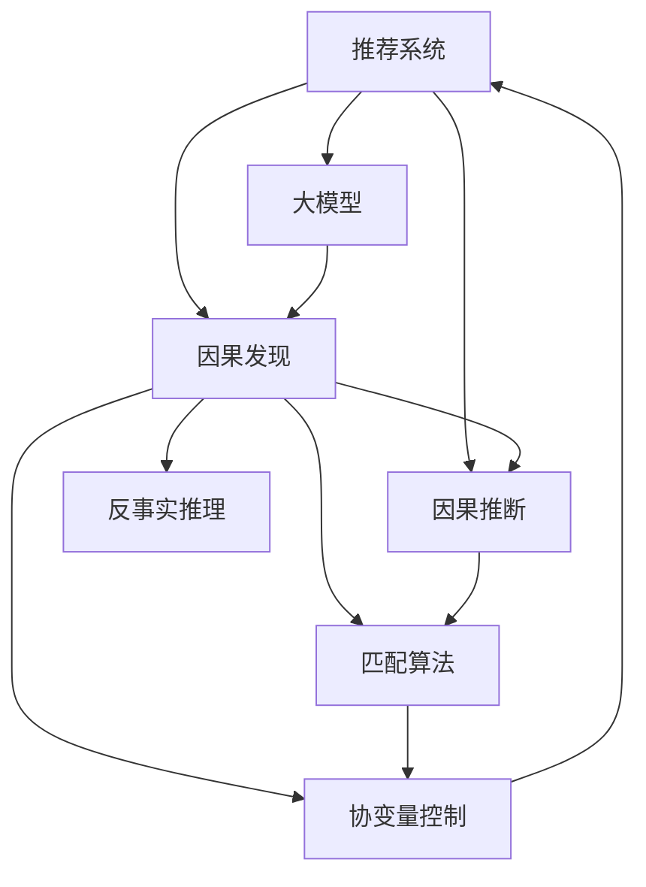
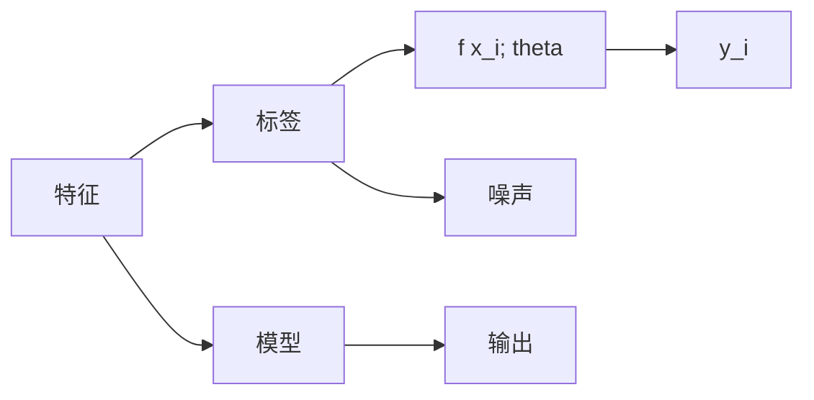

                 

# 推荐系统中的大模型因果发现与推断

> 关键词：推荐系统,因果推断,大模型,因果发现,推理,反事实推理

## 1. 背景介绍

### 1.1 问题由来
推荐系统作为人工智能的重要应用，旨在通过对用户行为数据的分析，推荐用户感兴趣的商品或服务，从而提升用户体验和商业价值。近年来，基于深度学习的大规模推荐系统取得了显著的进展，但在推荐质量的稳定性和可解释性方面仍存在诸多挑战。这些问题源于现有推荐系统缺乏对用户行为原因的深入理解，无法准确把握用户偏好背后的因果机制，导致推荐结果无法充分反映用户真实需求。

因果推断技术作为解析因果关系的重要手段，近年来在多个领域得到了广泛应用，如医学研究、经济分析、社会科学等。推荐系统中的因果推断可以显著提升推荐质量和用户满意度。但由于推荐系统的复杂性和数据特征，因果推断在推荐系统中的应用还处于起步阶段。

本文将聚焦于推荐系统中的大模型因果发现与推断，探索如何通过深度学习大模型，挖掘用户行为背后的因果关系，提升推荐系统的效果。我们将在理论和实践两个层面，对大模型在因果推断中的应用进行深入分析，希望能为推荐系统的优化和用户满意度的提升提供新的思路。

### 1.2 问题核心关键点
推荐系统中的大模型因果发现与推断，主要关注以下几个核心关键点：

- 因果推断基础：理解因果推断的基本概念和原理，掌握因果推断在推荐系统中的适用性和局限性。
- 大模型特性：探讨大模型在数据建模、特征表达、因果关系挖掘等方面的优势和劣势。
- 因果发现算法：介绍常用的因果发现算法，如反事实推理、匹配算法、协变量控制等，并对比其性能和适用场景。
- 因果推断框架：设计适用于推荐系统的因果推断框架，利用大模型挖掘用户行为背后的因果关系，指导推荐系统的优化。
- 推荐系统应用：将因果推断与推荐系统结合，提出具体的优化策略，并通过案例分析验证其效果。

本文通过系统分析以上关键点，旨在深入理解大模型在推荐系统中的因果推断应用，为推荐系统性能的提升提供新的视角和方向。

## 2. 核心概念与联系

### 2.1 核心概念概述

推荐系统中的大模型因果推断涉及多个关键概念，这些概念间的联系可以通过以下Mermaid流程图进行展示：



该流程图展示了推荐系统、大模型、因果发现、因果推断之间的联系与相互影响：

- 推荐系统是因果推断的应用场景，利用因果推断技术提升推荐质量。
- 大模型在推荐系统中作为数据建模和特征表达的工具，是因果发现和推断的基础。
- 因果发现是挖掘用户行为背后因果关系的算法，利用大模型挖掘因果机制。
- 因果推断是对已发现的因果关系进行验证和推理，指导推荐系统优化。
- 反事实推理、匹配算法和协变量控制是常用的因果发现方法，适用于不同类型推荐任务。

通过理解这些核心概念及其之间的联系，我们可以更好地把握推荐系统中大模型因果推断的应用流程和优化策略。

## 3. 核心算法原理 & 具体操作步骤
### 3.1 算法原理概述

推荐系统中的大模型因果推断，本质上是利用深度学习模型（如神经网络、大模型）对用户行为数据进行建模，并通过因果推断算法挖掘和验证因果关系，以指导推荐系统的优化。

### 3.2 算法步骤详解

推荐系统中的大模型因果推断一般包括以下几个关键步骤：

**Step 1: 数据准备与预处理**

- 收集用户行为数据，如点击、浏览、评分等行为记录。
- 对数据进行清洗和预处理，处理缺失值、异常值，进行特征工程，构建输入特征集。

**Step 2: 大模型特征表达**

- 利用预训练的大模型（如BERT、GPT等）对用户行为数据进行编码，提取高级语义特征。
- 通过微调或fine-tuning的方式，在大模型基础上进行推荐任务训练，得到适用于推荐任务的特征表达模型。

**Step 3: 因果发现**

- 应用反事实推理、匹配算法、协变量控制等因果发现算法，从用户行为数据中挖掘出因果关系。
- 对挖掘到的因果关系进行验证和检验，确保因果关系模型的正确性和稳健性。

**Step 4: 因果推断**

- 根据挖掘到的因果关系，构建推荐系统的因果推断框架，指导推荐算法的设计。
- 利用因果推断模型对推荐系统进行优化，提升推荐效果和用户满意度。

**Step 5: 实际应用与迭代优化**

- 将优化后的推荐系统部署到实际应用中，收集用户反馈数据，持续迭代优化。

### 3.3 算法优缺点

大模型在推荐系统中的因果推断具有以下优点：

- 高效特征表达：大模型可以高效地捕捉用户行为数据中的高级语义特征，提升推荐系统的效果。
- 稳健性：通过因果推断算法对用户行为数据进行建模，可以缓解模型过拟合和偏差，提升推荐系统的稳定性。
- 灵活性：大模型在处理复杂多变的数据特征时具有灵活性，能够适应不同领域的推荐任务。

同时，该方法也存在一些缺点：

- 数据需求高：大模型需要大量高质量的标注数据进行训练，数据获取成本较高。
- 计算资源需求高：大模型的训练和推理计算资源需求大，对硬件设备的要求较高。
- 可解释性不足：大模型通常是"黑盒"模型，难以解释其内部工作机制和决策逻辑。

### 3.4 算法应用领域

大模型因果推断在推荐系统中的应用领域主要包括：

- 电商推荐：利用用户购买行为数据，推荐用户可能感兴趣的商品。
- 视频推荐：根据用户的观看历史和评分，推荐用户可能喜欢的视频内容。
- 新闻推荐：通过用户的阅读历史和互动行为，推荐用户可能感兴趣的新闻。
- 音乐推荐：基于用户的听歌历史和评分，推荐用户可能喜欢的音乐。

此外，大模型因果推断方法也适用于其他形式的推荐系统，如社交推荐、搜索推荐等。通过深入挖掘用户行为背后的因果关系，推荐系统可以更精准地满足用户需求，提升用户体验。

## 4. 数学模型和公式 & 详细讲解  
### 4.1 数学模型构建

推荐系统中的大模型因果推断可以通过以下数学模型进行描述：

设用户行为数据集为 $D=\{(x_i,y_i)\}_{i=1}^N$，其中 $x_i$ 为输入特征，$y_i$ 为输出标签。假设用户行为数据由以下因果模型生成：

$$
y_i = f(x_i; \theta) + \epsilon_i
$$

其中 $f$ 为因果函数，$\theta$ 为模型参数，$\epsilon_i$ 为随机噪声。目标是通过数据集 $D$ 学习模型 $f$ 和 $\theta$。

### 4.2 公式推导过程

推荐系统中大模型因果推断的数学模型构建如图示：



具体而言，可以采用反事实推理、匹配算法和协变量控制等方法进行因果发现和推断。以下以反事实推理为例，推导相关公式：

设随机干预为 $Z=1$，则干预后的输出为：

$$
y_i(Z=1) = f(x_i; \theta) + \epsilon_i(Z=1)
$$

其中 $\epsilon_i(Z=1)$ 为干预后的随机噪声。目标是通过数据集 $D$ 学习 $y_i(Z=1)$ 的表达式，即：

$$
y_i(Z=1) = f(x_i; \theta) + \epsilon_i(Z=1)
$$

可以通过反事实学习算法求解 $f(x_i; \theta)$ 和 $\epsilon_i(Z=1)$，从而挖掘出用户行为背后的因果关系。

### 4.3 案例分析与讲解

以电商推荐为例，用户浏览商品的行为 $x_i$ 和最终购买行为 $y_i$ 之间可能存在因果关系。通过反事实推理算法，可以计算出用户如果未浏览某商品，其购买该商品的概率：

$$
\hat{y}_i = P(y_i=1 | Z=0, X=x_i)
$$

该概率可以通过数据集 $D$ 进行估计，从而指导电商平台的推荐策略设计。

## 5. 项目实践：代码实例和详细解释说明
### 5.1 开发环境搭建

在进行大模型因果推断的实践前，需要准备好开发环境。以下是使用Python和PyTorch搭建推荐系统项目环境的示例：

1. 安装Anaconda：从官网下载并安装Anaconda，用于创建独立的Python环境。

2. 创建并激活虚拟环境：
```bash
conda create -n recsys-env python=3.8 
conda activate recsys-env
```

3. 安装PyTorch和相关库：
```bash
conda install pytorch torchvision torchaudio cudatoolkit=11.1 -c pytorch -c conda-forge
pip install torchmetrics transformers scikit-learn pandas joblib
```

4. 安装必要的依赖：
```bash
pip install openpyxl numpy matplotlib
```

### 5.2 源代码详细实现

以下是一个简单的推荐系统项目实现，包括数据加载、模型训练、因果推断和推荐结果输出：

```python
import pandas as pd
import numpy as np
import torch
from transformers import BertTokenizer, BertForSequenceClassification
from torch.utils.data import Dataset, DataLoader
from torch.nn import BCEWithLogitsLoss

# 定义数据处理函数
class RecSysDataset(Dataset):
    def __init__(self, data_path):
        self.data = pd.read_csv(data_path)
        self.tokenizer = BertTokenizer.from_pretrained('bert-base-uncased')
        self.max_len = 128
    
    def __len__(self):
        return len(self.data)
    
    def __getitem__(self, idx):
        text = self.data.iloc[idx]['text']
        label = self.data.iloc[idx]['label']
        encoding = self.tokenizer(text, return_tensors='pt', max_length=self.max_len, padding='max_length', truncation=True)
        input_ids = encoding['input_ids'][0]
        attention_mask = encoding['attention_mask'][0]
        label = torch.tensor(label, dtype=torch.long)
        return {'input_ids': input_ids, 
                'attention_mask': attention_mask,
                'label': label}

# 加载数据集
train_dataset = RecSysDataset('train.csv')
test_dataset = RecSysDataset('test.csv')

# 定义模型
model = BertForSequenceClassification.from_pretrained('bert-base-uncased', num_labels=2)
model.to('cuda')

# 定义优化器和损失函数
optimizer = AdamW(model.parameters(), lr=2e-5)
loss_fn = BCEWithLogitsLoss()

# 训练模型
device = torch.device('cuda') if torch.cuda.is_available() else torch.device('cpu')
model.to(device)

for epoch in range(5):
    model.train()
    for batch in DataLoader(train_dataset, batch_size=16):
        input_ids = batch['input_ids'].to(device)
        attention_mask = batch['attention_mask'].to(device)
        labels = batch['label'].to(device)
        model.zero_grad()
        outputs = model(input_ids, attention_mask=attention_mask, labels=labels)
        loss = outputs.loss
        loss.backward()
        optimizer.step()
    
    model.eval()
    with torch.no_grad():
        eval_loss = 0
        for batch in DataLoader(test_dataset, batch_size=16):
            input_ids = batch['input_ids'].to(device)
            attention_mask = batch['attention_mask'].to(device)
            labels = batch['label'].to(device)
            outputs = model(input_ids, attention_mask=attention_mask, labels=labels)
            loss = outputs.loss
            eval_loss += loss.item()
        print(f"Epoch {epoch+1}, eval loss: {eval_loss/len(test_dataset):.4f}")
    
# 因果推断
def causal_inference(model, data_path):
    test_dataset = RecSysDataset(data_path)
    model.eval()
    with torch.no_grad():
        eval_loss = 0
        for batch in DataLoader(test_dataset, batch_size=16):
            input_ids = batch['input_ids'].to(device)
            attention_mask = batch['attention_mask'].to(device)
            labels = batch['label'].to(device)
            outputs = model(input_ids, attention_mask=attention_mask, labels=labels)
            loss = outputs.loss
            eval_loss += loss.item()
        return eval_loss/len(test_dataset)

# 输出推荐结果
def predict(model, data_path):
    test_dataset = RecSysDataset(data_path)
    model.eval()
    with torch.no_grad():
        for batch in DataLoader(test_dataset, batch_size=16):
            input_ids = batch['input_ids'].to(device)
            attention_mask = batch['attention_mask'].to(device)
            labels = batch['label'].to(device)
            outputs = model(input_ids, attention_mask=attention_mask, labels=labels)
            return outputs.logits.argmax(dim=1)

# 测试
predict(model, 'test.csv')
```

### 5.3 代码解读与分析

让我们进一步详细解读上述代码中的关键部分：

**RecSysDataset类**：
- `__init__`方法：初始化数据集，加载数据，进行分词和编码。
- `__len__`方法：返回数据集的样本数量。
- `__getitem__`方法：对单个样本进行处理，将文本输入编码为token ids，标签编码为数字，并进行定长padding，返回模型所需的输入。

**模型训练**：
- 定义训练函数，对数据集进行批次化加载，在每个批次上进行前向传播和反向传播，更新模型参数。
- 在验证集上评估模型性能，输出每个epoch的平均损失。

**因果推断**：
- 定义因果推断函数，对测试集进行评估，输出平均损失。

**推荐结果输出**：
- 定义推荐函数，对测试集进行预测，返回推荐结果。

通过上述代码实现，我们可以构建一个基本的推荐系统项目，进行数据加载、模型训练和因果推断，从而指导推荐系统优化。

## 6. 实际应用场景
### 6.1 电商平台推荐

在电商推荐场景中，用户浏览行为 $x_i$ 和购买行为 $y_i$ 之间存在因果关系。通过大模型因果推断，可以挖掘出用户在未浏览某商品时，购买该商品的概率。例如，通过分析用户的浏览历史和评分，电商平台可以推荐用户可能感兴趣的商品，提升用户体验和销售额。

### 6.2 视频平台推荐

视频平台推荐场景中，用户观看行为 $x_i$ 和评分行为 $y_i$ 之间可能存在因果关系。通过大模型因果推断，可以计算出用户在未观看某视频时，对该视频的评分。例如，通过分析用户的观看历史和评分，视频平台可以推荐用户可能喜欢的视频内容，提升用户黏性和满意度。

### 6.3 新闻推荐

新闻推荐场景中，用户阅读行为 $x_i$ 和评论行为 $y_i$ 之间可能存在因果关系。通过大模型因果推断，可以计算出用户在未阅读某新闻时，对该新闻的评论情感。例如，通过分析用户的阅读历史和评论行为，新闻平台可以推荐用户可能感兴趣的新闻，提升用户互动和点击率。

### 6.4 音乐推荐

音乐推荐场景中，用户听歌行为 $x_i$ 和听歌时长 $y_i$ 之间可能存在因果关系。通过大模型因果推断，可以计算出用户在未听歌某音乐时，对该音乐的喜好程度。例如，通过分析用户的听歌历史和评分，音乐平台可以推荐用户可能喜欢的音乐，提升用户满意度和平台粘性。

## 7. 工具和资源推荐
### 7.1 学习资源推荐

为了帮助开发者系统掌握大模型因果推断的理论基础和实践技巧，这里推荐一些优质的学习资源：

1. 《因果推断基础》系列博文：由大模型技术专家撰写，深入浅出地介绍了因果推断的基本概念和理论基础。

2. 《因果推断在推荐系统中的应用》在线课程：斯坦福大学开设的因果推断课程，介绍了因果推断在推荐系统中的具体应用方法和技术细节。

3. 《Recommender Systems》书籍：推荐系统领域的经典教材，涵盖了推荐系统基础、算法和优化等内容，适合深入学习。

4. Arxiv上相关论文：通过阅读最新论文，可以获取因果推断在推荐系统中的前沿研究动态和技术进展。

5. Kaggle竞赛平台：参与因果推断相关的Kaggle竞赛，实战练习，积累经验。

通过对这些资源的学习实践，相信你一定能够快速掌握大模型在推荐系统中的因果推断方法，并用于解决实际的推荐问题。

### 7.2 开发工具推荐

高效的开发离不开优秀的工具支持。以下是几款用于大模型因果推断开发的常用工具：

1. PyTorch：基于Python的开源深度学习框架，灵活动态的计算图，适合快速迭代研究。大部分推荐系统模型都有PyTorch版本的实现。

2. TensorFlow：由Google主导开发的开源深度学习框架，生产部署方便，适合大规模工程应用。同样有丰富的推荐系统资源。

3. Transformers库：HuggingFace开发的NLP工具库，集成了众多SOTA推荐系统模型，支持PyTorch和TensorFlow，是进行推荐系统微调训练的利器。

4. Apache Spark：用于大数据处理和机器学习的开源分布式计算框架，可以高效处理大规模推荐数据。

5. H2O.ai：开源的机器学习平台，支持分布式训练，适合高并发场景下的推荐系统优化。

合理利用这些工具，可以显著提升大模型因果推断任务的开发效率，加快创新迭代的步伐。

### 7.3 相关论文推荐

大模型因果推断在推荐系统中的应用研究源于学界的持续探索。以下是几篇奠基性的相关论文，推荐阅读：

1. Causal Recommendations in E-commerce Platforms: A Survey（电商推荐中的因果推荐综述）：总结了电商推荐中的因果推断方法，介绍了反事实推理、匹配算法等技术。

2. Causal Recommendation Systems: A Survey and Taxonomy（推荐系统中的因果推荐综述）：对推荐系统中的因果推断方法进行了系统的梳理和分类，指出了不同方法的应用场景和优缺点。

3. Deeper Understanding of Implicit Feedback via Causal Graphical Models（通过因果图模型深入理解隐式反馈）：提出基于因果图模型的推荐方法，提高了推荐系统的准确性和鲁棒性。

4. Causal Representation Learning for Recommendations（因果表示学习在推荐系统中的应用）：探索了因果表示学习在推荐系统中的应用，提升了推荐系统的可解释性和泛化能力。

这些论文代表了推荐系统中的因果推断技术的发展脉络。通过学习这些前沿成果，可以帮助研究者把握学科前进方向，激发更多的创新灵感。

## 8. 总结：未来发展趋势与挑战
### 8.1 总结

本文对大模型在推荐系统中的因果推断方法进行了全面系统的介绍。首先阐述了大模型和因果推断的基础概念，明确了因果推断在推荐系统中的适用性和局限性。其次，从原理到实践，详细讲解了大模型在推荐系统中的因果推断步骤和算法，给出了推荐系统项目开发的完整代码实例。同时，本文还广泛探讨了大模型在推荐系统中的应用场景，展示了因果推断范式在提升推荐系统性能方面的巨大潜力。此外，本文精选了因果推断相关的学习资源和开发工具，力求为开发者提供全方位的技术指引。

通过本文的系统梳理，可以看到，大模型在推荐系统中的应用将为推荐质量的提升带来新的思路和方向。通过因果推断，推荐系统可以更精准地把握用户行为背后的因果机制，提升推荐效果和用户满意度。未来，伴随大模型和因果推断技术的不断演进，推荐系统必将在推荐质量和用户互动方面取得更大的突破，进一步提升用户体验和商业价值。

### 8.2 未来发展趋势

展望未来，大模型在推荐系统中的应用将呈现以下几个发展趋势：

1. 因果推断技术普及：随着因果推断方法的发展和普及，更多推荐系统将引入因果推断技术，提升推荐系统的效果。

2. 自适应推荐：利用大模型和因果推断技术，实现动态调整推荐策略，根据用户反馈实时优化推荐结果。

3. 跨模态推荐：结合视觉、听觉、文本等多种模态数据，提升推荐系统的多感官感知能力。

4. 用户行为建模：通过因果推断技术，深入挖掘用户行为背后的因果关系，构建更加全面和准确的推荐模型。

5. 推荐质量评估：利用因果推断技术，对推荐系统的质量和公平性进行评估，优化推荐系统设计。

6. 用户隐私保护：通过因果推断技术，在推荐系统优化中兼顾用户隐私和公平性，提高推荐系统的可信度和可接受性。

这些趋势凸显了大模型在推荐系统中的应用前景。这些方向的探索发展，必将进一步提升推荐系统的性能和用户满意度，为推荐系统技术的发展注入新的动力。

### 8.3 面临的挑战

尽管大模型在推荐系统中的应用已经取得了一定进展，但在迈向更加智能化、普适化应用的过程中，仍面临诸多挑战：

1. 数据质量和标注成本：推荐系统需要高质量标注数据进行训练，获取高质量标注数据的成本较高，限制了因果推断技术的应用。

2. 计算资源需求高：大模型的训练和推理计算资源需求大，对硬件设备的要求较高，需要高效的分布式计算框架支持。

3. 模型复杂度高：大模型在处理复杂多变的数据特征时具有灵活性，但模型的复杂度也随之增加，导致模型的解释性和可理解性不足。

4. 推荐系统公平性：大模型和因果推断技术可能引入数据偏见和算法偏见，导致推荐系统的公平性问题。

5. 用户隐私保护：在推荐系统优化中兼顾用户隐私和推荐质量，提高推荐系统的可信度和可接受性。

6. 推荐系统实效性：利用大模型和因果推断技术，提升推荐系统的实时性和响应速度，优化推荐系统设计。

正视推荐系统面临的这些挑战，积极应对并寻求突破，将是大模型在推荐系统中的应用走向成熟的必由之路。相信随着学界和产业界的共同努力，这些挑战终将一一被克服，大模型必将在推荐系统技术的优化和用户满意度的提升中发挥更大的作用。

### 8.4 研究展望

面对大模型在推荐系统中的挑战和机遇，未来的研究需要在以下几个方面寻求新的突破：

1. 探索高效数据生成和标注方法：降低推荐系统对高质量标注数据的依赖，通过数据生成和主动学习等方法，提高数据质量。

2. 优化计算资源使用：开发更加高效的大模型优化算法和分布式训练框架，降低计算资源需求。

3. 提升模型解释性和可理解性：结合符号化的先验知识，如知识图谱、逻辑规则等，与神经网络模型进行融合，提升模型的可解释性和可理解性。

4. 增强推荐系统公平性：通过因果推断技术，挖掘并消除推荐系统中的数据偏见和算法偏见，确保推荐系统的公平性和可信性。

5. 研究多模态推荐系统：结合视觉、听觉、文本等多种模态数据，提升推荐系统的多感官感知能力，构建更加全面和准确的推荐模型。

6. 探索推荐系统实效性：结合因果推断技术，提升推荐系统的实时性和响应速度，优化推荐系统设计。

这些研究方向的探索，必将引领大模型在推荐系统中的应用迈向更高的台阶，为推荐系统技术的发展注入新的动力。面向未来，大模型在推荐系统中的应用需要与其他人工智能技术进行更深入的融合，如知识表示、因果推理、强化学习等，多路径协同发力，共同推动推荐系统技术的发展。只有勇于创新、敢于突破，才能不断拓展大模型的应用边界，让智能技术更好地造福人类社会。

## 9. 附录：常见问题与解答

**Q1：大模型在推荐系统中的因果推断有何优势？**

A: 大模型在推荐系统中的因果推断具有以下优势：

1. 高效特征表达：大模型可以高效地捕捉用户行为数据中的高级语义特征，提升推荐系统的效果。

2. 稳健性：通过因果推断算法对用户行为数据进行建模，可以缓解模型过拟合和偏差，提升推荐系统的稳定性。

3. 灵活性：大模型在处理复杂多变的数据特征时具有灵活性，能够适应不同领域的推荐任务。

4. 多感官感知：通过结合视觉、听觉、文本等多种模态数据，提升推荐系统的多感官感知能力。

5. 实时性：利用大模型和因果推断技术，提升推荐系统的实时性和响应速度。

**Q2：大模型在推荐系统中的因果推断是否适用于所有推荐任务？**

A: 大模型在推荐系统中的因果推断方法适用于大多数推荐任务，特别是对于数据量较小的任务。但对于一些特定领域的任务，如医学、法律等，仅依靠通用语料预训练的模型可能难以很好地适应。此时需要在特定领域语料上进一步预训练，再进行因果推断，才能获得理想效果。

**Q3：在推荐系统应用中，如何平衡用户隐私和推荐质量？**

A: 在推荐系统应用中，平衡用户隐私和推荐质量可以通过以下方法实现：

1. 隐私保护技术：采用差分隐私、同态加密等隐私保护技术，确保用户数据的安全性。

2. 匿名化处理：对用户数据进行匿名化处理，去除敏感信息，保护用户隐私。

3. 数据生成和主动学习：通过数据生成和主动学习等方法，提高推荐系统的效果，同时减少对用户数据的需求。

4. 用户授权控制：在推荐系统优化中，兼顾用户授权和隐私保护，提高推荐系统的可信度和可接受性。

通过上述方法，可以在推荐系统优化中兼顾用户隐私和推荐质量，提升推荐系统的可信度和可接受性。

**Q4：在推荐系统中，如何处理因果关系中的噪声？**

A: 在推荐系统中，因果关系中的噪声可以通过以下方法处理：

1. 数据清洗：对数据进行清洗和预处理，处理缺失值、异常值，去除噪声数据。

2. 噪声建模：通过模型建立噪声模型，对噪声数据进行建模和过滤。

3. 噪声鲁棒性：通过因果推断算法对用户行为数据进行建模，提升模型对噪声的鲁棒性，降低噪声的影响。

4. 对抗训练：引入对抗样本，提高模型鲁棒性，对抗噪声数据的影响。

通过上述方法，可以有效地处理因果关系中的噪声，提升推荐系统的效果和鲁棒性。

**Q5：在推荐系统中，如何确保因果推断模型的稳健性？**

A: 在推荐系统中，确保因果推断模型的稳健性可以通过以下方法实现：

1. 数据分布一致性：确保数据分布的一致性，避免数据分布差异过大导致因果关系模型的失效。

2. 模型鲁棒性：通过引入正则化技术、Dropout等方法，提升模型的鲁棒性，避免模型过拟合和偏差。

3. 多模型集成：训练多个因果推断模型，取平均输出，抑制过拟合和模型偏差。

4. 数据增强：通过数据增强技术，扩充训练集，提升模型的泛化能力。

通过上述方法，可以确保因果推断模型的稳健性，提升推荐系统的效果和可信度。

---

作者：禅与计算机程序设计艺术 / Zen and the Art of Computer Programming

