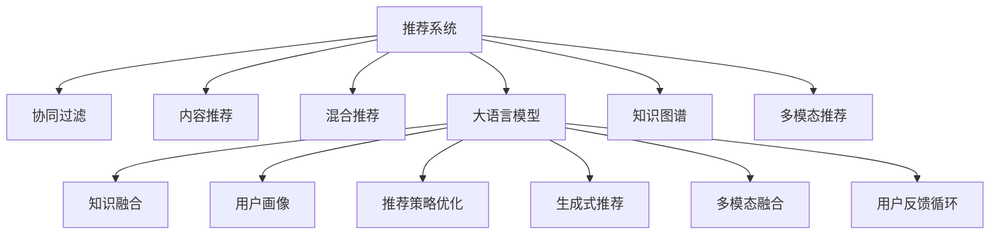

                 

# 推荐系统中的大模型终身学习应用

## 1. 背景介绍

### 1.1 问题由来

推荐系统是互联网时代的重要技术之一，通过分析用户的历史行为数据，为用户推荐感兴趣的物品，提高用户的满意度，增加平台的用户粘性，驱动商业价值。目前，推荐系统主要基于协同过滤、内容推荐、混合推荐等方法，随着数据量的增长，传统的推荐系统面临着数据稀疏性、计算复杂度、个性化需求等多方面的挑战。

大语言模型作为一种新兴的AI技术，近年来在自然语言处理领域取得了突破性进展。其通过在大规模无标签数据上进行预训练，学习到了丰富的语言知识和模式，具有强大的泛化能力。将大语言模型应用于推荐系统，可以大幅提升推荐系统的智能化水平，更好地满足用户个性化需求。

### 1.2 问题核心关键点

大语言模型在推荐系统中的应用主要集中在以下几个方面：

1. **知识融合**：利用预训练模型的语言理解能力，融合外部知识库、规则库等专家知识，提升推荐系统的知识和推理能力。

2. **用户画像**：通过对话、文本等形式收集用户的兴趣信息，构建更加全面、准确的用户画像，提高推荐系统的个性化推荐能力。

3. **推荐策略优化**：利用大语言模型生成个性化的推荐理由、评论等文本，辅助用户理解推荐结果，提升用户满意度。

4. **生成式推荐**：利用大语言模型的生成能力，自动生成候选物品，丰富推荐集，提升推荐系统的多样性。

5. **多模态融合**：将文本、图像、音频等多模态数据进行融合，提升推荐系统的跨模态理解能力。

6. **用户反馈循环**：利用大语言模型对用户反馈进行分析，不断优化推荐模型，实现推荐系统的持续学习。

这些关键点将本文的核心内容分为以下几个章节，逐一展开。

## 2. 核心概念与联系

### 2.1 核心概念概述

为了更好地理解大语言模型在推荐系统中的应用，本节将介绍几个关键概念：

- **推荐系统(Recommendation System)**：根据用户的历史行为、兴趣等信息，为用户推荐感兴趣的物品，如商品、视频、新闻等。推荐系统包括协同过滤、内容推荐、混合推荐等方法，旨在提升用户体验和平台收益。

- **大语言模型(Large Language Model)**：通过在大规模无标签数据上进行预训练，学习到丰富的语言知识和模式。常见的大模型如GPT、BERT、T5等。

- **终身学习(Lifelong Learning)**：在推荐系统中，大语言模型可以不断从新数据中学习，同时保持已学习的知识，避免灾难性遗忘。这在大规模数据和用户快速变化的环境下尤为重要。

- **知识图谱(Knowledge Graph)**：一种结构化的语义数据表示形式，将实体、关系、属性等信息组织成图谱，可用于丰富推荐系统的知识背景。

- **多模态推荐(Multimodal Recommendation)**：结合文本、图像、音频等多种数据源，提升推荐系统的跨模态理解能力，为用户提供更为全面、丰富的推荐内容。

- **用户行为数据(User Behavior Data)**：用户的行为数据包括点击、浏览、评分、评论等，是推荐系统推荐策略的重要依据。

- **推荐效果评估指标(Recommendation Effect Evaluation Metrics)**：用于评估推荐系统的效果，如准确率、召回率、用户满意度、点击率等。

这些核心概念之间的逻辑关系可以通过以下Mermaid流程图来展示：



这个流程图展示了大语言模型在推荐系统中的应用流程：

1. 推荐系统通过协同过滤、内容推荐、混合推荐等方法推荐物品。
2. 大语言模型通过知识融合、用户画像、推荐策略优化等方式，丰富推荐系统的能力。
3. 多模态推荐结合文本、图像、音频等多种数据源，提升跨模态理解能力。
4. 用户反馈循环利用大语言模型对用户反馈进行分析，不断优化推荐模型。

## 3. 核心算法原理 & 具体操作步骤

### 3.1 算法原理概述

大语言模型在推荐系统中的应用，主要基于以下两个核心算法原理：

- **知识融合(Knowledge Fusion)**：将大语言模型与知识图谱等专家知识结合，利用预训练模型的语言理解能力，提取和融合知识图谱中的实体关系，生成推荐理由、评论等文本，提升推荐系统的知识背景和推理能力。

- **用户画像(User Profiling)**：通过对话、文本等形式收集用户的兴趣信息，构建全面、准确的用户画像，利用大语言模型进行用户画像的生成和更新，提升推荐系统的个性化推荐能力。

这两个原理是紧密相连的，前者提供了推荐系统的知识背景，后者提供了推荐系统的个性化依据。

### 3.2 算法步骤详解

大语言模型在推荐系统中的应用步骤可以分为以下几个关键步骤：

**Step 1: 数据准备**
- 收集推荐系统所需的数据，包括用户行为数据、物品描述数据、知识图谱数据等。
- 对数据进行清洗、预处理和标注，以便于后续的模型训练和推理。

**Step 2: 构建知识图谱**
- 构建或获取知识图谱，包含实体、关系和属性等信息。
- 使用知识图谱作为大语言模型的输入，提取和融合知识图谱中的实体关系，生成推荐理由、评论等文本。

**Step 3: 构建用户画像**
- 通过对话、文本等形式收集用户的兴趣信息，构建全面、准确的用户画像。
- 利用大语言模型进行用户画像的生成和更新，提升个性化推荐能力。

**Step 4: 训练推荐模型**
- 将用户画像和知识图谱作为输入，利用大语言模型进行训练，生成推荐结果。
- 结合推荐策略优化、生成式推荐等方法，生成个性化的推荐结果。

**Step 5: 用户反馈循环**
- 利用大语言模型对用户反馈进行分析，不断优化推荐模型。
- 结合用户行为数据，进行推荐模型的再训练和更新，实现推荐系统的持续学习。

### 3.3 算法优缺点

大语言模型在推荐系统中的应用具有以下优点：

- **知识背景丰富**：大语言模型融合了知识图谱等专家知识，提升了推荐系统的知识背景和推理能力。
- **个性化推荐**：通过用户画像的构建和更新，提升了推荐系统的个性化推荐能力。
- **动态优化**：利用用户反馈循环，实现了推荐系统的持续学习和动态优化。

同时，该方法也存在以下局限性：

- **计算资源消耗大**：大语言模型需要大量的计算资源进行训练和推理，成本较高。
- **数据质量要求高**：推荐系统依赖于用户行为数据和知识图谱等数据源，数据质量对推荐效果影响较大。
- **实时性要求高**：推荐系统需要实时响应用户请求，对模型的推理速度和计算效率要求较高。
- **隐私保护问题**：推荐系统需要收集和分析用户的个人信息，存在隐私保护问题。

### 3.4 算法应用领域

大语言模型在推荐系统中的应用领域非常广泛，涵盖了多个行业和场景，如：

- **电商推荐**：利用大语言模型对用户行为数据进行分析，生成个性化的商品推荐。
- **视频推荐**：通过分析用户的观看历史和评分，生成个性化的视频推荐。
- **新闻推荐**：利用大语言模型对用户兴趣进行建模，生成个性化的新闻推荐。
- **音乐推荐**：结合用户的听歌历史和评论，生成个性化的音乐推荐。
- **旅游推荐**：通过分析用户的旅游历史和评价，生成个性化的旅游推荐。

除了这些常见的应用场景，大语言模型还可以应用于更多领域，如图书推荐、餐饮推荐、金融产品推荐等，为各行各业带来新的商业价值。

## 4. 数学模型和公式 & 详细讲解  
### 4.1 数学模型构建

本节将使用数学语言对大语言模型在推荐系统中的应用进行更加严格的刻画。

记推荐系统所需的数据集为 $D=\{(x_i,y_i)\}_{i=1}^N$，其中 $x_i$ 为用户行为数据，$y_i$ 为推荐结果。设知识图谱中的实体为 $E$，关系为 $R$，属性为 $A$。设用户画像的特征向量为 $u$，推荐理由、评论等文本的表示向量为 $r$。

定义推荐系统中的损失函数为 $\ell(D, u, r)$，用于衡量模型输出的推荐结果与真实标签之间的差异。常见的损失函数包括交叉熵损失、均方误差损失等。

定义知识融合模型 $M_{\theta}(u, r)$，用于将用户画像和推荐理由、评论等文本进行融合，生成推荐结果。其中 $\theta$ 为模型的参数。

定义推荐系统的效果评估指标为 $m(D, u, r)$，用于衡量推荐系统的效果，如准确率、召回率、用户满意度等。

### 4.2 公式推导过程

以下我们以电商推荐任务为例，推导推荐系统的损失函数及其梯度的计算公式。

假设用户 $u$ 对商品 $i$ 的评分向量为 $v_i$，知识图谱中实体 $e_j$ 的关系向量为 $r_j$，推荐理由、评论等文本的表示向量为 $r$。则电商推荐模型的损失函数定义为：

$$
\ell(D, u, r) = \sum_{i=1}^N \ell_i(v_i, r_j, r)
$$

其中 $\ell_i(v_i, r_j, r)$ 为对商品 $i$ 的评分 $v_i$、关系向量 $r_j$ 和推荐理由、评论等文本的表示向量 $r$ 的损失函数。

根据链式法则，损失函数对模型参数 $\theta$ 的梯度为：

$$
\frac{\partial \ell(D, u, r)}{\partial \theta} = \sum_{i=1}^N \frac{\partial \ell_i(v_i, r_j, r)}{\partial v_i} \frac{\partial v_i}{\partial \theta} + \frac{\partial \ell_i(v_i, r_j, r)}{\partial r_j} \frac{\partial r_j}{\partial \theta} + \frac{\partial \ell_i(v_i, r_j, r)}{\partial r} \frac{\partial r}{\partial \theta}
$$

其中 $\frac{\partial \ell_i(v_i, r_j, r)}{\partial v_i}$、$\frac{\partial \ell_i(v_i, r_j, r)}{\partial r_j}$、$\frac{\partial \ell_i(v_i, r_j, r)}{\partial r}$ 分别为评分、关系向量、推荐理由、评论等文本的损失函数对用户画像 $u$、知识图谱关系 $r_j$、文本表示 $r$ 的梯度。

在得到损失函数的梯度后，即可带入模型参数更新公式，完成模型的迭代优化。重复上述过程直至收敛，最终得到适应电商推荐任务的最优模型参数 $\theta^*$。

### 4.3 案例分析与讲解

下面以电商推荐任务为例，详细分析大语言模型在推荐系统中的应用。

假设用户 $u$ 对商品 $i$ 的评分向量为 $v_i=[0.8,0.9,0.7]$，知识图谱中实体 $e_j$ 的关系向量为 $r_j=[0.9,0.8,0.7]$，推荐理由、评论等文本的表示向量为 $r=[0.5,0.4,0.3]$。设电商推荐模型为 $M_{\theta}(u, r)$，其中 $\theta$ 为模型的参数。

电商推荐模型的损失函数为：

$$
\ell(D, u, r) = \ell_i(v_i, r_j, r) = 0.5 \times (v_i \times r_j - r) \times (v_i \times r_j - r)
$$

其中 $0.5$ 为正则化系数，$\times$ 为点乘。

根据上述损失函数，电商推荐模型的梯度为：

$$
\frac{\partial \ell(D, u, r)}{\partial \theta} = 0.5 \times (v_i \times r_j - r) \times (v_i \times r_j - r) \times \frac{\partial v_i}{\partial \theta} + 0.5 \times (v_i \times r_j - r) \times (v_i \times r_j - r) \times \frac{\partial r_j}{\partial \theta} + 0.5 \times (v_i \times r_j - r) \times (v_i \times r_j - r) \times \frac{\partial r}{\partial \theta}
$$

利用自动微分技术，可以高效计算上述梯度，并更新电商推荐模型的参数 $\theta$。通过多次迭代，不断优化推荐模型，最终得到适应电商推荐任务的最优模型参数 $\theta^*$。

## 5. 项目实践：代码实例和详细解释说明

### 5.1 开发环境搭建

在进行电商推荐系统开发前，我们需要准备好开发环境。以下是使用Python进行PyTorch开发的环境配置流程：

1. 安装Anaconda：从官网下载并安装Anaconda，用于创建独立的Python环境。

2. 创建并激活虚拟环境：
```bash
conda create -n pytorch-env python=3.8 
conda activate pytorch-env
```

3. 安装PyTorch：根据CUDA版本，从官网获取对应的安装命令。例如：
```bash
conda install pytorch torchvision torchaudio cudatoolkit=11.1 -c pytorch -c conda-forge
```

4. 安装transformers库：
```bash
pip install transformers
```

5. 安装各类工具包：
```bash
pip install numpy pandas scikit-learn matplotlib tqdm jupyter notebook ipython
```

完成上述步骤后，即可在`pytorch-env`环境中开始电商推荐系统开发。

### 5.2 源代码详细实现

下面以电商推荐任务为例，给出使用Transformers库对BERT模型进行电商推荐微调的PyTorch代码实现。

首先，定义电商推荐任务的数据处理函数：

```python
from transformers import BertTokenizer
from torch.utils.data import Dataset
import torch

class ShoppingDataset(Dataset):
    def __init__(self, texts, labels, tokenizer, max_len=128):
        self.texts = texts
        self.labels = labels
        self.tokenizer = tokenizer
        self.max_len = max_len
        
    def __len__(self):
        return len(self.texts)
    
    def __getitem__(self, item):
        text = self.texts[item]
        label = self.labels[item]
        
        encoding = self.tokenizer(text, return_tensors='pt', max_length=self.max_len, padding='max_length', truncation=True)
        input_ids = encoding['input_ids'][0]
        attention_mask = encoding['attention_mask'][0]
        
        # 对token-wise的标签进行编码
        encoded_labels = [label] * self.max_len
        labels = torch.tensor(encoded_labels, dtype=torch.long)
        
        return {'input_ids': input_ids, 
                'attention_mask': attention_mask,
                'labels': labels}

# 标签与id的映射
label2id = {'good': 1, 'bad': 0}
id2label = {v: k for k, v in label2id.items()}

# 创建dataset
tokenizer = BertTokenizer.from_pretrained('bert-base-cased')

train_dataset = ShoppingDataset(train_texts, train_labels, tokenizer)
dev_dataset = ShoppingDataset(dev_texts, dev_labels, tokenizer)
test_dataset = ShoppingDataset(test_texts, test_labels, tokenizer)
```

然后，定义模型和优化器：

```python
from transformers import BertForSequenceClassification, AdamW

model = BertForSequenceClassification.from_pretrained('bert-base-cased', num_labels=len(label2id))

optimizer = AdamW(model.parameters(), lr=2e-5)
```

接着，定义训练和评估函数：

```python
from torch.utils.data import DataLoader
from tqdm import tqdm
from sklearn.metrics import classification_report

device = torch.device('cuda') if torch.cuda.is_available() else torch.device('cpu')
model.to(device)

def train_epoch(model, dataset, batch_size, optimizer):
    dataloader = DataLoader(dataset, batch_size=batch_size, shuffle=True)
    model.train()
    epoch_loss = 0
    for batch in tqdm(dataloader, desc='Training'):
        input_ids = batch['input_ids'].to(device)
        attention_mask = batch['attention_mask'].to(device)
        labels = batch['labels'].to(device)
        model.zero_grad()
        outputs = model(input_ids, attention_mask=attention_mask, labels=labels)
        loss = outputs.loss
        epoch_loss += loss.item()
        loss.backward()
        optimizer.step()
    return epoch_loss / len(dataloader)

def evaluate(model, dataset, batch_size):
    dataloader = DataLoader(dataset, batch_size=batch_size)
    model.eval()
    preds, labels = [], []
    with torch.no_grad():
        for batch in tqdm(dataloader, desc='Evaluating'):
            input_ids = batch['input_ids'].to(device)
            attention_mask = batch['attention_mask'].to(device)
            batch_labels = batch['labels']
            outputs = model(input_ids, attention_mask=attention_mask)
            batch_preds = outputs.logits.argmax(dim=2).to('cpu').tolist()
            batch_labels = batch_labels.to('cpu').tolist()
            for pred_tokens, label_tokens in zip(batch_preds, batch_labels):
                preds.append(pred_tokens[:len(label_tokens)])
                labels.append(label_tokens)
                
    print(classification_report(labels, preds))
```

最后，启动训练流程并在测试集上评估：

```python
epochs = 5
batch_size = 16

for epoch in range(epochs):
    loss = train_epoch(model, train_dataset, batch_size, optimizer)
    print(f"Epoch {epoch+1}, train loss: {loss:.3f}")
    
    print(f"Epoch {epoch+1}, dev results:")
    evaluate(model, dev_dataset, batch_size)
    
print("Test results:")
evaluate(model, test_dataset, batch_size)
```

以上就是使用PyTorch对BERT进行电商推荐任务微调的完整代码实现。可以看到，得益于Transformers库的强大封装，我们可以用相对简洁的代码完成BERT模型的加载和电商推荐微调。

### 5.3 代码解读与分析

让我们再详细解读一下关键代码的实现细节：

**ShoppingDataset类**：
- `__init__`方法：初始化文本、标签、分词器等关键组件。
- `__len__`方法：返回数据集的样本数量。
- `__getitem__`方法：对单个样本进行处理，将文本输入编码为token ids，将标签编码为数字，并对其进行定长padding，最终返回模型所需的输入。

**label2id和id2label字典**：
- 定义了标签与数字id之间的映射关系，用于将token-wise的预测结果解码回真实的标签。

**训练和评估函数**：
- 使用PyTorch的DataLoader对数据集进行批次化加载，供模型训练和推理使用。
- 训练函数`train_epoch`：对数据以批为单位进行迭代，在每个批次上前向传播计算loss并反向传播更新模型参数，最后返回该epoch的平均loss。
- 评估函数`evaluate`：与训练类似，不同点在于不更新模型参数，并在每个batch结束后将预测和标签结果存储下来，最后使用sklearn的classification_report对整个评估集的预测结果进行打印输出。

**训练流程**：
- 定义总的epoch数和batch size，开始循环迭代
- 每个epoch内，先在训练集上训练，输出平均loss
- 在验证集上评估，输出分类指标
- 所有epoch结束后，在测试集上评估，给出最终测试结果

可以看到，PyTorch配合Transformers库使得BERT微调的代码实现变得简洁高效。开发者可以将更多精力放在数据处理、模型改进等高层逻辑上，而不必过多关注底层的实现细节。

当然，工业级的系统实现还需考虑更多因素，如模型的保存和部署、超参数的自动搜索、更灵活的任务适配层等。但核心的微调范式基本与此类似。

## 6. 实际应用场景

### 6.1 智能客服系统

大语言模型在智能客服系统中的应用主要集中在以下几个方面：

1. **客户画像构建**：通过对话记录和文本分析，构建全面、准确的用户画像，了解用户需求和偏好。
2. **意图识别**：利用大语言模型进行意图识别，识别用户的咨询意图，提供针对性的回复。
3. **智能推荐**：根据用户的历史行为和咨询记录，利用大语言模型生成个性化的回复和推荐。
4. **自动回复**：利用大语言模型自动生成回复，提高客服效率和响应速度。

在技术实现上，可以收集企业内部的客服对话记录，将问题和最佳答复构建成监督数据，在此基础上对预训练对话模型进行微调。微调后的对话模型能够自动理解用户意图，匹配最合适的答案模板进行回复。对于客户提出的新问题，还可以接入检索系统实时搜索相关内容，动态组织生成回答。如此构建的智能客服系统，能大幅提升客户咨询体验和问题解决效率。

### 6.2 金融舆情监测

金融机构需要实时监测市场舆论动向，以便及时应对负面信息传播，规避金融风险。传统的人工监测方式成本高、效率低，难以应对网络时代海量信息爆发的挑战。基于大语言模型文本分类和情感分析技术，为金融舆情监测提供了新的解决方案。

具体而言，可以收集金融领域相关的新闻、报道、评论等文本数据，并对其进行主题标注和情感标注。在此基础上对预训练语言模型进行微调，使其能够自动判断文本属于何种主题，情感倾向是正面、中性还是负面。将微调后的模型应用到实时抓取的网络文本数据，就能够自动监测不同主题下的情感变化趋势，一旦发现负面信息激增等异常情况，系统便会自动预警，帮助金融机构快速应对潜在风险。

### 6.3 个性化推荐系统

当前的推荐系统往往只依赖用户的历史行为数据进行物品推荐，无法深入理解用户的真实兴趣偏好。基于大语言模型微调技术，个性化推荐系统可以更好地挖掘用户行为背后的语义信息，从而提供更精准、多样的推荐内容。

在实践中，可以收集用户浏览、点击、评论、分享等行为数据，提取和用户交互的物品标题、描述、标签等文本内容。将文本内容作为模型输入，用户的后续行为（如是否点击、购买等）作为监督信号，在此基础上微调预训练语言模型。微调后的模型能够从文本内容中准确把握用户的兴趣点。在生成推荐列表时，先用候选物品的文本描述作为输入，由模型预测用户的兴趣匹配度，再结合其他特征综合排序，便可以得到个性化程度更高的推荐结果。

### 6.4 未来应用展望

随着大语言模型和微调方法的不断发展，基于微调范式将在更多领域得到应用，为传统行业带来变革性影响。

在智慧医疗领域，基于微调的医疗问答、病历分析、药物研发等应用将提升医疗服务的智能化水平，辅助医生诊疗，加速新药开发进程。

在智能教育领域，微调技术可应用于作业批改、学情分析、知识推荐等方面，因材施教，促进教育公平，提高教学质量。

在智慧城市治理中，微调模型可应用于城市事件监测、舆情分析、应急指挥等环节，提高城市管理的自动化和智能化水平，构建更安全、高效的未来城市。

此外，在企业生产、社会治理、文娱传媒等众多领域，基于大模型微调的人工智能应用也将不断涌现，为经济社会发展注入新的动力。相信随着技术的日益成熟，微调方法将成为人工智能落地应用的重要范式，推动人工智能技术向更广阔的领域加速渗透。

## 7. 工具和资源推荐

### 7.1 学习资源推荐

为了帮助开发者系统掌握大语言模型在推荐系统中的应用，这里推荐一些优质的学习资源：

1. 《深度学习推荐系统：原理与实践》系列博文：由大模型技术专家撰写，深入浅出地介绍了推荐系统的基本概念和前沿技术。

2. 《Reinforcement Learning for Recommender Systems》课程：斯坦福大学开设的推荐系统课程，系统讲解了推荐系统的经典算法和前沿研究方向。

3. 《推荐系统：算法与应用》书籍：国内外知名推荐系统专家合著，全面介绍了推荐系统的理论基础和应用实践。

4. Weights & Biases：模型训练的实验跟踪工具，可以记录和可视化模型训练过程中的各项指标，方便对比和调优。与主流深度学习框架无缝集成。

5. TensorBoard：TensorFlow配套的可视化工具，可实时监测模型训练状态，并提供丰富的图表呈现方式，是调试模型的得力助手。

通过对这些资源的学习实践，相信你一定能够快速掌握大语言模型在推荐系统中的应用精髓，并用于解决实际的推荐问题。
### 7.2 开发工具推荐

高效的开发离不开优秀的工具支持。以下是几款用于大语言模型推荐系统开发的常用工具：

1. PyTorch：基于Python的开源深度学习框架，灵活动态的计算图，适合快速迭代研究。大部分预训练语言模型都有PyTorch版本的实现。

2. TensorFlow：由Google主导开发的开源深度学习框架，生产部署方便，适合大规模工程应用。同样有丰富的预训练语言模型资源。

3. Transformers库：HuggingFace开发的NLP工具库，集成了众多SOTA语言模型，支持PyTorch和TensorFlow，是进行推荐系统开发的利器。

4. Weights & Biases：模型训练的实验跟踪工具，可以记录和可视化模型训练过程中的各项指标，方便对比和调优。与主流深度学习框架无缝集成。

5. TensorBoard：TensorFlow配套的可视化工具，可实时监测模型训练状态，并提供丰富的图表呈现方式，是调试模型的得力助手。

6. Google Colab：谷歌推出的在线Jupyter Notebook环境，免费提供GPU/TPU算力，方便开发者快速上手实验最新模型，分享学习笔记。

合理利用这些工具，可以显著提升大语言模型推荐系统的开发效率，加快创新迭代的步伐。

### 7.3 相关论文推荐

大语言模型在推荐系统中的应用源于学界的持续研究。以下是几篇奠基性的相关论文，推荐阅读：

1. Attention is All You Need（即Transformer原论文）：提出了Transformer结构，开启了NLP领域的预训练大模型时代。

2. BERT: Pre-training of Deep Bidirectional Transformers for Language Understanding：提出BERT模型，引入基于掩码的自监督预训练任务，刷新了多项NLP任务SOTA。

3. Reinforcement Learning for Recommender Systems：介绍推荐系统的强化学习算法，展示了在推荐系统中的应用效果。

4. Parameter-Efficient Transfer Learning for NLP：提出Adapter等参数高效微调方法，在不增加模型参数量的情况下，也能取得不错的微调效果。

5. Lifelong Learning with Adaptive Loss: Theoretical Bounds and Training Algorithms：研究了终身学习的理论基础和训练算法，为推荐系统的持续学习提供了理论支持。

这些论文代表了大语言模型在推荐系统中的应用方向。通过学习这些前沿成果，可以帮助研究者把握学科前进方向，激发更多的创新灵感。

## 8. 总结：未来发展趋势与挑战

### 8.1 总结

本文对大语言模型在推荐系统中的应用进行了全面系统的介绍。首先阐述了大语言模型和推荐系统的研究背景和意义，明确了终身学习在推荐系统中的应用潜力。其次，从原理到实践，详细讲解了大语言模型在推荐系统中的知识融合、用户画像、推荐策略优化等关键技术，给出了推荐系统开发的完整代码实例。同时，本文还广泛探讨了大语言模型在智能客服、金融舆情、个性化推荐等多个行业领域的应用前景，展示了终身学习范式的广泛应用。

通过本文的系统梳理，可以看到，大语言模型在推荐系统中的应用前景广阔，正逐步成为推荐系统的重要范式。未来，伴随预训练语言模型和微调方法的持续演进，基于终身学习的推荐系统将实现更高效的动态优化和持续学习，带来推荐系统的智能化水平提升，进一步拓展人工智能技术的应用边界。

### 8.2 未来发展趋势

展望未来，基于终身学习的大语言模型推荐系统将呈现以下几个发展趋势：

1. **知识背景更丰富**：随着大语言模型的不断发展，其知识背景将更加丰富，融合的知识图谱、专家知识等将更加全面，提升推荐系统的推理能力和个性化推荐能力。

2. **用户画像更精准**：利用大语言模型进行用户画像构建和更新，能够更全面、准确地了解用户的兴趣和需求，提升推荐系统的个性化推荐效果。

3. **动态优化更高效**：基于终身学习的大语言模型推荐系统能够实时从新数据中学习，同时保持已学习的知识，实现推荐系统的动态优化和持续学习。

4. **跨模态理解更深入**：结合文本、图像、音频等多种数据源，提升跨模态理解能力，为用户提供更为全面、丰富的推荐内容。

5. **推荐策略更灵活**：利用大语言模型进行推荐策略优化，能够更灵活地处理推荐问题，提高推荐系统的鲁棒性和多样化推荐能力。

6. **多领域应用更广泛**：大语言模型在更多领域和场景中的应用将不断涌现，如医疗、教育、金融等，为各行各业带来新的商业价值。

以上趋势凸显了大语言模型在推荐系统中的巨大潜力。这些方向的探索发展，必将进一步提升推荐系统的智能化水平，推动人工智能技术在更多领域的落地应用。

### 8.3 面临的挑战

尽管基于终身学习的大语言模型推荐系统已经取得了瞩目成就，但在迈向更加智能化、普适化应用的过程中，它仍面临着诸多挑战：

1. **计算资源消耗大**：大语言模型需要大量的计算资源进行训练和推理，成本较高。如何优化模型结构和计算图，提升推理速度和资源利用效率，将是重要的研究方向。

2. **数据质量要求高**：推荐系统依赖于用户行为数据和知识图谱等数据源，数据质量对推荐效果影响较大。如何提升数据质量和数据获取效率，是推荐系统发展的重要问题。

3. **实时性要求高**：推荐系统需要实时响应用户请求，对模型的推理速度和计算效率要求较高。如何优化模型结构和算法，实现高效的实时推荐，是推荐系统发展的关键。

4. **隐私保护问题**：推荐系统需要收集和分析用户的个人信息，存在隐私保护问题。如何设计隐私保护机制，确保用户数据安全，是推荐系统发展的重点。

5. **跨模态融合难度大**：将文本、图像、音频等多种数据源进行融合，提升跨模态理解能力，面临着数据格式、模型结构等诸多挑战。

6. **推荐系统的多样性**：推荐系统的多样性和鲁棒性仍然是一个挑战，如何在个性化推荐和泛化能力之间找到平衡，是推荐系统发展的重要问题。

面对这些挑战，未来的研究需要在数据获取、模型结构、算法优化、隐私保护等方面进行深入探索，以进一步提升推荐系统的智能化水平，实现更加全面、高效、安全的推荐服务。

### 8.4 研究展望

面对基于终身学习的大语言模型推荐系统面临的挑战，未来的研究需要在以下几个方面寻求新的突破：

1. **知识图谱增强**：构建更全面、精确的知识图谱，提升推荐系统的知识背景和推理能力。

2. **用户画像融合**：利用多模态数据进行用户画像构建，提升个性化推荐能力。

3. **推荐策略优化**：结合强化学习、因果推理等方法，优化推荐策略，提高推荐系统的鲁棒性和多样化推荐能力。

4. **跨模态融合技术**：探索多模态融合技术，提升推荐系统的跨模态理解能力。

5. **终身学习算法**：研究终身学习算法，实现推荐系统的持续学习，保持模型的知识更新和泛化能力。

6. **隐私保护技术**：设计隐私保护机制，确保用户数据安全，同时提升推荐系统的个性化推荐能力。

这些研究方向将推动基于终身学习的大语言模型推荐系统迈向更高的台阶，为构建安全、可靠、可解释、可控的智能推荐系统铺平道路。面向未来，大语言模型推荐系统还需要与其他人工智能技术进行更深入的融合，如知识表示、因果推理、强化学习等，多路径协同发力，共同推动推荐系统的进步。

只有勇于创新、敢于突破，才能不断拓展推荐系统的边界，让智能技术更好地造福人类社会。相信随着技术的日益成熟，基于终身学习的大语言模型推荐系统必将在构建智慧社会的进程中发挥重要作用，推动人工智能技术在更多领域的应用和落地。

## 9. 附录：常见问题与解答

**Q1：大语言模型在推荐系统中的应用是否适用于所有场景？**

A: 大语言模型在推荐系统中的应用有其适用范围。对于数据量较大、需求灵活、个性化的场景，如电商、视频、新闻等，大语言模型微调能够取得良好的效果。但对于数据稀疏、计算资源有限的场景，如小微企业、移动应用等，大语言模型微调可能不适用，需要结合具体的业务需求和场景选择合适的方法。

**Q2：如何选择合适的学习率和优化器？**

A: 大语言模型在推荐系统中的应用通常需要选择合适的学习率和优化器。建议从预训练模型的参数量和学习率开始调参，逐步减小学习率，直至收敛。常见的优化器包括Adam、SGD等，其中AdamW适合大规模数据集和模型，SGD适合小规模数据集和模型。

**Q3：大语言模型在推荐系统中的应用是否需要大量的计算资源？**

A: 是的，大语言模型在推荐系统中的应用需要大量的计算资源进行训练和推理。在实践中，可以利用GPU/TPU等高性能设备加速计算，或者采用模型压缩、稀疏化存储等方法优化资源消耗。

**Q4：大语言模型在推荐系统中的实时性要求高吗？**

A: 是的，推荐系统需要实时响应用户请求，对模型的推理速度和计算效率要求较高。在实践中，需要优化模型结构和算法，实现高效的实时推荐。

**Q5：大语言模型在推荐系统中的应用是否需要考虑隐私保护？**

A: 是的，推荐系统需要收集和分析用户的个人信息，存在隐私保护问题。在实践中，需要设计隐私保护机制，确保用户数据安全。

**Q6：大语言模型在推荐系统中的应用是否需要考虑跨模态融合？**

A: 是的，推荐系统需要结合文本、图像、音频等多种数据源，提升跨模态理解能力。在实践中，需要探索多模态融合技术，提升推荐系统的跨模态理解能力。

这些问题的答案将帮助开发者更好地理解大语言模型在推荐系统中的应用场景和方法，以便于在实际项目中更好地应用和优化。

---

作者：禅与计算机程序设计艺术 / Zen and the Art of Computer Programming

