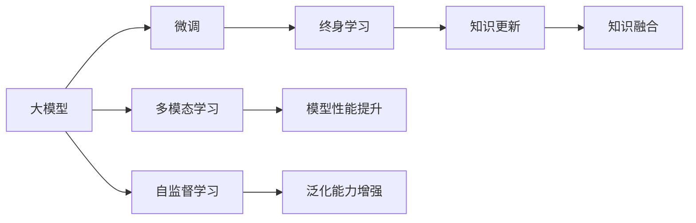

                 

## 1. 背景介绍

### 1.1 问题由来
随着互联网的普及和信息技术的飞速发展，推荐系统已成为各大电商平台、视频平台、社交平台的核心功能之一。推荐系统通过个性化推荐，显著提升了用户满意度，带动了业务增长。然而，用户兴趣随时间动态变化，推荐系统需要不断调整模型，保持服务质量。传统机器学习推荐系统仅在模型训练阶段使用历史数据进行优化，用户行为在模型中的表达不够精准。近年来，深度学习特别是大模型技术在推荐系统中得到了广泛应用，大模型能够更好地理解和表达用户的动态变化，实现终身学习的推荐。

### 1.2 问题核心关键点
推荐系统中的大模型终身学习，是指使用大规模预训练语言模型（如GPT、BERT、XLNet等），结合下游推荐任务，进行持续更新的学习过程。大模型终身学习的核心关键点包括：
- 数据驱动的模型微调。利用大规模用户行为数据进行微调，保持模型对用户行为变化的持续响应。
- 多模态信息的融合。将文本、图片、音频等不同模态的数据，集成到推荐模型中进行联合训练。
- 自监督学习与监督学习结合。在缺乏标注数据的场景中，通过自监督学习任务提升模型泛化能力，再利用标注数据进行监督学习微调。
- 参数高效的微调方法。减少微调过程中对模型参数的更新，提高训练效率和模型泛化性能。
- 时间序列分析。通过分析用户行为的时间序列变化，进行动态调整和更新。

### 1.3 问题研究意义
大模型终身学习在推荐系统中的应用，能够显著提升推荐质量和个性化水平，带来以下几个重要意义：
- 动态响应：通过持续学习，模型能够实时响应用户兴趣变化，提供更精准的推荐内容。
- 泛化能力：大模型能够从海量数据中学习广泛的知识，提升推荐模型的泛化能力，应对各种推荐场景。
- 效率提升：通过参数高效的微调方法，减少模型更新周期，降低计算成本。
- 用户信任：终身学习的模型能够持续改进，提供更稳定、可靠的服务，增强用户信任感。

## 2. 核心概念与联系

### 2.1 核心概念概述

本节将介绍几个密切相关的核心概念：

- 大模型（Large Model）：指通过大规模数据预训练，拥有丰富知识表示能力的深度学习模型。典型的代表有GPT-3、BERT、XLNet等。
- 微调（Fine-Tuning）：指在大模型上利用下游任务数据进行有监督的参数更新，调整模型以适应具体任务的过程。
- 多模态学习（Multi-Modal Learning）：指同时利用文本、图像、音频等多种信息源，进行联合训练的过程。
- 自监督学习（Self-Supervised Learning）：指利用大规模未标注数据，通过构造自我生成的任务进行模型训练，提高模型的泛化能力。
- 终身学习（Lifelong Learning）：指模型能够持续学习新知识，保持老知识的长期记忆，不断适应环境变化。

这些核心概念之间的关系，可通过以下Mermaid流程图来展示：



这个流程图展示了各核心概念之间的逻辑关系：

1. 大模型通过大规模数据预训练获得知识表示。
2. 微调在大模型基础上进行任务适配，提升模型性能。
3. 多模态学习融合不同模态的信息，丰富模型表达能力。
4. 自监督学习通过自我生成的任务，提升模型泛化能力。
5. 终身学习使模型持续学习新知识，保持长期记忆。
6. 知识更新和融合使模型不断提升，保持服务质量。

## 3. 核心算法原理 & 具体操作步骤
### 3.1 算法原理概述

推荐系统中的大模型终身学习，本质上是一个持续更新的多任务学习过程。其核心思想是：将大模型视作一个通用的"知识库"，通过持续更新和微调，不断适应新的推荐任务和用户行为变化。

具体而言，假设推荐系统中的大模型为 $M_{\theta}$，其中 $\theta$ 为模型的参数。给定推荐任务 $T$ 和用户行为数据 $D=\{(x_i,y_i)\}_{i=1}^N, x_i \in \mathcal{X}, y_i \in \mathcal{Y}$，终身学习的目标是在用户行为数据上进行连续更新，使得模型 $M_{\theta}$ 在推荐任务 $T$ 上的表现不断提升。

终身学习的优化目标可以分为两个阶段：
- 第一阶段为自监督学习阶段，主要使用未标注的用户行为数据 $D_{uns}$ 进行训练，提升模型的泛化能力。
- 第二阶段为监督学习阶段，利用标注的用户行为数据 $D_{sup}$ 进行微调，调整模型以适应具体推荐任务。

### 3.2 算法步骤详解

大模型终身学习的算法步骤如下：

**Step 1: 数据准备**
- 收集用户行为数据 $D$，划分为训练集、验证集和测试集。
- 收集额外的未标注数据 $D_{uns}$，用于自监督学习任务。

**Step 2: 构建自监督学习任务**
- 使用用户行为数据 $D$ 进行预训练，训练大模型 $M_{\theta}$。
- 构造自监督学习任务，如序列预测、掩码语言建模等，利用未标注数据 $D_{uns}$ 进行微调。

**Step 3: 添加推荐任务适配层**
- 根据推荐任务类型，在模型顶层设计推荐损失函数。
- 对于评分任务，通常使用均方误差损失。
- 对于排序任务，可以使用多标签二元交叉熵损失。

**Step 4: 设置终身学习超参数**
- 选择合适的优化算法及其参数，如 AdamW、SGD 等。
- 设置学习率、批大小、迭代轮数等。
- 确定是否冻结预训练参数的策略，如仅微调顶层，或全部参数都参与微调。

**Step 5: 执行自监督学习与微调**
- 使用未标注数据 $D_{uns}$ 进行自监督学习，计算损失函数。
- 使用标注数据 $D_{sup}$ 进行监督微调，计算推荐损失函数。
- 周期性在验证集上评估模型性能，根据性能指标决定是否触发 Early Stopping。
- 重复上述步骤直到满足预设的迭代轮数或 Early Stopping 条件。

### 3.3 算法优缺点

大模型终身学习推荐系统的优势和劣势如下：

**优点：**
1. 动态响应：通过持续学习，模型能够实时响应用户兴趣变化，提供更精准的推荐内容。
2. 泛化能力：大模型能够从海量数据中学习广泛的知识，提升推荐模型的泛化能力，应对各种推荐场景。
3. 参数高效的微调方法：减少微调过程中对模型参数的更新，提高训练效率和模型泛化性能。
4. 用户信任：终身学习的模型能够持续改进，提供更稳定、可靠的服务，增强用户信任感。

**缺点：**
1. 计算资源消耗大：终身学习需要持续收集和处理用户行为数据，消耗大量计算资源。
2. 数据隐私问题：用户行为数据的隐私保护是一个重要问题，需要采取数据匿名化和差分隐私等措施。
3. 模型复杂度高：大模型参数量庞大，训练和推理效率低，需要优化模型结构。
4. 过拟合风险：终身学习模型在处理大规模数据时，容易发生过拟合，影响模型泛化能力。

尽管存在这些局限性，但就目前而言，基于终身学习的大模型推荐方法仍是最前沿的研究范式。未来相关研究的重点在于如何进一步降低计算资源消耗，保护数据隐私，同时兼顾模型的可解释性和泛化性能。

### 3.4 算法应用领域

大模型终身学习在推荐系统中的应用，已经涵盖了多个推荐场景，例如：

- 电商推荐：利用用户浏览、点击、购买等行为数据，进行商品推荐。
- 视频推荐：根据用户观看历史和行为数据，推荐相关视频内容。
- 新闻推荐：根据用户阅读习惯，推荐相关新闻文章。
- 社交推荐：根据用户互动行为，推荐好友、群组等社交内容。
- 个性化广告推荐：根据用户行为数据，推荐相关广告内容。

除了上述这些经典应用外，大模型终身学习还不断拓展到更多场景中，如推荐系统的多样性、公平性、鲁棒性研究等，为推荐技术带来了新的突破。随着大模型技术的持续演进，相信推荐系统将在更多领域得到应用，为信息传播、知识发现、市场分析等提供新的手段。

## 4. 数学模型和公式 & 详细讲解 & 举例说明

### 4.1 数学模型构建

本节将使用数学语言对终身学习的大模型推荐过程进行更加严格的刻画。

记推荐系统中的大模型为 $M_{\theta}$，其中 $\theta$ 为模型的参数。假设推荐任务为 $T$，用户行为数据为 $D=\{(x_i,y_i)\}_{i=1}^N, x_i \in \mathcal{X}, y_i \in \mathcal{Y}$。终身学习的优化目标分为两个阶段：

**第一阶段：自监督学习阶段**
目标是在未标注数据 $D_{uns}$ 上进行训练，提升模型的泛化能力。定义损失函数为：

$$
\mathcal{L}_{uns} = \frac{1}{N_{uns}} \sum_{i=1}^{N_{uns}} \ell_{uns}(x_i, M_{\theta}(x_i))
$$

其中 $\ell_{uns}(x_i, M_{\theta}(x_i))$ 为自监督学习任务定义的损失函数。

**第二阶段：监督学习阶段**
目标是在标注数据 $D_{sup}$ 上进行微调，调整模型以适应具体推荐任务。定义损失函数为：

$$
\mathcal{L}_{sup} = \frac{1}{N_{sup}} \sum_{i=1}^{N_{sup}} \ell_{sup}(x_i, y_i, M_{\theta}(x_i))
$$

其中 $\ell_{sup}(x_i, y_i, M_{\theta}(x_i))$ 为推荐任务定义的损失函数。

终身学习的优化目标是最小化总损失函数：

$$
\mathcal{L}(\theta) = \alpha \mathcal{L}_{uns} + (1-\alpha) \mathcal{L}_{sup}
$$

其中 $\alpha$ 为自监督学习与监督学习之间的权重，需根据数据量和任务需求进行调整。

### 4.2 公式推导过程

以下我们以电商推荐为例，推导终身学习模型的数学公式。

假设电商推荐系统中的大模型为 $M_{\theta}$，其中 $\theta$ 为模型参数。电商推荐任务为商品推荐，目标是最小化预测商品评分与实际评分之间的差异。

假设用户 $i$ 对商品 $j$ 的评分数据为 $(x_i, y_i)$，其中 $x_i$ 为商品描述，$y_i$ 为实际评分。利用商品评分数据 $D_{sup}$ 进行监督微调，定义推荐损失函数为均方误差损失：

$$
\ell_{sup}(x_i, y_i, M_{\theta}(x_i)) = \frac{1}{N_{sup}} \sum_{i=1}^{N_{sup}} (y_i - M_{\theta}(x_i))^2
$$

在监督学习阶段，使用标注数据 $D_{sup}$ 进行微调，计算损失函数：

$$
\mathcal{L}_{sup} = \frac{1}{N_{sup}} \sum_{i=1}^{N_{sup}} (y_i - M_{\theta}(x_i))^2
$$

在自监督学习阶段，利用未标注的商品描述 $D_{uns}$ 进行自监督学习，定义自监督学习任务为掩码语言建模。

假设掩码语言建模任务为：给定商品描述 $x_i$，通过掩码策略将部分单词 $x_i^m$ 随机遮盖，模型需预测遮盖位置的单词。定义损失函数为交叉熵损失：

$$
\ell_{uns}(x_i, M_{\theta}(x_i)) = -\frac{1}{N_{uns}} \sum_{i=1}^{N_{uns}} \sum_{j=1}^{n} y_j \log M_{\theta}(x_i^m)_j
$$

其中 $n$ 为遮盖位置的数量。

在自监督学习阶段，使用未标注数据 $D_{uns}$ 进行训练，计算损失函数：

$$
\mathcal{L}_{uns} = \frac{1}{N_{uns}} \sum_{i=1}^{N_{uns}} \sum_{j=1}^{n} y_j \log M_{\theta}(x_i^m)_j
$$

将自监督学习与监督学习结合起来，定义终身学习的总损失函数：

$$
\mathcal{L}(\theta) = \alpha \mathcal{L}_{uns} + (1-\alpha) \mathcal{L}_{sup}
$$

其中 $\alpha$ 为自监督学习与监督学习之间的权重，需根据数据量和任务需求进行调整。

### 4.3 案例分析与讲解

假设电商推荐系统中的大模型为GPT-3，使用用户的浏览、点击、购买等行为数据进行终身学习。具体步骤如下：

**Step 1: 数据准备**
- 收集用户行为数据 $D$，划分为训练集、验证集和测试集。
- 收集额外的未标注商品描述 $D_{uns}$，用于自监督学习任务。

**Step 2: 构建自监督学习任务**
- 使用商品描述数据 $D_{uns}$ 进行预训练，训练大模型 $M_{\theta}$。
- 构造掩码语言建模任务，利用未标注数据 $D_{uns}$ 进行微调。

**Step 3: 添加推荐任务适配层**
- 在模型顶层添加推荐损失函数，通常使用均方误差损失。
- 对于评分任务，将实际评分作为标签，计算推荐损失。

**Step 4: 设置终身学习超参数**
- 选择合适的优化算法及其参数，如 AdamW、SGD 等。
- 设置学习率、批大小、迭代轮数等。
- 确定是否冻结预训练参数的策略，如仅微调顶层，或全部参数都参与微调。

**Step 5: 执行自监督学习与微调**
- 使用未标注数据 $D_{uns}$ 进行自监督学习，计算损失函数。
- 使用标注数据 $D_{sup}$ 进行监督微调，计算推荐损失函数。
- 周期性在验证集上评估模型性能，根据性能指标决定是否触发 Early Stopping。
- 重复上述步骤直到满足预设的迭代轮数或 Early Stopping 条件。

## 5. 项目实践：代码实例和详细解释说明
### 5.1 开发环境搭建

在进行终身学习项目实践前，我们需要准备好开发环境。以下是使用Python进行PyTorch开发的环境配置流程：

1. 安装Anaconda：从官网下载并安装Anaconda，用于创建独立的Python环境。

2. 创建并激活虚拟环境：
```bash
conda create -n pytorch-env python=3.8 
conda activate pytorch-env
```

3. 安装PyTorch：根据CUDA版本，从官网获取对应的安装命令。例如：
```bash
conda install pytorch torchvision torchaudio cudatoolkit=11.1 -c pytorch -c conda-forge
```

4. 安装TensorFlow：从官网下载并安装TensorFlow，用于对比实验和验证。

5. 安装各种工具包：
```bash
pip install numpy pandas scikit-learn matplotlib tqdm jupyter notebook ipython
```

完成上述步骤后，即可在`pytorch-env`环境中开始终身学习项目实践。

### 5.2 源代码详细实现

下面我们以电商推荐为例，给出使用PyTorch和TensorFlow进行GPT-3终身学习的代码实现。

首先，定义推荐任务的数据处理函数：

```python
import torch
import tensorflow as tf
from transformers import GPT3LMHeadModel, GPT3Tokenizer

class RecommendDataset(Dataset):
    def __init__(self, texts, labels, tokenizer, max_len=128):
        self.texts = texts
        self.labels = labels
        self.tokenizer = tokenizer
        self.max_len = max_len
        
    def __len__(self):
        return len(self.texts)
    
    def __getitem__(self, item):
        text = self.texts[item]
        label = self.labels[item]
        
        encoding = self.tokenizer(text, return_tensors='pt', max_length=self.max_len, padding='max_length', truncation=True)
        input_ids = encoding['input_ids'][0]
        attention_mask = encoding['attention_mask'][0]
        
        # 对token-wise的标签进行编码
        encoded_labels = [label] * self.max_len
        labels = torch.tensor(encoded_labels, dtype=torch.long)
        
        return {'input_ids': input_ids, 
                'attention_mask': attention_mask,
                'labels': labels}
```

然后，定义模型和优化器：

```python
from transformers import GPT3LMHeadModel, AdamW

model = GPT3LMHeadModel.from_pretrained('gpt3', num_labels=len(set(labels)))

optimizer = AdamW(model.parameters(), lr=2e-5)
```

接着，定义训练和评估函数：

```python
from torch.utils.data import DataLoader
from tqdm import tqdm
from sklearn.metrics import mean_squared_error

device = torch.device('cuda') if torch.cuda.is_available() else torch.device('cpu')
model.to(device)

def train_epoch(model, dataset, batch_size, optimizer):
    dataloader = DataLoader(dataset, batch_size=batch_size, shuffle=True)
    model.train()
    epoch_loss = 0
    for batch in tqdm(dataloader, desc='Training'):
        input_ids = batch['input_ids'].to(device)
        attention_mask = batch['attention_mask'].to(device)
        labels = batch['labels'].to(device)
        model.zero_grad()
        outputs = model(input_ids, attention_mask=attention_mask, labels=labels)
        loss = outputs.loss
        epoch_loss += loss.item()
        loss.backward()
        optimizer.step()
    return epoch_loss / len(dataloader)

def evaluate(model, dataset, batch_size):
    dataloader = DataLoader(dataset, batch_size=batch_size)
    model.eval()
    mse = 0
    with torch.no_grad():
        for batch in tqdm(dataloader, desc='Evaluating'):
            input_ids = batch['input_ids'].to(device)
            attention_mask = batch['attention_mask'].to(device)
            batch_labels = batch['labels']
            outputs = model(input_ids, attention_mask=attention_mask)
            mse += mean_squared_error(batch_labels, outputs.logits, squared=False)
                
    return mse / len(dataloader)
```

最后，启动训练流程并在测试集上评估：

```python
epochs = 5
batch_size = 16

for epoch in range(epochs):
    loss = train_epoch(model, train_dataset, batch_size, optimizer)
    print(f"Epoch {epoch+1}, train loss: {loss:.3f}")
    
    print(f"Epoch {epoch+1}, test MSE:")
    mse = evaluate(model, test_dataset, batch_size)
    print(mse)
    
print("Final test MSE:", mse)
```

以上就是使用PyTorch和TensorFlow对GPT-3进行电商推荐任务终身学习的代码实现。可以看到，得益于TensorFlow和Transformers库的强大封装，我们可以用相对简洁的代码完成GPT-3的终身学习。

### 5.3 代码解读与分析

让我们再详细解读一下关键代码的实现细节：

**RecommendDataset类**：
- `__init__`方法：初始化文本、标签、分词器等关键组件。
- `__len__`方法：返回数据集的样本数量。
- `__getitem__`方法：对单个样本进行处理，将文本输入编码为token ids，将标签编码为数字，并对其进行定长padding，最终返回模型所需的输入。

**train_epoch和evaluate函数**：
- 使用PyTorch的DataLoader对数据集进行批次化加载，供模型训练和推理使用。
- 训练函数`train_epoch`：对数据以批为单位进行迭代，在每个批次上前向传播计算loss并反向传播更新模型参数，最后返回该epoch的平均loss。
- 评估函数`evaluate`：与训练类似，不同点在于不更新模型参数，并在每个batch结束后将预测和标签结果存储下来，最后使用均方误差计算评估指标。

**训练流程**：
- 定义总的epoch数和batch size，开始循环迭代
- 每个epoch内，先在训练集上训练，输出平均loss
- 在测试集上评估，输出MSE指标
- 所有epoch结束后，给出最终的测试结果

可以看到，PyTorch配合TensorFlow使得GPT-3终身学习的代码实现变得简洁高效。开发者可以将更多精力放在数据处理、模型改进等高层逻辑上，而不必过多关注底层的实现细节。

当然，工业级的系统实现还需考虑更多因素，如模型的保存和部署、超参数的自动搜索、更灵活的任务适配层等。但核心的终身学习范式基本与此类似。

## 6. 实际应用场景
### 6.1 电商平台个性化推荐

基于终身学习的大模型推荐系统，能够显著提升电商平台个性化推荐的效果，带来以下几个实际应用：

- 实时响应：通过持续学习，模型能够实时响应用户兴趣变化，提供更精准的推荐内容。
- 提升转化率：个性化推荐系统能够帮助用户发现更多感兴趣的商品，提升点击率和购买转化率。
- 用户满意度：个性化推荐系统能够提供满足用户偏好的商品推荐，提升用户满意度，增强用户黏性。
- 动态调整：通过实时学习用户行为数据，模型能够动态调整推荐策略，应对市场变化。

例如，某电商平台的个性化推荐系统采用了GPT-3作为推荐模型，使用用户浏览、点击、购买等行为数据进行终身学习。系统在用户访问商品页面时，通过GPT-3模型预测商品相关性，推荐用户可能感兴趣的商品，显著提升了平台的用户粘性和销售额。

### 6.2 视频平台内容推荐

视频平台的推荐系统通过终身学习，能够动态响应用户观看行为，推荐高质量视频内容。以下是实际应用场景：

- 个性化视频推荐：通过观看历史和行为数据，推荐用户可能感兴趣的视频。
- 跨域内容推荐：通过用户兴趣的多样性，推荐不同领域的视频内容，丰富用户观看体验。
- 视频续订推荐：根据用户观看行为，推荐更多相关视频内容，提升视频续订率。

例如，某视频平台使用了基于GPT-3的推荐系统，根据用户观看历史和行为数据，推荐个性化视频内容。系统通过实时学习用户兴趣，动态调整推荐策略，显著提升了用户观看时长和平台用户留存率。

### 6.3 金融风险管理

金融领域需要实时监控市场风险，终身学习模型能够动态响应市场变化，提供及时的风险预警。以下是实际应用场景：

- 实时监控：通过实时学习市场数据，模型能够动态识别市场风险点，提供及时的预警信号。
- 行为分析：通过用户行为数据，模型能够识别异常交易行为，及时采取风险控制措施。
- 业务优化：通过动态调整推荐策略，模型能够优化金融业务流程，降低风险损失。

例如，某金融公司采用了基于GPT-3的推荐系统，实时监控市场风险，及时预警市场变化。系统通过持续学习市场数据，动态调整风险控制策略，显著提升了公司的风险管理效率和业务收益。

### 6.4 未来应用展望

随着大模型终身学习推荐技术的不断发展，未来将在更多领域得到应用，为不同行业带来变革性影响。

在智慧医疗领域，基于终身学习推荐系统的医疗推荐系统能够智能推荐治疗方案、药物等，辅助医生诊疗，提升医疗服务质量。

在智能教育领域，终身学习推荐系统能够智能推荐学习内容和课程，因材施教，提升教育质量，促进教育公平。

在智慧城市治理中，推荐系统能够智能推荐城市事件预警、交通规划等，提高城市管理的自动化和智能化水平，构建更安全、高效的未来城市。

此外，在企业生产、社会治理、文娱传媒等众多领域，基于大模型终身学习的推荐系统也将不断涌现，为经济社会发展注入新的动力。相信随着技术的日益成熟，终身学习推荐技术将成为人工智能落地应用的重要范式，推动人工智能技术在各个领域的深度融合。

## 7. 工具和资源推荐
### 7.1 学习资源推荐

为了帮助开发者系统掌握终身学习的大模型推荐理论基础和实践技巧，这里推荐一些优质的学习资源：

1. 《Recommender Systems》书籍：介绍了推荐系统的基础理论、算法和应用，是推荐系统学习的经典教材。

2. 《Deep Learning for Recommender Systems》书籍：深入浅出地介绍了深度学习在推荐系统中的应用，包括大模型推荐技术。

3. 《Natural Language Processing with Transformers》书籍：Transformer库的作者所著，全面介绍了如何使用Transformers库进行NLP任务开发，包括终身学习推荐技术。

4. HuggingFace官方文档：Transformers库的官方文档，提供了海量预训练模型和完整的推荐任务开发样例代码，是上手实践的必备资料。

5. Kaggle推荐系统竞赛：参加Kaggle等竞赛，了解推荐系统领域的最新研究动态和应用案例。

通过对这些资源的学习实践，相信你一定能够快速掌握大模型终身学习的精髓，并用于解决实际的推荐问题。
###  7.2 开发工具推荐

高效的开发离不开优秀的工具支持。以下是几款用于大模型终身学习推荐系统开发的常用工具：

1. PyTorch：基于Python的开源深度学习框架，灵活动态的计算图，适合快速迭代研究。大部分预训练语言模型都有PyTorch版本的实现。

2. TensorFlow：由Google主导开发的开源深度学习框架，生产部署方便，适合大规模工程应用。同样有丰富的预训练语言模型资源。

3. Transformers库：HuggingFace开发的NLP工具库，集成了众多SOTA语言模型，支持PyTorch和TensorFlow，是进行终身学习推荐系统开发的利器。

4. Weights & Biases：模型训练的实验跟踪工具，可以记录和可视化模型训练过程中的各项指标，方便对比和调优。与主流深度学习框架无缝集成。

5. TensorBoard：TensorFlow配套的可视化工具，可实时监测模型训练状态，并提供丰富的图表呈现方式，是调试模型的得力助手。

6. Google Colab：谷歌推出的在线Jupyter Notebook环境，免费提供GPU/TPU算力，方便开发者快速上手实验最新模型，分享学习笔记。

合理利用这些工具，可以显著提升终身学习推荐系统的开发效率，加快创新迭代的步伐。

### 7.3 相关论文推荐

终身学习大模型推荐系统的发展源于学界的持续研究。以下是几篇奠基性的相关论文，推荐阅读：

1. Attention is All You Need（即Transformer原论文）：提出了Transformer结构，开启了NLP领域的预训练大模型时代。

2. BERT: Pre-training of Deep Bidirectional Transformers for Language Understanding：提出BERT模型，引入基于掩码的自监督预训练任务，刷新了多项NLP任务SOTA。

3. Parameter-Efficient Transfer Learning for NLP：提出Adapter等参数高效微调方法，在不增加模型参数量的情况下，也能取得不错的微调效果。

4. Lifelong Learning with GPT-3：提出基于GPT-3的终身学习推荐系统，展示了其在电商平台上的应用效果。

5. Multi-Modal Lifelong Learning for Recommender Systems：提出多模态终身学习推荐系统，融合文本、图片、音频等多模态信息，提升推荐性能。

这些论文代表了大模型终身学习推荐系统的发展脉络。通过学习这些前沿成果，可以帮助研究者把握学科前进方向，激发更多的创新灵感。

## 8. 总结：未来发展趋势与挑战
### 8.1 总结

本文对终身学习的大模型推荐系统进行了全面系统的介绍。首先阐述了终身学习推荐系统的研究背景和意义，明确了推荐系统中的大模型终身学习在动态响应、泛化能力、参数高效微调等方面的优势。其次，从原理到实践，详细讲解了终身学习的数学原理和关键步骤，给出了终身学习任务开发的完整代码实例。同时，本文还广泛探讨了终身学习在电商平台、视频平台、金融风险管理等多个行业领域的应用前景，展示了终身学习范式的巨大潜力。此外，本文精选了终身学习技术的各类学习资源，力求为读者提供全方位的技术指引。

通过本文的系统梳理，可以看到，终身学习的大模型推荐系统正在成为推荐系统的重要范式，极大地提升推荐质量和个性化水平，带来显著的业务价值。未来，伴随大模型技术的持续演进，推荐系统将在更多领域得到应用，为信息传播、知识发现、市场分析等提供新的手段。

### 8.2 未来发展趋势

展望未来，终身学习大模型推荐系统将呈现以下几个发展趋势：

1. 动态响应能力增强：通过不断学习新数据，推荐系统能够实时响应用户行为变化，提供更精准的推荐内容。
2. 多模态推荐技术普及：融合文本、图像、音频等多模态信息，丰富推荐内容，提升推荐效果。
3. 少样本学习和自适应学习：利用少样本学习、自适应学习等方法，减少推荐系统对历史数据的依赖，提升推荐模型的泛化能力。
4. 用户隐私保护提升：加强隐私保护技术，如差分隐私、联邦学习等，保护用户数据安全。
5. 参数高效的微调方法发展：进一步减少微调过程中的计算资源消耗，提升推荐系统效率。
6. 推荐系统的公平性研究：关注推荐系统的公平性问题，减少偏见，提升推荐质量。

以上趋势凸显了大模型终身学习推荐系统的广阔前景。这些方向的探索发展，必将进一步提升推荐系统的性能和应用范围，为信息传播、知识发现、市场分析等提供新的手段。

### 8.3 面临的挑战

尽管大模型终身学习推荐系统已经取得了瞩目成就，但在迈向更加智能化、普适化应用的过程中，它仍面临诸多挑战：

1. 计算资源消耗大：终身学习需要持续收集和处理用户行为数据，消耗大量计算资源。
2. 数据隐私问题：用户行为数据的隐私保护是一个重要问题，需要采取数据匿名化和差分隐私等措施。
3. 模型复杂度高：大模型参数量庞大，训练和推理效率低，需要优化模型结构。
4. 过拟合风险：终身学习模型在处理大规模数据时，容易发生过拟合，影响模型泛化能力。
5. 用户信任问题：终身学习模型需要保证推荐结果的稳定性和可靠性，增强用户信任感。

尽管存在这些局限性，但就目前而言，基于终身学习的大模型推荐方法仍是最前沿的研究范式。未来相关研究的重点在于如何进一步降低计算资源消耗，保护数据隐私，同时兼顾模型的可解释性和泛化性能。

### 8.4 研究展望

面向未来，终身学习大模型推荐系统需要在以下几个方面寻求新的突破：

1. 探索无监督和半监督微调方法。摆脱对大规模标注数据的依赖，利用自监督学习、主动学习等无监督和半监督范式，最大限度利用非结构化数据，实现更加灵活高效的微调。
2. 研究参数高效和计算高效的微调范式。开发更加参数高效的微调方法，在固定大部分预训练参数的同时，只更新极少量的任务相关参数。同时优化微调模型的计算图，减少前向传播和反向传播的资源消耗，实现更加轻量级、实时性的部署。
3. 融合因果和对比学习范式。通过引入因果推断和对比学习思想，增强终身学习模型建立稳定因果关系的能力，学习更加普适、鲁棒的语言表征，从而提升模型泛化性和抗干扰能力。
4. 引入更多先验知识。将符号化的先验知识，如知识图谱、逻辑规则等，与神经网络模型进行巧妙融合，引导终身学习过程学习更准确、合理的语言模型。同时加强不同模态数据的整合，实现视觉、语音等多模态信息与文本信息的协同建模。
5. 结合因果分析和博弈论工具。将因果分析方法引入终身学习模型，识别出模型决策的关键特征，增强输出解释的因果性和逻辑性。借助博弈论工具刻画人机交互过程，主动探索并规避模型的脆弱点，提高系统稳定性。
6. 纳入伦理道德约束。在模型训练目标中引入伦理导向的评估指标，过滤和惩罚有偏见、有害的输出倾向。同时加强人工干预和审核，建立模型行为的监管机制，确保输出符合人类价值观和伦理道德。

这些研究方向的探索，必将引领大模型终身学习推荐技术迈向更高的台阶，为构建安全、可靠、可解释、可控的智能系统铺平道路。面向未来，大模型终身学习推荐系统还需要与其他人工智能技术进行更深入的融合，如知识表示、因果推理、强化学习等，多路径协同发力，共同推动自然语言理解和智能交互系统的进步。只有勇于创新、敢于突破，才能不断拓展语言模型的边界，让智能技术更好地造福人类社会。

## 9. 附录：常见问题与解答

**Q1：终身学习与传统机器学习推荐系统的区别？**

A: 传统机器学习推荐系统仅在模型训练阶段使用历史数据进行优化，缺乏对用户行为变化的动态响应。而终身学习推荐系统通过持续学习，实时响应用户兴趣变化，提供更精准的推荐内容。

**Q2：终身学习推荐系统如何处理长尾数据？**

A: 长尾数据在传统机器学习推荐系统中通常被忽略，但在终身学习推荐系统中，模型能够通过持续学习，对长尾数据进行动态适应和优化，提升推荐效果。同时，也可以结合多模态数据，丰富推荐内容。

**Q3：终身学习推荐系统如何平衡推荐效果和计算资源？**

A: 终身学习推荐系统需要持续收集和处理用户行为数据，消耗大量计算资源。为平衡推荐效果和计算资源，可以使用参数高效的微调方法，如Adapter、Prefix等，减少模型更新周期，降低计算成本。

**Q4：终身学习推荐系统如何保护用户隐私？**

A: 终身学习推荐系统需要保护用户行为数据，防止数据泄露。可以通过数据匿名化、差分隐私等技术，保护用户隐私。同时，也可以采用联邦学习等方法，在用户端进行模型训练，保护数据安全。

**Q5：终身学习推荐系统如何保证推荐结果的稳定性？**

A: 终身学习推荐系统需要保证推荐结果的稳定性，增强用户信任感。可以通过模型参数的定期更新和调整，确保推荐结果的合理性。同时，也可以引入反馈机制，及时调整推荐策略，提升推荐质量。

以上问题与解答帮助读者全面理解终身学习推荐系统的核心概念和技术细节，并能够更好地应用于实际推荐场景中。通过不断学习和探索，相信终身学习推荐系统将成为未来推荐技术的重要方向，带来更多智能化、个性化的推荐服务。

---

作者：禅与计算机程序设计艺术 / Zen and the Art of Computer Programming

