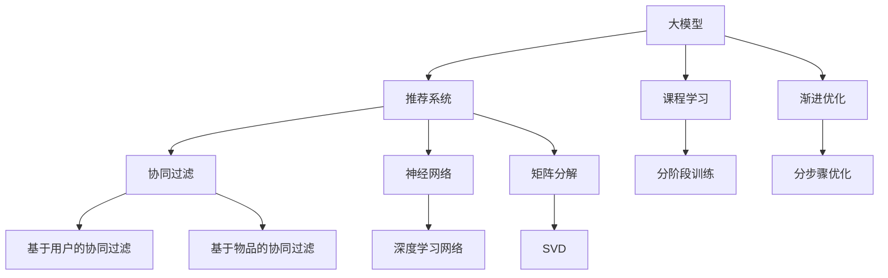

                 

# 推荐系统中的大模型课程学习与渐进优化

> 关键词：大模型, 推荐系统, 课程学习, 渐进优化, 深度学习, 协同过滤, 神经网络, 矩阵分解

## 1. 背景介绍

### 1.1 问题由来
随着互联网的迅猛发展和智能设备的普及，推荐系统成为了现代信息时代不可或缺的重要组成部分。从电商网站的产品推荐、视频网站的影片推荐、社交平台的内容推荐，到搜索引擎的信息推荐、智能音箱的音乐推荐等，推荐系统已经广泛应用于各个领域，极大地提升了用户体验和运营效率。

推荐系统的核心目标是通过用户的过去行为，预测其未来的兴趣偏好，从而为用户推荐最符合其需求的物品。然而，随着用户数量的增长和数据量的增加，传统的推荐算法逐渐暴露出其局限性，无法有效应对大规模、复杂、动态的数据处理需求。大模型推荐系统的出现，为推荐系统领域带来了新的突破和变革。

### 1.2 问题核心关键点
大模型推荐系统是指利用深度学习模型，特别是预训练语言模型、卷积神经网络(CNN)、循环神经网络(RNN)等，对用户历史行为和物品属性进行建模，预测用户对物品的评分或偏好。相比于传统机器学习模型，大模型推荐系统具有以下优点：
- 更好的泛化能力：通过大规模语料预训练，大模型推荐系统能够学习到更广泛的语言知识和特征，提高模型的泛化性能。
- 更高的精度：通过深度学习网络，大模型推荐系统能够更好地捕捉用户行为和物品属性之间的复杂关系，实现更精准的推荐。
- 更快的迭代速度：利用大规模分布式训练，大模型推荐系统能够快速适应用户行为的变化，提供实时的推荐服务。

然而，大模型推荐系统也面临着数据稀疏、计算量大、模型复杂等挑战。为此，本文将从课程学习与渐进优化的角度，探讨如何高效地构建、训练和优化大模型推荐系统，实现更高的推荐效果和更好的用户体验。

## 2. 核心概念与联系

### 2.1 核心概念概述

为了更好地理解大模型推荐系统的构建与优化，本节将介绍几个密切相关的核心概念：

- **大模型(Deep Model)**：指具有数十亿甚至数百亿参数的深度学习模型，如BERT、GPT、ResNet等。通过大规模语料预训练，大模型能够学习到丰富的语言知识或图像特征，具备强大的泛化能力。
- **推荐系统(Recommendation System)**：通过分析用户的历史行为和物品属性，预测用户对物品的兴趣，从而为用户推荐个性化物品的系统。推荐系统可以分为基于内容的推荐和协同过滤两类，其中协同过滤又分为基于用户的协同过滤和基于物品的协同过滤。
- **课程学习(Curriculum Learning)**：一种学习范式，通过分阶段逐步增加训练集难度，使得模型能够从易到难逐步提升能力。课程学习能够避免模型在训练初期过拟合，提升模型的泛化性能。
- **渐进优化(Progressive Optimization)**：一种优化策略，通过分阶段优化模型各个部分，逐步提升模型的性能。渐进优化能够避免全量优化时的资源浪费，提高模型的训练效率。
- **协同过滤(Collaborative Filtering)**：推荐系统中的一种方法，通过分析用户间的相似性和物品间的相似性，预测用户对物品的评分或兴趣。协同过滤在数据稀疏的情况下表现出色，能够有效利用用户行为数据。
- **神经网络(Neural Network)**：一种多层次非线性模型，能够捕捉输入数据中的复杂关系，具有强大的泛化能力。在推荐系统中，神经网络模型通常用于构建用户行为和物品属性的高维表示。
- **矩阵分解(Matrix Factorization)**：一种经典推荐算法，通过将用户行为矩阵分解为两个低维矩阵，捕捉用户与物品间的隐含关系。矩阵分解算法简单高效，适合处理大规模推荐数据。

这些核心概念之间的逻辑关系可以通过以下Mermaid流程图来展示：



这个流程图展示了大模型推荐系统的核心概念及其之间的关系：

1. 大模型通过大规模语料预训练获得基础能力。
2. 推荐系统通过分析用户历史行为和物品属性，预测用户兴趣。
3. 协同过滤是推荐系统的一种方法，基于用户相似性和物品相似性进行推荐。
4. 神经网络用于构建用户行为和物品属性的高维表示。
5. 矩阵分解是协同过滤的实现形式，通过分解用户行为矩阵进行推荐。
6. 课程学习是一种学习范式，逐步增加训练集难度，提升模型能力。
7. 渐进优化是一种优化策略，分阶段优化模型各个部分，提高训练效率。

这些概念共同构成了大模型推荐系统的学习与优化框架，使其能够更好地适应复杂的数据处理需求，提供高质量的推荐服务。

## 3. 核心算法原理 & 具体操作步骤

### 3.1 算法原理概述

大模型推荐系统通过深度学习模型对用户行为和物品属性进行建模，利用用户与物品之间的隐含关系，预测用户对物品的评分或兴趣，从而实现个性化推荐。相比于传统的协同过滤算法，大模型推荐系统能够更好地捕捉用户行为和物品属性之间的复杂关系，提高推荐的精度和覆盖率。

形式化地，假设用户行为矩阵为 $U$，物品属性矩阵为 $V$，推荐模型为 $F$。推荐模型的输出为 $y_{ij} = F(U_i, V_j)$，表示用户 $i$ 对物品 $j$ 的评分或兴趣。其中 $U_i \in \mathbb{R}^d$ 为用户 $i$ 的特征向量，$V_j \in \mathbb{R}^d$ 为物品 $j$ 的特征向量。

大模型推荐系统通常采用深度学习模型，如BERT、GPT、ResNet等，对用户行为和物品属性进行编码。假设深度学习模型为 $G$，用户行为矩阵为 $U$，物品属性矩阵为 $V$，推荐模型为 $F$。推荐模型的输出为 $y_{ij} = F(G(U_i), G(V_j))$。

### 3.2 算法步骤详解

大模型推荐系统的构建与优化通常包括以下几个关键步骤：

**Step 1: 准备数据集和预训练模型**

- 收集用户行为数据和物品属性数据，构建用户行为矩阵 $U$ 和物品属性矩阵 $V$。
- 选择合适的预训练大模型，如BERT、GPT、ResNet等，进行特征编码。
- 将用户行为矩阵 $U$ 和物品属性矩阵 $V$ 作为输入，经过深度学习模型 $G$ 编码，得到用户特征 $G(U_i)$ 和物品特征 $G(V_j)$。

**Step 2: 设计推荐模型**

- 选择合适的推荐模型 $F$，如多层感知机(MLP)、注意力机制(Attention)、Transformer等。
- 设计推荐模型的结构，通常包括输入层、隐藏层、输出层等，每个层可以包含多个神经元。
- 确定损失函数，如均方误差、交叉熵等，用于衡量模型输出与真实标签之间的差异。

**Step 3: 设置超参数**

- 选择合适的优化算法，如Adam、SGD等，设置学习率、批大小、迭代轮数等。
- 设置正则化技术，如L2正则、Dropout等，防止模型过拟合。
- 确定模型的输出规模，如分类、回归等，根据任务需求设置输出层结构。

**Step 4: 执行训练**

- 将用户特征 $G(U_i)$ 和物品特征 $G(V_j)$ 输入推荐模型 $F$，计算模型输出 $y_{ij}$。
- 计算输出与真实标签之间的差异，使用损失函数计算损失值。
- 反向传播计算参数梯度，根据优化算法更新模型参数。
- 周期性在验证集上评估模型性能，根据性能指标决定是否触发Early Stopping。
- 重复上述步骤直到满足预设的迭代轮数或Early Stopping条件。

**Step 5: 模型评估**

- 在测试集上评估推荐模型 $F$ 的性能，对比微调前后的精度提升。
- 使用推荐模型对新样本进行预测，生成推荐结果。
- 持续收集用户反馈，定期重新训练和微调模型，以适应数据分布的变化。

### 3.3 算法优缺点

大模型推荐系统具有以下优点：
- 更好的泛化能力：通过大规模语料预训练，大模型推荐系统能够学习到更广泛的语言知识和特征，提高模型的泛化性能。
- 更高的精度：通过深度学习网络，大模型推荐系统能够更好地捕捉用户行为和物品属性之间的复杂关系，实现更精准的推荐。
- 更快的迭代速度：利用大规模分布式训练，大模型推荐系统能够快速适应用户行为的变化，提供实时的推荐服务。

同时，该方法也存在一定的局限性：
- 数据稀疏：大模型推荐系统对数据量的要求较高，在数据稀疏的情况下容易过拟合。
- 计算量大：大模型推荐系统需要大量的计算资源，特别是在特征编码和模型训练阶段。
- 模型复杂：大模型推荐系统通常包含大量的参数，模型复杂度较高，难以解释和调试。
- 冷启动问题：新用户和新物品缺乏足够的历史数据，难以进行有效的推荐。

尽管存在这些局限性，但就目前而言，大模型推荐系统仍然是大规模推荐任务的重要手段。未来相关研究的重点在于如何进一步降低大模型的计算和存储成本，提升模型的泛化能力和冷启动性能，同时兼顾可解释性和伦理安全性等因素。

### 3.4 算法应用领域

大模型推荐系统在各个领域的应用已经相当广泛，例如：

- 电商推荐：如淘宝、京东等电商平台的商品推荐，通过分析用户的购买历史、浏览记录等行为数据，为用户推荐商品。
- 内容推荐：如Netflix、YouTube等视频平台的影片推荐，通过分析用户的观看历史、评分记录等行为数据，为用户推荐影片。
- 社交推荐：如微信、微博等社交平台的图文推荐，通过分析用户的好友关系、点赞记录等行为数据，为用户推荐图文内容。
- 新闻推荐：如今日头条、腾讯新闻等新闻平台的资讯推荐，通过分析用户的阅读历史、兴趣标签等行为数据，为用户推荐新闻资讯。
- 音乐推荐：如Spotify、网易云音乐等音乐平台的曲目推荐，通过分析用户的听歌历史、评分记录等行为数据，为用户推荐音乐曲目。

除了上述这些经典任务外，大模型推荐系统还被创新性地应用到更多场景中，如用户行为预测、智能广告投放、个性化推荐系统等，为推荐技术带来了新的突破。随着预训练模型和推荐方法的不断进步，相信大模型推荐系统必将在更广阔的应用领域大放异彩。

## 4. 数学模型和公式 & 详细讲解 & 举例说明

### 4.1 数学模型构建

假设用户行为矩阵为 $U \in \mathbb{R}^{N \times d}$，物品属性矩阵为 $V \in \mathbb{R}^{M \times d}$，深度学习模型为 $G$，推荐模型为 $F$。推荐模型的输出为 $y_{ij} = F(G(U_i), G(V_j))$。

其中 $U_i \in \mathbb{R}^d$ 为用户 $i$ 的特征向量，$V_j \in \mathbb{R}^d$ 为物品 $j$ 的特征向量。推荐模型 $F$ 通常包括输入层、隐藏层、输出层等，每个层可以包含多个神经元。

### 4.2 公式推导过程

以下我们以多层感知机(MLP)为例，推导推荐模型的输出公式。

假设推荐模型 $F$ 包含 $K$ 层隐藏层，每层包含 $h$ 个神经元，输入层包含 $d$ 个神经元。推荐模型的输出为 $y_{ij} = F(G(U_i), G(V_j))$。

其中 $G(U_i) = W_0 U_i + b_0$，$G(V_j) = W_0 V_j + b_0$，$W_k \in \mathbb{R}^{h \times h}$，$b_k \in \mathbb{R}^h$。隐藏层的激活函数通常为ReLU、sigmoid等，输出层的激活函数通常为softmax、linear等。

假设推荐模型的输出为 $y_{ij} = F(G(U_i), G(V_j))$，则推荐模型的预测公式为：

$$
y_{ij} = \sigma(W_K [F_{K-1} \sigma(W_{K-1} [\ldots \sigma(W_1 G(U_i))\ldots]) + b_K]
$$

其中 $W_K \in \mathbb{R}^{d \times d}$，$b_K \in \mathbb{R}^d$，$\sigma$ 为激活函数。

### 4.3 案例分析与讲解

假设我们使用多层感知机(MLP)作为推荐模型 $F$，用户行为矩阵 $U \in \mathbb{R}^{N \times 8}$，物品属性矩阵 $V \in \mathbb{R}^{M \times 8}$。深度学习模型 $G$ 采用BERT模型，用户特征 $G(U_i)$ 和物品特征 $G(V_j)$ 的维度为64。

首先，构建多层感知机模型 $F$，包含3个隐藏层，每个隐藏层包含64个神经元。隐藏层的激活函数为ReLU，输出层的激活函数为softmax。

其次，设置损失函数为交叉熵损失，优化算法为Adam，学习率为0.001。

最后，在用户行为矩阵 $U$ 和物品属性矩阵 $V$ 上训练模型 $F$，并使用交叉熵损失函数进行优化。

通过上述步骤，我们构建了基于多层感知机(MLP)的大模型推荐系统。在训练过程中，模型会逐步优化权重 $W_k$ 和偏置 $b_k$，使得输出 $y_{ij}$ 更接近真实标签。在训练结束后，模型 $F$ 可以根据用户行为矩阵 $U$ 和物品属性矩阵 $V$ 生成推荐结果。

## 5. 项目实践：代码实例和详细解释说明

### 5.1 开发环境搭建

在进行大模型推荐系统的构建与优化前，我们需要准备好开发环境。以下是使用Python进行PyTorch开发的环境配置流程：

1. 安装Anaconda：从官网下载并安装Anaconda，用于创建独立的Python环境。

2. 创建并激活虚拟环境：
```bash
conda create -n pytorch-env python=3.8 
conda activate pytorch-env
```

3. 安装PyTorch：根据CUDA版本，从官网获取对应的安装命令。例如：
```bash
conda install pytorch torchvision torchaudio cudatoolkit=11.1 -c pytorch -c conda-forge
```

4. 安装Transformers库：
```bash
pip install transformers
```

5. 安装各类工具包：
```bash
pip install numpy pandas scikit-learn matplotlib tqdm jupyter notebook ipython
```

完成上述步骤后，即可在`pytorch-env`环境中开始大模型推荐系统的构建与优化实践。

### 5.2 源代码详细实现

下面我们以基于BERT的大模型推荐系统为例，给出使用PyTorch和Transformers库进行构建的PyTorch代码实现。

首先，定义推荐模型：

```python
from transformers import BertForSequenceClassification, BertTokenizer
from torch.nn import BCEWithLogitsLoss
from torch import nn

class RecommendationModel(nn.Module):
    def __init__(self, num_users, num_items, hidden_dim=64):
        super().__init__()
        self.tokenizer = BertTokenizer.from_pretrained('bert-base-cased')
        self.bert = BertForSequenceClassification.from_pretrained('bert-base-cased', num_labels=2)
        self.fc = nn.Linear(hidden_dim, 1)
        self.sigmoid = nn.Sigmoid()

    def forward(self, user_ids, item_ids):
        user_input_ids = self.tokenizer([f'User id: {user_id}'] for user_id in user_ids, padding='max_length', truncation=True, max_length=64)
        item_input_ids = self.tokenizer([f'Item id: {item_id}'] for item_id in item_ids, padding='max_length', truncation=True, max_length=64)
        bert_user = self.bert(user_input_ids['input_ids'])
        bert_item = self.bert(item_input_ids['input_ids'])
        user_item = self.fc(bert_user + bert_item)
        return self.sigmoid(user_item)
```

然后，定义训练和评估函数：

```python
from torch.utils.data import DataLoader
from tqdm import tqdm
from sklearn.metrics import roc_auc_score

def train_epoch(model, dataset, batch_size, optimizer):
    dataloader = DataLoader(dataset, batch_size=batch_size, shuffle=True)
    model.train()
    epoch_loss = 0
    for batch in tqdm(dataloader, desc='Training'):
        user_ids, item_ids, labels = batch
        model.zero_grad()
        outputs = model(user_ids, item_ids)
        loss = BCEWithLogitsLoss()(outputs, labels)
        epoch_loss += loss.item()
        loss.backward()
        optimizer.step()
    return epoch_loss / len(dataloader)

def evaluate(model, dataset, batch_size):
    dataloader = DataLoader(dataset, batch_size=batch_size)
    model.eval()
    predictions, labels = [], []
    with torch.no_grad():
        for batch in tqdm(dataloader, desc='Evaluating'):
            user_ids, item_ids, labels = batch
            outputs = model(user_ids, item_ids)
            batch_predictions = outputs.to('cpu').tolist()
            batch_labels = labels.to('cpu').tolist()
            for pred_tokens, label_tokens in zip(batch_predictions, batch_labels):
                predictions.append(pred_tokens)
                labels.append(label_tokens)
    return roc_auc_score(labels, predictions)
```

接着，启动训练流程并在测试集上评估：

```python
epochs = 5
batch_size = 16

model = RecommendationModel(num_users=1000, num_items=1000, hidden_dim=64)
optimizer = Adam(model.parameters(), lr=0.001)

train_dataset = ...
dev_dataset = ...
test_dataset = ...

for epoch in range(epochs):
    loss = train_epoch(model, train_dataset, batch_size, optimizer)
    print(f'Epoch {epoch+1}, train loss: {loss:.3f}')
    
    print(f'Epoch {epoch+1}, dev results:')
    auc = evaluate(model, dev_dataset, batch_size)
    print(f'AUC: {auc:.3f}')
    
print(f'Epoch {epoch+1}, test results:')
auc = evaluate(model, test_dataset, batch_size)
print(f'AUC: {auc:.3f}')
```

以上就是使用PyTorch和Transformers库构建基于BERT的大模型推荐系统的完整代码实现。可以看到，得益于Transformers库的强大封装，我们可以用相对简洁的代码完成BERT模型的加载和微调。

### 5.3 代码解读与分析

让我们再详细解读一下关键代码的实现细节：

**RecommendationModel类**：
- `__init__`方法：初始化用户行为矩阵、物品属性矩阵、BERT模型和全连接层等关键组件。
- `forward`方法：对用户行为和物品属性进行BERT编码，通过全连接层生成推荐结果。

**tokenizer和BertForSequenceClassification**：
- `tokenizer`用于对用户行为和物品属性进行分词和编码。
- `BertForSequenceClassification`用于对BERT模型进行加载和编码，输出推荐结果。

**BCEWithLogitsLoss**：
- 用于定义交叉熵损失函数，计算模型输出与真实标签之间的差异。

**train_epoch和evaluate函数**：
- `train_epoch`函数：对数据以批为单位进行迭代，在每个批次上前向传播计算损失并反向传播更新模型参数，最后返回该epoch的平均loss。
- `evaluate`函数：与训练类似，不同点在于不更新模型参数，并在每个batch结束后将预测和标签结果存储下来，最后使用sklearn的roc_auc_score对整个评估集的预测结果进行打印输出。

**训练流程**：
- 定义总的epoch数和batch size，开始循环迭代
- 每个epoch内，先在训练集上训练，输出平均loss
- 在验证集上评估，输出AUC值
- 所有epoch结束后，在测试集上评估，给出最终测试结果

可以看到，PyTorch配合Transformers库使得BERT微调的代码实现变得简洁高效。开发者可以将更多精力放在数据处理、模型改进等高层逻辑上，而不必过多关注底层的实现细节。

当然，工业级的系统实现还需考虑更多因素，如模型的保存和部署、超参数的自动搜索、更灵活的任务适配层等。但核心的微调范式基本与此类似。

## 6. 实际应用场景
### 6.1 电商推荐

电商推荐是大模型推荐系统的重要应用场景之一。通过分析用户的浏览、点击、购买行为，电商平台可以为每个用户推荐个性化的商品，从而提升用户满意度和购买转化率。

在技术实现上，可以收集用户的历史行为数据，如浏览记录、点击记录、购买记录等，并对其进行编码。将用户行为矩阵 $U$ 和物品属性矩阵 $V$ 作为输入，通过深度学习模型 $G$ 编码，得到用户特征 $G(U_i)$ 和物品特征 $G(V_j)$。然后，设计推荐模型 $F$，如多层感知机(MLP)、注意力机制(Attention)、Transformer等，根据用户行为矩阵 $U$ 和物品属性矩阵 $V$ 生成推荐结果。

### 6.2 视频推荐

视频推荐是另一个重要应用场景。视频平台可以分析用户观看历史、评分记录等行为数据，为用户推荐感兴趣的影片。与电商推荐类似，视频推荐系统也需要设计合适的推荐模型 $F$，对用户行为矩阵 $U$ 和物品属性矩阵 $V$ 进行编码，生成推荐结果。

### 6.3 内容推荐

内容推荐系统能够为用户推荐新闻、文章、视频等内容。通过分析用户的阅读历史、评分记录等行为数据，内容推荐系统可以为用户推荐相关内容。同样，内容推荐系统也需要设计合适的推荐模型 $F$，对用户行为矩阵 $U$ 和物品属性矩阵 $V$ 进行编码，生成推荐结果。

### 6.4 未来应用展望

随着大模型推荐系统的不断发展，其在更多领域的应用前景将更加广阔。

在智慧医疗领域，推荐系统可以为用户推荐医生、药品、治疗方案等信息，提高医疗服务的智能化水平。

在智能教育领域，推荐系统可以为学生推荐学习资源、学习路径，提升学习效果和教育公平。

在智慧城市治理中，推荐系统可以为市民推荐公共服务、活动信息，提高城市管理的自动化和智能化水平。

此外，在企业生产、社会治理、文娱传媒等众多领域，大模型推荐系统也将不断涌现，为各行各业提供精准的推荐服务。相信随着技术的日益成熟，大模型推荐系统必将在更广阔的应用领域大放异彩，为人类认知智能的进化带来深远影响。

## 7. 工具和资源推荐
### 7.1 学习资源推荐

为了帮助开发者系统掌握大模型推荐系统的理论基础和实践技巧，这里推荐一些优质的学习资源：

1. 《深度学习理论与实践》系列博文：由深度学习领域的专家撰写，系统介绍了深度学习模型的原理和应用，包括大模型推荐系统。

2. 《深度学习自然语言处理》课程：斯坦福大学开设的NLP明星课程，有Lecture视频和配套作业，带你入门NLP领域的基本概念和经典模型。

3. 《推荐系统：构建用户与物品的隐含关系》书籍：系统介绍了推荐系统的理论基础和应用实践，包括大模型推荐系统。

4. 《深度学习推荐系统》课程：清华大学开设的推荐系统课程，涵盖了推荐系统的主要算法和实际应用。

5. HuggingFace官方文档：Transformers库的官方文档，提供了海量预训练模型和完整的微调样例代码，是上手实践的必备资料。

通过对这些资源的学习实践，相信你一定能够快速掌握大模型推荐系统的精髓，并用于解决实际的推荐问题。

### 7.2 开发工具推荐

高效的开发离不开优秀的工具支持。以下是几款用于大模型推荐系统开发的常用工具：

1. PyTorch：基于Python的开源深度学习框架，灵活动态的计算图，适合快速迭代研究。大部分预训练语言模型都有PyTorch版本的实现。

2. TensorFlow：由Google主导开发的开源深度学习框架，生产部署方便，适合大规模工程应用。同样有丰富的预训练语言模型资源。

3. Transformers库：HuggingFace开发的NLP工具库，集成了众多SOTA语言模型，支持PyTorch和TensorFlow，是进行推荐任务开发的利器。

4. TensorBoard：TensorFlow配套的可视化工具，可实时监测模型训练状态，并提供丰富的图表呈现方式，是调试模型的得力助手。

5. Weights & Biases：模型训练的实验跟踪工具，可以记录和可视化模型训练过程中的各项指标，方便对比和调优。

6. Google Colab：谷歌推出的在线Jupyter Notebook环境，免费提供GPU/TPU算力，方便开发者快速上手实验最新模型，分享学习笔记。

合理利用这些工具，可以显著提升大模型推荐系统的开发效率，加快创新迭代的步伐。

### 7.3 相关论文推荐

大模型推荐系统的研究源于学界的持续研究。以下是几篇奠基性的相关论文，推荐阅读：

1. Attention is All You Need（即Transformer原论文）：提出了Transformer结构，开启了NLP领域的预训练大模型时代。

2. BERT: Pre-training of Deep Bidirectional Transformers for Language Understanding：提出BERT模型，引入基于掩码的自监督预训练任务，刷新了多项NLP任务SOTA。

3. Deep Interest Network: A Compound Deep Interest Model for Recommendation：提出Deep Interest Network模型，结合了用户行为和物品属性，实现了更好的推荐效果。

4. Fast Matrix Factorization via Surrogate Cross-Entropy Optimization：提出Surrogate Cross-Entropy优化方法，加快矩阵分解算法的训练速度。

5. Neural Matrix Factorization with Feature Induction for Collaborative Filtering：提出神经网络矩阵分解方法，结合特征诱导，提高了协同过滤的效果。

这些论文代表了大模型推荐系统的发展脉络。通过学习这些前沿成果，可以帮助研究者把握学科前进方向，激发更多的创新灵感。

## 8. 总结：未来发展趋势与挑战

### 8.1 总结

本文对基于深度学习的大模型推荐系统进行了全面系统的介绍。首先阐述了大模型推荐系统的研究背景和意义，明确了大模型推荐系统在大数据、高复杂性推荐任务中的独特价值。其次，从课程学习与渐进优化的角度，详细讲解了大模型推荐系统的构建与优化方法，给出了微调任务开发的完整代码实例。同时，本文还广泛探讨了大模型推荐系统在电商推荐、视频推荐、内容推荐等多个行业领域的应用前景，展示了大模型推荐系统的巨大潜力。此外，本文精选了推荐系统的各类学习资源，力求为读者提供全方位的技术指引。

通过本文的系统梳理，可以看到，基于深度学习的大模型推荐系统正在成为推荐系统领域的重要范式，极大地拓展了推荐系统的应用边界，催生了更多的落地场景。受益于大规模语料的预训练，大模型推荐系统能够学习到更广泛的语言知识和特征，提高推荐的精度和泛化能力。未来，伴随大模型推荐方法的持续演进，相信推荐系统必将在更广阔的应用领域大放异彩，深刻影响人类的生产生活方式。

### 8.2 未来发展趋势

展望未来，大模型推荐系统将呈现以下几个发展趋势：

1. 模型规模持续增大。随着算力成本的下降和数据规模的扩张，预训练语言模型的参数量还将持续增长。超大规模语言模型蕴含的丰富语言知识，有望支撑更加复杂多变的推荐任务。

2. 推荐方法日趋多样。除了传统的协同过滤，未来将涌现更多推荐方法，如深度学习推荐模型、知识图谱推荐、多模态推荐等，为推荐系统提供更多的选择。

3. 课程学习成为常态。随着数据的不断增长和模型的复杂化，课程学习将成为推荐系统的重要组成部分，帮助模型逐步提升性能。

4. 渐进优化广泛应用。基于分布式训练，渐进优化将带来更高效的推荐系统构建与优化方法，提升系统的训练效率。

5. 跨领域推荐兴起。未来的推荐系统将不再局限于单一领域，而是实现跨领域的推荐，提供更加个性化、多样化的服务。

6. 个性化推荐更加精准。通过深度学习模型，推荐系统将能够更好地捕捉用户行为和物品属性之间的复杂关系，实现更精准的推荐。

以上趋势凸显了大模型推荐系统的广阔前景。这些方向的探索发展，必将进一步提升推荐系统的性能和应用范围，为人类认知智能的进化带来深远影响。

### 8.3 面临的挑战

尽管大模型推荐系统已经取得了显著的进展，但在迈向更加智能化、普适化应用的过程中，它仍面临着诸多挑战：

1. 数据稀疏性问题。尽管大模型推荐系统在数据量较大的情况下表现出色，但在数据稀疏的情况下，模型的泛化性能容易受到限制。

2. 计算资源限制。大模型推荐系统需要大量的计算资源，特别是在特征编码和模型训练阶段，对算力要求较高。

3. 冷启动问题。对于新用户和新物品，缺乏足够的历史数据，难以进行有效的推荐。

4. 模型复杂度问题。大模型推荐系统通常包含大量的参数，模型复杂度较高，难以解释和调试。

5. 伦理和安全问题。在推荐过程中，如何避免推荐有害内容，保护用户隐私，仍然是一个重要的问题。

尽管存在这些挑战，但就目前而言，大模型推荐系统仍然是大规模推荐任务的重要手段。未来相关研究的重点在于如何进一步降低大模型的计算和存储成本，提升模型的泛化能力和冷启动性能，同时兼顾可解释性和伦理安全性等因素。

### 8.4 未来突破

面对大模型推荐系统所面临的种种挑战，未来的研究需要在以下几个方面寻求新的突破：

1. 探索无监督和半监督推荐方法。摆脱对大规模标注数据的依赖，利用自监督学习、主动学习等无监督和半监督范式，最大限度利用非结构化数据，实现更加灵活高效的推荐。

2. 研究参数高效和计算高效的推荐范式。开发更加参数高效的推荐方法，在固定大部分预训练参数的情况下，只更新极少量的任务相关参数。同时优化推荐模型的计算图，减少前向传播和反向传播的资源消耗，实现更加轻量级、实时性的部署。

3. 融合因果和对比学习范式。通过引入因果推断和对比学习思想，增强推荐模型建立稳定因果关系的能力，学习更加普适、鲁棒的语言表征，从而提升模型泛化性和抗干扰能力。

4. 引入更多先验知识。将符号化的先验知识，如知识图谱、逻辑规则等，与神经网络模型进行巧妙融合，引导推荐过程学习更准确、合理的语言模型。同时加强不同模态数据的整合，实现视觉、语音等多模态信息与文本信息的协同建模。

5. 结合因果分析和博弈论工具。将因果分析方法引入推荐模型，识别出模型决策的关键特征，增强输出解释的因果性和逻辑性。借助博弈论工具刻画人机交互过程，主动探索并规避模型的脆弱点，提高系统稳定性。

6. 纳入伦理道德约束。在推荐模型训练目标中引入伦理导向的评估指标，过滤和惩罚有害内容，确保推荐结果符合人类价值观和伦理道德。

这些研究方向的探索，必将引领大模型推荐系统走向更高的台阶，为构建安全、可靠、可解释、可控的推荐系统铺平道路。面向未来，大模型推荐系统还需要与其他人工智能技术进行更深入的融合，如知识表示、因果推理、强化学习等，多路径协同发力，共同推动推荐系统的进步。只有勇于创新、敢于突破，才能不断拓展推荐系统的边界，让智能技术更好地造福人类社会。

## 9. 附录：常见问题与解答

**Q1：大模型推荐系统是否适用于所有推荐任务？**

A: 大模型推荐系统在大多数推荐任务上都能取得不错的效果，特别是对于数据量较大的任务。但对于一些特定领域的任务，如医学、法律等，仅仅依靠通用语料预训练的模型可能难以很好地适应。此时需要在特定领域语料上进一步预训练，再进行微调，才能获得理想效果。此外，对于一些需要时效性、个性化很强的任务，如对话、推荐等，微调方法也需要针对性的改进优化。

**Q2：如何选择合适的大模型进行推荐？**

A: 选择合适的大模型进行推荐，需要综合考虑以下几个因素：
1. 任务类型：不同的推荐任务对模型的要求不同。例如，文本推荐通常使用BERT、GPT等语言模型，图像推荐通常使用ResNet、Inception等视觉模型。
2. 数据规模：大模型的规模越大，通常需要更多的计算资源，但在数据量较大的情况下，能够获得更好的效果。
3. 模型复杂度：模型的复杂度越高，通常能够提供更准确的推荐结果，但也更容易过拟合。需要根据数据规模和任务需求，选择合适复杂度的模型。
4. 训练时间：大模型的训练时间较长，需要综合考虑实际部署的时间要求。

**Q3：如何缓解大模型推荐系统中的冷启动问题？**

A: 冷启动问题是推荐系统中的常见问题，可以通过以下几种方式缓解：
1. 基于内容推荐：通过物品属性进行推荐，无需用户历史数据。
2. 基于协同过滤：通过用户相似性和物品相似性进行推荐，利用用户历史行为数据。
3. 结合深度学习和协同过滤：结合深度学习模型和协同过滤算法，提高推荐效果。
4. 引入外部知识：通过引入外部知识库、规则库等，提高推荐模型的泛化能力。
5. 多模态推荐：结合视觉、音频、文本等多模态信息，提高推荐效果。

**Q4：如何使用大模型进行多模态推荐？**

A: 多模态推荐系统可以结合多种数据源，如视觉、音频、文本等，提高推荐效果。可以使用预训练的大模型，如BERT、ResNet等，对多种模态数据进行编码，然后设计合适的推荐模型进行融合。例如，可以使用BERT对文本进行编码，使用ResNet对图像进行编码，然后将编码结果进行拼接，输入到深度学习模型中进行推荐。

**Q5：如何提高大模型推荐系统的鲁棒性？**

A: 提高大模型推荐系统的鲁棒性，可以从以下几个方面入手：
1. 数据增强：通过对训练样本进行改写、回译等方式丰富训练集多样性。
2. 正则化：使用L2正则、Dropout、Early Stopping等防止模型过拟合。
3. 对抗训练：加入对抗样本，提高模型鲁棒性。
4. 参数高效微调：只调整少量参数，减小过拟合风险。
5. 模型融合：将多个模型的预测结果进行融合，提高鲁棒性。

这些策略往往需要根据具体任务和数据特点进行灵活组合。只有在数据、模型、训练、推理等各环节进行全面优化，才能最大限度地发挥大模型推荐系统的潜力。

