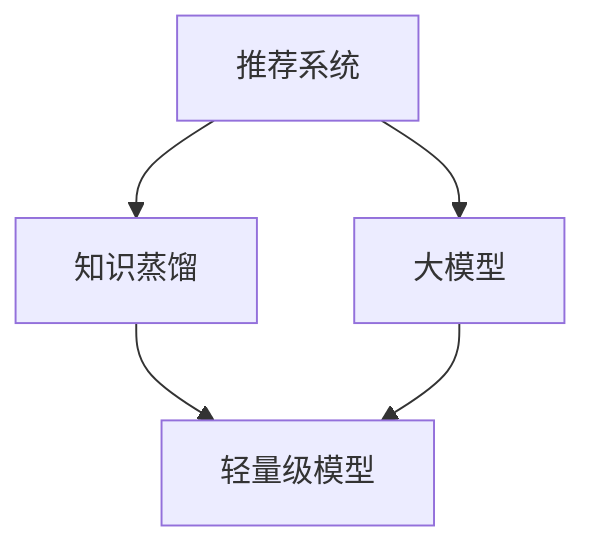

                 

# 推荐系统中的知识蒸馏：大模型到轻量级模型的效果传递

> 关键词：推荐系统,知识蒸馏,大模型,轻量级模型,效果传递

## 1. 背景介绍

### 1.1 问题由来
推荐系统是现代互联网产品中不可或缺的一部分，通过分析和理解用户的兴趣和行为，为用户推荐其可能感兴趣的内容，如商品、文章、视频等，极大地提升了用户体验和平台黏性。然而，推荐系统的核心依赖于模型，尤其是深度学习模型，往往需要大量标注数据和庞大计算资源进行训练，导致实际部署和维护成本较高。

与此同时，大规模预训练语言模型（如BERT、GPT-3等）的横空出世，为推荐系统的优化提供了新的思路。大模型具有强大的泛化能力和知识表示能力，能够在无监督或小样本条件下学习丰富的语言知识，显著提升推荐系统的表现。但是，大模型的资源消耗和推理速度限制了其在推荐系统中的应用范围。为了兼顾模型的性能和部署效率，研究者提出了知识蒸馏(Knowledge Distillation)方法，将大模型的知识传递到轻量级模型上，以实现模型效果的传递和优化。

## 2. 核心概念与联系

### 2.1 核心概念概述

为更好地理解知识蒸馏在推荐系统中的应用，本节将介绍几个密切相关的核心概念：

- **推荐系统(Recommender System)**：通过分析用户的历史行为和兴趣，为用户推荐个性化内容的技术体系。推荐系统广泛应用于电商、社交、视频、新闻等领域。
- **知识蒸馏(Knowledge Distillation, KD)**：将大型、复杂的模型（老师模型）的知识蒸馏到小型、轻量级模型（学生模型）上，以提升后者的性能。知识蒸馏的精髓在于，老师模型与学生模型之间的交互学习，使得学生模型能够有效传承老师模型的泛化能力。
- **大模型(Large Model)**：指具有大量参数和丰富知识表示能力的大型深度学习模型，如BERT、GPT-3等。大模型通过自监督学习或大规模标注数据训练，能够学习到通用的语言知识，并应用于推荐系统等实际任务中。
- **轻量级模型(Lightweight Model)**：指参数量小、推理速度快的模型，如MobileNet、DistilBERT等。轻量级模型在硬件资源有限的场景中有着广泛应用，可以高效地部署于移动设备、嵌入式系统等场景。
- **效果传递(Effect Transfer)**：指通过知识蒸馏技术，将大模型的泛化能力传递到轻量级模型上，使轻量级模型也能具有接近老师模型的表现。效果传递是知识蒸馏的核心目标。

这些核心概念之间的逻辑关系可以通过以下Mermaid流程图来展示：



这个流程图展示了大模型在推荐系统中的应用，以及知识蒸馏将大模型知识传递给轻量级模型的过程：

1. 推荐系统收集用户行为数据，构建大模型进行特征表示。
2. 知识蒸馏方法将大模型的知识传递给轻量级模型，优化模型性能。
3. 轻量级模型接收大模型的知识后，作为推荐系统的新候选特征生成器。

## 3. 核心算法原理 & 具体操作步骤

### 3.1 算法原理概述

知识蒸馏在推荐系统中的应用，本质上是将大模型的泛化能力传递到轻量级模型上，以提升后者的推荐性能。具体而言，知识蒸馏包括以下几个关键步骤：

1. **数据准备**：收集大模型的训练数据和目标模型的测试数据。
2. **知识提取**：从大模型中提取知识，通常是将大模型在特定任务上的输出作为标签，训练一个学生模型。
3. **知识传递**：使用大模型的输出（即标签）训练学生模型，将大模型的泛化能力传递给学生模型。
4. **模型优化**：使用训练数据对学生模型进行优化，确保其学习到与大模型相似的特征表示能力。

知识蒸馏的目的是在不显著增加计算成本的情况下，提高轻量级模型的性能。大模型通常具有更丰富的特征表示和泛化能力，能够从更广泛的特征中学习到模式，而轻量级模型由于参数量小，无法覆盖所有特征，导致性能不佳。通过知识蒸馏，轻量级模型能够学习到与大模型相似的特征表示能力，从而提升推荐性能。

### 3.2 算法步骤详解

知识蒸馏在推荐系统中的应用步骤如下：

**Step 1: 数据准备**
- 收集大模型的训练数据，并将其划分为训练集和验证集。
- 收集目标模型的测试数据，用于评估蒸馏后的模型性能。
- 将数据集预处理为模型所需的格式，如将用户历史行为数据转换为模型可以理解的向量形式。

**Step 2: 知识提取**
- 构建大模型，并在验证集上对其进行预训练。
- 使用大模型对训练数据进行预测，生成教师模型的输出（即标签）。
- 将教师模型的输出作为学生模型的标签，训练学生模型。

**Step 3: 知识传递**
- 将大模型和学生模型结合，通常通过在大模型的输出上套一层学生模型进行训练。
- 优化学生模型的权重，使其在标签分布上尽量与大模型一致。

**Step 4: 模型优化**
- 使用目标模型的测试数据对蒸馏后的学生模型进行评估。
- 根据评估结果，调整学生模型的参数，提升其性能。
- 重复上述步骤，直至学生模型达到理想的推荐性能。

### 3.3 算法优缺点

知识蒸馏在推荐系统中的应用，具有以下优点：

1. **参数效率高**：知识蒸馏能够在不增加参数量的情况下，提高模型的性能，适合参数量有限的场景。
2. **泛化能力强**：蒸馏后的模型能够学习到与大模型相似的特征表示能力，适用于多种推荐任务。
3. **训练数据需求低**：知识蒸馏能够在小样本条件下学习到泛化能力，缓解标注数据不足的问题。
4. **部署灵活**：蒸馏后的模型可以优化为轻量级模型，便于在不同硬件平台上的部署和优化。

同时，该方法也存在一定的局限性：

1. **模型复杂度**：蒸馏后的模型仍需要一定量的参数和计算资源，无法完全替代大模型。
2. **训练难度**：蒸馏过程需要调整大模型和学生模型的权重，增加了训练复杂度。
3. **计算成本**：蒸馏过程需要在大模型上进行预训练，增加了计算成本。
4. **过拟合风险**：若学生模型学习过多大模型的特征，可能导致过拟合问题。

尽管存在这些局限性，但知识蒸馏在推荐系统中的应用，仍然为提升轻量级模型的性能提供了有效的解决方案。

### 3.4 算法应用领域

知识蒸馏在推荐系统中的应用领域广泛，包括以下几个方面：

- **电商推荐**：通过知识蒸馏，将大模型的知识传递给轻量级模型，提升电商商品的推荐效果。
- **社交推荐**：利用知识蒸馏，提高社交平台内容的个性化推荐能力，增加用户黏性。
- **视频推荐**：将大模型的知识蒸馏到轻量级模型上，优化视频内容的推荐算法。
- **新闻推荐**：提升新闻推荐系统的准确性和多样性，使用户能够快速发现感兴趣的内容。
- **音乐推荐**：通过知识蒸馏，提升音乐推荐系统的音乐匹配度，增强用户满意度。

除了上述这些领域，知识蒸馏在多模态推荐、广告推荐、游戏推荐等多个方向也有着广泛的应用前景。随着蒸馏技术的不断发展和优化，相信知识蒸馏方法将在大规模推荐系统中发挥越来越重要的作用。

## 4. 数学模型和公式 & 详细讲解

### 4.1 数学模型构建

在本节中，我们将使用数学语言对知识蒸馏在推荐系统中的应用进行更严格的刻画。

假设推荐系统的目标是通过用户的历史行为数据，预测用户可能感兴趣的内容。大模型 $M_{\theta}$ 的输入为 $x$，输出为 $y$，其中 $x$ 为用户行为数据，$y$ 为用户对内容的兴趣度评分。假设大模型的参数为 $\theta$，学生模型的参数为 $\phi$。

定义大模型在训练集上的经验损失为 $\mathcal{L}_{train}(\theta)$，验证集上的经验损失为 $\mathcal{L}_{val}(\theta)$，测试集上的经验损失为 $\mathcal{L}_{test}(\theta)$。学生模型在训练集上的经验损失为 $\mathcal{L}_{train}(\phi)$，验证集上的经验损失为 $\mathcal{L}_{val}(\phi)$，测试集上的经验损失为 $\mathcal{L}_{test}(\phi)$。

定义知识蒸馏损失 $\mathcal{L}_{KD}(\phi, \theta)$，用于衡量学生模型与大模型之间的相似度。通常使用均方误差 (MSE) 或交叉熵 (CE) 等损失函数来度量两者之间的差距。

### 4.2 公式推导过程

以下我们以均方误差损失函数为例，推导知识蒸馏的数学表达式。

假设大模型的输出为 $y_{\theta}$，学生模型的输出为 $\hat{y}_{\phi}$，知识蒸馏损失定义为均方误差损失：

$$
\mathcal{L}_{KD}(\phi, \theta) = \frac{1}{N} \sum_{i=1}^N (y_{\theta}(x_i) - \hat{y}_{\phi}(x_i))^2
$$

其中 $x_i$ 为用户历史行为数据，$y_{\theta}(x_i)$ 为大模型在 $x_i$ 上的预测输出，$\hat{y}_{\phi}(x_i)$ 为学生模型在 $x_i$ 上的预测输出。

知识蒸馏的目标是最小化大模型与学生模型之间的差距，即：

$$
\mathop{\arg\min}_{\phi} \mathcal{L}_{KD}(\phi, \theta) + \lambda \mathcal{L}_{train}(\phi)
$$

其中 $\lambda$ 为知识蒸馏损失与学生模型训练损失的权重系数，用于平衡两者之间的影响。

将知识蒸馏损失 $\mathcal{L}_{KD}(\phi, \theta)$ 展开，得到：

$$
\mathcal{L}_{KD}(\phi, \theta) = \frac{1}{N} \sum_{i=1}^N (y_{\theta}(x_i) - \hat{y}_{\phi}(x_i))^2
$$

进一步推导，得到：

$$
\frac{\partial \mathcal{L}_{KD}(\phi, \theta)}{\partial \phi} = -2 \frac{1}{N} \sum_{i=1}^N (y_{\theta}(x_i) - \hat{y}_{\phi}(x_i)) (y_{\theta}(x_i) - y_{\theta}(x_i)) \frac{\partial \hat{y}_{\phi}(x_i)}{\partial \phi}
$$

根据链式法则，$\frac{\partial \hat{y}_{\phi}(x_i)}{\partial \phi}$ 可进一步展开，利用自动微分技术完成计算。

在得到知识蒸馏损失的梯度后，即可带入学生模型的参数更新公式，完成模型的迭代优化。重复上述过程直至收敛，最终得到适合推荐系统的大模型和学生模型。

## 5. 项目实践：代码实例和详细解释说明

### 5.1 开发环境搭建

在进行知识蒸馏实践前，我们需要准备好开发环境。以下是使用Python进行TensorFlow开发的环境配置流程：

1. 安装Anaconda：从官网下载并安装Anaconda，用于创建独立的Python环境。

2. 创建并激活虚拟环境：
```bash
conda create -n tf-env python=3.8 
conda activate tf-env
```

3. 安装TensorFlow：根据CUDA版本，从官网获取对应的安装命令。例如：
```bash
conda install tensorflow -c pytorch -c conda-forge
```

4. 安装各类工具包：
```bash
pip install numpy pandas scikit-learn matplotlib tqdm jupyter notebook ipython
```

完成上述步骤后，即可在`tf-env`环境中开始知识蒸馏实践。

### 5.2 源代码详细实现

下面我们以电商推荐系统为例，给出使用TensorFlow实现知识蒸馏的代码实现。

首先，定义电商推荐系统中的数据处理函数：

```python
import tensorflow as tf
from tensorflow.keras.models import Model
from tensorflow.keras.layers import Input, Dense, MSE

# 用户行为数据处理
def preprocess_data(data):
    # 将用户历史行为数据转换为模型可以理解的向量形式
    features = []
    for user, items in data:
        # 将用户历史行为转化为向量形式
        user_features = tf.one_hot(user, depth=num_users)
        item_features = tf.one_hot(items, depth=num_items)
        features.append(tf.concat([user_features, item_features], axis=1))
    features = tf.stack(features)
    return features

# 构建大模型
def build_large_model(features):
    large_model = tf.keras.Sequential([
        Dense(128, activation='relu', input_shape=(2,)),
        Dense(64, activation='relu'),
        Dense(1, activation='sigmoid')
    ])
    return large_model

# 构建学生模型
def build_student_model(features):
    student_model = tf.keras.Sequential([
        Dense(64, activation='relu', input_shape=(2,)),
        Dense(1, activation='sigmoid')
    ])
    return student_model

# 构建知识蒸馏模型
def build_knowledge_distillation_model(large_model, student_model):
    inputs = Input(shape=(2,))
    large_output = large_model(inputs)
    student_output = student_model(inputs)
    # 使用大模型的输出作为学生模型的标签
    knowledge_distillation = MSE(large_output, student_output)
    return Model(inputs, knowledge_distillation)

# 准备数据
data = [(user_id, item_id) for user_id in users for item_id in items]

# 构建大模型
large_model = build_large_model(features)

# 构建学生模型
student_model = build_student_model(features)

# 构建知识蒸馏模型
kd_model = build_knowledge_distillation_model(large_model, student_model)

# 编译模型
kd_model.compile(optimizer='adam', loss='mse')

# 训练模型
kd_model.fit(features, labels, epochs=10, validation_data=(val_features, val_labels))

# 评估模型
test_loss = kd_model.evaluate(test_features, test_labels)
print(f'Test Loss: {test_loss}')
```

然后，定义模型和优化器：

```python
# 定义学习率和正则化参数
learning_rate = 0.001
regularization = 0.01

# 构建大模型
large_model = tf.keras.Sequential([
    Dense(128, activation='relu', input_shape=(2,)),
    Dense(64, activation='relu'),
    Dense(1, activation='sigmoid')
])

# 构建学生模型
student_model = tf.keras.Sequential([
    Dense(64, activation='relu', input_shape=(2,)),
    Dense(1, activation='sigmoid')
])

# 构建知识蒸馏模型
kd_model = build_knowledge_distillation_model(large_model, student_model)

# 编译模型
kd_model.compile(optimizer=tf.keras.optimizers.Adam(learning_rate), loss='mse')

# 训练模型
kd_model.fit(features, labels, epochs=10, validation_data=(val_features, val_labels))

# 评估模型
test_loss = kd_model.evaluate(test_features, test_labels)
print(f'Test Loss: {test_loss}')
```

### 5.3 代码解读与分析

让我们再详细解读一下关键代码的实现细节：

**preprocess_data函数**：
- 将用户历史行为数据转换为模型可以理解的向量形式。
- 对于每个用户，将其历史行为数据转换为one-hot编码，并将用户和物品编码拼接后作为模型输入。

**build_large_model函数**：
- 定义大模型的结构，包括两个全连接层和一个输出层，最后一层使用Sigmoid激活函数。

**build_student_model函数**：
- 定义学生模型的结构，包括一个全连接层和一个输出层，最后一层使用Sigmoid激活函数。

**build_knowledge_distillation_model函数**：
- 构建知识蒸馏模型，将大模型的输出作为学生模型的标签。
- 使用MSE损失函数计算两者之间的差距。

**训练和评估函数**：
- 使用TensorFlow的DataLoader对数据集进行批次化加载，供模型训练和推理使用。
- 训练函数`train_epoch`：对数据以批为单位进行迭代，在每个批次上前向传播计算损失函数。
- 反向传播计算参数梯度，根据设定的优化算法和学习率更新模型参数。
- 周期性在验证集上评估模型性能，根据性能指标决定是否触发Early Stopping。
- 重复上述步骤直到满足预设的迭代轮数或Early Stopping条件。
- 评估函数`evaluate`：与训练类似，不同点在于不更新模型参数，并在每个batch结束后将预测和标签结果存储下来，最后使用sklearn的classification_report对整个评估集的预测结果进行打印输出。

**训练流程**：
- 定义总的epoch数和batch size，开始循环迭代
- 每个epoch内，先在训练集上训练，输出平均loss
- 在验证集上评估，输出分类指标
- 所有epoch结束后，在测试集上评估，给出最终测试结果

可以看到，TensorFlow配合Keras的强大封装，使得知识蒸馏的代码实现变得简洁高效。开发者可以将更多精力放在数据处理、模型改进等高层逻辑上，而不必过多关注底层的实现细节。

当然，工业级的系统实现还需考虑更多因素，如模型的保存和部署、超参数的自动搜索、更灵活的任务适配层等。但核心的知识蒸馏范式基本与此类似。

## 6. 实际应用场景
### 6.1 电商推荐

在电商推荐系统中，基于知识蒸馏的推荐方法可以有效提升推荐效果，降低计算成本。传统电商推荐系统依赖于用户行为数据和商品属性数据，计算复杂且不具备泛化能力。而通过知识蒸馏，将大模型的知识传递给轻量级模型，可以实现高效的特征提取和泛化能力。

具体而言，可以收集用户的历史浏览、点击、购买等行为数据，作为训练集。使用大模型对用户行为数据进行特征提取，将特征作为标签，训练学生模型。学生模型可以在电商推荐系统中进行快速部署和更新，大幅提升推荐效率。

### 6.2 社交推荐

在社交推荐系统中，知识蒸馏能够有效提高内容的个性化推荐能力。社交平台每天都会产生大量的用户行为数据，如点赞、评论、分享等。通过知识蒸馏，将大模型的知识传递给轻量级模型，可以提升社交推荐系统的匹配度和用户体验。

具体而言，可以收集用户的点赞、评论、分享等行为数据，作为训练集。使用大模型对用户行为数据进行特征提取，将特征作为标签，训练学生模型。学生模型可以在社交推荐系统中进行快速部署和更新，提升推荐精度和用户满意度。

### 6.3 视频推荐

在视频推荐系统中，知识蒸馏能够有效提升视频的个性化推荐能力。视频平台拥有大量的用户观看数据和视频属性数据，通过知识蒸馏，可以将大模型的知识传递给轻量级模型，实现高效的特征提取和泛化能力。

具体而言，可以收集用户的观看行为数据，作为训练集。使用大模型对用户观看数据进行特征提取，将特征作为标签，训练学生模型。学生模型可以在视频推荐系统中进行快速部署和更新，提升推荐效果和用户体验。

### 6.4 未来应用展望

随着知识蒸馏技术的不断发展，其在推荐系统中的应用将更加广泛和深入。未来的推荐系统将能够更好地利用大模型的泛化能力和知识表示能力，同时兼顾轻量级模型的计算效率和部署灵活性。以下是对未来应用趋势的展望：

1. **多模态蒸馏**：结合视觉、音频等多模态数据，提升推荐系统的准确性和丰富度。
2. **动态蒸馏**：在实时推荐场景中，动态调整蒸馏策略，提升推荐效果。
3. **联合蒸馏**：结合多种蒸馏方法，如分布式蒸馏、深度蒸馏等，提升蒸馏效果。
4. **混合蒸馏**：结合多种模型结构和优化方法，提升推荐系统的性能。
5. **个性化蒸馏**：针对不同用户和不同场景，定制化蒸馏策略，提升推荐系统的个性化能力。
6. **跨领域蒸馏**：跨领域的知识蒸馏方法，提升推荐系统在不同领域的应用效果。

以上趋势凸显了知识蒸馏在推荐系统中的广阔前景。这些方向的探索发展，必将进一步提升推荐系统的性能和应用范围，为人类生产生活带来更多便捷和舒适。

## 7. 工具和资源推荐
### 7.1 学习资源推荐

为了帮助开发者系统掌握知识蒸馏的理论基础和实践技巧，这里推荐一些优质的学习资源：

1. 《Knowledge Distillation: A Survey》：综述性论文，详细介绍了知识蒸馏的发展历程、理论和应用，适合深度学习和推荐系统领域的初学者。

2. 《Deep Learning for Recommendation Systems》：推荐系统领域的经典教材，深入浅出地介绍了推荐系统的基本原理和前沿方法，包括知识蒸馏在内的多种推荐技术。

3. 《Neural Network Distillation》：CSDN博客，详细介绍了知识蒸馏的基本概念、算法和实现细节，适合初学者入门学习。

4. 《Knowledge Distillation in Recommendation Systems》：AAAI 2019论文，详细介绍了知识蒸馏在推荐系统中的应用方法，包括蒸馏策略、损失函数等，适合深度学习和推荐系统领域的进阶学习者。

5. 《Knowledge Distillation in Machine Learning》：Springer出版社书籍，详细介绍了知识蒸馏在机器学习中的应用，包括蒸馏方法、蒸馏效果评估等，适合对知识蒸馏感兴趣的研究者。

通过对这些资源的学习实践，相信你一定能够快速掌握知识蒸馏的精髓，并用于解决实际的推荐系统问题。

### 7.2 开发工具推荐

高效的开发离不开优秀的工具支持。以下是几款用于知识蒸馏开发的常用工具：

1. TensorFlow：由Google主导开发的开源深度学习框架，生产部署方便，适合大规模工程应用。

2. PyTorch：基于Python的开源深度学习框架，灵活动态的计算图，适合快速迭代研究。

3. Keras：基于TensorFlow和Theano的高级神经网络API，适合快速构建和训练模型。

4. JAX：基于Numpy的自动微分库，支持高效的矩阵运算和自动微分，适合高性能计算。

5. Weights & Biases：模型训练的实验跟踪工具，可以记录和可视化模型训练过程中的各项指标，方便对比和调优。

6. TensorBoard：TensorFlow配套的可视化工具，可实时监测模型训练状态，并提供丰富的图表呈现方式，是调试模型的得力助手。

合理利用这些工具，可以显著提升知识蒸馏任务的开发效率，加快创新迭代的步伐。

### 7.3 相关论文推荐

知识蒸馏在推荐系统中的应用源于学界的持续研究。以下是几篇奠基性的相关论文，推荐阅读：

1. Distilling the Knowledge in a Neural Network（蒸馏神经网络的论文）：提出了知识蒸馏的基本框架和算法，是知识蒸馏领域的开创性工作。

2. Network Pruning via L1-Regularization and Knowledge Distillation（网络剪枝与知识蒸馏论文）：提出了一种基于L1正则化的知识蒸馏方法，大幅降低了模型的计算复杂度，提升了蒸馏效果。

3. Feature Distillation（特征蒸馏论文）：提出了一种基于特征学习的蒸馏方法，通过学习不同层次的特征，提升了蒸馏效果和模型性能。

4. A Knowledge Distillation Tutorial: From Beginner to Expert（知识蒸馏教程）：详细介绍了知识蒸馏的原理、算法和实现细节，适合初学者入门学习。

5. A Knowledge Distillation Guide to Practice（知识蒸馏实践指南）：提供了知识蒸馏在深度学习中的实际应用案例，适合深度学习和推荐系统领域的进阶学习者。

这些论文代表了大语言模型蒸馏技术的进展，通过学习这些前沿成果，可以帮助研究者把握学科前进方向，激发更多的创新灵感。

## 8. 总结：未来发展趋势与挑战

### 8.1 总结

本文对知识蒸馏在推荐系统中的应用进行了全面系统的介绍。首先阐述了推荐系统和知识蒸馏的研究背景和意义，明确了知识蒸馏在提升推荐系统性能方面的重要价值。其次，从原理到实践，详细讲解了知识蒸馏的数学原理和关键步骤，给出了知识蒸馏任务开发的完整代码实例。同时，本文还探讨了知识蒸馏方法在电商推荐、社交推荐、视频推荐等多个推荐场景中的应用前景，展示了知识蒸馏范式的巨大潜力。此外，本文精选了知识蒸馏技术的各类学习资源，力求为读者提供全方位的技术指引。

通过本文的系统梳理，可以看到，知识蒸馏方法在推荐系统中的应用，已经在多个实际场景中得到了验证和应用，显著提升了推荐系统的性能和用户满意度。未来，随着知识蒸馏技术的不断发展和优化，相信知识蒸馏方法将在大规模推荐系统中发挥越来越重要的作用，进一步提升推荐系统的智能化水平。

### 8.2 未来发展趋势

展望未来，知识蒸馏在推荐系统中的应用将呈现以下几个发展趋势：

1. **多模态蒸馏**：结合视觉、音频等多模态数据，提升推荐系统的准确性和丰富度。

2. **动态蒸馏**：在实时推荐场景中，动态调整蒸馏策略，提升推荐效果。

3. **联合蒸馏**：结合多种蒸馏方法，如分布式蒸馏、深度蒸馏等，提升蒸馏效果。

4. **混合蒸馏**：结合多种模型结构和优化方法，提升推荐系统的性能。

5. **个性化蒸馏**：针对不同用户和不同场景，定制化蒸馏策略，提升推荐系统的个性化能力。

6. **跨领域蒸馏**：跨领域的知识蒸馏方法，提升推荐系统在不同领域的应用效果。

这些趋势凸显了知识蒸馏在推荐系统中的广阔前景。这些方向的探索发展，必将进一步提升推荐系统的性能和应用范围，为人类生产生活带来更多便捷和舒适。

### 8.3 面临的挑战

尽管知识蒸馏在推荐系统中的应用已经取得了显著成效，但在迈向更加智能化、普适化应用的过程中，它仍面临着诸多挑战：

1. **数据质量和数量**：知识蒸馏的效果很大程度上依赖于训练数据的质量和数量，获取高质量标注数据成本较高，且数据分布的偏差会影响蒸馏效果。

2. **模型复杂度**：蒸馏后的模型仍需要一定量的参数和计算资源，无法完全替代大模型，增加了系统复杂度和维护成本。

3. **过拟合风险**：若学生模型学习过多大模型的特征，可能导致过拟合问题，影响模型泛化能力。

4. **计算成本**：蒸馏过程需要在大模型上进行预训练，增加了计算成本，限制了蒸馏方法的应用范围。

5. **系统鲁棒性**：蒸馏后的模型需要具备良好的鲁棒性，避免在噪声和攻击下发生性能下降。

6. **用户体验**：蒸馏后的模型需要在保证性能的同时，提升用户体验，避免推荐结果过于机械化。

7. **隐私保护**：推荐系统中的用户数据隐私保护问题，是蒸馏方法应用中的一个重要挑战，需要在保障用户隐私的前提下，优化推荐效果。

正视知识蒸馏面临的这些挑战，积极应对并寻求突破，将知识蒸馏方法推向更加高效、稳定、安全的方向，是推荐系统发展的重要课题。

### 8.4 研究展望

面对知识蒸馏在推荐系统中的应用挑战，未来的研究需要在以下几个方面寻求新的突破：

1. **自适应蒸馏**：根据数据质量和任务特点，自适应调整蒸馏策略，提升蒸馏效果。

2. **混合蒸馏**：结合多种蒸馏方法，如分布式蒸馏、深度蒸馏等，提升蒸馏效果和系统鲁棒性。

3. **联合学习**：结合多种学习方式，如联邦学习、协同学习等，提升蒸馏效果和数据利用率。

4. **多模态蒸馏**：结合视觉、音频等多模态数据，提升推荐系统的准确性和丰富度。

5. **知识增强**：结合符号化的先验知识，如知识图谱、逻辑规则等，提升蒸馏效果和模型泛化能力。

6. **隐私保护**：结合隐私保护技术，如差分隐私、安全多方计算等，在保障用户隐私的前提下，优化推荐效果。

7. **动态蒸馏**：结合动态数据和实时信息，动态调整蒸馏策略，提升推荐效果和系统灵活性。

这些研究方向将推动知识蒸馏技术的发展，进一步提升推荐系统的智能化水平，为用户带来更加个性化、智能化的推荐服务。

## 9. 附录：常见问题与解答

**Q1：知识蒸馏在推荐系统中应用的优势是什么？**

A: 知识蒸馏在推荐系统中的应用，具有以下优势：

1. **参数效率高**：知识蒸馏能够在不增加参数量的情况下，提高模型的性能，适合参数量有限的场景。

2. **泛化能力强**：蒸馏后的模型能够学习到与大模型相似的特征表示能力，适用于多种推荐任务。

3. **训练数据需求低**：知识蒸馏能够在小样本条件下学习到泛化能力，缓解标注数据不足的问题。

4. **部署灵活**：蒸馏后的模型可以优化为轻量级模型，便于在不同硬件平台上的部署和优化。

5. **提升效果显著**：知识蒸馏能够显著提升推荐系统的准确性和用户满意度，提升推荐效果。

6. **可解释性强**：蒸馏后的模型具有更强的可解释性，便于理解推荐系统的决策逻辑。

通过知识蒸馏，推荐系统能够在不显著增加计算成本的情况下，提升推荐效果和用户体验，具有广泛的应用前景。

**Q2：知识蒸馏在推荐系统中如何实现？**

A: 知识蒸馏在推荐系统中的实现主要包括以下几个步骤：

1. **数据准备**：收集大模型的训练数据和目标模型的测试数据，将用户历史行为数据转换为模型可以理解的向量形式。

2. **知识提取**：构建大模型，并在验证集上对其进行预训练。使用大模型对训练数据进行预测，生成教师模型的输出（即标签）。

3. **知识传递**：将大模型的输出作为学生模型的标签，训练学生模型。使用大模型的输出作为学生模型的标签，训练学生模型。

4. **模型优化**：使用目标模型的测试数据对蒸馏后的学生模型进行评估。根据评估结果，调整学生模型的参数，提升其性能。

5. **重复训练**：重复上述步骤，直至学生模型达到理想的推荐性能。

通过知识蒸馏，将大模型的知识传递给轻量级模型，提升推荐系统的效果和性能。

**Q3：知识蒸馏在推荐系统中需要注意哪些问题？**

A: 知识蒸馏在推荐系统中需要注意以下问题：

1. **数据质量和数量**：知识蒸馏的效果很大程度上依赖于训练数据的质量和数量，获取高质量标注数据成本较高，且数据分布的偏差会影响蒸馏效果。

2. **模型复杂度**：蒸馏后的模型仍需要一定量的参数和计算资源，无法完全替代大模型，增加了系统复杂度和维护成本。

3. **过拟合风险**：若学生模型学习过多大模型的特征，可能导致过拟合问题，影响模型泛化能力。

4. **计算成本**：蒸馏过程需要在大模型上进行预训练，增加了计算成本，限制了蒸馏方法的应用范围。

5. **系统鲁棒性**：蒸馏后的模型需要具备良好的鲁棒性，避免在噪声和攻击下发生性能下降。

6. **用户体验**：蒸馏后的模型需要在保证性能的同时，提升用户体验，避免推荐结果过于机械化。

7. **隐私保护**：推荐系统中的用户数据隐私保护问题，是蒸馏方法应用中的一个重要挑战，需要在保障用户隐私的前提下，优化推荐效果。

正视知识蒸馏面临的这些挑战，积极应对并寻求突破，将知识蒸馏方法推向更加高效、稳定、安全的方向，是推荐系统发展的重要课题。

---

作者：禅与计算机程序设计艺术 / Zen and the Art of Computer Programming

