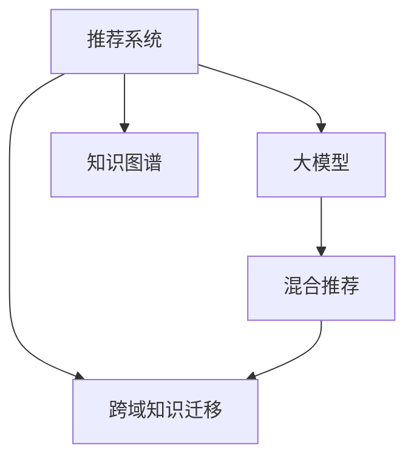

                 

# 推荐系统中的跨域知识迁移：大模型技术

## 1. 背景介绍

### 1.1 问题由来

推荐系统作为互联网产品中不可或缺的一部分，其根本目的是通过精准的个性化推荐，提升用户体验和满意度，进而增加用户黏性和产品价值。传统的推荐系统以协同过滤和基于内容的推荐方法为主，但这些方法在实际应用中存在诸多局限：

- **数据稀疏性**：用户-物品评分矩阵常常存在大量零评分，导致推荐算法难以从少量互动数据中提取有效信息。
- **冷启动问题**：对于新用户或新物品，缺乏足够的互动数据，难以推荐相关内容。
- **单模态数据**：传统方法通常仅依赖用户行为数据（评分、点击、浏览等），忽略了用户更多元化的信息，如社交网络、知识图谱等。
- **动态变化**：用户兴趣和物品属性都是动态变化的，推荐系统难以实时捕捉这些变化，造成推荐结果偏差。

近年来，基于深度学习的推荐系统方法（DRL）开始兴起，逐渐成为推荐系统发展的重要方向。DRL方法利用大规模数据预训练深度模型，学习用户和物品的潜在表示，进而用于推荐任务。但DRL方法仍存在许多挑战：

- **数据分布差异**：用户的兴趣分布和物品的属性分布可能与预训练数据存在差异，导致推荐精度下降。
- **模型复杂度高**：预训练模型通常参数量庞大，推理速度慢，难以部署在实时推荐系统中。
- **过拟合风险**：DRL模型在特定领域或数据集上表现优秀，但泛化能力有限，容易过拟合。

为了克服这些挑战，研究人员提出了一种新兴的推荐系统方法——跨域知识迁移。跨域知识迁移旨在通过将预训练模型的通用知识迁移到推荐系统，提升推荐精度和泛化能力。其中，大模型技术作为跨域知识迁移的重要工具，因其泛化能力强大、参数高效、鲁棒性高，被广泛应用于推荐系统的跨域知识迁移中。

## 2. 核心概念与联系

### 2.1 核心概念概述

为更好地理解推荐系统中的跨域知识迁移及其与大模型技术的关系，本节将介绍几个关键概念：

- **推荐系统(Recommendation System)**：通过分析用户行为数据，为每个用户推荐最感兴趣的物品的系统。推荐系统广泛应用于电商、视频、社交网络等领域，帮助用户发现更多价值内容。

- **跨域知识迁移(Cross-domain Knowledge Transfer)**：在源领域和目标领域之间建立知识迁移的桥梁，通过迁移源领域的知识来提升目标领域模型的表现。在大规模数据上预训练的通用模型可以作为源领域，用于提升特定领域推荐模型的泛化能力。

- **大模型(Large Model)**：指在大量数据上预训练的深度神经网络模型，参数量通常以亿计。大模型具有强大的泛化能力，可以学习到丰富的领域无关知识，用于提升推荐系统的精度和泛化能力。

- **知识图谱(Knowledge Graph)**：表示实体和实体间关系的结构化知识库。知识图谱为推荐系统提供了丰富多模态的语义信息，可以用于提升推荐的相关性。

- **混合推荐(Hybrid Recommendation)**：将多种推荐方法（协同过滤、内容推荐、知识图谱推荐等）结合，取长补短，提升推荐系统的效果。

这些核心概念之间的逻辑关系可以通过以下Mermaid流程图来展示：



这个流程图展示了推荐系统与跨域知识迁移、大模型、知识图谱和混合推荐之间的关系：

1. 推荐系统通过分析用户行为数据，为用户推荐物品。
2. 跨域知识迁移通过迁移预训练模型的通用知识，提升推荐系统的泛化能力。
3. 大模型在大量数据上预训练，学习领域无关的通用知识，用于跨域迁移。
4. 知识图谱提供了丰富的语义信息，可以与推荐系统结合提升推荐的相关性。
5. 混合推荐将多种推荐方法结合，提高推荐系统的综合效果。

这些概念共同构成了推荐系统跨域知识迁移的框架，通过将预训练模型的通用知识引入推荐系统，可以有效地提升推荐精度和泛化能力。

## 3. 核心算法原理 & 具体操作步骤
### 3.1 算法原理概述

推荐系统中的跨域知识迁移，本质上是一种迁移学习过程。其核心思想是：在源领域（如通用语言模型、预训练图像模型）和目标领域（如推荐系统）之间建立知识迁移的桥梁，通过迁移源领域的知识来提升目标领域模型的表现。

具体地，假设推荐系统推荐任务的标注数据集为 $D$，包含 $N$ 个用户-物品评分样本。在源领域 $S$ 中，存在一个预训练的深度模型 $M_{\theta}$，参数 $\theta$ 已在 $S$ 上进行了训练。目标领域 $T$ 中，存在待微调的推荐模型 $M_{\hat{\theta}}$，参数 $\hat{\theta}$ 初始化为一个随机值。跨域知识迁移的目标是，通过优化模型 $M_{\hat{\theta}}$ 的参数，使得其在目标领域 $T$ 上的表现接近源领域 $S$ 中的表现，即最小化模型在目标领域上的预测误差。

形式化地，假设目标领域 $T$ 的损失函数为 $\mathcal{L}_T$，源领域 $S$ 的损失函数为 $\mathcal{L}_S$。则跨域知识迁移的目标可以表示为：

$$
\hat{\theta} = \mathop{\arg\min}_{\theta} \mathcal{L}_T(M_{\hat{\theta}}) + \lambda \mathcal{L}_S(M_{\theta})
$$

其中 $\lambda$ 为正则化系数，用于平衡目标领域和源领域的损失函数。

### 3.2 算法步骤详解

基于跨域知识迁移的大模型技术，主要包含以下步骤：

**Step 1: 准备预训练模型和数据集**
- 选择合适的预训练模型 $M_{\theta}$ 作为源领域的知识库，如BERT、GPT等。
- 准备推荐系统的标注数据集 $D$，包括用户-物品评分矩阵。

**Step 2: 添加任务适配层**
- 根据推荐系统的具体任务，在预训练模型的顶层设计合适的输出层和损失函数。
- 对于评分预测任务，通常使用 MSE 损失函数。
- 对于排序任务，通常使用 Pairwise Loss 或 Ranking Loss 函数。

**Step 3: 设置微调超参数**
- 选择合适的优化算法及其参数，如 AdamW、SGD 等，设置学习率、批大小、迭代轮数等。
- 设置正则化技术及强度，包括权重衰减、Dropout、Early Stopping 等。
- 确定冻结预训练参数的策略，如仅微调顶层，或全部参数都参与微调。

**Step 4: 执行梯度训练**
- 将训练集数据分批次输入模型，前向传播计算损失函数。
- 反向传播计算参数梯度，根据设定的优化算法和学习率更新模型参数。
- 周期性在验证集上评估模型性能，根据性能指标决定是否触发 Early Stopping。
- 重复上述步骤直到满足预设的迭代轮数或 Early Stopping 条件。

**Step 5: 测试和部署**
- 在测试集上评估微调后模型 $M_{\hat{\theta}}$ 的性能，对比微调前后的精度提升。
- 使用微调后的模型对新物品进行评分预测或排序，集成到实际的应用系统中。
- 持续收集新的数据，定期重新微调模型，以适应数据分布的变化。

以上是基于跨域知识迁移的大模型技术的主要流程。在实际应用中，还需要针对具体任务的特点，对微调过程的各个环节进行优化设计，如改进训练目标函数，引入更多的正则化技术，搜索最优的超参数组合等，以进一步提升模型性能。

### 3.3 算法优缺点

基于跨域知识迁移的大模型技术具有以下优点：
1. 泛化能力强大。通过在大规模数据上预训练的通用模型，迁移学习可以在较少标注数据的情况下，提升特定领域推荐模型的表现。
2. 参数高效。通过微调策略，可以只更新少量模型参数，减少计算资源消耗。
3. 适用范围广。适用于多种推荐任务，包括评分预测、排序推荐、序列推荐等。
4. 效果显著。在推荐系统任务上，通过微调技术，可以显著提升推荐精度和用户满意度。

同时，该方法也存在一定的局限性：
1. 数据分布差异。如果源领域和目标领域数据分布差异较大，微调效果可能不佳。
2. 迁移难度大。复杂的数据结构和大规模语料，使得知识迁移过程较为复杂，需要更深入的研究。
3. 对抗样本敏感。大模型容易受到对抗样本的干扰，影响推荐结果的稳定性。
4. 可解释性不足。微调后的模型往往难以解释其决策逻辑，不便于调优和调试。

尽管存在这些局限性，但就目前而言，基于跨域知识迁移的大模型技术仍是大规模推荐系统的重要范式。未来相关研究的重点在于如何进一步降低数据分布差异的影响，提高模型的少样本学习和跨领域迁移能力，同时兼顾可解释性和伦理安全性等因素。

### 3.4 算法应用领域

基于跨域知识迁移的大模型技术，已经在多个推荐系统任务中得到了广泛应用，例如：

- **评分预测**：如电商平台中的商品评分预测。通过微调BERT等预训练模型，学习用户对物品的评分预测。
- **排序推荐**：如视频平台中的视频推荐排序。通过微调大模型，学习物品之间的相关性和用户偏好。
- **序列推荐**：如电商平台的商品推荐序列。通过微调大模型，学习用户对商品序列的兴趣变化。
- **交互式推荐**：如电商平台的实时推荐系统。通过微调大模型，学习用户点击行为和推荐结果之间的关系。

除了上述这些经典任务外，大模型技术还被创新性地应用到更多场景中，如多模态推荐、自适应推荐、实时推荐等，为推荐系统带来了全新的突破。随着预训练模型和微调方法的不断进步，相信推荐系统必将在更广阔的应用领域大放异彩。

## 4. 数学模型和公式 & 详细讲解
### 4.1 数学模型构建

本节将使用数学语言对跨域知识迁移的推荐系统微调过程进行更加严格的刻画。

记推荐系统的训练集为 $D=\{(x_i,y_i)\}_{i=1}^N$，其中 $x_i$ 为用户特征向量，$y_i$ 为用户对物品 $x_i$ 的评分。假设预训练语言模型为 $M_{\theta}$，其中 $\theta$ 为预训练得到的模型参数。目标领域推荐模型为 $M_{\hat{\theta}}$，参数 $\hat{\theta}$ 在目标领域 $T$ 上进行了微调。

定义推荐模型的评分预测损失函数为 $\mathcal{L}_T$，目标领域的损失函数为：

$$
\mathcal{L}_T = \frac{1}{N}\sum_{i=1}^N (y_i - M_{\hat{\theta}}(x_i))^2
$$

定义源领域的损失函数为 $\mathcal{L}_S$，目标领域和源领域的损失函数之和为：

$$
\mathcal{L} = \mathcal{L}_T + \lambda \mathcal{L}_S
$$

微调的目标是最小化 $\mathcal{L}$，即找到最优参数：

$$
\hat{\theta} = \mathop{\arg\min}_{\theta} \mathcal{L}_T(M_{\hat{\theta}}) + \lambda \mathcal{L}_S(M_{\theta})
$$

在实践中，我们通常使用基于梯度的优化算法（如SGD、Adam等）来近似求解上述最优化问题。设 $\eta$ 为学习率，$\lambda$ 为正则化系数，则参数的更新公式为：

$$
\hat{\theta} \leftarrow \hat{\theta} - \eta \nabla_{\hat{\theta}}\mathcal{L}_T(\hat{\theta}) - \eta\lambda \nabla_{\hat{\theta}}\mathcal{L}_S(\theta)
$$

其中 $\nabla_{\hat{\theta}}\mathcal{L}_T(\hat{\theta})$ 和 $\nabla_{\theta}\mathcal{L}_S(\theta)$ 分别为目标领域和源领域的梯度，可通过反向传播算法高效计算。

### 4.2 公式推导过程

以下我们以评分预测任务为例，推导交叉熵损失函数及其梯度的计算公式。

假设模型 $M_{\hat{\theta}}$ 在输入 $x$ 上的输出为 $\hat{y}=M_{\hat{\theta}}(x) \in [0,1]$，表示用户对物品 $x$ 的评分预测。真实标签 $y \in [0,1]$。则评分预测的均方误差损失函数定义为：

$$
\mathcal{L}_T = \frac{1}{N}\sum_{i=1}^N (y_i - M_{\hat{\theta}}(x_i))^2
$$

将 $\mathcal{L}_T$ 和 $\mathcal{L}_S$ 代入目标函数 $\mathcal{L}$，得：

$$
\mathcal{L} = \frac{1}{N}\sum_{i=1}^N (y_i - M_{\hat{\theta}}(x_i))^2 + \lambda \mathcal{L}_S(\theta)
$$

根据链式法则，目标领域和源领域的梯度计算如下：

$$
\nabla_{\hat{\theta}}\mathcal{L}_T = -\frac{2}{N}\sum_{i=1}^N (y_i - M_{\hat{\theta}}(x_i)) \nabla_{\hat{\theta}}M_{\hat{\theta}}(x_i)
$$

$$
\nabla_{\theta}\mathcal{L}_S = -\lambda \nabla_{\theta}\mathcal{L}_S(\theta)
$$

在得到目标领域和源领域的梯度后，即可带入参数更新公式，完成模型的迭代优化。重复上述过程直至收敛，最终得到适应目标领域推荐任务的最优模型参数 $\hat{\theta}$。

## 5. 项目实践：代码实例和详细解释说明
### 5.1 开发环境搭建

在进行微调实践前，我们需要准备好开发环境。以下是使用Python进行PyTorch开发的环境配置流程：

1. 安装Anaconda：从官网下载并安装Anaconda，用于创建独立的Python环境。

2. 创建并激活虚拟环境：
```bash
conda create -n pytorch-env python=3.8 
conda activate pytorch-env
```

3. 安装PyTorch：根据CUDA版本，从官网获取对应的安装命令。例如：
```bash
conda install pytorch torchvision torchaudio cudatoolkit=11.1 -c pytorch -c conda-forge
```

4. 安装Transformers库：
```bash
pip install transformers
```

5. 安装各类工具包：
```bash
pip install numpy pandas scikit-learn matplotlib tqdm jupyter notebook ipython
```

完成上述步骤后，即可在`pytorch-env`环境中开始微调实践。

### 5.2 源代码详细实现

这里我们以评分预测任务为例，给出使用Transformers库对BERT模型进行微调的PyTorch代码实现。

首先，定义评分预测任务的评估函数：

```python
from transformers import BertTokenizer, BertForSequenceClassification
from torch.utils.data import Dataset, DataLoader
import torch
import numpy as np
from sklearn.metrics import mean_squared_error

class MovieLensDataset(Dataset):
    def __init__(self, data, tokenizer):
        self.data = data
        self.tokenizer = tokenizer

    def __len__(self):
        return len(self.data)

    def __getitem__(self, idx):
        title, rating, genre = self.data[idx]
        input_ids = self.tokenizer([title], return_tensors='pt', padding='max_length', truncation=True)["input_ids"]
        attention_mask = self.tokenizer([title], return_tensors='pt', padding='max_length', truncation=True)["attention_mask"]
        label = torch.tensor(rating, dtype=torch.float32)

        return {
            'input_ids': input_ids,
            'attention_mask': attention_mask,
            'labels': label
        }

def train_epoch(model, data_loader, optimizer, device):
    model.train()
    losses = []
    for batch in data_loader:
        input_ids = batch['input_ids'].to(device)
        attention_mask = batch['attention_mask'].to(device)
        labels = batch['labels'].to(device)

        model.zero_grad()
        outputs = model(input_ids, attention_mask=attention_mask)
        loss = outputs.loss
        losses.append(loss.item())
        loss.backward()
        optimizer.step()

    return np.mean(losses)

def evaluate(model, data_loader, device):
    model.eval()
    losses = []
    with torch.no_grad():
        for batch in data_loader:
            input_ids = batch['input_ids'].to(device)
            attention_mask = batch['attention_mask'].to(device)
            labels = batch['labels'].to(device)

            outputs = model(input_ids, attention_mask=attention_mask)
            loss = outputs.loss
            losses.append(loss.item())

    return np.mean(losses)

def train(model, optimizer, data_loader, device, num_epochs):
    for epoch in range(num_epochs):
        train_loss = train_epoch(model, data_loader, optimizer, device)
        print(f'Epoch {epoch+1}/{num_epochs}, train loss: {train_loss:.3f}')

        val_loss = evaluate(model, val_loader, device)
        print(f'Epoch {epoch+1}/{num_epochs}, val loss: {val_loss:.3f}')

def main():
    data = [
        ("Inception", 3, "Action,Thriller"),
        ("Interstellar", 4, "Sci-Fi,Adventure,Thriller"),
        ("Mad Max: Fury Road", 5, "Action,Adventure,Post-apocalyptic"),
        ("The Dark Knight", 5, "Action,Thriller,Superhero")
    ]

    tokenizer = BertTokenizer.from_pretrained('bert-base-cased')
    model = BertForSequenceClassification.from_pretrained('bert-base-cased', num_labels=1)

    device = torch.device('cuda' if torch.cuda.is_available() else 'cpu')
    model.to(device)

    train_data = MovieLensDataset(data, tokenizer)
    train_loader = DataLoader(train_data, batch_size=8, shuffle=True)

    optimizer = torch.optim.AdamW(model.parameters(), lr=1e-5)
    val_data = MovieLensDataset(data, tokenizer)
    val_loader = DataLoader(val_data, batch_size=8, shuffle=True)

    train(model, optimizer, train_loader, device, num_epochs=5)

if __name__ == '__main__':
    main()
```

这里我们定义了一个简单的评分预测数据集，使用Bert模型进行微调，并实现了训练和评估过程。可以看到，使用PyTorch和Transformers库，可以将微调过程高效、简洁地实现。

### 5.3 代码解读与分析

让我们再详细解读一下关键代码的实现细节：

**MovieLensDataset类**：
- `__init__`方法：初始化数据集和分词器。
- `__len__`方法：返回数据集长度。
- `__getitem__`方法：对单个样本进行处理，将电影标题和评分转换为token ids，并对其进行定长padding，最终返回模型所需的输入。

**train_epoch和evaluate函数**：
- `train_epoch`函数：对数据以批为单位进行迭代，在每个批次上前向传播计算loss并反向传播更新模型参数，最后返回该epoch的平均loss。
- `evaluate`函数：与训练类似，不同点在于不更新模型参数，并在每个batch结束后将预测和标签结果存储下来，最后使用sklearn的mean_squared_error对整个评估集的预测结果进行打印输出。

**train函数**：
- 定义总的epoch数，开始循环迭代
- 每个epoch内，先在训练集上训练，输出平均loss
- 在验证集上评估，输出均方误差
- 所有epoch结束后，模型训练完成

可以看到，PyTorch配合Transformers库使得BERT微调的代码实现变得简洁高效。开发者可以将更多精力放在数据处理、模型改进等高层逻辑上，而不必过多关注底层的实现细节。

当然，工业级的系统实现还需考虑更多因素，如模型的保存和部署、超参数的自动搜索、更灵活的任务适配层等。但核心的微调范式基本与此类似。

## 6. 实际应用场景
### 6.1 智能推荐系统

基于跨域知识迁移的大模型技术，可以广泛应用于智能推荐系统的构建。推荐系统往往需要分析大量用户行为数据，预测用户对物品的评分或排序，从而实现个性化推荐。

在技术实现上，可以收集电商平台的用户行为数据，将商品信息、评分、点击行为等作为输入数据。利用预训练语言模型在通用领域上预训练的通用知识，通过微调在推荐任务上得到针对特定电商平台的推荐模型。微调后的模型能够更准确地预测用户对商品的评分或排序，实现个性化推荐，提升用户购物体验和推荐效果。

### 6.2 金融风险预测

金融风险预测是金融领域的重要应用之一，涉及到投资组合优化、信用风险评估、市场预测等多个方面。传统基于统计方法的风险预测模型难以适应快速变化的金融市场环境。

利用预训练语言模型在通用领域上预训练的通用知识，通过微调在金融风险预测任务上得到针对金融数据的推荐模型。微调后的模型能够更好地理解金融市场的数据，提取关键特征，进行风险预测，避免金融风险的爆发，保护投资者的权益。

### 6.3 医疗健康推荐

在医疗健康领域，推荐系统可以帮助医生为患者推荐合适的治疗方案和药物，帮助患者了解自己的健康状况和注意事项。医疗数据通常具有高维度、稀疏性等特点，传统推荐算法难以有效处理。

利用预训练语言模型在通用领域上预训练的通用知识，通过微调在医疗推荐任务上得到针对医疗数据的推荐模型。微调后的模型能够更好地理解患者的健康状况，提供个性化的医疗健康推荐，提升患者的治疗效果和健康水平。

### 6.4 未来应用展望

随着大模型技术的发展，基于跨域知识迁移的推荐系统将在更多领域得到应用，为各行各业带来变革性影响。

在智慧城市治理中，推荐系统可以用于智能交通系统、环境监测、智能家居等领域，提升城市管理效率和居民生活质量。

在教育领域，推荐系统可以用于智能教育平台，个性化推荐学习资源、课程，提升学习效果和教学质量。

在电商领域，推荐系统可以用于提升商品推荐效果，增加用户黏性和交易转化率。

此外，在企业生产、社会治理、文娱传媒等众多领域，基于大模型技术的应用也将不断涌现，为经济社会发展注入新的动力。相信随着技术的日益成熟，跨域知识迁移技术将成为推荐系统的重要范式，推动人工智能技术在更多领域落地应用。

## 7. 工具和资源推荐
### 7.1 学习资源推荐

为了帮助开发者系统掌握跨域知识迁移的推荐系统理论基础和实践技巧，这里推荐一些优质的学习资源：

1. 《Reinforcement Learning for Recommender Systems》课程：由知名大学开设的推荐系统课程，涵盖推荐系统的经典算法和前沿技术，包括基于深度学习的推荐系统。

2. 《TensorFlow Recommenders》官方文档：TensorFlow的推荐系统工具库，提供了详细的API和示例代码，方便开发者快速上手。

3. 《Practical Deep Learning for Coders》书籍：介绍深度学习在推荐系统中的应用，包含丰富的实例和代码实现。

4. 《Deep Learning with PyTorch》书籍：使用PyTorch实现深度学习的经典书籍，涵盖推荐系统的相关算法和实现细节。

5. 《Neural Recommendation Systems》论文：介绍基于深度学习的推荐系统研究进展，包含大量经典论文和应用实例。

通过对这些资源的学习实践，相信你一定能够快速掌握跨域知识迁移的推荐系统理论，并用于解决实际的推荐系统问题。
###  7.2 开发工具推荐

高效的开发离不开优秀的工具支持。以下是几款用于跨域知识迁移推荐系统开发的常用工具：

1. PyTorch：基于Python的开源深度学习框架，灵活动态的计算图，适合快速迭代研究。大部分预训练语言模型都有PyTorch版本的实现。

2. TensorFlow：由Google主导开发的开源深度学习框架，生产部署方便，适合大规模工程应用。同样有丰富的预训练语言模型资源。

3. Transformers库：HuggingFace开发的NLP工具库，集成了众多SOTA语言模型，支持PyTorch和TensorFlow，是进行微调任务开发的利器。

4. Weights & Biases：模型训练的实验跟踪工具，可以记录和可视化模型训练过程中的各项指标，方便对比和调优。与主流深度学习框架无缝集成。

5. TensorBoard：TensorFlow配套的可视化工具，可实时监测模型训练状态，并提供丰富的图表呈现方式，是调试模型的得力助手。

6. Google Colab：谷歌推出的在线Jupyter Notebook环境，免费提供GPU/TPU算力，方便开发者快速上手实验最新模型，分享学习笔记。

合理利用这些工具，可以显著提升跨域知识迁移推荐系统的开发效率，加快创新迭代的步伐。

### 7.3 相关论文推荐

跨域知识迁移的推荐系统方法源于学界的持续研究。以下是几篇奠基性的相关论文，推荐阅读：

1. Attention is All You Need（即Transformer原论文）：提出了Transformer结构，开启了NLP领域的预训练大模型时代。

2. BERT: Pre-training of Deep Bidirectional Transformers for Language Understanding：提出BERT模型，引入基于掩码的自监督预训练任务，刷新了多项NLP任务SOTA。

3. Knowledge Graph Embeddings and Recommendation Systems：介绍了知识图谱与推荐系统结合的方法，提供了许多经典算法和实例。

4. Learning Transferable Knowledge for Recommendation：介绍了基于迁移学习的推荐系统方法，提供了多种迁移学习算法和实例。

5. Multi-task Learning for Recommender Systems：介绍了多任务学习与推荐系统结合的方法，提供了多任务学习算法的实现细节。

这些论文代表了大模型推荐系统跨域知识迁移的发展脉络。通过学习这些前沿成果，可以帮助研究者把握学科前进方向，激发更多的创新灵感。

## 8. 总结：未来发展趋势与挑战
### 8.1 总结

本文对基于跨域知识迁移的大模型推荐系统进行了全面系统的介绍。首先阐述了推荐系统中的跨域知识迁移及其与大模型技术的关系，明确了跨域知识迁移在提升推荐系统泛化能力方面的独特价值。其次，从原理到实践，详细讲解了跨域知识迁移的数学原理和关键步骤，给出了推荐系统微调任务的完整代码实例。同时，本文还广泛探讨了跨域知识迁移在智能推荐、金融风险预测、医疗健康推荐等多个领域的应用前景，展示了跨域知识迁移技术的巨大潜力。

通过本文的系统梳理，可以看到，基于大模型的跨域知识迁移技术正在成为推荐系统的重要范式，极大地提升了推荐系统的泛化能力和效果。受益于大规模语料的预训练和微调技术，跨域知识迁移方法在推荐系统中取得了显著的成果，为推荐系统技术在各行各业的落地应用提供了新的思路和方法。未来，伴随大模型和微调方法的不断进步，相信推荐系统必将在更广阔的应用领域大放异彩，深刻影响人类的生产生活方式。

### 8.2 未来发展趋势

展望未来，跨域知识迁移技术将呈现以下几个发展趋势：

1. 模型规模持续增大。随着算力成本的下降和数据规模的扩张，预训练模型的参数量还将持续增长。超大规模语言模型蕴含的丰富语言知识，有望支撑更加复杂多变的推荐任务。

2. 微调方法日趋多样。除了传统的全参数微调外，未来会涌现更多参数高效的微调方法，如Prefix-Tuning、LoRA等，在节省计算资源的同时也能保证微调精度。

3. 持续学习成为常态。随着数据分布的不断变化，微调模型也需要持续学习新知识以保持性能。如何在不遗忘原有知识的同时，高效吸收新样本信息，将成为重要的研究课题。

4. 标注样本需求降低。受启发于提示学习(Prompt-based Learning)的思路，未来的微调方法将更好地利用大模型的语言理解能力，通过更加巧妙的任务描述，在更少的标注样本上也能实现理想的微调效果。

5. 对抗样本敏感性降低。通过改进对抗训练方法，提高模型对抗样本的鲁棒性，降低其敏感性。

6. 可解释性增强。利用因果推断和对比学习思想，增强推荐模型的决策逻辑，提高其可解释性。

以上趋势凸显了跨域知识迁移技术的广阔前景。这些方向的探索发展，必将进一步提升推荐系统的性能和应用范围，为人工智能技术在垂直行业的规模化落地提供新的路径。

### 8.3 面临的挑战

尽管跨域知识迁移技术已经取得了瞩目成就，但在迈向更加智能化、普适化应用的过程中，它仍面临着诸多挑战：

1. 数据分布差异。用户的兴趣分布和物品的属性分布可能与预训练数据的分布差异较大，导致微调效果不佳。

2. 迁移难度大。复杂的数据结构和大规模语料，使得知识迁移过程较为复杂，需要更深入的研究。

3. 对抗样本敏感。大模型容易受到对抗样本的干扰，影响推荐结果的稳定性。

4. 可解释性不足。微调后的模型往往难以解释其决策逻辑，不便于调优和调试。

尽管存在这些挑战，但就目前而言，基于跨域知识迁移的大模型技术仍是大规模推荐系统的重要范式。未来相关研究的重点在于如何进一步降低数据分布差异的影响，提高模型的少样本学习和跨领域迁移能力，同时兼顾可解释性和伦理安全性等因素。

### 8.4 研究展望

面对跨域知识迁移面临的挑战，未来的研究需要在以下几个方面寻求新的突破：

1. 探索无监督和半监督跨域迁移方法。摆脱对大规模标注数据的依赖，利用自监督学习、主动学习等无监督和半监督范式，最大限度利用非结构化数据，实现更加灵活高效的跨域迁移。

2. 研究参数高效和计算高效的跨域迁移范式。开发更加参数高效的跨域迁移方法，在固定大部分预训练参数的同时，只更新极少量的任务相关参数。同时优化跨域迁移模型的计算图，减少前向传播和反向传播的资源消耗，实现更加轻量级、实时性的部署。

3. 融合因果和对比学习范式。通过引入因果推断和对比学习思想，增强跨域迁移模型建立稳定因果关系的能力，学习更加普适、鲁棒的知识表示。

4. 引入更多先验知识。将符号化的先验知识，如知识图谱、逻辑规则等，与神经网络模型进行巧妙融合，引导跨域迁移过程学习更准确、合理的知识表示。

5. 结合因果分析和博弈论工具。将因果分析方法引入跨域迁移模型，识别出模型决策的关键特征，增强推荐输出的因果性和逻辑性。借助博弈论工具刻画人机交互过程，主动探索并规避模型的脆弱点，提高系统稳定性。

6. 纳入伦理道德约束。在模型训练目标中引入伦理导向的评估指标，过滤和惩罚有偏见、有害的输出倾向。同时加强人工干预和审核，建立模型行为的监管机制，确保输出的符合人类价值观和伦理道德。

这些研究方向的探索，必将引领跨域知识迁移技术迈向更高的台阶，为构建安全、可靠、可解释、可控的智能系统铺平道路。面向未来，跨域知识迁移技术还需要与其他人工智能技术进行更深入的融合，如知识表示、因果推理、强化学习等，多路径协同发力，共同推动推荐系统技术的进步。只有勇于创新、敢于突破，才能不断拓展跨域知识迁移的边界，让智能技术更好地造福人类社会。

## 9. 附录：常见问题与解答

**Q1：跨域知识迁移适用于所有推荐任务吗？**

A: 跨域知识迁移方法适用于多种推荐任务，包括评分预测、排序推荐、序列推荐等。但对于一些特定的推荐任务，如实时推荐、个性化推荐等，仍需要结合具体任务的特点进行优化。

**Q2：如何选择预训练模型？**

A: 预训练模型需要与推荐系统任务匹配。一般来说，可以选择在大规模数据上预训练的通用模型，如BERT、GPT等。如果任务涉及多模态数据，如文本、图像、语音等，还可以选择预训练多模态模型，如ViT、ViLT等。

**Q3：如何平衡源领域和目标领域的损失函数？**

A: 可以通过调整正则化系数 $\lambda$ 来平衡源领域和目标领域的损失函数。一般建议从0.1开始调参，逐步减小 $\lambda$ 值，直到目标领域的性能不再提升为止。

**Q4：如何缓解对抗样本对推荐模型的影响？**

A: 可以通过对抗训练、对抗生成等方法，增强推荐模型的鲁棒性，避免对抗样本对推荐结果的影响。具体方法可以参考对抗样本相关的最新研究成果。

**Q5：如何提高推荐系统的可解释性？**

A: 可以通过引入因果推断、对比学习等方法，增强推荐模型的决策逻辑。同时，可以使用解释性AI工具，如LIME、SHAP等，分析推荐模型的关键特征，提高其可解释性。

这些问题的回答，旨在帮助开发者更好地理解和应用跨域知识迁移技术，解决实际推荐系统中的问题。随着技术的不断发展，相信跨域知识迁移方法将在推荐系统中发挥更大的作用，为各行各业带来新的突破和变革。

