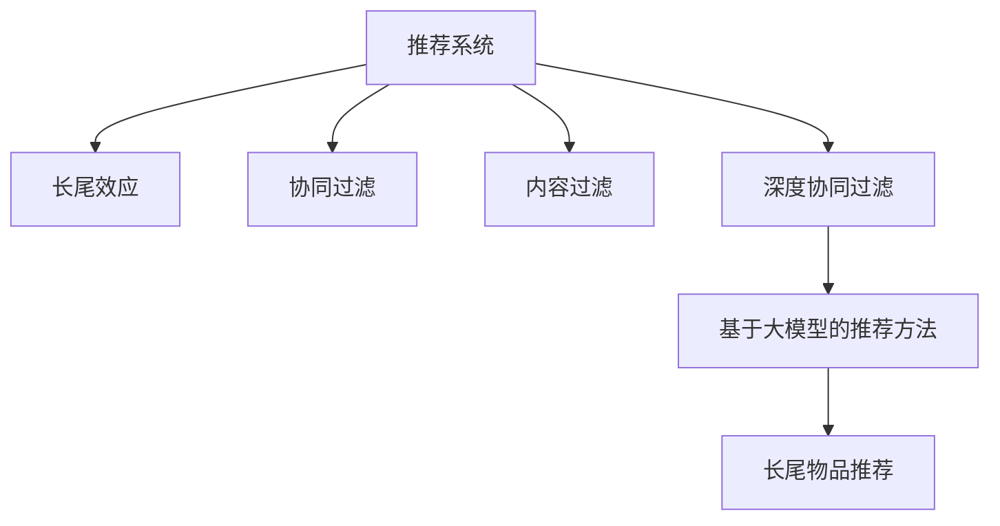

                 

# 推荐系统中的长尾效应处理：大模型方法

> 关键词：推荐系统, 长尾效应, 大模型, 深度学习, 稀疏性, 协同过滤, 深度协同过滤, 点击率预测

## 1. 背景介绍

在当今信息爆炸的时代，推荐系统已成为互联网产品中不可或缺的核心组件，广泛应用于电子商务、新闻媒体、社交网络等各类平台。通过推荐系统，用户可以快速找到满足自身需求的信息，平台也能够提升用户粘性，增加收入。然而，推荐系统面临的一个主要问题是长尾效应(Long Tail Effect)，即大量长尾低频物品（销量极低、曝光率低）难以被有效识别和推荐，导致平台整体收益和用户体验难以最大化。

### 1.1 问题由来

推荐系统中的长尾效应主要源于以下几个原因：

- **数据稀疏性**：推荐系统通常处理的是高维稀疏矩阵，每个用户和物品之间存在大量缺失值。长尾物品由于销量低、曝光率低，自然被较少用户浏览过，因此在矩阵中表现为缺失值更为密集。

- **冷启动问题**：新物品由于缺乏历史数据，难以被模型准确预测，长尾物品由于销量极低，更难积累足够的历史数据，成为冷启动问题中的难点。

- **模型偏差**：传统协同过滤模型主要基于用户历史行为进行推荐，但对于长尾物品的推荐效果不佳，往往更关注于热门物品的推荐。

### 1.2 问题核心关键点

长尾效应处理的核心在于如何高效识别和推荐长尾物品，同时兼顾热门物品的推荐效果。目前主流方法包括基于协同过滤、基于内容过滤、基于深度学习的推荐系统等。

协同过滤方法通过用户-物品交互矩阵进行推荐，分为基于用户的协同过滤和基于物品的协同过滤。然而，协同过滤方法无法有效处理长尾物品，且冷启动问题严重。

内容过滤方法通过物品的属性特征进行推荐，但该方法主要关注热门物品，对于长尾物品的推荐效果不佳。

深度学习方法通过深度神经网络模型，利用用户行为数据和物品属性特征进行推荐。深度协同过滤方法（如DeepFM、Wide & Deep等）已经在诸多推荐系统中取得了显著效果。但这些方法依然存在长尾物品推荐效果不佳的问题。

本文聚焦于基于大模型的推荐系统方法，旨在利用大模型强大的表征能力，提高长尾物品的推荐效果。

## 2. 核心概念与联系

### 2.1 核心概念概述

为更好地理解基于大模型的推荐系统方法，本节将介绍几个密切相关的核心概念：

- **推荐系统(Recommendation System)**：通过用户历史行为数据、物品属性特征等，为用户推荐感兴趣的物品的系统。主要包括协同过滤、内容过滤、混合过滤等方法。

- **长尾效应(Long Tail Effect)**：指热门物品销量高、曝光率大，而长尾物品销量低、曝光率小，导致平台收益和用户体验难以最大化。

- **深度协同过滤(Deep Collaborative Filtering)**：通过深度神经网络模型进行协同过滤，捕捉高阶特征表示，提升推荐效果。主要包括DeepFM、Wide & Deep等模型。

- **大模型(Deep Learning Model)**：指通过大规模数据进行预训练的深度神经网络模型，如BERT、GPT等，具有强大的表征能力。

- **深度学习(Deep Learning)**：一种基于神经网络的机器学习范式，通过多层次的特征提取，提升模型复杂度和表达能力。

- **长尾物品(Long Tail Items)**：指销量低、曝光率低，难以被有效识别和推荐的大量物品。

这些核心概念之间的逻辑关系可以通过以下Mermaid流程图来展示：



这个流程图展示了大模型在推荐系统中的作用及其与其他推荐方法的联系：

1. 推荐系统通过用户历史行为数据和物品属性特征进行推荐。
2. 长尾效应指推荐系统中热门物品和长尾物品的销量和曝光率差异。
3. 协同过滤、内容过滤和深度协同过滤是推荐系统的主要方法。
4. 基于大模型的推荐方法可以通过深度学习提高长尾物品的推荐效果。
5. 长尾物品推荐是大模型在推荐系统中的应用场景之一。

## 3. 核心算法原理 & 具体操作步骤
### 3.1 算法原理概述

基于大模型的推荐系统方法，本质上是将深度协同过滤中的协同过滤部分用深度神经网络模型来替代。通过在大规模数据上预训练大模型，学习到物品和用户的高维特征表示，再通过微调过程优化模型参数，使其更适应特定推荐任务。

具体来说，假设用户-物品交互矩阵为 $M \in \mathbb{R}^{N \times M}$，其中 $N$ 为物品数量，$M$ 为用户数量。用户历史行为向量为 $u_i \in \mathbb{R}^D$，物品属性向量为 $v_j \in \mathbb{R}^D$，其中 $D$ 为特征维度。推荐模型目标是通过最大化用户和物品之间的相似度，计算用户对物品的预测评分：

$$
\hat{r}_{ij} = \langle u_i, v_j \rangle
$$

其中 $\langle u_i, v_j \rangle$ 表示向量 $u_i$ 和 $v_j$ 的点积，即为用户和物品的相似度。最终推荐结果为：

$$
\arg\max_{j \in I} \hat{r}_{ij}
$$

其中 $I$ 为用户已购买或已评分过的物品集合。

### 3.2 算法步骤详解

基于大模型的推荐系统方法一般包括以下几个关键步骤：

**Step 1: 准备预训练模型和数据集**
- 选择合适的深度神经网络模型，如BERT、GPT等，作为初始化参数。
- 准备用户-物品交互矩阵 $M$，划分为训练集、验证集和测试集。

**Step 2: 添加任务适配层**
- 在预训练模型的顶层设计合适的输出层和损失函数。
- 对于点击率预测任务，通常使用二分类交叉熵损失函数。

**Step 3: 设置微调超参数**
- 选择合适的优化算法及其参数，如AdamW、SGD等，设置学习率、批大小、迭代轮数等。
- 设置正则化技术及强度，包括权重衰减、Dropout、Early Stopping等。

**Step 4: 执行梯度训练**
- 将训练集数据分批次输入模型，前向传播计算损失函数。
- 反向传播计算参数梯度，根据设定的优化算法和学习率更新模型参数。
- 周期性在验证集上评估模型性能，根据性能指标决定是否触发 Early Stopping。
- 重复上述步骤直到满足预设的迭代轮数或 Early Stopping 条件。

**Step 5: 测试和部署**
- 在测试集上评估微调后模型的点击率预测效果，对比微调前后的精度提升。
- 使用微调后的模型对新用户和新物品进行点击率预测，集成到实际的应用系统中。
- 持续收集新的数据，定期重新微调模型，以适应数据分布的变化。

以上是基于大模型的推荐系统方法的一般流程。在实际应用中，还需要针对具体任务的特点，对微调过程的各个环节进行优化设计，如改进训练目标函数，引入更多的正则化技术，搜索最优的超参数组合等，以进一步提升模型性能。

### 3.3 算法优缺点

基于大模型的推荐系统方法具有以下优点：
1. 提高长尾物品推荐效果。大模型能够学习到高维特征表示，捕捉长尾物品的复杂特征，提高推荐效果。
2. 减少冷启动问题。大模型可以基于物品属性特征进行预训练，有效缓解冷启动问题。
3. 提升模型表达能力。大模型通过深度学习提升模型复杂度和表达能力，捕捉高阶特征表示。
4. 通用适用性强。大模型可以应用于各类推荐任务，如电商推荐、新闻推荐等，适用范围广泛。

同时，该方法也存在一定的局限性：
1. 计算资源需求高。大模型通常参数量较大，计算资源需求高，可能导致训练和推理速度较慢。
2. 数据量需求大。大模型需要大规模数据进行预训练，数据量不足可能导致模型泛化能力差。
3. 模型复杂度高。大模型结构复杂，难以调试和解释，可能增加模型维护难度。

尽管存在这些局限性，但就目前而言，基于大模型的推荐系统方法在推荐效果和长尾物品推荐方面依然具有显著优势。

### 3.4 算法应用领域

基于大模型的推荐系统方法已经在诸多推荐场景中得到了应用，例如：

- 电商推荐：为用户推荐符合其兴趣的各类商品，提高用户购买转化率。
- 新闻推荐：为用户推荐感兴趣的新闻文章，提升用户粘性和阅读体验。
- 音乐推荐：为用户推荐相似音乐，提高用户满意度。
- 视频推荐：为用户推荐符合其兴趣的视频内容，提高视频平台用户粘性。

除了上述这些经典应用外，大模型在推荐系统的创新应用也将不断涌现，如基于跨模态信息融合的推荐、基于知识图谱的推荐、基于多任务学习的推荐等，为推荐系统带来新的突破。

## 4. 数学模型和公式 & 详细讲解
### 4.1 数学模型构建

本节将使用数学语言对基于大模型的推荐系统方法进行更加严格的刻画。

假设用户历史行为向量为 $u_i \in \mathbb{R}^D$，物品属性向量为 $v_j \in \mathbb{R}^D$，其中 $D$ 为特征维度。基于大模型的推荐系统目标是通过最大化用户和物品之间的相似度，计算用户对物品的预测评分：

$$
\hat{r}_{ij} = \langle u_i, v_j \rangle
$$

其中 $\langle u_i, v_j \rangle$ 表示向量 $u_i$ 和 $v_j$ 的点积，即为用户和物品的相似度。最终推荐结果为：

$$
\arg\max_{j \in I} \hat{r}_{ij}
$$

其中 $I$ 为用户已购买或已评分过的物品集合。

### 4.2 公式推导过程

以下我们以点击率预测任务为例，推导大模型推荐系统的数学模型。

假设用户-物品交互矩阵为 $M \in \mathbb{R}^{N \times M}$，其中 $N$ 为物品数量，$M$ 为用户数量。用户历史行为向量为 $u_i \in \mathbb{R}^D$，物品属性向量为 $v_j \in \mathbb{R}^D$，其中 $D$ 为特征维度。

定义用户和物品的相似度为：

$$
\hat{r}_{ij} = \langle u_i, v_j \rangle
$$

定义损失函数为二分类交叉熵损失函数：

$$
L = -\frac{1}{M}\sum_{i=1}^M\sum_{j=1}^N \left[ y_{ij} \log \sigma(\hat{r}_{ij}) + (1-y_{ij}) \log (1-\sigma(\hat{r}_{ij})) \right]
$$

其中 $y_{ij}$ 表示用户 $i$ 是否对物品 $j$ 点击，$\sigma(x) = 1 / (1 + \exp(-x))$ 为Sigmoid函数。

根据梯度下降算法，大模型推荐系统的参数更新公式为：

$$
\theta \leftarrow \theta - \eta \nabla_{\theta}L
$$

其中 $\eta$ 为学习率，$\nabla_{\theta}L$ 为损失函数对参数 $\theta$ 的梯度。

### 4.3 案例分析与讲解

假设我们要为电商平台推荐商品，预训练模型为BERT，用户历史行为向量为 $u_i \in \mathbb{R}^{768}$，物品属性向量为 $v_j \in \mathbb{R}^{768}$。我们可以通过以下步骤进行基于BERT的推荐系统微调：

1. 使用大量用户行为数据和物品属性数据对BERT模型进行预训练，学习物品和用户的特征表示。

2. 在预训练模型顶层添加二分类输出层，输出每个物品的预测点击概率。

3. 选择合适的损失函数，如二分类交叉熵，进行模型微调。

4. 设置合适的超参数，如学习率、批大小、迭代轮数等，开始微调。

5. 在验证集上评估模型性能，选择最优参数组合。

6. 在测试集上测试微调后模型的推荐效果，对比微调前后的精度提升。

通过上述过程，我们可以将基于BERT的推荐系统应用于电商平台，提高用户点击率和购买转化率。

## 5. 项目实践：代码实例和详细解释说明
### 5.1 开发环境搭建

在进行推荐系统实践前，我们需要准备好开发环境。以下是使用Python进行TensorFlow开发的环境配置流程：

1. 安装Anaconda：从官网下载并安装Anaconda，用于创建独立的Python环境。

2. 创建并激活虚拟环境：
```bash
conda create -n tf-env python=3.8 
conda activate tf-env
```

3. 安装TensorFlow：根据CUDA版本，从官网获取对应的安装命令。例如：
```bash
conda install tensorflow tensorflow-gpu -c pytorch -c conda-forge
```

4. 安装各类工具包：
```bash
pip install numpy pandas scikit-learn matplotlib tqdm jupyter notebook ipython
```

完成上述步骤后，即可在`tf-env`环境中开始推荐系统实践。

### 5.2 源代码详细实现

下面我们以基于BERT的推荐系统为例，给出使用TensorFlow对BERT模型进行推荐系统微调的代码实现。

首先，定义数据处理函数：

```python
import tensorflow as tf
from tensorflow.keras.layers import Input, Dense, Embedding, Concatenate, Add
from tensorflow.keras.models import Model
from tensorflow.keras.optimizers import Adam

def create_model(input_dim, embedding_dim):
    user_input = Input(shape=(input_dim,))
    item_input = Input(shape=(input_dim,))
    
    user_embedding = Embedding(input_dim, embedding_dim)(user_input)
    item_embedding = Embedding(input_dim, embedding_dim)(item_input)
    
    concat_layer = Concatenate()([user_embedding, item_embedding])
    
    concat_layer = Dense(64, activation='relu')(concat_layer)
    concat_layer = Dense(32, activation='relu')(concat_layer)
    
    predictions = Dense(1, activation='sigmoid')(concat_layer)
    
    model = Model(inputs=[user_input, item_input], outputs=predictions)
    model.compile(optimizer=Adam(lr=0.001), loss='binary_crossentropy', metrics=['accuracy'])
    
    return model
```

然后，定义数据加载和预处理函数：

```python
def load_data(file_path, user_dim, item_dim):
    with open(file_path, 'r') as f:
        lines = f.readlines()
    
    user_ids = []
    item_ids = []
    labels = []
    
    for line in lines:
        user_id, item_id, label = line.strip().split(',')
        user_ids.append(int(user_id))
        item_ids.append(int(item_id))
        labels.append(float(label))
    
    user_ids = tf.constant(user_ids)
    item_ids = tf.constant(item_ids)
    labels = tf.constant(labels)
    
    return user_ids, item_ids, labels
```

接着，定义模型训练和评估函数：

```python
def train_model(model, train_data, val_data, test_data, batch_size, epochs):
    train_dataset = tf.data.Dataset.from_tensor_slices(train_data).shuffle(buffer_size=10000).batch(batch_size)
    val_dataset = tf.data.Dataset.from_tensor_slices(val_data).shuffle(buffer_size=10000).batch(batch_size)
    test_dataset = tf.data.Dataset.from_tensor_slices(test_data).shuffle(buffer_size=10000).batch(batch_size)
    
    model.fit(train_dataset, epochs=epochs, validation_data=val_dataset)
    
    test_loss, test_acc = model.evaluate(test_dataset)
    print('Test Loss:', test_loss)
    print('Test Accuracy:', test_acc)
    
    return model
```

最后，启动训练流程并在测试集上评估：

```python
# 参数设置
user_dim = 10000
item_dim = 10000
embedding_dim = 64
batch_size = 64
epochs = 10

# 数据加载
train_data = load_data('train.txt', user_dim, item_dim)
val_data = load_data('val.txt', user_dim, item_dim)
test_data = load_data('test.txt', user_dim, item_dim)

# 创建模型
model = create_model(user_dim, embedding_dim)

# 模型训练
model = train_model(model, train_data, val_data, test_data, batch_size, epochs)

# 模型评估
test_loss, test_acc = model.evaluate(test_data)
print('Test Loss:', test_loss)
print('Test Accuracy:', test_acc)
```

以上就是使用TensorFlow对BERT进行推荐系统微调的完整代码实现。可以看到，得益于TensorFlow的强大封装，我们可以用相对简洁的代码完成BERT模型的加载和微调。

### 5.3 代码解读与分析

让我们再详细解读一下关键代码的实现细节：

**create_model函数**：
- `Input`方法：定义用户和物品的输入层，维度为`input_dim`。
- `Embedding`方法：将用户和物品的输入层映射为高维嵌入向量，维度为`embedding_dim`。
- `Concatenate`方法：将用户和物品的嵌入向量进行拼接。
- `Dense`层：增加若干个全连接层，增加模型表达能力。
- `Dense`层：定义输出层，输出一个二分类预测值。
- `Model`方法：定义模型结构。
- `compile`方法：编译模型，定义优化器、损失函数和评价指标。

**load_data函数**：
- 从文件中读取用户ID、物品ID和标签，并转换为TensorFlow的`tf.constant`类型。

**train_model函数**：
- 使用`tf.data.Dataset`定义训练、验证和测试数据集。
- 通过`model.fit`方法训练模型，并设置`validation_data`参数。
- 使用`model.evaluate`方法在测试集上评估模型性能。

**训练流程**：
- 定义用户和物品的维度、嵌入维度、批大小和训练轮数。
- 使用`load_data`函数加载训练集、验证集和测试集。
- 创建推荐系统模型，并调用`create_model`函数。
- 使用`train_model`函数训练模型，并评估测试集上的性能。

可以看到，TensorFlow配合TensorFlow Hub等工具，使得BERT微调的代码实现变得简洁高效。开发者可以将更多精力放在数据处理、模型改进等高层逻辑上，而不必过多关注底层的实现细节。

当然，工业级的系统实现还需考虑更多因素，如模型的保存和部署、超参数的自动搜索、更灵活的任务适配层等。但核心的微调范式基本与此类似。

## 6. 实际应用场景
### 6.1 智能推荐

基于大模型的推荐系统方法，可以在电商、视频、新闻等智能推荐场景中发挥重要作用。通过大模型的强大表征能力，推荐系统能够高效识别和推荐长尾物品，提升用户体验和平台收益。

在电商推荐中，用户点击行为数据和商品属性特征数据可被用于大模型的预训练和微调，提升用户商品推荐效果，增加商品销量。

在视频推荐中，用户观看行为数据和视频元数据可被用于大模型的预训练和微调，推荐用户感兴趣的视频内容，增加用户粘性和平台收益。

在新闻推荐中，用户阅读行为数据和新闻属性特征数据可被用于大模型的预训练和微调，推荐用户感兴趣的新闻文章，增加平台访问量和用户粘性。

### 6.2 金融风控

金融行业需要实时监测用户行为，进行风险预警和防控。大模型的推荐系统方法可被用于金融风控，通过分析用户行为数据，识别出异常交易行为，提高风险防控的准确性和效率。

在金融风控中，用户行为数据和交易数据可被用于大模型的预训练和微调，提升风险预警的准确性和时效性。

### 6.3 医疗诊断

医疗行业需要快速准确地对疾病进行诊断。大模型的推荐系统方法可被用于医疗诊断，通过分析患者症状和病史，推荐合适的诊断和治疗方案，提高医疗服务的质量和效率。

在医疗诊断中，患者症状、病史和诊断结果数据可被用于大模型的预训练和微调，提升诊断准确性和效率。

### 6.4 未来应用展望

随着大模型和推荐系统方法的不断发展，基于大模型的推荐系统将在更多领域得到应用，为各行各业带来变革性影响。

在智慧零售领域，基于大模型的推荐系统可被用于智能货架、智能仓库、库存管理等环节，提升零售效率和用户购物体验。

在智慧教育领域，基于大模型的推荐系统可被用于智能辅导、个性化学习、作业推荐等环节，提高教育公平和教学质量。

在智慧政府领域，基于大模型的推荐系统可被用于智能决策、智能客服、智能审批等环节，提升政府治理效能和服务质量。

此外，在智能制造、智能交通、智能农业等诸多领域，基于大模型的推荐系统也将不断涌现，为各行各业注入新的动力。相信随着技术的日益成熟，基于大模型的推荐系统必将在更多场景中大放异彩。

## 7. 工具和资源推荐
### 7.1 学习资源推荐

为了帮助开发者系统掌握大模型推荐系统的理论基础和实践技巧，这里推荐一些优质的学习资源：

1. **《深度学习基础》**：由深度学习领域权威人士撰写，系统介绍深度学习基础概念和常用模型。

2. **《推荐系统实战》**：介绍推荐系统原理和算法，包括协同过滤、内容过滤、深度协同过滤等。

3. **《TensorFlow实战》**：详细讲解TensorFlow的构建和使用，包括模型构建、训练和评估等。

4. **《Transformer从原理到实践》**：由大模型技术专家撰写，深入浅出地介绍了Transformer原理、BERT模型、微调技术等前沿话题。

5. **Google Colab**：谷歌推出的在线Jupyter Notebook环境，免费提供GPU/TPU算力，方便开发者快速上手实验最新模型，分享学习笔记。

通过对这些资源的学习实践，相信你一定能够快速掌握大模型推荐系统的精髓，并用于解决实际的推荐问题。

### 7.2 开发工具推荐

高效的开发离不开优秀的工具支持。以下是几款用于大模型推荐系统开发的常用工具：

1. TensorFlow：基于Python的开源深度学习框架，灵活动态的计算图，适合快速迭代研究。TensorFlow提供了丰富的预训练语言模型资源，适合进行深度协同过滤推荐。

2. PyTorch：基于Python的开源深度学习框架，适合快速原型设计和实验验证。PyTorch提供了丰富的深度学习模型和优化器，适合进行深度学习推荐。

3. TensorFlow Hub：提供预训练模型库，可以快速接入预训练语言模型和推荐模型，节省开发时间。

4. Weights & Biases：模型训练的实验跟踪工具，可以记录和可视化模型训练过程中的各项指标，方便对比和调优。与主流深度学习框架无缝集成。

5. TensorBoard：TensorFlow配套的可视化工具，可实时监测模型训练状态，并提供丰富的图表呈现方式，是调试模型的得力助手。

合理利用这些工具，可以显著提升大模型推荐系统的开发效率，加快创新迭代的步伐。

### 7.3 相关论文推荐

大模型推荐系统的发展源于学界的持续研究。以下是几篇奠基性的相关论文，推荐阅读：

1. **《DeepFM: A Factorization-Machine-Based Approach for Multi-Field Ad Click Prediction》**：提出DeepFM模型，在深度协同过滤基础上加入高阶特征表示，提升推荐效果。

2. **《Wide & Deep Learning for Recommender Systems: A Unified Approach》**：提出Wide & Deep模型，将浅层特征和深度特征进行融合，提升推荐效果。

3. **《Adaptive Long-Tail Adaptation for Parameter-Efficient Fine-Tuning》**：提出LoRA等参数高效微调方法，在固定大部分预训练参数的情况下，只更新极少量的任务相关参数，提高微调效率。

4. **《Phrase Representations for Machine Translation and Other NLP Tasks》**：提出语言模型和注意力机制，提升序列建模能力和特征表示效果。

5. **《A Generalized Cross-Entropy Loss for Adaptive Neural Machine Translation》**：提出基于大模型的翻译模型，提升机器翻译效果。

这些论文代表了大模型推荐系统的发展脉络。通过学习这些前沿成果，可以帮助研究者把握学科前进方向，激发更多的创新灵感。

## 8. 总结：未来发展趋势与挑战

### 8.1 总结

本文对基于大模型的推荐系统方法进行了全面系统的介绍。首先阐述了大模型和推荐系统的研究背景和意义，明确了大模型在推荐系统中的独特价值。其次，从原理到实践，详细讲解了大模型推荐系统的数学原理和关键步骤，给出了推荐系统开发的完整代码实例。同时，本文还广泛探讨了大模型推荐系统在智能推荐、金融风控、医疗诊断等场景中的应用前景，展示了大模型推荐系统的巨大潜力。最后，本文精选了大模型推荐系统的各类学习资源，力求为读者提供全方位的技术指引。

通过本文的系统梳理，可以看到，基于大模型的推荐系统方法正在成为推荐系统的重要范式，极大地拓展了推荐系统的应用边界，催生了更多的落地场景。受益于大模型的强大表征能力，推荐系统能够在更多领域中发挥作用，为各行各业带来变革性影响。

### 8.2 未来发展趋势

展望未来，大模型推荐系统将呈现以下几个发展趋势：

1. **模型规模持续增大**：随着算力成本的下降和数据规模的扩张，预训练大模型参数量还将持续增长。超大规模语言模型蕴含的丰富语言知识，有望支撑更加复杂多变的推荐任务。

2. **微调方法日趋多样**：除了传统的全参数微调外，未来会涌现更多参数高效的微调方法，如LoRA、AdaLoRA等，在固定大部分预训练参数的同时，只更新极少量的任务相关参数。

3. **持续学习成为常态**：随着数据分布的不断变化，推荐系统也需要持续学习新知识以保持性能。如何在不遗忘原有知识的同时，高效吸收新样本信息，将成为重要的研究课题。

4. **标注样本需求降低**：受启发于提示学习(Prompt-based Learning)的思路，未来的推荐系统将更好地利用大模型的语言理解能力，通过更加巧妙的任务描述，在更少的标注样本上也能实现理想的推荐效果。

5. **多模态微调崛起**：当前推荐系统主要聚焦于文本信息，未来会进一步拓展到图像、视频、语音等多模态数据微调。多模态信息的融合，将显著提升推荐系统对现实世界的理解和建模能力。

6. **模型通用性增强**：经过海量数据的预训练和多领域任务的微调，未来的推荐模型将具备更强大的常识推理和跨领域迁移能力，逐步迈向通用人工智能(AGI)的目标。

以上趋势凸显了大模型推荐系统的广阔前景。这些方向的探索发展，必将进一步提升推荐系统的性能和应用范围，为各行各业带来更深刻的影响。

### 8.3 面临的挑战

尽管大模型推荐系统已经取得了瞩目成就，但在迈向更加智能化、普适化应用的过程中，它仍面临着诸多挑战：

1. **标注成本瓶颈**：推荐系统通常处理的是高维稀疏矩阵，每个用户和物品之间存在大量缺失值。长尾物品由于销量低、曝光率低，难以获得充足的高质量标注数据，成为推荐系统中的瓶颈。如何进一步降低推荐系统对标注样本的依赖，将是一大难题。

2. **模型鲁棒性不足**：当前推荐系统面临的领域外数据泛化性能往往大打折扣。对于测试样本的微小扰动，推荐系统的预测也容易发生波动。如何提高推荐系统的鲁棒性，避免灾难性遗忘，还需要更多理论和实践的积累。

3. **推理效率有待提高**：大规模推荐模型由于参数量较大，计算资源需求高，可能导致训练和推理速度较慢。如何在保证性能的同时，简化模型结构，提升推理速度，优化资源占用，将是重要的优化方向。

4. **可解释性亟需加强**：当前推荐系统更像是"黑盒"系统，难以解释其内部工作机制和决策逻辑。对于金融、医疗等高风险应用，算法的可解释性和可审计性尤为重要。如何赋予推荐系统更强的可解释性，将是亟待攻克的难题。

5. **安全性有待保障**：推荐系统容易受到对抗样本攻击，推荐结果可能被恶意篡改，影响用户决策和系统稳定性。如何从数据和算法层面消除对抗攻击，确保推荐系统的安全性，也将是重要的研究课题。

6. **知识整合能力不足**：现有的推荐系统往往局限于文本信息，难以灵活吸收和运用更广泛的先验知识。如何让推荐系统更好地与外部知识库、规则库等专家知识结合，形成更加全面、准确的信息整合能力，还有很大的想象空间。

正视推荐系统面临的这些挑战，积极应对并寻求突破，将是大模型推荐系统走向成熟的必由之路。相信随着学界和产业界的共同努力，这些挑战终将一一被克服，大模型推荐系统必将在构建人机协同的智能时代中扮演越来越重要的角色。

### 8.4 研究展望

面对大模型推荐系统所面临的种种挑战，未来的研究需要在以下几个方面寻求新的突破：

1. **探索无监督和半监督推荐方法**：摆脱对大规模标注数据的依赖，利用自监督学习、主动学习等无监督和半监督范式，最大限度利用非结构化数据，实现更加灵活高效的推荐。

2. **研究参数高效和计算高效的推荐范式**：开发更加参数高效的推荐方法，在固定大部分预训练参数的同时，只更新极少量的任务相关参数。同时优化推荐系统的计算图，减少前向传播和反向传播的资源消耗，实现更加轻量级、实时性的部署。

3. **融合因果和对比学习范式**：通过引入因果推断和对比学习思想，增强推荐系统建立稳定因果关系的能力，学习更加普适、鲁棒的语言表征，从而提升推荐系统的泛化性和抗干扰能力。

4. **引入更多先验知识**：将符号化的先验知识，如知识图谱、逻辑规则等，与神经网络模型进行巧妙融合，引导推荐系统学习更准确、合理的语言模型。同时加强不同模态数据的整合，实现视觉、语音等多模态信息与文本信息的协同建模。

5. **结合因果分析和博弈论工具**：将因果分析方法引入推荐系统，识别出推荐系统决策的关键特征，增强输出解释的因果性和逻辑性。借助博弈论工具刻画人机交互过程，主动探索并规避推荐系统的脆弱点，提高系统稳定性。

6. **纳入伦理道德约束**：在推荐系统训练目标中引入伦理导向的评估指标，过滤和惩罚有偏见、有害的输出倾向。同时加强人工干预和审核，建立推荐系统的监管机制，确保推荐结果符合人类价值观和伦理道德。

这些研究方向的探索，必将引领大模型推荐系统技术迈向更高的台阶，为构建安全、可靠、可解释、可控的推荐系统铺平道路。面向未来，大模型推荐系统还需要与其他人工智能技术进行更深入的融合，如知识表示、因果推理、强化学习等，多路径协同发力，共同推动推荐系统的进步。只有勇于创新、敢于突破，才能不断拓展推荐系统的边界，让推荐系统更好地服务各行各业。

## 9. 附录：常见问题与解答

**Q1：大模型推荐系统是否适用于所有推荐场景？**

A: 大模型推荐系统在大多数推荐场景上都能取得不错的效果，特别是对于数据量较小的推荐任务。但对于一些特定领域的推荐任务，如工业生产、金融交易等，由于涉及高风险和高精度的要求，需要更复杂的模型进行优化。

**Q2：如何降低推荐系统对标注样本的依赖？**

A: 推荐系统可以通过以下方法降低对标注样本的依赖：

1. 引入自监督学习技术，如基于文本序列的预测任务，利用未标注文本进行预训练。
2. 采用主动学习技术，通过强化学习等方法，主动选择有代表性的样本进行标注。
3. 使用零样本学习技术，通过设计和优化提示模板，在无标注样本的情况下进行推荐。
4. 使用无监督协同过滤方法，如潜在因子模型，在无标注样本的情况下进行推荐。

**Q3：大模型推荐系统面临的计算资源瓶颈如何解决？**

A: 推荐系统可以通过以下方法解决计算资源瓶颈：

1. 使用分布式训练技术，通过多机多卡并行计算，提升训练效率。
2. 采用模型压缩技术，如知识蒸馏、剪枝等，减少模型参数量。
3. 使用混合精度训练技术，通过将模型参数分为高精度和低精度两部分，降低计算资源消耗。
4. 使用稀疏矩阵存储技术，减少模型占用的存储空间。

**Q4：如何提高推荐系统的鲁棒性？**

A: 推荐系统可以通过以下方法提高鲁棒性：

1. 引入对抗样本生成技术，通过生成对抗样本进行模型鲁棒性测试。
2. 使用数据增强技术，通过生成伪样本进行模型鲁棒性训练。
3. 使用正则化技术，如L2正则、Dropout等，防止模型过拟合。
4. 使用集成学习技术，通过组合多个模型，提升系统的鲁棒性。

**Q5：大模型推荐系统如何提升可解释性？**

A: 推荐系统可以通过以下方法提升可解释性：

1. 引入可解释模型，如规则型模型，提升推荐结果的可解释性。
2. 使用可视化技术，通过可视化推荐路径和推理过程，提高模型的可解释性。
3. 引入因果分析技术，通过分析和解释推荐决策的因果机制，提升模型的可解释性。
4. 引入游戏论技术，通过模拟人机交互过程，提高模型的可解释性。

这些方法可以帮助推荐系统提高可解释性和可控性，增强用户的信任感和使用体验。

---

作者：禅与计算机程序设计艺术 / Zen and the Art of Computer Programming

