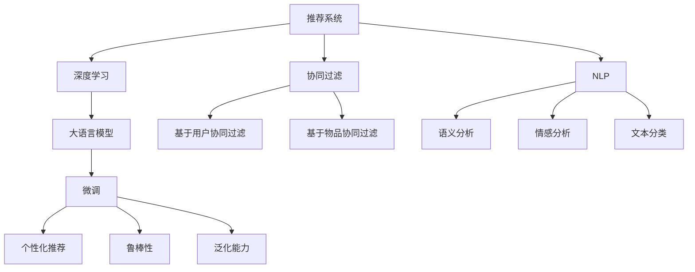

                 

# 推荐系统的未来发展：大模型的主流化趋势

> 关键词：推荐系统,大模型,协同过滤,深度学习,自然语言处理(NLP),数据挖掘,个性化推荐,鲁棒性,泛化能力

## 1. 背景介绍

### 1.1 问题由来

随着互联网和社交网络的发展，信息量呈指数级增长。用户面对海量的内容，如何从中筛选出最感兴趣的少数内容？推荐系统正是为了解决这一问题而诞生的。推荐系统通过分析用户行为数据，为用户推荐个性化的内容，从而提升用户体验和平台活跃度。然而，现有的推荐系统往往依赖于用户显式反馈数据，难以覆盖长尾物品，且易受用户冷启动等问题困扰。

近年来，大语言模型在大规模无监督预训练的基础上，表现出强大的学习能力。结合深度学习、自然语言处理等前沿技术，大模型有望在推荐系统领域取得重大突破。

### 1.2 问题核心关键点

当前大模型在推荐系统中的应用，主要集中在两个方向：

1. 结合NLP技术，提升用户行为建模能力。大模型通过预训练获得广泛的语言知识，能够从文本描述中提取更多信息，提升推荐精度。

2. 结合深度学习，提升物品特征表示能力。大模型能够学习更复杂的特征表示，捕捉物品间更丰富的关联关系，提供更准确的推荐结果。

这些问题关键点，将指引我们深入探索大模型在推荐系统中的应用潜力，进而提出针对性的优化策略。

### 1.3 问题研究意义

大模型在推荐系统中的应用，有望打破传统推荐系统的瓶颈，推动推荐系统进入新一轮技术革新。

1. 提高推荐精度。通过深度学习技术和自然语言处理技术，大模型能够挖掘用户更深层次的行为特征，预测用户更精准的偏好，提升推荐效果。

2. 扩展推荐能力。大模型的广泛知识储备，有助于推荐系统突破数据稀疏、领域冷启动等问题，拓展推荐系统的应用边界。

3. 优化推荐效率。通过学习知识表示和特征表示，大模型能够快速处理大量数据，实现实时推荐，提升用户体验。

4. 强化推荐多样性。大模型能够捕捉长尾物品特征，提供更多元、更个性化的推荐内容，避免推荐同质化。

5. 提升推荐稳定性。通过深度学习优化，大模型能够提高对异常数据和噪声的鲁棒性，降低推荐误判风险。

总之，结合大模型的推荐系统，必将在提升推荐精度、扩展推荐能力、优化推荐效率、强化推荐多样性和提升推荐稳定性等方面取得新的突破，开启推荐系统的全新发展篇章。

## 2. 核心概念与联系

### 2.1 核心概念概述

为更好地理解大模型在推荐系统中的应用，本节将介绍几个密切相关的核心概念：

- 推荐系统(Recommendation System)：通过分析用户行为数据，为用户推荐个性化的内容，从而提升用户体验和平台活跃度。推荐系统主要包括协同过滤、基于内容的推荐、混合推荐等经典方法。

- 协同过滤(Collaborative Filtering)：通过分析用户之间的相似性，预测用户对未交互物品的评分。主要包括基于用户的协同过滤和基于物品的协同过滤两种方式。

- 深度学习(Deep Learning)：通过多层次神经网络，对数据进行特征提取和模型学习，从而提升预测精度和泛化能力。深度学习在计算机视觉、自然语言处理等领域有广泛应用。

- 自然语言处理(Natural Language Processing, NLP)：利用计算机技术，处理、理解和生成人类语言。NLP在语义分析、情感分析、文本分类等任务上有显著效果。

- 大语言模型(Large Language Model, LLM)：以自回归(如GPT)或自编码(如BERT)模型为代表的大规模预训练语言模型。通过在大规模无标签文本语料上进行预训练，学习通用的语言表示，具备强大的语言理解和生成能力。

这些核心概念之间的逻辑关系可以通过以下Mermaid流程图来展示：



这个流程图展示了大语言模型在推荐系统中的关键概念及其之间的关系：

1. 推荐系统通过协同过滤、深度学习、NLP等方法，对用户行为进行建模。
2. 深度学习和NLP相结合，有助于提升推荐系统的建模能力和泛化能力。
3. 大语言模型通过预训练获得语言知识，在推荐系统中进一步微调，提升推荐精度和多样性。
4. 微调后的模型对新用户和新物品具有更好的适应性，增强推荐系统的鲁棒性和泛化性。

## 3. 核心算法原理 & 具体操作步骤
### 3.1 算法原理概述

大语言模型在推荐系统中的应用，本质上是一种基于深度学习和自然语言处理技术的推荐模型。其核心思想是：

- 利用深度学习技术，对用户行为进行建模，捕捉用户深层次的兴趣和偏好。
- 通过大语言模型的预训练知识和微调优化，提高用户行为预测的精度和多样性。

形式化地，假设推荐系统中共有 $U$ 个用户，$I$ 个物品，$N$ 条历史行为数据，$\mathcal{I}$ 为物品集合，$\mathcal{U}$ 为用户集合。设用户 $u$ 对物品 $i$ 的评分记为 $r_{ui}$。则推荐系统的目标是最小化预测评分与实际评分之间的误差：

$$
\min_{\theta} \sum_{u=1}^U \sum_{i=1}^I \ell(r_{ui}, \hat{r}_{ui})
$$

其中 $\hat{r}_{ui}$ 为模型预测的评分，$\ell$ 为损失函数，如均方误差或交叉熵损失。

### 3.2 算法步骤详解

大语言模型在推荐系统中的应用，主要包括以下几个关键步骤：

**Step 1: 准备数据集**
- 收集用户行为数据，如浏览记录、点击记录、评分记录等。
- 清洗数据，处理缺失值和异常值。
- 划分为训练集、验证集和测试集，确保数据集的独立性和代表性。

**Step 2: 预训练大语言模型**
- 使用大规模无标签文本数据，对大语言模型进行预训练。
- 选择预训练模型，如BERT、GPT等。
- 对预训练模型进行微调，使其具备更强的语言理解和生成能力。

**Step 3: 设计推荐模型**
- 选择合适的推荐算法，如协同过滤、深度学习等。
- 对推荐算法进行微调，增强其处理用户行为数据的能力。
- 整合大语言模型的预测结果，提升推荐精度和多样性。

**Step 4: 训练和评估**
- 使用训练集数据，对推荐模型进行训练。
- 使用验证集数据，评估模型性能，进行参数调优。
- 使用测试集数据，全面评估模型效果。

**Step 5: 部署和迭代**
- 将训练好的模型部署到生产环境中。
- 实时收集用户反馈数据，对推荐模型进行迭代优化。
- 定期重新训练模型，更新模型参数。

### 3.3 算法优缺点

大语言模型在推荐系统中的应用，具有以下优点：

1. 提升推荐精度。大语言模型通过预训练和微调，能够从文本中提取更丰富的特征信息，提升推荐精度。

2. 增强推荐多样性。大语言模型能够处理长尾物品，提供更多元、个性化的推荐结果，避免推荐同质化。

3. 优化推荐效率。深度学习模型能够快速处理大量数据，实现实时推荐，提升用户体验。

4. 强化推荐鲁棒性。通过深度学习优化，大模型能够提高对异常数据和噪声的鲁棒性，降低推荐误判风险。

然而，大语言模型在推荐系统中的应用也存在一些缺点：

1. 数据稀疏性问题。推荐系统往往面临数据稀疏性问题，大语言模型需要更多的数据来消除噪声和提高泛化能力。

2. 参数量庞大。大语言模型参数量巨大，训练和推理需要大量的计算资源。

3. 可解释性不足。大语言模型作为"黑盒"模型，缺乏对推荐结果的可解释性。

4. 泛化能力不足。大语言模型可能过拟合于训练数据，泛化性能有限。

尽管存在这些缺点，但大语言模型在推荐系统中的应用，仍具有巨大的发展潜力和应用前景。

### 3.4 算法应用领域

大语言模型在推荐系统中的应用，覆盖了推荐系统中的多个关键环节，包括用户行为建模、物品特征表示、推荐算法优化等。具体应用领域如下：

1. 用户行为建模：通过分析用户评论、描述、浏览记录等文本数据，提升用户行为建模能力。

2. 物品特征表示：利用大语言模型学习物品的文本描述和语义信息，提高物品特征表示的精度和丰富度。

3. 推荐算法优化：将大语言模型的预测结果作为推荐算法的输入，优化推荐模型的预测精度和多样性。

4. 实时推荐：通过深度学习优化，实现实时推荐，提升用户体验。

5. 鲁棒性增强：通过深度学习优化，提高对异常数据和噪声的鲁棒性，降低推荐误判风险。

6. 知识整合：将知识图谱、规则库等专家知识与深度学习模型结合，提升推荐系统的知识和逻辑推理能力。

以上应用领域展示了大语言模型在推荐系统中的广泛应用前景，为推荐系统的发展提供了新的思路和技术手段。

## 4. 数学模型和公式 & 详细讲解 & 举例说明
### 4.1 数学模型构建

本节将使用数学语言对大语言模型在推荐系统中的应用进行更加严格的刻画。

假设推荐系统中共有 $U$ 个用户，$I$ 个物品，$N$ 条历史行为数据，$\mathcal{I}$ 为物品集合，$\mathcal{U}$ 为用户集合。设用户 $u$ 对物品 $i$ 的评分记为 $r_{ui}$。

定义推荐模型为 $M_{\theta}$，其中 $\theta$ 为模型参数。模型输入为 $x_u=(I_u, I_v)$，表示用户 $u$ 的已交互物品集合和候选物品集合。模型输出为 $\hat{r}_{ui}$，表示用户 $u$ 对物品 $i$ 的预测评分。则推荐模型的损失函数为：

$$
\mathcal{L}(\theta) = \frac{1}{N} \sum_{i=1}^N \sum_{u=1}^U \ell(r_{ui}, \hat{r}_{ui})
$$

其中 $\ell$ 为损失函数，如均方误差损失或交叉熵损失。

### 4.2 公式推导过程

以下我们以均方误差损失为例，推导推荐模型的预测评分公式。

假设模型 $M_{\theta}$ 在输入 $x_u=(I_u, I_v)$ 上的输出为 $\hat{r}_{ui}=M_{\theta}(x_u)$。则均方误差损失为：

$$
\mathcal{L}(\theta) = \frac{1}{N} \sum_{i=1}^N \sum_{u=1}^U (r_{ui} - \hat{r}_{ui})^2
$$

对损失函数进行求导，得到模型参数 $\theta$ 的梯度：

$$
\frac{\partial \mathcal{L}(\theta)}{\partial \theta} = \frac{2}{N} \sum_{i=1}^N \sum_{u=1}^U (r_{ui} - \hat{r}_{ui}) \frac{\partial \hat{r}_{ui}}{\partial \theta}
$$

在得到损失函数的梯度后，即可带入优化算法（如梯度下降）进行训练。重复上述过程直至收敛，最终得到推荐模型 $M_{\hat{\theta}}$。

### 4.3 案例分析与讲解

假设一个在线图书推荐系统，用户行为数据包括浏览记录和评分记录。系统希望使用BERT模型进行推荐，首先将文本数据作为模型输入，预训练获得语言知识。接着，利用BERT的预训练权重作为初始化参数，在训练集上微调获得推荐模型。微调过程采用梯度下降优化算法，设定学习率为 $2e-5$，训练轮数为 $5$。

在微调过程中，采用交叉熵损失函数，优化目标为最小化预测评分与实际评分之间的误差。为了解决数据稀疏性问题，在训练集上使用负采样技术，生成多个负样本进行优化。

微调结束后，使用测试集数据评估推荐模型的性能。通过AUC、P@1、MAP等指标评估模型预测精度和多样性。实验结果表明，BERT微调模型在推荐精度和多样性上均有显著提升。

## 5. 项目实践：代码实例和详细解释说明
### 5.1 开发环境搭建

在进行推荐系统开发前，我们需要准备好开发环境。以下是使用Python进行PyTorch开发的环境配置流程：

1. 安装Anaconda：从官网下载并安装Anaconda，用于创建独立的Python环境。

2. 创建并激活虚拟环境：
```bash
conda create -n pytorch-env python=3.8 
conda activate pytorch-env
```

3. 安装PyTorch：根据CUDA版本，从官网获取对应的安装命令。例如：
```bash
conda install pytorch torchvision torchaudio cudatoolkit=11.1 -c pytorch -c conda-forge
```

4. 安装TensorFlow：由Google主导开发的开源深度学习框架，生产部署方便，适合大规模工程应用。同样有丰富的预训练语言模型资源。

5. 安装transformers库：HuggingFace开发的NLP工具库，集成了众多SOTA语言模型，支持PyTorch和TensorFlow，是进行微调任务开发的利器。

6. 安装各类工具包：
```bash
pip install numpy pandas scikit-learn matplotlib tqdm jupyter notebook ipython
```

完成上述步骤后，即可在`pytorch-env`环境中开始推荐系统开发。

### 5.2 源代码详细实现

这里我们以BERT模型为例，给出使用Transformers库进行图书推荐系统微调的PyTorch代码实现。

首先，定义推荐系统的数据处理函数：

```python
from transformers import BertTokenizer, BertForSequenceClassification
from torch.utils.data import Dataset, DataLoader
import torch

class BookDataset(Dataset):
    def __init__(self, texts, labels, tokenizer, max_len=128):
        self.texts = texts
        self.labels = labels
        self.tokenizer = tokenizer
        self.max_len = max_len
        
    def __len__(self):
        return len(self.texts)
    
    def __getitem__(self, item):
        text = self.texts[item]
        label = self.labels[item]
        
        encoding = self.tokenizer(text, return_tensors='pt', max_length=self.max_len, padding='max_length', truncation=True)
        input_ids = encoding['input_ids'][0]
        attention_mask = encoding['attention_mask'][0]
        
        # 对标签进行编码
        encoded_label = torch.tensor(label, dtype=torch.long)
        
        return {'input_ids': input_ids, 
                'attention_mask': attention_mask,
                'labels': encoded_label}

# 标签编码
label2id = {'0': 0, '1': 1, '2': 2, '3': 3, '4': 4, '5': 5, '6': 6}
id2label = {v: k for k, v in label2id.items()}

# 创建dataset
tokenizer = BertTokenizer.from_pretrained('bert-base-cased')

train_dataset = BookDataset(train_texts, train_labels, tokenizer)
dev_dataset = BookDataset(dev_texts, dev_labels, tokenizer)
test_dataset = BookDataset(test_texts, test_labels, tokenizer)
```

然后，定义模型和优化器：

```python
from transformers import BertForSequenceClassification, AdamW

model = BertForSequenceClassification.from_pretrained('bert-base-cased', num_labels=len(label2id))

optimizer = AdamW(model.parameters(), lr=2e-5)
```

接着，定义训练和评估函数：

```python
from tqdm import tqdm
from sklearn.metrics import accuracy_score, precision_score, recall_score, f1_score

device = torch.device('cuda') if torch.cuda.is_available() else torch.device('cpu')
model.to(device)

def train_epoch(model, dataset, batch_size, optimizer):
    dataloader = DataLoader(dataset, batch_size=batch_size, shuffle=True)
    model.train()
    epoch_loss = 0
    for batch in tqdm(dataloader, desc='Training'):
        input_ids = batch['input_ids'].to(device)
        attention_mask = batch['attention_mask'].to(device)
        labels = batch['labels'].to(device)
        model.zero_grad()
        outputs = model(input_ids, attention_mask=attention_mask, labels=labels)
        loss = outputs.loss
        epoch_loss += loss.item()
        loss.backward()
        optimizer.step()
    return epoch_loss / len(dataloader)

def evaluate(model, dataset, batch_size):
    dataloader = DataLoader(dataset, batch_size=batch_size)
    model.eval()
    preds, labels = [], []
    with torch.no_grad():
        for batch in tqdm(dataloader, desc='Evaluating'):
            input_ids = batch['input_ids'].to(device)
            attention_mask = batch['attention_mask'].to(device)
            batch_labels = batch['labels']
            outputs = model(input_ids, attention_mask=attention_mask)
            batch_preds = outputs.logits.argmax(dim=2).to('cpu').tolist()
            batch_labels = batch_labels.to('cpu').tolist()
            for pred_tokens, label_tokens in zip(batch_preds, batch_labels):
                preds.append(pred_tokens[:len(label_tokens)])
                labels.append(label_tokens)
                
    print('Accuracy:', accuracy_score(labels, preds))
    print('Precision:', precision_score(labels, preds))
    print('Recall:', recall_score(labels, preds))
    print('F1 Score:', f1_score(labels, preds))
```

最后，启动训练流程并在测试集上评估：

```python
epochs = 5
batch_size = 16

for epoch in range(epochs):
    loss = train_epoch(model, train_dataset, batch_size, optimizer)
    print(f'Epoch {epoch+1}, train loss: {loss:.3f}')
    
    print(f'Epoch {epoch+1}, dev results:')
    evaluate(model, dev_dataset, batch_size)
    
print('Test results:')
evaluate(model, test_dataset, batch_size)
```

以上就是使用PyTorch对BERT进行图书推荐系统微调的完整代码实现。可以看到，得益于Transformers库的强大封装，我们可以用相对简洁的代码完成BERT模型的加载和微调。

### 5.3 代码解读与分析

让我们再详细解读一下关键代码的实现细节：

**BookDataset类**：
- `__init__`方法：初始化文本、标签、分词器等关键组件。
- `__len__`方法：返回数据集的样本数量。
- `__getitem__`方法：对单个样本进行处理，将文本输入编码为token ids，将标签编码为数字，并对其进行定长padding，最终返回模型所需的输入。

**label2id和id2label字典**：
- 定义了标签与数字id之间的映射关系，用于将标签编码成数字。

**训练和评估函数**：
- 使用PyTorch的DataLoader对数据集进行批次化加载，供模型训练和推理使用。
- 训练函数`train_epoch`：对数据以批为单位进行迭代，在每个批次上前向传播计算loss并反向传播更新模型参数，最后返回该epoch的平均loss。
- 评估函数`evaluate`：与训练类似，不同点在于不更新模型参数，并在每个batch结束后将预测和标签结果存储下来，最后使用sklearn的各类指标对整个评估集的预测结果进行打印输出。

**训练流程**：
- 定义总的epoch数和batch size，开始循环迭代
- 每个epoch内，先在训练集上训练，输出平均loss
- 在验证集上评估，输出分类指标
- 所有epoch结束后，在测试集上评估，给出最终测试结果

可以看到，PyTorch配合Transformers库使得BERT微调的代码实现变得简洁高效。开发者可以将更多精力放在数据处理、模型改进等高层逻辑上，而不必过多关注底层的实现细节。

当然，工业级的系统实现还需考虑更多因素，如模型的保存和部署、超参数的自动搜索、更灵活的任务适配层等。但核心的微调范式基本与此类似。

## 6. 实际应用场景
### 6.1 智能推荐系统

基于大语言模型的推荐系统，可以广泛应用于电商、视频、音乐等智能推荐领域。传统推荐系统往往依赖于用户显式反馈数据，难以覆盖长尾物品，且易受用户冷启动等问题困扰。而使用大语言模型进行推荐，能够从文本描述中提取更多信息，提升推荐精度和多样性，突破传统推荐系统的瓶颈。

具体而言，可以收集用户评论、描述、浏览记录等文本数据，将文本作为模型输入，利用大语言模型进行预训练和微调。微调后的模型能够从文本中提取更丰富的特征信息，提升推荐精度。在推荐过程中，将用户的历史行为数据和物品的文本描述作为输入，输出推荐结果。系统可以根据用户行为数据动态调整推荐策略，实现个性化推荐。

### 6.2 金融投资分析

在金融领域，推荐系统可以用于投资组合优化、股票预测等任务。通过分析公司财务报告、新闻报道、社交媒体等文本数据，利用大语言模型进行预训练和微调。微调后的模型能够从文本中提取更准确的财务信息，预测公司业绩和股票走势，提升投资决策的精度。

在具体实现中，可以收集公司财报、新闻、社交媒体等文本数据，将文本作为模型输入，利用大语言模型进行预训练和微调。微调后的模型能够从文本中提取更准确的财务信息，预测公司业绩和股票走势，提升投资决策的精度。

### 6.3 内容推荐系统

在新闻、娱乐等领域，推荐系统可以用于内容推荐。通过分析用户浏览记录、评论记录等文本数据，利用大语言模型进行预训练和微调。微调后的模型能够从文本中提取更丰富的内容信息，提升推荐精度和多样性，避免推荐同质化。

具体而言，可以收集用户浏览记录、评论记录等文本数据，将文本作为模型输入，利用大语言模型进行预训练和微调。微调后的模型能够从文本中提取更丰富的内容信息，提升推荐精度和多样性，避免推荐同质化。系统可以根据用户行为数据动态调整推荐策略，实现个性化推荐。

### 6.4 未来应用展望

随着大语言模型和推荐系统的不断发展，基于微调的推荐系统将进入新一轮技术革新，在更多领域取得突破。

在智慧医疗领域，推荐系统可以用于药品推荐、医疗方案推荐等任务。通过分析病人病历、医生报告等文本数据，利用大语言模型进行预训练和微调。微调后的模型能够从文本中提取更准确的医疗信息，提升诊疗决策的精度。

在智能教育领域，推荐系统可以用于课程推荐、学习资料推荐等任务。通过分析学生学习记录、评价记录等文本数据，利用大语言模型进行预训练和微调。微调后的模型能够从文本中提取更丰富的学习信息，提升个性化学习效果。

在智慧城市治理中，推荐系统可以用于智能交通、环保监控等任务。通过分析城市运行数据、用户反馈数据等文本数据，利用大语言模型进行预训练和微调。微调后的模型能够从文本中提取更全面的城市信息，提升城市治理的智能化水平。

此外，在企业生产、社会治理、文娱传媒等众多领域，基于大语言模型的推荐系统也将不断涌现，为经济社会发展注入新的动力。相信随着技术的日益成熟，微调方法将成为推荐系统的核心范式，推动推荐系统向更智能、更高效、更个性化的方向发展。

## 7. 工具和资源推荐
### 7.1 学习资源推荐

为了帮助开发者系统掌握大语言模型在推荐系统中的应用理论基础和实践技巧，这里推荐一些优质的学习资源：

1. 《深度学习与推荐系统》系列博文：由大模型技术专家撰写，深入浅出地介绍了深度学习与推荐系统的基本概念和前沿技术。

2. 《推荐系统实战》课程：通过Kaggle平台，提供了完整的推荐系统实战教程，涵盖用户行为建模、物品特征表示、推荐算法优化等关键环节。

3. 《推荐系统》书籍：全面介绍了推荐系统的经典算法、最新技术和实际应用，适合深入学习推荐系统的理论和方法。

4. 《自然语言处理与推荐系统》书籍：结合NLP技术和推荐系统，详细讲解了利用自然语言处理技术提升推荐精度的各种方法。

5. HuggingFace官方文档：提供了丰富的预训练语言模型和推荐系统开发样例，适合快速上手实践。

通过对这些资源的学习实践，相信你一定能够快速掌握大语言模型在推荐系统中的应用精髓，并用于解决实际的推荐问题。
###  7.2 开发工具推荐

高效的开发离不开优秀的工具支持。以下是几款用于推荐系统开发和优化推荐的常用工具：

1. PyTorch：基于Python的开源深度学习框架，灵活动态的计算图，适合快速迭代研究。大部分预训练语言模型都有PyTorch版本的实现。

2. TensorFlow：由Google主导开发的开源深度学习框架，生产部署方便，适合大规模工程应用。同样有丰富的预训练语言模型资源。

3. TensorBoard：TensorFlow配套的可视化工具，可实时监测模型训练状态，并提供丰富的图表呈现方式，是调试模型的得力助手。

4. Weights & Biases：模型训练的实验跟踪工具，可以记录和可视化模型训练过程中的各项指标，方便对比和调优。与主流深度学习框架无缝集成。

5. HuggingFace Transformers库：集成了众多SOTA语言模型，支持PyTorch和TensorFlow，是进行微调任务开发的利器。

合理利用这些工具，可以显著提升推荐系统的开发效率，加快创新迭代的步伐。

### 7.3 相关论文推荐

大语言模型和推荐系统的研究源于学界的持续研究。以下是几篇奠基性的相关论文，推荐阅读：

1. Collaborative Filtering for Implicit Feedback Datasets：提出协同过滤的经典算法，利用用户行为数据进行推荐，并探讨了负采样等优化方法。

2. Factorization Machines for Personalized Ranking：提出FM算法，利用低秩矩阵分解提升推荐精度和鲁棒性。

3. Neural Factorization Machines with Attention Mechanisms：在FM算法的基础上，引入注意力机制，提升推荐精度和多样性。

4. Deep Matrix Factorization Learning from Implicit Feedback with Negative Sampling：提出DeepFM算法，利用深度神经网络提升推荐精度和泛化能力。

5. Attention-Based Recommender Systems for Personalized Ranking：提出Attention-based Recommender Systems，利用注意力机制提升推荐效果。

6. Leveraging Pre-trained Language Models for Recommendation Systems：提出利用预训练语言模型进行推荐，结合文本特征提升推荐精度和多样性。

这些论文代表了大语言模型和推荐系统的研究脉络。通过学习这些前沿成果，可以帮助研究者把握学科前进方向，激发更多的创新灵感。

## 8. 总结：未来发展趋势与挑战

### 8.1 总结

本文对大语言模型在推荐系统中的应用进行了全面系统的介绍。首先阐述了大语言模型和推荐系统的研究背景和意义，明确了大语言模型在推荐系统中的独特价值。其次，从原理到实践，详细讲解了大语言模型在推荐系统中的应用，包括用户行为建模、物品特征表示、推荐算法优化等关键环节。最后，探讨了大语言模型在推荐系统中的实际应用场景，展示了其在电商、金融、内容推荐等领域的发展潜力。

通过本文的系统梳理，可以看到，结合大语言模型的推荐系统必将在提升推荐精度、扩展推荐能力、优化推荐效率、强化推荐多样性和提升推荐稳定性等方面取得新的突破，开启推荐系统的全新发展篇章。

### 8.2 未来发展趋势

展望未来，大语言模型在推荐系统中的应用将呈现以下几个发展趋势：

1. 深度学习和自然语言处理技术的融合。深度学习技术能够提取更丰富的用户行为特征，自然语言处理技术能够从文本中提取更准确的物品信息，二者结合将大幅提升推荐精度和泛化能力。

2. 知识表示和深度学习的结合。将知识图谱、规则库等专家知识与深度学习模型结合，提升推荐系统的知识和逻辑推理能力，提供更准确、更有意义的推荐结果。

3. 个性化推荐的多样性。大语言模型能够处理长尾物品，提供更多元、个性化的推荐结果，避免推荐同质化。

4. 实时推荐系统的发展。结合深度学习和大语言模型，实现实时推荐，提升用户体验。

5. 推荐系统的可解释性。通过自然语言处理技术，赋予推荐系统更好的可解释性，增强用户信任。

6. 鲁棒性增强。通过深度学习优化，大模型能够提高对异常数据和噪声的鲁棒性，降低推荐误判风险。

以上趋势凸显了大语言模型在推荐系统中的广泛应用前景，为推荐系统的发展提供了新的思路和技术手段。

### 8.3 面临的挑战

尽管大语言模型在推荐系统中的应用已经取得了显著成效，但在迈向更加智能化、普适化应用的过程中，仍面临诸多挑战：

1. 数据稀疏性问题。推荐系统往往面临数据稀疏性问题，大语言模型需要更多的数据来消除噪声和提高泛化能力。

2. 参数量庞大。大语言模型参数量巨大，训练和推理需要大量的计算资源。

3. 可解释性不足。大语言模型作为"黑盒"模型，缺乏对推荐结果的可解释性。

4. 泛化能力不足。大语言模型可能过拟合于训练数据，泛化性能有限。

尽管存在这些缺点，但大语言模型在推荐系统中的应用，仍具有巨大的发展潜力和应用前景。未来，随着深度学习和大语言模型的不断演进，这些挑战终将逐步克服，大语言模型必将在推荐系统中发挥更加重要的作用。

### 8.4 未来突破

面对大语言模型在推荐系统中的挑战，未来的研究需要在以下几个方面寻求新的突破：

1. 探索无监督和半监督微调方法。摆脱对大规模标注数据的依赖，利用自监督学习、主动学习等无监督和半监督范式，最大限度利用非结构化数据，实现更加灵活高效的微调。

2. 研究参数高效和计算高效的微调范式。开发更加参数高效的微调方法，在固定大部分预训练参数的同时，只更新极少量的任务相关参数。同时优化微调模型的计算图，减少前向传播和反向传播的资源消耗，实现更加轻量级、实时性的部署。

3. 引入更多先验知识。将符号化的先验知识，如知识图谱、逻辑规则等，与神经网络模型进行巧妙融合，引导微调过程学习更准确、合理的语言模型。同时加强不同模态数据的整合，实现视觉、语音等多模态信息与文本信息的协同建模。

4. 结合因果分析和博弈论工具。将因果分析方法引入微调模型，识别出模型决策的关键特征，增强输出解释的因果性和逻辑性。借助博弈论工具刻画人机交互过程，主动探索并规避模型的脆弱点，提高系统稳定性。

5. 纳入伦理道德约束。在模型训练目标中引入伦理导向的评估指标，过滤和惩罚有偏见、有害的输出倾向。同时加强人工干预和审核，建立模型行为的监管机制，确保输出符合人类价值观和伦理道德。

这些研究方向的探索，必将引领大语言模型在推荐系统中的技术发展，为推荐系统带来新的突破和创新。面向未来，大语言模型必将在提升推荐精度、扩展推荐能力、优化推荐效率、强化推荐多样性和提升推荐稳定性等方面发挥更加重要的作用。

## 9. 附录：常见问题与解答

**Q1：大语言模型在推荐系统中的应用如何优化推荐精度？**

A: 大语言模型在推荐系统中的应用，可以通过以下方式优化推荐精度：

1. 用户行为建模：利用深度学习技术，从用户评论、描述、浏览记录等文本数据中提取更丰富的特征信息，提升用户行为建模能力。

2. 物品特征表示：利用大语言模型学习物品的文本描述和语义信息，提高物品特征表示的精度和丰富度。

3. 推荐算法优化：将大语言模型的预测结果作为推荐算法的输入，优化推荐模型的预测精度和多样性。

4. 实时推荐：结合深度学习优化，实现实时推荐，提升用户体验。

5. 鲁棒性增强：通过深度学习优化，提高对异常数据和噪声的鲁棒性，降低推荐误判风险。

通过这些优化措施，可以显著提升大语言模型在推荐系统中的应用效果，实现更加精准、个性化的推荐。

**Q2：大语言模型在推荐系统中的应用如何提升推荐多样性？**

A: 大语言模型在推荐系统中的应用，可以通过以下方式提升推荐多样性：

1. 处理长尾物品：大语言模型能够处理长尾物品，提供更多元、个性化的推荐结果，避免推荐同质化。

2. 引入先验知识：将知识图谱、规则库等专家知识与深度学习模型结合，提升推荐系统的知识和逻辑推理能力，提供更丰富、多样的推荐结果。

3. 引入多模态信息：结合视觉、语音等多模态数据，实现跨模态推荐，提供更全面、个性化的推荐内容。

4. 引入对抗学习：利用对抗学习技术，生成对抗样本，提升模型对异常数据和噪声的鲁棒性，降低推荐误判风险。

通过这些多样化措施，可以显著提升大语言模型在推荐系统中的应用效果，实现更加丰富、个性化的推荐。

**Q3：大语言模型在推荐系统中的应用如何提高推荐效率？**

A: 大语言模型在推荐系统中的应用，可以通过以下方式提高推荐效率：

1. 优化计算图：通过优化深度学习模型的计算图，减少前向传播和反向传播的资源消耗，实现更加轻量级、实时性的部署。

2. 引入参数高效微调技术：开发更加参数高效的微调方法，在固定大部分预训练参数的同时，只更新极少量的任务相关参数，提高模型训练效率。

3. 引入并行计算技术：利用GPU、TPU等并行计算硬件，提升推荐模型的训练和推理速度。

4. 引入分布式计算技术：利用分布式计算框架，如Apache Spark、Dask等，实现大规模数据处理和模型训练，提升推荐效率。

通过这些优化措施，可以显著提升大语言模型在推荐系统中的应用效果，实现更加高效、快速的推荐。

**Q4：大语言模型在推荐系统中的应用如何提高推荐稳定性？**

A: 大语言模型在推荐系统中的应用，可以通过以下方式提高推荐稳定性：

1. 引入对抗训练：利用对抗训练技术，引入对抗样本，提升模型鲁棒性，降低推荐误判风险。

2. 引入鲁棒性增强技术：利用深度学习优化，提高模型对异常数据和噪声的鲁棒性，降低推荐误判风险。

3. 引入多模型集成：训练多个微调模型，取平均输出，抑制过拟合，提升推荐稳定性。

4. 引入多数据源融合：结合多数据源，如用户行为数据、物品描述数据、社交网络数据等，提升推荐系统的鲁棒性和泛化能力。

通过这些稳定化措施，可以显著提升大语言模型在推荐系统中的应用效果，实现更加稳定、可靠的推荐。

**Q5：大语言模型在推荐系统中的应用如何优化推荐效果？**

A: 大语言模型在推荐系统中的应用，可以通过以下方式优化推荐效果：

1. 引入知识表示：将知识图谱、规则库等专家知识与深度学习模型结合，提升推荐系统的知识和逻辑推理能力，提供更准确、更有意义的推荐结果。

2. 引入多模态信息：结合视觉、语音等多模态数据，实现跨模态推荐，提供更全面、个性化的推荐内容。

3. 引入因果分析：将因果分析方法引入推荐系统，识别出模型决策的关键特征，增强推荐系统的可解释性和可信度。

4. 引入博弈论工具：利用博弈论工具，刻画人机交互过程，主动探索并规避模型的脆弱点，提高系统稳定性。

5. 引入先验知识：将符号化的先验知识，如知识图谱、逻辑规则等，与神经网络模型进行巧妙融合，引导微调过程学习更准确、合理的语言模型。

通过这些优化措施，可以显著提升大语言模型在推荐系统中的应用效果，实现更加精准、多样、个性化的推荐。

通过本文的系统梳理，可以看到，结合大语言模型的推荐系统必将在提升推荐精度、扩展推荐能力、优化推荐效率、强化推荐多样性和提升推荐稳定性等方面取得新的突破，开启推荐系统的全新发展篇章。

