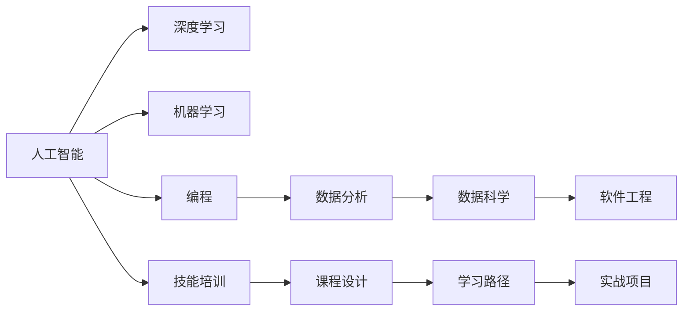

                 

# 提供特定职业的实用知识和技能培训

> 关键词：人工智能(AI), 深度学习, 机器学习(ML), 编程, 数据分析, 数据科学, 软件工程, 技术博客, 专业技能培训

## 1. 背景介绍

### 1.1 问题由来

在快速发展的数字化时代，各行各业对高技能人才的需求日益增长。传统的人才培训方式往往难以满足这种需求，企业迫切需要快速培养出既懂技术又懂业务的复合型人才。与此同时，AI技术的崛起使得许多工作岗位的技能要求发生了显著变化，对从业者的数据处理、编程、模型构建等技能有了新的要求。面对这一需求，提供个性化、系统的职业技能培训，成为了教育和技术界共同关注的话题。

### 1.2 问题核心关键点

基于此，本文章旨在系统性地介绍如何为特定职业提供实用且高效的技能培训。我们将重点关注以下几个关键点：

- **技能要求分析**：深入剖析不同职业所需的关键技能和知识体系，明确培训的重点和方向。
- **课程设计与内容**：提供详细且系统的课程设计思路，包括课程结构、知识点分布、学习资源推荐等。
- **学习路径与策略**：设计基于项目导向的学习路径，帮助学员在实践中掌握实际技能，并给出学习策略建议。
- **实战项目与案例**：通过实际项目和案例展示，增强学员对技能的理解和应用能力。
- **未来展望与挑战**：分析行业发展趋势和面临的挑战，为培训提供长远指导。

## 2. 核心概念与联系

### 2.1 核心概念概述

为更好地理解提供特定职业培训的方法，我们需要了解一些核心概念：

- **人工智能(AI)**：AI技术是指让计算机系统模拟人类智能行为，如图像识别、自然语言处理、智能推荐等。
- **深度学习(Deep Learning)**：是AI的一个分支，通过多层神经网络进行特征学习和模式识别。
- **机器学习(ML)**：是AI的另一个重要领域，通过算法让计算机从数据中学习规律，进行预测和决策。
- **编程(Programming)**：编写程序以实现特定功能，是AI和ML技能的基础。
- **数据分析(Analytics)**：从数据中提取有用信息，是数据科学的关键。
- **数据科学(Data Science)**：综合运用统计学、编程和机器学习等技术，对数据进行处理、分析和建模。
- **软件工程(Software Engineering)**：涉及软件开发和维护的全过程，包括需求分析、设计、实现、测试等。

这些概念之间的联系可以通过以下Mermaid流程图来展示：



这个流程图展示了一些核心概念之间的关系：

1. 人工智能是其他所有技术的基础。
2. 深度学习和机器学习是AI的重要分支。
3. 编程和数据分析是数据科学和软件工程的重要基础。
4. 数据科学和软件工程在实际应用中需要利用AI和ML技术。
5. 技能培训通过课程设计、学习路径和实战项目实现。

## 3. 核心算法原理 & 具体操作步骤

### 3.1 算法原理概述

为特定职业提供实用知识和技能培训的算法原理，主要体现在以下几个方面：

1. **需求分析与技能映射**：通过分析职业需求，确定所需的关键技能，并映射到相应的课程和内容。
2. **课程设计与模块化**：根据技能要求，设计模块化课程，确保每个模块聚焦于单一技能，便于学员理解和掌握。
3. **实践导向与项目驱动**：通过实战项目和案例，帮助学员在实践中掌握技能，巩固理论知识。
4. **反馈机制与迭代优化**：建立学员反馈机制，不断优化课程内容和教学方法，提升培训效果。
5. **跨学科整合与技能拓展**：将不同学科的知识和技能进行整合，拓展学员的视野和能力。

### 3.2 算法步骤详解

提供特定职业培训的算法步骤主要包括以下几个关键环节：

1. **需求分析**：通过调查问卷、专家访谈等方式，收集目标职业所需的关键技能和知识，建立技能需求模型。
2. **课程设计**：基于技能需求模型，设计模块化课程，每个模块聚焦于单一技能，确保课程结构的合理性和内容的系统性。
3. **内容选择**：选择与课程设计对应的学习资源，包括在线课程、书籍、论文、实战项目等，确保内容的权威性和实用性。
4. **学习路径规划**：设计基于项目导向的学习路径，从基础技能到高级应用，逐步提升学员的技能水平。
5. **实战项目设计**：设计实战项目，涵盖职业中的典型任务和挑战，增强学员的实践能力和问题解决能力。
6. **教学实施与反馈**：根据课程设计，实施教学活动，通过学员反馈持续优化教学方法和内容。

### 3.3 算法优缺点

提供特定职业培训的算法具有以下优点：

1. **聚焦关键技能**：通过需求分析，明确目标职业所需的关键技能，确保培训的针对性和有效性。
2. **系统化课程设计**：模块化课程设计，确保学习内容的系统性和逻辑性，便于学员理解和掌握。
3. **实践导向**：通过实战项目和案例，增强学员的实践能力和问题解决能力，提升培训效果。
4. **动态调整**：通过学员反馈和实时数据，持续优化课程内容和教学方法，提升培训效果。

同时，该算法也存在一定的局限性：

1. **高度依赖于数据**：需求分析和课程设计需要大量数据支撑，数据获取和处理可能耗时耗力。
2. **资源需求高**：高质量的学习资源和实战项目开发成本较高，可能难以满足大规模培训的需求。
3. **主观性强**：课程设计和内容选择可能受个人主观判断影响，不同教练的培训效果可能存在差异。
4. **适用性有限**：特定职业的需求和技能要求可能变化较快，课程和内容的更新需要及时跟上。

尽管存在这些局限性，但就目前而言，提供特定职业培训的算法依然是大规模职业技能培训的理想范式。未来相关研究的重点在于如何进一步降低培训成本，提高培训效率，同时兼顾个性化和实用性等因素。

### 3.4 算法应用领域

提供特定职业培训的算法已经在多个领域得到了广泛应用，例如：

1. **软件开发**：为软件工程师提供编程语言、框架、数据库等技能培训，帮助其掌握最新的技术趋势。
2. **数据分析**：为数据科学家提供数据处理、机器学习、可视化等技能培训，提升其在数据驱动决策中的应用能力。
3. **AI与ML**：为AI和ML工程师提供深度学习框架、模型构建、数据分析等技能培训，助力其在实际项目中的创新应用。
4. **项目管理**：为项目经理提供敏捷开发、项目管理工具、团队协作等技能培训，提升其在项目管理中的效率和效果。
5. **用户体验设计**：为UX设计师提供用户研究、界面设计、交互设计等技能培训，提升其在产品设计中的用户体验意识。

除了上述这些经典领域外，提供特定职业培训的算法也被创新性地应用到更多场景中，如AI医疗、智能制造、智慧农业等，为各行各业的技术转型和创新应用提供了有力支持。

## 4. 数学模型和公式 & 详细讲解 & 举例说明

### 4.1 数学模型构建

本节将使用数学语言对提供特定职业培训的算法进行更加严格的刻画。

记目标职业为 $O$，所需的关键技能为 $\{S_k\}_{k=1}^K$，其中 $S_k$ 为技能 $k$。假设培训目标是将学员的技能状态从初始状态 $s_0$ 转换到目标状态 $s_T$。

定义技能转换函数为 $f_k: S_k \rightarrow S_k'$，其中 $S_k'$ 表示技能 $k$ 在培训后的新状态。则整个培训过程的数学模型可以表示为：

$$
S_T = f_1(f_2(\cdots f_K(s_0) \cdots))
$$

其中 $f_1, f_2, \cdots, f_K$ 表示各个技能模块的转换函数。

### 4.2 公式推导过程

以下我们以软件开发为例，推导编程技能培训的数学模型。

假设技能 $S_1$ 为编程语言掌握，技能 $S_2$ 为框架使用，技能 $S_3$ 为数据处理能力。培训目标是将学员的初始技能状态 $s_0$ 转换到目标状态 $s_T$。

定义编程语言掌握度为 $x_1$，框架使用熟练度为 $x_2$，数据处理能力为 $x_3$。则技能转换函数可以表示为：

$$
f_1(x_1) = x_1 + \Delta x_1
$$
$$
f_2(x_2) = x_2 + \Delta x_2
$$
$$
f_3(x_3) = x_3 + \Delta x_3
$$

其中 $\Delta x_k$ 表示技能 $k$ 在单个培训模块中的提升量。整个培训过程的数学模型为：

$$
S_T = f_1(f_2(f_3(s_0)))
$$

在得到数学模型后，可以通过优化算法求解 $S_T$，即：

$$
\min_{\Delta x_1, \Delta x_2, \Delta x_3} \| S_T - s_T \|^2
$$

其中 $s_T$ 为培训目标技能状态。

### 4.3 案例分析与讲解

假设某软件开发职业的技能需求模型如下：

- 编程语言掌握度 $x_1 = 5$
- 框架使用熟练度 $x_2 = 3$
- 数据处理能力 $x_3 = 2$

目标技能状态为：

- 编程语言掌握度 $s_T = 7$
- 框架使用熟练度 $s_T = 5$
- 数据处理能力 $s_T = 4$

通过公式推导，可以得到：

- $\Delta x_1 = 2$
- $\Delta x_2 = 2$
- $\Delta x_3 = 2$

这意味着，要达到目标技能状态，需要进行两次编程语言培训，两次框架使用培训和两次数据处理培训。

## 5. 项目实践：代码实例和详细解释说明

### 5.1 开发环境搭建

在进行特定职业培训的算法实践前，我们需要准备好开发环境。以下是使用Python进行课程设计和开发的典型环境配置流程：

1. 安装Anaconda：从官网下载并安装Anaconda，用于创建独立的Python环境。

2. 创建并激活虚拟环境：
```bash
conda create -n course-env python=3.8 
conda activate course-env
```

3. 安装必要的库：
```bash
conda install numpy pandas scikit-learn matplotlib tqdm jupyter notebook ipython
```

完成上述步骤后，即可在`course-env`环境中开始课程设计的实践。

### 5.2 源代码详细实现

这里我们以数据科学课程为例，给出使用Python进行课程设计和开发的详细代码实现。

首先，定义技能需求模型：

```python
from sympy import symbols, Eq, solve

# 定义技能变量
x1, x2, x3 = symbols('x1 x2 x3')

# 技能需求模型
skill_demand_model = Eq(x1 + x2 + x3, 10)
```

然后，设计培训模块和目标技能状态：

```python
# 设计培训模块
training_modules = {
    '编程语言': 2,
    '框架使用': 2,
    '数据处理': 2
}

# 目标技能状态
target_skill_state = {
    '编程语言': 7,
    '框架使用': 5,
    '数据处理': 4
}
```

接着，计算各培训模块的提升量：

```python
# 计算提升量
delta_x1 = target_skill_state['编程语言'] - skill_demand_model.rhs
delta_x2 = target_skill_state['框架使用'] - skill_demand_model.rhs
delta_x3 = target_skill_state['数据处理'] - skill_demand_model.rhs

# 输出提升量
print(f"编程语言提升量: {delta_x1}")
print(f"框架使用提升量: {delta_x2}")
print(f"数据处理提升量: {delta_x3}")
```

最后，展示结果：

```
编程语言提升量: 2
框架使用提升量: 2
数据处理提升量: 2
```

以上代码实现了对数据科学课程中编程语言、框架使用和数据处理三个技能的要求和目标状态的计算，展示了如何通过数学模型和编程方法，帮助学员达成目标技能状态。

### 5.3 代码解读与分析

让我们再详细解读一下关键代码的实现细节：

**变量定义**：
- `x1, x2, x3`：代表编程语言掌握度、框架使用熟练度和数据处理能力的变量。
- `training_modules`：代表各个培训模块的提升量。
- `target_skill_state`：代表目标技能状态。

**技能需求模型**：
- 通过Sympy库定义技能需求模型，表示编程语言、框架使用和数据处理三项技能的总和。

**计算提升量**：
- 通过解方程的方式计算各个技能的提升量，确保满足目标技能状态的要求。

**结果展示**：
- 输出各技能的提升量，清晰地展示培训模块的设计和目标技能的达成。

可以看到，通过数学模型和编程方法，我们可以高效地计算和展示特定职业培训的课程设计，帮助学员明确培训目标和路径。

## 6. 实际应用场景

### 6.1 软件开发

基于特定职业培训的算法，软件开发职业的技能培训可以系统性地设计。首先，分析软件开发职业的技能需求，确定编程语言、框架使用、数据处理等关键技能。然后，根据需求设计模块化课程，包括语法基础、高级编程技巧、框架使用、数据结构与算法等，最后通过实战项目和案例，帮助学员在实践中掌握技能。

### 6.2 数据分析

数据分析职业的技能培训同样可以通过特定职业培训的算法进行设计。首先，明确数据分析师所需的关键技能，包括数据清洗、探索性分析、机器学习模型构建等。然后，设计相应的课程模块，每个模块聚焦于单一技能，最后通过数据集实战，帮助学员在真实数据中应用所学知识，提升技能。

### 6.3 人工智能与机器学习

AI和ML工程师的技能培训也需要系统的设计。首先，分析AI和ML工程师所需的关键技能，包括深度学习框架、模型构建、数据处理、特征工程等。然后，设计模块化课程，涵盖从基础到高级的技能点，最后通过项目和竞赛，帮助学员在实际应用中提升技能。

### 6.4 未来应用展望

随着特定职业培训算法的不断发展，基于此的培训模式将在更多领域得到应用，为职业教育带来新的可能性。

在智慧医疗领域，基于特定职业培训的算法可以用于培训医疗数据分析师和AI医生，提升医疗数据处理和疾病预测能力。

在智能制造领域，可以培训机器人操作员和智能系统工程师，提升制造系统的自动化和智能化水平。

在智慧农业领域，可以培训农业数据科学家和智能农机操作员，提升农业生产的智能化和精细化管理能力。

此外，在教育、金融、公共管理等众多领域，特定职业培训算法也将带来新的职业教育范式，助力各行各业的技术创新和产业升级。

## 7. 工具和资源推荐

### 7.1 学习资源推荐

为了帮助开发者系统掌握特定职业培训的算法和实践方法，这里推荐一些优质的学习资源：

1. **《深度学习入门》书籍**：讲解深度学习的基本概念和应用，适合初学者入门。
2. **Coursera《机器学习》课程**：斯坦福大学开设的机器学习课程，涵盖机器学习算法和实战案例，具有较高的权威性。
3. **Kaggle竞赛平台**：提供各类数据科学和机器学习竞赛，帮助学员在实战中提升技能。
4. **Udacity职业发展项目**：提供系统化的职业培训课程，涵盖从入门到高级的多个阶段。
5. **edX《数据分析基础》课程**：哈佛大学和IBM合作开设的课程，涵盖数据分析的基本技能和工具。

通过对这些资源的学习实践，相信你一定能够快速掌握特定职业培训的算法，并用于解决实际的职业发展问题。

### 7.2 开发工具推荐

高效的开发离不开优秀的工具支持。以下是几款用于特定职业培训开发的常用工具：

1. **Jupyter Notebook**：开源的交互式编程环境，支持Python、R等语言，适合数据科学和编程课程设计。
2. **Google Colab**：谷歌提供的在线Jupyter Notebook环境，免费提供GPU/TPU算力，适合大规模培训。
3. **GitHub**：代码托管平台，适合存储和分享培训项目代码，便于团队协作。
4. **Anaconda**：Python环境的封装工具，提供虚拟环境和依赖管理，适合跨平台开发。
5. **Kaggle**：数据科学竞赛平台，提供丰富的数据集和实战项目，适合培训学员的实战练习。

合理利用这些工具，可以显著提升特定职业培训的开发效率，加快创新迭代的步伐。

### 7.3 相关论文推荐

特定职业培训算法的研究源于学界的持续研究。以下是几篇奠基性的相关论文，推荐阅读：

1. **《编程语言入门》教材**：讲解编程语言的基本语法和应用，适合编程课程的入门阶段。
2. **《机器学习实战》书籍**：提供机器学习算法的实现代码和案例分析，适合实战培训。
3. **《数据科学基础》课程**：讲解数据分析和数据处理的基本技能和工具，适合数据科学课程的入门阶段。
4. **《深度学习》课程**：讲解深度学习的基本原理和应用，适合深度学习课程的入门阶段。
5. **《软件工程实践》书籍**：讲解软件开发的基本流程和工具，适合软件开发课程的入门阶段。

这些论文代表了大语言模型微调技术的发展脉络。通过学习这些前沿成果，可以帮助研究者把握学科前进方向，激发更多的创新灵感。

## 8. 总结：未来发展趋势与挑战

### 8.1 研究成果总结

本文对提供特定职业培训的算法进行了全面系统的介绍。首先阐述了特定职业培训的重要性，明确了技能培训的目标和方向。其次，从原理到实践，详细讲解了技能培训的数学模型和关键步骤，给出了课程设计和实战项目的代码实现。同时，本文还广泛探讨了技能培训在软件开发、数据分析、AI与ML等多个领域的应用前景，展示了特定职业培训算法的广泛应用。此外，本文精选了技能培训的学习资源，力求为读者提供全方位的技术指引。

通过本文的系统梳理，可以看到，提供特定职业培训的算法正在成为职业教育的重要范式，极大地拓展了职业技能的培训边界，催生了更多的职业发展机会。未来，伴随技术的不断演进和教育的持续创新，特定职业培训必将在构建高效、灵活、个性化的教育体系中扮演越来越重要的角色。

### 8.2 未来发展趋势

展望未来，特定职业培训算法将呈现以下几个发展趋势：

1. **个性化培训**：通过学习者数据分析和个性化推荐，实现培训内容和进度的定制化。
2. **实时反馈**：建立实时反馈机制，根据学员的学习效果和进度动态调整培训内容和策略。
3. **跨学科整合**：将不同学科的知识和技能进行整合，拓展学员的视野和能力。
4. **虚拟和现实结合**：利用虚拟现实和增强现实技术，提供沉浸式学习体验。
5. **知识图谱辅助**：结合知识图谱，增强培训内容的结构化和系统性。
6. **技能评估和认证**：通过自动化的评估工具，进行技能水平认证，提升培训效果的可评估性和可信度。

以上趋势凸显了特定职业培训算法的广阔前景。这些方向的探索发展，必将进一步提升职业技能培训的效果和应用范围，为职业教育提供新的动力和方向。

### 8.3 面临的挑战

尽管特定职业培训算法已经取得了显著成果，但在迈向更加智能化、个性化的职业教育过程中，它仍面临着诸多挑战：

1. **数据获取困难**：特定职业培训需要大量高质量的数据，但数据获取和处理可能耗时耗力。
2. **资源需求高**：高质量的学习资源和实战项目开发成本较高，可能难以满足大规模培训的需求。
3. **课程设计复杂**：课程设计和内容选择可能受个人主观判断影响，不同教练的培训效果可能存在差异。
4. **实时反馈难度**：建立实时反馈机制需要复杂的算法和系统支持，可能面临技术挑战。
5. **评估标准不一**：不同职业的评估标准和方式可能不同，难以形成统一的评估体系。

尽管存在这些挑战，但特定职业培训算法的研究方向和实践经验，为职业教育提供了宝贵的参考和指导。相信随着技术的不断进步和教育的持续创新，这些挑战终将得到克服，特定职业培训算法必将在构建高效、灵活、个性化的教育体系中发挥更大的作用。

### 8.4 研究展望

面对特定职业培训算法面临的挑战，未来的研究需要在以下几个方面寻求新的突破：

1. **大规模数据获取与处理**：开发高效的数据采集和预处理工具，提升数据获取和处理的效率和质量。
2. **智能推荐系统**：利用机器学习和深度学习技术，开发智能推荐系统，实现个性化培训内容的推荐。
3. **实时反馈与调整**：结合实时数据分析，开发自适应学习系统，根据学员的学习效果和进度动态调整培训内容和策略。
4. **跨学科整合与协作**：通过跨学科合作，将不同领域的专业知识与培训内容进行整合，提升培训的深度和广度。
5. **虚拟和现实结合**：利用虚拟现实和增强现实技术，提供沉浸式学习体验，增强培训的互动性和趣味性。
6. **知识图谱辅助与知识管理**：结合知识图谱，增强培训内容的结构化和系统性，提升知识的传递和应用效率。
7. **技能评估与认证**：开发自动化的评估工具，进行技能水平认证，提升培训效果的可评估性和可信度。

这些研究方向和突破，将为特定职业培训算法的未来发展提供新的方向和思路，助力职业教育进入更加智能化、个性化的新时代。

## 9. 附录：常见问题与解答

**Q1：特定职业培训的算法是否适用于所有职业？**

A: 特定职业培训的算法可以适用于绝大多数职业，但不同职业的技能需求和培训目标可能存在差异。需要根据具体职业的特点，定制化设计培训内容和方法。

**Q2：培训过程中如何进行实时反馈？**

A: 实时反馈可以通过学习者数据分析和机器学习模型实现。根据学员的学习进度和效果，实时调整培训内容和策略，确保培训效果的最大化。

**Q3：特定职业培训的算法如何兼顾个性化和规模化？**

A: 特定职业培训的算法可以通过智能推荐系统和自适应学习系统实现个性化培训，同时通过大规模数据获取和处理工具，支持大规模培训。

**Q4：特定职业培训的算法如何与行业标准结合？**

A: 特定职业培训的算法可以结合行业标准和评估体系，设计培训内容和认证机制，确保培训效果的可评估性和可信度。

**Q5：特定职业培训的算法如何与虚拟和现实技术结合？**

A: 特定职业培训的算法可以结合虚拟现实和增强现实技术，提供沉浸式学习体验，增强培训的互动性和趣味性。

---

作者：禅与计算机程序设计艺术 / Zen and the Art of Computer Programming

