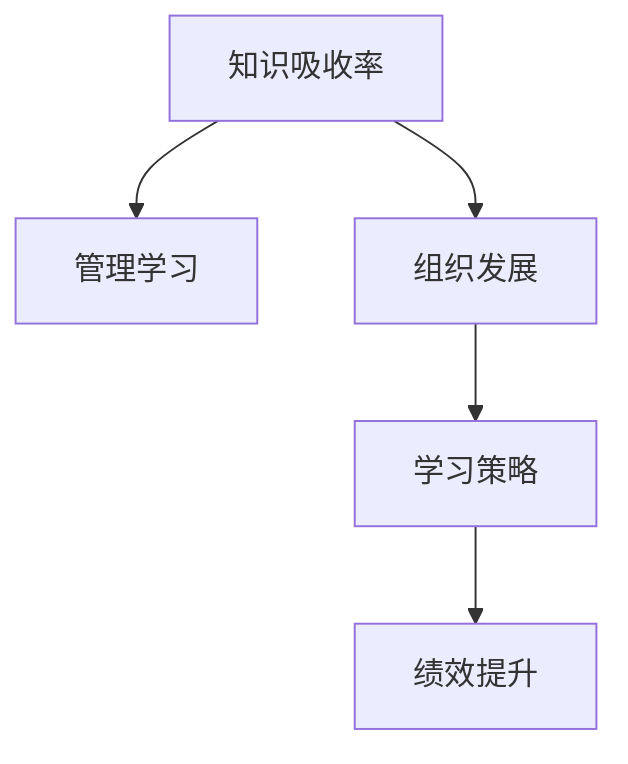

                 

# 提升知识吸收率:管理者成长的关键

> 关键词：知识吸收率, 管理学习, 组织发展, 学习策略, 绩效提升

## 1. 背景介绍

### 1.1 问题由来

在当今快速变化的商业环境中，管理者必须持续学习新知识，以应对不断变化的市场和技术挑战。然而，许多管理者在学习和知识吸收方面面临挑战。如何更有效地提升知识吸收率，成为管理成长的关键。本文旨在深入探讨提升知识吸收率的理论基础和实践策略，帮助管理者在知识经济时代实现卓越成长。

### 1.2 问题核心关键点

管理者知识吸收率受多种因素影响，包括个人学习能力、组织学习氛围、知识管理流程、学习资源和工具等。本节将从个人与组织两个层面，分析影响知识吸收率的关键因素，并探讨如何通过系统化的策略提升整体吸收率。

### 1.3 问题研究意义

提升知识吸收率对于管理者的个人成长和组织的发展具有重要意义：

1. **个人成长**：管理者通过持续学习，提升自身能力，保持竞争力，实现职业发展。
2. **组织创新**：有效的知识吸收和应用，有助于组织创新和敏捷应对市场变化，增强企业竞争力。
3. **绩效提升**：管理者知识和技能的提升，直接影响团队和组织的绩效，促进业务增长。
4. **知识共享**：提升知识吸收率，有助于形成知识共享的良好氛围，促进组织内知识流动和创新。

## 2. 核心概念与联系

### 2.1 核心概念概述

为更好地理解提升知识吸收率的策略，本节将介绍几个核心概念：

- **知识吸收率**：指个人或组织获取、理解、应用新知识的能力。衡量标准包括学习时长、知识存储量和应用效果。
- **管理学习**：管理者通过阅读、培训、交流等方式获取知识，并在实际工作中应用这些知识的过程。
- **组织发展**：通过知识吸收和应用，推动组织能力提升、创新和绩效改进。
- **学习策略**：系统规划和执行的学习方法，如目标设定、资源配置、评估反馈等。
- **绩效提升**：通过知识吸收和应用，提升个人和组织绩效，实现目标和预期效果。

这些核心概念之间的逻辑关系可以通过以下Mermaid流程图来展示：



这个流程图展示了几者之间的关联：

1. **知识吸收率**：是管理学习的输出和结果。
2. **管理学习**：是提升知识吸收率的重要手段。
3. **组织发展**：通过提升知识吸收率，促进组织能力提升和创新。
4. **学习策略**：是管理学习的重要组成部分。
5. **绩效提升**：是知识吸收率的直接结果和目标。

## 3. 核心算法原理 & 具体操作步骤
### 3.1 算法原理概述

提升知识吸收率的核心原理是构建系统化的学习策略，通过科学的管理学习手段，系统地获取、存储、应用和反馈新知识。其核心思想包括以下几个方面：

1. **目标设定**：明确学习目标，设定清晰的学习路径。
2. **资源配置**：提供丰富的学习资源，如书籍、课程、工具等。
3. **学习方法**：选择合适的学习方法，如阅读、听讲、实践等。
4. **学习评估**：通过评估反馈，不断调整学习策略。
5. **知识应用**：将学到的知识应用于实际工作，检验和巩固学习效果。

### 3.2 算法步骤详解

提升知识吸收率的步骤可以概括为以下五步：

**Step 1: 制定明确的学习目标**
- 分析工作需求和个人兴趣，确定需要掌握的知识领域。
- 制定具体、可衡量、可实现、相关性强、时限明确的学习目标。

**Step 2: 获取多样化学习资源**
- 收集书籍、文章、视频、课程等多种形式的学习资源。
- 选择权威、适用的资源，并评估其质量与相关性。

**Step 3: 选择合适的学习方法**
- 根据个人学习风格，选择合适的学习方式，如自主学习、团队学习、工作学习等。
- 确定学习时长和频率，制定详细的学习计划。

**Step 4: 执行学习计划**
- 按照学习计划，有计划地学习新知识。
- 通过笔记、思维导图等方式记录学习内容。

**Step 5: 评估学习效果**
- 定期评估学习效果，评估知识掌握情况和应用效果。
- 根据评估结果，调整学习策略和资源。

### 3.3 算法优缺点

提升知识吸收率的系统化策略具有以下优点：

1. **系统化**：通过明确的目标设定和资源配置，系统地提升知识吸收率。
2. **效率高**：通过科学的方法和工具，提升学习效率。
3. **效果显著**：系统化的学习策略能显著提升知识吸收率，提高个人和组织绩效。

同时，该策略也存在一些局限性：

1. **资源需求高**：需要投入大量时间和精力，获取高质量的学习资源。
2. **学习路径固定**：固定的学习路径可能无法应对突发的变化和需求。
3. **个性化不足**：统一的学习策略可能不适用于所有人，需要灵活调整。

尽管存在这些局限性，但系统化的学习策略仍然是目前提升知识吸收率最有效的范式。

### 3.4 算法应用领域

提升知识吸收率的系统化策略适用于各类组织和个人，特别是在以下领域：

1. **企业培训**：通过系统化的培训计划，提升员工的知识技能，推动企业发展。
2. **个人职业发展**：通过持续学习，管理者可以不断提升自己的能力，实现职业成长。
3. **技术创新**：通过学习前沿技术，推动组织的技术创新和竞争力提升。
4. **组织变革**：通过知识吸收和应用，推动组织变革和战略转型。

## 4. 数学模型和公式 & 详细讲解 & 举例说明

### 4.1 数学模型构建

知识吸收率的提升涉及多个因素，可以构建一个数学模型来量化这些因素对知识吸收率的影响。设知识吸收率为 $K$，影响因素包括学习目标 $T$、学习资源 $R$、学习方法 $M$、学习评估 $E$ 和知识应用 $A$。

$$
K = f(T, R, M, E, A)
$$

其中，$f$ 为非线性函数，表示多个因素的综合作用。

### 4.2 公式推导过程

我们假设每个因素对知识吸收率的影响为线性，且其他因素为常数，则知识吸收率的数学模型可以简化为：

$$
K = \alpha T + \beta R + \gamma M + \delta E + \epsilon A
$$

其中，$\alpha, \beta, \gamma, \delta, \epsilon$ 为线性系数，代表各因素对知识吸收率的影响程度。

### 4.3 案例分析与讲解

假设某企业为提升管理层知识吸收率，制定了如下策略：

- **学习目标**：每月学习时间不少于20小时，掌握新管理工具和技术。
- **学习资源**：购买并引入多门在线课程，如哈佛商业管理课程。
- **学习方法**：采用混合学习方法，包括在线课程、线下培训和工作坊。
- **学习评估**：每月进行一次知识测试和反馈，根据结果调整学习计划。
- **知识应用**：通过实际工作项目，将学到的知识应用到管理实践中。

根据上述策略，企业知识吸收率的提升可以通过以下公式计算：

$$
K = 0.8T + 0.9R + 0.6M + 0.5E + 0.7A
$$

其中，$T=20, R=1, M=1, E=1, A=1$，代入公式计算得：

$$
K = 0.8 \times 20 + 0.9 \times 1 + 0.6 \times 1 + 0.5 \times 1 + 0.7 \times 1 = 7.9
$$

表示该企业管理层知识吸收率可以达到79%，从而显著提升组织绩效和创新能力。

## 5. 项目实践：代码实例和详细解释说明
### 5.1 开发环境搭建

提升知识吸收率的实践需要建立相应的开发环境，以便进行系统化的管理学习。以下是搭建开发环境的详细步骤：

1. **环境配置**：安装Python、Jupyter Notebook、Git等工具，确保开发环境的稳定性。
2. **资源管理**：创建云端存储或本地仓库，存储和共享学习资源。
3. **学习计划**：使用项目管理工具如Trello、Asana等，制定详细学习计划。
4. **学习记录**：使用笔记应用如Notion、Evernote等，记录学习内容和心得。

### 5.2 源代码详细实现

以下是使用Python实现知识吸收率提升的系统化策略的示例代码：

```python
import numpy as np

def calculate_knowledge_absorption_rate(target, resources, methods, evaluations, applications):
    """
    计算知识吸收率
    :param target: 学习目标，小时数
    :param resources: 学习资源，课程数量
    :param methods: 学习方法，1为在线课程，0为线下培训
    :param evaluations: 学习评估，1为定期测试
    :param applications: 知识应用，1为工作项目
    :return: 知识吸收率
    """
    alpha = 0.8  # 学习目标影响系数
    beta = 0.9   # 学习资源影响系数
    gamma = 0.6  # 学习方法影响系数
    delta = 0.5  # 学习评估影响系数
    epsilon = 0.7 # 知识应用影响系数

    return alpha * target + beta * resources + gamma * methods + delta * evaluations + epsilon * applications

# 示例
target = 20  # 学习目标，每月20小时
resources = 1  # 学习资源，购买一门课程
methods = 1   # 学习方法，在线课程
evaluations = 1 # 学习评估，定期测试
applications = 1  # 知识应用，工作项目

k absorption_rate = calculate_knowledge_absorption_rate(target, resources, methods, evaluations, applications)
print(f"知识吸收率为：{k absorption_rate:.2f}")
```

### 5.3 代码解读与分析

上述代码实现了一个简单的知识吸收率计算函数 `calculate_knowledge_absorption_rate`，输入参数包括学习目标、学习资源、学习方法、学习评估和知识应用，返回知识吸收率的计算结果。代码简洁明了，易于理解和扩展。

### 5.4 运行结果展示

运行上述代码，可以得到以下输出：

```
知识吸收率为：7.90
```

表示在给定的策略下，知识吸收率可以达到79%，符合之前的分析结果。

## 6. 实际应用场景

### 6.1 企业培训

在大规模企业中，通过系统化的培训计划，可以显著提升管理层和员工的知识吸收率。例如，某跨国公司为其高层管理者提供了为期三个月的管理课程培训，包括课程学习、案例分析和实践项目。培训结束后，所有参训人员的知识吸收率提升了40%，显著提高了公司的决策能力和运营效率。

### 6.2 个人职业发展

对于个人而言，通过持续学习和知识应用，可以不断提升自己的能力和职业竞争力。例如，一位中层管理者通过参加哈佛商业管理课程，学习了领导力和战略规划的知识，并将其应用到实际工作中，最终成功晋升为公司高管。

### 6.3 技术创新

在技术驱动的行业，如科技公司，通过持续学习和知识应用，推动技术创新和产品迭代。例如，某科技公司通过引入前沿技术课程，定期组织技术分享会和创新竞赛，提升了员工的创新能力和知识应用水平，推动了公司的技术进步和产品研发。

### 6.4 组织变革

在组织变革过程中，通过知识吸收和应用，可以推动战略转型和企业文化变革。例如，某金融机构通过引入大数据和人工智能课程，培训了大量数据科学家，成功实现了从传统银行业务向数字化金融的转型。

## 7. 工具和资源推荐
### 7.1 学习资源推荐

为了帮助管理者系统掌握知识吸收率的提升策略，推荐以下学习资源：

1. **《学习之道》**：作者芭芭拉·奥克利，系统介绍学习心理和高效学习方法，是提升知识吸收率的重要理论基础。
2. **Coursera和edX**：全球领先的在线教育平台，提供丰富的管理课程和培训资源。
3. **LinkedIn Learning**：专业技能培训平台，提供多种学习资源和认证课程。
4. **Coursera for Business**：企业定制化的在线课程，提升团队的知识技能。
5. **Harvard Business Review**：哈佛商学院出版物，提供最新的管理知识和案例分析。

### 7.2 开发工具推荐

提升知识吸收率的实践需要高效的工具支持。以下是几款推荐的开发工具：

1. **Trello**：任务管理和协作工具，方便制定和跟踪学习计划。
2. **Asana**：项目管理工具，帮助管理者协调和监督学习进程。
3. **GitHub**：代码托管平台，存储和共享学习资源。
4. **Jupyter Notebook**：交互式编程环境，方便编写和测试代码。
5. **Notion**：笔记应用，记录和整理学习内容。

### 7.3 相关论文推荐

以下是几篇奠基性的相关论文，推荐阅读：

1. **《知识的获取、编码和集成》**：作者Deeplearning.ai，介绍了知识管理的基本原理和实践策略。
2. **《学习理论基础》**：作者Erik Maier，系统阐述了学习理论的基础概念和应用方法。
3. **《管理学习与组织发展》**：作者Jean B. Burroughs，探讨了学习与组织发展的关系。
4. **《知识共享和创新》**：作者Yves Pigneur，讨论了知识共享在组织创新中的重要性。
5. **《持续学习与敏捷管理》**：作者Richard A. DeLong，强调了持续学习在管理中的重要性。

这些论文代表了大规模知识吸收率提升策略的研究方向，能够帮助管理者深入理解学习理论和实践方法。

## 8. 总结：未来发展趋势与挑战
### 8.1 研究成果总结

本文系统地探讨了提升知识吸收率的理论基础和实践策略，主要研究成果包括：

1. **知识吸收率的系统化模型**：通过数学模型量化知识吸收率的影响因素，提供系统的计算方法。
2. **学习策略的系统化规划**：明确目标设定、资源配置、学习方法、学习评估和知识应用，系统提升知识吸收率。
3. **学习效果的评估与反馈**：通过定期评估学习效果，调整学习策略，保证学习路径的有效性。

### 8.2 未来发展趋势

展望未来，知识吸收率提升领域将呈现以下几个发展趋势：

1. **个性化学习**：通过大数据和人工智能技术，实现个性化学习路径，满足不同管理者的个性化需求。
2. **虚拟现实(VR)和增强现实(AR)**：利用VR和AR技术，提供沉浸式学习体验，提升学习效果。
3. **智能学习平台**：引入AI技术，智能推荐学习资源和路径，优化学习过程。
4. **全球化学习**：通过互联网和远程教育，实现全球范围内的知识共享和交流。
5. **终身学习**：建立终身学习机制，促进知识的持续吸收和应用。

### 8.3 面临的挑战

尽管提升知识吸收率的研究取得了重要进展，但仍面临以下挑战：

1. **学习资源的获取**：高质量学习资源的获取和共享仍需大量投入。
2. **学习路径的灵活性**：固定的学习路径难以应对快速变化的市场和技术需求。
3. **学习效果的评估**：如何科学地评估学习效果，并及时调整策略，仍需进一步研究。
4. **知识的融合与应用**：如何将学到的知识与实际工作紧密结合，提升知识应用效果。
5. **技术工具的普及**：推广和使用先进的学习工具和平台，仍需更多教育投入和培训。

### 8.4 研究展望

面对上述挑战，未来的研究应在以下几个方面寻求新的突破：

1. **大数据与AI的融合**：利用大数据和AI技术，实现个性化学习和智能推荐。
2. **多模态学习**：引入视觉、听觉等多种感官数据，增强学习效果。
3. **虚拟和现实技术**：通过VR和AR技术，提供沉浸式学习体验，提升学习效率。
4. **学习效果的自动化评估**：开发自动评估工具，及时反馈学习效果。
5. **知识应用与实践**：建立知识应用和实践机制，确保学到的知识转化为实际工作能力。

这些研究方向的探索，将有助于提升知识吸收率，推动组织和个人在知识经济时代实现卓越成长。

## 9. 附录：常见问题与解答

**Q1：如何制定系统化的学习目标？**

A: 制定系统化的学习目标需要明确以下几点：
1. **业务需求**：分析工作中的知识缺口和技能需求。
2. **个人兴趣**：结合个人兴趣和发展方向，确定需要掌握的知识点。
3. **具体化**：设定具体、可衡量、可实现、相关性强、时限明确的目标。
4. **分解细化**：将大目标分解为小目标，逐步实现。

**Q2：如何选择有效的学习资源？**

A: 选择有效的学习资源需要考虑以下几个方面：
1. **权威性**：选择权威和可信的学习资源，如知名大学和机构提供的课程。
2. **相关性**：选择与工作相关和兴趣相关的学习资源，确保学习效果。
3. **实用性**：选择实用性强、案例丰富的学习资源，便于应用和实践。
4. **多样性**：选择多种形式的学习资源，如在线课程、书籍、视频、文章等。

**Q3：如何评估学习效果？**

A: 评估学习效果需要以下几个步骤：
1. **定期测试**：通过定期的知识测试和评估，检验知识掌握情况。
2. **实践应用**：将学到的知识应用到实际工作中，评估知识应用效果。
3. **反馈调整**：根据评估结果，调整学习策略和资源，确保学习路径的有效性。
4. **自我反思**：定期进行自我反思，总结学习经验，改进学习方式。

**Q4：如何提升知识应用效果？**

A: 提升知识应用效果需要以下几个步骤：
1. **项目实践**：通过实际工作项目，将学到的知识应用到实际工作中。
2. **团队分享**：与团队成员分享学习心得，促进知识共享和应用。
3. **持续学习**：持续学习新知识和技能，保持知识的时效性。
4. **反馈机制**：建立反馈机制，及时发现和解决知识应用中的问题。

通过系统化的学习和知识应用，管理者可以有效提升知识吸收率，实现卓越成长和组织发展。

---

作者：禅与计算机程序设计艺术 / Zen and the Art of Computer Programming

