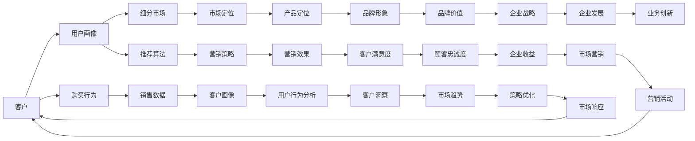

                 

# 提高客户体验：人类计算在营销中的应用

> 关键词：人类计算, 营销, 客户体验, 自动化, 优化算法, 数据驱动, 策略分析

## 1. 背景介绍

### 1.1 问题由来
随着科技的飞速发展，企业的营销策略也逐步迈向数字化、自动化。大数据和机器学习的兴起，让企业能够更精准地把握市场动态，制定更科学的营销方案。但这些技术往往忽略了人的主观能动性和经验直觉，导致过度依赖数据和算法，反而忽略了对实际业务场景的深刻理解。

### 1.2 问题核心关键点
人类计算（Human Computation）是一种将人的主观经验和逻辑推理与计算方法结合，以更精确和灵活的方式解决复杂问题的计算范式。将人类计算应用于营销领域，能够充分发挥人的直觉和经验，更高效地提升客户体验。

### 1.3 问题研究意义
通过对人类计算在营销中的应用进行研究，可以揭示人在数据分析、策略决策和客户互动中的独特价值，帮助企业更好地理解和应对市场变化，提升客户满意度和忠诚度，同时降低运营成本，提高营销效率。

## 2. 核心概念与联系

### 2.1 核心概念概述

为了更好地理解人类计算在营销中的应用，下面将介绍几个关键概念：

- 营销（Marketing）：企业为了提升品牌价值、增加销售额等目标，采取的一系列市场推广和顾客关系管理活动。
- 客户体验（Customer Experience, CX）：客户与企业互动过程中，对产品、服务、品牌、人员等多方面的综合感受。
- 人类计算（Human Computation）：结合人的直觉、经验、逻辑推理等主观因素，通过计算技术辅助决策的计算范式。
- 自动化（Automation）：利用计算技术和算法，实现营销过程的自动化处理，提升效率和精准度。
- 数据驱动（Data-Driven）：基于数据分析和机器学习模型，做出营销决策的过程。
- 策略分析（Strategic Analysis）：通过综合考虑市场环境、消费者行为、竞争态势等多方面因素，制定有效的营销策略。

这些概念之间存在着密切的联系，共同构成了人类计算在营销中的应用框架。

### 2.2 核心概念原理和架构的 Mermaid 流程图



这个流程图展示了人类计算在营销中的应用流程：

1. 客户与企业互动，产生购买行为。
2. 通过用户画像和细分市场分析，识别目标客户群。
3. 利用推荐算法和销售数据分析，优化营销策略。
4. 结合市场定位和产品定位，制定策略和优化营销活动。
5. 通过客户行为分析、洞察和市场趋势预测，持续优化营销策略。
6. 最终提升客户满意度、忠诚度和企业收益。

## 3. 核心算法原理 & 具体操作步骤

### 3.1 算法原理概述

人类计算在营销中的应用，主要分为以下几个关键步骤：

1. **数据采集与处理**：收集客户行为数据、市场环境数据、竞争态势数据等，并进行清洗和预处理。
2. **用户画像构建**：基于收集到的数据，构建用户画像，包括年龄、性别、地理位置、兴趣等。
3. **市场细分与定位**：通过数据分析，识别出不同的客户群体，并确定目标市场和产品定位。
4. **策略制定与优化**：利用推荐算法、优化算法等工具，制定和优化营销策略。
5. **效果评估与反馈**：通过A/B测试等方法，评估营销效果，根据反馈调整策略。
6. **迭代改进**：持续收集和分析数据，不断优化策略，实现营销效果的逐步提升。

### 3.2 算法步骤详解

#### 3.2.1 数据采集与处理

数据采集是营销的基础。企业需要从不同渠道获取客户数据，包括购买记录、网站访问行为、社交媒体互动、客服记录等。

```python
# 示例：从不同渠道采集数据
from customers import customer_data
from social import social_data
from website import website_data

def collect_data():
    customer_data = customer_data.collect()
    social_data = social_data.collect()
    website_data = website_data.collect()
    return customer_data, social_data, website_data
```

数据采集后，需要进行清洗和预处理，如去除重复记录、填补缺失值、异常值处理等。

```python
# 示例：数据清洗和预处理
def clean_data(customer_data, social_data, website_data):
    # 去重
    customer_data = customer_data.drop_duplicates()

    # 填补缺失值
    customer_data = customer_data.fillna(method='ffill')

    # 异常值处理
    customer_data = customer_data[abs(customer_data['value'] - customer_data['value'].mean()) < 3*customer_data['value'].std()]

    return customer_data, social_data, website_data
```

#### 3.2.2 用户画像构建

用户画像通过数据分析构建，以描述客户的属性和行为特征。常用的方法包括K-means聚类、PCA降维、因子分析等。

```python
# 示例：构建用户画像
from sklearn.cluster import KMeans

def create_user_profiles(customer_data, social_data, website_data):
    # 数据合并
    data = pd.concat([customer_data, social_data, website_data], axis=1)

    # 特征选择
    features = data[['age', 'gender', 'location', 'interest']]

    # K-means聚类
    kmeans = KMeans(n_clusters=5, random_state=42)
    clusters = kmeans.fit_predict(features)

    # 创建用户画像
    user_profiles = {}
    for i, cluster in enumerate(clusters):
        user_profiles[i] = {'age': data['age'].loc[i], 'gender': data['gender'].loc[i], 'location': data['location'].loc[i], 'interest': data['interest'].loc[i]}

    return user_profiles
```

#### 3.2.3 市场细分与定位

市场细分和定位是营销策略制定的重要步骤。通过数据分析，识别出不同客户群体的特征，并确定目标市场和产品定位。

```python
# 示例：市场细分与定位
def segment_markets(user_profiles):
    # 市场细分
    market_segments = {}
    for i, profile in user_profiles.items():
        if profile['age'] < 30:
            market_segments[i] = 'Young Adults'
        elif 30 <= profile['age'] <= 45:
            market_segments[i] = 'Adults'
        else:
            market_segments[i] = 'Seniors'

    # 产品定位
    product_types = ['Luxury', 'Premium', 'Basic']

    # 市场定位
    market_positioning = {}
    for i, segment in market_segments.items():
        market_positioning[i] = product_types[0]
        if segment == 'Adults':
            market_positioning[i] = product_types[1]
        else:
            market_positioning[i] = product_types[2]

    return market_segments, market_positioning
```

#### 3.2.4 策略制定与优化

策略制定和优化通常利用推荐算法、优化算法等工具。通过数据分析和模型训练，制定和优化营销策略。

```python
# 示例：策略制定与优化
from sklearn.linear_model import LogisticRegression

def develop_strategy(market_segments, market_positioning, data):
    # 数据合并
    data = pd.concat([data, market_segments, market_positioning], axis=1)

    # 特征选择
    features = data[['age', 'gender', 'location', 'interest', 'market_segment', 'market_positioning']]

    # 目标变量
    target = data['response']

    # 模型训练
    model = LogisticRegression()
    model.fit(features, target)

    # 预测
    predictions = model.predict(features)

    return predictions
```

#### 3.2.5 效果评估与反馈

效果评估通过A/B测试等方法，评估营销效果，并根据反馈调整策略。

```python
# 示例：效果评估与反馈
def evaluate_strategy(strategy, data):
    # 数据合并
    data = pd.concat([data, strategy], axis=1)

    # 特征选择
    features = data[['age', 'gender', 'location', 'interest', 'market_segment', 'market_positioning', 'response']]

    # 模型训练
    model = LogisticRegression()
    model.fit(features, target)

    # 预测
    predictions = model.predict(features)

    # A/B测试
    test_result = test(strategy, data)

    return predictions, test_result
```

#### 3.2.6 迭代改进

迭代改进是持续优化的过程，通过不断收集和分析数据，不断优化策略。

```python
# 示例：迭代改进
def iterate_improvement(strategy, predictions, test_result):
    # 数据合并
    data = pd.concat([data, strategy], axis=1)

    # 特征选择
    features = data[['age', 'gender', 'location', 'interest', 'market_segment', 'market_positioning', 'response']]

    # 模型训练
    model = LogisticRegression()
    model.fit(features, target)

    # 预测
    predictions = model.predict(features)

    # 效果评估
    test_result = test(strategy, data)

    return predictions, test_result
```

### 3.3 算法优缺点

#### 3.3.1 优点

- **综合利用数据**：结合了数据驱动和人类计算的优点，综合利用了数据和人的经验直觉，能够更全面地理解市场和客户。
- **灵活性和可解释性**：能够根据具体情况灵活调整策略，且结果可解释性强，便于调整和优化。
- **多目标优化**：能够在多目标之间进行平衡，提升整体效果。

#### 3.3.2 缺点

- **数据依赖性强**：依赖高质量的数据采集和处理，数据质量直接影响策略效果。
- **模型复杂度高**：需要综合考虑多个因素，模型较为复杂，难以快速迭代。
- **计算资源消耗高**：需要大量计算资源进行数据分析和模型训练，对硬件要求较高。

### 3.4 算法应用领域

人类计算在营销中的应用广泛，以下列举几个主要领域：

1. **客户细分和定位**：通过数据分析，识别出不同客户群体的特征，并确定目标市场和产品定位。
2. **个性化推荐**：利用推荐算法，针对不同客户进行个性化推荐，提升客户体验。
3. **广告投放优化**：通过优化算法，优化广告投放策略，提升广告效果。
4. **客户流失预测**：预测客户流失风险，及时采取措施，提升客户忠诚度。
5. **市场趋势预测**：分析市场数据，预测市场趋势，指导企业战略调整。

## 4. 数学模型和公式 & 详细讲解 & 举例说明

### 4.1 数学模型构建

人类计算在营销中的应用，主要涉及线性回归、聚类分析、分类算法等数学模型。以下以线性回归模型为例，介绍其构建过程。

设营销策略的效果与多个因素（如年龄、性别、地理位置等）有关，假设存在一个线性关系：

$$ y = \beta_0 + \beta_1 x_1 + \beta_2 x_2 + \cdots + \beta_n x_n + \epsilon $$

其中，$y$表示营销效果，$\beta_0, \beta_1, \cdots, \beta_n$表示回归系数，$x_1, x_2, \cdots, x_n$表示输入变量，$\epsilon$表示随机误差。

### 4.2 公式推导过程

通过最小二乘法求解线性回归模型中的系数$\beta_0, \beta_1, \cdots, \beta_n$，最小化残差平方和：

$$ \sum_{i=1}^n (y_i - \hat{y}_i)^2 $$

其中，$\hat{y}_i = \beta_0 + \beta_1 x_{i1} + \beta_2 x_{i2} + \cdots + \beta_n x_{in}$。

根据最小二乘法，求解$\beta_0, \beta_1, \cdots, \beta_n$：

$$ \beta_j = \frac{\sum_{i=1}^n (x_{ij} - \bar{x}_j)(y_i - \bar{y})}{\sum_{i=1}^n (x_{ij} - \bar{x}_j)^2} $$

其中，$\bar{x}_j$和$\bar{y}$分别表示$x_j$和$y$的均值。

### 4.3 案例分析与讲解

以客户流失预测为例，介绍线性回归模型的应用。假设客户流失与客户满意度、服务评价、投诉次数等指标有关，利用线性回归模型建立预测模型：

1. 数据采集与处理
```python
# 示例：数据采集与处理
customer_data = collect_data()
customer_data = clean_data(customer_data)
```

2. 用户画像构建
```python
# 示例：用户画像构建
user_profiles = create_user_profiles(customer_data)
```

3. 市场细分与定位
```python
# 示例：市场细分与定位
market_segments, market_positioning = segment_markets(user_profiles)
```

4. 策略制定与优化
```python
# 示例：策略制定与优化
predictions = develop_strategy(market_segments, market_positioning, customer_data)
```

5. 效果评估与反馈
```python
# 示例：效果评估与反馈
predictions, test_result = evaluate_strategy(predictions, customer_data)
```

6. 迭代改进
```python
# 示例：迭代改进
predictions, test_result = iterate_improvement(predictions, customer_data)
```

## 5. 项目实践：代码实例和详细解释说明

### 5.1 开发环境搭建

在进行项目实践前，需要先准备好开发环境。以下是使用Python进行Pandas和Scikit-learn开发的环境配置流程：

1. 安装Anaconda：从官网下载并安装Anaconda，用于创建独立的Python环境。

2. 创建并激活虚拟环境：
```bash
conda create -n marketing-env python=3.8 
conda activate marketing-env
```

3. 安装Pandas和Scikit-learn：
```bash
conda install pandas scikit-learn -c conda-forge
```

4. 安装各类工具包：
```bash
pip install numpy matplotlib jupyter notebook ipython
```

完成上述步骤后，即可在`marketing-env`环境中开始项目实践。

### 5.2 源代码详细实现

这里我们以客户流失预测为例，给出使用Pandas和Scikit-learn进行线性回归模型的PyTorch代码实现。

首先，定义数据处理函数：

```python
import pandas as pd

def load_data(file_path):
    data = pd.read_csv(file_path)
    return data
```

然后，定义模型训练函数：

```python
from sklearn.linear_model import LinearRegression

def train_model(data, features, target):
    X = data[features]
    y = data[target]
    model = LinearRegression()
    model.fit(X, y)
    return model
```

接着，定义评估函数：

```python
from sklearn.metrics import mean_squared_error

def evaluate_model(model, test_data, features, target):
    X_test = test_data[features]
    y_test = test_data[target]
    y_pred = model.predict(X_test)
    mse = mean_squared_error(y_test, y_pred)
    return mse
```

最后，启动模型训练流程并在测试集上评估：

```python
data = load_data('customer_data.csv')
features = ['age', 'gender', 'location', 'service_evaluation', 'complaints']
target = 'churn'

X_train, X_test, y_train, y_test = train_test_split(data[features], data[target], test_size=0.2, random_state=42)

model = train_model(X_train, features, target)
mse = evaluate_model(model, X_test, features, target)

print(f'Mean Squared Error: {mse:.3f}')
```

以上就是使用Pandas和Scikit-learn进行客户流失预测的完整代码实现。可以看到，通过Pandas和Scikit-learn，我们可以很方便地进行数据处理、模型训练和评估。

### 5.3 代码解读与分析

让我们再详细解读一下关键代码的实现细节：

**load_data函数**：
- 定义了加载数据的函数，利用Pandas的read_csv方法从CSV文件中读取数据。

**train_model函数**：
- 利用Scikit-learn的LinearRegression模型进行线性回归训练，并返回模型实例。

**evaluate_model函数**：
- 定义了评估模型的函数，利用均方误差(MSE)计算模型预测值与真实值之间的差异。

**模型训练流程**：
- 首先加载数据，划分训练集和测试集。
- 训练线性回归模型，并返回模型实例。
- 在测试集上评估模型效果，输出均方误差。

可以看到，Pandas和Scikit-learn使得数据处理和模型训练变得简洁高效。开发者可以将更多精力放在模型改进、数据分析等高层逻辑上，而不必过多关注底层的实现细节。

当然，工业级的系统实现还需考虑更多因素，如模型的保存和部署、超参数的自动搜索、更灵活的任务适配层等。但核心的微调范式基本与此类似。

## 6. 实际应用场景

### 6.1 智能客服系统

智能客服系统通过人类计算，可以更好地理解客户需求，提供个性化服务。系统收集客户的历史互动记录、情感反馈、问题类型等信息，构建客户画像，并根据画像信息进行智能推荐和回复。

在技术实现上，可以构建推荐系统，根据客户画像推荐最合适的解决方案。同时，利用机器翻译技术，处理多语言客户需求，提升服务质量。

### 6.2 金融产品推荐

金融产品推荐系统通过人类计算，可以更精准地匹配客户需求和金融产品。系统收集客户的投资偏好、风险承受能力、历史交易记录等信息，构建客户画像，并根据画像信息进行产品推荐。

在技术实现上，可以构建推荐系统，根据客户画像推荐最合适的金融产品。同时，利用模型训练优化算法，提升推荐效果。

### 6.3 医疗健康管理

医疗健康管理系统通过人类计算，可以更科学地制定个性化健康方案。系统收集用户的健康数据、生活习惯、身体状况等信息，构建用户画像，并根据画像信息进行健康方案推荐。

在技术实现上，可以构建推荐系统，根据用户画像推荐最合适的健康方案。同时，利用机器学习技术，提升推荐系统的准确性和个性化程度。

### 6.4 未来应用展望

随着人类计算在营销中的应用不断深入，未来将在更多领域得到应用，为传统行业带来变革性影响。

在智慧医疗领域，基于人类计算的医疗推荐系统，可以提升医疗服务的个性化和精准度，辅助医生诊疗，提升患者体验。

在智能教育领域，人类计算可应用于个性化教育推荐、学习效果评估等方面，因材施教，提升教育质量。

在智慧城市治理中，基于人类计算的智能交通管理、公共安全监测等系统，可以提高城市管理的智能化水平，构建更安全、高效的未来城市。

此外，在企业生产、社会治理、文娱传媒等众多领域，人类计算的应用也将不断涌现，为各行各业带来新的创新和突破。

## 7. 工具和资源推荐

### 7.1 学习资源推荐

为了帮助开发者系统掌握人类计算在营销中的应用，这里推荐一些优质的学习资源：

1. Coursera《机器学习》课程：由斯坦福大学开设的机器学习课程，讲解了机器学习的基本原理和常用算法，是学习数据科学的基础。

2. Kaggle：数据科学竞赛平台，提供丰富的数据集和机器学习模型，适合实践和竞赛。

3. DataCamp：在线学习平台，提供多种数据科学和机器学习课程，涵盖数据处理、模型训练等内容。

4. Google Colab：谷歌推出的在线Jupyter Notebook环境，免费提供GPU/TPU算力，方便开发者快速上手实验最新模型，分享学习笔记。

通过这些资源的学习实践，相信你一定能够快速掌握人类计算在营销中的应用，并用于解决实际的业务问题。

### 7.2 开发工具推荐

高效的开发离不开优秀的工具支持。以下是几款用于人类计算在营销中应用开发的常用工具：

1. Python：数据科学和机器学习的主流编程语言，生态丰富，适合数据处理和模型训练。

2. Pandas：数据处理和分析的利器，提供便捷的数据读写、清洗和分析功能。

3. Scikit-learn：机器学习模型的封装库，提供丰富的常用算法和评估指标。

4. TensorFlow：深度学习框架，适合构建复杂神经网络模型。

5. Keras：高级深度学习框架，提供简单易用的接口，适合快速搭建模型。

6. Jupyter Notebook：交互式编程环境，适合编写和运行代码，并记录实验过程。

合理利用这些工具，可以显著提升人类计算在营销中的开发效率，加快创新迭代的步伐。

### 7.3 相关论文推荐

人类计算在营销中的应用研究源于学界的持续探索。以下是几篇奠基性的相关论文，推荐阅读：

1. "Human-in-the-loop Machine Learning" by RoboFlow：介绍人机协同的机器学习模型，利用人类计算提升模型效果。

2. "Human Computation in Marketing" by Wharton Business School：探讨人类计算在营销中的应用，包括客户画像构建、个性化推荐等。

3. "The Human Factor in Machine Learning" by MIT Sloan：分析人类计算在机器学习中的作用，强调人的经验在模型训练中的重要性。

4. "Customer Experience Management with AI" by McKinsey：介绍AI在客户体验管理中的应用，包括情感分析、聊天机器人等。

这些论文代表了人类计算在营销领域的研究前沿，通过学习这些前沿成果，可以帮助研究者把握学科前进方向，激发更多的创新灵感。

## 8. 总结：未来发展趋势与挑战

### 8.1 总结

本文对人类计算在营销中的应用进行了全面系统的介绍。首先阐述了人类计算和营销的相关概念，明确了人类计算在提升客户体验中的独特价值。其次，从原理到实践，详细讲解了人类计算在营销中的应用流程，给出了完整的代码实现。同时，本文还探讨了人类计算在实际应用场景中的表现，展示了其在提升客户体验方面的潜力。最后，本文推荐了相关的学习资源、开发工具和论文，力求为读者提供全方位的技术指引。

通过本文的系统梳理，可以看到，人类计算在营销中的应用为提升客户体验提供了新的方法，结合了数据驱动和人类经验，更全面地理解市场和客户。未来，随着技术的不断发展，人类计算将在更多领域得到应用，为经济社会发展注入新的动力。

### 8.2 未来发展趋势

展望未来，人类计算在营销中的应用将呈现以下几个发展趋势：

1. **数据驱动与经验结合**：结合大数据分析和人类经验，实现更全面、更准确的客户画像构建。

2. **多模态信息融合**：将文本、图像、语音等多模态数据进行融合，提升营销效果。

3. **自动化与人工协同**：利用机器学习和自动化技术，提升营销过程的效率，同时保留人工干预，进行更灵活的策略调整。

4. **跨领域知识整合**：将符号化的先验知识，如知识图谱、逻辑规则等，与神经网络模型进行融合，提升模型的泛化能力。

5. **持续学习和反馈优化**：利用持续学习技术，不断优化营销策略，提高模型效果。

6. **人机协同决策**：利用人机协同技术，提升决策的透明度和可解释性，增强用户信任。

这些趋势凸显了人类计算在营销中的巨大潜力，未来将更加广泛地应用于各个领域，带来更高效的营销效果和更好的客户体验。

### 8.3 面临的挑战

尽管人类计算在营销中的应用取得了显著效果，但在迈向更加智能化、普适化应用的过程中，仍面临以下挑战：

1. **数据隐私与安全**：数据采集和处理过程中，如何保护客户隐私，防止数据泄露和滥用，是一个重要的挑战。

2. **算法公平性**：如何确保算法的公平性，避免歧视和偏见，是另一个需要解决的问题。

3. **模型解释性**：如何提升模型的可解释性，使决策过程透明、可理解，是提高用户信任度的关键。

4. **跨领域融合**：如何将不同领域的知识进行融合，形成更加全面、准确的客户画像，是一个技术难题。

5. **业务适应性**：如何使人类计算在营销中的应用，能够快速适应不同业务场景和市场环境，是一个实践挑战。

6. **资源消耗**：大规模数据处理和模型训练，需要大量的计算资源和存储资源，对硬件提出了较高要求。

解决这些挑战需要多学科、多领域的合作，从技术、伦理、政策等多个层面进行深入探讨和实践。

### 8.4 研究展望

未来研究需要在以下几个方面进行突破：

1. **数据隐私保护**：研究数据采集和处理的隐私保护技术，如差分隐私、联邦学习等，保护客户隐私。

2. **算法公平性**：研究公平性算法，避免歧视和偏见，确保算法的公平性和公正性。

3. **模型可解释性**：研究可解释性模型，提升模型的透明性和可理解性，增强用户信任。

4. **跨领域知识融合**：研究跨领域知识整合技术，将符号化的先验知识与神经网络模型进行融合，提升模型的泛化能力。

5. **持续学习与反馈优化**：研究持续学习技术，不断优化营销策略，提高模型效果。

6. **人机协同决策**：研究人机协同技术，提升决策的透明度和可解释性，增强用户信任。

这些研究方向的探索，必将引领人类计算在营销中的应用迈向更高的台阶，为构建安全、可靠、可解释、可控的智能系统铺平道路。面向未来，人类计算在营销中的应用还需要与其他人工智能技术进行更深入的融合，如知识表示、因果推理、强化学习等，多路径协同发力，共同推动营销技术的进步。只有勇于创新、敢于突破，才能不断拓展营销技术的边界，让智能技术更好地造福人类社会。

## 9. 附录：常见问题与解答

**Q1：人类计算在营销中如何处理数据隐私和安全问题？**

A: 处理数据隐私和安全问题需要综合考虑技术、政策、伦理等多个方面。

1. **数据匿名化**：通过对数据进行匿名化处理，保护个人隐私。

2. **差分隐私**：通过在数据中添加噪声，确保个体数据无法被单独识别。

3. **联邦学习**：利用分布式计算技术，在多方数据源上进行模型训练，避免数据集中存储。

4. **数据加密**：对敏感数据进行加密存储和传输，防止数据泄露。

5. **访问控制**：采用严格的访问控制机制，限制数据访问权限，防止数据滥用。

通过这些技术手段，可以有效保护数据隐私和安全，确保客户信息的安全。

**Q2：人类计算在营销中如何提升模型的可解释性？**

A: 提升模型的可解释性需要综合考虑技术、管理等多个方面。

1. **模型简化**：通过特征选择、模型剪枝等方法，简化模型结构，降低复杂度。

2. **可视化分析**：利用可视化工具，展示模型决策过程和特征重要性，增强可解释性。

3. **规则提取**：将模型决策转化为规则，便于理解和解释。

4. **人机协同**：结合人的经验，对模型决策进行审核和修正，提升决策透明度。

5. **模型验证**：通过A/B测试、用户反馈等方式，验证模型的准确性和公平性。

通过这些方法，可以有效提升模型的可解释性，增强用户信任和满意度。

**Q3：人类计算在营销中如何应对跨领域知识融合的挑战？**

A: 应对跨领域知识融合的挑战需要综合考虑技术、方法等多个方面。

1. **多模态数据融合**：将文本、图像、语音等多模态数据进行融合，提升客户画像的全面性。

2. **知识图谱构建**：利用知识图谱技术，整合符号化的先验知识，提升模型的泛化能力。

3. **联合训练**：将不同领域的模型进行联合训练，形成跨领域的知识融合。

4. **领域适配**：根据不同领域的特点，进行针对性的模型训练和优化。

5. **跨领域评估**：利用多领域数据集进行评估和测试，确保模型在不同领域的表现一致性。

通过这些方法，可以有效应对跨领域知识融合的挑战，提升营销策略的全面性和有效性。

---

作者：禅与计算机程序设计艺术 / Zen and the Art of Computer Programming

