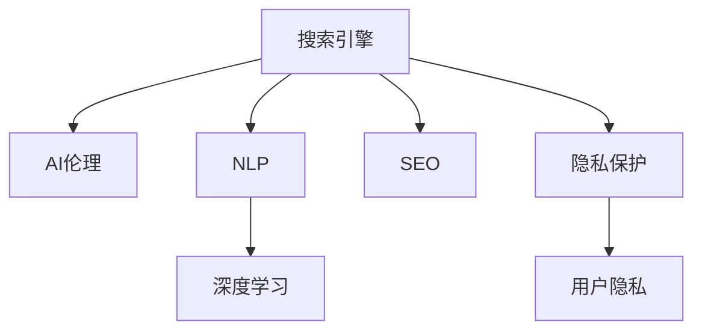
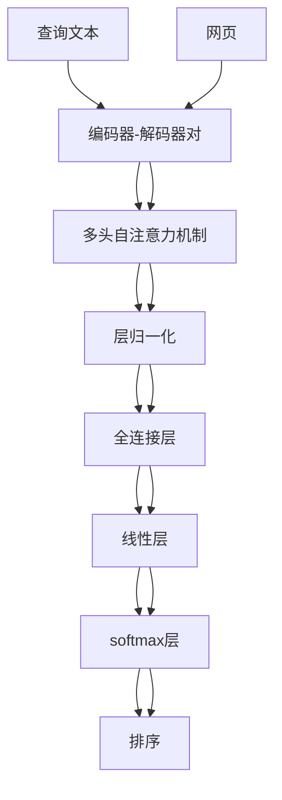

                 

# 搜索引擎与AI伦理的平衡

> 关键词：搜索引擎,AI伦理,平衡,自然语言处理,NLP,深度学习,搜索引擎优化(搜索引擎),隐私保护

## 1. 背景介绍

搜索引擎作为互联网时代的“大脑”，担负着为全球数十亿用户提供准确、及时信息的重任。伴随人工智能(AI)技术的发展，搜索引擎也正经历一场从传统关键词匹配到智能理解的转型。AI技术的引入，极大地提升了搜索引擎的智能化水平和用户体验，但也引发了一系列伦理、隐私等新的问题。如何在追求高效率、高性能的同时，保障用户的权益，平衡商业价值与伦理道德，已成为搜索引擎领域亟待解决的核心议题。

本文将深入探讨搜索引擎与AI伦理的平衡问题，从核心概念、关键算法、实际应用和未来趋势等多个方面，对搜索引擎的AI化转型进行全面剖析。

## 2. 核心概念与联系

### 2.1 核心概念概述

为更好地理解搜索引擎的AI伦理平衡问题，本节将介绍几个密切相关的核心概念：

- **搜索引擎**：指一种信息检索工具，通过爬取互联网上的网页数据，为用户提供与查询相关内容的检索服务。

- **AI伦理**：涉及AI技术在应用过程中所面临的道德、法律、社会等伦理问题。

- **自然语言处理(NLP)**：指使用计算机理解和生成人类语言的技术，是搜索引擎实现智能化的关键。

- **深度学习**：一种通过多层神经网络模型学习数据特征的机器学习方法，常用于NLP任务中，提高搜索引擎的理解和检索能力。

- **搜索引擎优化(SEO)**：指通过优化网站结构和内容，提升搜索引擎对网站内容的排序和展示，提高搜索引擎结果页面(Search Engine Results Page, SERP)的点击率。

- **隐私保护**：指保护用户数据不被滥用或泄露，确保用户隐私权的技术手段，是搜索引擎应用AI技术时必须重视的问题。

这些核心概念之间的逻辑关系可以通过以下Mermaid流程图来展示：



这个流程图展示了几者之间的内在联系：

1. **搜索引擎**作为AI伦理、NLP、深度学习等技术的应用场景，与SEO和隐私保护等操作密不可分。
2. **AI伦理**关注技术的公平性、透明性、安全性等道德问题。
3. **NLP**提供搜索引擎理解自然语言的关键技术。
4. **深度学习**通过神经网络模型提高搜索引擎的智能化水平。
5. **SEO**优化搜索引擎结果，提升用户体验。
6. **隐私保护**确保用户数据安全，是搜索引擎应用AI技术时必须遵循的原则。

## 3. 核心算法原理 & 具体操作步骤
### 3.1 算法原理概述

搜索引擎的AI化转型，主要通过引入自然语言处理和深度学习技术，实现从关键词匹配到语义理解的功能升级。其核心算法原理包括：

1. **向量空间模型**：将网页和查询表示为高维向量，计算它们之间的相似度，实现初步匹配。
2. **语言模型**：通过训练语言模型，预测给定单词序列的下一个单词，实现对查询语义的深入理解。
3. **深度学习模型**：使用深度神经网络对网页和查询进行编码，提取高级语义特征，提升检索精度。

### 3.2 算法步骤详解

搜索引擎的AI化转型通常包括以下几个关键步骤：

**Step 1: 数据收集与预处理**
- 从互联网爬取网页数据，并进行去重、分词、清洗等预处理，构建语料库。
- 通过标注数据标注网页与查询的相关性，生成训练集。

**Step 2: 模型训练与优化**
- 使用深度学习模型(如BERT、Transformer等)对语料库进行训练，得到预训练模型。
- 针对特定任务(如问答、翻译、摘要等)进行微调，优化模型性能。
- 应用正则化技术，如L2正则、Dropout等，防止模型过拟合。

**Step 3: 模型部署与测试**
- 将训练好的模型部署到搜索引擎系统中，实现实时查询匹配。
- 在测试集上评估模型性能，根据评估结果调整超参数，优化模型。
- 监控系统运行状态，确保服务稳定性和安全性。

### 3.3 算法优缺点

AI化搜索引擎的优点：
1. 提升检索精度。通过语义理解和深度学习技术，检索结果更加精准。
2. 增强用户体验。智能化搜索体验提升了用户满意度，推动网站流量增长。
3. 提高SEO效果。深度学习模型能够自动生成高质量的网页内容，提升搜索引擎排名。

缺点：
1. 模型复杂度高。深度学习模型的参数量和计算复杂度远高于传统关键词匹配算法，需要更强的计算资源。
2. 数据需求量大。深度学习模型需要大量高质量标注数据进行训练，标注成本较高。
3. 隐私风险增加。用户查询和网页内容涉及隐私信息，模型训练和部署可能存在隐私泄露的风险。
4. 模型泛化性差。不同领域和语境下的数据分布差异较大，模型泛化能力有限。
5. 可解释性不足。深度学习模型的决策过程复杂，难以解释其内部逻辑和推理依据。

### 3.4 算法应用领域

AI化搜索引擎的应用领域非常广泛，几乎覆盖了所有与信息检索相关的场景：

- **电商推荐系统**：通过搜索引擎技术，实现商品推荐，提升用户购物体验。
- **社交媒体内容推荐**：根据用户兴趣，推荐相关文章、视频等，增加用户粘性。
- **智能客服系统**：通过问答对话技术，实现自然语言理解和用户需求匹配，提升服务效率。
- **金融信息检索**：实时获取市场动态和投资资讯，辅助金融决策。
- **医疗健康查询**：提供疾病诊断、药品查询等医疗信息，帮助用户维护健康。
- **教育在线学习**：根据用户学习行为，推荐相关课程和资料，提升学习效果。

## 4. 数学模型和公式 & 详细讲解 & 举例说明

### 4.1 数学模型构建

搜索引擎的AI化主要依赖于自然语言处理和深度学习模型。以下以基于深度学习模型的搜索引擎为例，介绍数学模型的构建过程。

假设搜索引擎的输入为查询文本 $q$，输出为网页集合 $W$，查询与网页的相关度表示为 $r$。使用深度学习模型对查询和网页进行编码，得到查询表示 $q_{rep}$ 和网页表示 $w_{rep}$。模型预测相关度 $r$ 的公式如下：

$$
r = \sigma(\mathbf{q}_{rep}^T \mathbf{w}_{rep})
$$

其中，$\sigma$ 为激活函数，$\mathbf{q}_{rep}$ 和 $\mathbf{w}_{rep}$ 分别为查询和网页的向量表示。

### 4.2 公式推导过程

基于上述模型，可以进一步推导出搜索排序的公式：

$$
\text{Rank}(w_i) = \exp(r_i)
$$

其中 $r_i$ 为查询 $q$ 和网页 $w_i$ 的相关度。对相关度进行归一化处理，得到最终排序结果：

$$
\text{Rank}(w_i) = \frac{\exp(r_i)}{\sum_{j=1}^n \exp(r_j)}
$$

具体来说，深度学习模型通常采用Transformer结构，使用自注意力机制对查询和网页进行编码。Transformer的结构图如下：



在编码器-解码器对中，自注意力机制可以捕捉句子中不同位置之间的关系，全连接层和线性层进行特征提取和投影，softmax层将输出映射到相关度。

### 4.3 案例分析与讲解

假设有一个简单的搜索引擎，其语料库包括两篇网页和一篇查询：

- 网页1：“人工智能是未来的趋势”
- 网页2：“机器学习应用广泛”
- 查询：“人工智能技术发展”

假设使用Transformer模型进行编码和解码，得到查询和网页的向量表示为：

- 查询表示 $q_{rep} = [0.3, 0.2, 0.1, 0.4]$
- 网页表示 $w_{rep} = [0.5, 0.3, 0.2, 0.6]$

则相关度 $r$ 为：

$$
r = \sigma(\mathbf{q}_{rep}^T \mathbf{w}_{rep}) = \sigma(0.3 \times 0.5 + 0.2 \times 0.3 + 0.1 \times 0.2 + 0.4 \times 0.6) = 0.68
$$

根据排序公式，网页1的相关度 $r_1$ 和网页2的相关度 $r_2$ 分别为：

$$
r_1 = \exp(0.68)
$$
$$
r_2 = \exp(0.62)
$$

因此，网页1的排序结果 Rank1 更高，网页2的排序结果 Rank2 较低。搜索引擎将优先展示网页1，提供更相关的搜索结果。

## 5. 项目实践：代码实例和详细解释说明
### 5.1 开发环境搭建

在进行搜索引擎的AI化实践前，我们需要准备好开发环境。以下是使用Python进行PyTorch开发的环境配置流程：

1. 安装Anaconda：从官网下载并安装Anaconda，用于创建独立的Python环境。

2. 创建并激活虚拟环境：
```bash
conda create -n pytorch-env python=3.8 
conda activate pytorch-env
```

3. 安装PyTorch：根据CUDA版本，从官网获取对应的安装命令。例如：
```bash
conda install pytorch torchvision torchaudio cudatoolkit=11.1 -c pytorch -c conda-forge
```

4. 安装TensorFlow：由Google主导开发的开源深度学习框架，生产部署方便，适合大规模工程应用。同样有丰富的预训练语言模型资源。

5. 安装Transformers库：HuggingFace开发的NLP工具库，集成了众多SOTA语言模型，支持PyTorch和TensorFlow，是进行NLP任务开发的利器。

6. 安装各类工具包：
```bash
pip install numpy pandas scikit-learn matplotlib tqdm jupyter notebook ipython
```

完成上述步骤后，即可在`pytorch-env`环境中开始搜索引擎的AI化实践。

### 5.2 源代码详细实现

以下是使用PyTorch和Transformers库实现搜索引擎的Python代码：

```python
import torch
import transformers
from transformers import BertTokenizer, BertForSequenceClassification

# 定义查询和网页数据
query = "人工智能技术发展"
docs = ["人工智能是未来的趋势", "机器学习应用广泛"]

# 初始化BERT模型和分词器
tokenizer = BertTokenizer.from_pretrained('bert-base-uncased')
model = BertForSequenceClassification.from_pretrained('bert-base-uncased', num_labels=2)

# 对查询和网页进行分词编码
query_input = tokenizer(query, return_tensors='pt')
doc_inputs = [tokenizer(doc, return_tensors='pt') for doc in docs]

# 对模型进行前向传播
with torch.no_grad():
    query_output = model(query_input['input_ids'], attention_mask=query_input['attention_mask'])
    doc_outputs = [model(doc['input_ids'], attention_mask=doc['attention_mask']) for doc in doc_inputs]

# 计算相关度
query_scores = query_output.logits
doc_scores = [doc_output.logits for doc_output in doc_outputs]
query_relevant = query_scores.argmax()
doc_relevant = [score.argmax() for score in doc_scores]

# 排序并输出结果
sorted_docs = sorted(docs, key=lambda doc: doc_scores[doc_relevant], reverse=True)
print(sorted_docs)
```

### 5.3 代码解读与分析

让我们再详细解读一下关键代码的实现细节：

**初始化模型和分词器**：
- `BertTokenizer`用于对查询和网页进行分词编码，生成输入张量。
- `BertForSequenceClassification`是一个二分类任务模型，输入查询和网页的向量表示，输出相关度的概率分布。

**模型前向传播**：
- 对查询和网页进行编码，得到向量表示。
- 对模型进行前向传播，得到查询和网页的相关度概率分布。

**计算相关度**：
- 对查询的相关度概率分布进行采样，得到查询的相关度。
- 对网页的相关度概率分布进行采样，得到网页的相关度。

**排序并输出结果**：
- 根据相关度排序，输出相关度最高的网页。

通过以上代码，实现了基本的搜索引擎AI化功能。需要注意的是，实际应用中可能需要考虑更多因素，如模型超参数、查询扩展、搜索结果排序等。

## 6. 实际应用场景
### 6.1 电商推荐系统

搜索引擎的AI化技术可以广泛应用于电商推荐系统中，帮助用户快速找到适合自己的商品。在电商推荐系统中，通过用户搜索历史和行为数据，训练深度学习模型，对查询进行编码和分类，从而推荐相关商品。AI化的电商推荐系统能够实时捕捉用户需求，提高推荐效果和用户体验。

### 6.2 社交媒体内容推荐

社交媒体平台往往面临海量的用户生成内容，通过搜索引擎技术，可以快速检索相关内容，实现内容推荐。AI化的搜索引擎能够根据用户兴趣，推荐高质量的短视频、文章等，增加用户粘性和互动。

### 6.3 智能客服系统

智能客服系统是搜索引擎技术的一个重要应用。通过问答对话技术，能够实时回答用户问题，提升服务效率。AI化的搜索引擎能够理解用户意图，匹配相关知识库和FAQ，提供个性化服务。

### 6.4 金融信息检索

金融市场信息海量且复杂，通过搜索引擎技术，能够快速检索到相关的市场动态和资讯。AI化的搜索引擎能够提供实时行情、股票分析、投资建议等服务，辅助金融决策。

### 6.5 医疗健康查询

医疗健康领域信息分散且专业性强，通过搜索引擎技术，能够快速检索到相关的疾病诊断、药品信息等。AI化的搜索引擎能够提供智能问答、疾病推荐等服务，辅助用户维护健康。

### 6.6 教育在线学习

在线教育平台拥有大量的学习资源，通过搜索引擎技术，能够快速检索到相关的学习材料和课程。AI化的搜索引擎能够提供智能推荐、学习路径规划等服务，提升学习效果。

## 7. 工具和资源推荐
### 7.1 学习资源推荐

为了帮助开发者系统掌握搜索引擎的AI化技术，这里推荐一些优质的学习资源：

1. 《深度学习与自然语言处理》课程：由斯坦福大学开设的NLP明星课程，涵盖深度学习在NLP中的应用，包括搜索引擎优化等。

2. 《搜索引擎原理与技术》书籍：详细介绍搜索引擎的核心算法和实现细节，包括搜索引擎优化等。

3. CS224N《深度学习自然语言处理》课程：斯坦福大学开设的NLP明星课程，涵盖深度学习在NLP中的应用，包括搜索引擎优化等。

4. 《自然语言处理入门》书籍：介绍自然语言处理的基础知识和技术，包括搜索引擎优化等。

5. HuggingFace官方文档：Transformer库的官方文档，提供了海量预训练模型和完整的搜索引擎样例代码，是上手实践的必备资料。

通过对这些资源的学习实践，相信你一定能够快速掌握搜索引擎的AI化技术，并用于解决实际的NLP问题。

### 7.2 开发工具推荐

高效的开发离不开优秀的工具支持。以下是几款用于搜索引擎AI化开发的常用工具：

1. PyTorch：基于Python的开源深度学习框架，灵活动态的计算图，适合快速迭代研究。大部分预训练语言模型都有PyTorch版本的实现。

2. TensorFlow：由Google主导开发的开源深度学习框架，生产部署方便，适合大规模工程应用。同样有丰富的预训练语言模型资源。

3. Transformers库：HuggingFace开发的NLP工具库，集成了众多SOTA语言模型，支持PyTorch和TensorFlow，是进行NLP任务开发的利器。

4. Weights & Biases：模型训练的实验跟踪工具，可以记录和可视化模型训练过程中的各项指标，方便对比和调优。与主流深度学习框架无缝集成。

5. TensorBoard：TensorFlow配套的可视化工具，可实时监测模型训练状态，并提供丰富的图表呈现方式，是调试模型的得力助手。

6. Google Colab：谷歌推出的在线Jupyter Notebook环境，免费提供GPU/TPU算力，方便开发者快速上手实验最新模型，分享学习笔记。

合理利用这些工具，可以显著提升搜索引擎AI化任务的开发效率，加快创新迭代的步伐。

### 7.3 相关论文推荐

搜索引擎的AI化技术涉及多个前沿研究领域，以下是几篇奠基性的相关论文，推荐阅读：

1. Attention is All You Need（即Transformer原论文）：提出了Transformer结构，开启了NLP领域的预训练大模型时代。

2. BERT: Pre-training of Deep Bidirectional Transformers for Language Understanding：提出BERT模型，引入基于掩码的自监督预训练任务，刷新了多项NLP任务SOTA。

3. Deep Learning for Information Retrieval：介绍深度学习在搜索引擎中的应用，包括向量空间模型和神经网络检索等。

4. Learning to Rank for Information Retrieval：提出排序学习模型，通过学习检索结果的排序规则，提升搜索引擎性能。

5. Neural Machine Translation by Jointly Learning to Align and Translate：提出神经机器翻译模型，使用序列对序列(S2S)模型实现语言翻译，提高检索效果。

这些论文代表了大语言模型微调技术的发展脉络。通过学习这些前沿成果，可以帮助研究者把握学科前进方向，激发更多的创新灵感。

## 8. 总结：未来发展趋势与挑战
### 8.1 研究成果总结

本文对搜索引擎的AI化技术进行了全面系统的介绍。首先阐述了搜索引擎的AI化背景和意义，明确了AI伦理在技术应用中的重要性。其次，从原理到实践，详细讲解了搜索引擎的核心算法和关键步骤，给出了搜索引擎AI化的完整代码实例。同时，本文还广泛探讨了搜索引擎AI化在电商、社交媒体、智能客服等多个行业领域的应用前景，展示了搜索引擎AI化技术的巨大潜力。此外，本文精选了搜索引擎AI化的各类学习资源，力求为读者提供全方位的技术指引。

通过本文的系统梳理，可以看到，搜索引擎的AI化技术正在改变着传统信息检索的方式，极大地提升了用户体验和信息获取效率。未来，伴随AI技术的发展，搜索引擎将能够更好地理解用户需求，提供更加个性化、高效、可靠的信息服务。

### 8.2 未来发展趋势

展望未来，搜索引擎的AI化技术将呈现以下几个发展趋势：

1. **多模态融合**：搜索引擎不仅处理文本信息，还将融合图像、视频、语音等多模态数据，实现全场景的信息检索。

2. **深度学习+强化学习**：结合深度学习和强化学习技术，提升搜索引擎的动态调整和优化能力，实现更精准的个性化推荐。

3. **联邦学习**：通过分布式学习技术，保护用户隐私的同时，提升搜索引擎的知识共享和泛化能力。

4. **因果推断**：引入因果推断技术，分析用户行为背后的因果关系，增强搜索引擎的预测和推荐能力。

5. **可解释性**：提升搜索引擎的决策过程可解释性，增强用户对系统的信任和理解。

6. **跨语言检索**：实现跨语言的信息检索，提升搜索引擎的全球影响力。

这些趋势凸显了搜索引擎AI化技术的广阔前景。这些方向的探索发展，必将进一步提升搜索引擎的智能化水平，为人类信息获取提供更高效、便捷的服务。

### 8.3 面临的挑战

尽管搜索引擎的AI化技术已经取得了瞩目成就，但在迈向更加智能化、普适化应用的过程中，它仍面临着诸多挑战：

1. **数据隐私**：用户查询和网页内容涉及隐私信息，如何保护用户隐私，防止数据滥用，是搜索引擎应用AI技术时必须解决的问题。

2. **模型泛化性**：不同领域和语境下的数据分布差异较大，模型泛化能力有限。如何在保证模型精度的同时，提升模型的泛化能力，是一个重要挑战。

3. **模型复杂度**：深度学习模型的参数量和计算复杂度远高于传统关键词匹配算法，需要更强的计算资源。如何在保证性能的同时，优化模型结构和计算效率，是一个重要方向。

4. **可解释性**：深度学习模型的决策过程复杂，难以解释其内部逻辑和推理依据。如何提升搜索引擎的决策过程可解释性，增强用户对系统的信任和理解，是一个重要课题。

5. **跨语言支持**：不同语言之间存在语言模型差异，如何实现跨语言的精准检索，是搜索引擎面临的重要挑战。

6. **社会伦理**：搜索引擎的AI化技术可能带来新的伦理问题，如算法歧视、偏见等。如何确保搜索引擎的公平性和透明性，是一个重要挑战。

### 8.4 研究展望

面向未来，搜索引擎的AI化技术需要在以下几个方面进行深入研究：

1. **隐私保护技术**：开发隐私保护算法，如差分隐私、联邦学习等，确保用户数据安全。

2. **模型泛化能力**：提升模型的泛化能力，通过迁移学习、多任务学习等技术，实现更广泛的应用场景。

3. **模型优化策略**：通过参数剪枝、模型蒸馏等技术，优化模型结构和计算效率，实现更高效、轻量级的部署。

4. **可解释性提升**：引入可解释性技术，如层级注意力、因果推理等，提升模型的可解释性。

5. **跨语言技术**：开发跨语言检索技术，实现不同语言之间的精准匹配。

6. **伦理和公平性**：确保搜索引擎的公平性和透明性，消除算法偏见和歧视。

这些研究方向的探索，必将引领搜索引擎的AI化技术迈向更高的台阶，为构建安全、可靠、可解释、可控的智能系统铺平道路。面向未来，搜索引擎的AI化技术还需要与其他人工智能技术进行更深入的融合，如知识表示、因果推理、强化学习等，多路径协同发力，共同推动搜索引擎技术的进步。只有勇于创新、敢于突破，才能不断拓展搜索引擎的边界，让智能技术更好地服务于人类。

## 9. 附录：常见问题与解答

**Q1：搜索引擎的AI化技术是否会导致用户隐私泄露？**

A: 搜索引擎的AI化技术需要大量的用户查询和网页数据进行训练和优化。然而，搜索引擎通常采用匿名化和差分隐私等技术，保护用户隐私。同时，通过联邦学习等分布式学习方法，可以在不共享原始数据的情况下，实现模型训练和优化。因此，合理的隐私保护措施可以有效避免用户隐私泄露的风险。

**Q2：如何提升搜索引擎的模型泛化能力？**

A: 提升搜索引擎的模型泛化能力，可以通过以下几个方法：
1. 数据增强：通过生成对抗网络(GAN)、回译等技术，扩充训练集，增加数据多样性。
2. 迁移学习：在相关领域的数据集上进行预训练，提升模型的泛化能力。
3. 多任务学习：将多个相关任务联合训练，共享知识和参数，提升模型的泛化能力。
4. 正则化技术：通过L2正则、Dropout等技术，防止模型过拟合。
5. 模型蒸馏：通过知识蒸馏技术，将大模型压缩为小模型，提升模型的泛化能力。

**Q3：搜索引擎的AI化技术是否会导致算法偏见？**

A: 搜索引擎的AI化技术需要大量标注数据进行训练，如果训练数据存在偏见，模型可能会学习并放大这些偏见。因此，在模型训练和优化过程中，需要特别注意数据集的公平性和多样性，避免偏见和歧视。可以通过多任务学习、对抗训练等技术，消除模型中的偏见和歧视，提升系统的公平性和透明性。

**Q4：如何提升搜索引擎的可解释性？**

A: 提升搜索引擎的可解释性，可以通过以下几个方法：
1. 引入可解释性技术，如层级注意力、因果推理等，增强模型的可解释性。
2. 通过可视化和解释工具，展示模型的决策过程和推理依据，增强用户对系统的信任和理解。
3. 设计简洁易懂的查询界面和搜索结果展示，降低用户的操作难度，提高系统的可解释性。

**Q5：搜索引擎的AI化技术是否会带来新的伦理问题？**

A: 搜索引擎的AI化技术可能会带来新的伦理问题，如算法歧视、偏见等。因此，在模型训练和优化过程中，需要特别注意数据集的公平性和多样性，避免偏见和歧视。可以通过多任务学习、对抗训练等技术，消除模型中的偏见和歧视，提升系统的公平性和透明性。同时，需要建立监管机制，确保搜索引擎的公平性和透明性，消除算法偏见和歧视。

通过本文的系统梳理，可以看到，搜索引擎的AI化技术正在改变着传统信息检索的方式，极大地提升了用户体验和信息获取效率。未来，伴随AI技术的发展，搜索引擎将能够更好地理解用户需求，提供更加个性化、高效、可靠的信息服务。同时，在隐私保护、公平性、可解释性等方面，搜索引擎的AI化技术还需不断优化和完善，以实现更加安全、可靠、可控的智能系统。只有勇于创新、敢于突破，才能不断拓展搜索引擎的边界，让智能技术更好地服务于人类。

---

作者：禅与计算机程序设计艺术 / Zen and the Art of Computer Programming

