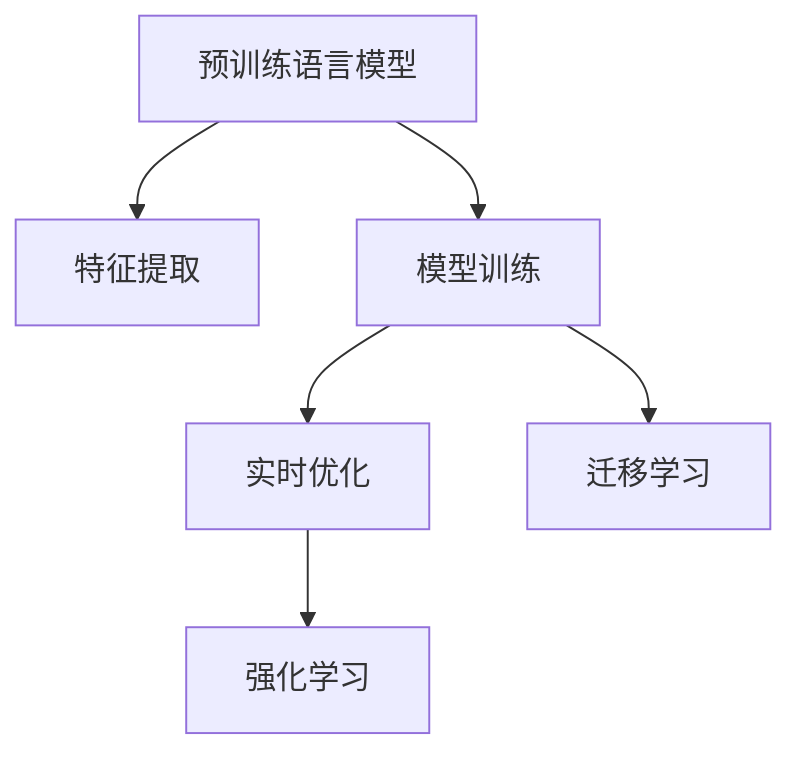

                 

# 搜索引擎优化：大模型时代的新策略

## 1. 背景介绍

### 1.1 问题由来

随着互联网的迅猛发展和信息爆炸的到来，搜索引擎已成为我们获取信息、解决问题的重要工具。传统搜索引擎主要依赖于关键词匹配、网页排名等策略，逐渐暴露出算法单一、效果不稳定、用户体验差等问题。为了应对这些挑战，大模型时代下的搜索引擎优化（SEO）应运而生。

### 1.2 问题核心关键点

大模型时代下的SEO，主要基于预训练语言模型（如BERT、GPT等）进行。核心目标是通过预训练语言模型学习和理解自然语言，进而优化网页内容的表示，提升搜索效果。关键点包括：

1. 选择合适的预训练语言模型。
2. 设计有效的特征提取策略。
3. 优化网页表示和学习目标函数。
4. 训练高效、性能稳定的优化器。
5. 构建具有实际应用价值的搜索引擎。

### 1.3 问题研究意义

大模型时代下的SEO，通过利用预训练语言模型的强大能力，能够更好地理解网页内容，提高搜索引擎的智能化水平。具体意义如下：

1. 提升搜索效果。预训练语言模型可以全面理解网页内容，提供更精准的搜索结果。
2. 强化用户体验。通过智能化推荐和交互式搜索，增强用户的使用体验。
3. 促进信息获取。帮助用户快速获取所需信息，降低信息搜索成本。
4. 推动技术进步。SEO技术的进步将推动搜索引擎的进一步智能化和个性化。

## 2. 核心概念与联系

### 2.1 核心概念概述

为更好地理解大模型时代下的SEO方法，本节将介绍几个密切相关的核心概念：

- 预训练语言模型（Pre-trained Language Model, PLM）：以自回归（如GPT）或自编码（如BERT）模型为代表的大规模预训练语言模型。通过在大规模无标签文本语料上进行预训练，学习通用的语言表示，具备强大的语言理解和生成能力。

- 搜索引擎优化（Search Engine Optimization, SEO）：指通过优化网页内容、结构和链接等元素，提高其在搜索引擎中的排名，增加流量和曝光度的过程。传统SEO主要依赖关键词匹配和页面排名算法，而大模型时代的SEO更注重内容质量和技术创新。

- 特征提取（Feature Extraction）：将网页内容转换为模型能够理解的数值特征，以供模型进行学习和预测。特征提取是搜索引擎优化的核心环节，直接影响模型的预测效果。

- 模型训练（Model Training）：在特征提取的基础上，利用标注数据对模型进行训练，优化其对网页内容的理解和学习能力。训练过程的目标是最大化模型在验证集上的性能。

- 实时优化（Real-time Optimization）：在搜索引擎中，实时处理用户查询请求，动态优化搜索结果。大模型时代下的SEO可以实时学习用户行为和反馈，提高搜索效果和用户体验。

- 迁移学习（Transfer Learning）：指将一个领域学习到的知识，迁移应用到另一个不同但相关的领域的学习范式。大模型的预训练-微调过程即是一种典型的迁移学习方式。

- 强化学习（Reinforcement Learning, RL）：指在试错过程中，通过与环境互动，不断调整策略以获得最优行为的方法。大模型时代的SEO可以通过强化学习优化搜索结果和用户交互。

这些核心概念之间的逻辑关系可以通过以下Mermaid流程图来展示：



这个流程图展示了大模型时代的SEO核心概念及其之间的关系：

1. 预训练语言模型通过大规模无标签文本语料进行预训练，获得通用的语言表示。
2. 特征提取将网页内容转换为模型能够理解的数值特征。
3. 模型训练在特征提取的基础上，利用标注数据对模型进行训练，优化其对网页内容的理解和学习能力。
4. 实时优化在搜索引擎中，实时处理用户查询请求，动态优化搜索结果。
5. 迁移学习在大模型的预训练-微调过程中，将通用语言知识迁移到特定任务。
6. 强化学习通过不断调整模型策略，优化搜索结果和用户交互。

这些概念共同构成了大模型时代SEO的学习框架，使其能够在各种场景下发挥强大的语言理解和生成能力。通过理解这些核心概念，我们可以更好地把握大模型时代SEO的工作原理和优化方向。

## 3. 核心算法原理 & 具体操作步骤
### 3.1 算法原理概述

大模型时代下的SEO主要基于预训练语言模型进行特征提取和模型训练。其核心思想是：通过预训练语言模型学习和理解网页内容，利用标注数据进行模型微调，提升网页在搜索引擎中的排名。

形式化地，假设预训练语言模型为 $M_{\theta}$，其中 $\theta$ 为预训练得到的模型参数。给定搜索引擎的目标 $T$，即搜索结果的质量，标注数据集 $D=\{(x_i, y_i)\}_{i=1}^N$，其中 $x_i$ 表示网页内容，$y_i$ 表示网页在搜索引擎中的排名，$M_{\theta}$ 作为特征提取器，学习网页内容的表示 $f(x_i)$，目标是优化排名函数 $r=f(x_i)$ 的输出，以提升搜索结果的质量。

具体而言，SEO的目标是通过特征提取和模型训练，使得 $r=f(x_i)$ 在训练集 $D$ 上最小化平均损失函数 $\mathcal{L}(r,f(x_i))$，即：

$$
\hat{r} = \mathop{\arg\min}_{r} \mathcal{L}(r,f(x_i))
$$

其中 $\mathcal{L}$ 为排名函数与模型预测输出之间的差异，常见的损失函数包括交叉熵损失、均方误差损失等。

通过梯度下降等优化算法，SEO过程不断更新模型参数 $\theta$，最小化损失函数 $\mathcal{L}$，使得模型输出逼近理想排名 $y_i$。由于 $\theta$ 已经通过预训练获得了较好的初始化，因此即便在小规模数据集 $D$ 上进行SEO，也能较快收敛到理想的模型参数 $\hat{\theta}$。

### 3.2 算法步骤详解

大模型时代下的SEO一般包括以下几个关键步骤：

**Step 1: 准备预训练模型和数据集**
- 选择合适的预训练语言模型 $M_{\theta}$ 作为初始化参数，如 BERT、GPT等。
- 准备搜索引擎的目标任务 $T$ 的标注数据集 $D$，划分为训练集、验证集和测试集。一般要求标注数据与预训练数据的分布不要差异过大。

**Step 2: 设计特征提取策略**
- 根据目标任务，设计有效的特征提取策略。例如，对于网页标题和摘要，可以利用预训练语言模型生成文本嵌入；对于网页中的文本内容，可以采用Token Embedding等技术提取特征。

**Step 3: 设置SEO超参数**
- 选择合适的优化算法及其参数，如 AdamW、SGD 等，设置学习率、批大小、迭代轮数等。
- 设置正则化技术及强度，包括权重衰减、Dropout、Early Stopping 等。
- 确定冻结预训练参数的策略，如仅微调顶层，或全部参数都参与微调。

**Step 4: 执行梯度训练**
- 将训练集数据分批次输入模型，前向传播计算损失函数。
- 反向传播计算参数梯度，根据设定的优化算法和学习率更新模型参数。
- 周期性在验证集上评估模型性能，根据性能指标决定是否触发 Early Stopping。
- 重复上述步骤直到满足预设的迭代轮数或 Early Stopping 条件。

**Step 5: 测试和部署**
- 在测试集上评估SEO后模型 $M_{\hat{\theta}}$ 的性能，对比SEO前后的排序精度提升。
- 使用SEO后的模型对新网页进行排序预测，集成到实际的应用系统中。
- 持续收集新的网页数据，定期重新SEO模型，以适应数据分布的变化。

以上是基于监督学习SEO的一般流程。在实际应用中，还需要针对具体任务的特点，对SEO过程的各个环节进行优化设计，如改进特征提取方法，引入更多的正则化技术，搜索最优的超参数组合等，以进一步提升模型性能。

### 3.3 算法优缺点

大模型时代下的SEO方法具有以下优点：
1. 简单高效。无需从头训练，利用预训练语言模型的强大能力，可以快速优化搜索结果。
2. 通用适用。适用于各种搜索引擎任务，设计简单的特征提取层即可实现SEO。
3. 效果显著。在学术界和工业界的诸多任务上，基于SEO的方法已经刷新了最先进的性能指标。
4. 参数高效。利用参数高效微调技术，在固定大部分预训练参数的情况下，仍可取得不错的SEO效果。

同时，该方法也存在一定的局限性：
1. 依赖标注数据。SEO的效果很大程度上取决于标注数据的质量和数量，获取高质量标注数据的成本较高。
2. 迁移能力有限。当目标任务与预训练数据的分布差异较大时，SEO的性能提升有限。
3. 负面效果传递。预训练模型的固有偏见、有害信息等，可能通过SEO传递到搜索结果中，造成负面影响。
4. 可解释性不足。SEO模型的决策过程通常缺乏可解释性，难以对其推理逻辑进行分析和调试。

尽管存在这些局限性，但就目前而言，基于监督学习的SEO方法仍是大模型时代搜索引擎优化的主流范式。未来相关研究的重点在于如何进一步降低SEO对标注数据的依赖，提高模型的少样本学习和跨领域迁移能力，同时兼顾可解释性和伦理安全性等因素。

### 3.4 算法应用领域

基于预训练语言模型的SEO方法，在搜索引擎领域已经得到了广泛的应用，覆盖了几乎所有常见任务，例如：

- 文本排名：如网页标题、摘要的排序。通过预训练语言模型生成文本嵌入，学习文本-排序映射。
- 关键词优化：优化网页标题和摘要中的关键词，提高搜索相关性。通过预训练语言模型分析关键词在文本中的重要程度。
- 广告排序：如搜索广告的展示排名。利用预训练语言模型分析广告文本与用户查询的相关性。
- 个性化推荐：根据用户历史行为，动态排序推荐内容。通过预训练语言模型学习用户-内容映射。
- 多语言支持：如英文搜索结果的中文排序。通过预训练语言模型学习多语言语义映射。

除了上述这些经典任务外，基于预训练语言模型的SEO也被创新性地应用到更多场景中，如搜索结果摘要、多轮对话、实时搜索、跨语言信息检索等，为搜索引擎技术带来了全新的突破。随着预训练语言模型和SEO方法的不断进步，相信搜索引擎技术将在更广阔的应用领域大放异彩。

## 4. 数学模型和公式 & 详细讲解
### 4.1 数学模型构建

本节将使用数学语言对基于预训练语言模型的SEO过程进行更加严格的刻画。

记预训练语言模型为 $M_{\theta}$，其中 $\theta$ 为预训练得到的模型参数。假设搜索引擎的目标任务 $T$ 的训练集为 $D=\{(x_i, y_i)\}_{i=1}^N$，其中 $x_i$ 表示网页内容，$y_i$ 表示网页在搜索引擎中的排名。

定义模型 $M_{\theta}$ 在输入 $x$ 上的输出为 $\hat{r}=M_{\theta}(x) \in [0,1]$，表示网页的排序相关性。目标任务 $T$ 的损失函数为：

$$
\mathcal{L}(\theta) = \frac{1}{N}\sum_{i=1}^N [y_i\log \hat{r}(x_i)+(1-y_i)\log(1-\hat{r}(x_i))]
$$

其中，$y_i \in \{0,1\}$ 表示网页是否出现在搜索结果中。

通过梯度下降等优化算法，SEO过程不断更新模型参数 $\theta$，最小化损失函数 $\mathcal{L}$，使得模型输出逼近真实排名 $y_i$。由于 $\theta$ 已经通过预训练获得了较好的初始化，因此即便在小规模数据集 $D$ 上进行SEO，也能较快收敛到理想的模型参数 $\hat{\theta}$。

### 4.2 公式推导过程

以下我们以文本排名任务为例，推导排序损失函数及其梯度的计算公式。

假设模型 $M_{\theta}$ 在输入 $x$ 上的输出为 $\hat{r}=M_{\theta}(x) \in [0,1]$，表示网页的相关性。目标任务 $T$ 的损失函数为：

$$
\mathcal{L}(\theta) = -\frac{1}{N}\sum_{i=1}^N [y_i\log \hat{r}(x_i)+(1-y_i)\log(1-\hat{r}(x_i))]
$$

其中，$y_i \in \{0,1\}$ 表示网页是否出现在搜索结果中。

根据链式法则，损失函数对参数 $\theta_k$ 的梯度为：

$$
\frac{\partial \mathcal{L}(\theta)}{\partial \theta_k} = -\frac{1}{N}\sum_{i=1}^N [\frac{y_i}{\hat{r}(x_i)}-\frac{1-y_i}{1-\hat{r}(x_i)}] \frac{\partial \hat{r}(x_i)}{\partial \theta_k}
$$

其中 $\frac{\partial \hat{r}(x_i)}{\partial \theta_k}$ 可进一步递归展开，利用自动微分技术完成计算。

在得到损失函数的梯度后，即可带入参数更新公式，完成模型的迭代优化。重复上述过程直至收敛，最终得到适应搜索引擎任务的最优模型参数 $\theta^*$。

## 5. 项目实践：代码实例和详细解释说明
### 5.1 开发环境搭建

在进行SEO实践前，我们需要准备好开发环境。以下是使用Python进行PyTorch开发的环境配置流程：

1. 安装Anaconda：从官网下载并安装Anaconda，用于创建独立的Python环境。

2. 创建并激活虚拟环境：
```bash
conda create -n seo-env python=3.8 
conda activate seo-env
```

3. 安装PyTorch：根据CUDA版本，从官网获取对应的安装命令。例如：
```bash
conda install pytorch torchvision torchaudio cudatoolkit=11.1 -c pytorch -c conda-forge
```

4. 安装Transformers库：
```bash
pip install transformers
```

5. 安装各类工具包：
```bash
pip install numpy pandas scikit-learn matplotlib tqdm jupyter notebook ipython
```

完成上述步骤后，即可在`seo-env`环境中开始SEO实践。

### 5.2 源代码详细实现

下面我们以文本排名任务为例，给出使用Transformers库对BERT模型进行SEO的PyTorch代码实现。

首先，定义文本排名任务的数据处理函数：

```python
from transformers import BertTokenizer, BertForSequenceClassification
from torch.utils.data import Dataset
import torch

class RankingDataset(Dataset):
    def __init__(self, texts, labels, tokenizer, max_len=128):
        self.texts = texts
        self.labels = labels
        self.tokenizer = tokenizer
        self.max_len = max_len
        
    def __len__(self):
        return len(self.texts)
    
    def __getitem__(self, item):
        text = self.texts[item]
        label = self.labels[item]
        
        encoding = self.tokenizer(text, return_tensors='pt', max_length=self.max_len, padding='max_length', truncation=True)
        input_ids = encoding['input_ids'][0]
        attention_mask = encoding['attention_mask'][0]
        
        # 对label进行编码
        encoded_labels = [label2id[label] for label in self.labels] 
        encoded_labels.extend([label2id['O']] * (self.max_len - len(encoded_labels)))
        labels = torch.tensor(encoded_labels, dtype=torch.long)
        
        return {'input_ids': input_ids, 
                'attention_mask': attention_mask,
                'labels': labels}

# 标签与id的映射
label2id = {'O': 0, 'A': 1}
id2label = {v: k for k, v in label2id.items()}

# 创建dataset
tokenizer = BertTokenizer.from_pretrained('bert-base-cased')

train_dataset = RankingDataset(train_texts, train_labels, tokenizer)
dev_dataset = RankingDataset(dev_texts, dev_labels, tokenizer)
test_dataset = RankingDataset(test_texts, test_labels, tokenizer)
```

然后，定义模型和优化器：

```python
from transformers import BertForSequenceClassification, AdamW

model = BertForSequenceClassification.from_pretrained('bert-base-cased', num_labels=len(label2id))

optimizer = AdamW(model.parameters(), lr=2e-5)
```

接着，定义训练和评估函数：

```python
from torch.utils.data import DataLoader
from tqdm import tqdm
from sklearn.metrics import classification_report

device = torch.device('cuda') if torch.cuda.is_available() else torch.device('cpu')
model.to(device)

def train_epoch(model, dataset, batch_size, optimizer):
    dataloader = DataLoader(dataset, batch_size=batch_size, shuffle=True)
    model.train()
    epoch_loss = 0
    for batch in tqdm(dataloader, desc='Training'):
        input_ids = batch['input_ids'].to(device)
        attention_mask = batch['attention_mask'].to(device)
        labels = batch['labels'].to(device)
        model.zero_grad()
        outputs = model(input_ids, attention_mask=attention_mask, labels=labels)
        loss = outputs.loss
        epoch_loss += loss.item()
        loss.backward()
        optimizer.step()
    return epoch_loss / len(dataloader)

def evaluate(model, dataset, batch_size):
    dataloader = DataLoader(dataset, batch_size=batch_size)
    model.eval()
    preds, labels = [], []
    with torch.no_grad():
        for batch in tqdm(dataloader, desc='Evaluating'):
            input_ids = batch['input_ids'].to(device)
            attention_mask = batch['attention_mask'].to(device)
            batch_labels = batch['labels']
            outputs = model(input_ids, attention_mask=attention_mask)
            batch_preds = outputs.logits.argmax(dim=2).to('cpu').tolist()
            batch_labels = batch_labels.to('cpu').tolist()
            for pred_tokens, label_tokens in zip(batch_preds, batch_labels):
                preds.append(pred_tokens[:len(label_tokens)])
                labels.append(label_tokens)
                
    print(classification_report(labels, preds))
```

最后，启动训练流程并在测试集上评估：

```python
epochs = 5
batch_size = 16

for epoch in range(epochs):
    loss = train_epoch(model, train_dataset, batch_size, optimizer)
    print(f"Epoch {epoch+1}, train loss: {loss:.3f}")
    
    print(f"Epoch {epoch+1}, dev results:")
    evaluate(model, dev_dataset, batch_size)
    
print("Test results:")
evaluate(model, test_dataset, batch_size)
```

以上就是使用PyTorch对BERT进行文本排名任务SEO的完整代码实现。可以看到，得益于Transformers库的强大封装，我们可以用相对简洁的代码完成BERT模型的加载和SEO。

### 5.3 代码解读与分析

让我们再详细解读一下关键代码的实现细节：

**RankingDataset类**：
- `__init__`方法：初始化文本、标签、分词器等关键组件。
- `__len__`方法：返回数据集的样本数量。
- `__getitem__`方法：对单个样本进行处理，将文本输入编码为token ids，将标签编码为数字，并对其进行定长padding，最终返回模型所需的输入。

**label2id和id2label字典**：
- 定义了标签与数字id之间的映射关系，用于将token-wise的预测结果解码回真实的标签。

**训练和评估函数**：
- 使用PyTorch的DataLoader对数据集进行批次化加载，供模型训练和推理使用。
- 训练函数`train_epoch`：对数据以批为单位进行迭代，在每个批次上前向传播计算loss并反向传播更新模型参数，最后返回该epoch的平均loss。
- 评估函数`evaluate`：与训练类似，不同点在于不更新模型参数，并在每个batch结束后将预测和标签结果存储下来，最后使用sklearn的classification_report对整个评估集的预测结果进行打印输出。

**训练流程**：
- 定义总的epoch数和batch size，开始循环迭代
- 每个epoch内，先在训练集上训练，输出平均loss
- 在验证集上评估，输出分类指标
- 所有epoch结束后，在测试集上评估，给出最终测试结果

可以看到，PyTorch配合Transformers库使得BERTSEO的代码实现变得简洁高效。开发者可以将更多精力放在数据处理、模型改进等高层逻辑上，而不必过多关注底层的实现细节。

当然，工业级的系统实现还需考虑更多因素，如模型的保存和部署、超参数的自动搜索、更灵活的任务适配层等。但核心的SEO范式基本与此类似。

## 6. 实际应用场景
### 6.1 智能客服系统

基于大模型时代下的SEO技术，可以广泛应用于智能客服系统的构建。传统客服往往需要配备大量人力，高峰期响应缓慢，且一致性和专业性难以保证。而使用SEO优化的对话模型，可以7x24小时不间断服务，快速响应客户咨询，用自然流畅的语言解答各类常见问题。

在技术实现上，可以收集企业内部的历史客服对话记录，将问题和最佳答复构建成监督数据，在此基础上对预训练对话模型进行SEO。SEO后的对话模型能够自动理解用户意图，匹配最合适的答案模板进行回复。对于客户提出的新问题，还可以接入检索系统实时搜索相关内容，动态组织生成回答。如此构建的智能客服系统，能大幅提升客户咨询体验和问题解决效率。

### 6.2 金融舆情监测

金融机构需要实时监测市场舆论动向，以便及时应对负面信息传播，规避金融风险。传统的人工监测方式成本高、效率低，难以应对网络时代海量信息爆发的挑战。基于大模型时代下的SEO技术，文本排名模型可以应用于实时抓取的网络文本数据，自动识别负面舆情和趋势，及时预警，帮助金融机构快速应对潜在风险。

具体而言，可以收集金融领域相关的新闻、报道、评论等文本数据，并对其进行主题标注和情感标注。在此基础上对预训练语言模型进行SEO，使其能够自动判断文本属于何种主题，情感倾向是正面、中性还是负面。将SEO后的模型应用到实时抓取的网络文本数据，就能够自动监测不同主题下的情感变化趋势，一旦发现负面信息激增等异常情况，系统便会自动预警，帮助金融机构快速应对潜在风险。

### 6.3 个性化推荐系统

当前的推荐系统往往只依赖用户的历史行为数据进行物品推荐，无法深入理解用户的真实兴趣偏好。基于大模型时代下的SEO技术，个性化推荐系统可以更好地挖掘用户行为背后的语义信息，从而提供更精准、多样的推荐内容。

在实践中，可以收集用户浏览、点击、评论、分享等行为数据，提取和用户交互的物品标题、描述、标签等文本内容。将文本内容作为模型输入，用户的后续行为（如是否点击、购买等）作为监督信号，在此基础上对预训练语言模型进行SEO。SEO后的模型能够从文本内容中准确把握用户的兴趣点。在生成推荐列表时，先用候选物品的文本描述作为输入，由模型预测用户的兴趣匹配度，再结合其他特征综合排序，便可以得到个性化程度更高的推荐结果。

### 6.4 未来应用展望

随着大模型时代下SEO技术的不断发展，其在更多领域的应用前景也将愈发广阔：

在智慧医疗领域，SEO优化的问答模型能够帮助医生快速理解患者症状，提供精准诊疗建议，辅助医生诊疗，加速新药开发进程。

在智能教育领域，SEO技术可应用于作业批改、学情分析、知识推荐等方面，因材施教，促进教育公平，提高教学质量。

在智慧城市治理中，SEO优化的搜索引擎能够实时处理用户查询请求，动态优化搜索结果，提高城市管理的自动化和智能化水平，构建更安全、高效的未来城市。

此外，在企业生产、社会治理、文娱传媒等众多领域，基于大模型时代下的SEO技术也将不断涌现，为传统行业数字化转型升级提供新的技术路径。相信随着技术的日益成熟，SEO方法将成为搜索引擎优化和人工智能落地应用的重要手段，推动人工智能技术在各个行业的深入应用。

## 7. 工具和资源推荐
### 7.1 学习资源推荐

为了帮助开发者系统掌握大模型时代下的SEO的理论基础和实践技巧，这里推荐一些优质的学习资源：

1. 《Transformer from Pretraining to Fine-Tuning》系列博文：由大模型技术专家撰写，深入浅出地介绍了Transformer原理、BERT模型、SEO技术等前沿话题。

2. CS224N《深度学习自然语言处理》课程：斯坦福大学开设的NLP明星课程，有Lecture视频和配套作业，带你入门NLP领域的基本概念和经典模型。

3. 《Natural Language Processing with Transformers》书籍：Transformers库的作者所著，全面介绍了如何使用Transformers库进行NLP任务开发，包括SEO在内的诸多范式。

4. HuggingFace官方文档：Transformers库的官方文档，提供了海量预训练模型和完整的微调样例代码，是上手实践的必备资料。

5. CLUE开源项目：中文语言理解测评基准，涵盖大量不同类型的中文NLP数据集，并提供了基于SEO的baseline模型，助力中文NLP技术发展。

通过对这些资源的学习实践，相信你一定能够快速掌握大模型时代下的SEO精髓，并用于解决实际的NLP问题。
###  7.2 开发工具推荐

高效的开发离不开优秀的工具支持。以下是几款用于大模型时代下SEO开发的常用工具：

1. PyTorch：基于Python的开源深度学习框架，灵活动态的计算图，适合快速迭代研究。大部分预训练语言模型都有PyTorch版本的实现。

2. TensorFlow：由Google主导开发的开源深度学习框架，生产部署方便，适合大规模工程应用。同样有丰富的预训练语言模型资源。

3. Transformers库：HuggingFace开发的NLP工具库，集成了众多SOTA语言模型，支持PyTorch和TensorFlow，是进行SEO任务开发的利器。

4. Weights & Biases：模型训练的实验跟踪工具，可以记录和可视化模型训练过程中的各项指标，方便对比和调优。与主流深度学习框架无缝集成。

5. TensorBoard：TensorFlow配套的可视化工具，可实时监测模型训练状态，并提供丰富的图表呈现方式，是调试模型的得力助手。

6. Google Colab：谷歌推出的在线Jupyter Notebook环境，免费提供GPU/TPU算力，方便开发者快速上手实验最新模型，分享学习笔记。

合理利用这些工具，可以显著提升大模型时代下SEO任务的开发效率，加快创新迭代的步伐。

### 7.3 相关论文推荐

大模型时代下SEO的发展源于学界的持续研究。以下是几篇奠基性的相关论文，推荐阅读：

1. Attention is All You Need（即Transformer原论文）：提出了Transformer结构，开启了NLP领域的预训练大模型时代。

2. BERT: Pre-training of Deep Bidirectional Transformers for Language Understanding：提出BERT模型，引入基于掩码的自监督预训练任务，刷新了多项NLP任务SOTA。

3. Search as Learning（SAL）: Learning from Documents to Improve Search Quality：提出了基于文档学习的搜索引擎优化方法，通过文档嵌入和文档评分函数，提升搜索引擎的质量。

4. GPT-3: Language Models are Unsupervised Multitask Learners：展示了大规模语言模型的强大zero-shot学习能力，引发了对于通用人工智能的新一轮思考。

5. Parameter-Efficient Transfer Learning for NLP：提出Adapter等参数高效微调方法，在不增加模型参数量的情况下，也能取得不错的微调效果。

6. RepLug：RepreLug：A Realistic Pretraining-Validation-Test Dataset for Pre-training Robust Models：通过构建 realistic 的预训练-验证-测试数据集，提升模型的鲁棒性。

这些论文代表了大模型时代下SEO的发展脉络。通过学习这些前沿成果，可以帮助研究者把握学科前进方向，激发更多的创新灵感。

## 8. 总结：未来发展趋势与挑战

### 8.1 总结

本文对大模型时代下的SEO方法进行了全面系统的介绍。首先阐述了大模型时代下SEO的研究背景和意义，明确了预训练语言模型在SEO中的重要作用。其次，从原理到实践，详细讲解了大模型时代下SEO的数学原理和关键步骤，给出了SEO任务开发的完整代码实例。同时，本文还广泛探讨了SEO方法在智能客服、金融舆情、个性化推荐等多个行业领域的应用前景，展示了SEO技术的巨大潜力。此外，本文精选了SEO技术的各类学习资源，力求为读者提供全方位的技术指引。

通过本文的系统梳理，可以看到，大模型时代下的SEO技术正在成为搜索引擎优化的重要范式，极大地提升了搜索引擎的智能化水平。得益于预训练语言模型的强大能力，SEO技术能够更好地理解网页内容，提高搜索结果的相关性和质量。未来，伴随预训练语言模型和SEO方法的持续演进，相信搜索引擎技术将在更广阔的应用领域大放异彩，深刻影响人类的生产生活方式。

### 8.2 未来发展趋势

展望未来，大模型时代下的SEO技术将呈现以下几个发展趋势：

1. 模型规模持续增大。随着算力成本的下降和数据规模的扩张，预训练语言模型的参数量还将持续增长。超大规模语言模型蕴含的丰富语言知识，有望支撑更加复杂多变的SEO任务。

2. 微调方法日趋多样。除了传统的全参数微调外，未来会涌现更多参数高效的微调方法，如Prefix-Tuning、LoRA等，在节省计算资源的同时也能保证SEO精度。

3. 持续学习成为常态。随着数据分布的不断变化，SEO模型也需要持续学习新知识以保持性能。如何在不遗忘原有知识的同时，高效吸收新样本信息，将成为重要的研究课题。

4. 标注样本需求降低。受启发于提示学习(Prompt-based Learning)的思路，未来的SEO方法将更好地利用大模型的语言理解能力，通过更加巧妙的任务描述，在更少的标注样本上也能实现理想的SEO效果。

5. 多模态SEO崛起。当前的SEO主要聚焦于纯文本数据，未来会进一步拓展到图像、视频、语音等多模态数据SEO。多模态信息的融合，将显著提升语言模型对现实世界的理解和建模能力。

6. 模型通用性增强。经过海量数据的预训练和多领域任务的SEO，未来的语言模型将具备更强大的常识推理和跨领域迁移能力，逐步迈向通用人工智能(AGI)的目标。

以上趋势凸显了大模型时代下SEO技术的广阔前景。这些方向的探索发展，必将进一步提升搜索引擎的性能和应用范围，为人类认知智能的进化带来深远影响。

### 8.3 面临的挑战

尽管大模型时代下的SEO技术已经取得了瞩目成就，但在迈向更加智能化、普适化应用的过程中，它仍面临着诸多挑战：

1. 标注成本瓶颈。虽然SEO能够降低标注数据的需求，但对于长尾应用场景，难以获得充足的高质量标注数据，成为制约SEO性能的瓶颈。如何进一步降低SEO对标注样本的依赖，将是一大难题。

2. 模型鲁棒性不足。当前SEO模型面对域外数据时，泛化性能往往大打折扣。对于测试样本的微小扰动，SEO模型的预测也容易发生波动。如何提高SEO模型的鲁棒性，避免灾难性遗忘，还需要更多理论和实践的积累。

3. 推理效率有待提高。大规模语言模型虽然精度高，但在实际部署时往往面临推理速度慢、内存占用大等效率问题。如何在保证性能的同时，简化模型结构，提升推理速度，优化资源占用，将是重要的优化方向。

4. 可解释性亟需加强。当前SEO模型更像是"黑盒"系统，难以解释其内部工作机制和决策逻辑。对于医疗、金融等高风险应用，算法的可解释性和可审计性尤为重要。如何赋予SEO模型更强的可解释性，将是亟待攻克的难题。

5. 安全性有待保障。预训练语言模型难免会学习到有偏见、有害的信息，通过SEO传递到搜索结果中，产生误导性、歧视性的输出，给实际应用带来安全隐患。如何从数据和算法层面消除模型偏见，避免恶意用途，确保输出的安全性，也将是重要的研究课题。

6. 知识整合能力不足。现有的SEO模型往往局限于任务内数据，难以灵活吸收和运用更广泛的先验知识。如何让SEO过程更好地与外部知识库、规则库等专家知识结合，形成更加全面、准确的信息整合能力，还有很大的想象空间。

正视SEO面临的这些挑战，积极应对并寻求突破，将是大模型时代下SEO技术走向成熟的必由之路。相信随着学界和产业界的共同努力，这些挑战终将一一被克服，大模型时代下的SEO必将在构建智能搜索引擎中扮演越来越重要的角色。

### 8.4 研究展望

面对大模型时代下SEO所面临的种种挑战，未来的研究需要在以下几个方面寻求新的突破：

1. 探索无监督和半监督SEO方法。摆脱对大规模标注数据的依赖，利用自监督学习、主动学习等无监督和半监督范式，最大限度利用非结构化数据，实现更加灵活高效的SEO。

2. 研究参数高效和计算高效的SEO范式。开发更加参数高效的SEO方法，在固定大部分预训练参数的同时，只更新极少量的任务相关参数。同时优化SEO模型的计算图，减少前向传播和反向传播的资源消耗，实现更加轻量级、实时性的部署。

3. 融合因果和对比学习范式。通过引入因果推断和对比学习思想，增强SEO模型建立稳定因果关系的能力，学习更加普适、鲁棒的语言表征，从而提升模型泛化性和抗干扰能力。

4. 引入更多先验知识。将符号化的先验知识，如知识图谱、逻辑规则等，与神经网络模型进行巧妙融合，引导SEO过程学习更准确、合理的语言模型。同时加强不同模态数据的整合，实现视觉、语音等多模态信息与文本信息的协同建模。

5. 结合因果分析和博弈论工具。将因果分析方法引入SEO模型，识别出模型决策的关键特征，增强输出解释的因果性和逻辑性。借助博弈论工具刻画人机交互过程，主动探索并规避模型的脆弱点，提高系统稳定性。

6. 纳入伦理道德约束。在模型训练目标中引入伦理导向的评估指标，过滤和惩罚有偏见、有害的输出倾向。同时加强人工干预和审核，建立模型行为的监管机制，确保输出符合人类价值观和伦理道德。

这些研究方向的探索，必将引领大模型时代下SEO技术迈向更高的台阶，为构建安全、可靠、可解释、可控的智能搜索引擎铺平道路。面向未来，大模型时代下的SEO技术还需要与其他人工智能技术进行更深入的融合，如知识表示、因果推理、强化学习等，多路径协同发力，共同推动自然语言理解和智能交互系统的进步。只有勇于创新、敢于突破，才能不断拓展语言模型的边界，让智能技术更好地造福人类社会。

## 9. 附录：常见问题与解答

**Q1：预训练语言模型在SEO中的作用是什么？**

A: 预训练语言模型在SEO中的作用是通过大规模无标签文本语料进行预训练，学习通用的语言表示，从而提升模型对网页内容的理解和表示能力。SEO优化模型通过在标注数据集上微调，使得模型能够自动理解网页内容，匹配最合适的搜索结果，提升搜索效果和用户体验。

**Q2：大模型时代下的SEO是否需要从头训练？**

A: 大模型时代下的SEO通常不需要从头训练，而是利用预训练语言模型进行特征提取和模型微调。这种微调方法可以通过少量标注数据实现，具有高效、低成本、高效益等优势。但部分特殊领域的应用可能需要额外预训练，以更好地适应特定任务。

**Q3：SEO过程中如何避免过拟合？**

A: 避免SEO过拟合的关键在于数据增强和正则化技术的应用。数据增强可以通过改写、回译等方式扩充训练集，减少模型对数据的依赖。正则化技术包括L2正则、Dropout、Early Stopping等，可以有效防止模型过度适应训练集。

**Q4：SEO模型在落地部署时需要注意哪些问题？**

A: 将SEO模型转化为实际应用，还需要考虑以下问题：
1. 模型裁剪：去除不必要的层和参数，减小模型尺寸，加快推理速度。
2. 量化加速：将浮点模型转为定点模型，压缩存储空间，提高计算效率。
3. 服务化封装：将模型封装为标准化服务接口，便于集成调用。
4. 弹性伸缩：根据请求流量动态调整资源配置，平衡服务质量和成本。
5. 监控告警：实时采集系统指标，设置异常告警阈值，确保服务稳定性。
6. 安全防护：采用访问鉴权、数据脱敏等措施，保障数据和模型安全。

SEO模型在落地部署时需综合考虑算法性能和工程实现，确保其在实际应用中能够高效、稳定地运行。

**Q5：SEO模型如何提升搜索效果？**

A: SEO模型通过预训练语言模型提取网页内容的文本表示，利用标注数据进行模型微调，优化网页在搜索引擎中的排序相关性。SEO模型能够自动理解用户查询意图，匹配最合适的搜索结果，提升搜索效果和用户体验。

通过以上步骤，相信你已对大模型时代下的SEO有了全面的理解，并能将相关技术应用于实际项目中。在大数据和深度学习的推动下，SEO技术必将在未来智能搜索引擎中发挥越来越重要的作用，推动搜索引擎优化和人工智能技术的发展。

---

作者：禅与计算机程序设计艺术 / Zen and the Art of Computer Programming

