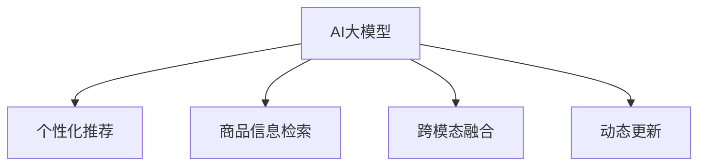

                 

## 1. 背景介绍

### 1.1 问题由来
随着电商平台的发展，其推荐的商品种类和数量日益丰富，用户对个性化推荐的期望也在不断提升。传统的推荐系统依赖于统计模型和手工特征工程，难以充分挖掘用户和商品之间复杂的关联关系，也无法应对海量数据和多变用户需求的挑战。因此，引入基于AI的大模型推荐系统，成为电商平台提高用户满意度和转化率的关键。

### 1.2 问题核心关键点
AI大模型在推荐系统中的应用，主要体现在以下几个方面：
- **个性化推荐**：通过大模型对用户历史行为和商品属性进行学习，生成个性化的推荐结果。
- **商品信息检索**：利用大模型的文本匹配能力，快速找到与用户查询相关的商品。
- **跨模态融合**：将文本、图像、视频等多模态信息结合，提供更加全面、真实的产品展示。
- **动态更新**：大模型具备自适应学习能力，能够实时更新推荐结果，保持推荐内容的新鲜性。

通过引入AI大模型，电商平台能够有效应对多变的需求和海量数据，提供更加精准、多样和及时的推荐，从而大幅提升用户转化率和整体满意度。

### 1.3 问题研究意义
AI大模型在电商平台中的应用，具有以下重要意义：
- **提升用户体验**：通过个性化推荐，满足用户多样化的需求，提供更加流畅、愉快的购物体验。
- **提高转化率**：精准推荐商品，减少用户搜索时间，增加购买概率，提高电商平台盈利能力。
- **增强竞争力**：构建独特的推荐系统，与同类平台形成差异化竞争优势，吸引和留存更多用户。
- **优化供应链**：通过分析用户购买行为，预测商品需求，优化库存管理和供应链配置，降低运营成本。
- **推动行业发展**：引领电商行业技术升级，推动AI和数据科学技术的普及和应用。

## 2. 核心概念与联系

### 2.1 核心概念概述

为更好地理解AI大模型在电商平台推荐系统中的应用，本节将介绍几个密切相关的核心概念：

- **AI大模型**：指利用大规模数据和先进算法训练得到的高性能深度学习模型，具备强大的通用知识和表示能力。
- **个性化推荐系统**：根据用户的历史行为和兴趣，推荐符合其偏好的商品，提升用户体验和满意度。
- **商品信息检索**：通过自然语言处理和图像识别等技术，快速定位用户感兴趣的商品信息。
- **跨模态融合**：结合文本、图像、视频等多种模态数据，提供更加全面和真实的产品展示。
- **动态更新**：通过实时更新推荐结果，保持商品推荐内容的新鲜性和多样性。

这些核心概念之间的逻辑关系可以通过以下Mermaid流程图来展示：



这个流程图展示了大模型在推荐系统中的核心应用，包括个性化推荐、商品信息检索、跨模态融合和动态更新四个方面。这些应用共同构成了电商平台的推荐引擎，使其能够提供多样、个性化的商品推荐，满足用户不断变化的需求。

## 3. 核心算法原理 & 具体操作步骤
### 3.1 算法原理概述

AI大模型在推荐系统中的应用，主要基于以下算法原理：

1. **个性化推荐算法**：利用大模型对用户和商品的历史数据进行深度学习，生成个性化的推荐列表。
2. **商品信息检索算法**：通过自然语言处理和大模型，匹配用户查询与商品描述，快速定位相关商品。
3. **跨模态融合算法**：结合文本、图像、视频等多种模态数据，提供全面、真实的产品展示。
4. **动态更新算法**：利用大模型的自适应学习能力，实时更新推荐结果，保持推荐内容的新鲜性和多样性。

### 3.2 算法步骤详解

AI大模型在电商平台中的应用主要分为以下几个步骤：

**Step 1: 数据准备与预处理**
- 收集用户行为数据（如浏览、点击、购买记录等）和商品属性数据（如价格、分类、品牌等）。
- 对数据进行清洗、归一化、特征工程等预处理步骤，确保数据质量和一致性。

**Step 2: 构建数据集**
- 将用户行为数据和商品属性数据构建为用户-商品互动数据集。
- 设计合适的训练集、验证集和测试集划分方式，确保模型评估的公正性。

**Step 3: 选择模型与参数**
- 选择合适的AI大模型（如BERT、GPT、DALL-E等）和推荐算法（如协同过滤、矩阵分解、神经网络等）。
- 设定模型的超参数（如学习率、迭代次数、正则化系数等），选择合适的训练策略。

**Step 4: 模型训练**
- 使用训练集对模型进行监督学习，优化模型参数。
- 定期在验证集上评估模型性能，避免过拟合。
- 调整超参数，逐步优化模型性能。

**Step 5: 模型应用**
- 将训练好的模型部署到电商平台中，实现商品推荐、信息检索、跨模态融合等功能。
- 实时更新推荐结果，保持推荐内容的新鲜性和多样性。

**Step 6: 系统优化与评估**
- 对推荐系统进行优化，提升推荐精度、覆盖率和用户体验。
- 定期收集用户反馈，优化推荐策略和数据集。
- 使用A/B测试等方法，评估推荐系统的效果。

### 3.3 算法优缺点

AI大模型在推荐系统中的应用具有以下优点：
1. **精度高**：利用大模型的深度学习能力，能够精准匹配用户需求和商品特征。
2. **适应性强**：大模型具有自适应学习能力，能够实时更新推荐结果，保持推荐内容的新鲜性。
3. **泛化能力强**：大模型能够学习丰富的语言和视觉特征，应用于多模态数据融合。
4. **易于扩展**：大模型具有强大的并行计算能力，能够轻松处理大规模数据。

同时，该方法也存在一定的局限性：
1. **计算成本高**：大模型的训练和推理需要大量计算资源，成本较高。
2. **数据需求大**：需要大量的标注数据和多样化的数据源，才能训练出效果理想的模型。
3. **解释性不足**：大模型的黑盒特性导致推荐过程缺乏可解释性。
4. **对抗攻击风险**：大模型可能被恶意用户通过对抗攻击的方式误导，导致不准确的推荐。

尽管存在这些局限性，但AI大模型在推荐系统中的应用仍然具有显著的优势和巨大的发展潜力。

### 3.4 算法应用领域

AI大模型在电商平台中的应用，主要包括以下几个领域：

1. **个性化推荐**：根据用户历史行为和兴趣，生成个性化的商品推荐。
2. **商品信息检索**：利用自然语言处理和大模型，快速匹配用户查询和商品描述。
3. **跨模态融合**：结合文本、图像、视频等多模态数据，提供全面的商品展示。
4. **动态更新**：利用大模型的自适应学习能力，实时更新推荐结果。
5. **情感分析**：利用大模型的语言理解能力，分析用户评论和反馈，优化推荐策略。

除了上述应用领域，AI大模型在电商平台中还可应用于用户行为预测、库存管理、供应链优化等方面，提升电商平台的整体运营效率和用户满意度。

## 4. 数学模型和公式 & 详细讲解 & 举例说明

### 4.1 数学模型构建

基于AI大模型的推荐系统，数学模型主要包括以下几个部分：

- **用户模型**：表示用户的历史行为和兴趣。
- **商品模型**：表示商品的特征和属性。
- **交互模型**：表示用户和商品之间的互动关系。
- **推荐模型**：将用户模型、商品模型和交互模型结合，生成推荐结果。

### 4.2 公式推导过程

以下是几个关键公式的推导过程：

**用户模型**：
$$
\mathbf{u} = \sum_{i=1}^{n_u} \alpha_i \mathbf{h}_i
$$
其中 $\mathbf{u}$ 表示用户模型，$\mathbf{h}_i$ 表示用户行为数据的隐向量，$\alpha_i$ 表示权重。

**商品模型**：
$$
\mathbf{v} = \sum_{j=1}^{n_v} \beta_j \mathbf{h}_j
$$
其中 $\mathbf{v}$ 表示商品模型，$\mathbf{h}_j$ 表示商品特征的隐向量，$\beta_j$ 表示权重。

**交互模型**：
$$
\mathbf{r} = f(\mathbf{u}, \mathbf{v})
$$
其中 $f$ 表示交互函数，可以根据不同的推荐算法采用不同的函数形式，如点积、矩阵分解等。

**推荐模型**：
$$
\hat{y} = \sigma(\mathbf{W} \mathbf{r})
$$
其中 $\hat{y}$ 表示推荐结果，$\mathbf{W}$ 表示权重矩阵，$\sigma$ 表示激活函数。

### 4.3 案例分析与讲解

以协同过滤推荐算法为例，对推荐模型的推导过程进行详细讲解：

假设用户 $u$ 对商品 $i$ 进行了 $n_u$ 次行为，每次行为对应一个隐向量 $\mathbf{h}_i$，商品 $i$ 的特征 $n_v$ 个，每个特征对应一个隐向量 $\mathbf{h}_j$。

用户模型 $\mathbf{u}$ 可以表示为用户历史行为的加权和：
$$
\mathbf{u} = \sum_{i=1}^{n_u} \alpha_i \mathbf{h}_i
$$
其中 $\alpha_i$ 表示行为权重，可以通过时间戳、点击率等方式计算。

商品模型 $\mathbf{v}$ 可以表示为商品特征的加权和：
$$
\mathbf{v} = \sum_{j=1}^{n_v} \beta_j \mathbf{h}_j
$$
其中 $\beta_j$ 表示特征权重，可以通过商品评分、类别等计算。

交互模型 $\mathbf{r}$ 可以采用点积形式，表示用户和商品的相似度：
$$
\mathbf{r} = \mathbf{u} \cdot \mathbf{v}
$$
其中 $\cdot$ 表示点积运算。

推荐模型 $\hat{y}$ 可以采用线性回归形式，表示预测用户对商品 $i$ 的评分：
$$
\hat{y} = \sigma(\mathbf{W} \mathbf{r})
$$
其中 $\mathbf{W}$ 表示权重矩阵，$\sigma$ 表示激活函数，如 sigmoid 函数。

## 5. 项目实践：代码实例和详细解释说明
### 5.1 开发环境搭建

在进行AI大模型推荐系统开发前，我们需要准备好开发环境。以下是使用Python进行PyTorch开发的环境配置流程：

1. 安装Anaconda：从官网下载并安装Anaconda，用于创建独立的Python环境。

2. 创建并激活虚拟环境：
```bash
conda create -n pytorch-env python=3.8 
conda activate pytorch-env
```

3. 安装PyTorch：根据CUDA版本，从官网获取对应的安装命令。例如：
```bash
conda install pytorch torchvision torchaudio cudatoolkit=11.1 -c pytorch -c conda-forge
```

4. 安装Transformers库：
```bash
pip install transformers
```

5. 安装各类工具包：
```bash
pip install numpy pandas scikit-learn matplotlib tqdm jupyter notebook ipython
```

完成上述步骤后，即可在`pytorch-env`环境中开始推荐系统开发。

### 5.2 源代码详细实现

下面以基于BERT的推荐系统为例，给出使用Transformers库对商品信息检索进行PyTorch代码实现。

首先，定义推荐系统的数据处理函数：

```python
from transformers import BertTokenizer
from torch.utils.data import Dataset
import torch

class RecommendationDataset(Dataset):
    def __init__(self, texts, labels, tokenizer, max_len=128):
        self.texts = texts
        self.labels = labels
        self.tokenizer = tokenizer
        self.max_len = max_len
        
    def __len__(self):
        return len(self.texts)
    
    def __getitem__(self, item):
        text = self.texts[item]
        label = self.labels[item]
        
        encoding = self.tokenizer(text, return_tensors='pt', max_length=self.max_len, padding='max_length', truncation=True)
        input_ids = encoding['input_ids'][0]
        attention_mask = encoding['attention_mask'][0]
        
        # 对标签进行编码
        label = label2id[label] if isinstance(label, str) else label
        label = torch.tensor(label, dtype=torch.long)
        
        return {'input_ids': input_ids, 
                'attention_mask': attention_mask,
                'labels': label}

# 标签与id的映射
label2id = {'positive': 0, 'negative': 1}
id2label = {v: k for k, v in label2id.items()}

# 创建dataset
tokenizer = BertTokenizer.from_pretrained('bert-base-uncased')

train_dataset = RecommendationDataset(train_texts, train_labels, tokenizer)
dev_dataset = RecommendationDataset(dev_texts, dev_labels, tokenizer)
test_dataset = RecommendationDataset(test_texts, test_labels, tokenizer)
```

然后，定义模型和优化器：

```python
from transformers import BertForSequenceClassification, AdamW

model = BertForSequenceClassification.from_pretrained('bert-base-uncased', num_labels=2)

optimizer = AdamW(model.parameters(), lr=2e-5)
```

接着，定义训练和评估函数：

```python
from torch.utils.data import DataLoader
from tqdm import tqdm
from sklearn.metrics import accuracy_score

device = torch.device('cuda') if torch.cuda.is_available() else torch.device('cpu')
model.to(device)

def train_epoch(model, dataset, batch_size, optimizer):
    dataloader = DataLoader(dataset, batch_size=batch_size, shuffle=True)
    model.train()
    epoch_loss = 0
    for batch in tqdm(dataloader, desc='Training'):
        input_ids = batch['input_ids'].to(device)
        attention_mask = batch['attention_mask'].to(device)
        labels = batch['labels'].to(device)
        model.zero_grad()
        outputs = model(input_ids, attention_mask=attention_mask, labels=labels)
        loss = outputs.loss
        epoch_loss += loss.item()
        loss.backward()
        optimizer.step()
    return epoch_loss / len(dataloader)

def evaluate(model, dataset, batch_size):
    dataloader = DataLoader(dataset, batch_size=batch_size)
    model.eval()
    preds, labels = [], []
    with torch.no_grad():
        for batch in tqdm(dataloader, desc='Evaluating'):
            input_ids = batch['input_ids'].to(device)
            attention_mask = batch['attention_mask'].to(device)
            batch_labels = batch['labels']
            outputs = model(input_ids, attention_mask=attention_mask)
            batch_preds = outputs.logits.argmax(dim=2).to('cpu').tolist()
            batch_labels = batch_labels.to('cpu').tolist()
            for pred, label in zip(batch_preds, batch_labels):
                preds.append(pred)
                labels.append(label)
                
    print('Accuracy:', accuracy_score(labels, preds))
```

最后，启动训练流程并在测试集上评估：

```python
epochs = 5
batch_size = 16

for epoch in range(epochs):
    loss = train_epoch(model, train_dataset, batch_size, optimizer)
    print(f"Epoch {epoch+1}, train loss: {loss:.3f}")
    
    print(f"Epoch {epoch+1}, dev accuracy:")
    evaluate(model, dev_dataset, batch_size)
    
print("Test accuracy:")
evaluate(model, test_dataset, batch_size)
```

以上就是使用PyTorch对商品信息检索任务进行BERT微调的完整代码实现。可以看到，通过将商品描述作为输入，用户标签作为监督信号，即可实现对用户对商品正面或负面的情感判断，用于推荐系统中用户行为预测和情感分析。

### 5.3 代码解读与分析

让我们再详细解读一下关键代码的实现细节：

**RecommendationDataset类**：
- `__init__`方法：初始化文本、标签、分词器等关键组件。
- `__len__`方法：返回数据集的样本数量。
- `__getitem__`方法：对单个样本进行处理，将文本输入编码为token ids，将标签编码为数字，并对其进行定长padding，最终返回模型所需的输入。

**label2id和id2label字典**：
- 定义了标签与数字id之间的映射关系，用于将预测结果解码回真实的标签。

**训练和评估函数**：
- 使用PyTorch的DataLoader对数据集进行批次化加载，供模型训练和推理使用。
- 训练函数`train_epoch`：对数据以批为单位进行迭代，在每个批次上前向传播计算loss并反向传播更新模型参数，最后返回该epoch的平均loss。
- 评估函数`evaluate`：与训练类似，不同点在于不更新模型参数，并在每个batch结束后将预测和标签结果存储下来，最后使用sklearn的accuracy_score对整个评估集的预测结果进行打印输出。

**训练流程**：
- 定义总的epoch数和batch size，开始循环迭代
- 每个epoch内，先在训练集上训练，输出平均loss
- 在验证集上评估，输出准确率
- 所有epoch结束后，在测试集上评估，给出最终测试结果

可以看到，通过简单几行代码，即可实现基于BERT的商品信息检索任务的微调。在实际应用中，还需要根据具体业务需求，进一步优化数据集、调整模型超参数等，才能得到最佳的推荐效果。

## 6. 实际应用场景
### 6.1 智能客服系统

基于AI大模型的推荐系统，可以广泛应用于智能客服系统的构建。传统客服往往需要配备大量人力，高峰期响应缓慢，且一致性和专业性难以保证。而使用基于大模型的推荐系统，可以7x24小时不间断服务，快速响应客户咨询，用自然流畅的语言解答各类常见问题。

在技术实现上，可以收集企业内部的历史客服对话记录，将问题和最佳答复构建成监督数据，在此基础上对预训练模型进行微调。微调后的模型能够自动理解用户意图，匹配最合适的答案模板进行回复。对于客户提出的新问题，还可以接入检索系统实时搜索相关内容，动态组织生成回答。如此构建的智能客服系统，能大幅提升客户咨询体验和问题解决效率。

### 6.2 金融舆情监测

金融机构需要实时监测市场舆论动向，以便及时应对负面信息传播，规避金融风险。传统的人工监测方式成本高、效率低，难以应对网络时代海量信息爆发的挑战。基于大模型的文本分类和情感分析技术，为金融舆情监测提供了新的解决方案。

具体而言，可以收集金融领域相关的新闻、报道、评论等文本数据，并对其进行主题标注和情感标注。在此基础上对预训练语言模型进行微调，使其能够自动判断文本属于何种主题，情感倾向是正面、中性还是负面。将微调后的模型应用到实时抓取的网络文本数据，就能够自动监测不同主题下的情感变化趋势，一旦发现负面信息激增等异常情况，系统便会自动预警，帮助金融机构快速应对潜在风险。

### 6.3 个性化推荐系统

当前的推荐系统往往只依赖用户的历史行为数据进行物品推荐，无法深入理解用户和商品之间复杂的关联关系，也无法应对海量数据和多变用户需求的挑战。基于大模型的推荐系统，能够从更广泛的数据源和更丰富的特征中学习，生成个性化的推荐结果，提升用户体验和满意度。

在技术实现上，可以收集用户浏览、点击、购买等行为数据，以及商品属性、标签、用户画像等数据，构建用户-商品互动数据集。通过微调大模型，使其能够学习用户和商品的深层关联，生成个性化的推荐列表。在推荐过程中，还可以结合图像、视频等多模态数据，提供更加全面和真实的产品展示。

### 6.4 未来应用展望

随着AI大模型和推荐系统的发展，基于大模型推荐技术将在更多领域得到应用，为传统行业带来变革性影响。

在智慧医疗领域，基于大模型的推荐系统可以推荐个性化的诊疗方案、药品信息等，提升医疗服务的智能化水平，辅助医生诊疗，加速新药开发进程。

在智能教育领域，微调技术可应用于作业批改、学情分析、知识推荐等方面，因材施教，促进教育公平，提高教学质量。

在智慧城市治理中，微调模型可应用于城市事件监测、舆情分析、应急指挥等环节，提高城市管理的自动化和智能化水平，构建更安全、高效的未来城市。

此外，在企业生产、社会治理、文娱传媒等众多领域，基于大模型推荐系统的应用也将不断涌现，为经济社会发展注入新的动力。相信随着技术的日益成熟，推荐系统必将在更广阔的应用领域大放异彩，深刻影响人类的生产生活方式。

## 7. 工具和资源推荐
### 7.1 学习资源推荐

为了帮助开发者系统掌握大模型推荐技术的理论基础和实践技巧，这里推荐一些优质的学习资源：

1. 《Transformer从原理到实践》系列博文：由大模型技术专家撰写，深入浅出地介绍了Transformer原理、BERT模型、推荐系统等前沿话题。

2. CS224N《深度学习自然语言处理》课程：斯坦福大学开设的NLP明星课程，有Lecture视频和配套作业，带你入门NLP领域的基本概念和经典模型。

3. 《Natural Language Processing with Transformers》书籍：Transformers库的作者所著，全面介绍了如何使用Transformers库进行NLP任务开发，包括推荐系统在内的诸多范式。

4. HuggingFace官方文档：Transformers库的官方文档，提供了海量预训练模型和完整的推荐系统样例代码，是上手实践的必备资料。

5. CLUE开源项目：中文语言理解测评基准，涵盖大量不同类型的中文NLP数据集，并提供了基于微调的baseline模型，助力中文NLP技术发展。

通过对这些资源的学习实践，相信你一定能够快速掌握大模型推荐技术的精髓，并用于解决实际的推荐问题。
###  7.2 开发工具推荐

高效的开发离不开优秀的工具支持。以下是几款用于大模型推荐系统开发的常用工具：

1. PyTorch：基于Python的开源深度学习框架，灵活动态的计算图，适合快速迭代研究。大部分预训练语言模型都有PyTorch版本的实现。

2. TensorFlow：由Google主导开发的开源深度学习框架，生产部署方便，适合大规模工程应用。同样有丰富的预训练语言模型资源。

3. Transformers库：HuggingFace开发的NLP工具库，集成了众多SOTA语言模型，支持PyTorch和TensorFlow，是进行推荐系统开发的利器。

4. Weights & Biases：模型训练的实验跟踪工具，可以记录和可视化模型训练过程中的各项指标，方便对比和调优。与主流深度学习框架无缝集成。

5. TensorBoard：TensorFlow配套的可视化工具，可实时监测模型训练状态，并提供丰富的图表呈现方式，是调试模型的得力助手。

6. Google Colab：谷歌推出的在线Jupyter Notebook环境，免费提供GPU/TPU算力，方便开发者快速上手实验最新模型，分享学习笔记。

合理利用这些工具，可以显著提升大模型推荐系统的开发效率，加快创新迭代的步伐。

### 7.3 相关论文推荐

大模型推荐系统的发展源于学界的持续研究。以下是几篇奠基性的相关论文，推荐阅读：

1. Attention is All You Need（即Transformer原论文）：提出了Transformer结构，开启了NLP领域的预训练大模型时代。

2. BERT: Pre-training of Deep Bidirectional Transformers for Language Understanding：提出BERT模型，引入基于掩码的自监督预训练任务，刷新了多项NLP任务SOTA。

3. Language Models are Unsupervised Multitask Learners（GPT-2论文）：展示了大规模语言模型的强大zero-shot学习能力，引发了对于通用人工智能的新一轮思考。

4. Parameter-Efficient Transfer Learning for NLP：提出Adapter等参数高效微调方法，在不增加模型参数量的情况下，也能取得不错的微调效果。

5. Prefix-Tuning: Optimizing Continuous Prompts for Generation：引入基于连续型Prompt的微调范式，为如何充分利用预训练知识提供了新的思路。

6. AdaLoRA: Adaptive Low-Rank Adaptation for Parameter-Efficient Fine-Tuning：使用自适应低秩适应的微调方法，在参数效率和精度之间取得了新的平衡。

这些论文代表了大模型推荐系统的发展脉络。通过学习这些前沿成果，可以帮助研究者把握学科前进方向，激发更多的创新灵感。

## 8. 总结：未来发展趋势与挑战

### 8.1 总结

本文对基于AI大模型的推荐系统进行了全面系统的介绍。首先阐述了AI大模型在推荐系统中的应用背景和重要意义，明确了微调在提高电商平台的转化率与用户体验中的关键作用。其次，从原理到实践，详细讲解了推荐系统的数学模型和关键步骤，给出了微调任务开发的完整代码实例。同时，本文还广泛探讨了推荐系统在智能客服、金融舆情、个性化推荐等多个行业领域的应用前景，展示了AI大模型推荐技术的广阔潜力。此外，本文精选了推荐技术的各类学习资源，力求为读者提供全方位的技术指引。

通过本文的系统梳理，可以看到，基于AI大模型的推荐系统正在成为电商平台推荐系统的核心范式，极大地提升了推荐精度和用户满意度。未来，伴随预训练语言模型和推荐算法的不断演进，基于大模型的推荐系统必将在更多领域得到应用，为传统行业带来新的变革和突破。

### 8.2 未来发展趋势

展望未来，AI大模型推荐系统将呈现以下几个发展趋势：

1. **规模化部署**：随着计算资源的逐步降低，超大规模语言模型将越来越多地应用于推荐系统，提升推荐精度和泛化能力。
2. **多模态融合**：结合文本、图像、视频等多种模态数据，提供更加全面和真实的产品展示，增强推荐系统的表现力。
3. **动态更新**：利用大模型的自适应学习能力，实时更新推荐结果，保持推荐内容的新鲜性和多样性。
4. **个性化推荐**：结合用户画像、行为数据等多维信息，生成更加精准的个性化推荐结果，提升用户体验。
5. **跨领域迁移**：将大模型的知识迁移到不同领域，如医疗、教育、金融等，扩展AI大模型的应用范围。
6. **知识图谱融合**：将符号化的先验知识与神经网络模型进行融合，增强推荐系统的智能性和可解释性。

以上趋势凸显了AI大模型推荐系统的巨大潜力和广阔前景。这些方向的探索发展，必将进一步提升推荐系统的性能和用户满意度，推动AI技术在各行各业的应用。

### 8.3 面临的挑战

尽管AI大模型推荐系统已经取得了显著的成果，但在实际应用中仍面临以下挑战：

1. **计算成本高**：超大规模语言模型的训练和推理需要大量计算资源，成本较高。
2. **数据需求大**：需要大量的标注数据和多样化的数据源，才能训练出效果理想的模型。
3. **解释性不足**：大模型的黑盒特性导致推荐过程缺乏可解释性，难以理解和调试。
4. **对抗攻击风险**：大模型可能被恶意用户通过对抗攻击的方式误导，导致不准确的推荐。
5. **隐私和安全**：推荐系统需要处理大量的用户数据，数据隐私和安全问题亟需解决。

尽管存在这些挑战，但AI大模型推荐系统仍然具有显著的优势和巨大的发展潜力。未来，需要在这些方面进行更多的研究和技术突破，才能充分发挥AI大模型在推荐系统中的潜力。

### 8.4 研究展望

面对AI大模型推荐系统所面临的挑战，未来的研究需要在以下几个方面寻求新的突破：

1. **参数高效微调**：开发更加参数高效的微调方法，在固定大部分预训练参数的情况下，只更新极少量的任务相关参数，减小计算成本。
2. **跨领域迁移**：将大模型的知识迁移到不同领域，提升跨领域推荐效果，扩展AI大模型的应用范围。
3. **多模态融合**：结合文本、图像、视频等多种模态数据，提供更加全面和真实的产品展示，增强推荐系统的表现力。
4. **动态更新**：利用大模型的自适应学习能力，实时更新推荐结果，保持推荐内容的新鲜性和多样性。
5. **解释性增强**：结合符号化知识与神经网络模型，增强推荐系统的可解释性和可理解性。
6. **对抗攻击防御**：开发对抗攻击防御算法，保护推荐系统免受恶意攻击。

这些研究方向将推动AI大模型推荐系统向更加智能化、普适化、安全化的方向发展，为电商平台和各行各业带来新的机遇和挑战。相信随着技术的不断进步，AI大模型推荐系统必将在更广阔的应用领域发挥重要作用，深刻影响人类的生产生活方式。

## 9. 附录：常见问题与解答

**Q1：AI大模型推荐系统是否适用于所有电商平台？**

A: AI大模型推荐系统在大多数电商平台上都能取得不错的效果，特别是对于数据量较小的平台。但对于一些特定领域或类型的电商平台，需要根据具体业务特点进行调整优化。例如，针对C2C平台，需要考虑卖家信誉和商品评价等因素。

**Q2：如何缓解大模型推荐系统中的冷启动问题？**

A: 冷启动问题是大模型推荐系统面临的常见挑战之一。解决冷启动问题的方法包括：
1. 利用用户已有行为数据进行相似用户推荐，帮助新用户快速找到感兴趣的商品。
2. 结合商品评分和标签等静态特征，对新用户进行准确定位。
3. 采用基线推荐模型，如协同过滤、矩阵分解等，提升冷启动推荐效果。
4. 使用多模态信息，结合图像、视频等多媒体数据，提供更加全面和真实的产品展示。

**Q3：大模型推荐系统在应用中如何平衡推荐精度和召回率？**

A: 推荐精度和召回率是推荐系统中的两个重要指标。平衡这两个指标的方法包括：
1. 设置合理的阈值，对模型预测结果进行筛选，优化推荐精度。
2. 设计多样化的推荐策略，结合不同排序算法，提升召回率。
3. 结合业务场景，灵活调整推荐算法和超参数，优化推荐效果。
4. 采用集成学习等方法，综合多种推荐模型，提升推荐效果。

**Q4：如何保障大模型推荐系统的公平性和多样性？**

A: 公平性和多样性是大模型推荐系统需要考虑的重要因素。保障公平性和多样性的方法包括：
1. 设计公平的推荐算法，避免算法偏见。
2. 引入多样性约束，避免推荐内容的同质化。
3. 结合用户画像和行为数据，提供个性化和多样化的推荐结果。
4. 定期监测推荐系统性能，及时调整优化。

**Q5：大模型推荐系统如何保障用户隐私和安全？**

A: 用户隐私和安全是大模型推荐系统需要考虑的关键问题。保障用户隐私和安全的方法包括：
1. 采用匿名化处理，去除用户隐私信息。
2. 使用差分隐私等技术，保护用户数据隐私。
3. 设置访问控制和权限管理，保护用户数据安全。
4. 定期进行安全审计，及时发现和修复安全漏洞。

通过本文的系统梳理，可以看到，基于AI大模型的推荐系统正在成为电商平台推荐系统的核心范式，极大地提升了推荐精度和用户满意度。未来，伴随预训练语言模型和推荐算法的不断演进，基于大模型的推荐系统必将在更多领域得到应用，为传统行业带来新的变革和突破。

