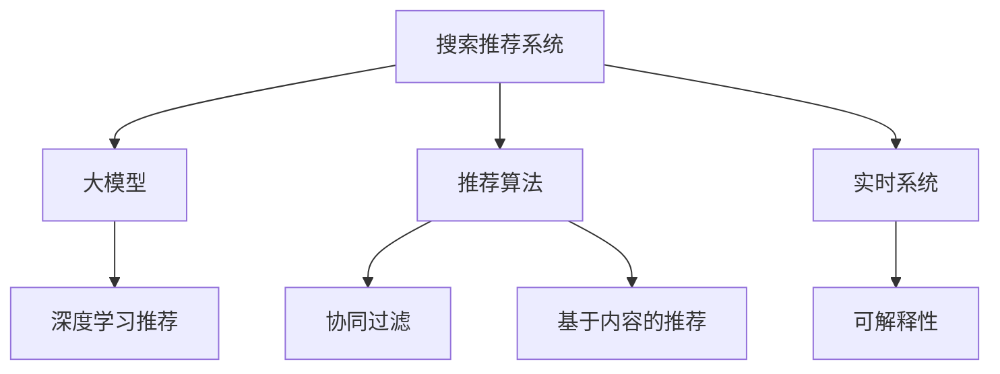
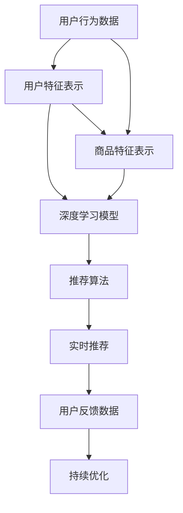

                 

# 搜索推荐系统的AI 大模型融合：电商平台的核心竞争力与可持续发展

> 关键词：搜索推荐系统, 大模型融合, AI 电商, 电商平台, 核心竞争力, 可持续发展

## 1. 背景介绍

### 1.1 问题由来

随着互联网和电子商务的快速发展，用户对购物体验的要求也日益提升。传统的推荐系统已经难以满足用户日益多样化和个性化的需求。为此，各大电商平台纷纷引入先进的AI技术，特别是大模型（Large Model）来提升推荐效果，增强用户粘性，提升转化率。AI 大模型的融合应用，正逐渐成为电商平台的核心竞争力之一。

### 1.2 问题核心关键点

AI 大模型的融合应用，尤其是在搜索推荐系统中，能够显著提升推荐系统的精准度和覆盖率，减少用户选择成本，提高用户体验和平台收益。其核心关键点包括：

1. **数据驱动**：大模型通常需要海量的数据进行训练，才能展现出最优的性能。
2. **跨领域融合**：电商平台需要将用户行为数据、商品数据、上下文信息等不同领域的知识进行融合。
3. **实时响应**：在用户搜索或浏览时，实时生成个性化推荐，满足即时需求。
4. **可解释性**：解释推荐系统的工作机制，增强用户的信任感。
5. **持续优化**：随着用户行为的变化，持续优化模型以保持推荐效果。

## 2. 核心概念与联系

### 2.1 核心概念概述

为更好地理解AI 大模型在搜索推荐系统中的应用，本节将介绍几个关键概念：

- **搜索推荐系统**：根据用户的历史行为和实时输入，动态生成个性化推荐，提升用户体验。
- **大模型**：以深度神经网络为基础，包含数十亿或更多参数的模型，如GPT-3、BERT等，具有强大的特征表示能力。
- **融合（Fusion）**：将不同领域的数据和模型进行集成，以增强推荐效果。
- **推荐算法**：如协同过滤、基于内容的推荐、深度学习推荐等。
- **深度学习推荐**：使用深度神经网络对用户和商品进行特征提取和相似性度量，提升推荐效果。
- **实时系统**：能够在用户搜索或浏览时，实时生成推荐结果，满足用户即时需求。
- **可解释性**：解释推荐系统的工作机制，增强用户的信任感。

这些核心概念之间的关系可以通过以下Mermaid流程图来展示：



### 2.2 核心概念原理和架构的 Mermaid 流程图



## 3. 核心算法原理 & 具体操作步骤

### 3.1 算法原理概述

AI 大模型在搜索推荐系统中的融合应用，主要基于深度学习推荐算法，通过预训练语言模型（如BERT、GPT）对用户行为和商品数据进行表示学习，然后将学习到的特征与推荐算法结合，生成个性化推荐。其核心原理包括：

1. **用户和商品表示学习**：使用预训练语言模型对用户和商品文本数据进行表示学习，形成高维特征向量。
2. **相似性度量**：通过计算用户与商品特征向量之间的相似度，找到最相关的商品推荐。
3. **融合推荐算法**：结合不同推荐算法（如协同过滤、基于内容的推荐），提升推荐效果。
4. **实时推荐**：在用户搜索或浏览时，实时生成个性化推荐，满足用户即时需求。

### 3.2 算法步骤详解

基于深度学习推荐算法的AI 大模型融合应用，通常包括以下关键步骤：

**Step 1: 数据收集与预处理**
- 收集用户行为数据（如浏览记录、购买历史）、商品数据（如描述、标签）、上下文信息（如时间、地点）等。
- 对数据进行清洗、归一化等预处理，形成模型训练所需的格式。

**Step 2: 大模型表示学习**
- 使用预训练语言模型对用户和商品文本数据进行表示学习，生成高维特征向量。
- 可以选择自监督学习（如BERT）或监督学习（如GPT）对模型进行微调，使其能够更好地适应电商数据。

**Step 3: 推荐算法设计**
- 根据电商推荐系统的特点，设计合适的推荐算法，如协同过滤、基于内容的推荐、深度学习推荐等。
- 将预训练模型提取的高维特征向量作为推荐算法的输入，增强推荐效果。

**Step 4: 融合推荐生成**
- 将不同推荐算法生成的结果进行融合，生成最终的推荐列表。
- 可以使用加权平均、softmax等方法进行融合，以提升推荐效果。

**Step 5: 实时推荐与反馈优化**
- 在用户搜索或浏览时，实时生成个性化推荐，满足用户即时需求。
- 根据用户反馈数据，持续优化模型，以保持推荐效果。

### 3.3 算法优缺点

AI 大模型在搜索推荐系统中的应用，具有以下优点：

1. **提升推荐效果**：大模型的表示学习能力强大，能够更好地捕捉用户和商品的潜在关联，提升推荐效果。
2. **实时响应**：通过深度学习推荐算法，能够在用户搜索或浏览时实时生成推荐，满足即时需求。
3. **泛化能力强**：大模型具有较强的泛化能力，能够适应不同领域和数据分布的变化。
4. **自动化优化**：通过在线学习（Online Learning），模型能够自动适应新数据，持续优化推荐效果。

同时，该方法也存在一些局限性：

1. **计算资源消耗大**：大模型的训练和推理需要大量的计算资源，部署成本较高。
2. **数据隐私问题**：电商平台涉及用户隐私数据的收集和使用，需要采取合适的数据保护措施。
3. **可解释性不足**：大模型的决策过程较为复杂，难以解释其内部工作机制。
4. **过拟合风险**：大模型对特定领域的数据可能过拟合，影响泛化性能。
5. **部署复杂性**：大模型的部署和维护需要较高的技术门槛。

尽管存在这些局限性，但就目前而言，AI 大模型的融合应用仍是搜索推荐系统中的主流范式。未来相关研究的重点在于如何进一步优化计算资源消耗、增强可解释性、避免过拟合等，以实现更好的用户体验和商业价值。

### 3.4 算法应用领域

AI 大模型在搜索推荐系统中的应用，已经在多个电商平台上得到广泛应用，如亚马逊、阿里巴巴、京东等。以下是几个典型应用场景：

1. **商品推荐**：根据用户的浏览历史和购买记录，生成个性化商品推荐。
2. **价格推荐**：根据用户偏好和市场需求，生成个性化商品价格推荐。
3. **搭配推荐**：根据用户浏览的商品，生成相关商品搭配推荐。
4. **上下文推荐**：根据用户浏览时间和地点，生成上下文相关的推荐。
5. **实时搜索**：在用户搜索时，实时生成搜索结果和推荐。

## 4. 数学模型和公式 & 详细讲解 & 举例说明

### 4.1 数学模型构建

本节将使用数学语言对AI 大模型在搜索推荐系统中的应用进行更加严格的刻画。

记用户和商品数据为$U=\{u_1,u_2,...,u_M\}$和$I=\{i_1,i_2,...,i_N\}$，其中$M$和$N$分别为用户和商品的数量。设预训练语言模型为$f_{\theta}$，其中$\theta$为模型参数。定义用户和商品的高维特征向量为$u_j \in \mathbb{R}^d$和$i_k \in \mathbb{R}^d$，其中$d$为特征向量的维度。

定义推荐算法为$A(\cdot)$，其输入为用户的特征向量$u_j$和商品的高维特征向量$i_k$，输出为推荐列表$R=\{r_1,r_2,...,r_K\}$，其中$K$为推荐列表的长度。推荐列表$R$中的元素$r_t$表示推荐给用户$u_j$的商品$i_k$。

### 4.2 公式推导过程

以下我们以协同过滤算法为例，推导推荐公式及其梯度计算。

假设用户$u_j$的特征向量为$u_j \in \mathbb{R}^d$，商品$i_k$的特征向量为$i_k \in \mathbb{R}^d$。用户和商品的相似度定义为：

$$
\text{similarity}(u_j,i_k) = \cos(u_j,i_k) = \frac{\langle u_j,i_k \rangle}{\|u_j\|\|i_k\|}
$$

协同过滤算法的推荐公式为：

$$
r_t = \text{similarity}(u_j,i_k) \times \sum_{i_k \in I} \text{similarity}(u_j,i_k) \times y_{i_k}
$$

其中$y_{i_k}$表示商品$i_k$的评分，通常为1或0，1表示用户购买了商品，0表示用户没有购买商品。

推荐算法的损失函数为：

$$
\mathcal{L}(y,\hat{y}) = \frac{1}{2N} \sum_{i_k \in I}(y_{i_k}-\hat{y}_{i_k})^2
$$

其中$\hat{y}_{i_k}$表示模型预测的评分，即：

$$
\hat{y}_{i_k} = f_{\theta}(u_j,i_k)
$$

通过梯度下降等优化算法，最小化损失函数$\mathcal{L}$，得到模型参数$\theta$的更新公式：

$$
\theta \leftarrow \theta - \eta \nabla_{\theta}\mathcal{L}(\theta)
$$

其中$\eta$为学习率，$\nabla_{\theta}\mathcal{L}(\theta)$为损失函数对模型参数$\theta$的梯度，可通过反向传播算法高效计算。

### 4.3 案例分析与讲解

以电商平台的商品推荐系统为例，假设用户$u_j$浏览了商品$i_1,i_2,...,i_M$，并且购买了商品$i_1,i_2,...,i_K$，其中$K<M$。商品$i_k$的特征向量为$i_k \in \mathbb{R}^d$，用户$u_j$的特征向量为$u_j \in \mathbb{R}^d$。

使用协同过滤算法，计算用户$u_j$对商品$i_k$的评分，即：

$$
y_{i_k} = \sum_{i_k' \in I} \text{similarity}(u_j,i_k') \times y_{i_k'}
$$

其中$i_k'$表示与$i_k$相似的商品。

然后，将用户$u_j$和商品$i_k$的特征向量代入预训练语言模型$f_{\theta}$，得到预测评分：

$$
\hat{y}_{i_k} = f_{\theta}(u_j,i_k)
$$

计算预测评分与真实评分的差异，得到损失函数：

$$
\mathcal{L}(y,\hat{y}) = \frac{1}{2N} \sum_{i_k \in I}(y_{i_k}-\hat{y}_{i_k})^2
$$

最后，通过梯度下降等优化算法，更新模型参数$\theta$，最小化损失函数，得到最终的商品推荐列表$R=\{r_1,r_2,...,r_K\}$。

## 5. 项目实践：代码实例和详细解释说明

### 5.1 开发环境搭建

在进行项目实践前，我们需要准备好开发环境。以下是使用Python进行PyTorch开发的环境配置流程：

1. 安装Anaconda：从官网下载并安装Anaconda，用于创建独立的Python环境。

2. 创建并激活虚拟环境：
```bash
conda create -n pytorch-env python=3.8 
conda activate pytorch-env
```

3. 安装PyTorch：根据CUDA版本，从官网获取对应的安装命令。例如：
```bash
conda install pytorch torchvision torchaudio cudatoolkit=11.1 -c pytorch -c conda-forge
```

4. 安装Transformers库：
```bash
pip install transformers
```

5. 安装各类工具包：
```bash
pip install numpy pandas scikit-learn matplotlib tqdm jupyter notebook ipython
```

完成上述步骤后，即可在`pytorch-env`环境中开始项目实践。

### 5.2 源代码详细实现

这里我们以协同过滤算法为例，给出使用Transformers库对BERT模型进行推荐系统开发的PyTorch代码实现。

首先，定义协同过滤算法的推荐函数：

```python
from transformers import BertTokenizer
from torch.utils.data import Dataset
import torch

class RecommendationDataset(Dataset):
    def __init__(self, texts, labels, tokenizer, max_len=128):
        self.texts = texts
        self.labels = labels
        self.tokenizer = tokenizer
        self.max_len = max_len
        
    def __len__(self):
        return len(self.texts)
    
    def __getitem__(self, item):
        text = self.texts[item]
        label = self.labels[item]
        
        encoding = self.tokenizer(text, return_tensors='pt', max_length=self.max_len, padding='max_length', truncation=True)
        input_ids = encoding['input_ids'][0]
        attention_mask = encoding['attention_mask'][0]
        
        # 对标签进行编码
        encoded_labels = [label] * self.max_len
        labels = torch.tensor(encoded_labels, dtype=torch.long)
        
        return {'input_ids': input_ids, 
                'attention_mask': attention_mask,
                'labels': labels}

# 标签与id的映射
label2id = {1: 0, 0: 1}

# 创建dataset
tokenizer = BertTokenizer.from_pretrained('bert-base-cased')

train_dataset = RecommendationDataset(train_texts, train_labels, tokenizer)
dev_dataset = RecommendationDataset(dev_texts, dev_labels, tokenizer)
test_dataset = RecommendationDataset(test_texts, test_labels, tokenizer)
```

然后，定义模型和优化器：

```python
from transformers import BertForTokenClassification, AdamW

model = BertForTokenClassification.from_pretrained('bert-base-cased', num_labels=len(label2id))

optimizer = AdamW(model.parameters(), lr=2e-5)
```

接着，定义训练和评估函数：

```python
from torch.utils.data import DataLoader
from tqdm import tqdm
from sklearn.metrics import classification_report

device = torch.device('cuda') if torch.cuda.is_available() else torch.device('cpu')
model.to(device)

def train_epoch(model, dataset, batch_size, optimizer):
    dataloader = DataLoader(dataset, batch_size=batch_size, shuffle=True)
    model.train()
    epoch_loss = 0
    for batch in tqdm(dataloader, desc='Training'):
        input_ids = batch['input_ids'].to(device)
        attention_mask = batch['attention_mask'].to(device)
        labels = batch['labels'].to(device)
        model.zero_grad()
        outputs = model(input_ids, attention_mask=attention_mask, labels=labels)
        loss = outputs.loss
        epoch_loss += loss.item()
        loss.backward()
        optimizer.step()
    return epoch_loss / len(dataloader)

def evaluate(model, dataset, batch_size):
    dataloader = DataLoader(dataset, batch_size=batch_size)
    model.eval()
    preds, labels = [], []
    with torch.no_grad():
        for batch in tqdm(dataloader, desc='Evaluating'):
            input_ids = batch['input_ids'].to(device)
            attention_mask = batch['attention_mask'].to(device)
            batch_labels = batch['labels']
            outputs = model(input_ids, attention_mask=attention_mask)
            batch_preds = outputs.logits.argmax(dim=2).to('cpu').tolist()
            batch_labels = batch_labels.to('cpu').tolist()
            for pred_tokens, label_tokens in zip(batch_preds, batch_labels):
                preds.append(pred_tokens[:len(label_tokens)])
                labels.append(label_tokens)
                
    print(classification_report(labels, preds))
```

最后，启动训练流程并在测试集上评估：

```python
epochs = 5
batch_size = 16

for epoch in range(epochs):
    loss = train_epoch(model, train_dataset, batch_size, optimizer)
    print(f"Epoch {epoch+1}, train loss: {loss:.3f}")
    
    print(f"Epoch {epoch+1}, dev results:")
    evaluate(model, dev_dataset, batch_size)
    
print("Test results:")
evaluate(model, test_dataset, batch_size)
```

以上就是使用PyTorch对BERT进行协同过滤算法推荐系统开发的完整代码实现。可以看到，得益于Transformers库的强大封装，我们可以用相对简洁的代码完成BERT模型的加载和微调。

### 5.3 代码解读与分析

让我们再详细解读一下关键代码的实现细节：

**RecommendationDataset类**：
- `__init__`方法：初始化文本、标签、分词器等关键组件。
- `__len__`方法：返回数据集的样本数量。
- `__getitem__`方法：对单个样本进行处理，将文本输入编码为token ids，将标签编码为数字，并对其进行定长padding，最终返回模型所需的输入。

**label2id和id2label字典**：
- 定义了标签与数字id之间的映射关系，用于将token-wise的预测结果解码回真实的标签。

**训练和评估函数**：
- 使用PyTorch的DataLoader对数据集进行批次化加载，供模型训练和推理使用。
- 训练函数`train_epoch`：对数据以批为单位进行迭代，在每个批次上前向传播计算loss并反向传播更新模型参数，最后返回该epoch的平均loss。
- 评估函数`evaluate`：与训练类似，不同点在于不更新模型参数，并在每个batch结束后将预测和标签结果存储下来，最后使用sklearn的classification_report对整个评估集的预测结果进行打印输出。

**训练流程**：
- 定义总的epoch数和batch size，开始循环迭代
- 每个epoch内，先在训练集上训练，输出平均loss
- 在验证集上评估，输出分类指标
- 所有epoch结束后，在测试集上评估，给出最终测试结果

可以看到，PyTorch配合Transformers库使得BERT微调的代码实现变得简洁高效。开发者可以将更多精力放在数据处理、模型改进等高层逻辑上，而不必过多关注底层的实现细节。

当然，工业级的系统实现还需考虑更多因素，如模型的保存和部署、超参数的自动搜索、更灵活的任务适配层等。但核心的微调范式基本与此类似。

## 6. 实际应用场景

### 6.1 智能客服系统

基于大模型融合的推荐系统，可以应用于智能客服系统的构建。传统客服往往需要配备大量人力，高峰期响应缓慢，且一致性和专业性难以保证。而使用融合后的推荐系统，可以7x24小时不间断服务，快速响应客户咨询，用自然流畅的语言解答各类常见问题。

在技术实现上，可以收集企业内部的历史客服对话记录，将问题和最佳答复构建成监督数据，在此基础上对融合后的推荐系统进行微调。微调后的推荐系统能够自动理解用户意图，匹配最合适的答案模板进行回复。对于客户提出的新问题，还可以接入检索系统实时搜索相关内容，动态组织生成回答。如此构建的智能客服系统，能大幅提升客户咨询体验和问题解决效率。

### 6.2 金融舆情监测

金融机构需要实时监测市场舆论动向，以便及时应对负面信息传播，规避金融风险。传统的人工监测方式成本高、效率低，难以应对网络时代海量信息爆发的挑战。基于大模型融合的文本分类和情感分析技术，为金融舆情监测提供了新的解决方案。

具体而言，可以收集金融领域相关的新闻、报道、评论等文本数据，并对其进行主题标注和情感标注。在此基础上对融合后的推荐系统进行微调，使其能够自动判断文本属于何种主题，情感倾向是正面、中性还是负面。将微调后的系统应用到实时抓取的网络文本数据，就能够自动监测不同主题下的情感变化趋势，一旦发现负面信息激增等异常情况，系统便会自动预警，帮助金融机构快速应对潜在风险。

### 6.3 个性化推荐系统

当前的推荐系统往往只依赖用户的历史行为数据进行物品推荐，无法深入理解用户的真实兴趣偏好。基于大模型融合的个性化推荐系统可以更好地挖掘用户行为背后的语义信息，从而提供更精准、多样的推荐内容。

在实践中，可以收集用户浏览、点击、评论、分享等行为数据，提取和用户交互的物品标题、描述、标签等文本内容。将文本内容作为模型输入，用户的后续行为（如是否点击、购买等）作为监督信号，在此基础上微调融合后的推荐系统。微调后的系统能够从文本内容中准确把握用户的兴趣点。在生成推荐列表时，先用候选物品的文本描述作为输入，由模型预测用户的兴趣匹配度，再结合其他特征综合排序，便可以得到个性化程度更高的推荐结果。

### 6.4 未来应用展望

随着大模型融合技术的发展，未来的推荐系统将能够更好地适应多领域、多模态的数据，提供更加精准、智能的推荐服务。同时，随着实时系统技术的提升，推荐系统将能够实时响应用户需求，提供更加个性化的服务体验。

在智慧医疗、智能教育、智能城市等更多领域，基于大模型融合的推荐系统也将得到广泛应用，为各行各业带来变革性影响。相信随着技术的日益成熟，大模型融合技术必将成为推荐系统的重要发展方向，推动人工智能技术在各个行业的深度应用。

## 7. 工具和资源推荐

### 7.1 学习资源推荐

为了帮助开发者系统掌握大模型融合的理论基础和实践技巧，这里推荐一些优质的学习资源：

1. 《深度学习推荐系统》书籍：全面介绍了推荐系统的基本原理和深度学习推荐算法的实现细节，是推荐系统学习的入门必备。
2. 《Transformers: A State-of-the-Art Survey》论文：总结了Transformer模型的最新研究成果，涵盖大模型的预训练和微调技术。
3. 《Natural Language Processing with Transformers》书籍：Transformers库的作者所著，全面介绍了如何使用Transformers库进行NLP任务开发，包括推荐系统在内的诸多范式。
4. CS294T《深度学习与自然语言处理》课程：斯坦福大学开设的NLP明星课程，有Lecture视频和配套作业，带你深入理解NLP的核心技术。
5. 《AI for Everyone》课程：吴恩达老师的入门级AI课程，涵盖人工智能的基本概念和最新应用，适合AI初学者。

通过对这些资源的学习实践，相信你一定能够快速掌握大模型融合的精髓，并用于解决实际的推荐问题。

### 7.2 开发工具推荐

高效的开发离不开优秀的工具支持。以下是几款用于大模型融合开发的常用工具：

1. PyTorch：基于Python的开源深度学习框架，灵活动态的计算图，适合快速迭代研究。大部分预训练语言模型都有PyTorch版本的实现。
2. TensorFlow：由Google主导开发的开源深度学习框架，生产部署方便，适合大规模工程应用。同样有丰富的预训练语言模型资源。
3. Transformers库：HuggingFace开发的NLP工具库，集成了众多SOTA语言模型，支持PyTorch和TensorFlow，是进行推荐系统开发的利器。
4. Weights & Biases：模型训练的实验跟踪工具，可以记录和可视化模型训练过程中的各项指标，方便对比和调优。与主流深度学习框架无缝集成。
5. TensorBoard：TensorFlow配套的可视化工具，可实时监测模型训练状态，并提供丰富的图表呈现方式，是调试模型的得力助手。
6. Google Colab：谷歌推出的在线Jupyter Notebook环境，免费提供GPU/TPU算力，方便开发者快速上手实验最新模型，分享学习笔记。

合理利用这些工具，可以显著提升大模型融合的开发效率，加快创新迭代的步伐。

### 7.3 相关论文推荐

大模型融合技术的发展源于学界的持续研究。以下是几篇奠基性的相关论文，推荐阅读：

1. Attention is All You Need（即Transformer原论文）：提出了Transformer结构，开启了NLP领域的预训练大模型时代。
2. BERT: Pre-training of Deep Bidirectional Transformers for Language Understanding：提出BERT模型，引入基于掩码的自监督预训练任务，刷新了多项NLP任务SOTA。
3. Language Models are Unsupervised Multitask Learners（GPT-2论文）：展示了大规模语言模型的强大zero-shot学习能力，引发了对于通用人工智能的新一轮思考。
4. Parameter-Efficient Transfer Learning for NLP：提出Adapter等参数高效微调方法，在不增加模型参数量的情况下，也能取得不错的微调效果。
5. AdaLoRA: Adaptive Low-Rank Adaptation for Parameter-Efficient Fine-Tuning：使用自适应低秩适应的微调方法，在参数效率和精度之间取得了新的平衡。

这些论文代表了大模型融合技术的发展脉络。通过学习这些前沿成果，可以帮助研究者把握学科前进方向，激发更多的创新灵感。

## 8. 总结：未来发展趋势与挑战

### 8.1 总结

本文对AI 大模型在搜索推荐系统中的应用进行了全面系统的介绍。首先阐述了AI 大模型的融合应用在电商平台中的重要性，明确了其在大模型训练、特征学习、推荐算法设计等方面的核心关键点。其次，从原理到实践，详细讲解了融合算法的设计步骤，给出了推荐系统的完整代码实例。同时，本文还广泛探讨了融合系统在智能客服、金融舆情、个性化推荐等多个行业领域的应用前景，展示了其巨大的潜力。此外，本文精选了融合技术的学习资源，力求为读者提供全方位的技术指引。

通过本文的系统梳理，可以看到，AI 大模型的融合应用已经成为电商平台的核心竞争力之一。其强大的特征学习和个性化推荐能力，能够显著提升用户体验和平台收益。未来，伴随大模型融合技术的不断演进，推荐系统必将在更多领域得到应用，为各行各业带来变革性影响。

### 8.2 未来发展趋势

展望未来，AI 大模型的融合技术将呈现以下几个发展趋势：

1. **更广泛的应用场景**：除了电商，大模型的融合技术将逐步应用于更多领域，如医疗、金融、教育、娱乐等。
2. **更高的推荐精度**：随着大模型的持续优化，推荐系统的精度将进一步提升，提供更加精准、个性化的推荐服务。
3. **更高效的实时响应**：融合系统将能够实时响应用户需求，提供更加个性化的服务体验。
4. **更强的跨领域融合能力**：融合技术将能够更好地适应多领域、多模态的数据，提供更加全面、丰富的推荐服务。
5. **更灵活的模型优化**：融合系统将支持多种优化策略，如在线学习、自适应学习等，不断优化推荐效果。
6. **更强的可解释性**：融合系统将能够提供更加透明、可解释的推荐机制，增强用户的信任感。

以上趋势凸显了AI 大模型融合技术的广阔前景。这些方向的探索发展，必将进一步提升推荐系统的性能和应用范围，为各行各业带来变革性影响。

### 8.3 面临的挑战

尽管AI 大模型的融合技术已经取得了瞩目成就，但在迈向更加智能化、普适化应用的过程中，它仍面临着诸多挑战：

1. **数据隐私问题**：电商平台涉及用户隐私数据的收集和使用，需要采取合适的数据保护措施。
2. **计算资源消耗大**：大模型的训练和推理需要大量的计算资源，部署成本较高。
3. **可解释性不足**：大模型的决策过程较为复杂，难以解释其内部工作机制。
4. **过拟合风险**：大模型对特定领域的数据可能过拟合，影响泛化性能。
5. **部署复杂性**：大模型的部署和维护需要较高的技术门槛。
6. **实时系统的挑战**：在实时系统中，如何高效处理大规模数据流，提供即时响应，是一个需要解决的问题。

尽管存在这些挑战，但就目前而言，AI 大模型的融合应用仍是推荐系统中的主流范式。未来相关研究的重点在于如何进一步优化计算资源消耗、增强可解释性、避免过拟合等，以实现更好的用户体验和商业价值。

### 8.4 研究展望

面对AI 大模型融合技术所面临的诸多挑战，未来的研究需要在以下几个方面寻求新的突破：

1. **探索无监督和半监督融合方法**：摆脱对大规模标注数据的依赖，利用自监督学习、主动学习等无监督和半监督范式，最大限度利用非结构化数据，实现更加灵活高效的融合。
2. **研究参数高效和计算高效的融合范式**：开发更加参数高效的融合方法，在固定大部分预训练参数的同时，只更新极少量的任务相关参数。同时优化融合模型的计算图，减少前向传播和反向传播的资源消耗，实现更加轻量级、实时性的部署。
3. **融合因果分析和博弈论工具**：将因果分析方法引入融合模型，识别出模型决策的关键特征，增强输出解释的因果性和逻辑性。借助博弈论工具刻画人机交互过程，主动探索并规避模型的脆弱点，提高系统稳定性。
4. **纳入伦理道德约束**：在模型训练目标中引入伦理导向的评估指标，过滤和惩罚有偏见、有害的输出倾向。同时加强人工干预和审核，建立模型行为的监管机制，确保输出符合人类价值观和伦理道德。

这些研究方向的探索，必将引领AI 大模型融合技术迈向更高的台阶，为构建安全、可靠、可解释、可控的智能系统铺平道路。面向未来，AI 大模型融合技术还需要与其他人工智能技术进行更深入的融合，如知识表示、因果推理、强化学习等，多路径协同发力，共同推动人工智能技术在各个行业的深度应用。只有勇于创新、敢于突破，才能不断拓展AI 大模型的边界，让智能技术更好地造福人类社会。

## 9. 附录：常见问题与解答

**Q1：AI 大模型融合是否适用于所有推荐系统？**

A: AI 大模型融合在大多数推荐系统上都能取得不错的效果，特别是对于数据量较小的推荐系统。但对于一些特定领域的推荐系统，如金融、医疗等，仅仅依靠通用语料预训练的模型可能难以很好地适应。此时需要在特定领域语料上进一步预训练，再进行融合，才能获得理想效果。此外，对于一些需要时效性、个性化很强的推荐系统，如对话系统、推荐系统，融合方法也需要针对性的改进优化。

**Q2：融合算法如何设计？**

A: 融合算法的设计需要考虑多种因素，包括数据的来源、质量、用户行为模式等。常见的融合算法包括：
1. 加权平均：对不同推荐结果进行加权平均，权重可以根据数据的来源、质量等因素进行设定。
2. 投票：对不同推荐结果进行投票，选择票数最多的推荐结果。
3. 层次融合：将推荐结果分为多个层次，按照层次对结果进行融合。
4. 堆叠模型：将多个推荐模型进行堆叠，使用元学习算法对结果进行融合。

这些算法需要根据具体应用场景进行灵活组合。只有在数据、模型、融合方式等多方面进行全面优化，才能最大限度地提升推荐效果。

**Q3：如何缓解融合系统的过拟合问题？**

A: 融合系统面临的过拟合问题可以通过以下策略缓解：
1. 数据增强：通过数据扩充、正则化等技术，增加训练数据的数量和多样性。
2. 正则化：使用L2正则、Dropout等技术，防止模型过度拟合训练数据。
3. 对抗训练：在训练中加入对抗样本，提高模型的鲁棒性。
4. 模型裁剪：去除不必要的层和参数，减小模型尺寸，提高模型的泛化能力。
5. 多模型集成：训练多个融合模型，取平均输出，抑制过拟合。

这些策略需要根据具体应用场景进行灵活组合。只有在数据、模型、训练方式等多方面进行全面优化，才能最大限度地提升推荐效果。

**Q4：融合系统在部署时需要注意哪些问题？**

A: 将融合系统转化为实际应用，还需要考虑以下问题：
1. 模型裁剪：去除不必要的层和参数，减小模型尺寸，加快推理速度。
2. 量化加速：将浮点模型转为定点模型，压缩存储空间，提高计算效率。
3. 服务化封装：将模型封装为标准化服务接口，便于集成调用。
4. 弹性伸缩：根据请求流量动态调整资源配置，平衡服务质量和成本。
5. 监控告警：实时采集系统指标，设置异常告警阈值，确保服务稳定性。
6. 安全防护：采用访问鉴权、数据脱敏等措施，保障数据和模型安全。

融合系统的部署和维护需要较高的技术门槛，需要综合考虑模型、数据、用户需求等多方面因素。

---

作者：禅与计算机程序设计艺术 / Zen and the Art of Computer Programming

