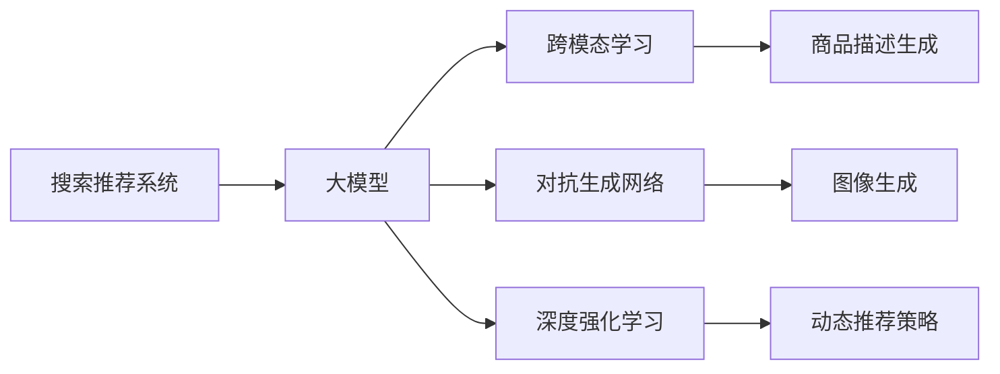

                 

# 搜索推荐系统的AI 大模型融合：电商平台的核心竞争力与可持续增长战略

## 1. 背景介绍

在当今快速变化的数字经济时代，电子商务平台正迅速崛起，成为零售业的主流渠道。为了满足用户日益多样化和个性化的需求，电商平台必须构建高效的搜索推荐系统。传统的基于规则和手工特征的推荐方法已经难以满足需求，而人工智能，特别是基于深度学习的推荐算法正在逐渐取代这些传统方法。

搜索推荐系统（Search & Recommendation System）通过分析用户的历史行为、兴趣偏好和实时环境数据，为用户推荐个性化的商品或内容，从而显著提升用户满意度、延长用户停留时间，并增加用户转化率。然而，这些推荐算法的高效运行依赖于海量的数据和复杂的计算，这对计算资源提出了严苛的要求。

随着深度学习和人工智能技术的迅猛发展，大模型在推荐系统中的应用日益受到关注。大模型，特别是基于Transformer架构的语言模型和视觉模型，凭借其强大的表达能力和泛化能力，为推荐系统的优化和提升提供了全新的路径。本文将介绍如何将大模型融合到搜索推荐系统中，并探索如何通过AI大模型的融合实现电商平台的核心竞争力和可持续增长战略。

## 2. 核心概念与联系

### 2.1 核心概念概述

为更好地理解搜索推荐系统中大模型的应用，本文将介绍几个关键概念及其之间的联系：

- **搜索推荐系统**：通过用户行为数据和商品属性数据，利用机器学习算法为用户推荐商品或内容的系统。

- **大模型（Large Model）**：指参数规模巨大的神经网络模型，如BERT、GPT、DALL·E等。这些模型通过大规模无标签数据预训练获得广泛的通用知识，能够处理各种复杂任务。

- **跨模态学习（Cross-modal Learning）**：指将不同模态的数据（如文本、图像、语音）进行融合，以提升推荐系统的综合性能。

- **对抗生成网络（GAN）**：一种生成模型，通过两个神经网络，一个生成器和一个判别器，进行对抗训练，生成逼真的数据。

- **深度强化学习（Deep Reinforcement Learning）**：通过学习策略，最大化长期累积奖励的一种机器学习方法。

这些核心概念之间的逻辑关系可以通过以下Mermaid流程图来展示：



这个流程图展示了搜索推荐系统与大模型的联系：

1. 大模型通过预训练获得通用的知识，从而提升推荐系统的泛化能力。
2. 跨模态学习利用大模型处理多模态数据，增强推荐结果的相关性。
3. 对抗生成网络用于生成商品描述和图像，丰富推荐内容的多样性。
4. 深度强化学习通过策略优化，提升推荐系统的实时性和精准度。

## 3. 核心算法原理 & 具体操作步骤

### 3.1 算法原理概述

基于大模型的搜索推荐系统融合了预训练和微调两种技术。首先，通过大规模无标签数据预训练获得基础模型，然后在有标签的推荐数据集上进行微调，以适配推荐任务。具体步骤如下：

1. **数据准备**：收集用户历史行为数据、商品属性数据和实时环境数据。
2. **预训练模型选择**：选择适合的任务（如推荐商品、生成商品描述等）的大模型作为初始化参数。
3. **微调模型构建**：在预训练模型的基础上，构建适应推荐任务的任务适配层。
4. **训练和优化**：使用推荐数据集进行有监督训练，最小化推荐任务的目标函数。
5. **部署和应用**：将训练好的模型部署到推荐系统中，进行实时推荐。

### 3.2 算法步骤详解

以下将详细介绍基于大模型的搜索推荐系统的算法步骤。

**步骤1：数据准备**

推荐系统的数据主要分为三类：

- **用户数据**：包括用户ID、历史浏览记录、点击记录、购买记录等。
- **商品数据**：包括商品ID、属性（如颜色、尺寸、价格等）、商品描述等。
- **实时环境数据**：包括当前时间、节假日、天气、位置等。

数据处理步骤如下：

- 收集数据：从电商平台的数据仓库中收集相关数据。
- 数据清洗：去除缺失数据、异常值和噪声数据，保证数据质量。
- 特征工程：提取有意义的特征，如用户行为特征、商品属性特征和时间特征等。

**步骤2：预训练模型选择**

选择适合任务的大模型作为初始化参数。大模型的选择取决于推荐任务的特点，常见的选择包括：

- 使用BERT等语言模型进行文本处理，如商品描述生成。
- 使用GPT等生成模型进行动态推荐，如生成商品推荐理由。
- 使用DALL·E等视觉模型进行图像处理，如生成商品图片。

**步骤3：微调模型构建**

在预训练模型的基础上，构建适应推荐任务的任务适配层。通常包括：

- 输入层：处理用户数据和商品数据。
- 编码层：将输入转换为模型可处理的格式，如使用BERT进行编码。
- 输出层：根据推荐任务设计合适的输出，如使用线性回归进行价格预测。

**步骤4：训练和优化**

使用推荐数据集进行有监督训练，最小化推荐任务的目标函数。目标函数通常包括：

- 损失函数：如均方误差、交叉熵等，用于衡量模型预测与真实标签之间的差异。
- 优化器：如Adam、SGD等，用于更新模型参数。

训练步骤如下：

- 划分训练集、验证集和测试集。
- 定义损失函数和优化器。
- 使用训练集进行前向传播和反向传播。
- 在验证集上进行性能评估，调整模型参数。
- 在测试集上进行最终测试，评估模型效果。

**步骤5：部署和应用**

将训练好的模型部署到推荐系统中，进行实时推荐。具体步骤如下：

- 模型加载：从模型存储路径加载预训练模型和微调模型。
- 输入处理：处理用户输入，提取特征。
- 模型推理：将特征输入模型，进行预测。
- 结果输出：将预测结果输出给推荐引擎。
- 实时调整：根据实时环境数据和用户反馈，实时调整推荐策略。

### 3.3 算法优缺点

基于大模型的搜索推荐系统具有以下优点：

1. **泛化能力强**：大模型在处理各种复杂任务时表现优异，提升了推荐系统的泛化能力。
2. **性能提升显著**：通过微调，大模型可以显著提升推荐系统的精度和效果。
3. **适用性强**：适用于各种推荐任务，包括商品推荐、内容推荐等。

同时，该方法也存在以下缺点：

1. **计算资源要求高**：预训练和微调过程需要大量的计算资源。
2. **数据需求大**：微调需要大量有标签的推荐数据，收集和标注数据成本较高。
3. **模型复杂度高**：大模型结构复杂，训练和推理速度较慢。
4. **风险较高**：模型依赖于数据质量，数据偏差可能影响模型性能。

尽管存在这些局限性，但基于大模型的推荐系统已经在电商、新闻、视频等多个领域取得了显著的成效，成为推荐系统的主流范式。未来相关研究将聚焦于如何进一步降低计算成本和数据需求，同时提升模型的实时性和可解释性，以进一步优化推荐系统。

### 3.4 算法应用领域

基于大模型的搜索推荐系统已经广泛应用于以下领域：

1. **电商平台推荐**：通过分析用户历史行为和商品属性，为用户推荐个性化的商品。
2. **新闻推荐**：通过用户浏览记录和文章属性，为用户推荐感兴趣的新闻。
3. **视频推荐**：通过用户观看记录和视频属性，为用户推荐感兴趣的视频。
4. **智能客服**：通过对话历史和用户属性，为用户推荐相关产品或服务。
5. **金融推荐**：通过用户交易记录和产品属性，为用户推荐适合的金融产品。

除了上述这些经典应用外，大模型的推荐技术还正在不断拓展到更多领域中，如广告推荐、游戏推荐等，为数字经济的增长提供了新的动力。

## 4. 数学模型和公式 & 详细讲解 & 举例说明

### 4.1 数学模型构建

基于大模型的推荐系统可以抽象为以下数学模型：

- **输入层**：$x = (x_u, x_i)$，其中$x_u$为用户数据，$x_i$为商品数据。
- **编码层**：$h = f(x)$，其中$f$为预训练模型，$h$为编码向量。
- **输出层**：$y = g(h)$，其中$g$为任务适配层，$y$为推荐结果。

推荐任务的目标函数通常包括：

- **交叉熵损失**：$\mathcal{L}_{\text{cross-entropy}} = -\frac{1}{N}\sum_{i=1}^N \sum_{j=1}^C y_{ij}\log(p_{ij})$，其中$N$为样本数量，$C$为类别数量，$y_{ij}$为真实标签，$p_{ij}$为模型预测概率。
- **均方误差损失**：$\mathcal{L}_{\text{mse}} = \frac{1}{N}\sum_{i=1}^N ||y_i - \hat{y}_i||^2$，其中$y_i$为真实标签，$\hat{y}_i$为模型预测结果。

### 4.2 公式推导过程

以商品价格预测为例，推导基于大模型的推荐系统的公式。

**输入层**：$x = (x_u, x_i)$，其中$x_u$为用户历史行为数据，$x_i$为商品属性数据。

**编码层**：使用BERT进行编码，得到编码向量$h$。

**输出层**：定义一个线性回归模型$y = g(h) = W\cdot h + b$，其中$W$为权重矩阵，$b$为偏置项。

**目标函数**：均方误差损失$\mathcal{L} = \frac{1}{N}\sum_{i=1}^N ||y_i - \hat{y}_i||^2$。

**优化目标**：最小化目标函数$\mathcal{L}$，得到最优权重矩阵$W$和偏置项$b$。

根据梯度下降算法，得到权重矩阵和偏置项的更新公式：

$$
W \leftarrow W - \eta \nabla_{W}\mathcal{L} - \eta\lambda W
$$
$$
b \leftarrow b - \eta \nabla_{b}\mathcal{L} - \eta\lambda b
$$

其中，$\eta$为学习率，$\lambda$为正则化系数。

### 4.3 案例分析与讲解

以电商平台商品推荐为例，展示如何使用大模型进行微调。

假设用户$u$对商品$i$的评分$y_{ui}$已标注，且$y_{ui} \in [1,5]$。

- **输入层**：$x = (x_u, x_i)$，其中$x_u$为用户评分数据，$x_i$为商品属性数据。
- **编码层**：使用BERT进行编码，得到编码向量$h$。
- **输出层**：定义一个线性回归模型$y = g(h) = W\cdot h + b$。

**目标函数**：均方误差损失$\mathcal{L} = \frac{1}{N}\sum_{i=1}^N ||y_i - \hat{y}_i||^2$。

**优化目标**：最小化目标函数$\mathcal{L}$，得到最优权重矩阵$W$和偏置项$b$。

训练步骤如下：

- 划分训练集、验证集和测试集。
- 定义损失函数和优化器。
- 使用训练集进行前向传播和反向传播。
- 在验证集上进行性能评估，调整模型参数。
- 在测试集上进行最终测试，评估模型效果。

## 5. 项目实践：代码实例和详细解释说明

### 5.1 开发环境搭建

在进行搜索推荐系统的大模型融合实践前，我们需要准备好开发环境。以下是使用Python进行TensorFlow开发的环境配置流程：

1. 安装Anaconda：从官网下载并安装Anaconda，用于创建独立的Python环境。

2. 创建并激活虚拟环境：
```bash
conda create -n tf-env python=3.8 
conda activate tf-env
```

3. 安装TensorFlow：从官网获取对应的安装命令，如：
```bash
pip install tensorflow-gpu -f https://tfhub.dev/google/announcement
```

4. 安装TensorBoard：用于可视化模型训练状态和评估结果。
```bash
pip install tensorboard
```

5. 安装Flax：基于JAX的深度学习库，支持大模型的高效训练和推理。
```bash
pip install flax
```

6. 安装Flax-haiku：基于Flax的高级抽象库，方便构建复杂的模型。
```bash
pip install flax-haiku
```

7. 安装FastFM：用于高效处理高维稀疏特征的数据库。
```bash
pip install fastFM
```

完成上述步骤后，即可在`tf-env`环境中开始大模型微调实践。

### 5.2 源代码详细实现

以下展示如何使用TensorFlow进行大模型融合的推荐系统实现。

首先，定义推荐系统的数据处理函数：

```python
import tensorflow as tf
import numpy as np

def load_data():
    # 加载用户行为数据和商品属性数据
    user_data = ...
    item_data = ...
    return user_data, item_data

def preprocess_data(user_data, item_data):
    # 数据预处理，如数据清洗、特征工程等
    ...
    return preprocessed_user_data, preprocessed_item_data

def get_input_fn(user_data, item_data):
    # 定义输入函数
    ...
    return input_fn
```

然后，定义模型和优化器：

```python
import flax.linen as nn

class RecommendationModel(nn.Module):
    def setup(self, user_data_dim, item_data_dim, hidden_dim, output_dim):
        self.user_encoder = nn.Dense(hidden_dim)
        self.item_encoder = nn.Dense(hidden_dim)
        self.fc1 = nn.Dense(hidden_dim)
        self.fc2 = nn.Dense(output_dim)

    def __call__(self, user_data, item_data):
        user_feature = self.user_encoder(user_data)
        item_feature = self.item_encoder(item_data)
        combined_feature = tf.concat([user_feature, item_feature], axis=-1)
        output = self.fc1(combined_feature)
        output = self.fc2(output)
        return output

model = RecommendationModel(user_data_dim, item_data_dim, hidden_dim, output_dim)
optimizer = tf.keras.optimizers.Adam(learning_rate=learning_rate)
```

接着，定义训练和评估函数：

```python
import tensorflow_datasets as tfds

def train_epoch(model, data_loader, optimizer):
    for batch in data_loader:
        with tf.GradientTape() as tape:
            predictions = model(user_data, item_data)
            loss = tf.keras.losses.mean_squared_error(y_true, predictions)
        gradients = tape.gradient(loss, model.trainable_variables)
        optimizer.apply_gradients(zip(gradients, model.trainable_variables))
    return loss

def evaluate(model, data_loader):
    predictions = model(user_data, item_data)
    mse = tf.keras.metrics.MeanSquaredError()(y_true, predictions)
    return mse.result().numpy()
```

最后，启动训练流程并在测试集上评估：

```python
epochs = 10
batch_size = 64

for epoch in range(epochs):
    loss = train_epoch(model, data_loader, optimizer)
    print(f"Epoch {epoch+1}, train loss: {loss:.3f}")
    
    print(f"Epoch {epoch+1}, test mse: {evaluate(model, test_data_loader)}")
```

以上就是使用TensorFlow进行大模型融合的推荐系统微调实践的完整代码实现。可以看到，使用TensorFlow和Flax等工具库，大模型的微调实现变得简单高效。

### 5.3 代码解读与分析

让我们再详细解读一下关键代码的实现细节：

**preprocess_data函数**：
- 处理用户行为数据和商品属性数据，如去重、数据清洗、特征提取等。

**RecommendationModel类**：
- 定义了模型结构，包括用户和商品编码器、全连接层等。
- 使用Flax库，方便构建复杂的模型。

**train_epoch函数**：
- 对数据以批为单位进行迭代，在每个批次上前向传播计算损失并反向传播更新模型参数。
- 使用TensorFlow的优化器进行参数更新。

**evaluate函数**：
- 在验证集上评估模型性能，计算平均均方误差（MSE）。

**训练流程**：
- 定义总的epoch数和batch size，开始循环迭代。
- 每个epoch内，先在训练集上训练，输出平均loss。
- 在验证集上评估，输出均方误差。
- 所有epoch结束后，在测试集上评估，给出最终测试结果。

可以看到，TensorFlow和Flax的结合，使得大模型微调的代码实现变得简洁高效。开发者可以将更多精力放在数据处理、模型改进等高层逻辑上，而不必过多关注底层的实现细节。

当然，工业级的系统实现还需考虑更多因素，如模型的保存和部署、超参数的自动搜索、更灵活的任务适配层等。但核心的微调范式基本与此类似。

## 6. 实际应用场景

### 6.1 电商平台推荐

大模型在电商平台中的应用十分广泛。通过对用户历史行为和商品属性数据进行预训练和微调，电商平台可以构建高效的商品推荐系统，显著提升用户体验和转化率。

在技术实现上，可以收集用户浏览、点击、购买等行为数据，以及商品属性数据，构建推荐数据集。将数据输入BERT等预训练模型，通过微调获得推荐模型，然后将模型集成到推荐系统中，实现实时推荐。此外，可以使用对抗生成网络生成商品描述和图片，进一步丰富推荐内容的多样性。

### 6.2 智能客服

智能客服系统通过自然语言处理和大模型融合，能够提供7x24小时不间断的服务，回答用户咨询，提升客户满意度。

在技术实现上，可以收集客服对话历史，构建对话数据集。将数据输入GPT等预训练模型，通过微调获得智能客服模型，然后将模型集成到客服系统中，实现实时对话。此外，可以使用深度强化学习优化客服对话策略，提升对话质量和用户体验。

### 6.3 个性化广告推荐

个性化广告推荐通过大模型融合，能够根据用户行为和兴趣精准推送广告，提高广告点击率和转化率。

在技术实现上，可以收集用户点击、浏览、购买等行为数据，以及广告属性数据，构建推荐数据集。将数据输入BERT等预训练模型，通过微调获得广告推荐模型，然后将模型集成到广告推荐系统中，实现实时推荐。此外，可以使用深度强化学习优化广告投放策略，提升广告效果和ROI。

### 6.4 未来应用展望

随着大模型和微调技术的不断发展，搜索推荐系统将呈现出以下几个发展趋势：

1. **多模态融合**：未来推荐系统将融合文本、图像、语音等多种模态数据，提升推荐结果的多样性和相关性。
2. **实时推荐**：通过流式数据处理和大模型融合，推荐系统可以实现实时推荐，满足用户的即时需求。
3. **个性化推荐**：通过个性化生成技术，推荐系统可以提供更加精准和个性化的推荐结果，提升用户体验。
4. **透明推荐**：通过可解释性研究，推荐系统可以实现透明推荐，用户可以了解推荐理由和依据。
5. **安全推荐**：通过隐私保护技术，推荐系统可以确保用户数据和推荐结果的安全性。

未来，大模型融合推荐系统将在更多领域得到应用，为数字经济的增长提供新的动力。大模型技术的持续创新和优化，将推动搜索推荐系统的不断进步，为人类提供更加智能和便捷的体验。

## 7. 工具和资源推荐

### 7.1 学习资源推荐

为了帮助开发者系统掌握大模型融合推荐技术，这里推荐一些优质的学习资源：

1. 《深度学习与推荐系统》：介绍深度学习在推荐系统中的应用，涵盖商品推荐、内容推荐等多个场景。
2. 《TensorFlow实战》：介绍TensorFlow的使用方法和实践案例，适合初学者和进阶开发者。
3. 《Flax：JAX的高性能深度学习库》：介绍Flax的使用方法和深度学习实践，适合深度学习开发者。
4. 《NLP与推荐系统》：介绍自然语言处理在推荐系统中的应用，涵盖文本相似度、情感分析等多个技术点。
5. 《推荐系统实战》：介绍推荐系统的设计和实现，涵盖推荐算法、推荐系统架构等多个方面。

通过对这些资源的学习实践，相信你一定能够快速掌握大模型融合推荐技术，并用于解决实际的推荐问题。

### 7.2 开发工具推荐

高效的开发离不开优秀的工具支持。以下是几款用于大模型融合推荐系统开发的常用工具：

1. TensorFlow：基于Python的开源深度学习框架，灵活动态的计算图，适合快速迭代研究。
2. PyTorch：基于Python的开源深度学习框架，支持动态计算图，适合深度学习开发者。
3. Flax：基于JAX的深度学习库，支持大模型的高效训练和推理。
4. FastFM：用于高效处理高维稀疏特征的数据库。
5. TensorBoard：TensorFlow配套的可视化工具，可实时监测模型训练状态，并提供丰富的图表呈现方式。
6. Weights & Biases：模型训练的实验跟踪工具，可以记录和可视化模型训练过程中的各项指标，方便对比和调优。

合理利用这些工具，可以显著提升大模型融合推荐系统的开发效率，加快创新迭代的步伐。

### 7.3 相关论文推荐

大模型融合推荐技术的发展源于学界的持续研究。以下是几篇奠基性的相关论文，推荐阅读：

1. Attention is All You Need：提出了Transformer结构，开启了NLP领域的预训练大模型时代。
2. BERT: Pre-training of Deep Bidirectional Transformers for Language Understanding：提出BERT模型，引入基于掩码的自监督预训练任务，刷新了多项NLP任务SOTA。
3. GPT-3：展示了大模型的强大零样本学习能力，引发了对于通用人工智能的新一轮思考。
4. Adapter：提出Adapter等参数高效微调方法，在不增加模型参数量的情况下，也能取得不错的微调效果。
5. Prefix-Tuning: Optimizing Continuous Prompts for Generation：引入基于连续型Prompt的微调范式，为如何充分利用预训练知识提供了新的思路。
6. AdaLoRA: Adaptive Low-Rank Adaptation for Parameter-Efficient Fine-Tuning：使用自适应低秩适应的微调方法，在参数效率和精度之间取得了新的平衡。

这些论文代表了大模型融合推荐技术的发展脉络。通过学习这些前沿成果，可以帮助研究者把握学科前进方向，激发更多的创新灵感。

## 8. 总结：未来发展趋势与挑战

### 8.1 研究成果总结

本文介绍了如何将大模型融合到搜索推荐系统中，并探讨了其在电商平台、智能客服、个性化广告推荐等多个领域的应用。通过大模型融合，推荐系统可以显著提升精度、速度和用户体验，推动数字经济的发展。

### 8.2 未来发展趋势

展望未来，大模型融合推荐系统将呈现以下几个发展趋势：

1. **多模态融合**：未来推荐系统将融合文本、图像、语音等多种模态数据，提升推荐结果的多样性和相关性。
2. **实时推荐**：通过流式数据处理和大模型融合，推荐系统可以实现实时推荐，满足用户的即时需求。
3. **个性化推荐**：通过个性化生成技术，推荐系统可以提供更加精准和个性化的推荐结果，提升用户体验。
4. **透明推荐**：通过可解释性研究，推荐系统可以实现透明推荐，用户可以了解推荐理由和依据。
5. **安全推荐**：通过隐私保护技术，推荐系统可以确保用户数据和推荐结果的安全性。

以上趋势凸显了大模型融合推荐技术的广阔前景。这些方向的探索发展，将进一步提升推荐系统的性能和应用范围，为数字经济的增长提供新的动力。

### 8.3 面临的挑战

尽管大模型融合推荐技术已经取得了瞩目成就，但在迈向更加智能化、普适化应用的过程中，它仍面临着诸多挑战：

1. **计算资源瓶颈**：大模型融合推荐系统需要大量的计算资源，对于硬件设备和网络带宽的要求较高。
2. **数据质量问题**：推荐系统依赖于高质量的数据，数据偏差可能影响模型的泛化能力。
3. **实时性要求高**：推荐系统需要实时处理和推荐，对系统响应时间和延迟有较高要求。
4. **模型复杂度高**：大模型融合推荐系统结构复杂，训练和推理速度较慢。
5. **可解释性不足**：推荐系统往往是黑盒系统，难以解释其内部工作机制和决策逻辑。
6. **安全性问题**：推荐系统可能面临数据泄露、用户隐私保护等安全风险。

尽管存在这些挑战，但大模型融合推荐技术已经在电商、新闻、视频等多个领域取得了显著的成效，成为推荐系统的主流范式。未来相关研究将聚焦于如何进一步降低计算成本和数据需求，同时提升模型的实时性和可解释性，以进一步优化推荐系统。

### 8.4 研究展望

面对大模型融合推荐技术所面临的挑战，未来的研究需要在以下几个方面寻求新的突破：

1. **多模态数据融合**：通过引入多种模态数据，提升推荐系统的综合性能。
2. **实时数据处理**：通过流式数据处理和大模型融合，实现实时推荐。
3. **个性化推荐技术**：通过个性化生成技术，提供更加精准和个性化的推荐结果。
4. **透明推荐**：通过可解释性研究，实现透明推荐，用户可以了解推荐理由和依据。
5. **安全推荐**：通过隐私保护技术，确保用户数据和推荐结果的安全性。
6. **可解释性和可控性**：通过可解释性研究，提升推荐系统的可解释性和可控性。

这些研究方向的探索，必将引领大模型融合推荐技术迈向更高的台阶，为构建智能推荐系统铺平道路。面向未来，大模型融合推荐技术还需要与其他人工智能技术进行更深入的融合，如知识表示、因果推理、强化学习等，多路径协同发力，共同推动推荐系统的进步。只有勇于创新、敢于突破，才能不断拓展推荐系统的边界，让智能技术更好地造福人类社会。

## 9. 附录：常见问题与解答

**Q1：大模型融合推荐系统是否适用于所有推荐任务？**

A: 大模型融合推荐系统适用于大多数推荐任务，特别是对于数据量较大的任务。但对于一些特定领域的任务，如医学、法律等，仅仅依靠通用语料预训练的模型可能难以很好地适应。此时需要在特定领域语料上进一步预训练，再进行微调，才能获得理想效果。

**Q2：如何选择合适的学习率？**

A: 大模型融合推荐系统的高效运行依赖于合适的学习率。通常，大模型学习率应设置为预训练模型学习率的1/10左右，如BERT等模型的学习率为1e-4，则大模型的学习率可设置为0.001。在使用Adam优化器时，学习率初始值可设置为1e-4，逐步减小学习率，直至收敛。

**Q3：在推荐系统中如何处理高维稀疏特征？**

A: 高维稀疏特征是推荐系统中常见的数据类型，可以使用FastFM等工具库进行高效处理。FastFM通过将高维稀疏特征映射到低维空间，提升计算效率，同时保留特征信息。

**Q4：推荐系统中如何进行多模态融合？**

A: 多模态融合是大模型融合推荐系统的重要技术之一。在推荐系统中，可以使用多种模态数据进行融合，如文本、图像、音频等。可以使用BERT等预训练模型处理文本数据，使用VGG等预训练模型处理图像数据，使用Wav2Vec等预训练模型处理音频数据，然后将多模态特征进行拼接，输入到深度神经网络中进行推荐。

**Q5：如何缓解推荐系统中的过拟合问题？**

A: 推荐系统中的过拟合问题通常可以通过数据增强、正则化等技术进行缓解。数据增强可以通过随机打乱、旋转、裁剪等方法扩充训练集，防止过拟合。正则化可以通过L2正则、Dropout等方法，避免模型过拟合。

这些技术结合使用，可以在大模型融合推荐系统中显著提升模型性能，提升推荐系统的泛化能力和实际效果。通过不断优化数据处理、模型设计和算法实现，大模型融合推荐系统将为数字经济带来更多价值。

