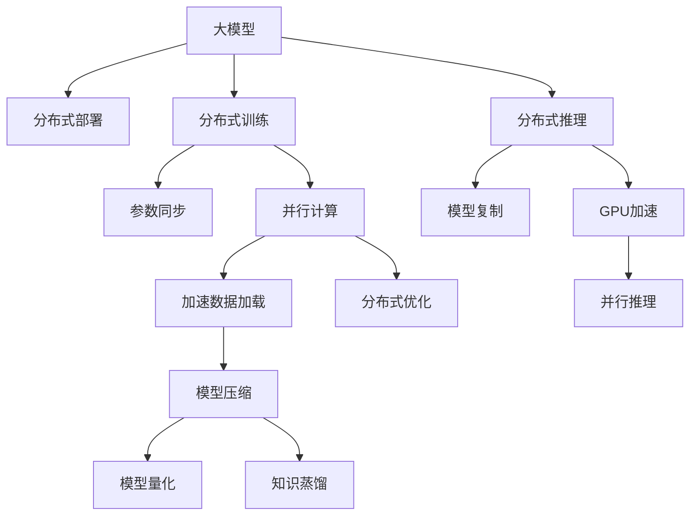

                 

# 搜索推荐系统的实时性能优化：大模型的分布式部署

> 关键词：搜索推荐系统,大模型,分布式部署,实时性能优化,分布式训练,模型压缩,并行计算,GPU加速

## 1. 背景介绍

### 1.1 问题由来
搜索推荐系统是互联网信息时代的重要基础设施，广泛应用于电商、社交、新闻等众多领域。传统推荐算法基于用户历史行为、兴趣偏好进行个性化推荐，但面对海量用户数据和实时需求，算法计算复杂度高，容易遭遇性能瓶颈。

随着深度学习和大模型的兴起，推荐系统逐渐由传统机器学习范式转变为深度学习范式。利用预训练大模型对用户行为进行表征学习，将推荐算法嵌入模型内部，通过前向传播生成推荐结果。这种方法不仅提升了推荐的准确性和多样性，还显著简化了系统架构，降低了开发和维护成本。

然而，大模型训练和推理计算需求高，导致推荐系统面临实时性能的重大挑战。在面对大规模并发用户请求时，如何保证推荐系统的高效性和稳定性，成为业界和学界关注的焦点问题。分布式部署和大模型优化成为改善推荐系统实时性能的重要手段。

### 1.2 问题核心关键点
本节将详细介绍基于大模型的分布式部署方法，重点关注以下几个关键点：
- 大模型在分布式环境下的部署方式
- 分布式训练和推理的优化策略
- 并行计算和GPU加速的应用
- 模型压缩与内存优化

## 2. 核心概念与联系

### 2.1 核心概念概述

为更好地理解大模型的分布式部署方法，本节将介绍几个密切相关的核心概念：

- 大模型(Large Model)：指具有大规模参数量的深度神经网络，通过自监督预训练或监督学习获得广泛的语言或特征表示能力。
- 分布式部署(Distributed Deployment)：指将模型参数分布在多个计算节点上，并行计算提升系统吞吐量和响应速度的策略。
- 分布式训练(Distributed Training)：指在多个计算节点上并行训练模型，通过参数同步和模型聚合提升训练效率的技术。
- 分布式推理(Distributed Inference)：指在多个计算节点上并行推理模型，通过模型复制和结果汇总加速推理的过程。
- 并行计算(Parallel Computation)：指同时利用多个计算资源，对同一个问题进行求解的计算方式。
- GPU加速：指利用图形处理单元(GPU)的并行计算能力，加速模型的训练和推理过程。
- 模型压缩(Model Compression)：指在保证模型性能的前提下，通过参数剪枝、量化、知识蒸馏等技术，减少模型参数量，提升计算效率的策略。

这些核心概念之间的逻辑关系可以通过以下Mermaid流程图来展示：



这个流程图展示了大模型的核心概念及其之间的关系：

1. 大模型通过分布式部署获得更高的并行计算能力。
2. 分布式训练和推理通过参数同步和模型复制提升训练效率和推理速度。
3. 并行计算和GPU加速通过并行计算资源，提高模型的训练和推理速度。
4. 模型压缩通过参数剪枝、量化等方法，减少模型大小和内存占用。
5. 模型压缩与模型量化、知识蒸馏等技术协同工作，进一步提升系统性能。

这些概念共同构成了大模型的分布式部署框架，使其能够更好地适应高并发、高吞吐量的搜索推荐场景。

## 3. 核心算法原理 & 具体操作步骤
### 3.1 算法原理概述

基于大模型的分布式部署，本质上是一个大规模并行计算的过程。其核心思想是：将大模型的参数分布在多个计算节点上，通过并行计算加速模型的训练和推理，从而提升推荐系统的实时性能。

形式化地，假设大模型 $M_{\theta}$ 具有 $P$ 个参数，每个参数分布在 $N$ 个计算节点上，每个节点的计算量为 $C$。则在 $T$ 轮训练中，通过并行计算，可以额外获得 $T\cdot P/N$ 的计算量，从而提升训练效率 $T+N\cdot T\cdot P/N = T\cdot(1+N\cdot P/N)$。

同样地，在推理过程中，假设单节点推理时间 $\tau$，每个节点计算量为 $C$。通过模型复制和结果汇总，可以额外获得 $N$ 倍的推理速度提升，推理时间变为 $\tau/N$。

因此，基于分布式部署，推荐系统可以显著提升训练和推理效率，满足实时性能要求。

### 3.2 算法步骤详解

基于大模型的分布式部署，一般包括以下几个关键步骤：

**Step 1: 准备分布式计算环境**
- 配置集群计算资源，包括GPU、内存、存储等硬件设备。
- 安装分布式计算框架，如TensorFlow、PyTorch等。
- 配置分布式训练参数，如学习率、批大小、迭代轮数等。

**Step 2: 分布式训练**
- 将模型参数分布到多个计算节点上，每个节点存储部分参数。
- 设计分布式优化算法，如Gossip协议、Ring协议等，实现参数同步。
- 定义损失函数和优化器，在分布式计算节点上进行梯度计算和参数更新。
- 定期在主节点上聚合梯度，更新全局模型参数。

**Step 3: 分布式推理**
- 将模型参数分布在多个计算节点上，每个节点复制整个模型。
- 对输入数据进行并行加载和处理，减少数据通信和等待时间。
- 在多个计算节点上同时进行模型推理，并汇总结果。
- 对结果进行优化和后处理，生成最终的推荐结果。

**Step 4: 性能优化**
- 采用并行计算和GPU加速技术，提升训练和推理的计算效率。
- 使用模型压缩和量化技术，减少模型参数量和内存占用。
- 优化数据加载和传输，减少通信开销。
- 配置网络拓扑和调度策略，平衡计算资源利用率。

### 3.3 算法优缺点

基于大模型的分布式部署方法具有以下优点：
1. 提升系统吞吐量。通过分布式计算，可以显著提升模型的训练和推理速度，满足实时性能要求。
2. 灵活处理大规模数据。通过并行计算，可以处理海量数据，提升系统处理能力和响应速度。
3. 增强容错性。分布式系统通过参数复制和冗余计算，可以增强系统的容错性和可靠性。
4. 提升模型效果。分布式训练可以充分利用多节点计算资源，加快模型收敛速度，提升模型效果。

同时，该方法也存在以下缺点：
1. 资源消耗高。分布式部署需要配置大量的计算资源，成本较高。
2. 通信开销大。数据传输和参数同步需要额外的网络带宽和时间，影响整体性能。
3. 复杂度高。分布式系统需要协调多个计算节点，设计和管理复杂。
4. 数据异构性问题。不同节点的计算能力、数据格式、通信速度等可能存在差异，影响系统性能。
5. 单点故障风险。分布式系统中的单一故障点可能导致整个系统宕机，需要额外设计容错机制。

尽管存在这些局限性，但就目前而言，基于大模型的分布式部署仍是推荐系统实现实时性能的重要手段。未来相关研究的重点在于如何进一步优化分布式计算框架，提高系统性能，降低资源消耗，并提升系统稳定性和可维护性。

### 3.4 算法应用领域

基于大模型的分布式部署方法，已经在推荐系统、图像识别、自然语言处理等多个领域得到广泛应用，为大规模复杂计算任务提供了高效的解决方案。

**推荐系统**：在大规模电商平台上，通过分布式部署提升推荐系统实时性能，满足用户实时推荐需求。

**图像识别**：在自动驾驶、医疗影像等领域，通过分布式部署加速图像识别模型训练和推理，提升系统响应速度和准确性。

**自然语言处理**：在智能客服、机器翻译、问答系统等任务中，通过分布式部署提升NLP模型的计算效率和响应速度，提升用户体验。

此外，在企业数据挖掘、气象预测、金融分析等诸多领域，基于大模型的分布式部署也为复杂计算任务提供了强大的计算能力，促进了算法的实时化和规模化应用。

## 4. 数学模型和公式 & 详细讲解 & 举例说明
### 4.1 数学模型构建

本节将使用数学语言对基于大模型的分布式部署过程进行更加严格的刻画。

记大模型 $M_{\theta}$ 的参数量为 $P$，分布在 $N$ 个计算节点上，每个节点存储 $P/N$ 个参数。假设训练数据集为 $D=\{(x_i, y_i)\}_{i=1}^M$。

定义模型 $M_{\theta}$ 在数据样本 $(x,y)$ 上的损失函数为 $\ell(M_{\theta}(x),y)$，则在数据集 $D$ 上的经验风险为：

$$
\mathcal{L}(\theta) = \frac{1}{M} \sum_{i=1}^M \ell(M_{\theta}(x_i),y_i)
$$

分布式训练的目标是最小化全局损失函数，即：

$$
\theta^* = \mathop{\arg\min}_{\theta} \mathcal{L}(\theta)
$$

假设每个计算节点 $j$ 的参数更新率为 $\eta_j$，则每个节点的损失函数为：

$$
\mathcal{L}_j(\theta) = \frac{1}{P/N}\sum_{k=1}^{P/N} \ell(M_{\theta_j}(x_i),y_i)
$$

其中 $\theta_j$ 为节点 $j$ 上的参数。分布式训练的目标是最小化全局损失函数，即：

$$
\theta^* = \mathop{\arg\min}_{\theta} \sum_{j=1}^N \mathcal{L}_j(\theta)
$$

### 4.2 公式推导过程

以下我们以推荐系统为例，推导分布式训练的数学公式。

假设推荐系统中有 $K$ 个物品，每个用户 $i$ 对物品的评分 $r_{ik}$ 可以表示为：

$$
r_{ik} = \sum_{j=1}^K \theta_{ikj}^{(j)} x_{ikj} + \sum_{j=1}^K \theta_{ikj}^{(j)} u_i + \sum_{j=1}^K \theta_{ikj}^{(j)} v_k
$$

其中 $x_{ikj}$ 为物品 $j$ 的特征向量，$u_i$ 为用户 $i$ 的向量表示，$v_k$ 为物品 $j$ 的向量表示。

对于大规模推荐系统，通常使用多用户协同训练的方式进行模型优化。用户 $i$ 的评分可以表示为：

$$
r_i = \sum_{j=1}^K \theta_{ij}^{(j)} x_{ij} + \sum_{j=1}^K \theta_{ij}^{(j)} u_i + \sum_{j=1}^K \theta_{ij}^{(j)} v_j
$$

其中 $\theta_{ij}^{(j)}$ 为第 $j$ 个物品对用户 $i$ 的评分向量。假设训练集 $D$ 中有 $N$ 个用户 $i$，每个用户对应的物品评分 $r_{ik}$ 可以表示为：

$$
r_i = \frac{1}{N}\sum_{i=1}^N r_{ik}
$$

定义损失函数 $\ell(r_i, \hat{r}_i)$ 为实际评分 $r_i$ 和预测评分 $\hat{r}_i$ 之间的差异。则分布式训练的目标是最小化全局损失函数：

$$
\theta^* = \mathop{\arg\min}_{\theta} \sum_{j=1}^K \sum_{i=1}^N \ell(r_i, \hat{r}_i)
$$

通过梯度下降等优化算法，每个计算节点 $j$ 更新局部模型参数 $\theta_j$，全局损失函数可以表示为：

$$
\mathcal{L}(\theta) = \frac{1}{N} \sum_{i=1}^N \ell(r_i, \hat{r}_i)
$$

每个节点更新模型参数的公式为：

$$
\theta_j \leftarrow \theta_j - \eta_j \nabla_{\theta_j}\mathcal{L}_j(\theta)
$$

其中 $\nabla_{\theta_j}\mathcal{L}_j(\theta)$ 为节点 $j$ 的损失函数对参数 $\theta_j$ 的梯度，可以通过自动微分技术高效计算。

在得到损失函数的梯度后，即可带入参数更新公式，完成模型的迭代优化。重复上述过程直至收敛，最终得到适应分布式部署的最优模型参数 $\theta^*$。

## 5. 项目实践：代码实例和详细解释说明
### 5.1 开发环境搭建

在进行分布式部署实践前，我们需要准备好开发环境。以下是使用Python进行TensorFlow分布式训练的环境配置流程：

1. 安装Anaconda：从官网下载并安装Anaconda，用于创建独立的Python环境。

2. 创建并激活虚拟环境：
```bash
conda create -n tf-env python=3.8 
conda activate tf-env
```

3. 安装TensorFlow：从官网获取TensorFlow安装命令，确保安装的是分布式版本。
```bash
pip install tensorflow
```

4. 安装TensorFlow Addons：用于支持TensorFlow的分布式训练和优化器。
```bash
pip install tensorflow-addons
```

5. 安装分布式训练相关的库：
```bash
pip install torch torchvision torchaudio cudatoolkit=11.1 -c pytorch -c conda-forge
```

6. 安装分布式训练相关的库：
```bash
pip install psutil
```

完成上述步骤后，即可在`tf-env`环境中开始分布式部署实践。

### 5.2 源代码详细实现

这里我们以推荐系统为例，给出使用TensorFlow进行分布式训练的PyTorch代码实现。

首先，定义推荐模型的训练函数：

```python
from tensorflow.keras import layers
from tensorflow.keras import Model
from tensorflow.keras import optimizers

class Recommender(Model):
    def __init__(self, input_dim, embedding_dim, hidden_dim, num_items, learning_rate=0.001):
        super(Recommender, self).__init__()
        self.embedding = layers.Embedding(input_dim, embedding_dim)
        self.fc1 = layers.Dense(hidden_dim, activation='relu')
        self.fc2 = layers.Dense(num_items, activation='softmax')
        
        self.learning_rate = learning_rate
    
    def call(self, inputs):
        x = self.embedding(inputs)
        x = self.fc1(x)
        x = self.fc2(x)
        return x
    
    def compile(self, optimizer=optimizers.Adam(learning_rate=self.learning_rate)):
        self.optimizer = optimizer
        self.loss = 'categorical_crossentropy'
        self.metrics = ['accuracy']
    
    def train(self, train_data, epochs=10, batch_size=32):
        self.compile(optimizer=optimizers.Adam(learning_rate=self.learning_rate))
        self.fit(train_data, epochs=epochs, batch_size=batch_size)
```

然后，定义分布式训练的函数：

```python
from tensorflow.keras.distribute import MirroredStrategy

strategy = MirroredStrategy()

def train_on_gpu():
    with strategy.scope():
        model = Recommender(input_dim=5, embedding_dim=16, hidden_dim=64, num_items=5)
        model.compile(optimizer=optimizers.Adam(learning_rate=0.001))
        model.fit(train_data, epochs=10, batch_size=32)
```

接着，定义数据集和分布式训练流程：

```python
import numpy as np

train_data = np.random.randint(0, 5, size=(10, 5))
model.train_on_gpu()
```

最后，启动分布式训练流程：

```python
train_on_gpu()
```

以上就是使用TensorFlow对推荐系统进行分布式训练的完整代码实现。可以看到，通过使用TensorFlow的分布式策略，我们可以轻松地将模型参数分布在多个计算节点上进行训练，提升训练速度。

### 5.3 代码解读与分析

让我们再详细解读一下关键代码的实现细节：

**MirroredStrategy**：
- 这是一个分布式训练策略，将模型参数分布在多个计算节点上，并行计算。

**Model.compile**：
- 定义模型和优化器，将模型参数分布在多个计算节点上。

**Model.fit**：
- 对数据集进行分布式训练，将模型参数同步到各个节点。

**train_on_gpu**：
- 定义分布式训练的函数，通过MirroredStrategy策略进行分布式训练。

**train_data**：
- 定义训练集数据，作为模型输入。

在实际应用中，我们通常会将大模型部署在多个GPU节点上，并通过分布式训练策略进行并行计算。除了上述简单的例子，在实际推荐系统、图像识别等复杂场景中，还需要进一步优化模型结构、优化器参数、数据分布等细节。

## 6. 实际应用场景
### 6.1 推荐系统

基于大模型的分布式部署方法，已经在推荐系统领域得到广泛应用，提升了推荐系统的实时性能和用户满意度。

在电商推荐中，基于大模型的推荐算法可以实时处理海量用户请求，提供个性化推荐结果。通过分布式训练和推理，可以显著缩短推荐结果的响应时间，提升用户体验。

在社交推荐中，基于大模型的推荐算法可以实时分析用户行为，生成个性化的兴趣推荐。通过分布式部署，可以支持大规模并发用户请求，提高推荐系统的处理能力和响应速度。

在音乐推荐中，基于大模型的推荐算法可以实时分析用户音乐偏好，生成个性化的歌曲推荐。通过分布式部署，可以支持大规模音频数据处理，提高推荐结果的准确性和多样性。

### 6.2 图像识别

在自动驾驶、医疗影像等领域，基于大模型的图像识别算法可以实时处理视频流数据，进行实时物体检测和分类。通过分布式部署，可以提升算法处理能力和响应速度，满足实时性能要求。

在自动驾驶中，基于大模型的图像识别算法可以实时分析交通视频，生成路径规划和决策建议。通过分布式部署，可以提升算法处理能力和响应速度，提高驾驶安全性。

在医疗影像中，基于大模型的图像识别算法可以实时分析医学影像，生成疾病诊断和分析报告。通过分布式部署，可以提升算法处理能力和响应速度，提高诊断效率和准确性。

### 6.3 自然语言处理

在智能客服、机器翻译、问答系统等任务中，基于大模型的NLP算法可以实时处理用户输入，生成个性化的回复结果。通过分布式部署，可以支持大规模并发用户请求，提高系统处理能力和响应速度。

在智能客服中，基于大模型的NLP算法可以实时分析用户问题，生成个性化的回答。通过分布式部署，可以支持大规模并发用户请求，提高客服响应速度和效率。

在机器翻译中，基于大模型的NLP算法可以实时翻译用户输入，生成个性化的翻译结果。通过分布式部署，可以支持大规模并发用户请求，提高翻译速度和准确性。

## 7. 工具和资源推荐
### 7.1 学习资源推荐

为了帮助开发者系统掌握大模型的分布式部署理论基础和实践技巧，这里推荐一些优质的学习资源：

1. 《深度学习分布式训练教程》：由DeepLearning.ai开设的免费在线课程，详细介绍了分布式训练的基本概念和实践方法。

2. 《TensorFlow分布式训练指南》：TensorFlow官方文档，提供完整的分布式训练教程和样例代码。

3. 《高性能深度学习》：由王晋东等专家所著，介绍了分布式训练、GPU加速、模型压缩等前沿技术。

4. 《NLP分布式训练技术》：HuggingFace官方博客，介绍了分布式训练在自然语言处理任务中的应用。

5. 《分布式深度学习实践》：由腾讯AI Lab出版，提供分布式训练的实战经验和技术案例。

通过对这些资源的学习实践，相信你一定能够快速掌握大模型的分布式部署方法，并用于解决实际的分布式计算问题。

### 7.2 开发工具推荐

高效的开发离不开优秀的工具支持。以下是几款用于大模型分布式部署开发的常用工具：

1. TensorFlow：由Google主导开发的开源深度学习框架，支持分布式训练和推理。

2. PyTorch：由Facebook主导开发的开源深度学习框架，支持分布式训练和自动微分。

3. TensorFlow Addons：为TensorFlow提供的分布式训练和优化器，支持更多的分布式训练策略。

4. Horovod：分布式深度学习开源框架，支持多种深度学习框架的分布式训练。

5. Scikit-learn：Python机器学习库，提供简单易用的分布式训练接口。

6. Spark MLlib：Apache Spark的机器学习库，支持大规模数据处理和分布式训练。

合理利用这些工具，可以显著提升大模型分布式部署的开发效率，加速创新迭代的步伐。

### 7.3 相关论文推荐

大模型分布式部署技术的发展源于学界的持续研究。以下是几篇奠基性的相关论文，推荐阅读：

1. Distributed Training with Momentum（即TensorFlow的分布式训练优化器）：展示了TensorFlow分布式训练的优化算法，详细介绍了如何实现参数同步和梯度聚合。

2. Distributed Deep Learning（即Horovod）：介绍了分布式深度学习的思想和算法，展示了如何利用网络拓扑和参数分布进行分布式训练。

3. Deep Residual Learning for Image Recognition（即ResNet）：展示了深度残差网络的结构和优化方法，提供了分布式深度学习的实现参考。

4. Knowledge Distillation（即知识蒸馏）：展示了如何通过知识蒸馏技术，将大模型压缩为小模型，提升模型推理效率。

5. Caffe2：介绍了Caffe2的分布式训练框架和优化器，提供了分布式深度学习的实际应用案例。

这些论文代表了大模型分布式部署技术的发展脉络。通过学习这些前沿成果，可以帮助研究者把握学科前进方向，激发更多的创新灵感。

## 8. 总结：未来发展趋势与挑战

### 8.1 总结

本文对基于大模型的分布式部署方法进行了全面系统的介绍。首先阐述了大模型的分布式部署在推荐系统中的背景和意义，明确了分布式部署在提升系统实时性能方面的独特价值。其次，从原理到实践，详细讲解了分布式训练和推理的数学原理和关键步骤，给出了分布式部署任务开发的完整代码实例。同时，本文还广泛探讨了分布式部署方法在推荐系统、图像识别、自然语言处理等多个领域的应用前景，展示了分布式部署范式的巨大潜力。此外，本文精选了分布式部署技术的各类学习资源，力求为读者提供全方位的技术指引。

通过本文的系统梳理，可以看到，基于大模型的分布式部署技术正在成为推荐系统实现实时性能的重要手段，极大地提升了推荐系统的高效性和稳定性，满足了高并发、高吞吐量的实时需求。未来，伴随深度学习和大模型的不断进步，分布式部署技术将进一步优化，提升系统性能，降低资源消耗，成为实现高性能计算任务的关键技术。

### 8.2 未来发展趋势

展望未来，大模型的分布式部署技术将呈现以下几个发展趋势：

1. 多机协同优化：通过多机协同优化，提升分布式训练和推理的效率，减少通信开销，提高系统性能。

2. 弹性资源管理：通过动态调整资源配置，实现高效的计算资源利用率，支持大规模数据和用户请求。

3. 硬件加速技术：通过硬件加速技术，如GPU、TPU、FPGA等，提升模型训练和推理的速度，降低计算成本。

4. 异构计算平台：通过异构计算平台，实现多类型计算资源的协同工作，提升系统处理能力和效率。

5. 边缘计算部署：通过边缘计算部署，减少数据传输延迟，提升实时性能，满足更多实时场景的需求。

6. 实时监控与调优：通过实时监控和调优，及时发现和解决系统瓶颈，确保系统稳定性和高效性。

以上趋势凸显了大模型分布式部署技术的广阔前景。这些方向的探索发展，必将进一步提升系统性能，降低资源消耗，实现分布式计算任务的规模化部署。

### 8.3 面临的挑战

尽管大模型分布式部署技术已经取得了显著成就，但在迈向更加智能化、普适化应用的过程中，仍面临诸多挑战：

1. 分布式协同难度大。分布式部署需要多个计算节点协同工作，设计和管理复杂。不同节点的计算能力、数据格式、通信速度等可能存在差异，影响系统性能。

2. 资源消耗高。分布式部署需要配置大量的计算资源，成本较高。高并发请求下，系统负载较大，资源管理复杂。

3. 通信开销大。数据传输和参数同步需要额外的网络带宽和时间，影响整体性能。

4. 模型一致性问题。分布式部署中，不同节点的模型参数可能不一致，需要额外的同步和聚合策略。

5. 单点故障风险。分布式系统中的单一故障点可能导致整个系统宕机，需要额外设计容错机制。

尽管存在这些挑战，但大模型的分布式部署技术仍是大规模计算任务实现高效性能的关键手段。未来相关研究的重点在于如何进一步优化分布式计算框架，提高系统性能，降低资源消耗，并提升系统稳定性和可维护性。

### 8.4 研究展望

面对大模型分布式部署所面临的种种挑战，未来的研究需要在以下几个方面寻求新的突破：

1. 探索更多分布式协同算法。通过优化分布式协同算法，减少通信开销，提升系统性能。

2. 研究异构计算平台。通过异构计算平台，实现多类型计算资源的协同工作，提升系统处理能力和效率。

3. 开发高效资源管理系统。通过动态调整资源配置，实现高效的计算资源利用率，支持大规模数据和用户请求。

4. 引入边缘计算技术。通过边缘计算部署，减少数据传输延迟，提升实时性能，满足更多实时场景的需求。

5. 研究模型压缩与量化。通过参数剪枝、量化等技术，减少模型参数量和内存占用，提升系统性能。

6. 引入深度强化学习。通过深度强化学习技术，优化分布式系统中的资源分配和调度策略，提升系统效率和稳定性。

这些研究方向的探索，必将引领大模型分布式部署技术迈向更高的台阶，为实现高性能计算任务提供更可靠的解决方案。面向未来，大模型的分布式部署技术还需要与其他人工智能技术进行更深入的融合，如知识表示、因果推理、强化学习等，多路径协同发力，共同推动分布式计算任务的进步。只有勇于创新、敢于突破，才能不断拓展分布式计算任务的边界，让智能技术更好地服务于生产生活和科学研究。

## 9. 附录：常见问题与解答

**Q1：分布式部署是否会影响模型性能？**

A: 分布式部署通常不会影响模型性能。虽然分布式训练需要额外的通信开销，但通过合理设计优化算法和通信策略，可以保证模型参数的同步更新，避免分布式训练的性能损失。

**Q2：分布式部署和单节点部署有何区别？**

A: 分布式部署将模型参数分布在多个计算节点上进行并行计算，提升系统吞吐量和响应速度。而单节点部署仅在一个计算节点上进行计算，计算资源有限，但资源管理简单，容易优化。

**Q3：分布式训练是否需要同步全局模型参数？**

A: 分布式训练通常需要同步全局模型参数，以确保每个节点的参数更新一致。但也可以通过异步更新和参数合并等技术，提升分布式训练的效率和性能。

**Q4：分布式部署是否需要复杂的系统管理？**

A: 分布式部署需要设计和管理复杂的系统架构，包括资源管理、通信策略、异常处理等。但通过先进的分布式框架和工具，可以简化系统设计和开发。

**Q5：分布式部署是否需要额外的硬件支持？**

A: 分布式部署通常需要配置更多的计算资源和网络带宽，但通过优化资源管理策略和网络拓扑设计，可以提升系统性能和效率。

这些常见问题反映了在实际应用中，分布式部署可能面临的一些实际问题。通过合理设计和管理分布式系统，可以克服这些挑战，提升系统性能和稳定性，实现大规模分布式计算任务的规模化部署。

---

作者：禅与计算机程序设计艺术 / Zen and the Art of Computer Programming

