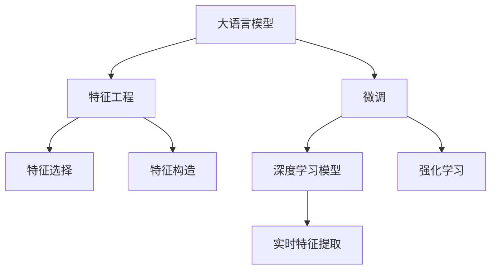

                 

## 1. 背景介绍

### 1.1 问题由来
在当下数字化时代，人们在海量信息中沉浸，搜索推荐系统成为连接用户与信息的关键工具。搜索推荐系统的核心目标是准确理解用户需求，快速提供满足用户期望的搜索结果或内容推荐。随着个性化需求日益提升，搜索推荐系统从传统的查询匹配，向更加智能化、精准化的方向发展。

传统搜索推荐系统采用基于规则或统计学习的方法，依赖于手工提取的特征。但随着数据量不断增长，特征维度也在急剧膨胀，这种做法难以应对新的挑战。与此同时，预训练模型在自然语言处理等领域取得的巨大成功，启示我们或许能够通过引入大规模预训练语言模型，实现更高效的特征工程。

### 1.2 问题核心关键点
在大规模数据上预训练得到的语言模型能够自动学习到丰富的语义表示，而无需手动设计特征。但这并不意味着直接使用大模型就能解决所有问题。预训练模型需要针对具体任务进行微调，才能充分发挥其作用。本文将重点介绍如何高效利用大语言模型，进行实时特征工程，以提升搜索推荐系统的性能。

## 2. 核心概念与联系

### 2.1 核心概念概述
本节将介绍几个与实时特征工程相关的核心概念：

- **大语言模型(Large Language Models, LLMs)**：通过大规模无监督学习得到的语言模型，如BERT、GPT等，能够从海量文本数据中学习到丰富的语言表示，具备强大的自然语言理解与生成能力。

- **特征工程(Feature Engineering)**：基于对问题理解的特征选择与构造过程，通过精心设计的特征，提高模型的预测能力。

- **微调(Fine-Tuning)**：在大语言模型的基础上，使用下游任务的数据进行有监督训练，优化模型以适应特定任务。

- **深度学习模型(Deep Learning Models)**：如神经网络、卷积神经网络(CNN)、循环神经网络(RNN)等，通过多层非线性映射，自动学习输入与输出之间的复杂映射关系。

- **强化学习(Reinforcement Learning)**：通过与环境的交互，优化模型的决策策略，提高模型在特定任务上的性能。

这些核心概念相互关联，共同构成了搜索推荐系统实时特征工程的理论基础。

### 2.2 核心概念原理和架构的 Mermaid 流程图



这个流程图展示了从大语言模型到实时特征工程的主要步骤：

1. **大语言模型**：作为预训练模型，学习丰富的语言表示。
2. **特征工程**：在大模型基础上，设计合理的特征，以提升模型性能。
3. **微调**：在大模型上针对特定任务进行有监督学习，优化模型。
4. **深度学习模型**：基于微调后的模型构建实时推荐模型。
5. **强化学习**：结合实时反馈，优化推荐策略。

## 3. 核心算法原理 & 具体操作步骤
### 3.1 算法原理概述

实时特征工程的目的是在搜索推荐系统中，基于用户的查询或行为数据，高效提取高层次语义特征，以提升模型的预测能力。通过大语言模型的预训练和微调，可以自动学习到更加丰富的语言表示，从而在特征选择与构造上取得更好效果。

基于大语言模型的实时特征工程，核心思想是：利用大模型的预训练知识，快速高效地提取输入数据的语义特征，用于模型的训练和推理。具体来说，可以分为以下几个步骤：

1. **预训练大模型**：在无标签数据上训练大语言模型，学习通用的语言表示。
2. **微调模型**：在特定任务的数据集上进行有监督微调，以适应任务需求。
3. **实时特征提取**：将用户输入数据作为大模型的输入，提取高层次语义特征。
4. **深度学习模型构建**：基于提取的特征，构建推荐模型。

### 3.2 算法步骤详解

#### 3.2.1 数据准备
数据准备是实时特征工程的首要步骤，主要包括以下内容：

- **数据收集**：收集用户的历史查询、点击、购买等行为数据，以及产品或内容的描述、标签等元数据。
- **数据清洗**：去除无关噪声数据，确保数据质量。
- **数据划分**：将数据划分为训练集、验证集和测试集，便于模型训练和评估。

#### 3.2.2 预训练模型选择
选择适合任务的大规模预训练语言模型，如BERT、GPT、RoBERTa等。通常，模型越大，包含的知识越丰富，但其计算和存储需求也越高。在实际应用中，需要根据计算资源和任务需求选择合适的模型。

#### 3.2.3 微调模型训练
微调模型训练是实时特征工程的关键步骤，主要包括以下内容：

- **任务适配层**：根据任务类型，设计合适的任务适配层，如线性分类器、注意力机制等。
- **损失函数设计**：选择或设计适合任务的损失函数，如交叉熵、均方误差等。
- **超参数设置**：选择学习率、批大小、迭代轮数等超参数，并进行调优。
- **正则化技术**：使用L2正则、Dropout等技术，防止过拟合。
- **模型评估**：在验证集上评估模型性能，及时调整超参数。

#### 3.2.4 实时特征提取
实时特征提取是实现高效特征工程的核心，主要包括以下内容：

- **输入处理**：将用户输入的查询、点击、购买等行为数据进行预处理，如分词、去除停用词、词向量化等。
- **大模型输入**：将预处理后的数据作为大模型的输入，进行特征提取。
- **特征拼接**：将提取的特征与其他特征（如时间戳、点击次数等）进行拼接，形成综合特征向量。

#### 3.2.5 深度学习模型构建
深度学习模型构建是基于提取的特征，构建推荐模型的重要步骤，主要包括以下内容：

- **模型选择**：选择或设计适合的深度学习模型，如RNN、CNN、Transformer等。
- **模型训练**：基于提取的特征，训练深度学习模型，优化模型参数。
- **模型评估**：在测试集上评估模型性能，选择最优模型。

### 3.3 算法优缺点

基于大语言模型的实时特征工程，具有以下优点：

1. **自动特征学习**：大模型能够自动学习到丰富的语义特征，避免了手动设计特征的繁琐过程。
2. **特征泛化能力**：大模型的预训练知识包含了大量领域的通用知识，可以提升特征的泛化能力。
3. **实时性高**：利用大模型的快速特征提取能力，可以在毫秒级时间内完成特征提取和模型推理。

同时，该方法也存在一些缺点：

1. **计算资源需求高**：大模型需要消耗大量计算资源，难以在低配设备上运行。
2. **模型复杂度高**：大模型参数量庞大，模型结构和推理过程较为复杂。
3. **数据需求量大**：微调模型的训练需要大量标注数据，且标注成本较高。

### 3.4 算法应用领域

基于大语言模型的实时特征工程，主要应用于以下几个领域：

- **电商推荐**：根据用户的浏览、点击、购买行为，实时推荐相关商品。
- **新闻推荐**：根据用户的阅读偏好，实时推荐感兴趣的新闻。
- **视频推荐**：根据用户的观看行为，实时推荐感兴趣的视频。
- **广告推荐**：根据用户的点击、停留等行为，实时推荐相关广告。

## 4. 数学模型和公式 & 详细讲解

### 4.1 数学模型构建

假设有一个搜索推荐系统，输入为用户的查询$q$和产品$p$，输出为产品$p$的推荐分数$r$。大语言模型的预训练和微调过程，可以表示为如下数学模型：

- **预训练模型**：$M_{\theta}(q) \in \mathbb{R}^d$，其中$d$为模型输出维度。
- **微调模型**：$H_{\phi}(q, p) \in \mathbb{R}$，其中$\phi$为微调后的模型参数。

基于微调模型的推荐分数可以表示为：

$$ r(q, p) = H_{\phi}(q, p) $$

其中$H_{\phi}$可以通过微调模型$M_{\theta}$得到。

### 4.2 公式推导过程

假设微调模型的损失函数为$\mathcal{L}(\phi)$，则在训练集$D$上的经验风险可以表示为：

$$ \mathcal{L}(\phi) = \frac{1}{N} \sum_{i=1}^N \mathcal{L}(H_{\phi}(q_i, p_i), r_i) $$

其中$\mathcal{L}$为适合任务的损失函数，如交叉熵损失、均方误差等。微调的目标是最小化损失函数$\mathcal{L}(\phi)$，即找到最优参数$\phi$：

$$ \phi^* = \mathop{\arg\min}_{\phi} \mathcal{L}(\phi) $$

在实际应用中，我们通常使用基于梯度的优化算法（如SGD、Adam等）来近似求解上述最优化问题。设$\eta$为学习率，$\lambda$为正则化系数，则参数的更新公式为：

$$ \phi \leftarrow \phi - \eta \nabla_{\phi}\mathcal{L}(\phi) - \eta\lambda\phi $$

其中$\nabla_{\phi}\mathcal{L}(\phi)$为损失函数对参数$\phi$的梯度，可通过反向传播算法高效计算。

### 4.3 案例分析与讲解

以电商平台推荐为例，我们分析如何在电商推荐场景中应用基于大语言模型的实时特征工程：

1. **数据准备**：收集用户的历史浏览、点击、购买等行为数据，以及产品的描述、价格、评分等元数据。
2. **预训练模型选择**：选择BERT、GPT等大语言模型，根据计算资源和任务需求进行模型选择。
3. **微调模型训练**：设计线性分类器作为任务适配层，选择交叉熵损失函数，在标注数据上训练微调模型。
4. **实时特征提取**：将用户查询和产品描述作为输入，提取高层次语义特征。
5. **深度学习模型构建**：选择Transformer模型作为推荐模型，在提取的特征上训练推荐模型。

## 5. 项目实践：代码实例和详细解释说明

### 5.1 开发环境搭建

在进行实时特征工程实践前，我们需要准备好开发环境。以下是使用Python进行PyTorch开发的环境配置流程：

1. 安装Anaconda：从官网下载并安装Anaconda，用于创建独立的Python环境。
```bash
conda create -n pytorch-env python=3.8
conda activate pytorch-env
```

2. 安装PyTorch：根据CUDA版本，从官网获取对应的安装命令。例如：
```bash
conda install pytorch torchvision torchaudio cudatoolkit=11.1 -c pytorch -c conda-forge
```

3. 安装Transformers库：
```bash
pip install transformers
```

4. 安装各类工具包：
```bash
pip install numpy pandas scikit-learn matplotlib tqdm jupyter notebook ipython
```

完成上述步骤后，即可在`pytorch-env`环境中开始实时特征工程实践。

### 5.2 源代码详细实现

下面我们以电商平台推荐为例，给出使用Transformers库进行实时特征工程的PyTorch代码实现。

首先，定义推荐任务的数据处理函数：

```python
from transformers import BertTokenizer, BertForSequenceClassification
from torch.utils.data import Dataset
import torch

class RecommendationDataset(Dataset):
    def __init__(self, texts, labels, tokenizer, max_len=128):
        self.texts = texts
        self.labels = labels
        self.tokenizer = tokenizer
        self.max_len = max_len
        
    def __len__(self):
        return len(self.texts)
    
    def __getitem__(self, item):
        text = self.texts[item]
        label = self.labels[item]
        
        encoding = self.tokenizer(text, return_tensors='pt', max_length=self.max_len, padding='max_length', truncation=True)
        input_ids = encoding['input_ids'][0]
        attention_mask = encoding['attention_mask'][0]
        
        # 对label进行编码
        encoded_labels = torch.tensor(label, dtype=torch.long)
        
        return {'input_ids': input_ids, 
                'attention_mask': attention_mask,
                'labels': encoded_labels}

# 标签与id的映射
label2id = {0: 'not interested', 1: 'interested'}
id2label = {v: k for k, v in label2id.items()}

# 创建dataset
tokenizer = BertTokenizer.from_pretrained('bert-base-cased')

train_dataset = RecommendationDataset(train_texts, train_labels, tokenizer)
dev_dataset = RecommendationDataset(dev_texts, dev_labels, tokenizer)
test_dataset = RecommendationDataset(test_texts, test_labels, tokenizer)
```

然后，定义模型和优化器：

```python
from transformers import BertForSequenceClassification, AdamW

model = BertForSequenceClassification.from_pretrained('bert-base-cased', num_labels=len(label2id))

optimizer = AdamW(model.parameters(), lr=2e-5)
```

接着，定义训练和评估函数：

```python
from torch.utils.data import DataLoader
from tqdm import tqdm
from sklearn.metrics import classification_report

device = torch.device('cuda') if torch.cuda.is_available() else torch.device('cpu')
model.to(device)

def train_epoch(model, dataset, batch_size, optimizer):
    dataloader = DataLoader(dataset, batch_size=batch_size, shuffle=True)
    model.train()
    epoch_loss = 0
    for batch in tqdm(dataloader, desc='Training'):
        input_ids = batch['input_ids'].to(device)
        attention_mask = batch['attention_mask'].to(device)
        labels = batch['labels'].to(device)
        model.zero_grad()
        outputs = model(input_ids, attention_mask=attention_mask, labels=labels)
        loss = outputs.loss
        epoch_loss += loss.item()
        loss.backward()
        optimizer.step()
    return epoch_loss / len(dataloader)

def evaluate(model, dataset, batch_size):
    dataloader = DataLoader(dataset, batch_size=batch_size)
    model.eval()
    preds, labels = [], []
    with torch.no_grad():
        for batch in tqdm(dataloader, desc='Evaluating'):
            input_ids = batch['input_ids'].to(device)
            attention_mask = batch['attention_mask'].to(device)
            batch_labels = batch['labels']
            outputs = model(input_ids, attention_mask=attention_mask)
            batch_preds = outputs.logits.argmax(dim=2).to('cpu').tolist()
            batch_labels = batch_labels.to('cpu').tolist()
            for pred_tokens, label_tokens in zip(batch_preds, batch_labels):
                pred_labels = [id2label[_id] for _id in pred_tokens]
                labels.append(label_tokens)
                preds.append(pred_labels)
                
    print(classification_report(labels, preds))
```

最后，启动训练流程并在测试集上评估：

```python
epochs = 5
batch_size = 16

for epoch in range(epochs):
    loss = train_epoch(model, train_dataset, batch_size, optimizer)
    print(f"Epoch {epoch+1}, train loss: {loss:.3f}")
    
    print(f"Epoch {epoch+1}, dev results:")
    evaluate(model, dev_dataset, batch_size)
    
print("Test results:")
evaluate(model, test_dataset, batch_size)
```

以上就是使用PyTorch对Bert模型进行电商平台推荐任务的实时特征工程的完整代码实现。可以看到，得益于Transformers库的强大封装，我们可以用相对简洁的代码完成Bert模型的加载和微调。

### 5.3 代码解读与分析

让我们再详细解读一下关键代码的实现细节：

**RecommendationDataset类**：
- `__init__`方法：初始化文本、标签、分词器等关键组件。
- `__len__`方法：返回数据集的样本数量。
- `__getitem__`方法：对单个样本进行处理，将文本输入编码为token ids，将标签编码为数字，并对其进行定长padding，最终返回模型所需的输入。

**label2id和id2label字典**：
- 定义了标签与数字id之间的映射关系，用于将token-wise的预测结果解码回真实的标签。

**训练和评估函数**：
- 使用PyTorch的DataLoader对数据集进行批次化加载，供模型训练和推理使用。
- 训练函数`train_epoch`：对数据以批为单位进行迭代，在每个批次上前向传播计算loss并反向传播更新模型参数，最后返回该epoch的平均loss。
- 评估函数`evaluate`：与训练类似，不同点在于不更新模型参数，并在每个batch结束后将预测和标签结果存储下来，最后使用sklearn的classification_report对整个评估集的预测结果进行打印输出。

**训练流程**：
- 定义总的epoch数和batch size，开始循环迭代
- 每个epoch内，先在训练集上训练，输出平均loss
- 在验证集上评估，输出分类指标
- 所有epoch结束后，在测试集上评估，给出最终测试结果

可以看到，PyTorch配合Transformers库使得Bert模型的实时特征工程的代码实现变得简洁高效。开发者可以将更多精力放在数据处理、模型改进等高层逻辑上，而不必过多关注底层的实现细节。

当然，工业级的系统实现还需考虑更多因素，如模型的保存和部署、超参数的自动搜索、更灵活的任务适配层等。但核心的实时特征工程流程基本与此类似。

## 6. 实际应用场景
### 6.1 电商平台推荐

实时特征工程在电商平台推荐中具有广泛应用。通过实时特征提取，可以捕捉用户当前的需求和行为模式，实时调整推荐策略，提供更加个性化和精准的商品推荐。

具体而言，可以收集用户的历史浏览、点击、购买等行为数据，以及产品或内容的描述、价格、评分等元数据。将用户查询和产品描述作为输入，提取高层次语义特征。基于提取的特征，构建推荐模型，实时预测推荐分数。最后，结合实时反馈，优化推荐策略，提升推荐效果。

### 6.2 新闻推荐

实时特征工程在新闻推荐中也具有重要应用。通过实时特征提取，可以捕捉用户对新闻的兴趣变化，实时调整推荐策略，提供更加个性化和精准的新闻推荐。

具体而言，可以收集用户的历史阅读行为数据，如浏览时间、停留时长、点击次数等。将用户的查询和新闻的标题、摘要等作为输入，提取高层次语义特征。基于提取的特征，构建推荐模型，实时预测推荐分数。最后，结合实时反馈，优化推荐策略，提升推荐效果。

### 6.3 视频推荐

实时特征工程在视频推荐中也具有重要应用。通过实时特征提取，可以捕捉用户对视频的兴趣变化，实时调整推荐策略，提供更加个性化和精准的视频推荐。

具体而言，可以收集用户的历史观看行为数据，如观看时间、点赞次数、评论次数等。将用户的查询和视频的标题、简介、标签等作为输入，提取高层次语义特征。基于提取的特征，构建推荐模型，实时预测推荐分数。最后，结合实时反馈，优化推荐策略，提升推荐效果。

### 6.4 广告推荐

实时特征工程在广告推荐中也具有重要应用。通过实时特征提取，可以捕捉用户对广告的兴趣变化，实时调整推荐策略，提供更加个性化和精准的广告推荐。

具体而言，可以收集用户的历史点击、停留等行为数据，以及广告的标题、图片、标签等元数据。将用户的查询和广告的描述作为输入，提取高层次语义特征。基于提取的特征，构建推荐模型，实时预测推荐分数。最后，结合实时反馈，优化推荐策略，提升推荐效果。

## 7. 工具和资源推荐
### 7.1 学习资源推荐

为了帮助开发者系统掌握实时特征工程的理论基础和实践技巧，这里推荐一些优质的学习资源：

1. 《深度学习》系列书籍：由Ian Goodfellow、Yoshua Bengio和Aaron Courville共同撰写，全面介绍了深度学习的基础理论和实践应用。
2. 《自然语言处理综论》（第2版）：斯坦福大学教授Christopher Manning等合著，系统介绍了自然语言处理的基本概念和前沿技术。
3. 《Python深度学习》：Francois Chollet著，介绍了使用Keras框架进行深度学习开发的方法。
4. 《Transformers：The Detailed Inside》：HuggingFace创始人Thomas Wolf著，介绍了Transformers库的内部机制和使用方法。
5. 《深度学习理论与实现》：李航著，系统介绍了深度学习的基本理论和实现方法。

通过对这些资源的学习实践，相信你一定能够快速掌握实时特征工程的精髓，并用于解决实际的推荐问题。

### 7.2 开发工具推荐

高效的开发离不开优秀的工具支持。以下是几款用于实时特征工程开发的常用工具：

1. PyTorch：基于Python的开源深度学习框架，灵活动态的计算图，适合快速迭代研究。大部分预训练语言模型都有PyTorch版本的实现。
2. TensorFlow：由Google主导开发的开源深度学习框架，生产部署方便，适合大规模工程应用。同样有丰富的预训练语言模型资源。
3. Transformers库：HuggingFace开发的NLP工具库，集成了众多SOTA语言模型，支持PyTorch和TensorFlow，是进行实时特征工程开发的利器。
4. Weights & Biases：模型训练的实验跟踪工具，可以记录和可视化模型训练过程中的各项指标，方便对比和调优。与主流深度学习框架无缝集成。
5. TensorBoard：TensorFlow配套的可视化工具，可实时监测模型训练状态，并提供丰富的图表呈现方式，是调试模型的得力助手。

合理利用这些工具，可以显著提升实时特征工程任务的开发效率，加快创新迭代的步伐。

### 7.3 相关论文推荐

实时特征工程的技术不断发展，相关论文也在不断涌现。以下是几篇奠基性的相关论文，推荐阅读：

1. Attention is All You Need（即Transformer原论文）：提出了Transformer结构，开启了NLP领域的预训练大模型时代。
2. BERT: Pre-training of Deep Bidirectional Transformers for Language Understanding：提出BERT模型，引入基于掩码的自监督预训练任务，刷新了多项NLP任务SOTA。
3. Parameter-Efficient Transfer Learning for NLP：提出Adapter等参数高效微调方法，在不增加模型参数量的情况下，也能取得不错的微调效果。
4. Knowledge Distillation for Transfer Learning：提出知识蒸馏方法，通过在学生模型上蒸馏老师模型的知识，实现模型迁移学习。
5. Attention Without Self-attention：提出自监督预训练任务，在不依赖大语言模型的情况下，也能训练出有效的特征提取器。

这些论文代表了大语言模型实时特征工程的发展脉络。通过学习这些前沿成果，可以帮助研究者把握学科前进方向，激发更多的创新灵感。

## 8. 总结：未来发展趋势与挑战

### 8.1 总结

本文对基于大语言模型的实时特征工程方法进行了全面系统的介绍。首先阐述了实时特征工程在搜索推荐系统中的重要地位，明确了实时特征工程在大语言模型微调中的应用价值。其次，从原理到实践，详细讲解了实时特征工程的数学模型和关键步骤，给出了实时特征工程任务开发的完整代码实例。同时，本文还广泛探讨了实时特征工程在电商推荐、新闻推荐、视频推荐、广告推荐等多个行业领域的应用前景，展示了实时特征工程范式的巨大潜力。此外，本文精选了实时特征工程的相关学习资源，力求为读者提供全方位的技术指引。

通过本文的系统梳理，可以看到，基于大语言模型的实时特征工程方法在大规模数据驱动的推荐系统中具有广泛应用。通过引入预训练语言模型，实时特征工程可以有效提取高层次语义特征，提升推荐模型的性能。未来，随着预训练语言模型的不断进步，实时特征工程必将进一步提升推荐系统的智能化水平，带来全新的用户体验。

### 8.2 未来发展趋势

展望未来，实时特征工程将呈现以下几个发展趋势：

1. **参数高效微调**：开发更加参数高效的微调方法，在固定大部分预训练参数的同时，只更新极少量的任务相关参数。如Prefix-Tuning、LoRA等方法。
2. **多模态融合**：将视觉、语音、文本等多种模态的信息进行融合，提升特征提取的全面性和准确性。
3. **分布式训练**：在大规模数据集上训练实时特征工程模型，需要采用分布式训练方法，以提升训练效率和模型性能。
4. **强化学习**：结合强化学习算法，优化推荐策略，提升推荐效果。如Q-learning、Deep Q-Network等。
5. **自动化调参**：采用自动调参技术，优化模型超参数，提升模型性能。如贝叶斯优化、遗传算法等。

以上趋势将进一步推动实时特征工程技术的不断进步，提升推荐系统的智能化水平。

### 8.3 面临的挑战

尽管实时特征工程在大规模推荐系统中取得了显著进展，但在实际应用中仍面临诸多挑战：

1. **计算资源需求高**：实时特征工程需要大量的计算资源，难以在低配设备上运行。
2. **模型复杂度高**：实时特征工程模型结构复杂，推理过程繁琐，难以进行高效部署。
3. **数据需求量大**：微调模型的训练需要大量标注数据，标注成本较高。
4. **实时性要求高**：实时特征工程需要在毫秒级时间内完成特征提取和模型推理，对系统的实时性要求极高。

### 8.4 研究展望

面对实时特征工程面临的挑战，未来的研究需要在以下几个方面寻求新的突破：

1. **参数高效微调**：开发更加参数高效的微调方法，在固定大部分预训练参数的同时，只更新极少量的任务相关参数。如Prefix-Tuning、LoRA等方法。
2. **多模态融合**：将视觉、语音、文本等多种模态的信息进行融合，提升特征提取的全面性和准确性。
3. **分布式训练**：在大规模数据集上训练实时特征工程模型，需要采用分布式训练方法，以提升训练效率和模型性能。
4. **自动化调参**：采用自动调参技术，优化模型超参数，提升模型性能。如贝叶斯优化、遗传算法等。

这些研究方向的探索，必将引领实时特征工程技术迈向更高的台阶，为推荐系统带来新的突破。相信随着预训练语言模型和微调方法的不断演进，实时特征工程必将进一步提升推荐系统的智能化水平，带来全新的用户体验。

## 9. 附录：常见问题与解答

**Q1：实时特征工程在大规模推荐系统中是否必要？**

A: 实时特征工程在大规模推荐系统中是必要的。大规模推荐系统涉及海量的用户数据和产品数据，仅靠统计特征很难捕捉用户行为的复杂性。实时特征工程可以通过大语言模型学习到丰富的语义表示，从用户行为中提取高层次特征，提升推荐模型的性能。

**Q2：实时特征工程对计算资源的需求是否很高？**

A: 实时特征工程对计算资源的需求确实很高。大规模推荐系统涉及海量的数据和复杂的模型，需要大量的计算资源进行训练和推理。但随着计算资源的不断丰富和优化算法的不断进步，实时特征工程正在逐步降低计算资源的消耗。

**Q3：实时特征工程是否适用于所有推荐场景？**

A: 实时特征工程可以适用于大多数推荐场景，特别是对于数据量大、用户行为复杂的情况。但对于一些简单的推荐任务，如基于标签推荐，直接使用简单的特征工程方法可能更为高效。

**Q4：实时特征工程在电商推荐中的应用有哪些？**

A: 实时特征工程在电商推荐中的应用包括：
1. 基于用户行为数据的实时推荐：根据用户的浏览、点击、购买等行为数据，实时调整推荐策略，提供更加个性化和精准的商品推荐。
2. 基于产品特征的实时推荐：根据产品的描述、价格、评分等元数据，实时调整推荐策略，提供更加个性化和精准的商品推荐。
3. 基于用户画像的实时推荐：根据用户的历史行为和画像特征，实时调整推荐策略，提供更加个性化和精准的商品推荐。

**Q5：实时特征工程在视频推荐中的应用有哪些？**

A: 实时特征工程在视频推荐中的应用包括：
1. 基于用户观看行为的实时推荐：根据用户的观看时间、点赞次数、评论次数等行为数据，实时调整推荐策略，提供更加个性化和精准的视频推荐。
2. 基于视频特征的实时推荐：根据视频的标题、简介、标签等元数据，实时调整推荐策略，提供更加个性化和精准的视频推荐。
3. 基于用户画像的实时推荐：根据用户的历史观看行为和画像特征，实时调整推荐策略，提供更加个性化和精准的视频推荐。

通过本文的系统梳理，可以看到，基于大语言模型的实时特征工程方法在大规模推荐系统中具有广泛应用。通过引入预训练语言模型，实时特征工程可以有效提取高层次语义特征，提升推荐模型的性能。未来，随着预训练语言模型的不断进步，实时特征工程必将进一步提升推荐系统的智能化水平，带来全新的用户体验。

