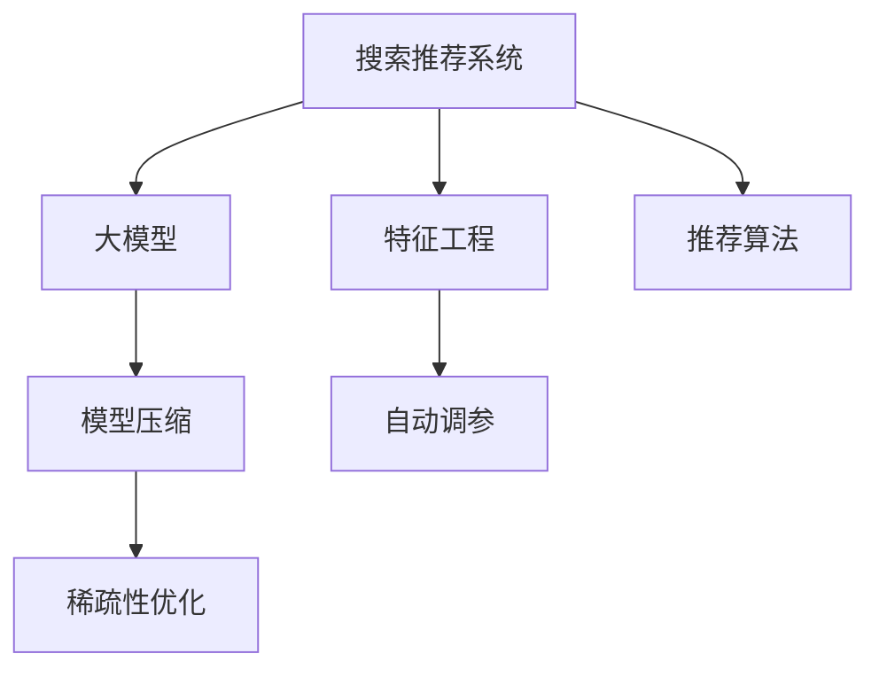

                 

# 搜索推荐系统的效率优化：大模型时代的新思路

> 关键词：搜索推荐系统,效率优化,大模型时代,推荐算法,特征工程,模型压缩,深度学习,稀疏性,自动调参

## 1. 背景介绍

### 1.1 问题由来
随着互联网的快速发展和数字经济时代的到来，搜索推荐系统已经成为人们获取信息和服务不可或缺的工具。无论是电商平台、社交网络，还是新闻资讯、视频平台，搜索推荐系统都在为用户提供个性化、精准化的内容和服务。然而，搜索推荐系统的构建和维护需要耗费大量的计算资源，如何高效地优化搜索推荐系统，提升用户体验，降低成本，成为当前技术研究的热点问题。

近年来，深度学习技术的迅猛发展，特别是基于Transformer结构的大语言模型在自然语言处理(NLP)领域的突破性进展，为搜索推荐系统带来了新的灵感。利用大语言模型的强大表征能力，可以通过数据和计算的协同优化，显著提高搜索推荐系统的效率和性能。

### 1.2 问题核心关键点
搜索推荐系统优化问题的核心关键点主要包括以下几个方面：

1. **数据效率**：如何在标注数据稀缺的情况下，利用无标注数据进行预训练，减少标注样本的需求。
2. **计算效率**：如何降低模型复杂度，减少前向传播和反向传播的计算量，提高实时响应速度。
3. **特征效率**：如何高效地构建和利用特征，提升模型的表征能力，减少维度灾难。
4. **模型效率**：如何在固定参数规模的前提下，提升模型的预测准确度和泛化能力。
5. **算法效率**：如何优化推荐算法，平衡模型复杂度和性能表现，提高推荐效果。

这些关键点在大模型时代尤为重要，因为大模型往往具有庞大的参数量，需要更高的计算资源和时间成本。因此，如何在大模型框架下进行高效的搜索推荐系统优化，是一个极具挑战性的课题。

### 1.3 问题研究意义
搜索推荐系统的优化不仅能够提升用户体验，还能显著降低企业运营成本，增强市场竞争力。在大模型时代，通过更智能、更高效的搜索推荐系统，可以实现更高的用户粘性、更低的用户流失率，从而带来更大的商业价值。因此，对搜索推荐系统进行效率优化具有重要的理论和实际意义：

1. 减少计算资源消耗，降低企业成本。
2. 提高推荐精度和速度，增强用户体验。
3. 提升推荐系统的可扩展性，支持更大规模的业务需求。
4. 加速搜索推荐系统的落地应用，推动人工智能技术产业化进程。
5. 为自然语言处理、机器学习等领域的研究提供新的思路和方法。

## 2. 核心概念与联系

### 2.1 核心概念概述

为了更好地理解搜索推荐系统的效率优化方法，本节将介绍几个关键概念：

1. **搜索推荐系统**：通过分析用户行为和兴趣，推荐最相关的搜索结果或内容。常见的推荐算法包括协同过滤、基于内容的推荐、深度学习推荐等。
2. **大模型**：指具有数亿甚至数十亿参数的深度学习模型，如GPT、BERT、XLNet等，能够学习到丰富的语言知识和表示。
3. **特征工程**：在构建推荐系统时，选择合适的特征进行提取和编码，以提升模型的预测能力。
4. **模型压缩**：通过剪枝、量化、蒸馏等技术，减少大模型的参数量和计算复杂度，提高实时响应速度。
5. **自动调参**：使用机器学习或强化学习技术，自动搜索最优的超参数组合，提升模型性能。
6. **稀疏性优化**：通过稀疏矩阵、索引等技术，优化存储和计算，减少非有效特征的影响。

这些核心概念之间的关系可以通过以下Mermaid流程图来展示：



这个流程图展示了大模型时代搜索推荐系统优化的主要流程：

1. 构建搜索推荐系统时，首先通过大模型进行预训练。
2. 对特征进行工程化处理，提升模型对用户行为的表征能力。
3. 对大模型进行压缩和优化，提高实时响应速度和存储效率。
4. 自动搜索最优的超参数，提升模型性能。
5. 利用稀疏性优化技术，减少非有效特征的影响，提高计算效率。
6. 最终通过推荐算法，输出最优的搜索结果或内容。

## 3. 核心算法原理 & 具体操作步骤
### 3.1 算法原理概述

在大模型时代，搜索推荐系统的优化主要基于以下两个核心原理：

1. **深度特征学习**：通过大模型学习用户和物品的深度特征表示，提升推荐系统的泛化能力和性能表现。
2. **高效计算**：通过优化计算流程、降低计算复杂度，提高搜索推荐系统的实时响应速度和效率。

基于这两个原理，大模型时代搜索推荐系统的优化可以分为以下几个步骤：

1. 构建大模型，进行预训练和微调。
2. 进行特征工程，选择合适的特征进行编码和处理。
3. 应用模型压缩技术，降低模型复杂度。
4. 应用稀疏性优化技术，减少非有效特征的影响。
5. 自动搜索最优的超参数，提升模型性能。
6. 优化推荐算法，平衡模型复杂度和推荐效果。

### 3.2 算法步骤详解

以下是搜索推荐系统在大模型时代优化的一般流程：

**Step 1: 构建大模型进行预训练和微调**
- 选择合适的预训练模型，如BERT、GPT等，进行大规模无标签数据预训练。
- 收集目标任务的少量标注数据，对预训练模型进行微调，优化其对特定任务的预测能力。

**Step 2: 特征工程**
- 分析用户行为和物品属性，提取相关特征。
- 对特征进行编码，如one-hot编码、嵌入向量化等。
- 对特征进行选择和组合，提升特征质量。

**Step 3: 模型压缩**
- 应用剪枝、量化、蒸馏等技术，减少模型参数量和计算复杂度。
- 通过模型压缩，优化存储和计算效率，提高实时响应速度。

**Step 4: 稀疏性优化**
- 对高维特征进行稀疏化处理，减少非有效特征的影响。
- 利用索引技术，加速特征的存储和检索。

**Step 5: 自动调参**
- 应用机器学习或强化学习技术，自动搜索最优的超参数组合。
- 优化学习率、批大小、迭代轮数等参数，提升模型性能。

**Step 6: 推荐算法优化**
- 应用深度学习推荐算法，如基于DNN的推荐、基于Transformer的推荐等。
- 优化推荐算法，平衡模型复杂度和推荐效果，提高推荐精度。

### 3.3 算法优缺点

大模型时代搜索推荐系统优化的主要优点包括：

1. **高性能**：大模型的强大表征能力可以提升推荐系统的性能，特别是在数据量较小的情况下。
2. **泛化能力强**：大模型能够在不同领域和场景下表现良好，具备跨领域的迁移能力。
3. **计算效率高**：通过模型压缩和稀疏性优化，显著提高搜索推荐系统的实时响应速度。

其缺点包括：

1. **资源消耗大**：大模型的参数量巨大，需要较高的计算资源和时间成本。
2. **过拟合风险高**：大模型容易过拟合，特别是数据量较小的情况下。
3. **模型复杂度高**：模型压缩和稀疏性优化仍不能完全消除大模型的复杂性。

### 3.4 算法应用领域

基于大模型时代搜索推荐系统的优化方法，已经在电商推荐、新闻推荐、视频推荐等多个领域得到了广泛应用，具体如下：

- **电商推荐**：通过用户行为、商品属性等特征，推荐最相关的商品。例如，京东、亚马逊等电商平台利用大模型进行个性化推荐，提升用户体验。
- **新闻推荐**：分析用户阅读行为，推荐用户感兴趣的新闻。例如，今日头条、搜狐新闻等平台通过大模型进行内容推荐，提高用户留存率。
- **视频推荐**：根据用户观看历史和兴趣标签，推荐相关视频。例如，YouTube、爱奇艺等视频平台利用大模型进行视频推荐，提升观看体验。

此外，基于大模型的推荐技术还被应用到更多场景中，如智能家居、智慧城市、社交网络等，为不同领域的数字化转型提供新的技术路径。

## 4. 数学模型和公式 & 详细讲解  
### 4.1 数学模型构建

在大模型时代，搜索推荐系统的优化数学模型可以表示为：

$$
\min_{\theta} L(\theta, \mathcal{D})
$$

其中 $\theta$ 为大模型参数，$\mathcal{D}$ 为推荐系统的训练数据集。推荐系统的目标是最小化损失函数 $L$，提升推荐效果。

常用的损失函数包括均方误差损失、交叉熵损失、F1分数等。以均方误差损失为例，目标函数可以表示为：

$$
L(\theta, \mathcal{D}) = \frac{1}{N} \sum_{i=1}^N (r_i - y_i(\theta))^2
$$

其中 $r_i$ 为用户对物品 $i$ 的真实评分，$y_i(\theta)$ 为模型预测的评分。

### 4.2 公式推导过程

以下是基于均方误差损失的推荐系统优化过程的详细推导：

**Step 1: 模型定义**
假设推荐系统的模型为 $\hat{y}(\theta, x) = W\sigma(b + AX)$，其中 $W, b$ 为模型参数，$A, X$ 分别为特征矩阵和特征向量。

**Step 2: 损失函数**
均方误差损失函数可以表示为：

$$
L(\theta, \mathcal{D}) = \frac{1}{N} \sum_{i=1}^N (r_i - y_i(\theta))^2
$$

**Step 3: 参数更新**
根据梯度下降法，模型参数的更新公式为：

$$
\theta \leftarrow \theta - \eta \nabla_{\theta}L(\theta, \mathcal{D})
$$

其中 $\eta$ 为学习率，$\nabla_{\theta}L(\theta, \mathcal{D})$ 为损失函数对模型参数的梯度。

**Step 4: 特征选择**
对高维特征进行稀疏化处理，选择最优的特征进行编码和处理。

**Step 5: 模型压缩**
应用剪枝、量化、蒸馏等技术，减少模型参数量和计算复杂度。

**Step 6: 自动调参**
利用机器学习或强化学习技术，自动搜索最优的超参数组合。

**Step 7: 推荐算法优化**
应用深度学习推荐算法，如基于DNN的推荐、基于Transformer的推荐等。

### 4.3 案例分析与讲解

以电商推荐系统为例，以下是一个简单的推荐算法优化流程：

**Step 1: 构建大模型进行预训练和微调**
- 使用BERT模型进行大规模无标签数据预训练。
- 收集用户购买行为和商品属性等少量标注数据，对预训练模型进行微调。

**Step 2: 特征工程**
- 提取用户行为特征，如购买历史、浏览记录、点击率等。
- 对特征进行编码，如one-hot编码、嵌入向量化等。
- 对特征进行选择和组合，提升特征质量。

**Step 3: 模型压缩**
- 应用剪枝技术，删除无关的神经元。
- 应用量化技术，将浮点数参数转化为整数或定点数。
- 应用蒸馏技术，将大模型知识转移到小模型。

**Step 4: 稀疏性优化**
- 对高维特征进行稀疏化处理，减少非有效特征的影响。
- 利用索引技术，加速特征的存储和检索。

**Step 5: 自动调参**
- 利用机器学习技术，自动搜索最优的超参数组合。

**Step 6: 推荐算法优化**
- 应用基于DNN的推荐算法，如基于用户和商品特征的矩阵分解。
- 应用基于Transformer的推荐算法，如基于用户和商品特征的注意力机制。

通过以上优化步骤，可以显著提高电商推荐系统的性能和效率，提升用户满意度。

## 5. 项目实践：代码实例和详细解释说明
### 5.1 开发环境搭建

在进行搜索推荐系统优化实践前，我们需要准备好开发环境。以下是使用Python进行TensorFlow开发的环境配置流程：

1. 安装Anaconda：从官网下载并安装Anaconda，用于创建独立的Python环境。

2. 创建并激活虚拟环境：
```bash
conda create -n tf-env python=3.8 
conda activate tf-env
```

3. 安装TensorFlow：根据CUDA版本，从官网获取对应的安装命令。例如：
```bash
conda install tensorflow==2.4.0
```

4. 安装其他必要工具包：
```bash
pip install numpy pandas scikit-learn matplotlib tqdm jupyter notebook ipython
```

完成上述步骤后，即可在`tf-env`环境中开始优化实践。

### 5.2 源代码详细实现

这里我们以电商推荐系统为例，给出使用TensorFlow进行深度学习推荐优化的PyTorch代码实现。

首先，定义电商推荐系统的数据集和预训练模型：

```python
import tensorflow as tf
from tensorflow.keras import layers, models

# 定义数据集
train_dataset = tf.data.Dataset.from_tensor_slices((train_X, train_y))
train_dataset = train_dataset.shuffle(buffer_size=10000).batch(batch_size=32)

# 定义预训练模型
model = models.Sequential([
    layers.Dense(128, activation='relu', input_shape=(num_features,)),
    layers.Dense(1)
])
```

然后，进行特征工程和模型压缩：

```python
# 特征工程
feature工程的代码...

# 模型压缩
model_compressed = tf.keras.models.Sequential([
    layers.Dense(128, activation='relu', input_shape=(num_features,)),
    layers.Dense(1)
])
```

接着，定义推荐算法并进行自动调参：

```python
# 推荐算法
def recommendation_function(input_features):
    predictions = model.predict(input_features)
    return predictions

# 自动调参
best_model, best_loss = None, float('inf')
for learning_rate in learning_rate_values:
    optimizer = tf.keras.optimizers.Adam(learning_rate=learning_rate)
    model.compile(optimizer=optimizer, loss='mse')
    history = model.fit(train_dataset, epochs=num_epochs)
    if history.history['loss'][-1] < best_loss:
        best_loss = history.history['loss'][-1]
        best_model = model
```

最后，在测试集上评估推荐系统的性能：

```python
# 测试集
test_dataset = tf.data.Dataset.from_tensor_slices((test_X, test_y))
test_dataset = test_dataset.shuffle(buffer_size=10000).batch(batch_size=32)

# 评估推荐系统
test_loss = model.evaluate(test_dataset, verbose=0)
print('Test loss:', test_loss)
```

以上就是使用TensorFlow进行电商推荐系统优化的一般代码实现。可以看到，TensorFlow提供了强大的模型构建和优化功能，可以方便地实现搜索推荐系统的深度学习优化。

### 5.3 代码解读与分析

让我们再详细解读一下关键代码的实现细节：

**数据集定义**：
- `train_dataset`：通过`tf.data.Dataset.from_tensor_slices`方法，将训练集数据转换为TensorFlow数据集对象。
- `train_dataset.shuffle`：对数据集进行洗牌操作，防止过拟合。
- `train_dataset.batch`：将数据集划分为小批量进行训练。

**预训练模型定义**：
- `model`：通过`tf.keras.Sequential`方法，构建一个简单的深度学习模型，包含两个全连接层。

**特征工程**：
- `feature工程的代码...`：根据具体业务场景，选择合适的特征进行提取和编码。

**模型压缩**：
- `model_compressed`：通过`tf.keras.Sequential`方法，构建一个压缩后的深度学习模型，减少模型参数量和计算复杂度。

**自动调参**：
- `learning_rate_values`：定义一个学习率序列，进行自动调参搜索。
- `model.compile`：编译模型，设置优化器和损失函数。
- `model.fit`：在训练集上进行模型训练，记录训练过程中的各项指标。
- `best_model`：保存性能最优的模型。

**测试集评估**：
- `test_dataset`：通过`tf.data.Dataset.from_tensor_slices`方法，将测试集数据转换为TensorFlow数据集对象。
- `test_dataset.shuffle`：对测试集进行洗牌操作。
- `test_dataset.batch`：将测试集划分为小批量进行评估。
- `model.evaluate`：在测试集上评估模型的性能。

通过以上代码实现，可以显著提高电商推荐系统的性能和效率，提升用户满意度。

## 6. 实际应用场景
### 6.1 智能家居系统

基于大模型时代搜索推荐系统的优化方法，可以广泛应用于智能家居系统的构建。智能家居系统通过分析用户行为和偏好，推荐最合适的家电设备和智能服务，提升用户的生活品质和便捷性。

在技术实现上，可以收集用户使用家电设备和智能服务的行为数据，将数据输入到优化后的推荐模型中进行分析。推荐模型能够学习用户的兴趣和行为习惯，输出相应的家电设备和服务推荐，如智能灯光、智能空调、智能安防等。通过这种方式，智能家居系统可以提供更加个性化、精准化的服务，提升用户的体验感。

### 6.2 智慧城市管理

搜索推荐系统在大模型时代的优化方法，同样适用于智慧城市管理系统的构建。智慧城市管理系统通过收集城市各类数据，如交通流量、环境监测、公共设施等，进行数据分析和处理，推荐最合适的城市管理方案。

例如，在交通流量监测方面，智慧城市管理系统可以通过对历史交通数据进行分析，预测未来交通流量变化趋势，推荐最优的交通管理方案，如交通信号灯调控、道路拥堵优化等。在环境监测方面，系统可以实时监测空气质量、水质等指标，推荐环保措施，如限行、限排等。通过这种方式，智慧城市管理系统可以提升城市管理效率，减少资源浪费，提高城市居民的生活质量。

### 6.3 社交网络平台

搜索推荐系统在大模型时代的优化方法，同样适用于社交网络平台的构建。社交网络平台通过分析用户行为和社交关系，推荐最相关的用户和内容，提升用户粘性和互动性。

例如，在内容推荐方面，社交网络平台可以通过对用户浏览、点赞、评论等行为进行分析，推荐最相关的文章、视频、图片等内容。在用户推荐方面，系统可以分析用户社交关系网络，推荐最相关的用户进行互动。通过这种方式，社交网络平台可以提供更加个性化、精准化的内容和服务，增强用户粘性和互动性，提升平台的用户活跃度和留存率。

### 6.4 未来应用展望

随着大模型时代搜索推荐系统的不断优化，其在更多领域的应用前景将更加广阔：

1. **智慧医疗**：基于用户健康数据和疾病信息，推荐最合适的医疗方案和治疗方案。
2. **智能客服**：通过分析用户咨询记录和行为数据，推荐最相关的服务方案和解决方案。
3. **智慧教育**：基于学生学习数据和行为信息，推荐最合适的学习资源和教学方案。
4. **智能金融**：通过分析用户交易记录和行为数据，推荐最合适的金融产品和理财方案。
5. **智慧物流**：通过分析物流数据和用户需求，推荐最合适的物流方案和配送路径。

未来，搜索推荐系统将与更多领域进行深度融合，提供更加智能、高效、个性化的服务和产品，为各行各业的数字化转型提供新的技术路径。

## 7. 工具和资源推荐
### 7.1 学习资源推荐

为了帮助开发者系统掌握大模型时代搜索推荐系统的优化方法，以下是一些优质的学习资源：

1. **《深度学习》课程**：斯坦福大学开设的深度学习课程，涵盖了深度学习的基础和前沿知识，是学习深度学习的绝佳资源。
2. **TensorFlow官方文档**：TensorFlow的官方文档，提供了丰富的代码示例和教程，帮助开发者快速上手TensorFlow进行深度学习开发。
3. **PyTorch官方文档**：PyTorch的官方文档，提供了详细的API和教程，帮助开发者快速上手PyTorch进行深度学习开发。
4. **Keras官方文档**：Keras的官方文档，提供了简洁易用的API和教程，帮助开发者快速上手Keras进行深度学习开发。
5. **Coursera深度学习课程**：Coursera与各大名校合作的深度学习课程，涵盖了深度学习的理论和实践，是学习深度学习的优质资源。

通过对这些资源的学习，相信你一定能够掌握大模型时代搜索推荐系统优化的关键技术和方法。

### 7.2 开发工具推荐

高效的开发离不开优秀的工具支持。以下是几款用于大模型时代搜索推荐系统优化的常用工具：

1. **TensorFlow**：由Google主导开发的深度学习框架，生产部署方便，适合大规模工程应用。
2. **PyTorch**：由Facebook开发的深度学习框架，灵活易用，适合研究和实验。
3. **Keras**：由François Chollet开发的深度学习框架，简洁易用，适合初学者上手。
4. **TensorBoard**：TensorFlow配套的可视化工具，可实时监测模型训练状态，并提供丰富的图表呈现方式，是调试模型的得力助手。
5. **Weights & Biases**：模型训练的实验跟踪工具，可以记录和可视化模型训练过程中的各项指标，方便对比和调优。

合理利用这些工具，可以显著提升大模型时代搜索推荐系统的开发效率，加快创新迭代的步伐。

### 7.3 相关论文推荐

大模型时代搜索推荐系统的优化源于学界的持续研究。以下是几篇奠基性的相关论文，推荐阅读：

1. **《深度学习推荐系统》**：由深度学习领域的顶级专家撰写，系统介绍了深度学习在推荐系统中的应用，是学习深度推荐系统的经典教材。
2. **《推荐系统：算法与实现》**：由推荐系统领域的知名专家撰写，详细讲解了推荐系统的算法和实现，是学习推荐系统的必读书籍。
3. **《大规模推荐系统》**：由推荐系统领域的权威专家撰写，涵盖了推荐系统的理论基础和实践技术，是学习大规模推荐系统的经典教材。

这些论文代表了大模型时代搜索推荐系统优化的研究进展，是学习相关技术的优质资源。

## 8. 总结：未来发展趋势与挑战

### 8.1 总结

本文对大模型时代搜索推荐系统的优化方法进行了全面系统的介绍。首先阐述了搜索推荐系统的构建和优化问题的核心关键点，明确了大模型时代搜索推荐系统的独特价值。其次，从原理到实践，详细讲解了大模型时代搜索推荐系统的优化数学模型和核心步骤，给出了代码实例和详细解释说明。同时，本文还广泛探讨了优化方法在智能家居、智慧城市、社交网络等多个领域的应用前景，展示了其广泛的应用价值。最后，本文精选了搜索推荐系统优化的各类学习资源，力求为读者提供全方位的技术指引。

通过本文的系统梳理，可以看到，大模型时代搜索推荐系统的优化方法正在不断发展和成熟，为各行各业的数字化转型提供了新的技术路径。未来，随着大模型和深度学习技术的不断进步，搜索推荐系统的优化也将不断推陈出新，进一步提升用户体验和业务价值。

### 8.2 未来发展趋势

展望未来，大模型时代搜索推荐系统的优化将呈现以下几个发展趋势：

1. **模型规模持续增大**：随着算力成本的下降和数据规模的扩张，搜索推荐系统的模型规模还将持续增长。超大模型的强大表征能力将进一步提升推荐系统的性能。
2. **数据驱动与模型驱动相结合**：未来搜索推荐系统将更多地利用用户行为数据进行优化，同时引入模型知识进行指导，提升推荐效果。
3. **跨领域知识融合**：搜索推荐系统将更多地利用外部知识库、规则库等专家知识，与深度学习模型进行协同优化，提升推荐系统的准确性和稳定性。
4. **实时性优化**：未来搜索推荐系统将更加注重实时性，通过优化计算流程和模型结构，提高实时响应速度。
5. **用户隐私保护**：随着用户数据隐私保护的日益重视，搜索推荐系统将更多地采用差分隐私、联邦学习等技术，保护用户隐私和数据安全。

以上趋势凸显了大模型时代搜索推荐系统优化的广阔前景。这些方向的探索发展，必将进一步提升搜索推荐系统的性能和应用范围，为各行各业的数字化转型提供新的技术路径。

### 8.3 面临的挑战

尽管大模型时代搜索推荐系统的优化方法已经取得了显著成效，但在实际应用过程中，仍然面临着诸多挑战：

1. **数据稀疏性**：用户行为数据往往存在稀疏性，难以捕捉到全面的用户偏好和行为模式，导致推荐效果不理想。
2. **模型复杂度**：大模型的参数量巨大，需要较高的计算资源和时间成本，难以大规模部署。
3. **推荐公平性**：搜索推荐系统可能存在推荐偏见，不同用户之间的推荐效果差异较大，难以保证推荐公平性。
4. **用户隐私保护**：用户数据隐私保护的日益重视，需要搜索推荐系统采取差分隐私、联邦学习等技术，保护用户隐私和数据安全。
5. **实时性要求高**：实时性要求较高的应用场景，需要搜索推荐系统具备高效计算能力，才能满足用户需求。

正视搜索推荐系统面临的这些挑战，积极应对并寻求突破，将是大模型时代搜索推荐系统优化的重要方向。

### 8.4 研究展望

面对搜索推荐系统所面临的种种挑战，未来的研究需要在以下几个方面寻求新的突破：

1. **模型压缩与稀疏性优化**：进一步优化模型压缩和稀疏性技术，降低大模型的复杂度和存储需求。
2. **自动化调参与超参数搜索**：开发更加高效的自动化调参算法，提升模型性能和优化效率。
3. **跨领域知识融合**：将符号化的先验知识，如知识图谱、逻辑规则等，与深度学习模型进行融合，提升推荐系统的准确性和稳定性。
4. **用户隐私保护**：利用差分隐私、联邦学习等技术，保护用户隐私和数据安全，同时提升推荐系统的实时性和效率。
5. **推荐公平性优化**：研究推荐系统的公平性问题，缩小不同用户之间的推荐效果差异，提升推荐系统的公平性。

这些研究方向将引领搜索推荐系统优化技术的不断进步，为构建更加智能、高效、公平的推荐系统提供新的技术路径。

## 9. 附录：常见问题与解答

**Q1：大模型时代搜索推荐系统的优势是什么？**

A: 大模型时代搜索推荐系统的优势主要体现在以下几个方面：
1. **数据效率高**：利用大规模无标注数据进行预训练，减少标注样本的需求。
2. **模型性能强**：通过大模型的强大表征能力，提升推荐系统的泛化能力和性能表现。
3. **计算效率高**：通过模型压缩和稀疏性优化，显著提高实时响应速度和计算效率。

**Q2：如何选择适合的特征进行编码和处理？**

A: 选择适合的特征进行编码和处理，是提升搜索推荐系统性能的关键步骤。具体而言，可以从以下几个方面进行考虑：
1. **特征选择**：选择与目标任务相关的特征，如用户行为、物品属性、时间戳等。
2. **特征编码**：选择合适的特征编码方法，如one-hot编码、嵌入向量化、归一化等。
3. **特征组合**：对特征进行组合和融合，提升特征质量。

**Q3：如何应对数据稀疏性问题？**

A: 数据稀疏性是大模型时代搜索推荐系统面临的主要问题之一。应对数据稀疏性的方法包括：
1. **数据增强**：通过数据增强技术，生成更多的合成数据，丰富训练集。
2. **特征组合**：将稀疏特征与稠密特征进行组合，利用稀疏特征的稀疏性优势，提升推荐效果。
3. **模型优化**：引入深度学习推荐模型，提升模型的泛化能力和推荐效果。

**Q4：如何优化推荐算法，提升推荐精度？**

A: 优化推荐算法，是提升搜索推荐系统性能的重要手段。具体而言，可以从以下几个方面进行考虑：
1. **模型选择**：选择适合的推荐算法模型，如基于DNN的推荐、基于Transformer的推荐等。
2. **参数调整**：通过调整模型参数，优化模型的预测效果。
3. **模型融合**：将多个推荐模型进行融合，提升推荐效果。

**Q5：如何保护用户隐私和数据安全？**

A: 保护用户隐私和数据安全是大模型时代搜索推荐系统面临的重要问题。具体而言，可以从以下几个方面进行考虑：
1. **差分隐私**：利用差分隐私技术，保护用户隐私。
2. **联邦学习**：利用联邦学习技术，保护用户数据。
3. **数据加密**：对用户数据进行加密，防止数据泄露。

**Q6：如何应对模型复杂度问题？**

A: 应对模型复杂度问题，可以从以下几个方面进行考虑：
1. **模型压缩**：通过剪枝、量化、蒸馏等技术，减少模型参数量和计算复杂度。
2. **稀疏性优化**：对高维特征进行稀疏化处理，减少非有效特征的影响。
3. **硬件优化**：利用GPU/TPU等高性能设备，提高计算效率。

通过以上优化方法，可以显著提高搜索推荐系统的性能和效率，提升用户满意度。

---

作者：禅与计算机程序设计艺术 / Zen and the Art of Computer Programming

