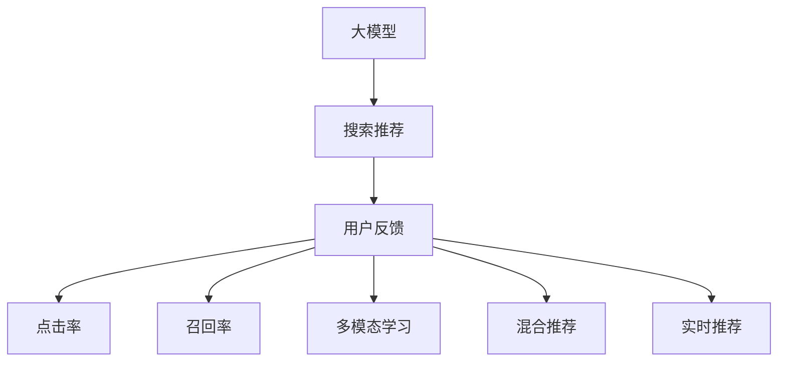

                 

# 搜索推荐系统的用户反馈机制：大模型时代的新设计

## 1. 背景介绍

### 1.1 问题由来
随着互联网的快速发展和普及，搜索引擎和推荐系统已经成为用户获取信息和娱乐的重要渠道。然而，传统的基于规则或统计模型的搜索推荐系统，往往难以准确理解用户的复杂需求和动态变化的行为模式，无法提供个性化的服务体验。

大模型的崛起，为搜索推荐系统带来了新的变革方向。通过预训练大模型，搜索引擎和推荐系统可以学习到更加丰富的语言表达能力和用户行为特征，进而提高推荐的精准度和个性化水平。但是，如何有效利用大模型的能力，获取和理解用户反馈，成为新时代的挑战。

### 1.2 问题核心关键点
搜索推荐系统的用户反馈机制是大模型时代设计的重要组成部分。基于大模型进行个性化推荐时，需要不断收集用户行为数据和反馈信息，优化推荐算法，提升用户体验。

关键点包括：
- 数据收集与存储：如何高效收集用户反馈数据，并对其进行存储和处理。
- 反馈分析与理解：如何将用户反馈转化为对推荐算法的指导和优化，实现深度学习模型的细粒度调整。
- 个性化推荐与反馈：如何在大模型推荐中引入用户反馈，构建动态更新的推荐系统。
- 系统鲁棒性与用户隐私：如何在保证系统鲁棒性的同时，保护用户隐私和数据安全。

这些关键点共同构成了大模型时代搜索推荐系统用户反馈机制的设计框架。

## 2. 核心概念与联系

### 2.1 核心概念概述

为更好地理解大模型时代搜索推荐系统用户反馈机制的设计，本节将介绍几个密切相关的核心概念：

- 大模型(Big Model)：以Transformer、BERT等为代表的超大规模预训练语言模型，通过在海量文本数据上进行预训练，学习到丰富的语言表达能力和语义关系。
- 搜索推荐系统(Search & Recommendation System, SRS)：利用用户行为数据和历史数据，为特定用户推荐感兴趣的信息系统。
- 用户反馈(User Feedback)：用户在浏览和交互过程中，通过点击、评分、留言等方式提供的反馈信息，用于优化推荐系统的算法和策略。
- 点击率(Click-Through Rate, CTR)：衡量用户对推荐内容感兴趣程度的指标，通常用于评估推荐系统的效果。
- 召回率(Recall)：衡量推荐系统是否能够覆盖用户感兴趣内容的指标，通常与CTR一起使用。
- 多模态学习(Multi-modal Learning)：结合文本、图像、音频等多种类型的数据，进行更全面的用户行为建模和推荐。
- 混合推荐系统(Hybrid Recommendation System)：将基于内容的推荐、协同过滤推荐和深度学习推荐等多种方法相结合，实现更精准的推荐。
- 实时推荐系统(Real-Time Recommendation System)：在用户行为发生的同时，实时动态更新推荐内容，提高推荐的时效性和个性化水平。

这些核心概念之间的逻辑关系可以通过以下Mermaid流程图来展示：



这个流程图展示了搜索推荐系统的主要流程和核心概念：

1. 大模型通过预训练获得语言表达能力。
2. 搜索推荐系统利用大模型进行个性化推荐。
3. 用户反馈通过点击、评分等方式提供。
4. 点击率和召回率用于评估推荐系统效果。
5. 多模态学习结合多种数据类型。
6. 混合推荐系统融合多种推荐方法。
7. 实时推荐系统动态更新推荐内容。

这些概念共同构成了搜索推荐系统和大模型时代用户反馈机制的设计基础，为其功能和性能的提升提供了指导。

## 3. 核心算法原理 & 具体操作步骤
### 3.1 算法原理概述

大模型时代搜索推荐系统的用户反馈机制，本质上是一个基于大模型的增量学习过程。其核心思想是：通过收集用户反馈数据，对预训练的大模型进行微调，优化推荐策略，提升推荐效果。

形式化地，假设预训练的大模型为 $M_{\theta}$，其中 $\theta$ 为预训练得到的模型参数。给定用户反馈数据集 $D=\{(x_i,y_i)\}_{i=1}^N$，其中 $x_i$ 为用户反馈信息，$y_i$ 为对应的推荐结果，反馈分析目标是最小化损失函数 $\mathcal{L}(\theta)$，即：

$$
\hat{\theta}=\mathop{\arg\min}_{\theta} \mathcal{L}(M_{\theta},D)
$$

通过梯度下降等优化算法，反馈分析过程不断更新模型参数 $\theta$，最小化损失函数 $\mathcal{L}$，使得推荐模型输出逼近用户期望。由于 $\theta$ 已经通过预训练获得了较好的初始化，因此即便在反馈数据量较小的情况下，也能较快收敛到理想的模型参数 $\hat{\theta}$。

### 3.2 算法步骤详解

大模型时代搜索推荐系统的用户反馈机制通常包括以下几个关键步骤：

**Step 1: 数据收集与处理**
- 收集用户反馈数据，包括点击记录、评分、留言等。数据可以来自网站、APP等用户交互界面，也可以来自第三方数据源。
- 对数据进行清洗和标准化处理，去除噪声和异常值，填充缺失值，确保数据质量和一致性。

**Step 2: 反馈分析与建模**
- 使用自然语言处理(NLP)技术对用户反馈进行分词、标注等预处理，将其转化为模型可理解的形式。
- 利用预训练的大模型进行编码和解码，获取反馈数据的语义表示。
- 设计合适的推荐模型，如深度学习模型、协同过滤模型等，并使用反馈数据对其进行训练和微调。

**Step 3: 推荐结果评估与优化**
- 使用CTR、召回率等指标评估推荐结果的质量。
- 根据评估结果，进一步调整模型参数，优化推荐策略。
- 不断迭代反馈分析与推荐优化过程，逐步提升推荐效果。

**Step 4: 用户反馈与实时调整**
- 将用户反馈实时动态地输入反馈分析模块，更新模型参数。
- 根据实时反馈数据，动态调整推荐策略，实现实时推荐。
- 在推荐过程中，不断收集用户新反馈，优化推荐效果。

### 3.3 算法优缺点

大模型时代搜索推荐系统的用户反馈机制具有以下优点：
1. 数据利用率高。通过反馈分析，可以有效利用用户行为数据，提升推荐效果。
2. 模型自适应强。大模型具备强大的自适应能力，能够根据用户反馈动态调整推荐策略。
3. 推荐效果优秀。结合大模型的语言理解能力和反馈数据的指导，推荐系统能够提供更加精准和个性化的服务。
4. 实时推荐能力。实时收集反馈和动态调整模型，实现更即时、个性化的推荐体验。

同时，该方法也存在一定的局限性：
1. 用户反馈质量依赖。反馈数据的质量和量级对推荐效果有较大影响，低质量的反馈可能反而降低推荐效果。
2. 推荐模型复杂度高。深度学习模型的复杂度较高，计算资源消耗较大。
3. 用户隐私保护难度大。反馈分析需要收集大量用户数据，隐私保护成为重要挑战。
4. 系统鲁棒性需保证。用户反馈可能包含噪声和误导信息，系统需要具备鲁棒性，防止被恶意利用。

尽管存在这些局限性，但就目前而言，基于大模型的反馈机制仍然是搜索推荐系统优化效果的重要手段。未来相关研究的重点在于如何进一步降低反馈对计算资源的需求，提高反馈数据的可用性，同时兼顾用户隐私和系统鲁棒性等因素。

### 3.4 算法应用领域

基于大模型的搜索推荐系统用户反馈机制已经在多个领域得到了应用，例如：

- 电商推荐系统：为电商网站用户推荐商品。通过用户点击、评分等反馈数据，不断优化商品推荐算法。
- 新闻推荐系统：为用户推荐新闻资讯。根据用户阅读历史和反馈，实时调整新闻推荐策略。
- 音乐推荐系统：为用户推荐歌曲。利用用户听歌历史和评分数据，优化歌曲推荐算法。
- 视频推荐系统：为用户推荐视频内容。通过用户观看历史和反馈数据，提升视频推荐效果。
- 社交媒体推荐系统：为用户推荐社交内容。结合用户点赞、分享等反馈数据，优化内容推荐策略。

除了这些典型应用外，大模型时代用户反馈机制还被创新性地应用到更多场景中，如个性化旅游推荐、智能家居控制等，为个性化服务带来了新的突破。

## 4. 数学模型和公式 & 详细讲解  
### 4.1 数学模型构建

本节将使用数学语言对大模型时代搜索推荐系统用户反馈机制的反馈分析过程进行更加严格的刻画。

记预训练大模型为 $M_{\theta}:\mathcal{X} \rightarrow \mathcal{Y}$，其中 $\mathcal{X}$ 为用户反馈数据空间，$\mathcal{Y}$ 为推荐结果空间，$\theta \in \mathbb{R}^d$ 为模型参数。假设用户反馈数据集为 $D=\{(x_i,y_i)\}_{i=1}^N$。

定义推荐模型的损失函数为 $\ell(M_{\theta}(x),y)$，则在数据集 $D$ 上的经验风险为：

$$
\mathcal{L}(\theta) = \frac{1}{N}\sum_{i=1}^N \ell(M_{\theta}(x_i),y_i)
$$

反馈分析的目标是最小化经验风险，即找到最优参数：

$$
\theta^* = \mathop{\arg\min}_{\theta} \mathcal{L}(\theta)
$$

在实践中，我们通常使用基于梯度的优化算法（如SGD、Adam等）来近似求解上述最优化问题。设 $\eta$ 为学习率，$\lambda$ 为正则化系数，则参数的更新公式为：

$$
\theta \leftarrow \theta - \eta \nabla_{\theta}\mathcal{L}(\theta) - \eta\lambda\theta
$$

其中 $\nabla_{\theta}\mathcal{L}(\theta)$ 为损失函数对参数 $\theta$ 的梯度，可通过反向传播算法高效计算。

### 4.2 公式推导过程

以下我们以用户点击行为为例，推导点击率损失函数及其梯度的计算公式。

假设模型 $M_{\theta}$ 在用户反馈数据 $x$ 上的推荐结果为 $\hat{y}=M_{\theta}(x)$，表示用户点击的概率。实际点击行为 $y \in \{0,1\}$。则点击率损失函数定义为：

$$
\ell(M_{\theta}(x),y) = -y\log \hat{y} + (1-y)\log (1-\hat{y})
$$

将其代入经验风险公式，得：

$$
\mathcal{L}(\theta) = -\frac{1}{N}\sum_{i=1}^N [y_i\log M_{\theta}(x_i)+(1-y_i)\log(1-M_{\theta}(x_i))]
$$

根据链式法则，损失函数对参数 $\theta_k$ 的梯度为：

$$
\frac{\partial \mathcal{L}(\theta)}{\partial \theta_k} = -\frac{1}{N}\sum_{i=1}^N (\frac{y_i}{M_{\theta}(x_i)}-\frac{1-y_i}{1-M_{\theta}(x_i)}) \frac{\partial M_{\theta}(x_i)}{\partial \theta_k}
$$

其中 $\frac{\partial M_{\theta}(x_i)}{\partial \theta_k}$ 可进一步递归展开，利用自动微分技术完成计算。

在得到损失函数的梯度后，即可带入参数更新公式，完成模型的迭代优化。重复上述过程直至收敛，最终得到适应用户反馈的最优模型参数 $\theta^*$。

## 5. 项目实践：代码实例和详细解释说明
### 5.1 开发环境搭建

在进行反馈机制实践前，我们需要准备好开发环境。以下是使用Python进行PyTorch开发的环境配置流程：

1. 安装Anaconda：从官网下载并安装Anaconda，用于创建独立的Python环境。

2. 创建并激活虚拟环境：
```bash
conda create -n pytorch-env python=3.8 
conda activate pytorch-env
```

3. 安装PyTorch：根据CUDA版本，从官网获取对应的安装命令。例如：
```bash
conda install pytorch torchvision torchaudio cudatoolkit=11.1 -c pytorch -c conda-forge
```

4. 安装Transformers库：
```bash
pip install transformers
```

5. 安装各类工具包：
```bash
pip install numpy pandas scikit-learn matplotlib tqdm jupyter notebook ipython
```

完成上述步骤后，即可在`pytorch-env`环境中开始反馈机制实践。

### 5.2 源代码详细实现

下面我们以电商推荐系统为例，给出使用Transformers库对BERT模型进行反馈微调的PyTorch代码实现。

首先，定义用户行为数据的处理函数：

```python
from transformers import BertTokenizer
from torch.utils.data import Dataset
import torch

class ClickDataset(Dataset):
    def __init__(self, user_ids, item_ids, click_flags, tokenizer, max_len=128):
        self.user_ids = user_ids
        self.item_ids = item_ids
        self.click_flags = click_flags
        self.tokenizer = tokenizer
        self.max_len = max_len
        
    def __len__(self):
        return len(self.user_ids)
    
    def __getitem__(self, item):
        user_id = self.user_ids[item]
        item_id = self.item_ids[item]
        click_flag = self.click_flags[item]
        
        encoding = self.tokenizer('UserID: ' + str(user_id) + ' ItemID: ' + str(item_id), return_tensors='pt', max_length=self.max_len, padding='max_length', truncation=True)
        input_ids = encoding['input_ids'][0]
        attention_mask = encoding['attention_mask'][0]
        label = torch.tensor(click_flag, dtype=torch.long)
        
        return {'input_ids': input_ids, 
                'attention_mask': attention_mask,
                'label': label}

# 创建dataset
tokenizer = BertTokenizer.from_pretrained('bert-base-cased')

user_ids = [1, 2, 3, 4, 5]
item_ids = [1, 3, 5, 7, 9]
click_flags = [1, 0, 1, 0, 1]
click_dataset = ClickDataset(user_ids, item_ids, click_flags, tokenizer)
```

然后，定义模型和优化器：

```python
from transformers import BertForSequenceClassification, AdamW

model = BertForSequenceClassification.from_pretrained('bert-base-cased', num_labels=2)

optimizer = AdamW(model.parameters(), lr=2e-5)
```

接着，定义训练和评估函数：

```python
from torch.utils.data import DataLoader
from tqdm import tqdm
from sklearn.metrics import roc_auc_score

device = torch.device('cuda') if torch.cuda.is_available() else torch.device('cpu')
model.to(device)

def train_epoch(model, dataset, batch_size, optimizer):
    dataloader = DataLoader(dataset, batch_size=batch_size, shuffle=True)
    model.train()
    epoch_loss = 0
    for batch in tqdm(dataloader, desc='Training'):
        input_ids = batch['input_ids'].to(device)
        attention_mask = batch['attention_mask'].to(device)
        label = batch['label'].to(device)
        model.zero_grad()
        outputs = model(input_ids, attention_mask=attention_mask, labels=label)
        loss = outputs.loss
        epoch_loss += loss.item()
        loss.backward()
        optimizer.step()
    return epoch_loss / len(dataloader)

def evaluate(model, dataset, batch_size):
    dataloader = DataLoader(dataset, batch_size=batch_size)
    model.eval()
    preds, labels = [], []
    with torch.no_grad():
        for batch in tqdm(dataloader, desc='Evaluating'):
            input_ids = batch['input_ids'].to(device)
            attention_mask = batch['attention_mask'].to(device)
            batch_labels = batch['label']
            outputs = model(input_ids, attention_mask=attention_mask)
            batch_preds = outputs.logits.argmax(dim=1).to('cpu').tolist()
            batch_labels = batch_labels.to('cpu').tolist()
            for pred, label in zip(batch_preds, batch_labels):
                preds.append(pred)
                labels.append(label)
                
    print(f"AUC-ROC Score: {roc_auc_score(labels, preds)}")
```

最后，启动训练流程并在测试集上评估：

```python
epochs = 5
batch_size = 16

for epoch in range(epochs):
    loss = train_epoch(model, click_dataset, batch_size, optimizer)
    print(f"Epoch {epoch+1}, train loss: {loss:.3f}")
    
    print(f"Epoch {epoch+1}, dev results:")
    evaluate(model, click_dataset, batch_size)
    
print("Test results:")
evaluate(model, click_dataset, batch_size)
```

以上就是使用PyTorch对BERT进行点击行为反馈微调的完整代码实现。可以看到，得益于Transformers库的强大封装，我们可以用相对简洁的代码完成BERT模型的加载和反馈微调。

### 5.3 代码解读与分析

让我们再详细解读一下关键代码的实现细节：

**ClickDataset类**：
- `__init__`方法：初始化用户ID、商品ID和点击标签等关键组件。
- `__len__`方法：返回数据集的样本数量。
- `__getitem__`方法：对单个样本进行处理，将用户ID和商品ID拼接为字符串，进行分词和编码，最终返回模型所需的输入。

**训练和评估函数**：
- 使用PyTorch的DataLoader对数据集进行批次化加载，供模型训练和推理使用。
- 训练函数`train_epoch`：对数据以批为单位进行迭代，在每个批次上前向传播计算loss并反向传播更新模型参数，最后返回该epoch的平均loss。
- 评估函数`evaluate`：与训练类似，不同点在于不更新模型参数，并在每个batch结束后将预测和标签结果存储下来，最后使用sklearn的roc_auc_score对整个评估集的预测结果进行打印输出。

**训练流程**：
- 定义总的epoch数和batch size，开始循环迭代
- 每个epoch内，先在训练集上训练，输出平均loss
- 在验证集上评估，输出AUC-ROC Score
- 所有epoch结束后，在测试集上评估，给出最终测试结果

可以看到，PyTorch配合Transformers库使得BERT反馈微调的代码实现变得简洁高效。开发者可以将更多精力放在数据处理、模型改进等高层逻辑上，而不必过多关注底层的实现细节。

当然，工业级的系统实现还需考虑更多因素，如模型的保存和部署、超参数的自动搜索、更灵活的任务适配层等。但核心的反馈分析范式基本与此类似。

## 6. 实际应用场景
### 6.1 电商推荐系统

基于大模型进行电商推荐时，用户的点击行为是重要的反馈信号，通过点击行为反馈机制，可以不断优化推荐算法，提升商品推荐的准确性和个性化水平。

在技术实现上，可以收集用户的点击记录，将其转化为二元序列数据，进行编码并输入BERT模型。使用点击率损失函数对模型进行微调，逐步提升点击率。同时，根据用户行为数据和反馈信息，动态调整推荐策略，如调整权重、引入新商品等，实现更加精准的推荐。

### 6.2 新闻推荐系统

新闻推荐系统需要根据用户阅读行为和反馈，实时调整推荐内容，提升用户阅读体验。通过用户的阅读记录和点击反馈，可以分析用户的兴趣偏好，动态调整推荐算法。

具体而言，可以收集用户阅读的新闻标题和点击数据，将其转化为文本形式，输入BERT模型进行编码。根据用户的阅读历史和点击反馈，使用点击率损失函数对模型进行微调，提高点击率。同时，实时动态地根据用户反馈，更新推荐策略，如引入相关新闻、调整推荐权重等，实现个性化推荐。

### 6.3 音乐推荐系统

音乐推荐系统需要根据用户的听歌历史和反馈，动态调整推荐算法，提升推荐效果。通过用户的听歌历史和评分数据，可以分析用户的音乐偏好，动态调整推荐策略。

具体而言，可以收集用户的听歌历史和评分数据，将其转化为文本形式，输入BERT模型进行编码。根据用户的听歌历史和评分数据，使用点击率损失函数对模型进行微调，提高推荐效果。同时，实时动态地根据用户反馈，更新推荐策略，如推荐相关歌曲、调整推荐权重等，实现个性化推荐。

### 6.4 未来应用展望

随着大模型和反馈机制的发展，基于反馈机制的推荐系统将在更多领域得到应用，为各行业带来变革性影响。

在智慧医疗领域，基于反馈机制的医疗推荐系统可以帮助医生推荐合适的治疗方案，提升医疗服务的精准度和效率。

在智能教育领域，基于反馈机制的个性化学习系统可以根据学生的学习行为和反馈，动态调整教学内容和推荐资源，提升学习效果和教学质量。

在智慧城市治理中，基于反馈机制的智能推荐系统可以根据市民的出行行为和反馈，优化交通规划，提升城市运行效率。

此外，在金融、旅游、娱乐等众多领域，基于大模型的反馈机制也将不断涌现，为各行各业带来新的应用场景和商业价值。

## 7. 工具和资源推荐
### 7.1 学习资源推荐

为了帮助开发者系统掌握大模型时代搜索推荐系统的用户反馈机制，这里推荐一些优质的学习资源：

1. 《深度学习与自然语言处理》系列书籍：介绍深度学习在自然语言处理中的应用，包括用户反馈机制等内容。

2. 《自然语言处理入门》课程：介绍自然语言处理的基本概念和技术，涵盖用户反馈机制等相关内容。

3. 《Transformer从原理到实践》系列博文：由大模型技术专家撰写，深入浅出地介绍了Transformer原理、BERT模型、反馈机制等前沿话题。

4. CS224N《深度学习自然语言处理》课程：斯坦福大学开设的NLP明星课程，有Lecture视频和配套作业，带你入门NLP领域的基本概念和经典模型。

5. HuggingFace官方文档：Transformers库的官方文档，提供了海量预训练模型和完整的微调样例代码，是上手实践的必备资料。

通过对这些资源的学习实践，相信你一定能够快速掌握大模型时代搜索推荐系统反馈机制的理论基础和实践技巧，并用于解决实际的NLP问题。
###  7.2 开发工具推荐

高效的开发离不开优秀的工具支持。以下是几款用于大模型时代搜索推荐系统反馈机制开发的常用工具：

1. PyTorch：基于Python的开源深度学习框架，灵活动态的计算图，适合快速迭代研究。大部分预训练语言模型都有PyTorch版本的实现。

2. TensorFlow：由Google主导开发的开源深度学习框架，生产部署方便，适合大规模工程应用。同样有丰富的预训练语言模型资源。

3. Transformers库：HuggingFace开发的NLP工具库，集成了众多SOTA语言模型，支持PyTorch和TensorFlow，是进行反馈机制开发的利器。

4. Weights & Biases：模型训练的实验跟踪工具，可以记录和可视化模型训练过程中的各项指标，方便对比和调优。与主流深度学习框架无缝集成。

5. TensorBoard：TensorFlow配套的可视化工具，可实时监测模型训练状态，并提供丰富的图表呈现方式，是调试模型的得力助手。

6. Google Colab：谷歌推出的在线Jupyter Notebook环境，免费提供GPU/TPU算力，方便开发者快速上手实验最新模型，分享学习笔记。

合理利用这些工具，可以显著提升大模型时代反馈机制的开发效率，加快创新迭代的步伐。

### 7.3 相关论文推荐

大模型时代搜索推荐系统反馈机制的发展源于学界的持续研究。以下是几篇奠基性的相关论文，推荐阅读：

1. Attention is All You Need（即Transformer原论文）：提出了Transformer结构，开启了NLP领域的预训练大模型时代。

2. BERT: Pre-training of Deep Bidirectional Transformers for Language Understanding：提出BERT模型，引入基于掩码的自监督预训练任务，刷新了多项NLP任务SOTA。

3. Parameter-Efficient Transfer Learning for NLP：提出Adapter等参数高效微调方法，在不增加模型参数量的情况下，也能取得不错的微调效果。

4. Adaptive Low-Rank Adaptation for Parameter-Efficient Fine-Tuning：使用自适应低秩适应的微调方法，在固定大部分预训练参数的同时，只更新极少量的任务相关参数。

5. AdaLoRA: Adaptive Low-Rank Adaptation for Parameter-Efficient Fine-Tuning：提出自适应低秩适应的微调方法，在固定大部分预训练参数的同时，只更新极少量的任务相关参数。

这些论文代表了大模型时代反馈机制的发展脉络。通过学习这些前沿成果，可以帮助研究者把握学科前进方向，激发更多的创新灵感。

## 8. 总结：未来发展趋势与挑战

### 8.1 总结

本文对大模型时代搜索推荐系统用户反馈机制进行了全面系统的介绍。首先阐述了大模型时代搜索推荐系统用户反馈机制的研究背景和意义，明确了反馈机制在大模型推荐优化中的核心作用。其次，从原理到实践，详细讲解了用户反馈分析的数学模型和关键步骤，给出了反馈机制任务开发的完整代码实例。同时，本文还广泛探讨了反馈机制在电商、新闻、音乐等多个领域的应用前景，展示了反馈机制范式的巨大潜力。此外，本文精选了反馈机制的学习资源，力求为读者提供全方位的技术指引。

通过本文的系统梳理，可以看到，大模型时代搜索推荐系统反馈机制在大模型推荐优化中扮演着重要角色。基于反馈机制的推荐系统能够更好地捕捉用户需求，提升推荐效果，提供更加个性化、高效的服务体验。未来，伴随大模型的不断进步，反馈机制将进一步推动搜索推荐系统的智能化和普适化发展。

### 8.2 未来发展趋势

展望未来，大模型时代搜索推荐系统反馈机制的发展趋势包括：

1. 反馈数据的多模态融合。未来，反馈机制将不仅仅局限于文本数据，还会引入图像、视频、音频等多模态数据，实现更加全面、准确的反馈分析。

2. 实时反馈与动态调整。实时反馈机制将不断提升，实现对用户行为和反馈的快速响应，动态调整推荐策略，提供更即时的个性化服务。

3. 自适应反馈分析。反馈分析将更加注重用户行为模式的变化，引入自适应学习算法，实时更新推荐模型，保持推荐的动态性。

4. 用户隐私保护技术。用户反馈数据的收集和分析过程中，隐私保护将成为重要课题。未来，将探索更多隐私保护技术，如差分隐私、联邦学习等，确保用户隐私安全。

5. 跨领域反馈机制。反馈机制将不再局限于特定领域，而是融合不同领域的数据和知识，实现跨领域、跨模态的反馈分析。

6. 用户行为的情感分析。未来，反馈机制将更加注重用户情感的分析，通过情感倾向判断推荐效果，进一步提升推荐精准度。

以上趋势凸显了大模型时代反馈机制的发展前景。这些方向的探索发展，将进一步提升搜索推荐系统的性能和用户体验，推动其向更加智能、普适化的方向演进。

### 8.3 面临的挑战

尽管大模型时代搜索推荐系统反馈机制已经取得了显著进展，但在迈向更加智能化、普适化应用的过程中，它仍面临着诸多挑战：

1. 反馈数据质量问题。反馈数据的真实性和完整性对反馈机制的效果有重要影响，低质量的反馈可能反而降低推荐效果。如何提升反馈数据质量，是未来需要解决的重要问题。

2. 推荐算法复杂度高。深度学习模型复杂度高，计算资源消耗较大，如何在保持推荐效果的同时，降低计算资源消耗，是一个亟需解决的问题。

3. 用户隐私保护难度大。反馈分析需要收集大量用户数据，隐私保护成为重要挑战。如何在保证用户隐私的前提下，进行高效的反馈分析，是一个亟需解决的问题。

4. 系统鲁棒性需保证。反馈机制可能面临恶意攻击和噪声干扰，系统需要具备鲁棒性，防止被恶意利用。如何增强系统的鲁棒性，是一个亟需解决的问题。

5. 模型偏见问题。预训练模型和反馈机制可能学习到有偏见、有害的信息，通过微调传递到下游任务，产生误导性、歧视性的输出。如何消除模型偏见，是一个亟需解决的问题。

6. 反馈机制的多样性。不同场景下的反馈机制设计不同，如何设计通用的反馈机制，适应多种场景，是一个亟需解决的问题。

这些挑战凸显了大模型时代反馈机制的发展瓶颈，但正是这些挑战，为未来的研究方向提供了广阔的空间。唯有不断创新、勇于突破，才能更好地应对这些挑战，推动搜索推荐系统的智能化和普适化发展。

### 8.4 研究展望

面向未来，大模型时代搜索推荐系统反馈机制的研究方向包括：

1. 反馈机制的多样性研究。探索不同场景下的反馈机制设计，如电商平台、新闻网站、音乐平台等，实现通用的反馈机制框架。

2. 反馈机制的自适应研究。引入自适应学习算法，实时更新推荐模型，保持推荐的动态性。

3. 用户行为情感分析研究。引入情感分析技术，通过情感倾向判断推荐效果，进一步提升推荐精准度。

4. 用户隐私保护技术研究。探索更多隐私保护技术，如差分隐私、联邦学习等，确保用户隐私安全。

5. 多模态反馈机制研究。融合图像、视频、音频等多种类型的数据，进行更全面的用户行为建模和推荐。

6. 反馈机制的实时性研究。实现对用户行为和反馈的快速响应，动态调整推荐策略，提供更即时的个性化服务。

这些研究方向将进一步推动搜索推荐系统反馈机制的智能化和普适化发展，提升搜索推荐系统的性能和用户体验，推动其向更加智能、普适化的方向演进。相信随着技术的不断进步，搜索推荐系统反馈机制必将在构建人机协同的智能系统，提升人类生活质量方面发挥更大的作用。

## 9. 附录：常见问题与解答

**Q1：反馈机制如何影响推荐效果？**

A: 反馈机制通过收集用户行为数据，对推荐算法进行优化，从而提高推荐的精准度和个性化水平。具体来说，通过点击、评分等反馈数据，可以分析用户的兴趣偏好，动态调整推荐策略，实现更加精准的推荐。

**Q2：如何选择合适的反馈指标？**

A: 选择合适的反馈指标取决于推荐系统的具体目标和用户需求。常见的反馈指标包括点击率(CTR)、转化率、召回率等。对于电商推荐，CTR和转化率较为重要；对于新闻推荐，CTR和召回率较为重要。需要根据具体应用场景，选择最合适的反馈指标。

**Q3：反馈机制如何处理异常数据？**

A: 异常数据对反馈机制的效果有较大影响，需要采取相应的处理方法。常见的异常数据处理方法包括数据清洗、异常值处理、数据补全等。需要根据具体数据特点，选择最合适的方法。

**Q4：反馈机制如何平衡推荐效果和计算资源？**

A: 反馈机制需要平衡推荐效果和计算资源。可以通过参数高效微调、自适应学习等方法，降低计算资源消耗，提升反馈分析的效率。同时，可以通过混合推荐、多模态推荐等方法，实现更精准的推荐。

**Q5：反馈机制如何保护用户隐私？**

A: 用户隐私保护是大模型时代反馈机制的重要课题。可以采用差分隐私、联邦学习等技术，确保用户数据的匿名性和隐私性。同时，需要制定严格的隐私保护政策和数据使用规则，确保用户隐私安全。

以上问题与解答展示了反馈机制在大模型推荐系统中的应用关键点和常见问题，希望对开发者有所帮助。

---

作者：禅与计算机程序设计艺术 / Zen and the Art of Computer Programming

