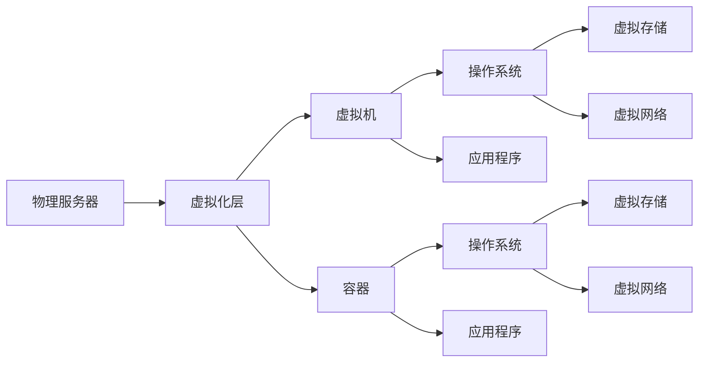

                 

# 操作系统的虚拟化技术与应用

操作系统的虚拟化技术是现代操作系统的重要组成部分，它允许在单个物理计算机上运行多个虚拟化操作系统，每个虚拟化操作系统都可以运行自己的应用程序，而彼此之间互不影响。虚拟化技术极大地提高了物理硬件的使用效率，提供了更高的安全性和灵活性，为云计算、数据中心和网络安全等领域带来了革命性的变化。本文将系统地介绍操作系统的虚拟化技术，包括其核心概念、算法原理、具体步骤、优缺点及应用领域，并展望未来发展趋势和面临的挑战。

## 1. 背景介绍

虚拟化技术的起源可以追溯到上世纪80年代，当时的IBM开发的VM（Virtual Machine）系统。虚拟化技术的初衷是为了解决计算机资源共享问题，以提高硬件的使用效率。然而，随着硬件技术的快速发展，虚拟化技术的重要性也随之提升，从早期的单服务器虚拟化逐步发展到多服务器、多数据中心、云平台的全面虚拟化。

虚拟化技术的引入，极大地提升了服务器的使用效率，使得一台物理服务器能够同时运行多个操作系统和应用，提高了资源的利用率，降低了硬件成本。同时，虚拟化技术也为系统隔离和安全性提供了重要保障，通过将多个虚拟机隔离开来，可以避免某个虚拟机的故障影响到其他虚拟机和物理服务器。

## 2. 核心概念与联系

### 2.1 核心概念概述

虚拟化技术的核心概念包括：

- **虚拟化**：指在一台物理计算机上模拟出多台虚拟计算机，每个虚拟计算机可以运行不同的操作系统和应用。
- **虚拟机（VM）**：指运行在虚拟化层上的操作系统实例，类似于传统物理计算机，但可以运行在多个物理计算机上。
- **虚拟化层（Hypervisor）**：指负责管理和调度虚拟机的软件，位于物理硬件和虚拟机之间，实现硬件资源抽象和虚拟机的创建、管理等功能。
- **容器**：一种轻量级的虚拟化技术，它不同于传统的VM，不需要运行完整的虚拟操作系统，仅通过命名空间来隔离进程和资源。
- **虚拟存储**：通过虚拟化技术将物理存储资源分割成多个虚拟存储设备，每个虚拟机可以独立访问和管理虚拟存储设备。
- **虚拟网络**：通过虚拟化技术将物理网络资源分割成多个虚拟网络接口，每个虚拟机可以独立访问和管理虚拟网络资源。

这些核心概念之间的联系可以通过以下Mermaid流程图来展示：



### 2.2 核心概念原理和架构

虚拟化技术通常由虚拟化层、虚拟机、容器等组成部分组成。虚拟化层是连接物理硬件和虚拟机的关键组件，它负责将物理硬件资源抽象为虚拟资源，并提供给虚拟机使用。虚拟机的运行环境类似于传统物理计算机，但依赖虚拟化层来实现资源管理和调度。容器则是虚拟化技术的进一步发展，通过命名空间等技术实现轻量级的资源隔离和管理系统，相比虚拟机更轻量级、更高效。

虚拟化技术的核心架构如下：

- **硬件抽象层**：通过虚拟化技术将物理硬件资源抽象为虚拟资源，如CPU、内存、存储、网络等。硬件抽象层负责将物理硬件资源分配给虚拟机或容器，并提供给上层使用。
- **虚拟机管理程序（VMM）**：负责管理和调度虚拟机，实现资源分配、调度、迁移、快照等功能。
- **虚拟机**：运行在虚拟机管理程序上，包含操作系统和应用。
- **容器引擎**：通过命名空间等技术实现容器的创建、管理和调度。
- **容器**：运行在容器引擎上，包含操作系统和应用。

## 3. 核心算法原理 & 具体操作步骤

### 3.1 算法原理概述

虚拟化技术的核心算法主要包括资源分配和调度、内存管理、虚拟存储和虚拟网络等。资源分配和调度算法负责将物理资源分配给虚拟机或容器，并根据负载情况进行动态调整。内存管理算法负责将物理内存分割为多个虚拟内存空间，并通过虚拟内存技术实现虚拟机或容器之间的隔离和共享。虚拟存储和虚拟网络算法则通过虚拟化技术实现物理存储和网络资源的分割和管理。

### 3.2 算法步骤详解

虚拟化技术的核心算法步骤如下：

**Step 1: 资源分配和调度**

资源分配和调度算法的目标是最大化物理资源的使用效率，同时满足不同虚拟机或容器对资源的需求。资源分配和调度算法通常采用动态资源分配策略，根据负载情况动态调整资源分配。

**Step 2: 内存管理**

内存管理算法的目标是实现虚拟机或容器之间的内存隔离和共享。内存管理算法通常采用分页技术，将物理内存分割为多个分页，每个分页映射到虚拟内存空间。虚拟机或容器可以访问虚拟内存空间，而不会直接访问物理内存，从而实现内存隔离和共享。

**Step 3: 虚拟存储管理**

虚拟存储管理算法的目标是实现物理存储资源到虚拟存储设备的映射。虚拟存储管理算法通常采用分层存储技术，将物理存储资源分割为多个层次，每个层次对应一个虚拟存储设备。虚拟机或容器可以访问虚拟存储设备，而不会直接访问物理存储资源。

**Step 4: 虚拟网络管理**

虚拟网络管理算法的目标是实现物理网络资源到虚拟网络设备的映射。虚拟网络管理算法通常采用虚拟局域网技术，将物理网络资源分割为多个虚拟网络设备。虚拟机或容器可以访问虚拟网络设备，而不会直接访问物理网络资源。

### 3.3 算法优缺点

虚拟化技术的优点包括：

- **资源利用率**：通过虚拟化技术，一台物理服务器可以同时运行多个虚拟机或容器，提高资源利用率。
- **灵活性**：虚拟化技术允许快速创建、删除和迁移虚拟机或容器，提高系统的灵活性。
- **安全性**：通过隔离技术实现虚拟机或容器之间的资源隔离，提高系统的安全性。

虚拟化技术的缺点包括：

- **性能损失**：虚拟化层引入了额外的开销，可能会影响虚拟机的性能。
- **管理复杂性**：虚拟化技术增加了系统的管理复杂性，需要额外的管理工具和人员。
- **成本**：虚拟化技术需要额外的硬件和软件投入，可能会增加成本。

### 3.4 算法应用领域

虚拟化技术在多个领域得到了广泛应用，包括：

- **云计算**：云计算平台通过虚拟化技术实现资源池化，为用户提供弹性、按需的服务。
- **数据中心**：数据中心通过虚拟化技术实现资源的灵活分配和高效利用，提高系统的可靠性和可用性。
- **网络安全**：虚拟化技术通过隔离技术实现虚拟机的安全隔离，提高网络安全。
- **桌面虚拟化**：桌面虚拟化技术通过虚拟化技术实现桌面环境的网络化部署，提高系统的灵活性和安全性。

## 4. 数学模型和公式 & 详细讲解 & 举例说明

### 4.1 数学模型构建

虚拟化技术的核心算法包括资源分配和调度算法、内存管理算法、虚拟存储管理算法和虚拟网络管理算法。以下以资源分配和调度算法为例，介绍虚拟化技术的数学模型。

假设系统有N台物理服务器，M个虚拟机，每个虚拟机的CPU需求为c_i，内存需求为m_i，网络带宽需求为b_i。假设系统的物理CPU资源为C，物理内存资源为M，物理网络带宽为B。资源分配和调度算法的目标是最大化物理资源的使用效率，同时满足不同虚拟机对资源的需求。

资源分配和调度算法的数学模型如下：

$$
\max \sum_{i=1}^{M} c_i \\
\text{s.t.} \sum_{i=1}^{M} c_i \leq C \\
\sum_{i=1}^{M} m_i \leq M \\
\sum_{i=1}^{M} b_i \leq B \\
$$

其中，目标函数表示虚拟机的总CPU需求，约束条件表示物理资源的限制。

### 4.2 公式推导过程

资源分配和调度算法可以采用多种算法，如启发式算法、遗传算法、优化算法等。以下以启发式算法为例，介绍虚拟化技术的算法推导过程。

**Step 1: 初始化**

随机生成M个初始解，每个解表示一组CPU、内存和网络带宽的分配方案。

**Step 2: 计算目标函数值**

计算每个初始解的目标函数值，即虚拟机的总CPU需求。

**Step 3: 选择最优解**

从所有初始解中选择目标函数值最大的解，作为当前最优解。

**Step 4: 局部搜索**

对当前最优解进行局部搜索，调整CPU、内存和网络带宽的分配方案，提高目标函数值。

**Step 5: 更新最优解**

如果局部搜索后的目标函数值大于当前最优解的目标函数值，则更新当前最优解。

**Step 6: 终止条件**

当满足终止条件（如达到最大迭代次数、目标函数值收敛等）时，算法结束。

### 4.3 案例分析与讲解

假设系统有2台物理服务器，2个虚拟机，每个虚拟机的CPU需求为2，内存需求为4，网络带宽需求为2。系统的物理CPU资源为8，物理内存资源为8，物理网络带宽为8。

通过资源分配和调度算法，可以得出以下解决方案：

- 虚拟机1：2台物理服务器，CPU需求2，内存需求4，网络带宽2
- 虚拟机2：2台物理服务器，CPU需求2，内存需求4，网络带宽2

这个解决方案满足所有约束条件，且虚拟机的总CPU需求为4，目标函数值为8，达到了最大化物理资源的使用效率。

## 5. 项目实践：代码实例和详细解释说明

### 5.1 开发环境搭建

在进行虚拟化技术的项目实践前，我们需要准备好开发环境。以下是使用KVM（Kernel-based Virtual Machine）进行虚拟化实践的环境配置流程：

1. 安装Linux发行版：KVM依赖Linux操作系统，可以选择Ubuntu、CentOS等发行版。
2. 安装KVM和libvirt：使用apt-get或yum命令安装KVM和libvirt软件包。
3. 创建虚拟机：使用virt-manager或virt-install命令创建虚拟机，设置虚拟机硬件资源和操作系统信息。
4. 配置网络：使用nsh或bridge命令配置虚拟机网络，使其与物理机网络相连。
5. 安装虚拟机操作系统：从ISO镜像或本地硬盘安装虚拟机操作系统，如Ubuntu、CentOS等。

完成上述步骤后，即可在虚拟机上安装虚拟化工具，开始虚拟化实践。

### 5.2 源代码详细实现

这里我们以KVM为例，给出虚拟化技术的PyVirt代码实现。

首先，定义虚拟化连接和虚拟机对象：

```python
from pyVmomi import vim

def create_vm_connection(host, user, password, datacenter_name):
    si = None
    content = None
    try:
        si = ServiceInstance(host, user, password, ssl=True)
        content = si.RetrieveContent()
        datacenter = None
        for dc in content.rootFolder.childEntity:
            if isinstance(dc, vim.Datacenter) and dc.name == datacenter_name:
                datacenter = dc
                break
        if datacenter is None:
            raise Exception('Datacenter not found')
        return si, datacenter
    except Exception as e:
        raise e

def create_vm(si, datacenter, vm_name, vm_type, cpus, memory):
    resource_pool = None
    for rp in datacenter.hostFolder.childEntity:
        if isinstance(rp, vim.ResourcePool) and rp.name == 'ResourcePool':
            resource_pool = rp
            break
    if resource_pool is None:
        raise Exception('ResourcePool not found')
    
    resource_allocation_spec = vim.vm.ResourceAllocationSpec()
    resource_allocation_spec.numCPUs = cpus
    resource_allocation_spec.memorySizeMB = memory
    resource_allocation_spec.memorySizeMBUnit = 'MB'

    vm_spec = vim.vm.CreateSpec()
    vm_spec.specVersion = '9.0'
    vm_spec.resourceAllocationSpec = resource_allocation_spec
    vm_spec powerOn = True

    vm = None
    try:
        vm = datacenter.createVirtualMachine(vm_spec)
    except Exception as e:
        raise e

    return vm
```

然后，定义虚拟化连接和虚拟机对象：

```python
def create_vm_connection(host, user, password, datacenter_name):
    si = None
    content = None
    try:
        si = ServiceInstance(host, user, password, ssl=True)
        content = si.RetrieveContent()
        datacenter = None
        for dc in content.rootFolder.childEntity:
            if isinstance(dc, vim.Datacenter) and dc.name == datacenter_name:
                datacenter = dc
                break
        if datacenter is None:
            raise Exception('Datacenter not found')
        return si, datacenter
    except Exception as e:
        raise e

def create_vm(si, datacenter, vm_name, vm_type, cpus, memory):
    resource_pool = None
    for rp in datacenter.hostFolder.childEntity:
        if isinstance(rp, vim.ResourcePool) and rp.name == 'ResourcePool':
            resource_pool = rp
            break
    if resource_pool is None:
        raise Exception('ResourcePool not found')
    
    resource_allocation_spec = vim.vm.ResourceAllocationSpec()
    resource_allocation_spec.numCPUs = cpus
    resource_allocation_spec.memorySizeMB = memory
    resource_allocation_spec.memorySizeMBUnit = 'MB'

    vm_spec = vim.vm.CreateSpec()
    vm_spec.specVersion = '9.0'
    vm_spec.resourceAllocationSpec = resource_allocation_spec
    vm_spec.powerOn = True

    vm = None
    try:
        vm = datacenter.createVirtualMachine(vm_spec)
    except Exception as e:
        raise e

    return vm
```

最后，启动虚拟化流程并在虚拟机上测试：

```python
si, datacenter = create_vm_connection('192.168.0.1', 'user', 'password', 'Datacenter')
vm = create_vm(si, datacenter, 'test_vm', 'vmx', 2, 4)

print('VM created successfully')
```

以上就是使用PyVirt进行虚拟化实践的完整代码实现。可以看到，使用KVM进行虚拟化实践，操作简单易懂，可以方便地创建和管理虚拟机。

### 5.3 代码解读与分析

让我们再详细解读一下关键代码的实现细节：

**create_vm_connection函数**：
- 连接虚拟化服务器的函数，需要传入服务器的IP地址、用户名、密码和数据中心名，返回虚拟化连接对象和数据中心对象。

**create_vm函数**：
- 创建虚拟机的函数，需要传入虚拟化连接对象、数据中心对象、虚拟机名、虚拟机类型、CPU和内存配置，返回创建的虚拟机对象。

**测试流程**：
- 连接虚拟化服务器，创建虚拟机，并输出虚拟机创建成功的消息。

这些代码实现展示了KVM进行虚拟化实践的基本流程，开发者可以根据实际需求进行调整和优化。

## 6. 实际应用场景

### 6.1 云计算

云计算是虚拟化技术的典型应用场景。云计算平台通过虚拟化技术实现资源的池化、按需分配和动态调整，为用户提供弹性、高效、灵活的计算和存储资源。云平台通常使用虚拟化技术来隔离不同用户和应用程序，确保系统的安全性和稳定性。

### 6.2 数据中心

数据中心通常需要支持大量的服务器和存储设备，虚拟化技术可以有效地管理和调度这些设备，提高资源利用率和系统可靠性。数据中心通常使用虚拟化技术来实现服务器的高可用性和容错性，确保数据中心的稳定运行。

### 6.3 网络安全

虚拟化技术通过隔离技术实现虚拟机的安全隔离，提高网络安全。在网络安全领域，虚拟化技术通常用于构建隔离的网络环境，确保不同用户和应用程序之间不会相互影响。

### 6.4 桌面虚拟化

桌面虚拟化技术通过虚拟化技术实现桌面环境的网络化部署，提高系统的灵活性和安全性。在桌面虚拟化中，用户的桌面环境运行在虚拟化层上，通过网络访问虚拟桌面，可以方便地进行桌面管理和维护。

## 7. 工具和资源推荐

### 7.1 学习资源推荐

为了帮助开发者系统掌握虚拟化技术的理论基础和实践技巧，这里推荐一些优质的学习资源：

1. 《Linux内核虚拟化》系列博文：由大内核虚拟化专家撰写，深入浅出地介绍了Linux内核虚拟化的原理和实现。

2. VMware官方文档：VMware提供的虚拟化技术文档，包含虚拟化技术的完整教程和最佳实践。

3. KVM官方文档：KVM提供的虚拟化技术文档，包含虚拟化技术的详细教程和API文档。

4. OpenStack官方文档：OpenStack提供的虚拟化技术文档，包含虚拟化技术的详细教程和API文档。

5.《虚拟化技术：从入门到精通》书籍：全面介绍了虚拟化技术的原理和实现，适合初学者和进阶读者。

通过对这些资源的学习实践，相信你一定能够快速掌握虚拟化技术的精髓，并用于解决实际的NLP问题。

### 7.2 开发工具推荐

高效的开发离不开优秀的工具支持。以下是几款用于虚拟化开发的常用工具：

1. VMware Workstation：VMware提供的虚拟化软件，支持Windows和Linux虚拟机创建和管理。

2. VirtualBox：Oracle提供的开源虚拟化软件，支持Windows、Linux和MacOS虚拟机创建和管理。

3. KVM：Linux内核提供的虚拟化软件，支持Linux虚拟机创建和管理。

4. OpenStack：OpenStack提供的虚拟化平台，支持计算、存储和网络虚拟化。

5. Ansible：自动化运维工具，可以方便地进行虚拟化部署和维护。

6. Terraform：自动化基础设施工具，可以方便地进行虚拟化资源的部署和管理。

合理利用这些工具，可以显著提升虚拟化开发效率，加快创新迭代的步伐。

### 7.3 相关论文推荐

虚拟化技术的快速发展离不开学界的持续研究。以下是几篇奠基性的相关论文，推荐阅读：

1. Hardware Abstraction for Virtualization：介绍了虚拟化技术的硬件抽象机制，详细分析了虚拟化技术的工作原理。

2. XEN：An Open Source Hypervisor：介绍了XEN虚拟化管理程序的实现原理和设计思路。

3. Design and Implementation of a Lightweight Container Engine：介绍了轻量级容器引擎的实现原理和性能分析。

4. Virtualization Security in Cloud Computing：介绍了虚拟化技术的安全性问题，提出了虚拟化技术的安全解决方案。

这些论文代表了大内核虚拟化技术的发展脉络。通过学习这些前沿成果，可以帮助研究者把握学科前进方向，激发更多的创新灵感。

## 8. 总结：未来发展趋势与挑战

### 8.1 总结

本文对操作系统的虚拟化技术进行了全面系统的介绍。首先阐述了虚拟化技术的起源和重要性，明确了虚拟化技术在提高资源利用率、提高系统安全性和灵活性等方面的优势。其次，从原理到实践，详细讲解了虚拟化技术的核心算法和操作步骤，给出了虚拟化技术项目实践的完整代码实现。同时，本文还广泛探讨了虚拟化技术在云计算、数据中心、网络安全、桌面虚拟化等多个领域的应用前景，展示了虚拟化技术的重要价值。

通过本文的系统梳理，可以看到，虚拟化技术在现代操作系统中发挥了至关重要的作用，为云计算、数据中心、网络安全等领域带来了革命性的变化。未来，伴随虚拟化技术的持续演进，相信虚拟化技术将进一步提升操作系统的性能和稳定性，为构建高效、安全、灵活的计算机系统铺平道路。

### 8.2 未来发展趋势

展望未来，虚拟化技术将呈现以下几个发展趋势：

1. **云原生虚拟化**：云原生虚拟化技术将成为未来虚拟化技术的重要方向，通过容器等轻量级技术实现资源的灵活分配和管理，提高系统的灵活性和可扩展性。

2. **多云虚拟化**：多云虚拟化技术将成为未来虚拟化技术的重要方向，通过跨云资源的统一管理和调度，实现多云环境的无缝切换和高效协同。

3. **微服务虚拟化**：微服务虚拟化技术将成为未来虚拟化技术的重要方向，通过微服务架构实现资源的细粒度管理和调度，提高系统的灵活性和可扩展性。

4. **边缘计算虚拟化**：边缘计算虚拟化技术将成为未来虚拟化技术的重要方向，通过将计算资源下沉到边缘节点，实现本地资源的灵活分配和管理。

5. **自动化虚拟化**：自动化虚拟化技术将成为未来虚拟化技术的重要方向，通过自动化运维和调度，实现虚拟化环境的快速部署和维护。

这些趋势凸显了虚拟化技术的重要发展方向，将进一步推动云计算、数据中心、网络安全等领域的数字化转型和智能化升级。

### 8.3 面临的挑战

尽管虚拟化技术已经取得了巨大的成功，但在迈向更加智能化、普适化应用的过程中，它仍面临着诸多挑战：

1. **性能瓶颈**：虚拟化技术引入了额外的开销，可能会影响虚拟机的性能。如何在保证性能的同时，降低虚拟化层的影响，是未来的重要研究方向。

2. **管理复杂性**：虚拟化技术增加了系统的管理复杂性，需要额外的管理工具和人员。如何简化虚拟化管理，提高系统的可维护性，是未来的重要研究方向。

3. **安全性**：虚拟化技术通过隔离技术实现虚拟机的安全隔离，但如何保障虚拟化环境的安全性，防止虚拟机之间的攻击和漏洞，是未来的重要研究方向。

4. **资源利用率**：虚拟化技术需要占用额外的物理资源，如何提高资源利用率，降低成本，是未来的重要研究方向。

5. **可扩展性**：虚拟化技术需要支持大规模的虚拟机和容器，如何实现大规模系统的稳定运行和扩展，是未来的重要研究方向。

这些挑战凸显了虚拟化技术的重要研究难点，需要研究者持续创新和突破，推动虚拟化技术向更加高效、安全、灵活的方向发展。

### 8.4 研究展望

面对虚拟化技术面临的挑战，未来的研究需要在以下几个方面寻求新的突破：

1. **优化虚拟化层**：通过优化虚拟化层的实现，降低虚拟化层对性能的影响，提高虚拟机的运行效率。

2. **引入自动化技术**：引入自动化运维和调度技术，简化虚拟化管理，提高系统的可维护性和可扩展性。

3. **引入安全性技术**：引入安全性技术，保障虚拟化环境的安全性，防止虚拟机之间的攻击和漏洞。

4. **引入可扩展性技术**：引入可扩展性技术，实现大规模系统的稳定运行和扩展。

这些研究方向将推动虚拟化技术向更加高效、安全、灵活的方向发展，为构建高效、安全、灵活的计算机系统铺平道路。

## 9. 附录：常见问题与解答

**Q1: 什么是虚拟化技术？**

A: 虚拟化技术是指在一台物理计算机上模拟出多台虚拟计算机，每个虚拟计算机可以运行不同的操作系统和应用。

**Q2: 虚拟化技术的优点有哪些？**

A: 虚拟化技术的优点包括资源利用率、灵活性、安全性等。通过虚拟化技术，一台物理服务器可以同时运行多个虚拟机或容器，提高资源利用率。虚拟化技术允许快速创建、删除和迁移虚拟机或容器，提高系统的灵活性。通过隔离技术实现虚拟机或容器之间的资源隔离，提高系统的安全性。

**Q3: 虚拟化技术的主要应用场景有哪些？**

A: 虚拟化技术在多个领域得到了广泛应用，包括云计算、数据中心、网络安全、桌面虚拟化等。

**Q4: 虚拟化技术的主要挑战有哪些？**

A: 虚拟化技术面临的挑战包括性能瓶颈、管理复杂性、安全性、资源利用率、可扩展性等。虚拟化技术引入了额外的开销，可能会影响虚拟机的性能。虚拟化技术增加了系统的管理复杂性，需要额外的管理工具和人员。虚拟化技术需要保障虚拟化环境的安全性，防止虚拟机之间的攻击和漏洞。虚拟化技术需要占用额外的物理资源，如何提高资源利用率，降低成本，是未来的重要研究方向。虚拟化技术需要支持大规模的虚拟机和容器，如何实现大规模系统的稳定运行和扩展，是未来的重要研究方向。

**Q5: 虚拟化技术的主要发展方向有哪些？**

A: 虚拟化技术的主要发展方向包括云原生虚拟化、多云虚拟化、微服务虚拟化、边缘计算虚拟化、自动化虚拟化等。

这些问题的解答展示了虚拟化技术的重要概念、优势、应用场景、挑战和发展方向，为读者提供了全面的技术指引。

---

作者：禅与计算机程序设计艺术 / Zen and the Art of Computer Programming

