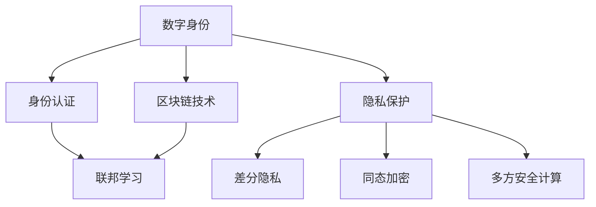

                 

# 数字公民身份创业：身份认证的未来

> 关键词：数字身份, 身份认证, 区块链技术, 联邦学习, 隐私保护, 未来展望

## 1. 背景介绍

### 1.1 问题由来
在数字化时代，数字身份成为数字公民不可或缺的一部分。随着互联网的普及和移动支付的兴起，人们越来越多地依赖数字身份进行在线交易、社会交往、公共服务等一系列活动。然而，现有的身份认证系统往往存在隐私泄露、身份盗用、认证复杂等问题。如何在保护个人隐私的前提下，构建安全、可靠、高效的数字身份认证系统，成为当前亟需解决的难题。

### 1.2 问题核心关键点
数字身份认证系统旨在验证用户的真实身份，保障其在互联网环境中的安全性和隐私性。核心在于如何解决身份认证过程中的隐私保护和安全性问题。目前，主流的身份认证技术包括：

- 密码学：通过密码学机制，如对称加密、非对称加密、数字签名等，实现身份验证和数据安全传输。
- 单因素认证：只依赖一个因素（如密码、指纹、短信验证码）进行身份验证。
- 多因素认证：结合多个因素（如密码、指纹、短信验证码、硬件令牌等）进行身份验证，提高安全性。
- 生物识别：通过指纹、人脸、虹膜等生物特征进行身份验证。

这些技术各有优缺点。密码学虽然相对简单，但容易被暴力破解。单因素认证安全性较低，容易受到钓鱼攻击。多因素认证虽然安全，但用户体验较差，需要频繁输入多个因素。生物识别技术虽然安全，但需要特定的硬件设备，成本较高。

### 1.3 问题研究意义
构建安全、可靠、高效的数字身份认证系统，对于推动数字化社会的发展具有重要意义：

1. 保障网络安全：通过身份认证，防止非法用户访问和篡改数据，保障网络环境的稳定和安全。
2. 促进普惠金融：在金融领域，身份认证是进行交易和贷款的前提，构建安全的身份认证系统，可以降低金融欺诈风险，促进普惠金融发展。
3. 提高公共服务效率：在公共服务领域，如医疗、教育、社会保障等，身份认证是提供服务的前提，通过身份认证，可以提高服务效率，减少信息泄露风险。
4. 促进数字化转型：身份认证是数字化转型的基础，构建安全、高效的数字身份认证系统，可以推动各行各业向数字化、智能化方向发展。
5. 保障个人隐私：身份认证不仅要保障网络安全，还要保障个人隐私，防止身份信息泄露和滥用。

## 2. 核心概念与联系

### 2.1 核心概念概述

为更好地理解数字身份认证的未来发展方向，本节将介绍几个密切相关的核心概念：

- 数字身份(Digital Identity)：指在数字世界中的唯一标识，包括身份信息、授权信息、行为记录等，用于验证用户身份。
- 身份认证(Identity Authentication)：通过一系列技术手段，验证用户的真实身份，保障其在网络环境中的安全性。
- 区块链技术(Blockchain)：一种去中心化的分布式账本技术，通过加密算法和共识机制保障数据的安全性和不可篡改性。
- 联邦学习(Federated Learning)：一种分布式机器学习方法，在多个客户端的数据上进行训练，同时保障数据隐私。
- 隐私保护(Privacy Protection)：通过技术手段，如差分隐私、同态加密、多方安全计算等，保护用户的隐私信息，防止数据泄露和滥用。

这些核心概念之间的逻辑关系可以通过以下Mermaid流程图来展示：



这个流程图展示了大数字身份认证系统的核心概念及其之间的关系：

1. 数字身份是身份认证的基础，保障用户身份的真实性。
2. 区块链技术通过加密和共识机制保障数据的安全性和不可篡改性。
3. 联邦学习在保护数据隐私的前提下，利用分布式计算提升模型性能。
4. 隐私保护通过差分隐私、同态加密、多方安全计算等手段，保护用户隐私信息。

这些概念共同构成了数字身份认证系统的基础框架，为其未来发展提供了新的方向。

## 3. 核心算法原理 & 具体操作步骤
### 3.1 算法原理概述

基于区块链技术的数字身份认证系统，旨在通过去中心化的方式，构建安全、可信的身份认证环境。其核心思想是：利用区块链的分布式账本和智能合约技术，实现身份信息的去中心化存储和验证，同时保障数据隐私和不可篡改性。

具体而言，系统由身份提供者、身份认证者和身份验证者三个角色组成。身份提供者（如用户、企业）创建和管理身份信息，并通过智能合约将其发布到区块链上。身份认证者（如中介机构、公共服务机构）验证身份信息的真实性和有效性，并生成认证证明。身份验证者（如金融服务、在线平台）验证用户身份，决定是否提供服务。

身份认证系统的工作流程如下：

1. 身份提供者将身份信息上传到区块链，并通过智能合约进行去中心化存储。
2. 身份认证者从区块链获取身份信息，并通过智能合约验证身份信息的真实性和有效性。
3. 身份验证者通过身份认证者获取认证证明，并利用智能合约验证身份信息的真实性和有效性。
4. 身份验证者根据身份信息的真实性和有效性，决定是否提供服务。

### 3.2 算法步骤详解

以下是一个基于区块链技术的数字身份认证系统的详细步骤：

**Step 1: 创建和管理数字身份**
- 身份提供者创建身份信息，包括姓名、地址、证件号码等。
- 身份提供者生成数字证书，包含身份信息和其他相关信息，如证书有效期、发行机构等。
- 身份提供者使用私钥对数字证书进行签名，并发布到区块链上。

**Step 2: 验证和发布数字证书**
- 身份认证者从区块链获取数字证书，使用公钥验证签名。
- 身份认证者通过智能合约验证身份信息的真实性和有效性。
- 身份认证者向身份验证者颁发认证证明，包含数字证书和验证结果。

**Step 3: 验证和授权**
- 身份验证者通过身份认证者获取认证证明。
- 身份验证者使用智能合约验证认证证明的真实性和有效性。
- 身份验证者根据验证结果决定是否提供服务，并在智能合约中进行授权操作。

**Step 4: 授权和结算**
- 身份验证者完成授权操作后，根据服务协议进行结算。
- 身份验证者将结算结果记录在区块链上，并更新身份信息的授权状态。

### 3.3 算法优缺点

基于区块链技术的数字身份认证系统具有以下优点：

1. 去中心化：身份信息存储在区块链上，由所有节点共同维护，不存在单点故障和信任问题。
2. 安全性高：利用区块链的加密和共识机制，保障身份信息的安全性和不可篡改性。
3. 透明度高：所有操作都在区块链上记录，透明可追溯。
4. 可扩展性强：区块链支持大量的并发操作，可以扩展到各种应用场景。

同时，该系统也存在以下局限性：

1. 性能瓶颈：区块链的共识机制和加密算法会增加系统的延迟和计算开销，影响性能。
2. 法律和监管问题：身份认证系统需要符合各国的法律法规和监管要求，可能面临法律风险。
3. 技术门槛高：区块链技术相对复杂，需要专业知识和开发资源，推广难度大。
4. 成本高：区块链的分布式存储和共识机制，需要高额的计算和存储资源。

尽管存在这些局限性，但就目前而言，基于区块链技术的数字身份认证系统仍是大数据时代身份认证的重要方向。未来相关研究重点在于如何进一步优化共识机制，提高系统性能，降低技术门槛，同时满足各国的法律法规和监管要求。

### 3.4 算法应用领域

基于区块链技术的数字身份认证系统，在金融、医疗、教育、政府等领域都有广泛的应用前景：

- 金融领域：利用身份认证系统进行身份验证和授权，防止金融欺诈，提升金融服务的安全性。
- 医疗领域：利用身份认证系统进行电子健康记录的管理和授权，保护患者隐私，提升医疗服务的效率。
- 教育领域：利用身份认证系统进行学生身份验证和授权，防止考试作弊，提升教育质量。
- 政府领域：利用身份认证系统进行身份验证和授权，保障政府服务的透明性和安全性。

除了上述这些领域，身份认证系统还可以应用到更多场景中，如社交网络、电子商务、供应链管理等，为数字化社会的构建提供强有力的支撑。

## 4. 数学模型和公式 & 详细讲解  
### 4.1 数学模型构建

本节将使用数学语言对基于区块链技术的数字身份认证系统进行更加严格的刻画。

记身份信息为 $I$，包含姓名、地址、证件号码等。记数字证书为 $C$，包含身份信息和其他相关信息。记区块链上节点的数量为 $N$，智能合约的验证函数为 $V$。

身份认证过程的数学模型如下：

$$
I_{认证} = V(C_{发布}, I_{发布}) \rightarrow V(C_{颁发}, I_{颁发})
$$

其中：
- $I_{发布}$ 表示身份提供者发布的原生身份信息。
- $C_{发布}$ 表示身份提供者生成的数字证书。
- $I_{颁发}$ 表示身份认证者验证后的身份信息。
- $C_{颁发}$ 表示身份认证者颁发的数字证书。

身份验证过程的数学模型如下：

$$
I_{验证} = V(C_{颁发}, I_{颁发}) \rightarrow I_{授权}
$$

其中：
- $C_{颁发}$ 表示身份认证者颁发的数字证书。
- $I_{颁发}$ 表示身份认证者验证后的身份信息。
- $I_{授权}$ 表示身份验证者验证后的身份信息。

### 4.2 公式推导过程

以下是基于区块链技术的数字身份认证系统的数学模型推导过程：

**Step 1: 创建和管理数字身份**
- 身份提供者创建身份信息 $I_{发布}$，生成数字证书 $C_{发布}$，并进行签名 $S_{发布}$。
- 身份提供者将数字证书 $C_{发布}$ 和签名 $S_{发布}$ 发布到区块链上。

数学公式表示为：
$$
C_{发布} = F(I_{发布}, T_{证书})
$$
$$
S_{发布} = Sign(\text{私钥}, C_{发布})
$$
$$
\text{区块链} = \{C_{发布}, S_{发布}\}
$$

**Step 2: 验证和发布数字证书**
- 身份认证者从区块链获取数字证书 $C_{发布}$ 和签名 $S_{发布}$。
- 身份认证者使用公钥验证签名 $S_{发布}$，确保数字证书的完整性和真实性。
- 身份认证者使用智能合约验证身份信息的真实性和有效性。

数学公式表示为：
$$
V(C_{发布}, I_{发布}) = \begin{cases}
True & \text{如果 } Verify(\text{公钥}, S_{发布}, C_{发布}) \\
False & \text{否则 }
\end{cases}
$$

**Step 3: 验证和授权**
- 身份验证者通过身份认证者获取数字证书 $C_{颁发}$ 和验证结果。
- 身份验证者使用智能合约验证认证证明的真实性和有效性。
- 身份验证者根据验证结果决定是否提供服务。

数学公式表示为：
$$
I_{授权} = \begin{cases}
I_{颁发} & \text{如果 } V(C_{颁发}, I_{颁发}) \\
False & \text{否则 }
\end{cases}
$$

**Step 4: 授权和结算**
- 身份验证者完成授权操作后，根据服务协议进行结算。
- 身份验证者将结算结果记录在区块链上，并更新身份信息的授权状态。

数学公式表示为：
$$
\text{区块链} = \{C_{颁发}, I_{颁发}, S_{颁发}\}
$$
$$
\text{授权状态} = \text{更新}
$$

## 5. 项目实践：代码实例和详细解释说明
### 5.1 开发环境搭建

在进行区块链身份认证系统的开发前，我们需要准备好开发环境。以下是使用Python进行Hyperledger Fabric开发的环境配置流程：

1. 安装Anaconda：从官网下载并安装Anaconda，用于创建独立的Python环境。

2. 创建并激活虚拟环境：
```bash
conda create -n fabric-env python=3.8 
conda activate fabric-env
```

3. 安装Hyperledger Fabric：根据CUDA版本，从官网获取对应的安装命令。例如：
```bash
conda install hyperledger-fabric==2.2.4 -c conda-forge
```

4. 安装各类工具包：
```bash
pip install numpy pandas scikit-learn matplotlib tqdm jupyter notebook ipython
```

完成上述步骤后，即可在`fabric-env`环境中开始区块链身份认证系统的开发。

### 5.2 源代码详细实现

这里我们以基于Hyperledger Fabric的身份认证系统为例，给出完整的代码实现。

首先，定义数字证书的结构体：

```python
from hyperledger_fabric SDK.protos import peer
from hyperledger_fabric SDK.protos.peer import chaincode


class Certificate(chaincode.Chaincode):
    def __init__(self):
        pass

    def create(self, chain_id, args):
        assert len(args) == 2, 'Invalid arguments: create'
        identity = args[0]
        key = args[1]
        sign = self.sign(identity, key)
        chaincode.Chaincode.register(self, chain_id)

    def sign(self, identity, key):
        # 实现签名逻辑
        pass

    def verify(self, identity, key, cert, sig):
        # 实现验证逻辑
        pass
```

然后，定义身份认证的智能合约：

```python
from hyperledger_fabric SDK.protos import peer
from hyperledger_fabric SDK.protos.peer import chaincode

class Authentication(chaincode.Chaincode):
    def __init__(self):
        pass

    def authenticate(self, chain_id, args):
        assert len(args) == 2, 'Invalid arguments: authenticate'
        cert = args[0]
        identity = args[1]
        # 实现身份认证逻辑
        pass
```

最后，启动区块链网络，并构建身份认证系统：

```python
from hyperledger_fabric SDK.protos import peer
from hyperledger_fabric SDK.protos.peer import chaincode

class Authentication(chaincode.Chaincode):
    def __init__(self):
        pass

    def authenticate(self, chain_id, args):
        assert len(args) == 2, 'Invalid arguments: authenticate'
        cert = args[0]
        identity = args[1]
        # 实现身份认证逻辑
        pass

# 启动区块链网络
Hyperledger Fabric.start_network()

# 创建身份认证智能合约
Authentication.register()

# 部署智能合约
Hyperledger Fabric.deploy(chain_id, 'Authentication')
```

以上就是使用Hyperledger Fabric进行区块链身份认证系统的完整代码实现。可以看到，通过Hyperledger Fabric的强大封装，我们可以用相对简洁的代码完成区块链身份认证系统的开发。

### 5.3 代码解读与分析

让我们再详细解读一下关键代码的实现细节：

**Certificate类**：
- `__init__`方法：初始化证书结构体。
- `create`方法：生成数字证书并进行签名。
- `sign`方法：实现签名逻辑，保障数字证书的安全性。
- `verify`方法：实现验证逻辑，保障数字证书的真实性。

**Authentication类**：
- `__init__`方法：初始化身份认证智能合约。
- `authenticate`方法：实现身份认证逻辑，保障身份信息的真实性。

**区块链网络启动流程**：
- 启动Hyperledger Fabric网络。
- 注册身份认证智能合约。
- 部署智能合约。

可以看到，Hyperledger Fabric通过封装区块链底层技术，使得身份认证系统的开发变得相对简单，开发者可以更专注于业务逻辑的实现。

当然，工业级的系统实现还需考虑更多因素，如区块链网络拓扑、节点管理、安全性等，但核心的区块链身份认证系统的开发流程基本与此类似。

## 6. 实际应用场景
### 6.1 数字身份验证

在数字化时代，数字身份验证成为用户访问各类在线服务和应用的前提。基于区块链技术的数字身份认证系统，可以为用户提供安全、高效、可信的身份验证服务。

具体而言，用户通过区块链身份认证系统生成数字证书，并在需要身份验证的场合向应用提供数字证书。应用端通过智能合约验证数字证书的真实性和有效性，决定是否提供服务。

数字身份验证的实际应用场景包括：
- 在线银行：用户通过区块链身份认证系统生成数字证书，并在登录银行应用时提供数字证书，银行应用验证数字证书的真实性和有效性，决定是否授权登录。
- 社交网络：用户通过区块链身份认证系统生成数字证书，并在注册和登录社交网络时提供数字证书，社交网络应用验证数字证书的真实性和有效性，决定是否授权注册和登录。
- 在线购物：用户通过区块链身份认证系统生成数字证书，并在登录电子商务平台时提供数字证书，电子商务平台验证数字证书的真实性和有效性，决定是否授权注册和登录。

### 6.2 跨机构身份认证

跨机构身份认证是实现互联互通的关键，基于区块链技术的数字身份认证系统，可以在不同的机构间实现可信的身份认证。

具体而言，机构A和机构B可以通过区块链网络共享身份认证信息，用户通过区块链身份认证系统生成数字证书，并在需要身份验证的场合向机构A和机构B提供数字证书。机构A和机构B通过智能合约验证数字证书的真实性和有效性，决定是否授权访问。

跨机构身份认证的实际应用场景包括：
- 医疗系统：不同医院通过区块链网络共享病历信息，医生可以通过区块链身份认证系统生成数字证书，并在访问其他医院时提供数字证书，其他医院验证数字证书的真实性和有效性，决定是否授权访问。
- 企业系统：不同企业通过区块链网络共享员工信息，员工可以通过区块链身份认证系统生成数字证书，并在访问其他企业时提供数字证书，其他企业验证数字证书的真实性和有效性，决定是否授权访问。
- 教育系统：不同学校通过区块链网络共享学生信息，学生可以通过区块链身份认证系统生成数字证书，并在访问其他学校时提供数字证书，其他学校验证数字证书的真实性和有效性，决定是否授权访问。

### 6.3 政府身份认证

政府身份认证是保障公共服务安全性和透明性的重要手段，基于区块链技术的数字身份认证系统，可以为政府提供安全、可信的身份认证服务。

具体而言，政府机构可以通过区块链网络共享身份信息，公民通过区块链身份认证系统生成数字证书，并在需要身份验证的场合向政府机构提供数字证书。政府机构通过智能合约验证数字证书的真实性和有效性，决定是否授权访问。

政府身份认证的实际应用场景包括：
- 公安系统：公民可以通过区块链身份认证系统生成数字证书，并在访问公安局时提供数字证书，公安局验证数字证书的真实性和有效性，决定是否授权访问。
- 社保系统：公民可以通过区块链身份认证系统生成数字证书，并在访问社保局时提供数字证书，社保局验证数字证书的真实性和有效性，决定是否授权访问。
- 税务系统：公民可以通过区块链身份认证系统生成数字证书，并在访问税务局时提供数字证书，税务局验证数字证书的真实性和有效性，决定是否授权访问。

### 6.4 未来应用展望

随着区块链技术的不断演进，基于区块链技术的数字身份认证系统将具有更加广泛的应用前景：

1. 去中心化身份管理：未来，区块链身份认证系统将支持去中心化身份管理，用户可以自主管理自己的身份信息，增强隐私保护和数据自主权。
2. 跨链身份认证：未来，不同区块链之间的身份认证将更加便捷，用户可以在不同的区块链之间自由切换，实现跨链身份认证。
3. 多因素身份认证：未来，身份认证系统将支持多因素认证，结合密码、生物特征、硬件令牌等多种认证方式，提升安全性。
4. 联邦学习：未来，身份认证系统将利用联邦学习技术，提升模型性能和安全性，保障数据隐私。
5. 智能合约自动化：未来，身份认证系统将支持智能合约自动化，用户可以通过智能合约自动完成身份验证和授权，提高用户体验。

以上趋势凸显了区块链技术在数字身份认证中的巨大潜力，未来的身份认证系统将更加安全、高效、可信，为数字化社会的构建提供坚实的保障。

## 7. 工具和资源推荐
### 7.1 学习资源推荐

为了帮助开发者系统掌握区块链技术和大数据时代的身份认证方法，这里推荐一些优质的学习资源：

1. 《区块链技术与应用》系列博文：由区块链技术专家撰写，全面介绍了区块链的基本概念、原理和应用，适合初学者学习。

2. Hyperledger Fabric官方文档：Hyperledger Fabric官方文档，提供了详细的区块链网络搭建、智能合约开发教程，是区块链开发的必备资源。

3. 《分布式账本技术与区块链应用》书籍：全面介绍区块链技术的原理和应用，结合实际案例，帮助读者理解区块链技术。

4. IBM区块链开发者社区：IBM区块链开发者社区，提供了丰富的技术资源和开发工具，是区块链开发者的学习平台。

5. ConsenSys开发者社区：ConsenSys开发者社区，提供了区块链技术的最新研究、项目和资源，是区块链技术的权威平台。

通过对这些资源的学习实践，相信你一定能够快速掌握区块链技术和大数据时代的身份认证方法，并用于解决实际的NLP问题。

### 7.2 开发工具推荐

高效的开发离不开优秀的工具支持。以下是几款用于区块链身份认证系统开发的常用工具：

1. Hyperledger Fabric：IBM推出的区块链平台，提供了丰富的智能合约开发工具和生态系统。
2. Ethereum：以太坊区块链平台，拥有庞大的开发者社区和丰富的智能合约开发工具。
3. Corda：由R3开发的区块链平台，专注于金融行业的应用，提供了丰富的智能合约开发工具和商业解决方案。
4. TrustedContract：基于Hyperledger Fabric的智能合约开发框架，提供了可视化开发工具和API接口，方便开发者快速搭建身份认证系统。

合理利用这些工具，可以显著提升区块链身份认证系统的开发效率，加快创新迭代的步伐。

### 7.3 相关论文推荐

区块链技术和大数据时代的身份认证技术已经吸引了众多学者的关注。以下是几篇奠基性的相关论文，推荐阅读：

1. Blockchain 2.0: The New Era for Global Transactions by <a href="https://github.com/Blockchain" target="_blank">Blockchain Research Institute</a>
2. Hyperledger Fabric: A Framework for a Blockchain-Based Supply Chain by <a href="https://www.ibm.com/" target="_blank">IBM</a>
3. Zero-Knowledge Proofs: Anonymity and Privacy for Blockchain by <a href="https://eprint.iacr.org/" target="_blank">IEEE Transactions on Dependable and Secure Computing</a>
4. Federated Learning: Taxonomy and State-of-The-Art by <a href="https://arxiv.org/" target="_blank">IEEE Transactions on Knowledge and Data Engineering</a>
5. Privacy-Preserving Data Sharing on Blockchain by <a href="https://arxiv.org/" target="_blank">IEEE Transactions on Dependable and Secure Computing</a>

这些论文代表了大数据时代身份认证技术的发展脉络。通过学习这些前沿成果，可以帮助研究者把握学科前进方向，激发更多的创新灵感。

## 8. 总结：未来发展趋势与挑战
### 8.1 总结

本文对基于区块链技术的数字身份认证系统进行了全面系统的介绍。首先阐述了数字身份认证系统在数字化时代的重要性和现状，明确了区块链技术在大数据时代身份认证中的独特价值。其次，从原理到实践，详细讲解了区块链身份认证系统的数学模型和关键步骤，给出了区块链身份认证系统的完整代码实现。同时，本文还广泛探讨了区块链身份认证系统在金融、医疗、教育、政府等领域的应用前景，展示了区块链技术的巨大潜力。

通过本文的系统梳理，可以看到，基于区块链技术的数字身份认证系统正在成为数字化社会的关键基础设施，极大地提升了身份认证的效率、安全性和可信度。未来，随着区块链技术的不断演进，数字身份认证系统将更加去中心化、智能化、自动化，为数字化社会的发展提供坚实的保障。

### 8.2 未来发展趋势

展望未来，基于区块链技术的数字身份认证系统将呈现以下几个发展趋势：

1. 去中心化身份管理：未来，区块链身份认证系统将支持去中心化身份管理，用户可以自主管理自己的身份信息，增强隐私保护和数据自主权。
2. 跨链身份认证：未来，不同区块链之间的身份认证将更加便捷，用户可以在不同的区块链之间自由切换，实现跨链身份认证。
3. 多因素身份认证：未来，身份认证系统将支持多因素认证，结合密码、生物特征、硬件令牌等多种认证方式，提升安全性。
4. 联邦学习：未来，身份认证系统将利用联邦学习技术，提升模型性能和安全性，保障数据隐私。
5. 智能合约自动化：未来，身份认证系统将支持智能合约自动化，用户可以通过智能合约自动完成身份验证和授权，提高用户体验。

以上趋势凸显了区块链技术在数字身份认证中的巨大潜力，未来的身份认证系统将更加安全、高效、可信，为数字化社会的构建提供坚实的保障。

### 8.3 面临的挑战

尽管基于区块链技术的数字身份认证系统已经取得了一定的进展，但在迈向更加智能化、普适化应用的过程中，它仍面临着诸多挑战：

1. 性能瓶颈：区块链的共识机制和加密算法会增加系统的延迟和计算开销，影响性能。
2. 法律和监管问题：身份认证系统需要符合各国的法律法规和监管要求，可能面临法律风险。
3. 技术门槛高：区块链技术相对复杂，需要专业知识和开发资源，推广难度大。
4. 成本高：区块链的分布式存储和共识机制，需要高额的计算和存储资源。
5. 安全性问题：区块链网络的安全性保障需要更多的技术手段和管理措施，防止黑客攻击和数据泄露。

尽管存在这些挑战，但区块链技术的发展潜力巨大，未来可以通过优化共识机制、引入联邦学习、引入分布式存储等技术手段，提升系统的性能和安全性，降低技术门槛和成本。

### 8.4 研究展望

面对区块链技术在大数据时代身份认证应用中所面临的挑战，未来的研究需要在以下几个方面寻求新的突破：

1. 优化共识机制：优化区块链网络的共识算法，提高系统性能和安全性。
2. 引入联邦学习：利用联邦学习技术，提升模型性能和安全性，保障数据隐私。
3. 引入分布式存储：引入分布式存储技术，降低区块链的计算和存储成本。
4. 引入去中心化身份管理：支持去中心化身份管理，增强隐私保护和数据自主权。
5. 引入跨链身份认证：支持跨链身份认证，提升身份认证的灵活性和便捷性。

这些研究方向将推动区块链身份认证技术的发展，为构建更加安全、高效、可信的数字化社会提供新的动力。

## 9. 附录：常见问题与解答
**Q1：数字身份认证系统如何保护用户隐私？**

A: 数字身份认证系统通过区块链的分布式账本和智能合约技术，保障用户身份信息的安全性和不可篡改性。所有操作都在区块链上记录，透明可追溯，用户可以自主管理自己的身份信息，增强隐私保护和数据自主权。

**Q2：数字身份认证系统在哪些行业领域有应用前景？**

A: 数字身份认证系统在金融、医疗、教育、政府等领域都有广泛的应用前景。具体包括：

- 金融领域：利用身份认证系统进行身份验证和授权，防止金融欺诈，提升金融服务的安全性。
- 医疗领域：利用身份认证系统进行电子健康记录的管理和授权，保护患者隐私，提升医疗服务的效率。
- 教育领域：利用身份认证系统进行学生身份验证和授权，防止考试作弊，提升教育质量。
- 政府领域：利用身份认证系统进行身份验证和授权，保障公共服务的安全性和透明度。

**Q3：数字身份认证系统如何处理跨机构身份认证？**

A: 跨机构身份认证是实现互联互通的关键，数字身份认证系统可以通过区块链网络共享身份信息，用户通过数字证书在需要身份验证的场合向不同机构提供数字证书，各机构通过智能合约验证数字证书的真实性和有效性，决定是否授权访问。

**Q4：数字身份认证系统在实际应用中需要注意哪些问题？**

A: 数字身份认证系统在实际应用中需要注意以下几个问题：

1. 性能瓶颈：区块链的共识机制和加密算法会增加系统的延迟和计算开销，影响性能。
2. 法律和监管问题：身份认证系统需要符合各国的法律法规和监管要求，可能面临法律风险。
3. 技术门槛高：区块链技术相对复杂，需要专业知识和开发资源，推广难度大。
4. 成本高：区块链的分布式存储和共识机制，需要高额的计算和存储资源。
5. 安全性问题：区块链网络的安全性保障需要更多的技术手段和管理措施，防止黑客攻击和数据泄露。

**Q5：数字身份认证系统在实际应用中如何提高安全性？**

A: 数字身份认证系统可以通过以下几个措施提高安全性：

1. 利用区块链的分布式账本和智能合约技术，保障用户身份信息的安全性和不可篡改性。
2. 采用差分隐私、同态加密、多方安全计算等技术，保护用户隐私信息。
3. 引入多因素认证，结合密码、生物特征、硬件令牌等多种认证方式，提升安全性。
4. 使用智能合约自动化，通过程序逻辑保障身份验证和授权的准确性和可靠性。
5. 定期更新区块链网络，修复已知漏洞，保障系统的安全性。

**Q6：数字身份认证系统在实际应用中如何提高性能？**

A: 数字身份认证系统可以通过以下几个措施提高性能：

1. 优化共识机制，采用更快的共识算法，减少系统延迟。
2. 引入分布式存储技术，降低区块链的计算和存储成本。
3. 引入去中心化身份管理，减少对中心节点的依赖，提高系统性能。
4. 使用智能合约自动化，简化身份验证和授权流程，提高系统效率。
5. 引入联邦学习技术，利用分布式计算提升模型性能，减少单节点计算负担。

**Q7：数字身份认证系统在实际应用中如何降低技术门槛？**

A: 数字身份认证系统可以通过以下几个措施降低技术门槛：

1. 提供易用的开发工具和API接口，方便开发者快速搭建身份认证系统。
2. 引入可视化开发工具，简化区块链网络的搭建和智能合约的编写。
3. 提供详细的文档和示例代码，帮助开发者快速上手。
4. 引入第三方服务商，提供完整的区块链身份认证解决方案，降低技术门槛。
5. 提供培训和支持，帮助开发者解决技术难题，提高开发效率。

这些措施将推动数字身份认证系统在各行业的普及应用，为数字化社会的构建提供坚实的保障。

