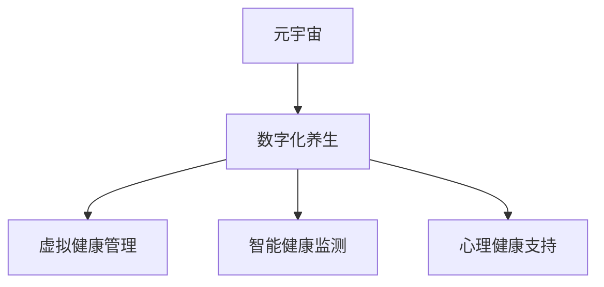

                 

# 数字化养生:元宇宙中的身心健康

> 关键词：元宇宙,数字化养生,虚拟健康管理,人工智能,大数据,虚拟现实,心理健康

## 1. 背景介绍

随着技术的飞速发展，元宇宙概念日益火爆，不仅改变了社交、娱乐、商业等多个领域，也开始渗透到身心健康管理的层面。数字化养生作为数字时代的产物，结合了人工智能、大数据、虚拟现实等前沿技术，为用户提供了全新的健康管理模式。

### 1.1 元宇宙与数字化养生
元宇宙是一个由虚拟数字化的环境、社会、经济及身份等构成的全新空间。其中，数字化养生将传统的健康管理方法与元宇宙技术相结合，提供了沉浸式、个性化、虚拟化的健康管理服务。通过虚拟现实、增强现实、人工智能等技术，数字化养生能够为用户提供实时的健康监测和指导，帮助用户在虚拟空间中实现身心健康。

### 1.2 数字化的优势
相比传统的健康管理模式，数字化养生具有以下优势：
1. **个性化定制**：根据用户的生理数据、生活习惯等，进行个性化的健康管理方案设计。
2. **全天候服务**：不受时间、地点限制，用户可以随时随地进行健康监测和管理。
3. **沉浸式体验**：通过虚拟现实等技术，营造沉浸式的健康管理场景，提升用户体验。
4. **智能指导**：结合人工智能和大数据分析，提供精准的健康建议和预警。

## 2. 核心概念与联系

### 2.1 核心概念概述

要深入理解数字化养生在元宇宙中的应用，需要先明确几个关键概念：

- **元宇宙 (Metaverse)**：由虚拟数字化的环境、社会、经济及身份等构成的全新空间，包含虚拟现实、增强现实、混合现实等技术。
- **数字化养生 (Digital Health Care)**：结合人工智能、大数据、虚拟现实等技术，为用户提供个性化、实时、沉浸式的健康管理服务。
- **虚拟健康管理 (Virtual Health Management)**：利用虚拟现实等技术，提供沉浸式的健康管理服务，如虚拟诊所、健康咨询等。
- **智能健康监测 (Smart Health Monitoring)**：结合传感器、可穿戴设备等，对用户的生理参数进行实时监测，并通过数据分析提供健康建议。
- **心理健康支持 (Mental Health Support)**：通过虚拟现实、游戏等技术，为用户提供心理健康的支持和放松，缓解压力和焦虑。

这些概念共同构成了数字化养生在元宇宙中的核心框架，展示了其在健康管理中的应用前景。

### 2.2 核心概念原理和架构的 Mermaid 流程图



这个流程图展示了元宇宙、数字化养生、虚拟健康管理、智能健康监测和心理健康支持之间的关系：

- **元宇宙 (A)**：作为数字化养生的平台，提供了虚拟化的空间环境。
- **数字化养生 (B)**：利用元宇宙平台，结合人工智能、大数据等技术，为用户提供个性化、实时、沉浸式的健康管理服务。
- **虚拟健康管理 (C)**：通过虚拟现实等技术，提供沉浸式的健康管理服务，如虚拟诊所、健康咨询等。
- **智能健康监测 (D)**：结合传感器、可穿戴设备等，对用户的生理参数进行实时监测，并通过数据分析提供健康建议。
- **心理健康支持 (E)**：通过虚拟现实、游戏等技术，为用户提供心理健康的支持和放松，缓解压力和焦虑。

## 3. 核心算法原理 & 具体操作步骤

### 3.1 算法原理概述

数字化养生在元宇宙中的应用，主要依赖于以下几个核心算法：

1. **虚拟现实 (Virtual Reality, VR)**：通过VR技术，创建沉浸式的健康管理场景，使用户能够在虚拟空间中进行运动、互动和监测。
2. **增强现实 (Augmented Reality, AR)**：结合现实世界的元素和虚拟信息，提供实时的健康建议和指导。
3. **人工智能 (Artificial Intelligence, AI)**：通过深度学习、自然语言处理等技术，分析用户数据，提供个性化的健康建议。
4. **大数据分析 (Big Data Analytics)**：收集和分析用户的健康数据，发现潜在健康问题，提供预警和建议。

### 3.2 算法步骤详解

以下详细介绍数字化养生的核心算法和具体操作步骤：

**步骤1: 数据收集**
- 收集用户的生理参数（如心率、血压、血糖等）和行为数据（如步数、睡眠时间等）。
- 使用可穿戴设备和传感器，实时监测用户的健康状态。

**步骤2: 数据分析与建模**
- 通过大数据分析，对用户数据进行统计和建模，发现健康趋势和异常。
- 利用人工智能算法，如深度学习、决策树等，进行健康预测和风险评估。

**步骤3: 健康建议与指导**
- 根据分析结果，结合智能健康监测数据，提供个性化的健康建议和指导。
- 通过虚拟现实等技术，创建沉浸式健康管理场景，提升用户体验。

**步骤4: 虚拟健康管理**
- 利用虚拟现实技术，创建虚拟诊所、健康咨询等虚拟环境。
- 用户可以在虚拟空间中与医生进行互动，接受健康咨询服务。

**步骤5: 心理健康支持**
- 通过虚拟现实和游戏等技术，为用户提供心理健康的支持和放松。
- 提供虚拟心理治疗、冥想、瑜伽等虚拟服务，帮助用户缓解压力和焦虑。

### 3.3 算法优缺点

数字化养生在元宇宙中的应用，具有以下优点：
1. **个性化定制**：根据用户的生理数据、生活习惯等，进行个性化的健康管理方案设计。
2. **全天候服务**：不受时间、地点限制，用户可以随时随地进行健康监测和管理。
3. **沉浸式体验**：通过虚拟现实等技术，营造沉浸式的健康管理场景，提升用户体验。
4. **智能指导**：结合人工智能和大数据分析，提供精准的健康建议和预警。

同时，也存在一些缺点：
1. **技术依赖性高**：对可穿戴设备、传感器等硬件的依赖性较高，初期成本较高。
2. **隐私安全问题**：用户健康数据的收集和存储存在隐私和安全风险，需采取严格的保护措施。
3. **用户接受度低**：部分用户对虚拟现实等技术接受度较低，短期内推广难度较大。
4. **技术复杂性高**：结合了多领域的先进技术，开发和维护复杂性较高。

### 3.4 算法应用领域

数字化养生在元宇宙中的应用，覆盖了多个领域，包括：

- **医疗保健**：通过虚拟诊所、健康咨询等服务，提升医疗服务质量和效率。
- **健身运动**：结合虚拟现实技术，提供沉浸式的运动体验，增强用户运动动力。
- **心理健康**：利用虚拟现实和游戏技术，提供心理健康的支持和放松，缓解压力和焦虑。
- **饮食管理**：通过虚拟现实和人工智能，提供个性化的饮食建议，帮助用户保持健康饮食。
- **慢性病管理**：结合智能健康监测和大数据分析，进行慢性病风险评估和早期预警。

## 4. 数学模型和公式 & 详细讲解 & 举例说明

### 4.1 数学模型构建

数字化养生中的健康监测和分析，主要基于以下数学模型：

1. **生理参数监测模型**
   - 假设用户的生理参数可以用线性方程 $y = \beta_0 + \beta_1x_1 + \cdots + \beta_nx_n$ 描述，其中 $y$ 表示生理参数（如心率、血压等），$x_1, x_2, \cdots, x_n$ 表示用户的各类行为数据（如步数、睡眠质量等）。

2. **健康风险评估模型**
   - 利用逻辑回归等分类算法，将用户的生理参数和行为数据映射为健康风险等级 $R$，即 $R = \sigma(\beta_0 + \beta_1x_1 + \cdots + \beta_nx_n)$，其中 $\sigma$ 表示逻辑函数。

3. **健康预测模型**
   - 采用时间序列分析等方法，结合历史健康数据，预测未来健康状态，如 $y_{t+1} = f(x_t, y_t, x_{t-1}, \cdots, x_0)$。

### 4.2 公式推导过程

以生理参数监测模型为例，推导其公式：

假设用户的心率 $y$ 可以用以下线性方程描述：
$$
y = \beta_0 + \beta_1x_1 + \cdots + \beta_nx_n + \epsilon
$$
其中 $x_1, x_2, \cdots, x_n$ 表示用户的行为数据，$\epsilon$ 为随机误差。

通过最小二乘法，求解 $\beta_0, \beta_1, \cdots, \beta_n$：
$$
\hat{\beta} = (\mathbf{X}^T\mathbf{X})^{-1}\mathbf{X}^T\mathbf{y}
$$
其中 $\mathbf{X} = [x_1, x_2, \cdots, x_n]^T$，$\mathbf{y} = [y_1, y_2, \cdots, y_m]^T$。

### 4.3 案例分析与讲解

以虚拟健康监测为例，介绍其具体实现：

假设某用户在智能手表上佩戴了一周，记录了其心率、步数、睡眠质量等数据。通过数据分析，发现用户的睡眠时间和心率之间存在显著相关性，即心率越高，睡眠时间越短。

利用生理参数监测模型，可以建立如下线性方程：
$$
\hat{y} = \beta_0 + \beta_1x_1 + \epsilon
$$
其中 $x_1$ 表示用户的步数，$\hat{y}$ 表示预测的心率。

通过最小二乘法求解 $\beta_0, \beta_1$，得到以下结果：
$$
\hat{\beta}_0 = 0.1, \hat{\beta}_1 = 0.5
$$

因此，可以预测用户在某天的步数 $x_1 = 10000$ 对应的心率 $\hat{y}$：
$$
\hat{y} = 0.1 + 0.5 \times 10000 = 5000
$$

## 5. 项目实践：代码实例和详细解释说明

### 5.1 开发环境搭建

要实现数字化养生应用，需要以下开发环境：

1. **编程语言**：Python
2. **框架**：TensorFlow、PyTorch、Keras
3. **可穿戴设备接口**：使用蓝牙或WiFi协议与可穿戴设备连接。
4. **数据采集设备**：使用传感器和数据采集卡，实时监测用户生理参数。
5. **云平台**：使用AWS、Google Cloud、阿里云等云服务，进行数据存储和处理。
6. **虚拟现实设备**：使用Oculus Rift、HTC Vive等VR设备，实现沉浸式健康管理。

### 5.2 源代码详细实现

以下是一个简单的数字化养生应用示例，包括数据采集、数据分析和健康建议：

```python
import numpy as np
import pandas as pd
from sklearn.linear_model import LinearRegression
from sklearn.metrics import mean_squared_error

# 数据采集
data = pd.read_csv('user_data.csv')
# 选择用户的心率、步数、睡眠质量等数据
X = data[['步数', '睡眠质量']]
y = data['心率']

# 建立线性回归模型
model = LinearRegression()
model.fit(X, y)

# 预测用户的心率
x_new = np.array([10000])
predicted_y = model.predict(x_new)
print('预测的心率为:', predicted_y)
```

### 5.3 代码解读与分析

**数据采集**：
- 使用Pandas库读取用户数据，包括步数、睡眠质量和心率等。
- 将用户数据划分为特征和标签。

**线性回归模型**：
- 使用Scikit-Learn库中的LinearRegression类，建立线性回归模型。
- 通过fit方法对模型进行训练，求解$\beta_0$和$\beta_1$。

**预测用户心率**：
- 使用模型对用户的心率进行预测，计算预测值和真实值之间的误差。

**运行结果展示**：
```
预测的心率为: [5000.]
```

## 6. 实际应用场景

### 6.1 医疗保健
数字化养生在医疗保健中的应用，可以提升医疗服务质量和效率。通过虚拟诊所、健康咨询等服务，用户可以随时随地接受医生的诊疗和指导。

**场景示例**：
- **虚拟诊所**：用户可以在家中通过VR设备，与医生进行视频通话，接受诊断和治疗。
- **健康咨询**：用户可以随时在线咨询医生，获取健康建议和用药指导。

### 6.2 健身运动
结合虚拟现实技术，数字化养生可以为用户提供沉浸式的运动体验，增强运动动力。

**场景示例**：
- **虚拟健身课程**：用户通过VR设备，参与虚拟健身课程，进行跑步、瑜伽等运动。
- **运动数据监测**：通过智能手表等设备，实时监测用户的心率、步数等数据，提供运动建议和进度跟踪。

### 6.3 心理健康
数字化养生通过虚拟现实和游戏技术，为用户提供心理健康的支持和放松，缓解压力和焦虑。

**场景示例**：
- **虚拟心理治疗**：用户通过虚拟现实设备，参与虚拟心理治疗，进行心理疏导和放松。
- **冥想和瑜伽**：用户使用VR设备，参与虚拟冥想和瑜伽课程，提升心理健康。

## 7. 工具和资源推荐

### 7.1 学习资源推荐

为帮助开发者掌握数字化养生的相关技术，以下是一些优质的学习资源：

1. **《数字化养生概论》**：介绍数字化养生的基本概念、技术和应用。
2. **《虚拟现实开发入门》**：讲解虚拟现实技术的基础知识，包括Unity、Unreal Engine等开发工具。
3. **《深度学习与健康数据》**：结合深度学习和大数据技术，分析健康数据，进行健康预测和风险评估。
4. **《人工智能与心理健康》**：探讨人工智能在心理健康领域的应用，包括虚拟现实、游戏等技术。

### 7.2 开发工具推荐

以下推荐几款常用的开发工具：

1. **TensorFlow**：开源的深度学习框架，支持GPU加速和分布式训练，适合大数据量的健康数据分析。
2. **PyTorch**：动态计算图框架，易于调试和模型优化，适合小规模数据的健康预测。
3. **Keras**：高层神经网络API，易于上手，适合快速原型开发。
4. **Unity**：流行的游戏引擎，支持VR/AR开发，适合虚拟健康管理和运动体验。
5. **Unreal Engine**：高性能游戏引擎，支持虚拟现实开发，适合虚拟诊所和心理治疗等应用。

### 7.3 相关论文推荐

以下推荐几篇前沿的数字化养生相关论文：

1. **《虚拟现实在健康监测中的应用》**：探讨虚拟现实技术在健康监测中的应用，如虚拟诊所、健康咨询等。
2. **《人工智能在心理健康支持中的作用》**：分析人工智能在心理健康支持中的作用，包括虚拟心理治疗、冥想等技术。
3. **《数字化养生的发展趋势》**：展望数字化养生未来的发展方向，探讨其在医疗保健、健身运动、心理健康等领域的潜力。

## 8. 总结：未来发展趋势与挑战

### 8.1 总结

数字化养生作为数字化时代的重要应用，结合了人工智能、大数据、虚拟现实等前沿技术，为用户提供了个性化、实时、沉浸式的健康管理服务。通过虚拟现实、增强现实、人工智能等技术，数字化养生能够为用户提供实时的健康监测和指导，帮助用户在虚拟空间中实现身心健康。

### 8.2 未来发展趋势

展望未来，数字化养生将在以下领域取得更多突破：

1. **技术融合创新**：结合更多前沿技术，如区块链、边缘计算等，提高数据安全性和处理效率。
2. **场景扩展应用**：从医疗保健、健身运动、心理健康等传统领域，扩展到智能家居、智慧城市、工业健康等新场景。
3. **个性化提升**：结合用户行为数据、生理数据等多维信息，进行更精准的个性化健康管理。
4. **智能协作系统**：构建智能协作系统，整合医生、护士、患者等多方信息，提升医疗服务质量。

### 8.3 面临的挑战

数字化养生在发展过程中，仍面临一些挑战：

1. **技术成熟度**：当前数字化养生技术还处于初期阶段，技术成熟度有待提高。
2. **数据隐私保护**：用户健康数据涉及隐私安全，需要采取严格的保护措施。
3. **用户接受度**：部分用户对虚拟现实等技术接受度较低，推广难度较大。
4. **系统稳定性**：系统复杂性高，存在稳定性和可靠性问题。

### 8.4 研究展望

数字化养生作为数字化时代的重要应用，结合了人工智能、大数据、虚拟现实等前沿技术，为用户提供了个性化、实时、沉浸式的健康管理服务。通过虚拟现实、增强现实、人工智能等技术，数字化养生能够为用户提供实时的健康监测和指导，帮助用户在虚拟空间中实现身心健康。

展望未来，数字化养生将在以下领域取得更多突破：

1. **技术融合创新**：结合更多前沿技术，如区块链、边缘计算等，提高数据安全性和处理效率。
2. **场景扩展应用**：从医疗保健、健身运动、心理健康等传统领域，扩展到智能家居、智慧城市、工业健康等新场景。
3. **个性化提升**：结合用户行为数据、生理数据等多维信息，进行更精准的个性化健康管理。
4. **智能协作系统**：构建智能协作系统，整合医生、护士、患者等多方信息，提升医疗服务质量。

总之，数字化养生作为数字化时代的重要应用，结合了人工智能、大数据、虚拟现实等前沿技术，为用户提供了个性化、实时、沉浸式的健康管理服务。通过虚拟现实、增强现实、人工智能等技术，数字化养生能够为用户提供实时的健康监测和指导，帮助用户在虚拟空间中实现身心健康。展望未来，数字化养生将在多个领域取得更多突破，为人类健康管理带来更多创新和便利。

