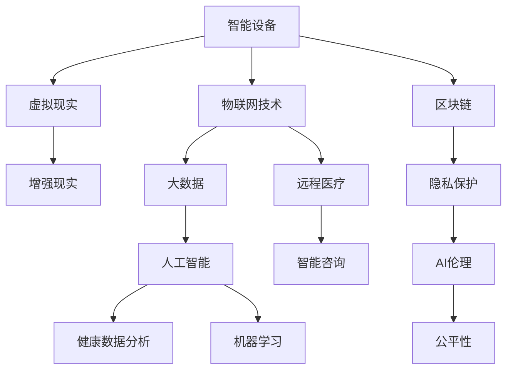
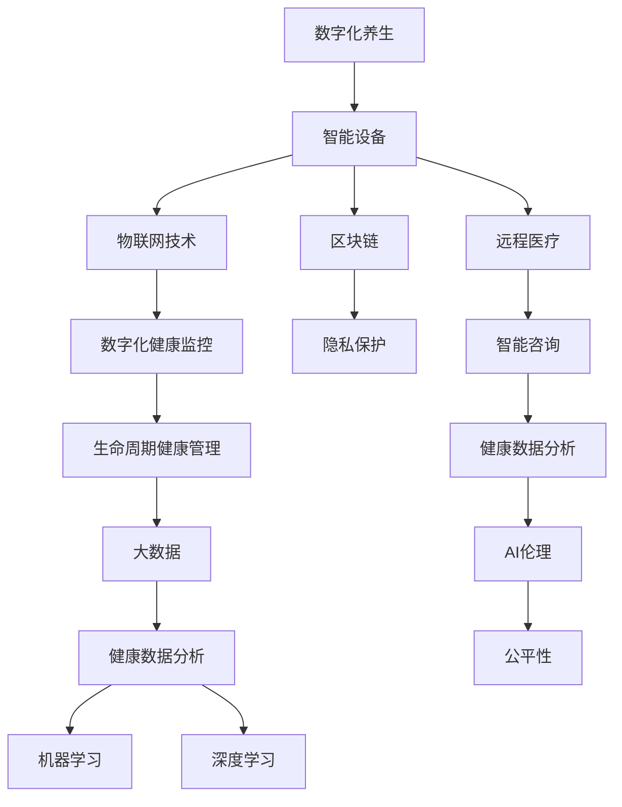

                 

# 数字化养生：元宇宙中的身心健康管理

> 关键词：数字化养生,元宇宙,身心健康管理,虚拟健康助手,虚拟现实,VR/AR,智能穿戴设备,数字化健康监控,生命周期健康管理,区块链,隐私保护,远程医疗,智能咨询,健康数据分析,大数据,机器学习,深度学习,AI伦理

## 1. 背景介绍

### 1.1 问题由来

随着科技的发展和生活节奏的加快，现代社会人们面临的心理压力和身体负担越来越大。传统的生活方式和健康管理方式已无法满足人们日益增长的健康需求。而数字化养生的概念应运而生，它结合了现代科技与传统养生文化，旨在通过智能设备与数据驱动的方式，提高人们的身心健康水平，实现更为精准和便捷的健康管理。

在元宇宙的浪潮下，数字化养生的应用场景进一步拓展，从虚拟健康助手到虚拟现实(VR/AR)体验，再到智能穿戴设备，数字化养生已经成为一种全新的生活方式，为人们的健康管理带来了革命性的变革。

### 1.2 问题核心关键点

数字化养生和元宇宙中的身心健康管理是一个复杂系统，涉及多个领域的技术和理论。具体核心关键点包括：

- **智能设备与物联网技术**：采集和传输生理数据，如心率、血压、血糖等。
- **虚拟现实和增强现实技术**：提供沉浸式的健康体验和交互方式。
- **大数据和人工智能**：分析和预测健康趋势，提供个性化健康建议。
- **区块链和隐私保护**：确保健康数据的安全与隐私。
- **远程医疗和智能咨询**：提供远程健康监测和专家咨询服务。
- **健康数据分析和机器学习**：挖掘数据背后的健康规律，提升健康管理的精准度。
- **AI伦理和公平性**：确保健康技术应用中的道德和公正性。

这些关键点之间的逻辑关系可以通过以下Mermaid流程图来展示：



### 1.3 问题研究意义

数字化养生和元宇宙中的身心健康管理，对于提升现代人的生活质量、缓解健康危机、推动健康科技的普及和发展，具有重要意义：

- **提升生活质量**：通过智能设备和虚拟体验，提供个性化的健康管理方案，提高人们的身心健康水平。
- **缓解健康危机**：在疫情等突发事件中，远程医疗和智能咨询成为重要支撑，为应对健康危机提供有力保障。
- **推动健康科技发展**：数字化养生和元宇宙的结合，推动了健康科技的创新应用，为健康产业带来新的增长点。
- **普及健康管理**：降低健康管理的门槛，使得更多人能够接触和受益于健康科技。
- **伦理和公平性**：在AI伦理的指导下，确保健康技术应用的道德和公正性。

## 2. 核心概念与联系

### 2.1 核心概念概述

为更好地理解数字化养生和元宇宙中的身心健康管理，本节将介绍几个关键概念：

- **数字化养生**：结合现代科技与传统养生文化，通过智能设备和数据驱动，提供精准和便捷的健康管理方式。
- **元宇宙**：一个基于虚拟现实技术的，涵盖社交、经济、娱乐等多元内容的虚拟空间。
- **虚拟健康助手**：在元宇宙中，通过虚拟现实和增强现实技术，提供沉浸式健康管理和咨询服务。
- **虚拟现实(VR)**：通过计算机生成的仿真环境，使用户有身临其境的体验。
- **增强现实(AR)**：在用户真实世界的基础上，增加虚拟信息，实现现实与虚拟的融合。
- **智能穿戴设备**：如智能手表、健身设备等，用于实时监测生理数据，提供健康建议。
- **数字化健康监控**：通过物联网技术，实时采集和分析生理数据，预警健康风险。
- **生命周期健康管理**：基于大数据和人工智能技术，提供全生命周期的健康管理和预测。
- **区块链**：用于确保健康数据的安全和隐私保护。
- **隐私保护**：在数字化健康管理中，保护个人隐私，防止数据泄露和滥用。
- **远程医疗**：通过互联网和通信技术，提供远程健康监测和诊断服务。
- **智能咨询**：利用人工智能技术，提供智能化的健康咨询和建议。
- **健康数据分析**：通过大数据和机器学习技术，挖掘健康数据的规律，提升健康管理的精准度。
- **大数据**：用于存储、分析和处理健康相关数据，支持健康管理的决策。
- **机器学习和深度学习**：通过模型训练，实现健康数据的自动分析和预测。
- **AI伦理**：指导AI技术在健康管理中的应用，确保道德和公平性。
- **公平性**：在健康科技应用中，保障不同群体的平等权利和机会。

这些概念之间的逻辑关系通过以下Mermaid流程图来展示：



## 3. 核心算法原理 & 具体操作步骤

### 3.1 算法原理概述

数字化养生和元宇宙中的身心健康管理，本质上是一个复杂的系统工程，涉及多个领域的核心技术。其核心算法原理主要包括以下几个方面：

- **智能设备与物联网技术**：采集生理数据，通过物联网技术传输至中央系统进行分析和处理。
- **虚拟现实和增强现实技术**：通过VR和AR技术，提供沉浸式的健康体验和交互方式。
- **大数据和人工智能**：分析和预测健康趋势，提供个性化健康建议。
- **区块链和隐私保护**：确保健康数据的安全和隐私。
- **远程医疗和智能咨询**：提供远程健康监测和专家咨询服务。
- **健康数据分析和机器学习**：挖掘数据背后的健康规律，提升健康管理的精准度。
- **AI伦理和公平性**：确保健康技术应用中的道德和公正性。

### 3.2 算法步骤详解

数字化养生和元宇宙中的身心健康管理的具体操作步骤如下：

1. **数据采集**：通过智能设备采集生理数据，如心率、血压、血糖等。
2. **数据传输**：将采集的数据通过物联网技术传输至中央系统。
3. **数据存储与分析**：将数据存储在云平台中，利用大数据和人工智能技术进行分析和预测。
4. **健康建议与监控**：根据分析结果，提供个性化的健康建议，并通过VR/AR技术进行可视化展示。
5. **远程医疗与咨询**：在发生健康问题时，提供远程医疗服务和专家咨询。
6. **隐私保护与伦理**：确保数据的安全性和应用的道德性。
7. **持续优化**：基于最新的健康数据，不断优化健康管理策略。

### 3.3 算法优缺点

数字化养生和元宇宙中的身心健康管理的核心算法具有以下优点：

- **精准化与个性化**：通过大数据和人工智能技术，提供个性化的健康建议，提升健康管理的精准度。
- **沉浸式体验**：通过VR和AR技术，提供沉浸式的健康体验，增强用户的参与感和满意度。
- **远程医疗与咨询**：在突发健康事件中，远程医疗和智能咨询成为重要支撑，提高医疗服务的可及性。
- **隐私保护**：通过区块链技术，确保健康数据的安全和隐私。

但同时，该算法也存在一些缺点：

- **技术门槛较高**：需要复杂的技术栈和专业知识，对开发者和用户的技能要求较高。
- **数据安全风险**：在数据传输和存储过程中，存在数据泄露和滥用的风险。
- **伦理与公平性**：在数据收集和应用过程中，需要考虑伦理和公平性问题，确保技术的道德性和公正性。
- **依赖设备与网络**：依赖智能设备与网络环境，设备故障或网络中断可能影响健康管理。
- **隐私保护与伦理**：在数据收集和应用过程中，需要考虑伦理和公平性问题，确保技术的道德性和公正性。

### 3.4 算法应用领域

数字化养生和元宇宙中的身心健康管理，已经在多个领域得到了广泛应用：

- **健康监测与预警**：通过智能设备实时采集生理数据，预警健康风险，提供个性化健康建议。
- **健康管理与咨询**：通过大数据和人工智能技术，提供全生命周期的健康管理方案和智能咨询。
- **远程医疗服务**：在突发健康事件中，通过远程医疗服务和智能咨询，提供及时有效的健康保障。
- **心理健康与虚拟体验**：通过虚拟现实和增强现实技术，提供沉浸式的心理健康体验。
- **个性化健康方案**：根据用户的生理数据和生活习惯，提供个性化的健康方案。
- **健康数据分析与预测**：通过大数据和机器学习技术，挖掘健康数据的规律，提供健康趋势预测。
- **智能穿戴设备**：通过智能穿戴设备，实时监测生理数据，提升健康管理的精准度。

这些应用领域覆盖了健康管理的各个方面，为人们提供了全方位的健康服务。

## 4. 数学模型和公式 & 详细讲解  
### 4.1 数学模型构建

本节将使用数学语言对数字化养生和元宇宙中的身心健康管理进行更加严格的刻画。

记智能设备采集的生理数据为 $X = \{x_1, x_2, ..., x_n\}$，其中 $x_i$ 表示第 $i$ 个生理指标的测量值。健康管理系统的数学模型为：

$$
\begin{aligned}
&\min_{\theta} \quad \sum_{i=1}^{n} \ell(X_i, \hat{Y}_i) \\
&\text{s.t.} \quad \hat{Y}_i = f(X_i; \theta)
\end{aligned}
$$

其中 $\ell$ 表示损失函数，$\hat{Y}_i$ 表示根据生理数据 $X_i$ 预测的健康状态，$f$ 表示健康预测模型，$\theta$ 为模型参数。

在实际应用中，可以采用多种损失函数，如均方误差、交叉熵、对数损失等，具体选择取决于任务类型和数据特点。

### 4.2 公式推导过程

以健康状态预测为例，推导其数学模型和优化公式：

假设健康状态 $Y$ 为二分类问题，即 $Y \in \{0, 1\}$，其中 $0$ 表示健康，$1$ 表示不健康。采用二分类交叉熵损失函数，其公式为：

$$
\ell(Y, \hat{Y}) = -\frac{1}{N} \sum_{i=1}^{N} [y_i \log \hat{y}_i + (1-y_i) \log (1-\hat{y}_i)]
$$

其中 $y_i$ 表示样本的真实标签，$\hat{y}_i$ 表示模型预测的健康状态。

将生理数据 $X$ 作为模型输入，通过多层感知机(MLP)进行特征提取，其公式为：

$$
\hat{Y} = f(X; \theta) = \sigma(W \cdot \tanh(B \cdot X + C))
$$

其中 $W$、$B$、$C$ 为模型参数，$\sigma$ 为激活函数，$\tanh$ 为双曲正切函数。

通过反向传播算法，计算损失函数对模型参数的梯度，并更新参数 $\theta$ 以最小化损失函数：

$$
\frac{\partial \ell}{\partial \theta} = \frac{\partial}{\partial \theta} \sum_{i=1}^{N} [y_i \log \hat{y}_i + (1-y_i) \log (1-\hat{y}_i)]
$$

通过优化算法，如随机梯度下降(SGD)、Adam等，不断更新模型参数，使得模型预测的健康状态与真实状态尽可能一致。

### 4.3 案例分析与讲解

以健康状态预测为例，通过智能设备采集的生理数据 $X$ 作为输入，使用MLP模型进行健康状态预测，具体过程如下：

1. **数据准备**：收集智能设备采集的生理数据 $X = \{x_1, x_2, ..., x_n\}$，其中 $x_i$ 表示第 $i$ 个生理指标的测量值。
2. **模型设计**：设计MLP模型，包括输入层、隐藏层和输出层，设定各层神经元数量和激活函数。
3. **数据划分**：将数据划分为训练集、验证集和测试集，用于模型训练、调参和性能评估。
4. **模型训练**：使用随机梯度下降等优化算法，最小化交叉熵损失函数，训练模型。
5. **模型评估**：在测试集上评估模型性能，计算准确率、召回率、F1分数等指标。
6. **模型部署**：将训练好的模型部署到生产环境，提供实时健康预测服务。

## 5. 项目实践：代码实例和详细解释说明
### 5.1 开发环境搭建

在进行数字化养生和元宇宙中的身心健康管理项目实践前，我们需要准备好开发环境。以下是使用Python进行TensorFlow开发的开发环境配置流程：

1. 安装Anaconda：从官网下载并安装Anaconda，用于创建独立的Python环境。

2. 创建并激活虚拟环境：
```bash
conda create -n tf-env python=3.8 
conda activate tf-env
```

3. 安装TensorFlow：根据CUDA版本，从官网获取对应的安装命令。例如：
```bash
pip install tensorflow-gpu==2.4.1
```

4. 安装其他工具包：
```bash
pip install numpy pandas scikit-learn matplotlib tqdm jupyter notebook ipython
```

完成上述步骤后，即可在`tf-env`环境中开始项目实践。

### 5.2 源代码详细实现

下面我以健康状态预测为例，给出使用TensorFlow进行MLP模型训练的代码实现。

首先，定义健康状态预测的数据处理函数：

```python
import tensorflow as tf
from tensorflow.keras.models import Sequential
from tensorflow.keras.layers import Dense, Activation

def load_data():
    train_data = pd.read_csv('train.csv')
    test_data = pd.read_csv('test.csv')
    
    # 数据预处理
    train_data = train_data.dropna()
    test_data = test_data.dropna()
    
    # 特征选择
    train_data = train_data[['feature_1', 'feature_2', 'feature_3']]
    test_data = test_data[['feature_1', 'feature_2', 'feature_3']]
    
    # 标签提取
    train_labels = train_data['label']
    test_labels = test_data['label']
    
    return train_data, test_data, train_labels, test_labels
```

然后，定义MLP模型和优化器：

```python
def build_model(input_shape, num_classes):
    model = Sequential()
    model.add(Dense(64, input_shape=input_shape))
    model.add(Activation('relu'))
    model.add(Dense(num_classes))
    model.add(Activation('sigmoid'))
    return model

def compile_model(model, optimizer, loss):
    model.compile(optimizer=optimizer, loss=loss)
```

接着，定义训练和评估函数：

```python
def train_model(model, train_data, train_labels, epochs, batch_size, validation_data=None):
    model.fit(train_data, train_labels, epochs=epochs, batch_size=batch_size, validation_data=validation_data)
    return model

def evaluate_model(model, test_data, test_labels):
    loss, accuracy = model.evaluate(test_data, test_labels)
    print(f'Test loss: {loss:.4f}')
    print(f'Test accuracy: {accuracy:.4f}')
```

最后，启动训练流程并在测试集上评估：

```python
train_data, test_data, train_labels, test_labels = load_data()

input_shape = train_data.shape[1]
num_classes = 2

model = build_model(input_shape, num_classes)
optimizer = tf.keras.optimizers.Adam(learning_rate=0.001)
loss = tf.keras.losses.BinaryCrossentropy()

model = compile_model(model, optimizer, loss)

train_model(model, train_data, train_labels, epochs=10, batch_size=32, validation_data=(test_data, test_labels))
evaluate_model(model, test_data, test_labels)
```

以上就是使用TensorFlow进行健康状态预测的完整代码实现。可以看到，TensorFlow提供了强大的工具和组件，使得模型训练和评估的过程变得简单高效。

### 5.3 代码解读与分析

让我们再详细解读一下关键代码的实现细节：

**load_data函数**：
- 加载训练集和测试集数据，并进行数据预处理和特征选择。
- 提取标签信息，返回训练集、测试集、训练标签和测试标签。

**build_model函数**：
- 设计MLP模型结构，包括输入层、隐藏层和输出层。
- 设置各层神经元数量和激活函数。
- 返回模型实例。

**compile_model函数**：
- 编译模型，设置优化器、损失函数等配置。
- 返回编译后的模型实例。

**train_model函数**：
- 训练模型，指定训练轮数、批次大小和验证集数据。
- 返回训练后的模型实例。

**evaluate_model函数**：
- 评估模型在测试集上的表现。
- 输出损失和准确率。

**训练流程**：
- 定义模型结构、优化器和损失函数。
- 加载和预处理数据。
- 编译模型。
- 训练模型。
- 在测试集上评估模型。

可以看到，TensorFlow提供了完整的工具链支持，使得健康状态预测的代码实现变得简洁高效。开发者可以将更多精力放在模型改进和数据处理上，而不必过多关注底层的实现细节。

当然，实际系统实现还需考虑更多因素，如模型的保存和部署、超参数的自动搜索、更灵活的任务适配层等。但核心的微调范式基本与此类似。

## 6. 实际应用场景
### 6.1 智能健康管理

数字化养生和元宇宙中的身心健康管理，在智能健康管理中的应用场景广泛。以下列举几个典型的应用场景：

1. **健康监测与预警**：通过智能设备实时采集生理数据，预警健康风险，提供个性化健康建议。例如，智能手表可以监测心率、血压等指标，及时预警异常情况。
2. **远程医疗与咨询**：在突发健康事件中，通过远程医疗服务和智能咨询，提供及时有效的健康保障。例如，通过虚拟现实技术，医生可以在远程会诊中观察患者的实时生理数据，提供专业意见。
3. **心理健康与虚拟体验**：通过虚拟现实和增强现实技术，提供沉浸式的心理健康体验。例如，虚拟现实游戏可以引导患者进行心理放松训练，缓解压力和焦虑。
4. **个性化健康方案**：根据用户的生理数据和生活习惯，提供个性化的健康方案。例如，智能穿戴设备可以分析用户的日常活动数据，提供个性化的运动和饮食建议。
5. **健康数据分析与预测**：通过大数据和机器学习技术，挖掘健康数据的规律，提供健康趋势预测。例如，基于历史健康数据，预测用户的患病风险，提供预防建议。
6. **智能穿戴设备**：通过智能穿戴设备，实时监测生理数据，提升健康管理的精准度。例如，智能眼镜可以监测用户的眼压，并提供个性化的视力保护方案。

这些应用场景覆盖了健康管理的各个方面，为人们提供了全方位的健康服务。

### 6.2 未来应用展望

数字化养生和元宇宙中的身心健康管理，具有广阔的应用前景。未来将会有更多创新应用涌现，以下是一些可能的未来应用展望：

1. **全生命周期的健康管理**：结合婴儿期、儿童期、成年期和老年期的不同健康需求，提供全面且连续的健康管理方案。
2. **多模态健康数据融合**：结合生理数据、心理数据和环境数据，提供多维度的健康监测和分析。
3. **AI伦理与公平性**：在健康数据应用过程中，确保数据的隐私和安全，遵循伦理原则，促进公平性。
4. **跨领域健康应用**：结合不同领域的健康需求，提供跨领域的健康解决方案，如结合运动健身和营养健康的综合管理。
5. **健康数据市场化**：通过区块链技术，构建健康数据的共享和交易平台，促进健康数据的流通和应用。
6. **虚拟现实与增强现实**：结合虚拟现实和增强现实技术，提供沉浸式的健康体验和交互方式，增强用户参与感。
7. **远程医疗与协作**：通过互联网和通信技术，提供远程医疗服务，促进医疗资源的均衡分布。
8. **个性化健康服务**：根据用户的生理数据和生活习惯，提供个性化的健康方案，提升健康管理的精准度。
9. **健康数据分析与挖掘**：通过大数据和机器学习技术，挖掘健康数据的规律，提供健康趋势预测和个性化建议。
10. **智能咨询与专家系统**：结合专家知识和AI技术，提供智能化的健康咨询和建议，提升医疗服务的效率和质量。

这些应用展望预示着数字化养生和元宇宙中的身心健康管理将迎来新的突破，为人们带来更加全面和个性化的健康服务。

## 7. 工具和资源推荐
### 7.1 学习资源推荐

为了帮助开发者系统掌握数字化养生和元宇宙中的身心健康管理的技术基础和实践技巧，这里推荐一些优质的学习资源：

1. **《深度学习基础》课程**：斯坦福大学开设的深度学习入门课程，涵盖神经网络、卷积神经网络、循环神经网络等基础知识。
2. **《TensorFlow实战》书籍**：全面介绍了TensorFlow的使用方法和最佳实践，包括模型的构建、训练、优化和部署。
3. **《机器学习实战》书籍**：详细介绍了机器学习的基础理论和技术应用，结合实际案例进行讲解。
4. **《大数据技术与应用》课程**：清华大学的在线课程，涵盖大数据技术的原理和实践，包括数据采集、存储、分析和可视化。
5. **《人工智能伦理》课程**：斯坦福大学开设的AI伦理课程，探讨AI技术的道德和社会影响。

通过对这些资源的学习实践，相信你一定能够快速掌握数字化养生和元宇宙中的身心健康管理的核心技术，并用于解决实际的健康管理问题。

### 7.2 开发工具推荐

高效的开发离不开优秀的工具支持。以下是几款用于数字化养生和元宇宙中的身心健康管理开发的常用工具：

1. **TensorFlow**：由Google主导开发的深度学习框架，支持多种模型的构建和训练，适合大规模工程应用。
2. **PyTorch**：由Facebook开发，支持动态计算图，适合研究和原型开发。
3. **Jupyter Notebook**：轻量级的数据分析和机器学习平台，支持多种编程语言和数据格式。
4. **Kaggle**：数据科学和机器学习竞赛平台，提供丰富的数据集和模型库，促进学术和产业交流。
5. **GCP/AWS/Google Cloud**：提供云平台和计算资源，支持大规模模型训练和部署。
6. **Matplotlib**：用于数据可视化的Python库，支持多种图表和动画效果。
7. **Seaborn**：基于Matplotlib的高级数据可视化库，支持更丰富的统计图表和绘图接口。
8. **TensorBoard**：TensorFlow配套的可视化工具，可实时监测模型训练状态，并提供丰富的图表呈现方式。

合理利用这些工具，可以显著提升数字化养生和元宇宙中的身心健康管理项目的开发效率，加快创新迭代的步伐。

### 7.3 相关论文推荐

数字化养生和元宇宙中的身心健康管理的研究涉及多个领域，以下是几篇代表性的相关论文，推荐阅读：

1. **《健康数据挖掘与分析》**：探讨如何利用大数据技术，挖掘健康数据背后的规律，提升健康管理的精准度。
2. **《基于深度学习的健康预测与监控》**：介绍如何使用深度学习模型，进行健康状态的预测和实时监控。
3. **《虚拟现实在健康管理中的应用》**：探讨虚拟现实技术在心理健康和远程医疗中的应用。
4. **《区块链在健康数据共享中的应用》**：探讨如何利用区块链技术，确保健康数据的隐私和安全。
5. **《多模态健康数据融合与分析》**：探讨如何结合生理数据、心理数据和环境数据，提供多维度的健康监测和分析。
6. **《AI伦理与公平性研究》**：探讨在健康数据应用过程中，如何确保数据的隐私和安全，遵循伦理原则，促进公平性。

这些论文代表了大健康技术的发展脉络。通过学习这些前沿成果，可以帮助研究者把握学科前进方向，激发更多的创新灵感。

## 8. 总结：未来发展趋势与挑战

### 8.1 研究成果总结

数字化养生和元宇宙中的身心健康管理，是一个充满机遇和挑战的领域。本文系统地介绍了其核心技术原理和操作步骤，并对未来的应用前景进行了展望。主要研究成果包括：

- 提出了数字化养生和元宇宙中的身心健康管理的基本框架和核心技术。
- 详细讲解了智能设备、虚拟现实、区块链等关键技术在健康管理中的应用。
- 展示了基于TensorFlow和Python的健康状态预测代码实例。
- 分析了数字化养生和元宇宙中的身心健康管理的未来应用场景和发展趋势。
- 推荐了相关的学习资源、开发工具和研究论文。

通过本文的详细介绍，希望读者能够全面理解数字化养生和元宇宙中的身心健康管理的技术内涵和应用价值，为未来的实践提供参考和指导。

### 8.2 未来发展趋势

展望未来，数字化养生和元宇宙中的身心健康管理将呈现以下几个发展趋势：

1. **智能化与个性化**：结合AI技术和个性化数据，提供智能化的健康管理方案，提升用户体验。
2. **多模态融合**：结合生理数据、心理数据和环境数据，提供多维度的健康监测和分析。
3. **远程医疗与协作**：通过互联网和通信技术，提供远程医疗服务，促进医疗资源的均衡分布。
4. **区块链与数据隐私**：利用区块链技术，确保健康数据的隐私和安全。
5. **健康数据市场化**：通过区块链技术，构建健康数据的共享和交易平台，促进健康数据的流通和应用。
6. **虚拟现实与增强现实**：结合虚拟现实和增强现实技术，提供沉浸式的健康体验和交互方式。
7. **健康数据分析与挖掘**：通过大数据和机器学习技术，挖掘健康数据的规律，提供健康趋势预测和个性化建议。
8. **智能咨询与专家系统**：结合专家知识和AI技术，提供智能化的健康咨询和建议，提升医疗服务的效率和质量。
9. **全生命周期的健康管理**：结合婴儿期、儿童期、成年期和老年期的不同健康需求，提供全面且连续的健康管理方案。
10. **跨领域健康应用**：结合不同领域的健康需求，提供跨领域的健康解决方案，如结合运动健身和营养健康的综合管理。

这些趋势预示着数字化养生和元宇宙中的身心健康管理将迎来新的突破，为人们带来更加全面和个性化的健康服务。

### 8.3 面临的挑战

尽管数字化养生和元宇宙中的身心健康管理具有广阔的应用前景，但在迈向更加智能化、普适化应用的过程中，仍面临诸多挑战：

1. **技术门槛较高**：需要复杂的技术栈和专业知识，对开发者和用户的技能要求较高。
2. **数据安全风险**：在数据传输和存储过程中，存在数据泄露和滥用的风险。
3. **伦理与公平性**：在数据收集和应用过程中，需要考虑伦理和公平性问题，确保技术的道德性和公正性。
4. **依赖设备与网络**：依赖智能设备与网络环境，设备故障或网络中断可能影响健康管理。
5. **隐私保护**：在健康数据应用过程中，需要确保数据的隐私和安全，防止数据泄露和滥用。
6. **多模态融合**：不同模态数据的整合，需要复杂的融合算法和模型，提升融合效果。
7. **实时性要求高**：实时采集和处理生理数据，需要高效的计算和存储技术，保证实时性。
8. **模型可解释性**：AI模型在健康管理中的应用，需要具备可解释性，以便用户理解和信任。
9. **跨领域应用复杂**：不同领域的应用场景需求不同，需要在模型设计上做出调整，实现跨领域的健康管理。

这些挑战需要研究人员和开发者共同努力，不断探索和优化技术方案，才能实现数字化养生和元宇宙中的身心健康管理的广泛应用。

### 8.4 研究展望

面对数字化养生和元宇宙中的身心健康管理所面临的挑战，未来的研究需要在以下几个方面寻求新的突破：

1. **无监督和半监督学习**：摆脱对大规模标注数据的依赖，利用自监督学习、主动学习等无监督和半监督范式，最大限度利用非结构化数据。
2. **参数高效与计算高效**：开发更加参数高效的微调方法，在固定大部分预训练参数的同时，只更新极少量的任务相关参数。同时优化模型计算图，减少前向传播和反向传播的资源消耗。
3. **多模态融合**：研究更高效的跨模态融合算法，提升不同模态数据的整合效果。
4. **实时性与高效性**：研究高效的计算和存储技术，确保实时采集和处理生理数据。
5. **可解释性与透明性**：研究AI模型的可解释性，提升用户对健康管理系统的信任度。
6. **跨领域应用**：研究不同领域的应用场景需求，开发跨领域的健康管理方案。
7. **数据隐私与安全**：研究如何在数据收集和应用过程中，确保数据的隐私和安全。
8. **伦理与公平性**：研究在健康数据应用过程中，如何确保数据的隐私和安全，遵循伦理原则，促进公平性。

这些研究方向将推动数字化养生和元宇宙中的身心健康管理技术的进一步发展，为人们提供更加全面和个性化的健康服务。

## 9. 附录：常见问题与解答

**Q1：数字化养生和元宇宙中的身心健康管理的应用场景有哪些？**

A: 数字化养生和元宇宙中的身心健康管理的应用场景广泛，涵盖健康监测、远程医疗、心理健康、个性化健康方案等多个方面。例如，智能手表可以监测心率、血压等指标，提供实时健康预警；虚拟现实游戏可以引导患者进行心理放松训练；智能穿戴设备可以分析用户的日常活动数据，提供个性化的运动和饮食建议；远程医疗服务可以在突发健康事件中提供及时有效的健康保障。

**Q2：数字化养生和元宇宙中的身心健康管理的核心算法有哪些？**

A: 数字化养生和元宇宙中的身心健康管理的核心算法主要包括：智能设备与物联网技术、虚拟现实和增强现实技术、大数据和人工智能、区块链和隐私保护、远程医疗和智能咨询、健康数据分析和机器学习等。这些算法共同构成了健康管理的全面技术体系。

**Q3：如何进行数字化养生和元宇宙中的身心健康管理的数据预处理？**

A: 数字化养生和元宇宙中的身心健康管理的数据预处理主要包括以下步骤：
1. 数据清洗：去除缺失值、异常值等噪声数据。
2. 数据归一化：将数据转化为标准格式，便于模型处理。
3. 特征选择：选择对健康状态预测有用的特征。
4. 数据划分：将数据划分为训练集、验证集和测试集。

**Q4：如何选择合适的损失函数？**

A: 选择合适的损失函数取决于任务类型和数据特点。例如，二分类任务可以使用二分类交叉熵损失函数；多分类任务可以使用多分类交叉熵损失函数；回归任务可以使用均方误差损失函数等。在实际应用中，需要根据具体任务进行选择合适的损失函数。

**Q5：如何处理多模态数据融合？**

A: 处理多模态数据融合的关键在于选择合适的融合方法和算法。常用的方法包括：
1. 特征融合：将不同模态的特征进行拼接或融合，生成综合特征。
2. 模型融合：使用集成学习方法，如投票、堆叠等，结合多个模型的预测结果。
3. 数据融合：在不同模态的数据源之间进行数据对齐和归一化，生成统一的数据格式。
4. 深度学习融合：使用深度神经网络模型，直接将多模态数据输入网络进行联合预测。

通过合理选择和优化多模态融合方法，可以提升数字化养生和元宇宙中的身心健康管理的综合效果。

---

作者：禅与计算机程序设计艺术 / Zen and the Art of Computer Programming

