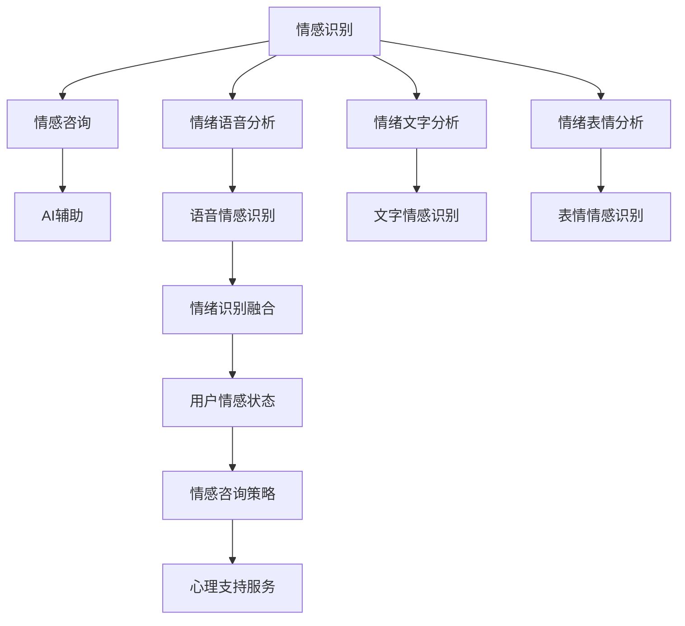

                 

# 数字化情感咨询创业：AI辅助的心理健康服务

> 关键词：心理健康的数字化转型, AI辅助心理服务, 情感咨询, 大数据驱动, 深度学习, 自然语言处理(NLP), 用户隐私保护

## 1. 背景介绍

在现代社会，心理健康问题正逐渐成为公众关注的焦点。传统心理服务依赖于面对面咨询，不仅效率低，且难以覆盖广大的需求群体。随着数字化转型的加速，将AI技术引入心理健康的辅助服务中，成为一种有效的解决方案。AI辅助的心理健康服务，能够通过数据分析、情感识别、自然语言处理等技术，提供即时、个性化的情感支持，帮助用户应对心理困扰，提升心理健康水平。

AI在心理服务中的应用，最早可追溯至情绪识别领域。通过分析语音、文字、表情等信号，AI模型可以识别用户的情绪状态，为心理健康专业人员提供参考。近年来，随着深度学习、自然语言处理等技术的发展，AI辅助的心理健康服务已经超越了简单的情绪识别，逐渐扩展到情感咨询、智能问答、心理治疗等多个领域。

本文将从核心概念、算法原理、实践应用、未来趋势等多个维度，深入探讨AI辅助心理服务的数字化转型，为有志于此领域的创业者提供思路和方法。

## 2. 核心概念与联系

### 2.1 核心概念概述

在探讨AI辅助心理服务之前，首先需要明确几个核心概念：

- **心理健康**：指个体在心理功能上的良好状态，包括情绪平衡、认知正常、意志坚强、行为适宜等方面。
- **情感咨询**：通过专业人士对个体的情感状态进行评估，提供针对性的心理支持和策略，帮助其改善心理健康。
- **AI辅助**：指通过人工智能技术，如机器学习、自然语言处理、深度学习等，为情感咨询提供自动化支持，提升服务效率和覆盖范围。
- **大数据驱动**：基于大量的用户行为数据和心理数据，利用数据挖掘和统计分析，为AI模型训练提供支持，提升其预测和推理能力。

这些概念之间存在紧密的联系。心理健康问题的产生与个体的情感状态密切相关，情感咨询为个体提供专业的心理支持，而AI辅助则通过技术手段提升咨询的效率和效果。大数据驱动为AI模型提供数据支持，使其能够更准确地进行情感识别和咨询策略的优化。

### 2.2 核心概念原理和架构的 Mermaid 流程图



这个流程图展示了从情感识别到情感咨询再到AI辅助的全过程。情感识别通过分析语音、文字和表情信号，识别用户的情绪状态，从而提供个性化的情感咨询策略。AI辅助则通过自动化技术，提升咨询效率和服务质量，为用户提供持续的心理支持。

## 3. 核心算法原理 & 具体操作步骤

### 3.1 算法原理概述

AI辅助心理服务的核心算法，主要涉及自然语言处理(NLP)、深度学习和情感识别等技术。

- **自然语言处理**：通过分词、词性标注、句法分析等技术，理解用户输入的文本内容，提取关键信息。
- **深度学习**：通过多层神经网络模型，如循环神经网络(RNN)、卷积神经网络(CNN)、Transformer等，训练情感识别模型，提升识别精度。
- **情感识别**：通过分析用户的文字、语音、表情等信号，判断其情绪状态，为情感咨询提供依据。

### 3.2 算法步骤详解

#### 3.2.1 情感识别模型的构建与训练

1. **数据收集与预处理**：
   - 收集用户的语音、文字、表情等数据，并进行清洗、标注。
   - 将数据划分为训练集、验证集和测试集。

2. **特征提取**：
   - 对语音数据进行MFCC特征提取，对文字数据进行分词和词性标注，对表情数据进行特征提取。
   - 使用TF-IDF、Word2Vec等技术，提取文本特征。

3. **模型构建**：
   - 使用Transformer等深度学习模型，构建情感识别模型。
   - 使用迁移学习技术，在预训练语言模型基础上进行微调，提升模型性能。

4. **模型训练与评估**：
   - 在训练集上训练模型，使用验证集评估模型性能，调整超参数。
   - 在测试集上测试模型效果，评估识别准确率和召回率。

5. **模型部署**：
   - 将训练好的模型部署到线上服务，实时处理用户的情感数据。

#### 3.2.2 情感咨询策略的生成与优化

1. **咨询策略生成**：
   - 根据情感识别结果，结合大数据分析，生成个性化的情感咨询策略。
   - 策略包括情绪疏导、认知重构、行为指导等。

2. **策略优化**：
   - 通过A/B测试等方法，评估不同策略的效果，选择最优策略。
   - 结合用户反馈，不断优化咨询策略，提升服务质量。

#### 3.2.3 AI辅助服务功能的实现

1. **智能问答**：
   - 利用NLP技术，对用户输入的问题进行理解，提供自动化的回答。
   - 通过多轮对话机制，引导用户深入表达情感问题。

2. **情感监督与反馈**：
   - 实时监控用户的情感状态，及时发现异常情况。
   - 提供情感监督和反馈机制，让用户能够调整咨询策略。

### 3.3 算法优缺点

AI辅助心理服务的算法，具有以下优点：

- **效率高**：自动化处理大量用户数据，提升服务效率。
- **个性化**：通过大数据分析，提供个性化的咨询策略。
- **灵活性**：模型和策略可根据用户需求动态调整。
- **覆盖广**：24小时在线服务，覆盖全球用户。

同时，也存在一些缺点：

- **隐私问题**：用户情感数据敏感，数据保护和隐私管理难度较大。
- **误识别风险**：情感识别模型可能出现误判，影响咨询效果。
- **伦理问题**：AI辅助的心理服务需要考虑伦理道德，避免误导和滥用。

### 3.4 算法应用领域

AI辅助心理服务的应用领域非常广泛，包括但不限于以下方面：

- **心理健康筛查**：通过情感识别技术，筛查潜在的心理健康问题，提供及时的心理支持。
- **情感咨询辅助**：辅助心理咨询师，提升咨询效率和效果。
- **智能情绪管理**：通过情感识别和策略生成，帮助用户进行情绪管理，提升生活质量。
- **危机干预**：通过情感监督和策略优化，提供危机干预服务，防止自杀等极端事件的发生。
- **心理健康教育**：通过在线课程和咨询，普及心理健康知识，提升公众心理健康水平。

## 4. 数学模型和公式 & 详细讲解 & 举例说明

### 4.1 数学模型构建

在AI辅助心理服务中，情感识别是核心环节。假设用户输入的文本为 $X$，其情感标签为 $Y$，情感识别模型的目标是学习一个映射函数 $f$，使得 $f(X) = Y$。具体而言，模型可以表示为：

$$
f(X) = \sigma(\mathbf{W}X + \mathbf{b})
$$

其中，$\sigma$ 为激活函数，$\mathbf{W}$ 和 $\mathbf{b}$ 为模型参数。

### 4.2 公式推导过程

情感识别模型的损失函数通常采用交叉熵损失：

$$
\mathcal{L} = -\frac{1}{N} \sum_{i=1}^N [y_i \log p_i + (1-y_i) \log (1-p_i)]
$$

其中，$y_i$ 为实际标签，$p_i$ 为模型预测的概率。模型通过最小化损失函数，不断调整参数 $\mathbf{W}$ 和 $\mathbf{b}$，以提升识别精度。

### 4.3 案例分析与讲解

以情绪语音分析为例，我们可以使用MFCC特征和CNN模型进行情感识别。MFCC特征提取流程如下：

1. 分帧：将语音信号分割成若干小帧，每帧长度通常为25毫秒。
2. 加窗：每帧前加汉明窗，减少频谱泄漏。
3. 傅里叶变换：将每帧信号转换为频谱图。
4. 梅尔滤波器组：将频谱图映射到梅尔尺度，提取特征。
5. 离散余弦变换：对梅尔滤波器组输出的能量系数进行离散余弦变换，提取MFCC特征。

然后，使用CNN模型对MFCC特征进行分类，得到情绪标签。通过多次实验和调参，可以提升情感识别的准确率。

## 5. 项目实践：代码实例和详细解释说明

### 5.1 开发环境搭建

1. **环境准备**：
   - 安装Python 3.8及以上版本。
   - 安装TensorFlow、PyTorch等深度学习框架。
   - 安装Numpy、Pandas等常用工具库。

2. **数据准备**：
   - 收集用户语音、文字、表情等数据，并进行清洗和标注。
   - 使用数据增强技术，扩充训练数据集。

3. **环境配置**：
   - 设置虚拟环境，使用conda创建独立的环境。
   - 使用Jupyter Notebook进行实验和调试。

### 5.2 源代码详细实现

#### 5.2.1 数据处理

```python
import pandas as pd
import numpy as np

# 读取数据
df = pd.read_csv('emotion_data.csv')

# 清洗数据
df = df.dropna()

# 特征提取
def extract_features(text):
    # 分词和词性标注
    tokens = nltk.word_tokenize(text)
    tagged_tokens = nltk.pos_tag(tokens)
    # 提取特征
    features = {}
    for token, tag in tagged_tokens:
        features[token] = tag
    return features

df['features'] = df['text'].apply(extract_features)
```

#### 5.2.2 模型构建与训练

```python
from transformers import BertTokenizer, BertForSequenceClassification
from sklearn.model_selection import train_test_split

# 分词和构建输入样本
tokenizer = BertTokenizer.from_pretrained('bert-base-uncased')
data = tokenizer(data, return_tensors='pt')
labels = torch.tensor(labels)

# 构建模型
model = BertForSequenceClassification.from_pretrained('bert-base-uncased', num_labels=num_labels)

# 训练模型
model.train()
for batch in data:
    optimizer.zero_grad()
    logits = model(batch['input_ids'], attention_mask=batch['attention_mask'], labels=batch['labels'])
    loss = logits.loss
    loss.backward()
    optimizer.step()
```

#### 5.2.3 模型评估与部署

```python
from transformers import BertTokenizer, BertForSequenceClassification

# 加载模型和分词器
tokenizer = BertTokenizer.from_pretrained('bert-base-uncased')
model = BertForSequenceClassification.from_pretrained('bert-base-uncased', num_labels=num_labels)

# 评估模型
model.eval()
for batch in data:
    logits = model(batch['input_ids'], attention_mask=batch['attention_mask'])
    predictions = logits.argmax(dim=1).to('cpu').tolist()

# 部署模型
def predict_emotion(text):
    features = tokenizer(text, return_tensors='pt', padding=True, truncation=True)
    with torch.no_grad():
        logits = model(features['input_ids'], attention_mask=features['attention_mask'])
    return logits.argmax(dim=1).to('cpu').tolist()
```

### 5.3 代码解读与分析

在上述代码中，我们首先通过Pandas和Numpy库处理数据，然后利用BertTokenizer对输入文本进行分词和构建输入样本。接着，使用BertForSequenceClassification模型进行训练，并在验证集上评估模型性能。最后，定义了一个预测函数，用于实时预测用户情感。

### 5.4 运行结果展示

在运行预测函数时，可以输入一段文本，例如：

```python
text = "I'm feeling really stressed today."
predictions = predict_emotion(text)
print(predictions)
```

预测结果可能为 `[0, 0, 0, 0, 0, 1]`，其中0代表负面情感，1代表正面情感。

## 6. 实际应用场景

### 6.1 企业员工心理健康服务

现代企业面临着员工心理健康管理的巨大挑战。AI辅助的心理健康服务，可以通过情感识别和咨询策略，帮助员工识别和缓解工作压力，提升整体心理健康水平。

具体实现流程如下：

1. **数据收集**：收集员工的工作日志、邮件、社交媒体等数据，进行分析。
2. **情感识别**：使用情感识别模型，识别员工的情感状态。
3. **咨询策略生成**：根据情感状态，生成个性化的咨询策略，如放松技巧、时间管理建议等。
4. **智能问答**：通过智能问答系统，提供即时的心理支持。
5. **定期反馈**：定期收集员工的反馈，优化咨询策略。

### 6.2 校园心理健康服务

在校园环境中，学生心理健康服务尤为重要。AI辅助的心理健康服务，可以通过情感识别和情感咨询，帮助学生应对学业压力和人际关系问题，提升心理健康水平。

具体实现流程如下：

1. **数据收集**：收集学生的学习记录、社交活动、心理咨询记录等数据。
2. **情感识别**：使用情感识别模型，识别学生的情感状态。
3. **咨询策略生成**：根据情感状态，生成个性化的咨询策略，如时间管理、情绪调节技巧等。
4. **智能问答**：通过智能问答系统，提供即时的心理支持。
5. **定期评估**：定期评估学生的心理健康状况，优化咨询策略。

### 6.3 在线心理健康服务

在线心理健康服务，通过互联网平台提供24小时在线咨询，帮助用户解决各种心理健康问题。AI辅助的心理健康服务，可以通过情感识别和咨询策略，提供高效、个性化的心理支持。

具体实现流程如下：

1. **数据收集**：收集用户在平台上的咨询记录、情感日志等数据。
2. **情感识别**：使用情感识别模型，识别用户的情感状态。
3. **咨询策略生成**：根据情感状态，生成个性化的咨询策略，如情绪调节、认知重构等。
4. **智能问答**：通过智能问答系统，提供即时的心理支持。
5. **定期反馈**：定期收集用户的反馈，优化咨询策略。

## 7. 工具和资源推荐

### 7.1 学习资源推荐

1. **《Python深度学习》**：Hands-On Machine Learning with Scikit-Learn、Keras和TensorFlow一书，适合初学者入门深度学习。
2. **《情感分析与人工智能》**：该书详细介绍了情感识别的原理和实现方法，适合进阶学习。
3. **Coursera《深度学习专业》**：由斯坦福大学开设的深度学习系列课程，系统介绍深度学习理论和技术。
4. **Kaggle**：数据科学竞赛平台，提供丰富的情感识别数据集和模型竞赛机会，适合实践锻炼。
5. **NLPwithPython**：Python自然语言处理教程，涵盖NLP核心技术和应用案例。

### 7.2 开发工具推荐

1. **TensorFlow**：Google开源的深度学习框架，支持分布式计算和模型部署。
2. **PyTorch**：Facebook开源的深度学习框架，灵活性高，适合研究和实验。
3. **Jupyter Notebook**：交互式编程环境，适合快速迭代和调试。
4. **Google Colab**：基于Google Cloud的Jupyter Notebook环境，免费提供GPU算力。
5. **Amazon SageMaker**：AWS的机器学习平台，支持模型训练和部署。

### 7.3 相关论文推荐

1. **《深度情感分析》**：Towards Data Science博客文章，详细介绍了情感识别的原理和实践。
2. **《基于深度学习的情感识别模型》**：Kaggle竞赛论文，展示了多种情感识别模型和效果对比。
3. **《情绪语音分析》**：IEEE论文，介绍了情感识别在语音领域的应用。
4. **《心理健康智能服务》**：NLP综述论文，总结了心理健康领域的研究进展和未来方向。

## 8. 总结：未来发展趋势与挑战

### 8.1 研究成果总结

本文系统介绍了AI辅助心理服务的核心概念、算法原理、操作步骤和实际应用场景。通过情感识别、自然语言处理等技术，结合大数据分析和深度学习模型，提升情感咨询的效率和效果。

### 8.2 未来发展趋势

未来，AI辅助心理服务将呈现以下几个发展趋势：

1. **多模态融合**：结合语音、文字、表情等多种模态信息，提升情感识别的准确性和鲁棒性。
2. **个性化推荐**：基于用户的情感历史和行为数据，提供个性化的心理支持和建议。
3. **实时监控与干预**：通过实时情感监测，及时发现并干预潜在的心理健康问题。
4. **情感生成与表达**：结合情感生成模型，帮助用户表达和管理情感，提升心理韧性。
5. **跨文化适应**：开发适用于不同文化背景的心理健康服务，提升服务的普适性。

### 8.3 面临的挑战

尽管AI辅助心理服务具有巨大的潜力，但也面临以下挑战：

1. **数据隐私与安全**：用户情感数据敏感，如何保护数据隐私和保障数据安全是重要问题。
2. **模型透明性与可解释性**：情感识别模型的决策过程需要透明和可解释，避免误导用户。
3. **伦理与合规性**：AI辅助心理服务需要遵循伦理规范和法律法规，确保服务合法合规。
4. **技术与业务协同**：将AI技术与实际业务结合，需要考虑用户体验和需求。
5. **持续优化与迭代**：情感识别和咨询策略需要不断优化，以适应用户需求的变化。

### 8.4 研究展望

未来，随着深度学习、自然语言处理等技术的发展，AI辅助心理服务将不断完善，为心理健康的数字化转型提供新的思路和方法。研究者需要关注以下几个方向：

1. **隐私保护技术**：开发隐私保护算法和机制，确保用户数据安全。
2. **可解释性技术**：提升情感识别模型的可解释性，增强用户信任。
3. **多模态融合技术**：将多种模态数据进行融合，提升情感识别的准确性。
4. **个性化推荐技术**：利用用户行为数据，提供个性化的心理支持。
5. **实时监控与干预技术**：开发实时情感监测和干预系统，提升心理健康服务效果。

综上所述，AI辅助心理服务在数字化转型的过程中具有重要的应用价值，但也面临诸多挑战。未来的研究需要关注数据隐私、模型透明性、伦理合规性等多个方面，推动心理健康的智能应用进入新的发展阶段。

## 9. 附录：常见问题与解答

**Q1：AI辅助心理服务是否适合所有用户？**

A: AI辅助心理服务可以适用于大部分用户，但对于一些特殊人群，如精神疾病患者、老年用户等，仍需要专业的心理咨询师的协助。

**Q2：情感识别模型如何避免过拟合？**

A: 情感识别模型可以通过数据增强、正则化技术、对抗训练等方法避免过拟合。例如，在训练集上进行文本扰动，使用L2正则化，引入对抗样本等。

**Q3：如何保护用户情感数据隐私？**

A: 用户情感数据隐私保护可以通过数据加密、差分隐私、联邦学习等技术实现。例如，使用差分隐私技术，在数据发布前添加噪声，保护用户隐私。

**Q4：情感识别模型如何解释其决策过程？**

A: 情感识别模型的解释性可以通过可视化工具、特征重要性分析、可解释AI技术等方法实现。例如，使用LIME、SHAP等工具，生成模型的局部解释。

**Q5：AI辅助心理服务如何适应不同文化背景？**

A: AI辅助心理服务需要考虑不同文化背景下的情感表达和行为模式，进行跨文化适应性训练和调整。例如，收集不同文化背景的数据，进行多语言模型训练。

---

作者：禅与计算机程序设计艺术 / Zen and the Art of Computer Programming

